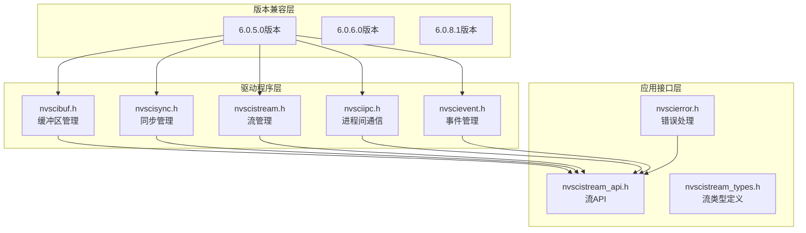
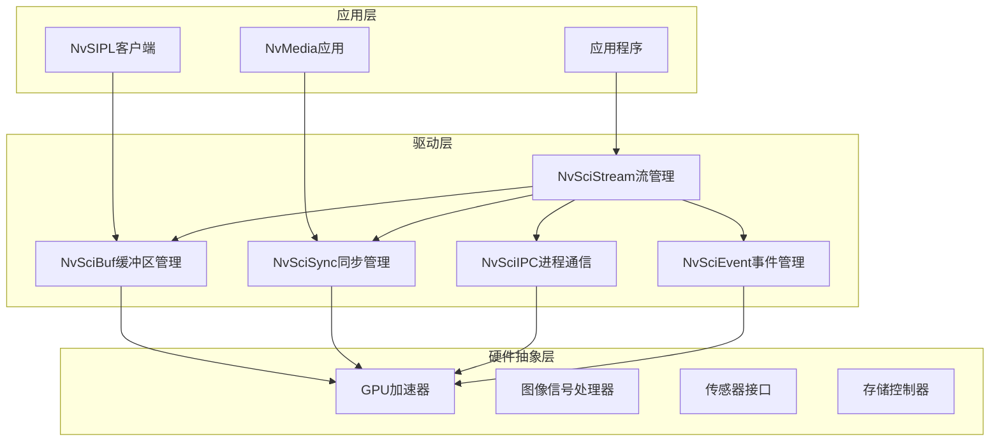
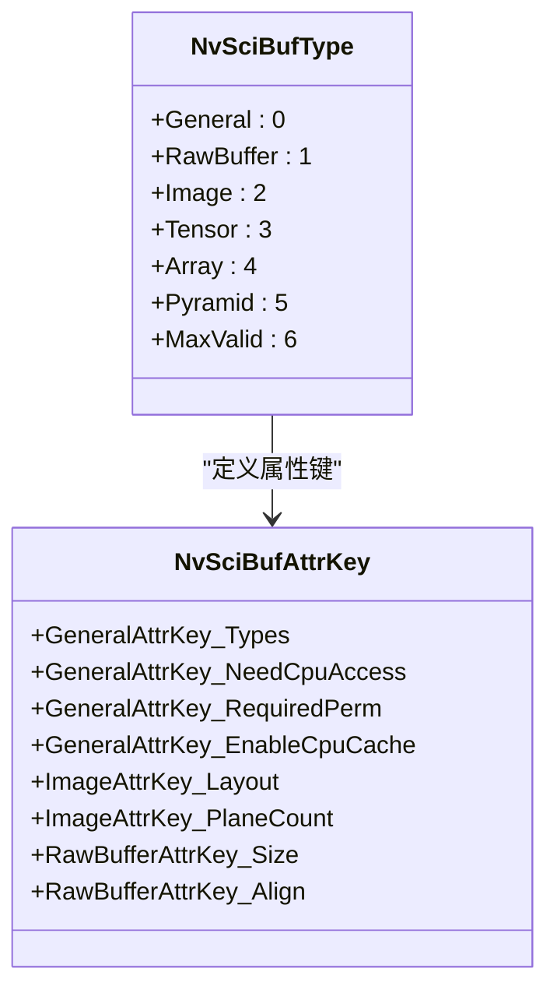
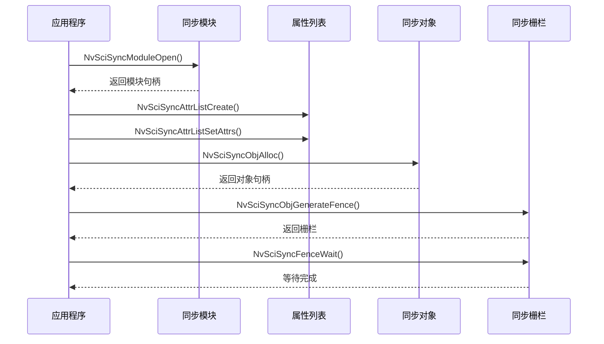
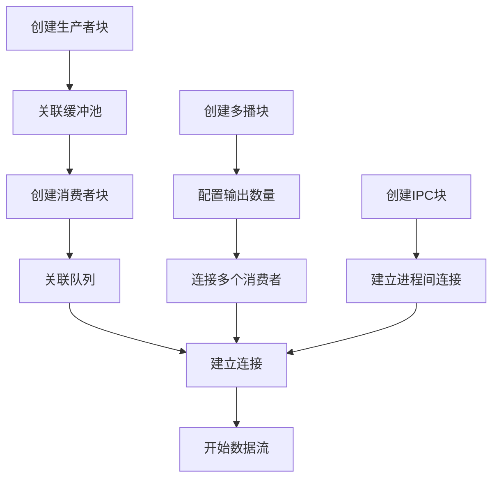
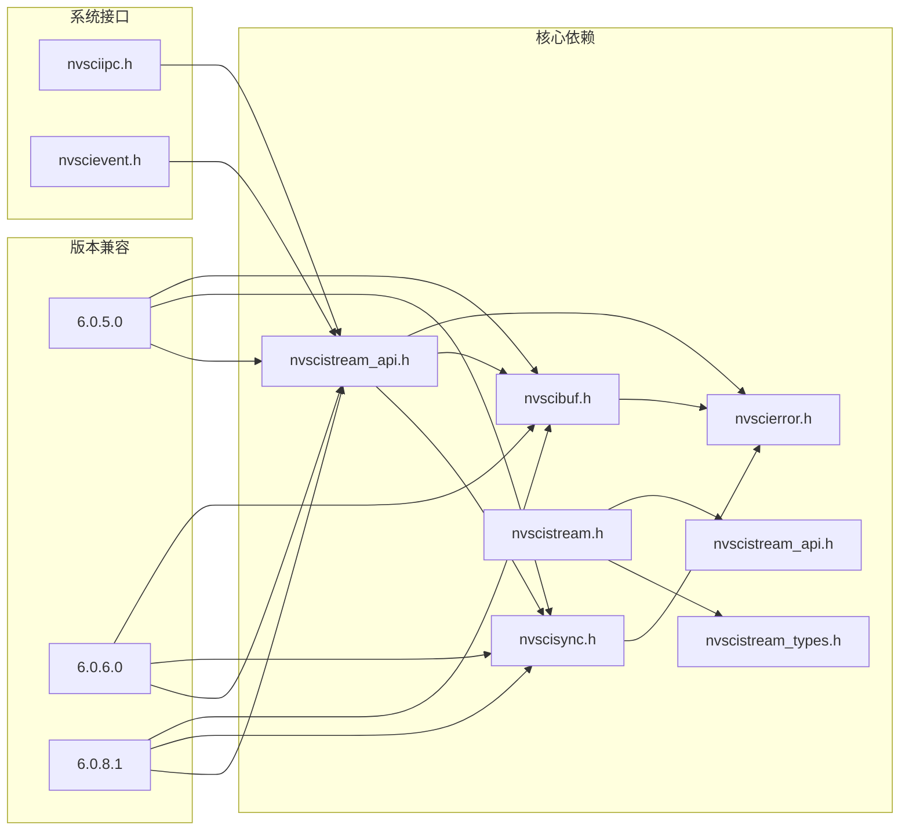

# API参考

<cite>
**本文档引用的文件**
- [nvscibuf.h](file://driveos-6.0.5.0/drive-linux/include/nvscibuf.h)
- [nvscierror.h](file://driveos-6.0.5.0/drive-linux/include/nvscierror.h)
- [nvscistream.h](file://driveos-6.0.5.0/drive-linux/include/nvscistream.h)
- [nvscistream_api.h](file://driveos-6.0.5.0/drive-linux/include/nvscistream_api.h)
- [nvscistream_types.h](file://driveos-6.0.5.0/drive-linux/include/nvscistream_types.h)
- [nvscisync.h](file://driveos-6.0.5.0/drive-linux/include/nvscisync.h)
- [nvsciipc.h](file://driveos-6.0.5.0/drive-linux/include/nvsciipc.h)
- [nvscievent.h](file://driveos-6.0.5.0/drive-linux/include/nvscievent.h)
</cite>

## 目录
1. [简介](#简介)
2. [项目结构](#项目结构)
3. [核心组件](#核心组件)
4. [架构概览](#架构概览)
5. [详细组件分析](#详细组件分析)
6. [依赖关系分析](#依赖关系分析)
7. [性能考虑](#性能考虑)
8. [故障排除指南](#故障排除指南)
9. [结论](#结论)

## 简介

DriveOS是英伟达开发的车载操作系统，提供了完整的软件通信接口（SCI）生态系统，用于实现高性能的多模块数据流处理。本API参考文档详细记录了DriveOS中的核心API接口，包括NvSIPL API、NvMedia API和NvSci API。

这些API为开发者提供了从底层硬件抽象到高级应用接口的完整栈，支持图像处理、视频编解码、传感器数据处理、进程间通信等多种应用场景。文档按照功能分类组织，便于开发者快速查找和使用相关接口。

## 项目结构

DriveOS的API体系主要分布在以下目录结构中：

**图表来源**
- [nvscibuf.h:1-50](file://driveos-6.0.5.0/drive-linux/include/nvscibuf.h#L1-L50)
- [nvscisync.h:1-50](file://driveos-6.0.5.0/drive-linux/include/nvscisync.h#L1-L50)
- [nvscistream_api.h:1-50](file://driveos-6.0.5.0/drive-linux/include/nvscistream_api.h#L1-L50)

**章节来源**
- [nvscibuf.h:1-100](file://driveos-6.0.5.0/drive-linux/include/nvscibuf.h#L1-L100)
- [nvscisync.h:1-100](file://driveos-6.0.5.0/drive-linux/include/nvscisync.h#L1-L100)
- [nvscistream_api.h:1-100](file://driveos-6.0.5.0/drive-linux/include/nvscistream_api.h#L1-L100)

## 核心组件

### NvSciBuf - 缓冲区管理组件

NvSciBuf是DriveOS中负责内存缓冲区分配和交换的核心组件，支持多种数据类型的缓冲区管理。

**主要特性：**
- 支持通用缓冲区、原始缓冲区、图像、张量、数组、金字塔等多种数据类型
- 提供跨进程的缓冲区共享机制
- 支持CPU和GPU访问权限控制
- 提供缓冲区对齐和缓存一致性管理

**核心数据类型：**
- `NvSciBufType` - 定义缓冲区数据类型枚举
- `NvSciBufAttrList` - 缓冲区属性列表
- `NvSciBufObj` - 缓冲区对象句柄
- `NvSciBufModule` - 模块实例

**章节来源**
- [nvscibuf.h:123-135](file://driveos-6.0.5.0/drive-linux/include/nvscibuf.h#L123-L135)
- [nvscibuf.h:118-135](file://driveos-6.0.5.0/drive-linux/include/nvscibuf.h#L118-L135)

### NvSciSync - 同步管理组件

NvSciSync提供跨进程的同步原语管理，支持信号量、栅栏等同步机制。

**主要功能：**
- 同步对象的创建和管理
- 跨进程同步原语导入导出
- CPU等待上下文管理
- 任务状态和时间戳跟踪

**核心数据类型：**
- `NvSciSyncObj` - 同步对象
- `NvSciSyncFence` - 同步栅栏
- `NvSciSyncAttrList` - 同步属性列表
- `NvSciSyncModule` - 模块实例

**章节来源**
- [nvscisync.h:203-303](file://driveos-6.0.5.0/drive-linux/include/nvscisync.h#L203-L303)
- [nvscisync.h:248-250](file://driveos-6.0.5.0/drive-linux/include/nvscisync.h#L248-L250)

### NvSciStream - 流管理组件

NvSciStream是基于NvSciBuf和NvSciSync的高级流处理框架，提供数据包在多个应用模块间的传输。

**核心概念：**
- 块（Block）- 流中的功能模块
- 数据包（Packet）- 包含多个缓冲区的数据单元
- 连接（Connection）- 块之间的数据流连接

**主要块类型：**
- Producer - 生产者块
- Consumer - 消费者块  
- Pool - 缓冲池块
- Queue - 队列块
- Multicast - 多播块
- IPC块 - 进程间通信块

**章节来源**
- [nvscistream_types.h:83-106](file://driveos-6.0.5.0/drive-linux/include/nvscistream_types.h#L83-L106)
- [nvscistream_types.h:117-195](file://driveos-6.0.5.0/drive-linux/include/nvscistream_types.h#L117-L195)

## 架构概览

**图表来源**
- [nvscibuf.h:1-50](file://driveos-6.0.5.0/drive-linux/include/nvscibuf.h#L1-L50)
- [nvscisync.h:1-50](file://driveos-6.0.5.0/drive-linux/include/nvscisync.h#L1-L50)
- [nvscistream.h:1-32](file://driveos-6.0.5.0/drive-linux/include/nvscistream.h#L1-L32)

## 详细组件分析

### NvSciBuf API详解

#### 缓冲区类型定义

NvSciBuf支持多种数据类型的缓冲区，每种类型都有特定的属性和用途：

**图表来源**
- [nvscibuf.h:123-135](file://driveos-6.0.5.0/drive-linux/include/nvscibuf.h#L123-L135)
- [nvscibuf.h:383-421](file://driveos-6.0.5.0/drive-linux/include/nvscibuf.h#L383-L421)

#### 缓冲区属性管理

NvSciBuf提供完整的属性管理系统，支持输入和输出属性的设置与获取：

**主要API函数：**
- `NvSciBufAttrListCreate()` - 创建属性列表
- `NvSciBufAttrListSetAttrs()` - 设置属性值
- `NvSciBufAttrListGetAttrs()` - 获取属性值
- `NvSciBufAttrListReconcile()` - 协调属性列表

**章节来源**
- [nvscibuf.h:729-731](file://driveos-6.0.5.0/drive-linux/include/nvscibuf.h#L729-L731)
- [nvscibuf.h:899-902](file://driveos-6.0.5.0/drive-linux/include/nvscibuf.h#L899-L902)
- [nvscibuf.h:1215-1219](file://driveos-6.0.5.0/drive-linux/include/nvscibuf.h#L1215-L1219)

### NvSciSync API详解

#### 同步对象管理

NvSciSync提供灵活的同步对象管理机制，支持多种同步原语：

**图表来源**
- [nvscisync.h:587-588](file://driveos-6.0.5.0/drive-linux/include/nvscisync.h#L587-L588)
- [nvscisync.h:729-731](file://driveos-6.0.5.0/drive-linux/include/nvscisync.h#L729-L731)
- [nvscisync.h:1169-1170](file://driveos-6.0.5.0/drive-linux/include/nvscisync.h#L1169-L1170)

#### 同步属性配置

同步属性支持多种配置选项，包括CPU访问权限、同步权限、确定性栅栏等：

**主要属性键：**
- `NvSciSyncAttrKey_NeedCpuAccess` - CPU访问需求
- `NvSciSyncAttrKey_RequiredPerm` - 必需权限
- `NvSciSyncAttrKey_ActualPerm` - 实际权限
- `NvSciSyncAttrKey_RequireDeterministicFences` - 确定性栅栏需求

**章节来源**
- [nvscisync.h:405-535](file://driveos-6.0.5.0/drive-linux/include/nvscisync.h#L405-L535)
- [nvscisync.h:899-902](file://driveos-6.0.5.0/drive-linux/include/nvscisync.h#L899-L902)

### NvSciStream API详解

#### 流块管理

NvSciStream提供完整的流块管理机制，支持不同类型的块组合形成复杂的流拓扑：

**图表来源**
- [nvscistream_api.h:251-254](file://driveos-6.0.5.0/drive-linux/include/nvscistream_api.h#L251-L254)
- [nvscistream_api.h:308-311](file://driveos-6.0.5.0/drive-linux/include/nvscistream_api.h#L308-L311)
- [nvscistream_api.h:518-521](file://driveos-6.0.5.0/drive-linux/include/nvscistream_api.h#L518-L521)

#### 数据包处理流程

NvSciStream的数据包处理遵循严格的生命周期管理：

**数据包生命周期：**
1. 创建数据包
2. 注册缓冲区元素
3. 标记数据包完成
4. 分发到消费者
5. 回收数据包资源

**章节来源**
- [nvscistream_api.h:1483-1487](file://driveos-6.0.5.0/drive-linux/include/nvscistream_api.h#L1483-L1487)
- [nvscistream_api.h:1530-1535](file://driveos-6.0.5.0/drive-linux/include/nvscistream_api.h#L1530-L1535)
- [nvscistream_api.h:1571-1575](file://driveos-6.0.5.0/drive-linux/include/nvscistream_api.h#L1571-L1575)

## 依赖关系分析

**图表来源**
- [nvscistream.h:28-31](file://driveos-6.0.5.0/drive-linux/include/nvscistream.h#L28-L31)
- [nvscistream_api.h:27-32](file://driveos-6.0.5.0/drive-linux/include/nvscistream_api.h#L27-L32)
- [nvscisync.h:157-159](file://driveos-6.0.5.0/drive-linux/include/nvscisync.h#L157-L159)

**章节来源**
- [nvscibuf.h:22-31](file://driveos-6.0.5.0/drive-linux/include/nvscibuf.h#L22-L31)
- [nvscisync.h:157-159](file://driveos-6.0.5.0/drive-linux/include/nvscisync.h#L157-L159)
- [nvscistream_api.h:27-32](file://driveos-6.0.5.0/drive-linux/include/nvscistream_api.h#L27-L32)

## 性能考虑

### 内存管理优化

NvSciBuf提供多种内存管理策略以优化性能：

- **缓冲区对齐**：通过`NvSciBufRawBufferAttrKey_Align`属性优化内存对齐
- **缓存一致性**：通过`NvSciBufGeneralAttrKey_EnableCpuCache`控制CPU缓存
- **GPU压缩**：通过`NvSciBufGeneralAttrKey_EnableGpuCompression`启用GPU压缩

### 同步性能优化

NvSciSync支持确定性栅栏以减少同步开销：

- **确定性同步**：通过`NvSciSyncAttrKey_RequireDeterministicFences`启用
- **批量操作**：支持多栅栏同时等待
- **CPU等待优化**：通过`NvSciSyncCpuWaitContext`优化CPU等待性能

### 流处理优化

NvSciStream提供多种优化机制：

- **零拷贝传输**：通过共享内存实现零拷贝数据传输
- **批处理**：支持批量数据包处理
- **背压控制**：通过队列长度控制数据流速率

## 故障排除指南

### 常见错误码

NvSci提供统一的错误码体系，便于故障诊断：

**通用错误码：**
- `NvSciError_Success` - 操作成功
- `NvSciError_BadParameter` - 参数错误
- `NvSciError_InsufficientMemory` - 内存不足
- `NvSciError_Timeout` - 操作超时

**流相关错误码：**
- `NvSciError_StreamBadBlock` - 块无效
- `NvSciError_StreamNotConnected` - 流未连接
- `NvSciError_NoStreamPacket` - 无可用数据包

**章节来源**
- [nvscierror.h:45-270](file://driveos-6.0.5.0/drive-linux/include/nvscierror.h#L45-L270)

### 调试技巧

**缓冲区问题排查：**
1. 使用`NvSciBufAttrListValidateReconciled()`验证属性协调结果
2. 检查缓冲区对齐和大小是否符合要求
3. 验证CPU/GPU访问权限设置

**同步问题排查：**
1. 使用`NvSciSyncAttrListDebugDump()`调试属性列表
2. 检查栅栏状态和等待超时
3. 验证同步权限配置

**流问题排查：**
1. 使用`NvSciStreamBlockErrorGet()`获取详细错误信息
2. 检查块连接状态和事件队列
3. 验证数据包生命周期管理

## 结论

DriveOS的API体系提供了完整的软件通信基础设施，支持从底层硬件抽象到高级应用接口的全栈解决方案。通过NvSciBuf、NvSciSync、NvSciStream等核心组件的协同工作，开发者可以构建高性能、可扩展的多媒体处理应用。

**主要优势：**
- **模块化设计**：各组件职责明确，易于维护和扩展
- **高性能**：优化的内存管理和同步机制
- **跨平台**：支持多种硬件平台和操作系统
- **安全性**：提供安全版本支持

**未来发展：**
随着DriveOS版本的不断演进，API体系将持续优化性能和功能，为自动驾驶和智能交通系统提供更强有力的技术支撑。