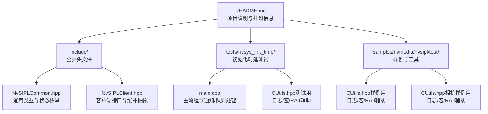
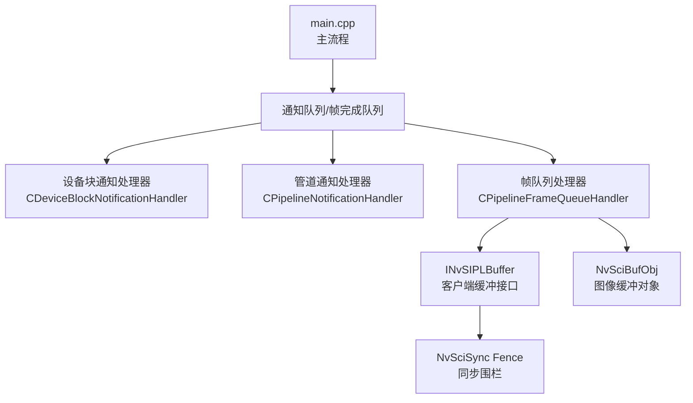
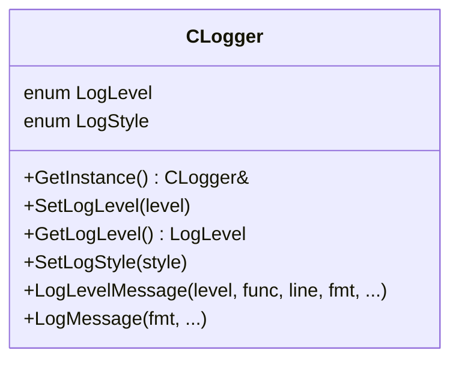
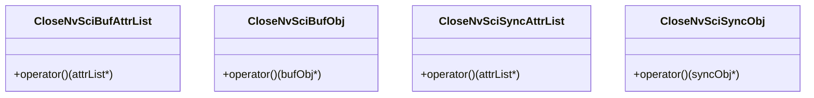
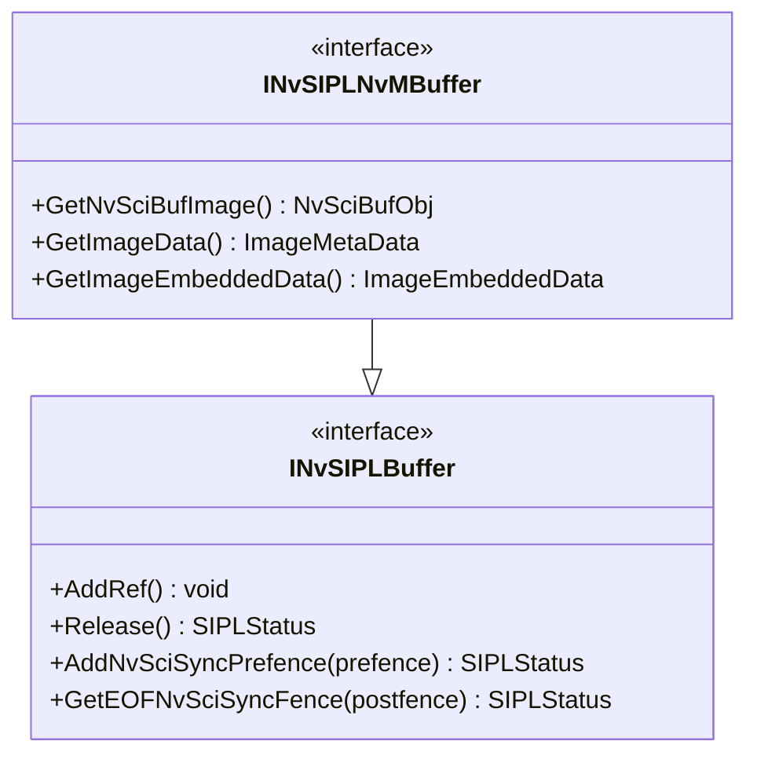
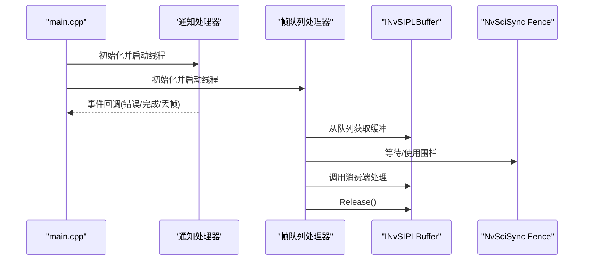
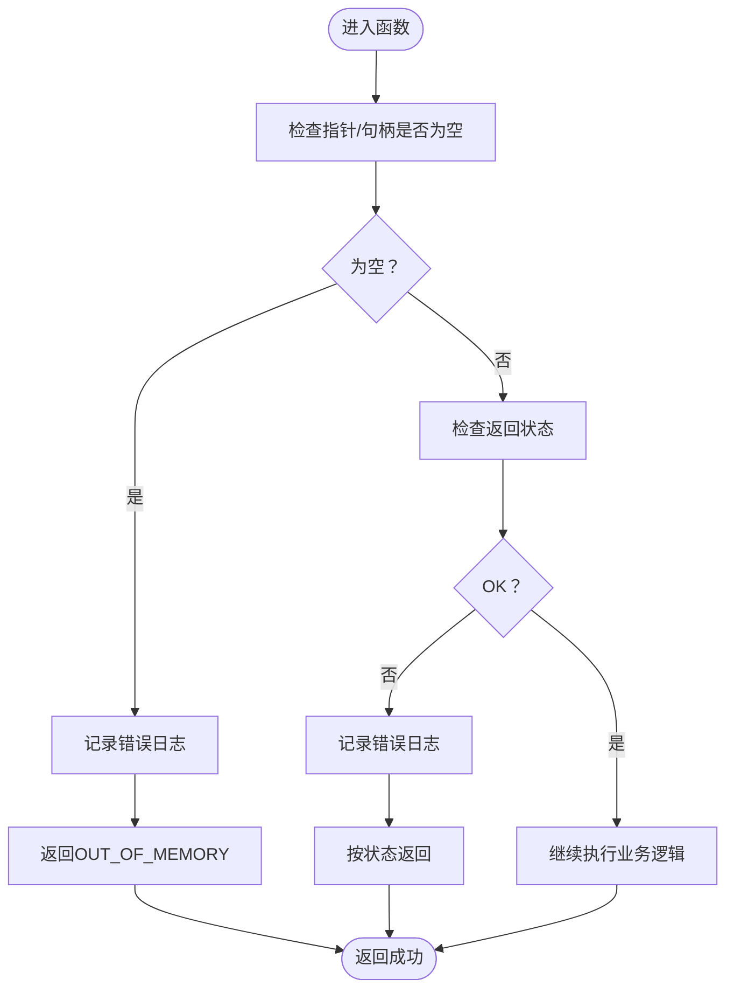
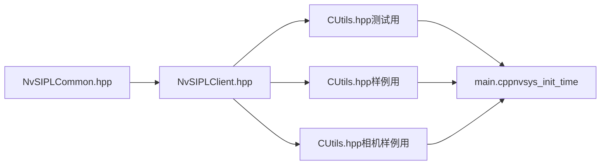

# 代码规范与最佳实践

<cite>
**本文引用的文件**
- [README.md](file://README.md)
- [NvSIPLCommon.hpp](file://driveos-6.0.5.0/drive-linux/include/NvSIPLCommon.hpp)
- [NvSIPLClient.hpp](file://driveos-6.0.5.0/drive-linux/include/NvSIPLClient.hpp)
- [CUtils.hpp（测试用）](file://driveos-6.0.5.0/drive-linux/tests/nvsys_init_time/CUtils.hpp)
- [CUtils.hpp（样例用）](file://driveos-6.0.5.0/drive-linux/samples/nvmedia/nvsipl/test/sample/CUtils.hpp)
- [CUtils.hpp（相机样例用）](file://driveos-6.0.5.0/drive-linux/samples/nvmedia/nvsipl/test/camera/CUtils.hpp)
- [main.cpp（nvsys_init_time）](file://driveos-6.0.5.0/drive-linux/tests/nvsys_init_time/main.cpp)
</cite>

## 目录
1. [引言](#引言)
2. [项目结构](#项目结构)
3. [核心组件](#核心组件)
4. [架构总览](#架构总览)
5. [详细组件分析](#详细组件分析)
6. [依赖关系分析](#依赖关系分析)
7. [性能考量](#性能考量)
8. [故障排查指南](#故障排查指南)
9. [结论](#结论)
10. [附录](#附录)

## 引言
本指南面向DriveOS多媒体与驱动栈相关开发，聚焦于C++编码规范与最佳实践，结合仓库中现有接口与示例，系统化给出命名约定、缩进与注释规范、面向对象设计原则的应用、错误处理与异常安全、内存管理与并发安全、配置与参数验证、代码评审清单与质量流程、以及常见陷阱与调试技巧。目标是帮助团队在多传感器图像采集与处理链路中，建立一致、可维护、可扩展且安全的工程实践。

## 项目结构
仓库包含多个版本的DRIVE OS SDK与样例，其中与本指南密切相关的为6.0.5.0版本的Linux用户态头文件与测试/样例程序。这些文件展示了典型的模块化接口设计、日志与错误处理宏、缓冲区与同步对象的RAII封装、以及多线程事件队列与帧完成队列的处理模式。

**图表来源**
- [README.md:1-128](file://README.md#L1-L128)
- [NvSIPLCommon.hpp:1-219](file://driveos-6.0.5.0/drive-linux/include/NvSIPLCommon.hpp#L1-L219)
- [NvSIPLClient.hpp:1-368](file://driveos-6.0.5.0/drive-linux/include/NvSIPLClient.hpp#L1-L368)
- [CUtils.hpp（测试用）:1-369](file://driveos-6.0.5.0/drive-linux/tests/nvsys_init_time/CUtils.hpp#L1-L369)
- [CUtils.hpp（样例用）:1-296](file://driveos-6.0.5.0/drive-linux/samples/nvmedia/nvsipl/test/sample/CUtils.hpp#L1-L296)
- [CUtils.hpp（相机样例用）:1-367](file://driveos-6.0.5.0/drive-linux/samples/nvmedia/nvsipl/test/camera/CUtils.hpp#L1-L367)
- [main.cpp（nvsys_init_time）:1-800](file://driveos-6.0.5.0/drive-linux/tests/nvsys_init_time/main.cpp#L1-L800)

**章节来源**
- [README.md:1-128](file://README.md#L1-L128)

## 核心组件
- 通用类型与状态：定义坐标、时间、布尔、时钟基、状态码与GPIO事件等基础类型，便于跨模块一致性。
- 客户端接口：抽象缓冲与元数据访问，提供对NvSciBuf/NvSciSync的封装与生命周期管理。
- 日志与错误处理宏：统一的日志级别、格式化输出与错误检查宏，贯穿测试与样例。
- RAII辅助：针对NvSciBuf/NvSciSync资源的自定义删除器，确保资源释放不遗漏。
- 主流程与事件处理：基于通知队列与帧完成队列的异步处理模型，配合线程与原子变量实现安全控制。

**章节来源**
- [NvSIPLCommon.hpp:1-219](file://driveos-6.0.5.0/drive-linux/include/NvSIPLCommon.hpp#L1-L219)
- [NvSIPLClient.hpp:1-368](file://driveos-6.0.5.0/drive-linux/include/NvSIPLClient.hpp#L1-L368)
- [CUtils.hpp（测试用）:1-369](file://driveos-6.0.5.0/drive-linux/tests/nvsys_init_time/CUtils.hpp#L1-L369)
- [CUtils.hpp（样例用）:1-296](file://driveos-6.0.5.0/drive-linux/samples/nvmedia/nvsipl/test/sample/CUtils.hpp#L1-L296)
- [CUtils.hpp（相机样例用）:1-367](file://driveos-6.0.5.0/drive-linux/samples/nvmedia/nvsipl/test/camera/CUtils.hpp#L1-L367)
- [main.cpp（nvsys_init_time）:1-800](file://driveos-6.0.5.0/drive-linux/tests/nvsys_init_time/main.cpp#L1-L800)

## 架构总览
下图展示从主流程到通知/队列处理、再到缓冲与同步对象的交互关系，体现典型的生产者-消费者与回调通知模式。

**图表来源**
- [main.cpp（nvsys_init_time）:681-800](file://driveos-6.0.5.0/drive-linux/tests/nvsys_init_time/main.cpp#L681-L800)
- [NvSIPLClient.hpp:126-347](file://driveos-6.0.5.0/drive-linux/include/NvSIPLClient.hpp#L126-L347)

## 详细组件分析

### 组件A：日志与错误处理宏体系
- 单例日志类：提供不同日志级别与消息格式化能力，支持函数名与行号记录。
- 错误检查宏：统一检查指针/状态/NvSci状态等，并返回或退出，减少重复样板代码。
- 建议命名：LOG_*系列宏以“LOG_”前缀；错误宏以“CHK_*”前缀；常量以“MAX_”“NUM_”等语义前缀；RAII删除器以“Close*”命名。

**图表来源**
- [CUtils.hpp（测试用）:184-272](file://driveos-6.0.5.0/drive-linux/tests/nvsys_init_time/CUtils.hpp#L184-L272)
- [CUtils.hpp（样例用）:170-246](file://driveos-6.0.5.0/drive-linux/samples/nvmedia/nvsipl/test/sample/CUtils.hpp#L170-L246)
- [CUtils.hpp（相机样例用）:205-293](file://driveos-6.0.5.0/drive-linux/samples/nvmedia/nvsipl/test/camera/CUtils.hpp#L205-L293)

**章节来源**
- [CUtils.hpp（测试用）:106-183](file://driveos-6.0.5.0/drive-linux/tests/nvsys_init_time/CUtils.hpp#L106-L183)
- [CUtils.hpp（样例用）:74-169](file://driveos-6.0.5.0/drive-linux/samples/nvmedia/nvsipl/test/sample/CUtils.hpp#L74-L169)
- [CUtils.hpp（相机样例用）:100-204](file://driveos-6.0.5.0/drive-linux/samples/nvmedia/nvsipl/test/camera/CUtils.hpp#L100-L204)

### 组件B：RAII与资源管理
- 自定义删除器：对NvSciBuf/NvSciSync的AttrList/Obj进行安全释放，避免资源泄露。
- 建议：所有外部资源（句柄、缓冲、同步对象）均应通过RAII包装；构造即申请、析构即释放；禁止裸new/delete与裸malloc/free混用。

**图表来源**
- [CUtils.hpp（测试用）:40-82](file://driveos-6.0.5.0/drive-linux/tests/nvsys_init_time/CUtils.hpp#L40-L82)
- [CUtils.hpp（样例用）:41-72](file://driveos-6.0.5.0/drive-linux/samples/nvmedia/nvsipl/test/sample/CUtils.hpp#L41-L72)
- [CUtils.hpp（相机样例用）:34-76](file://driveos-6.0.5.0/drive-linux/samples/nvmedia/nvsipl/test/camera/CUtils.hpp#L34-L76)

**章节来源**
- [CUtils.hpp（测试用）:40-82](file://driveos-6.0.5.0/drive-linux/tests/nvsys_init_time/CUtils.hpp#L40-L82)
- [CUtils.hpp（样例用）:41-72](file://driveos-6.0.5.0/drive-linux/samples/nvmedia/nvsipl/test/sample/CUtils.hpp#L41-L72)
- [CUtils.hpp（相机样例用）:34-76](file://driveos-6.0.5.0/drive-linux/samples/nvmedia/nvsipl/test/camera/CUtils.hpp#L34-L76)

### 组件C：客户端缓冲与元数据接口
- 抽象缓冲接口：AddRef/Release/AddNvSciSyncPrefence/GetEOFNvSciSyncFence，统一生命周期与同步。
- NvMBuffer：扩展出NvSciBufObj与图像元数据/嵌入数据访问。
- 建议：对外暴露只读接口；内部状态变更通过受控方法；严格区分所有权与借用。

**图表来源**
- [NvSIPLClient.hpp:126-347](file://driveos-6.0.5.0/drive-linux/include/NvSIPLClient.hpp#L126-L347)

**章节来源**
- [NvSIPLClient.hpp:126-347](file://driveos-6.0.5.0/drive-linux/include/NvSIPLClient.hpp#L126-L347)

### 组件D：主流程与事件处理序列
- 主流程负责解析命令行、查询平台配置、创建组合器、启动通知与帧队列处理线程。
- 通知处理器根据事件类型更新统计、错误标志或触发恢复逻辑。
- 帧队列处理器从完成队列取出缓冲，调用消费端处理并释放。

**图表来源**
- [main.cpp（nvsys_init_time）:681-800](file://driveos-6.0.5.0/drive-linux/tests/nvsys_init_time/main.cpp#L681-L800)
- [NvSIPLClient.hpp:126-347](file://driveos-6.0.5.0/drive-linux/include/NvSIPLClient.hpp#L126-L347)

**章节来源**
- [main.cpp（nvsys_init_time）:681-800](file://driveos-6.0.5.0/drive-linux/tests/nvsys_init_time/main.cpp#L681-L800)

### 组件E：算法与流程控制（以错误检查为例）
- 错误检查流程：先判断指针/状态/系统调用结果，再决定返回值或退出路径。
- 建议：每个分支明确返回值语义；错误路径统一记录日志与错误码；避免“静默失败”。

**图表来源**
- [CUtils.hpp（测试用）:107-136](file://driveos-6.0.5.0/drive-linux/tests/nvsys_init_time/CUtils.hpp#L107-L136)
- [CUtils.hpp（样例用）:78-107](file://driveos-6.0.5.0/drive-linux/samples/nvmedia/nvsipl/test/sample/CUtils.hpp#L78-L107)
- [CUtils.hpp（相机样例用）:101-157](file://driveos-6.0.5.0/drive-linux/samples/nvmedia/nvsipl/test/camera/CUtils.hpp#L101-L157)

## 依赖关系分析
- 接口与实现解耦：通过抽象接口（如INvSIPLBuffer）隔离上层与底层实现细节。
- 资源生命周期：RAII删除器与智能指针配合，降低资源泄漏风险。
- 并发控制：原子变量与线程配合，保证全局状态与错误忽略策略的一致性。

**图表来源**
- [NvSIPLCommon.hpp:1-219](file://driveos-6.0.5.0/drive-linux/include/NvSIPLCommon.hpp#L1-L219)
- [NvSIPLClient.hpp:1-368](file://driveos-6.0.5.0/drive-linux/include/NvSIPLClient.hpp#L1-L368)
- [CUtils.hpp（测试用）:1-369](file://driveos-6.0.5.0/drive-linux/tests/nvsys_init_time/CUtils.hpp#L1-L369)
- [CUtils.hpp（样例用）:1-296](file://driveos-6.0.5.0/drive-linux/samples/nvmedia/nvsipl/test/sample/CUtils.hpp#L1-L296)
- [CUtils.hpp（相机样例用）:1-367](file://driveos-6.0.5.0/drive-linux/samples/nvmedia/nvsipl/test/camera/CUtils.hpp#L1-L367)
- [main.cpp（nvsys_init_time）:1-800](file://driveos-6.0.5.0/drive-linux/tests/nvsys_init_time/main.cpp#L1-L800)

**章节来源**
- [NvSIPLCommon.hpp:1-219](file://driveos-6.0.5.0/drive-linux/include/NvSIPLCommon.hpp#L1-L219)
- [NvSIPLClient.hpp:1-368](file://driveos-6.0.5.0/drive-linux/include/NvSIPLClient.hpp#L1-L368)
- [CUtils.hpp（测试用）:1-369](file://driveos-6.0.5.0/drive-linux/tests/nvsys_init_time/CUtils.hpp#L1-L369)
- [CUtils.hpp（样例用）:1-296](file://driveos-6.0.5.0/drive-linux/samples/nvmedia/nvsipl/test/sample/CUtils.hpp#L1-L296)
- [CUtils.hpp（相机样例用）:1-367](file://driveos-6.0.5.0/drive-linux/samples/nvmedia/nvsipl/test/camera/CUtils.hpp#L1-L367)
- [main.cpp（nvsys_init_time）:1-800](file://driveos-6.0.5.0/drive-linux/tests/nvsys_init_time/main.cpp#L1-L800)

## 性能考量
- 避免阻塞：事件与帧队列采用超时机制，防止无限等待导致的卡顿。
- 合理线程命名与优先级：主线程与各处理器线程设置名称，便于调试与性能分析。
- 时间戳记录：在关键阶段写入内核sysfs或设备接口，用于系统级时序分析。
- 建议：对高频路径尽量减少日志输出；批量处理时注意队列长度与背压控制。

[本节为通用建议，无需特定文件引用]

## 故障排查指南
- 日志级别：通过命令行参数设置日志等级，定位问题范围。
- 错误宏：利用统一的错误检查宏快速定位失败点与返回码。
- 原子状态：使用原子变量控制错误忽略策略，避免误判。
- 资源释放：确认RAII删除器覆盖所有路径，避免句柄泄漏。

**章节来源**
- [main.cpp（nvsys_init_time）:708-720](file://driveos-6.0.5.0/drive-linux/tests/nvsys_init_time/main.cpp#L708-L720)
- [CUtils.hpp（测试用）:107-136](file://driveos-6.0.5.0/drive-linux/tests/nvsys_init_time/CUtils.hpp#L107-L136)
- [CUtils.hpp（相机样例用）:101-157](file://driveos-6.0.5.0/drive-linux/samples/nvmedia/nvsipl/test/camera/CUtils.hpp#L101-L157)

## 结论
本指南基于DriveOS现有接口与样例，总结了面向对象设计、RAII资源管理、并发控制与错误处理的关键实践。建议在新功能开发中遵循统一的命名、日志与错误处理规范，优先使用抽象接口与RAII封装，严格控制资源生命周期与线程安全，持续通过代码评审与静态分析提升质量。

[本节为总结性内容，无需特定文件引用]

## 附录

### 编码规范要点（摘自仓库实践）
- 命名约定
  - 类型与枚举：大驼峰（如CLogger、LogLevel）
  - 常量与宏：全大写+下划线（如MAX_NUM_SENSORS、LOG_ERR）
  - 函数与方法：小驼峰（如LogLevelMessage、GetInstance）
  - RAII删除器：以Close*命名（如CloseNvSciBufObj）
- 缩进与注释
  - 使用一致的缩进风格（仓库中以4空格为主）
  - 注释简洁明了，解释意图而非重复代码
- 面向对象设计
  - 优先使用抽象接口隔离实现细节
  - 将资源管理与业务逻辑分离
- 错误处理与异常安全
  - 统一使用错误检查宏，失败路径记录日志并返回明确状态
  - 所有外部资源使用RAII包装
- 内存管理
  - 优先使用智能指针与容器；避免裸指针与裸分配
  - 明确所有权与借用边界，避免悬空指针
- 并发安全
  - 使用原子变量与互斥/条件变量保护共享状态
  - 线程间通过队列传递数据，避免直接共享可变状态
- 配置与参数验证
  - 命令行参数解析后立即校验并记录
  - 对平台配置与掩码应用进行一致性检查
- 代码评审清单
  - 是否遵循命名与注释规范
  - 是否存在未处理的错误路径
  - 是否遗漏RAII资源释放
  - 是否存在竞态条件或死锁隐患
  - 是否引入不必要的全局状态
- 常见陷阱与调试技巧
  - 避免在信号/中断上下文调用阻塞API
  - 使用线程名称与日志级别快速定位问题
  - 在关键路径记录时间戳，结合系统工具分析延迟

[本节为汇总性内容，无需特定文件引用]