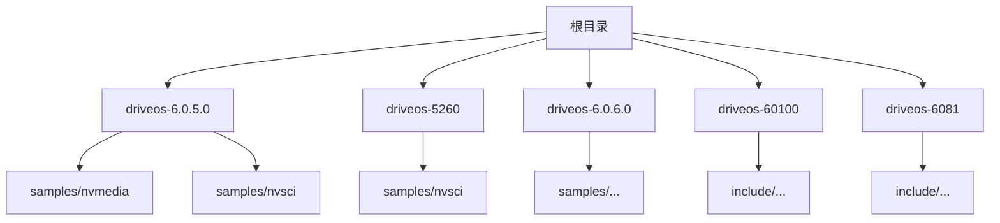
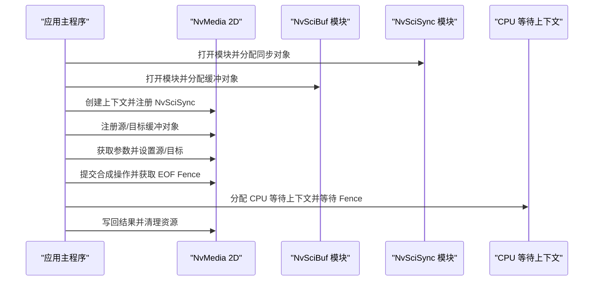
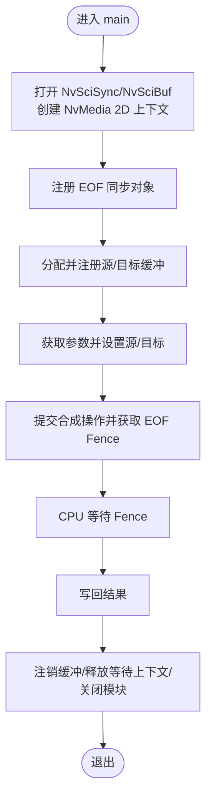
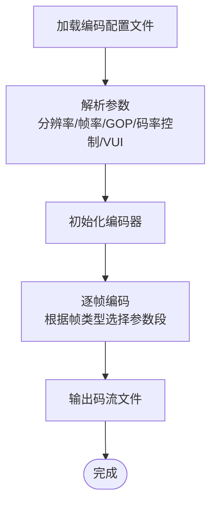
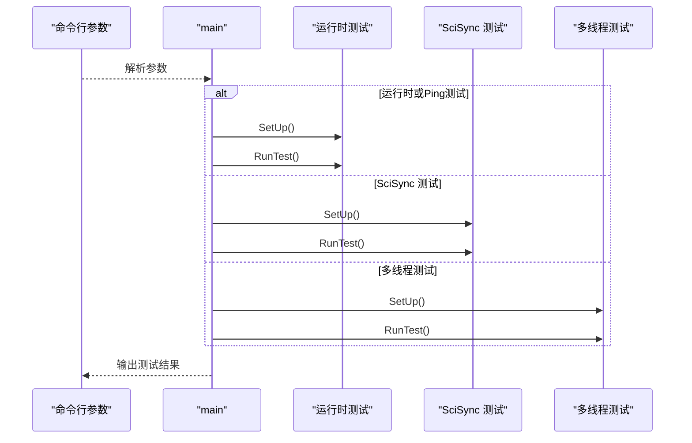
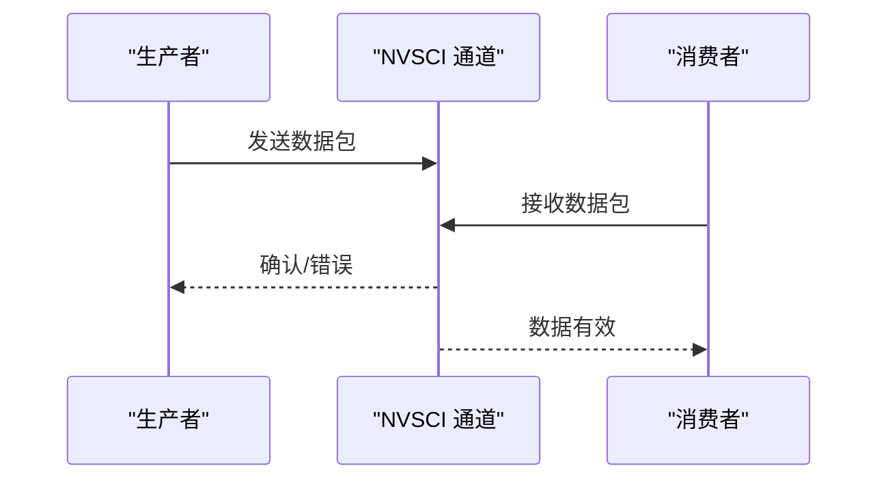
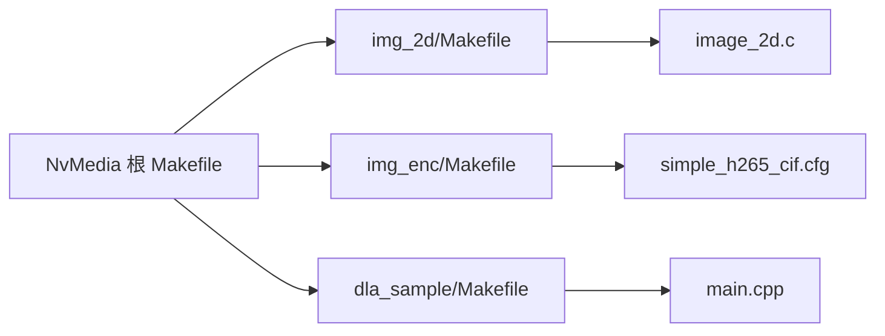

# 开发指南

<cite>
**本文引用的文件**
- [README.md](file://README.md)
- [nvmedia 2D 示例入口](file://driveos-6.0.5.0/drive-linux/samples/nvmedia/img_2d/image_2d.c)
- [NVENC H.265 配置样例](file://driveos-6.0.5.0/drive-linux/samples/nvmedia/img_enc/simple_h265_cif.cfg)
- [DLA 测试入口](file://driveos-6.0.5.0/drive-linux/samples/nvmedia/dla_sample/main.cpp)
- [日志工具实现](file://driveos-6.0.5.0/drive-linux/samples/nvmedia/utils/log_utils.c)
- [NVSCI Stream 多播生产者](file://driveos-5260/drive-linux/samples/nvsci/nvscistream/multicast/channel_producer.cpp)
- [NVSCI Stream 多播消费者](file://driveos-5260/drive-linux/samples/nvsci/nvscistream/multicast/channel_consumer.cpp)
- [NVSCI Stream 原始流示例头文件](file://driveos-6.0.5.0/drive-linux/samples/nvsci/rawstream/rawstream.h)
- [NVSCI Stream 原始流示例主程序](file://driveos-6.0.5.0/drive-linux/samples/nvsci/rawstream/rawstream_main.c)
- [NVSCI Stream 原始流示例生产者](file://driveos-6.0.5.0/drive-linux/samples/nvsci/rawstream/rawstream_producer.c)
- [NVSCI Stream 原始流示例消费者](file://driveos-6.0.5.0/drive-linux/samples/nvsci/rawstream/rawstream_consumer.c)
- [NVSCI Stream 原始流示例 CUDA](file://driveos-6.0.5.0/drive-linux/samples/nvsci/rawstream/rawstream_cuda.c)
- [NVSCI Stream 原始流示例 IPC](file://driveos-6.0.5.0/drive-linux/samples/nvsci/rawstream/rawstream_ipc.c)
- [NVSCI Stream 原始流示例 Linux IPC](file://driveos-6.0.5.0/drive-linux/samples/nvsci/rawstream/rawstream_ipc_linux.c)
- [NVSCI Stream 原始流示例 Makefile](file://driveos-6.0.5.0/drive-linux/samples/nvsci/rawstream/Makefile)
- [NVSCI Stream 多播示例 Makefile](file://driveos-5260/drive-linux/samples/nvsci/nvscistream/multicast/Makefile)
- [NVSCI Stream 多播安全示例 Makefile](file://driveos-5260/drive-linux/samples/nvsci/nvscistream/multicast_safety/Makefile)
- [NVSCI Stream 单播示例 Makefile](file://driveos-5260/drive-linux/samples/nvsci/nvscistream/unicast/Makefile)
- [NVENC 示例 Makefile](file://driveos-6.0.5.0/drive-linux/samples/nvmedia/img_enc/Makefile)
- [NvMedia 2D 示例 Makefile](file://driveos-6.0.5.0/drive-linux/samples/nvmedia/img_2d/Makefile)
- [NvMedia DLA 示例 Makefile](file://driveos-6.0.5.0/drive-linux/samples/nvmedia/dla_sample/Makefile)
- [NvMedia 根 Makefile](file://driveos-6.0.5.0/drive-linux/samples/nvmedia/Makefile)
- [驱动系统版本与包信息](file://README.md)
</cite>

## 目录
1. [简介](#简介)
2. [项目结构](#项目结构)
3. [核心组件](#核心组件)
4. [架构总览](#架构总览)
5. [详细组件分析](#详细组件分析)
6. [依赖关系分析](#依赖关系分析)
7. [性能考虑](#性能考虑)
8. [故障排查指南](#故障排查指南)
9. [结论](#结论)
10. [附录](#附录)

## 简介
本指南面向在 DriveOS 平台上进行多媒体与 AI 加速应用开发的工程师，覆盖项目结构组织、编译与链接配置、常见应用场景（图像处理、视频编码、AI 推理、进程间通信）的示例分析，以及调试工具、单元与集成测试、代码规范与最佳实践、常见问题与性能优化建议。文档以仓库中的官方示例为依据，帮助初学者快速上手，同时为有经验的开发者提供深入的技术细节。

## 项目结构
仓库包含多个版本的 DriveOS SDK 与 samples，核心路径如下：
- driveos-6.0.5.0/drive-linux/samples：包含多媒体（nvmedia）、音频（ape）、NVSCI 通信（nvsci）、AVB 等示例
- driveos-5260/drive-linux/samples：包含 NVSCI Stream 的多播/单播示例
- driveos-6.0.6.0/drive-linux/samples：包含 OpenGL/Vulkan/Wayland 等图形相关示例
- driveos-60100、driveos-6081：更高版本的 include 与 samples 结构，包含更多接口头文件

章节来源
- [驱动系统版本与包信息:1-128](file://README.md#L1-L128)

## 核心组件
- 图像处理（NvMedia 2D）
  - 示例入口：[nvmedia 2D 示例入口](file://driveos-6.0.5.0/drive-linux/samples/nvmedia/img_2d/image_2d.c)
  - 关键流程：初始化 NvSciSync/NvSciBuf、注册缓冲区、提交合成任务、等待 EOF Fence、写回结果
- 视频编码（NVENC/H.265）
  - 示例入口：[NVENC H.265 配置样例](file://driveos-6.0.5.0/drive-linux/samples/nvmedia/img_enc/simple_h265_cif.cfg)
  - 关键参数：输入格式、分辨率、帧率、GOP、码率控制、VUI 参数等
- AI 推理（DLA）
  - 示例入口：[DLA 测试入口](file://driveos-6.0.5.0/drive-linux/samples/nvmedia/dla_sample/main.cpp)
  - 关键测试：运行时测试、SciSync 同步测试、多线程并发测试
- 进程间通信（NVSCI）
  - 多播生产者/消费者：[NVSCI Stream 多播生产者](file://driveos-5260/drive-linux/samples/nvsci/nvscistream/multicast/channel_producer.cpp)、[NVSCI Stream 多播消费者](file://driveos-5260/drive-linux/samples/nvsci/nvscistream/multicast/channel_consumer.cpp)
  - 原始流示例：[NVSCI Stream 原始流示例头文件](file://driveos-6.0.5.0/drive-linux/samples/nvsci/rawstream/rawstream.h)、[NVSCI Stream 原始流示例主程序](file://driveos-6.0.5.0/drive-linux/samples/nvsci/rawstream/rawstream_main.c)
- 日志与工具
  - 日志工具：[日志工具实现](file://driveos-6.0.5.0/drive-linux/samples/nvmedia/utils/log_utils.c)

章节来源
- [nvmedia 2D 示例入口:135-492](file://driveos-6.0.5.0/drive-linux/samples/nvmedia/img_2d/image_2d.c#L135-L492)
- [NVENC H.265 配置样例:1-275](file://driveos-6.0.5.0/drive-linux/samples/nvmedia/img_enc/simple_h265_cif.cfg#L1-L275)
- [DLA 测试入口:21-115](file://driveos-6.0.5.0/drive-linux/samples/nvmedia/dla_sample/main.cpp#L21-L115)
- [NVSCI Stream 多播生产者](file://driveos-5260/drive-linux/samples/nvsci/nvscistream/multicast/channel_producer.cpp)
- [NVSCI Stream 多播消费者](file://driveos-5260/drive-linux/samples/nvsci/nvscistream/multicast/channel_consumer.cpp)
- [NVSCI Stream 原始流示例头文件](file://driveos-6.0.5.0/drive-linux/samples/nvsci/rawstream/rawstream.h)
- [NVSCI Stream 原始流示例主程序](file://driveos-6.0.5.0/drive-linux/samples/nvsci/rawstream/rawstream_main.c)
- [日志工具实现:35-170](file://driveos-6.0.5.0/drive-linux/samples/nvmedia/utils/log_utils.c#L35-L170)

## 架构总览
下图展示典型应用从“初始化—运行时—反初始化”的生命周期，以及与 NvSci/NvMedia 的交互关系。

图表来源
- [nvmedia 2D 示例入口:172-492](file://driveos-6.0.5.0/drive-linux/samples/nvmedia/img_2d/image_2d.c#L172-L492)

## 详细组件分析

### 组件一：图像处理（NvMedia 2D）
- 初始化阶段
  - 打开 NvSciSync/NvSciBuf 模块
  - 创建 NvMedia 2D 上下文并注册同步对象
  - 分配并注册源/目标缓冲对象
- 运行时阶段
  - 获取参数对象，设置源几何、滤波、混合模式
  - 提交合成操作，获取 EOF Fence
  - 等待 Fence 完成
- 反初始化阶段
  - 注销缓冲对象，释放等待上下文与模块

图表来源
- [nvmedia 2D 示例入口:172-492](file://driveos-6.0.5.0/drive-linux/samples/nvmedia/img_2d/image_2d.c#L172-L492)

章节来源
- [nvmedia 2D 示例入口:135-492](file://driveos-6.0.5.0/drive-linux/samples/nvmedia/img_2d/image_2d.c#L135-L492)
- [NvMedia 2D 示例 Makefile](file://driveos-6.0.5.0/drive-linux/samples/nvmedia/img_2d/Makefile)

### 组件二：视频编码（NVENC/H.265）
- 配置要点
  - 输入文件与格式、分辨率、帧率
  - 编码器类型、级别、质量、特性标志
  - GOP 长度、参考帧数、GOP 模式
  - 码率控制模式、平均/最大比特率、VBV 缓冲
  - VUI 参数、SEI 负载
- 使用方式
  - 将配置文件作为输入参数传入编码示例程序
  - 示例程序读取配置并调用编码接口完成编码

图表来源
- [NVENC H.265 配置样例:1-275](file://driveos-6.0.5.0/drive-linux/samples/nvmedia/img_enc/simple_h265_cif.cfg#L1-L275)

章节来源
- [NVENC H.265 配置样例:1-275](file://driveos-6.0.5.0/drive-linux/samples/nvmedia/img_enc/simple_h265_cif.cfg#L1-L275)
- [NVENC 示例 Makefile](file://driveos-6.0.5.0/drive-linux/samples/nvmedia/img_enc/Makefile)

### 组件三：AI 推理（DLA）
- 测试类别
  - 运行时测试：验证 DLA 加载与执行
  - SciSync 测试：验证跨进程同步
  - 多线程测试：验证并发与资源管理
- 入口逻辑
  - 解析命令行参数
  - 选择测试类型并执行 SetUp/RunTest
  - 输出测试结果与状态

图表来源
- [DLA 测试入口:21-115](file://driveos-6.0.5.0/drive-linux/samples/nvmedia/dla_sample/main.cpp#L21-L115)

章节来源
- [DLA 测试入口:21-115](file://driveos-6.0.5.0/drive-linux/samples/nvmedia/dla_sample/main.cpp#L21-L115)
- [NvMedia DLA 示例 Makefile](file://driveos-6.0.5.0/drive-linux/samples/nvmedia/dla_sample/Makefile)

### 组件四：进程间通信（NVSCI Stream）
- 多播场景
  - 生产者：准备数据包，通过通道发送
  - 消费者：接收数据包，进行处理
  - 关键点：通道建立、包池管理、错误处理
- 原始流场景
  - 主程序负责调度，生产者/消费者分别实现数据生成与消费
  - 支持 CUDA 与 IPC 路径

图表来源
- [NVSCI Stream 多播生产者](file://driveos-5260/drive-linux/samples/nvsci/nvscistream/multicast/channel_producer.cpp)
- [NVSCI Stream 多播消费者](file://driveos-5260/drive-linux/samples/nvsci/nvscistream/multicast/channel_consumer.cpp)

章节来源
- [NVSCI Stream 多播示例 Makefile](file://driveos-5260/drive-linux/samples/nvsci/nvscistream/multicast/Makefile)
- [NVSCI Stream 多播安全示例 Makefile](file://driveos-5260/drive-linux/samples/nvsci/nvscistream/multicast_safety/Makefile)
- [NVSCI Stream 单播示例 Makefile](file://driveos-5260/drive-linux/samples/nvsci/nvscistream/unicast/Makefile)
- [NVSCI Stream 原始流示例头文件](file://driveos-6.0.5.0/drive-linux/samples/nvsci/rawstream/rawstream.h)
- [NVSCI Stream 原始流示例主程序](file://driveos-6.0.5.0/drive-linux/samples/nvsci/rawstream/rawstream_main.c)
- [NVSCI Stream 原始流示例生产者](file://driveos-6.0.5.0/drive-linux/samples/nvsci/rawstream/rawstream_producer.c)
- [NVSCI Stream 原始流示例消费者](file://driveos-6.0.5.0/drive-linux/samples/nvsci/rawstream/rawstream_consumer.c)
- [NVSCI Stream 原始流示例 CUDA](file://driveos-6.0.5.0/drive-linux/samples/nvsci/rawstream/rawstream_cuda.c)
- [NVSCI Stream 原始流示例 IPC](file://driveos-6.0.5.0/drive-linux/samples/nvsci/rawstream/rawstream_ipc.c)
- [NVSCI Stream 原始流示例 Linux IPC](file://driveos-6.0.5.0/drive-linux/samples/nvsci/rawstream/rawstream_ipc_linux.c)
- [NVSCI Stream 原始流示例 Makefile](file://driveos-6.0.5.0/drive-linux/samples/nvsci/rawstream/Makefile)

## 依赖关系分析
- 示例到子系统的依赖
  - NvMedia 示例依赖 NvMedia 2D、NvSciBuf、NvSciSync
  - NVENC 示例依赖编码接口与配置解析
  - NVSCI 示例依赖 NVSCI API 与通道管理
- Makefile 层级
  - NvMedia 根 Makefile 递归构建子目录
  - 各子示例拥有独立 Makefile，便于单独编译与调试

图表来源
- [NvMedia 根 Makefile:9-16](file://driveos-6.0.5.0/drive-linux/samples/nvmedia/Makefile#L9-L16)
- [NvMedia 2D 示例 Makefile](file://driveos-6.0.5.0/drive-linux/samples/nvmedia/img_2d/Makefile)
- [NvMedia DLA 示例 Makefile](file://driveos-6.0.5.0/drive-linux/samples/nvmedia/dla_sample/Makefile)
- [NVENC 示例 Makefile](file://driveos-6.0.5.0/drive-linux/samples/nvmedia/img_enc/Makefile)

章节来源
- [NvMedia 根 Makefile:9-16](file://driveos-6.0.5.0/drive-linux/samples/nvmedia/Makefile#L9-L16)

## 性能考虑
- 图像处理（NvMedia 2D）
  - 合理设置源/目标几何与滤波参数，避免不必要的像素拷贝
  - 使用 EOF Fence 控制 CPU 等待，减少忙轮询
  - 采用 NvSciBuf/NvSciSync 实现零拷贝与跨组件同步
- 视频编码（NVENC）
  - 选择合适的 GOP 长度与参考帧数，平衡延迟与质量
  - 使用 VBV 缓冲与最小/最大 QP 限制，稳定码率
  - 在高分辨率场景下启用动态切片以提升并行度
- AI 推理（DLA）
  - 多线程测试中注意资源竞争与同步开销
  - 使用 SciSync 确保跨进程/线程一致性
- 进程间通信（NVSCI）
  - 包池管理与通道配置直接影响吞吐与延迟
  - CUDA 路径与 IPC 路径需结合硬件能力选择

## 故障排查指南
- 日志与调试
  - 使用统一日志工具设置日志级别与输出样式，定位问题
  - 在关键路径打印函数名与行号，便于追踪
- 常见问题
  - 初始化失败：检查 NvSciSync/NvSciBuf 模块打开与对象分配
  - 同步阻塞：确认 EOF Fence 获取与等待上下文正确配置
  - 编码异常：核对配置文件参数与输入数据格式
  - NVSCI 通道错误：检查通道建立、包池与错误回调

章节来源
- [日志工具实现:35-170](file://driveos-6.0.5.0/drive-linux/samples/nvmedia/utils/log_utils.c#L35-L170)

## 结论
本指南基于 DriveOS 官方示例，系统梳理了图像处理、视频编码、AI 推理与进程间通信的开发流程与最佳实践。通过理解初始化/运行时/反初始化的生命周期、合理配置参数与同步机制，并结合日志与工具进行调试，可高效完成高质量的多媒体与 AI 应用开发。

## 附录
- 编译与链接
  - 使用各示例目录下的 Makefile 进行编译
  - 如需自定义链接脚本，参考示例提供的链接片段文件
- 版本与包信息
  - 参考根目录 README 中的版本与包列表，确保工具链与 SDK 版本匹配

章节来源
- [驱动系统版本与包信息:1-128](file://README.md#L1-L128)