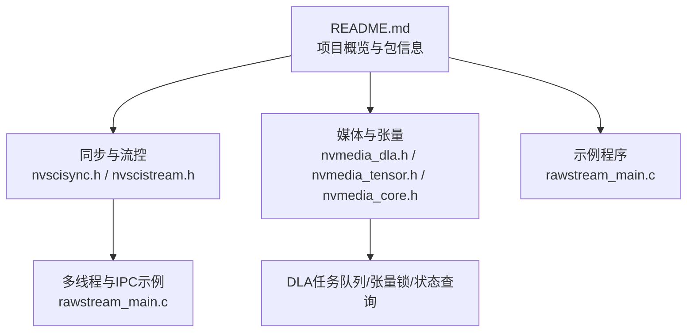
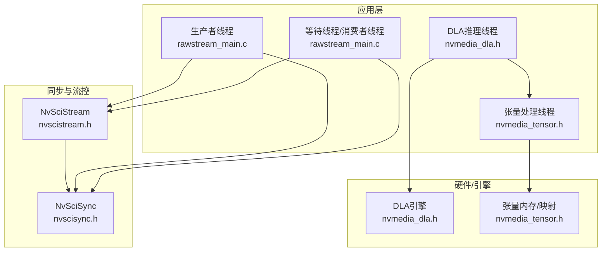
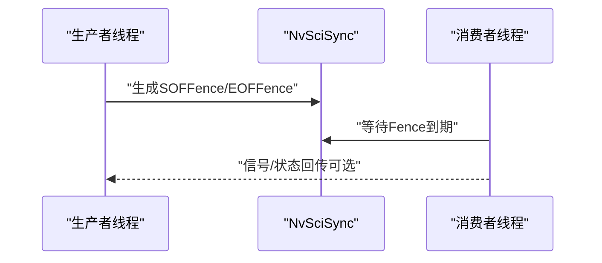
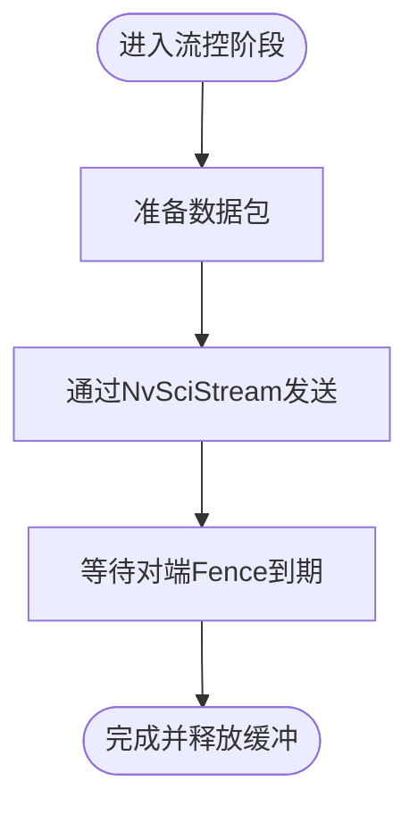
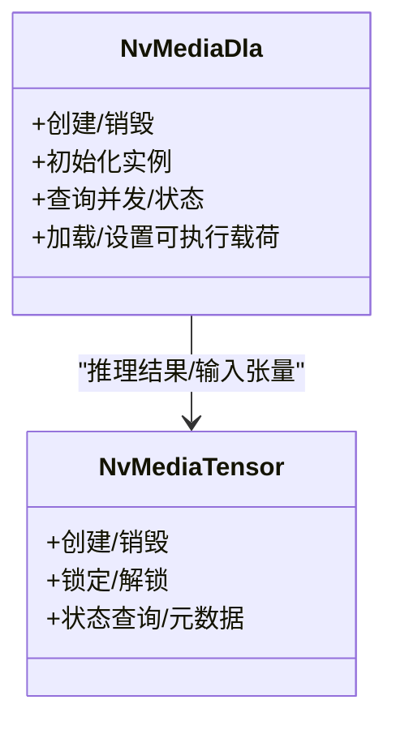
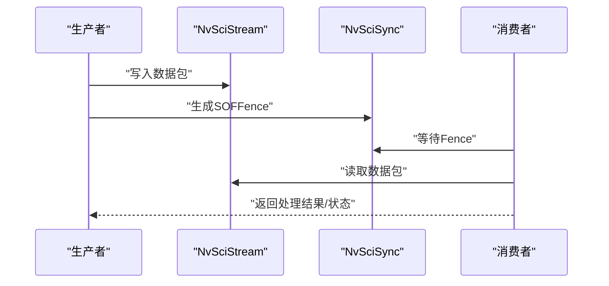
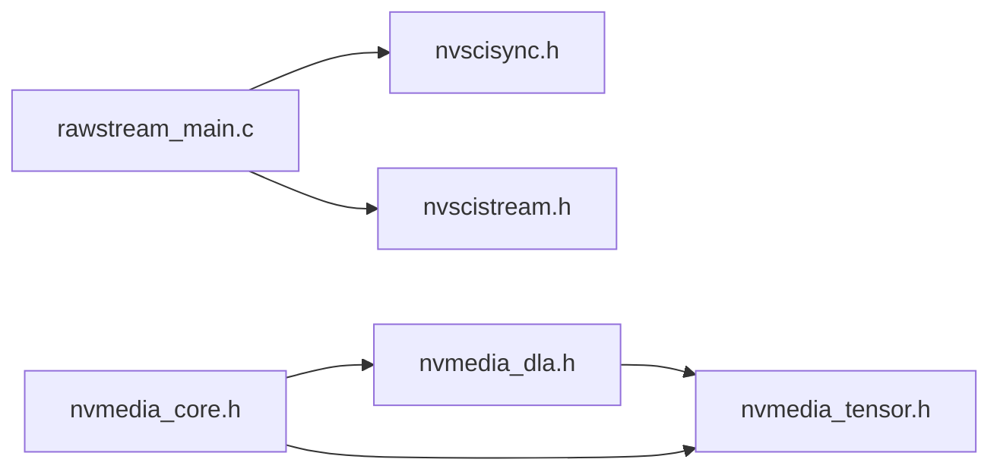

# 性能优化

<cite>
**本文引用的文件**
- [README.md](file://README.md)
- [nvscisync.h](file://driveos-6.0.5.0/drive-linux/include/nvscisync.h)
- [nvscistream.h](file://driveos-6.0.5.0/drive-linux/include/nvscistream.h)
- [nvmedia_dla.h](file://driveos-6.0.5.0/drive-linux/include/nvmedia_dla.h)
- [nvmedia_tensor.h](file://driveos-6.0.5.0/drive-linux/include/nvmedia_tensor.h)
- [nvmedia_core.h](file://driveos-6.0.5.0/drive-linux/include/nvmedia_6x/nvmedia_core.h)
- [rawstream_main.c](file://driveos-6.0.5.0/drive-linux/samples/nvsci/rawstream/rawstream_main.c)
</cite>

## 目录
1. [引言](#引言)
2. [项目结构](#项目结构)
3. [核心组件](#核心组件)
4. [架构总览](#架构总览)
5. [详细组件分析](#详细组件分析)
6. [依赖关系分析](#依赖关系分析)
7. [性能考量与优化建议](#性能考量与优化建议)
8. [故障排查指南](#故障排查指南)
9. [结论](#结论)
10. [附录：基准测试与瓶颈分析方法](#附录：基准测试与瓶颈分析方法)

## 引言
本指南面向DriveOS项目，聚焦于多线程编程、GPU加速与并行计算、内存管理、实时系统优化、媒体处理流水线以及性能基准测试与瓶颈分析。文档以仓库中的NVIDIA驱动多媒体与通信接口（如NvSciSync、NvSciStream、NvMedia DLA/Tensor）为依据，结合实际示例程序，给出可操作的优化策略与最佳实践。

## 项目结构
仓库包含多个版本的DriveOS SDK与示例，其中与性能优化直接相关的核心模块集中在以下路径：
- 同步与流控：nvscisync.h、nvscistream.h
- 媒体与张量：nvmedia_dla.h、nvmedia_tensor.h、nvmedia_core.h
- 示例程序：rawstream_main.c（展示多线程+IPC+同步）

图示来源
- [README.md:1-128](file://README.md#L1-L128)
- [nvscisync.h:1-2832](file://driveos-6.0.5.0/drive-linux/include/nvscisync.h#L1-L2832)
- [nvscistream.h:1-32](file://driveos-6.0.5.0/drive-linux/include/nvscistream.h#L1-L32)
- [nvmedia_dla.h:1-1234](file://driveos-6.0.5.0/drive-linux/include/nvmedia_dla.h#L1-L1234)
- [nvmedia_tensor.h:1-544](file://driveos-6.0.5.0/drive-linux/include/nvmedia_tensor.h#L1-L544)
- [nvmedia_core.h:1-265](file://driveos-6.0.5.0/drive-linux/include/nvmedia_6x/nvmedia_core.h#L1-L265)
- [rawstream_main.c:1-210](file://driveos-6.0.5.0/drive-linux/samples/nvsci/rawstream/rawstream_main.c#L1-L210)

章节来源
- [README.md:1-128](file://README.md#L1-L128)

## 核心组件
- 同步原语与跨进程协调：NvSciSync提供CPU等待上下文、Fence与对象生命周期管理，支持确定性Fence生成与跨进程导入导出。
- 流控与数据通道：NvSciStream在NvSciBuf/NvSciSync之上提供数据包序列的生产者-消费者模型，便于构建媒体流水线。
- DLA推理引擎：NvMedia DLA负责深度学习任务提交、队列长度与实例初始化，支撑高吞吐AI推理。
- 张量与元数据：NvMedia Tensor提供创建、锁定/解锁、状态查询与元数据访问，支持CPU缓存/非缓存映射与维度描述。
- 基础类型与错误码：NvMedia Core定义时间戳、区域、布尔、状态码与NvSciSync客户端类型等基础能力。

章节来源
- [nvscisync.h:1-2832](file://driveos-6.0.5.0/drive-linux/include/nvscisync.h#L1-L2832)
- [nvscistream.h:1-32](file://driveos-6.0.5.0/drive-linux/include/nvscistream.h#L1-L32)
- [nvmedia_dla.h:1-1234](file://driveos-6.0.5.0/drive-linux/include/nvmedia_dla.h#L1-L1234)
- [nvmedia_tensor.h:1-544](file://driveos-6.0.5.0/drive-linux/include/nvmedia_tensor.h#L1-L544)
- [nvmedia_core.h:1-265](file://driveos-6.0.5.0/drive-linux/include/nvmedia_6x/nvmedia_core.h#L1-L265)

## 架构总览
下图展示了典型媒体处理流水线中“生产者-处理-消费”三段式与同步/流控的交互关系，映射到NvSciSync/NvSciStream/NvMedia DLA/Tensor的实际接口。

图示来源
- [rawstream_main.c:1-210](file://driveos-6.0.5.0/drive-linux/samples/nvsci/rawstream/rawstream_main.c#L1-L210)
- [nvscisync.h:1-2832](file://driveos-6.0.5.0/drive-linux/include/nvscisync.h#L1-L2832)
- [nvscistream.h:1-32](file://driveos-6.0.5.0/drive-linux/include/nvscistream.h#L1-L32)
- [nvmedia_dla.h:1-1234](file://driveos-6.0.5.0/drive-linux/include/nvmedia_dla.h#L1-L1234)
- [nvmedia_tensor.h:1-544](file://driveos-6.0.5.0/drive-linux/include/nvmedia_tensor.h#L1-L544)

## 详细组件分析

### 多线程与同步（NvSciSync）
- 关键点
  - 模块生命周期：模块打开/关闭，确保跨进程一致性与资源回收。
  - Fence生成/等待：支持确定性Fence与CPU等待上下文，避免忙等。
  - 属性协商：通过AttrList在对端间达成权限与特性一致，保证跨进程互操作。
- 最佳实践
  - 使用确定性Fence减少等待不确定性；合理设置最大超时，避免无限阻塞。
  - 将CPU等待限制在必要路径，尽量采用事件/回调或批量等待降低CPU占用。
  - 对共享属性进行一次性协商，避免运行期频繁reconcile导致抖动。

图示来源
- [nvscisync.h:587-628](file://driveos-6.0.5.0/drive-linux/include/nvscisync.h#L587-L628)

章节来源
- [nvscisync.h:1-2832](file://driveos-6.0.5.0/drive-linux/include/nvscisync.h#L1-L2832)

### 媒体流控（NvSciStream）
- 关键点
  - 在NvSciBuf/NvSciSync之上提供数据包序列的流控与分发，适合构建生产者-消费者流水线。
  - 与NvSciSync Fence配合，实现帧级/包级的开始/结束同步。
- 最佳实践
  - 将“准备数据”与“发出信号”分离，减少临界区时间。
  - 利用多槽位/多通道提升并发度，同时保持严格的顺序约束。

图示来源
- [nvscistream.h:1-32](file://driveos-6.0.5.0/drive-linux/include/nvscistream.h#L1-L32)

章节来源
- [nvscistream.h:1-32](file://driveos-6.0.5.0/drive-linux/include/nvscistream.h#L1-L32)

### GPU加速与并行计算（DLA/Tensor）
- 关键点
  - DLA：实例初始化、最大并发任务数、当前负载查询；用于高吞吐AI推理。
  - Tensor：创建/锁定/解锁、状态查询、元数据访问；支持CPU缓存/非缓存映射与维度描述。
- 最佳实践
  - 合理设置DLA并发度，避免队列过长导致尾延迟。
  - 批量化输入，统一维度与对齐，减少跨引擎拷贝。
  - 使用非缓存映射时注意缓存一致性，避免脏写/失效。

图示来源
- [nvmedia_dla.h:1-1234](file://driveos-6.0.5.0/drive-linux/include/nvmedia_dla.h#L1-L1234)
- [nvmedia_tensor.h:1-544](file://driveos-6.0.5.0/drive-linux/include/nvmedia_tensor.h#L1-L544)

章节来源
- [nvmedia_dla.h:1-1234](file://driveos-6.0.5.0/drive-linux/include/nvmedia_dla.h#L1-L1234)
- [nvmedia_tensor.h:1-544](file://driveos-6.0.5.0/drive-linux/include/nvmedia_tensor.h#L1-L544)

### 内存管理与缓存友好设计
- 关键点
  - 张量支持CPU访问模式选择（缓存/非缓存/不映射），影响访问性能与一致性。
  - 提供表面映射结构，便于直接访问底层内存布局。
- 最佳实践
  - 高频读写场景优先考虑缓存映射，减少页表开销。
  - 对跨引擎共享的数据，采用非缓存映射并显式同步，避免伪共享与缓存污染。
  - 控制张量维度与对齐，减少填充与跨行访问。

章节来源
- [nvmedia_tensor.h:101-137](file://driveos-6.0.5.0/drive-linux/include/nvmedia_tensor.h#L101-L137)
- [nvmedia_tensor.h:281-286](file://driveos-6.0.5.0/drive-linux/include/nvmedia_tensor.h#L281-L286)

### 实时系统优化（优先级、中断、定时器）
- 关键点
  - NvSciSync提供CPU等待上下文与确定性Fence，有助于可预测的唤醒与截止时间控制。
  - NvMedia Core提供时间戳类型，便于统计与校准。
- 最佳实践
  - 将关键路径（Fence等待/信号）置于较高优先级线程，缩短抖动。
  - 使用固定周期定时器与Fence配对，避免动态调度带来的不确定性。
  - 严格区分“信号”与“等待”职责，避免相互阻塞。

章节来源
- [nvscisync.h:214-250](file://driveos-6.0.5.0/drive-linux/include/nvscisync.h#L214-L250)
- [nvmedia_core.h:76-77](file://driveos-6.0.5.0/drive-linux/include/nvmedia_6x/nvmedia_core.h#L76-L77)

### 媒体处理流水线（缓冲区、预取、批处理）
- 关键点
  - rawstream示例展示了多线程生产者/消费者、IPC握手与基本的缓冲区初始化。
  - 结合NvSciSync可实现“环形缓冲+双缓冲/三缓冲”的流水线。
- 最佳实践
  - 预取：在上一帧处理完成后提前准备下一帧数据，利用空闲时间进行解码/预处理。
  - 批处理：聚合小任务，减少同步与上下文切换成本。
  - 缓冲区池化：复用缓冲区，降低分配/释放开销。

图示来源
- [rawstream_main.c:1-210](file://driveos-6.0.5.0/drive-linux/samples/nvsci/rawstream/rawstream_main.c#L1-L210)
- [nvscisync.h:1-2832](file://driveos-6.0.5.0/drive-linux/include/nvscisync.h#L1-L2832)
- [nvscistream.h:1-32](file://driveos-6.0.5.0/drive-linux/include/nvscistream.h#L1-L32)

章节来源
- [rawstream_main.c:1-210](file://driveos-6.0.5.0/drive-linux/samples/nvsci/rawstream/rawstream_main.c#L1-L210)

## 依赖关系分析
- 组件耦合
  - NvSciSync与NvSciStream紧密协作，前者提供同步语义，后者提供数据通道。
  - NvMedia DLA与Tensor在推理链路中耦合，DLA负责执行，Tensor负责数据与元数据。
- 外部依赖
  - 示例程序rawstream依赖NvSciBuf/NvSciSync/NvSciIpc，体现跨进程/跨模块协同。
- 潜在风险
  - 过度reconcile AttrList会引入额外开销；应集中协商、复用对象。
  - DLA并发过高会导致队列积压与尾延迟上升。

图示来源
- [rawstream_main.c:1-210](file://driveos-6.0.5.0/drive-linux/samples/nvsci/rawstream/rawstream_main.c#L1-L210)
- [nvscisync.h:1-2832](file://driveos-6.0.5.0/drive-linux/include/nvscisync.h#L1-L2832)
- [nvscistream.h:1-32](file://driveos-6.0.5.0/drive-linux/include/nvscistream.h#L1-L32)
- [nvmedia_dla.h:1-1234](file://driveos-6.0.5.0/drive-linux/include/nvmedia_dla.h#L1-L1234)
- [nvmedia_tensor.h:1-544](file://driveos-6.0.5.0/drive-linux/include/nvmedia_tensor.h#L1-L544)
- [nvmedia_core.h:1-265](file://driveos-6.0.5.0/drive-linux/include/nvmedia_6x/nvmedia_core.h#L1-L265)

## 性能考量与优化建议
- 多线程与任务调度
  - 使用确定性Fence与CPU等待上下文，减少忙轮询；将长耗时任务拆分为可并行子任务。
  - 控制线程数量与优先级，避免过度竞争；对关键路径使用独立线程组。
- GPU加速与并行
  - 合理设置DLA并发度与队列上限，避免过载；批量化输入，统一格式与对齐。
  - 利用张量非缓存映射时注意一致性，必要时插入屏障或同步点。
- 内存管理
  - 优先缓存映射用于高频访问；对跨引擎共享数据采用非缓存映射并显式同步。
  - 控制张量维度与对齐，减少填充与跨行访问；复用缓冲区池降低分配开销。
- 实时系统
  - 将Fence等待置于高优先级线程；使用固定周期定时器与Fence配对。
  - 明确“信号/等待”职责边界，避免相互阻塞。
- 媒体流水线
  - 预取下一帧数据，利用空闲时间进行解码/预处理；聚合小任务，减少同步成本。
  - 使用环形/双缓冲/三缓冲策略，平衡延迟与吞吐。

## 故障排查指南
- 同步问题
  - 若等待超时或Fence未到期，检查AttrList权限是否满足（需CPU访问/确定性Fence）。
  - 确认模块句柄与对象生命周期匹配，避免提前释放。
- DLA/张量问题
  - DLA并发超过上限将导致排队与延迟；检查当前任务数与最大并发配置。
  - 张量锁定失败可能因被引擎占用或参数非法；确认访问类型与超时设置。
- 示例程序
  - rawstream示例展示了IPC握手、模块初始化与线程创建/回收流程，可据此定位同步/资源泄漏问题。

章节来源
- [nvscisync.h:587-628](file://driveos-6.0.5.0/drive-linux/include/nvscisync.h#L587-L628)
- [nvmedia_dla.h:382-386](file://driveos-6.0.5.0/drive-linux/include/nvmedia_dla.h#L382-L386)
- [nvmedia_tensor.h:347-352](file://driveos-6.0.5.0/drive-linux/include/nvmedia_tensor.h#L347-L352)
- [rawstream_main.c:1-210](file://driveos-6.0.5.0/drive-linux/samples/nvsci/rawstream/rawstream_main.c#L1-L210)

## 结论
通过将NvSciSync/NvSciStream与NvMedia DLA/Tensor有机结合，并遵循上述多线程、GPU加速、内存与实时系统优化策略，可在DriveOS平台上构建低延迟、高吞吐的媒体与AI处理流水线。建议以示例程序为起点，逐步扩展至生产环境，并持续进行基准测试与瓶颈分析。

## 附录：基准测试与瓶颈分析方法
- 基准测试
  - 使用NvMedia Core的时间戳类型记录关键节点时间，计算端到端延迟与各阶段耗时。
  - 对比不同缓冲策略（单/双/三缓冲）、批大小与DLA并发度，绘制吞吐-延迟曲线。
- 瓶颈分析
  - CPU侧：关注Fence等待与上下文切换；使用火焰图定位热点。
  - GPU侧：监控DLA利用率与队列长度，避免过载；检查张量拷贝与同步点。
  - 内存侧：测量带宽占用与缓存命中率，评估映射模式与对齐策略。
- 工具与方法
  - 结合示例程序的初始化与线程模型，建立可重复的测试场景。
  - 对比确定性Fence与传统信号量的抖动差异，验证实时性改进效果。