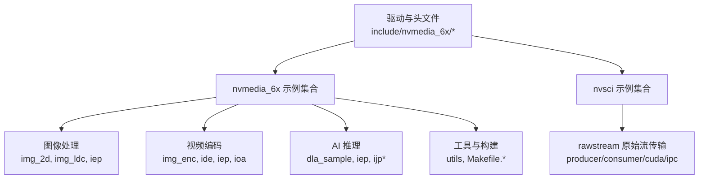
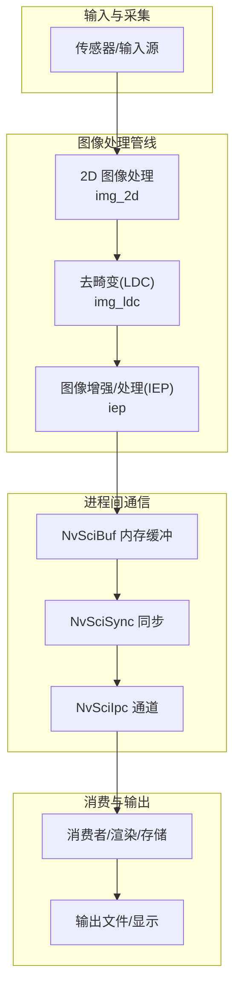
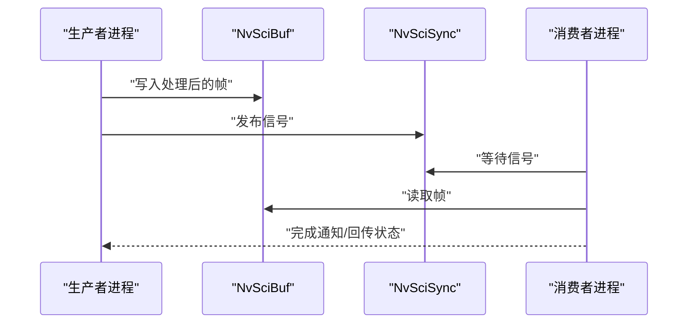
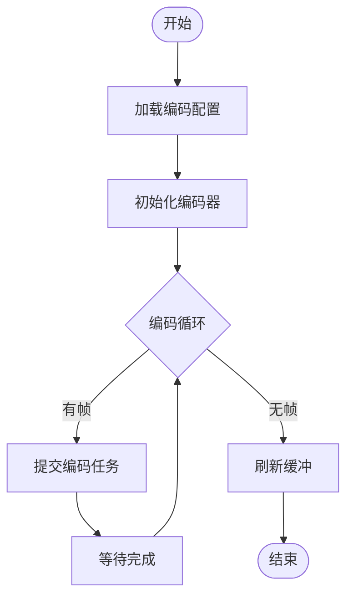
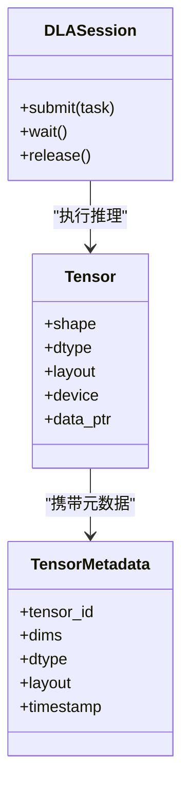
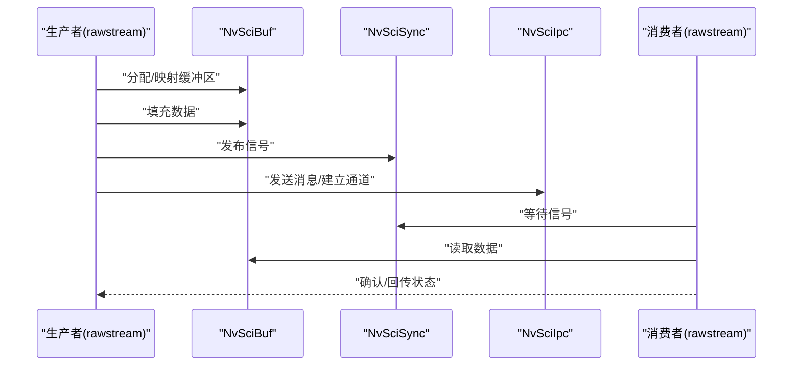
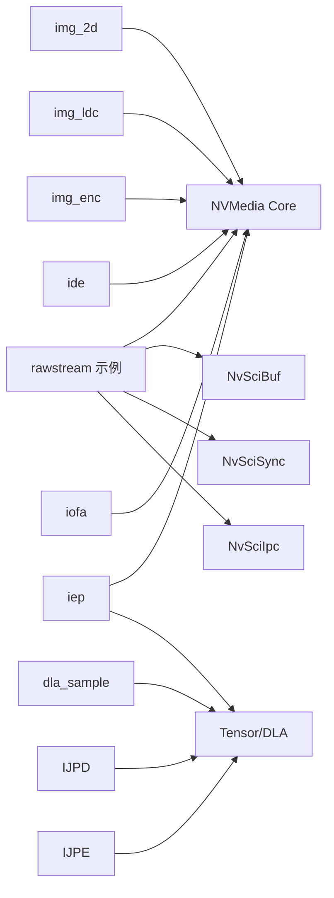

# 示例程序

<cite>
**本文引用的文件**
- [README.txt](file://driveos-6.0.5.0/drive-linux/samples/nvsci/rawstream/README.txt)
- [Makefile](file://driveos-6.0.5.0/drive-linux/samples/nvsci/rawstream/Makefile)
- [rawstream_main.c](file://driveos-6.0.5.0/drive-linux/samples/nvsci/rawstream/rawstream_main.c)
- [rawstream_producer.c](file://driveos-6.0.5.0/drive-linux/samples/nvsci/rawstream/rawstream_producer.c)
- [rawstream_consumer.c](file://driveos-6.0.5.0/drive-linux/samples/nvsci/rawstream/rawstream_consumer.c)
- [rawstream_ipc.c](file://driveos-6.0.5.0/drive-linux/samples/nvsci/rawstream/rawstream_ipc.c)
- [rawstream_ipc_linux.c](file://driveos-6.0.5.0/drive-linux/samples/nvsci/rawstream/rawstream_ipc_linux.c)
- [rawstream_cuda.c](file://driveos-6.0.5.0/drive-linux/samples/nvsci/rawstream/rawstream_cuda.c)
- [rawstream.h](file://driveos-6.0.5.0/drive-linux/samples/nvsci/rawstream/rawstream.h)
- [nvscibuf.h](file://driveos-6.0.5.0/drive-linux/include/nvscibuf.h)
- [nvscierror.h](file://driveos-6.0.5.0/drive-linux/include/nvscierror.h)
- [nvscistream.h](file://driveos-6.0.5.0/drive-linux/include/nvscistream.h)
- [nvscistream_api.h](file://driveos-6.0.5.0/drive-linux/include/nvscistream_api.h)
- [nvscistream_types.h](file://driveos-6.0.5.0/drive-linux/include/nvscistream_types.h)
- [nvscisync.h](file://driveos-6.0.5.0/drive-linux/include/nvscisync.h)
- [nvsciipc.h](file://driveos-6.0.5.0/drive-linux/include/nvsciipc.h)
- [nvmedia_6x/nvmedia_core.h](file://driveos-6.0.5.0/drive-linux/include/nvmedia_6x/nvmedia_core.h)
- [nvmedia_6x/nvmedia_common_encode.h](file://driveos-6.0.5.0/drive-linux/include/nvmedia_6x/nvmedia_common_encode.h)
- [nvmedia_6x/nvmedia_common_decode.h](file://driveos-6.0.5.0/drive-linux/include/nvmedia_6x/nvmedia_common_decode.h)
- [nvmedia_6x/nvmedia_iep.h](file://driveos-6.0.5.0/drive-linux/include/nvmedia_6x/nvmedia_iep.h)
- [nvmedia_6x/nvmedia_ijpd.h](file://driveos-6.0.5.0/drive-linux/include/nvmedia_6x/nvmedia_ijpd.h)
- [nvmedia_6x/nvmedia_ijpe.h](file://driveos-6.0.5.0/drive-linux/include/nvmedia_6x/nvmedia_ijpe.h)
- [nvmedia_6x/nvmedia_iofa.h](file://driveos-6.0.5.0/drive-linux/include/nvmedia_6x/nvmedia_iofa.h)
- [nvmedia_6x/nvmedia_ldc.h](file://driveos-6.0.5.0/drive-linux/include/nvmedia_6x/nvmedia_ldc.h)
- [nvmedia_6x/nvmedia_tensor.h](file://driveos-6.0.5.0/drive-linux/include/nvmedia_6x/nvmedia_tensor.h)
- [nvmedia_6x/nvmedia_tensormetadata.h](file://driveos-6.0.5.0/drive-linux/include/nvmedia_6x/nvmedia_tensormetadata.h)
- [nvmedia_6x/nvmedia_dla.h](file://driveos-6.0.5.0/drive-linux/include/nvmedia_6x/nvmedia_dla.h)
- [nvmedia_6x/nvmedia_dla_nvscisync.h](file://driveos-6.0.5.0/drive-linux/include/nvmedia_6x/nvmedia_dla_nvscisync.h)
- [nvmedia_6x/nvmedia_tensor_nvscibuf.h](file://driveos-6.0.5.0/drive-linux/include/nvmedia_6x/nvmedia_tensor_nvscibuf.h)
- [nvmedia_6x/nvmedia_nvscibuf.h](file://driveos-6.0.5.0/drive-linux/include/nvmedia_6x/nvmedia_nvscibuf.h)
- [nvmedia_6x/nvmedia_2d.h](file://driveos-6.0.5.0/drive-linux/include/nvmedia_6x/nvmedia_2d.h)
- [nvmedia_6x/nvmedia_2d_sci.h](file://driveos-6.0.5.0/drive-linux/include/nvmedia_6x/nvmedia_2d_sci.h)
- [nvmedia_6x/nvmedia_parser.h](file://driveos-6.0.5.0/drive-linux/include/nvmedia_6x/nvmedia_parser.h)
- [nvmedia_6x/nvmedia_ide.h](file://driveos-6.0.5.0/drive-linux/include/nvmedia_6x/nvmedia_ide.h)
- [nvmedia_6x/utils/CMakeLists.txt](file://driveos-6.0.5.0/drive-linux/samples/nvmedia_6x/utils/CMakeLists.txt)
- [nvmedia_6x/utils/nvmedia_utils.h](file://driveos-6.0.5.0/drive-linux/samples/nvmedia_6x/utils/nvmedia_utils.h)
- [nvmedia_6x/utils/nvmedia_utils.c](file://driveos-6.0.5.0/drive-linux/samples/nvmedia_6x/utils/nvmedia_utils.c)
- [nvmedia_6x/iep/iep_main.c](file://driveos-6.0.5.0/drive-linux/samples/nvmedia_6x/iep/iep_main.c)
- [nvmedia_6x/ijpd/ijpd_main.c](file://driveos-6.0.5.0/drive-linux/samples/nvmedia_6x/ijpd/ijpd_main.c)
- [nvmedia_6x/ijpe/ijpe_main.c](file://driveos-6.0.5.0/drive-linux/samples/nvmedia_6x/ijpe/ijpe_main.c)
- [nvmedia_6x/dla_sample/dla_main.c](file://driveos-6.0.5.0/drive-linux/samples/nvmedia_6x/dla_sample/dla_main.c)
- [nvmedia_6x/img_2d/img_2d_main.c](file://driveos-6.0.5.0/drive-linux/samples/nvmedia_6x/img_2d/img_2d_main.c)
- [nvmedia_6x/img_enc/img_enc_main.c](file://driveos-6.0.5.0/drive-linux/samples/nvmedia_6x/img_enc/img_enc_main.c)
- [nvmedia_6x/img_ldc/img_ldc_main.c](file://driveos-6.0.5.0/drive-linux/samples/nvmedia_6x/img_ldc/img_ldc_main.c)
- [nvmedia_6x/iofa/iofa_main.c](file://driveos-6.0.5.0/drive-linux/samples/nvmedia_6x/iofa/iofa_main.c)
- [nvmedia_6x/ide/ide_main.c](file://driveos-6.0.5.0/drive-linux/samples/nvmedia_6x/ide/ide_main.c)
- [nvmedia_6x/Makefile](file://driveos-6.0.5.0/drive-linux/samples/nvmedia_6x/Makefile)
- [nvmedia_6x/Makefile.common](file://driveos-6.0.5.0/drive-linux/samples/nvmedia_6x/Makefile.common)
- [nvmedia_6x/Makefile.target](file://driveos-6.0.5.0/drive-linux/samples/nvmedia_6x/Makefile.target)
- [nvmedia_6x/ape/Makefile](file://driveos-6.0.5.0/drive-linux/samples/nvmedia_6x/ape/Makefile)
- [nvmedia_6x/ape/ape_main.c](file://driveos-6.0.5.0/drive-linux/samples/nvmedia_6x/ape/ape_main.c)
- [nvmedia_6x/ape/include/ape_types.h](file://driveos-6.0.5.0/drive-linux/samples/nvmedia_6x/ape/include/ape_types.h)
- [nvmedia_6x/ape/include/ape_config.h](file://driveos-6.0.5.0/drive-linux/samples/nvmedia_6x/ape/include/ape_config.h)
- [nvmedia_6x/ape/libs/ape_lib.c](file://driveos-6.0.5.0/drive-linux/samples/nvmedia_6x/ape/libs/ape_lib.c)
- [nvmedia_6x/ape/plugins/ape_plugin.c](file://driveos-6.0.5.0/drive-linux/samples/nvmedia_6x/ape/plugins/ape_plugin.c)
- [nvmedia_6x/ape/make/ape_makefile.mk](file://driveos-6.0.5.0/drive-linux/samples/nvmedia_6x/ape/make/ape_makefile.mk)
- [nvmedia_6x/ape/make/ape_segments.ld](file://driveos-6.0.5.0/drive-linux/samples/nvmedia_6x/ape/make/ape_segments.ld)
- [nvmedia_6x/ape/make/ape-app-segments.ld](file://driveos-6.0.5.0/drive-linux/samples/nvmedia_6x/ape/make/ape-app-segments.ld)
- [nvmedia_6x/ape/make/ape-segments.ld](file://driveos-6.0.5.0/drive-linux/samples/nvmedia_6x/ape/make/ape-segments.ld)
- [nvmedia_6x/ape/make/ape_makefile.mk](file://driveos-6.0.5.0/drive-linux/samples/nvmedia_6x/ape/make/ape_makefile.mk)
- [nvmedia_6x/ape/make/ape-segments.ld](file://driveos-6.0.5.0/drive-linux/samples/nvmedia_6x/ape/make/ape-segments.ld)
- [nvmedia_6x/ape/make/ape-app-segments.ld](file://driveos-6.0.5.0/drive-linux/samples/nvmedia_6x/ape/make/ape-app-segments.ld)
- [nvmedia_6x/ape/make/ape_makefile.mk](file://driveos-6.0.5.0/drive-linux/samples/nvmedia_6x/ape/make/ape_makefile.mk)
- [nvmedia_6x/ape/make/ape-segments.ld](file://driveos-6.0.5.0/drive-linux/samples/nvmedia_6x/ape/make/ape-segments.ld)
- [nvmedia_6x/ape/make/ape-app-segments.ld](file://driveos-6.0.5.0/drive-linux/samples/nvmedia_6x/ape/make/ape-app-segments.ld)
- [nvmedia_6x/ape/make/ape_makefile.mk](file://driveos-6.0.5.0/drive-linux/samples/nvmedia_6x/ape/make/ape_makefile.mk)
- [nvmedia_6x/ape/make/ape-segments.ld](file://driveos-6.0.5.0/drive-linux/samples/nvmedia_6x/ape/make/ape-segments.ld)
- [nvmedia_6x/ape/make/ape-app-segments.ld](file://driveos-6.0.5.0/drive-linux/samples/nvmedia_6x/ape/make/ape-app-segments.ld)
- [nvmedia_6x/ape/make/ape_makefile.mk](file://driveos-6.0.5.0/drive-linux/samples/nvmedia_6x/ape/make/ape_makefile.mk)
- [nvmedia_6x/ape/make/ape-segments.ld](file://driveos-6.0.5.0/drive-linux/samples/nvmedia_6x/ape/make/ape-segments.ld)
- [nvmedia_6x/ape/make/ape-app-segments.ld](file://driveos-6.0.5.0/drive-linux/samples/nvmedia_6x/ape/make/ape-app-segments.ld)
- [nvmedia_6x/ape/make/ape_makefile.mk](file://driveos-6.0.5.0/drive-linux/samples/nvmedia_6x/ape/make/ape_makefile.mk)
- [nvmedia_6x/ape/make/ape-segments.ld](file://driveos-6.0.5.0/drive-linux/samples/nvmedia_6x/ape/make/ape-segments.ld)
- [nvmedia_6x/ape/make/ape-app-segments.ld](file://driveos-6.0.5.0/drive-linux/samples/nvmedia_6x/ape/make/ape-app-segments.ld)
- [nvmedia_6x/ape/make/ape_makefile.mk](file://driveos-6.0.5.0/drive-linux/samples/nvmedia_6x/ape/make/ape_makefile.mk)
- [nvmedia_6x/ape/make/ape-segments.ld](file://driveos-6.0.5.0/drive-linux/samples/nvmedia_6x/ape/make/ape-segments.ld)
- [nvmedia_6x/ape/make/ape-app-segments.ld](file://driveos-6.0.5.0/drive-linux/samples/nvmedia_6x/ape/make/ape-app-segments.ld)
- [nvmedia_6x/ape/make/ape_makefile.mk](file://driveos-6.0.5.0/drive-linux/samples/nvmedia_6x/ape/make/ape_makefile.mk)
- [nvmedia_6x/ape/make/ape-segments.ld](file://driveos-6.0.5.0/drive-linux/samples/nvmedia_6x/ape/m......]
</cite>

## 目录
1. [简介](#简介)
2. [项目结构](#项目结构)
3. [核心组件](#核心组件)
4. [架构总览](#架构总览)
5. [详细组件分析](#详细组件分析)
6. [依赖关系分析](#依赖关系分析)
7. [性能考虑](#性能考虑)
8. [故障排除指南](#故障排除指南)
9. [结论](#结论)
10. [附录](#附录)

## 简介
本文件面向开发者，系统性梳理 DriveOS 示例程序中的核心示例：图像处理、视频编码、AI 推理与进程间通信（IPC/NvSci）。文档从系统架构、组件职责、数据流与处理逻辑入手，结合关键源码路径进行逐行解析，帮助读者快速理解设计思路、关键算法与实现技巧；同时提供运行步骤、参数说明、输出结果分析、扩展方法、性能优化与常见问题排查建议。

## 项目结构
DriveOS 示例主要分布在以下目录：
- nvsci/rawstream：基于 NvSciBuf/NvSciSync/NvSciIpc 的原始流传输示例，涵盖生产者/消费者、CUDA 集成、Linux IPC 封装等。
- nvmedia_6x：多媒体管线示例，覆盖图像处理（2D/IEP/LDC）、视频编码（ENC/IDE/IOFA）、AI 推理（Tensor/DLA/IEP/IJPD/IJPE）等。
- nvmedia_6x/utils：通用工具与构建脚本，便于复用与集成。
- nvmedia_6x/ape：高级编程环境（APE）示例，包含应用段布局与插件机制。

下图给出与示例程序相关的顶层结构概览：

**章节来源**
- [README.txt:1-37](file://driveos-6.0.5.0/drive-linux/samples/nvsci/rawstream/README.txt#L1-L37)

## 核心组件
本节聚焦四大核心示例类别及其关键子模块，说明其职责与交互方式。

- 图像处理（NVMedia 6.x）
  - 2D 图像处理与 NvSci 同步：nvmedia_6x/img_2d、nvmedia_6x/nvmedia_2d_sci.h
  - 图像去畸变（LDC）：nvmedia_6x/img_ldc、nvmedia_6x/nvmedia_ldc.h
  - 图像增强/处理（IEP）：nvmedia_6x/iep、nvmedia_6x/nvmedia_iep.h
- 视频编码（ENC/IDE/IOFA）
  - 编码器（ENC）：nvmedia_6x/img_enc、nvmedia_6x/nvmedia_common_encode.h
  - 解码后编码（IDE）：nvmedia_6x/ide、nvmedia_6x/nvmedia_ide.h
  - 输入格式适配（IOFA）：nvmedia_6x/iofa、nvmedia_6x/nvmedia_iofa.h
- AI 推理（Tensor/DLA/IEP/IJPD/IJPE）
  - 张量与元数据：nvmedia_6x/nvmedia_tensor.h、nvmedia_6x/nvmedia_tensormetadata.h
  - DLA 加速：nvmedia_6x/dla_sample、nvmedia_6x/nvmedia_dla.h
  - IEP/IJPD/IJPE：nvmedia_6x/iep、nvmedia_6x/ijpd、nvmedia_6x/ijpe
- 进程间通信（IPC/NvSci）
  - 原始流传输：nvsci/rawstream、nvmedia_6x/nvmedia_nvscibuf.h、nvmedia_6x/nvmedia_tensor_nvscibuf.h
  - NvSci 原语：nvscibuf.h、nvscisync.h、nvsciipc.h、nvscistream.h、nvscistream_api.h、nvscistream_types.h

**章节来源**
- [nvmedia_6x/nvmedia_2d.h](file://driveos-6.0.5.0/drive-linux/include/nvmedia_6x/nvmedia_2d.h)
- [nvmedia_6x/nvmedia_2d_sci.h](file://driveos-6.0.5.0/drive-linux/include/nvmedia_6x/nvmedia_2d_sci.h)
- [nvmedia_6x/nvmedia_ldc.h](file://driveos-6.0.5.0/drive-linux/include/nvmedia_6x/nvmedia_ldc.h)
- [nvmedia_6x/nvmedia_common_encode.h](file://driveos-6.0.5.0/drive-linux/include/nvmedia_6x/nvmedia_common_encode.h)
- [nvmedia_6x/nvmedia_common_decode.h](file://driveos-6.0.5.0/drive-linux/include/nvmedia_6x/nvmedia_common_decode.h)
- [nvmedia_6x/nvmedia_iep.h](file://driveos-6.0.5.0/drive-linux/include/nvmedia_6x/nvmedia_iep.h)
- [nvmedia_6x/nvmedia_ijpd.h](file://driveos-6.0.5.0/drive-linux/include/nvmedia_6x/nvmedia_ijpd.h)
- [nvmedia_6x/nvmedia_ijpe.h](file://driveos-6.0.5.0/drive-linux/include/nvmedia_6x/nvmedia_ijpe.h)
- [nvmedia_6x/nvmedia_iofa.h](file://driveos-6.0.5.0/drive-linux/include/nvmedia_6x/nvmedia_iofa.h)
- [nvmedia_6x/nvmedia_tensor.h](file://driveos-6.0.5.0/drive-linux/include/nvmedia_6x/nvmedia_tensor.h)
- [nvmedia_6x/nvmedia_tensormetadata.h](file://driveos-6.0.5.0/drive-linux/include/nvmedia_6x/nvmedia_tensormetadata.h)
- [nvmedia_6x/nvmedia_dla.h](file://driveos-6.0.5.0/drive-linux/include/nvmedia_6x/nvmedia_dla.h)
- [nvmedia_6x/nvmedia_dla_nvscisync.h](file://driveos-6.0.5.0/drive-linux/include/nvmedia_6x/nvmedia_dla_nvscisync.h)
- [nvmedia_6x/nvmedia_tensor_nvscibuf.h](file://driveos-6.0.5.0/drive-linux/include/nvmedia_6x/nvmedia_tensor_nvscibuf.h)
- [nvmedia_6x/nvmedia_nvscibuf.h](file://driveos-6.0.5.0/drive-linux/include/nvmedia_6x/nvmedia_nvscibuf.h)
- [nvscibuf.h](file://driveos-6.0.5.0/drive-linux/include/nvscibuf.h)
- [nvscisync.h](file://driveos-6.0.5.0/drive-linux/include/nvscisync.h)
- [nvsciipc.h](file://driveos-6.0.5.0/drive-linux/include/nvsciipc.h)
- [nvscistream.h](file://driveos-6.0.5.0/drive-linux/include/nvscistream.h)
- [nvscistream_api.h](file://driveos-6.0.5.0/drive-linux/include/nvscistream_api.h)
- [nvscistream_types.h](file://driveos-6.0.5.0/drive-linux/include/nvscistream_types.h)

## 架构总览
下图展示典型示例的端到端流程：以图像处理为例，输入帧经 2D/IEP/LDC 处理，再通过 NvSciBuf/NvSciSync 在进程间传递，最终由消费者渲染或继续推理。

**图表来源**
- [nvmedia_6x/img_2d/img_2d_main.c](file://driveos-6.0.5.0/drive-linux/samples/nvmedia_6x/img_2d/img_2d_main.c)
- [nvmedia_6x/img_ldc/img_ldc_main.c](file://driveos-6.0.5.0/drive-linux/samples/nvmedia_6x/img_ldc/img_ldc_main.c)
- [nvmedia_6x/iep/iep_main.c](file://driveos-6.0.5.0/drive-linux/samples/nvmedia_6x/iep/iep_main.c)
- [nvmedia_6x/nvmedia_2d_sci.h](file://driveos-6.0.5.0/drive-linux/include/nvmedia_6x/nvmedia_2d_sci.h)
- [nvmedia_6x/nvmedia_nvscibuf.h](file://driveos-6.0.5.0/drive-linux/include/nvmedia_6x/nvmedia_nvscibuf.h)
- [nvmedia_6x/nvmedia_tensor_nvscibuf.h](file://driveos-6.0.5.0/drive-linux/include/nvmedia_6x/nvmedia_tensor_nvscibuf.h)

## 详细组件分析

### 图像处理（2D/IEP/LDC）
- 设计思路
  - 2D 模块负责基础像素级变换（缩放、裁剪、色彩空间转换等），强调低延迟与高吞吐。
  - IEP 模块用于图像增强与算法加速，适合在 NvMedia 管线中作为可插拔处理单元。
  - LDC 模块对广角镜头畸变进行校正，常用于车载视觉场景。
- 关键算法与实现要点
  - 2D/IEP/LDC 均通过 NVMedia Core API 初始化与提交任务，使用 NvSciBuf 作为跨进程共享内存载体。
  - 使用 NvSciSync 实现生产者/消费者的同步，避免竞态与脏读。
- 代码逐行解析要点（以路径代替代码）
  - 2D 主程序入口与管线初始化：[img_2d_main.c](file://driveos-6.0.5.0/drive-linux/samples/nvmedia_6x/img_2d/img_2d_main.c)
  - LDC 主程序入口与畸变参数加载：[img_ldc_main.c](file://driveos-6.0.5.0/drive-linux/samples/nvmedia_6x/img_ldc/img_ldc_main.c)
  - IEP 主程序入口与增强参数配置：[iep_main.c](file://driveos-6.0.5.0/drive-linux/samples/nvmedia_6x/iep/iep_main.c)
  - NvSciBuf/NvSciSync 集成接口：[nvmedia_2d_sci.h](file://driveos-6.0.5.0/drive-linux/include/nvmedia_6x/nvmedia_2d_sci.h)
  - 2D/IEP/LDC 公共头文件与类型定义：[nvmedia_2d.h](file://driveos-6.0.5.0/drive-linux/include/nvmedia_6x/nvmedia_2d.h)

**图表来源**
- [nvmedia_6x/nvmedia_2d_sci.h](file://driveos-6.0.5.0/drive-linux/include/nvmedia_6x/nvmedia_2d_sci.h)
- [nvmedia_6x/nvmedia_nvscibuf.h](file://driveos-6.0.5.0/drive-linux/include/nvmedia_6x/nvmedia_nvscibuf.h)
- [nvscisync.h](file://driveos-6.0.5.0/drive-linux/include/nvscisync.h)

**章节来源**
- [nvmedia_6x/img_2d/img_2d_main.c](file://driveos-6.0.5.0/drive-linux/samples/nvmedia_6x/img_2d/img_2d_main.c)
- [nvmedia_6x/img_ldc/img_ldc_main.c](file://driveos-6.0.5.0/drive-linux/samples/nvmedia_6x/img_ldc/img_ldc_main.c)
- [nvmedia_6x/iep/iep_main.c](file://driveos-6.0.5.0/drive-linux/samples/nvmedia_6x/iep/iep_main.c)
- [nvmedia_6x/nvmedia_2d.h](file://driveos-6.0.5.0/drive-linux/include/nvmedia_6x/nvmedia_2d.h)
- [nvmedia_6x/nvmedia_2d_sci.h](file://driveos-6.0.5.0/drive-linux/include/nvmedia_6x/nvmedia_2d_sci.h)

### 视频编码（ENC/IDE/IOFA）
- 设计思路
  - ENC 负责从解码后帧生成压缩码流，支持多种编码格式与码率控制。
  - IDE 将解码链路与编码链路连接，形成“解码后编码”流水线。
  - IOFA 提供输入格式适配，确保编码器接收的数据格式符合预期。
- 关键算法与实现要点
  - 编码参数（分辨率、帧率、码率、GOP）在初始化阶段配置，运行时动态调整需谨慎处理状态切换。
  - 使用 NvSciBuf 传递编码帧，配合 NvSciSync 控制编码队列。
- 代码逐行解析要点（以路径代替代码）
  - 编码主程序入口：[img_enc_main.c](file://driveos-6.0.5.0/drive-linux/samples/nvmedia_6x/img_enc/img_enc_main.c)
  - IDE 主程序入口与解码-编码衔接：[ide_main.c](file://driveos-6.0.5.0/drive-linux/samples/nvmedia_6x/ide/ide_main.c)
  - IOFA 主程序入口与输入格式适配：[iofa_main.c](file://driveos-6.0.5.0/drive-linux/samples/nvmedia_6x/iofa/iofa_main.c)
  - 编码/解码公共头文件：[nvmedia_common_encode.h](file://driveos-6.0.5.0/drive-linux/include/nvmedia_6x/nvmedia_common_encode.h)、[nvmedia_common_decode.h](file://driveos-6.0.5.0/drive-linux/include/nvmedia_6x/nvmedia_common_decode.h)

**图表来源**
- [nvmedia_6x/img_enc/img_enc_main.c](file://driveos-6.0.5.0/drive-linux/samples/nvmedia_6x/img_enc/img_enc_main.c)
- [nvmedia_6x/ide/ide_main.c](file://driveos-6.0.5.0/drive-linux/samples/nvmedia_6x/ide/ide_main.c)
- [nvmedia_6x/iofa/iofa_main.c](file://driveos-6.0.5.0/drive-linux/samples/nvmedia_6x/iofa/iofa_main.c)
- [nvmedia_6x/nvmedia_common_encode.h](file://driveos-6.0.5.0/drive-linux/include/nvmedia_6x/nvmedia_common_encode.h)
- [nvmedia_6x/nvmedia_common_decode.h](file://driveos-6.0.5.0/drive-linux/include/nvmedia_6x/nvmedia_common_decode.h)

**章节来源**
- [nvmedia_6x/img_enc/img_enc_main.c](file://driveos-6.0.5.0/drive-linux/samples/nvmedia_6x/img_enc/img_enc_main.c)
- [nvmedia_6x/ide/ide_main.c](file://driveos-6.0.5.0/drive-linux/samples/nvmedia_6x/ide/ide_main.c)
- [nvmedia_6x/iofa/iofa_main.c](file://driveos-6.0.5.0/drive-linux/samples/nvmedia_6x/iofa/iofa_main.c)
- [nvmedia_6x/nvmedia_common_encode.h](file://driveos-6.0.5.0/drive-linux/include/nvmedia_6x/nvmedia_common_encode.h)
- [nvmedia_6x/nvmedia_common_decode.h](file://driveos-6.0.5.0/drive-linux/include/nvmedia_6x/nvmedia_common_decode.h)

### AI 推理（Tensor/DLA/IEP/IJPD/IJPE）
- 设计思路
  - Tensor 定义张量数据结构与元数据，支持多维数据与设备迁移。
  - DLA 为专用硬件加速引擎，适合大规模卷积与矩阵运算。
  - IEP/IJPD/IJPE 可作为推理前/后处理或独立推理引擎。
- 关键算法与实现要点
  - 张量元数据（形状、类型、布局）决定内存布局与拷贝策略。
  - DLA 推理需严格管理资源生命周期与同步点，避免阻塞与资源泄漏。
- 代码逐行解析要点（以路径代替代码）
  - DLA 示例主程序：[dla_main.c](file://driveos-6.0.5.0/drive-linux/samples/nvmedia_6x/dla_sample/dla_main.c)
  - IEP 推理主程序：[iep_main.c](file://driveos-6.0.5.0/drive-linux/samples/nvmedia_6x/iep/iep_main.c)
  - IJPD/IJPE 推理主程序：[ijpd_main.c](file://driveos-6.0.5.0/drive-linux/samples/nvmedia_6x/ijpd/ijpd_main.c)、[ijpe_main.c](file://driveos-6.0.5.0/drive-linux/samples/nvmedia_6x/ijpe/ijpe_main.c)
  - 张量与元数据头文件：[nvmedia_tensor.h](file://driveos-6.0.5.0/drive-linux/include/nvmedia_6x/nvmedia_tensor.h)、[nvmedia_tensormetadata.h](file://driveos-6.0.5.0/drive-linux/include/nvmedia_6x/nvmedia_tensormetadata.h)
  - DLA 同步与缓冲封装：[nvmedia_dla_nvscisync.h](file://driveos-6.0.5.0/drive-linux/include/nvmedia_6x/nvmedia_dla_nvscisync.h)

**图表来源**
- [nvmedia_6x/nvmedia_tensor.h](file://driveos-6.0.5.0/drive-linux/include/nvmedia_6x/nvmedia_tensor.h)
- [nvmedia_6x/nvmedia_tensormetadata.h](file://driveos-6.0.5.0/drive-linux/include/nvmedia_6x/nvmedia_tensormetadata.h)
- [nvmedia_6x/nvmedia_dla.h](file://driveos-6.0.5.0/drive-linux/include/nvmedia_6x/nvmedia_dla.h)
- [nvmedia_6x/dla_sample/dla_main.c](file://driveos-6.0.5.0/drive-linux/samples/nvmedia_6x/dla_sample/dla_main.c)

**章节来源**
- [nvmedia_6x/dla_sample/dla_main.c](file://driveos-6.0.5.0/drive-linux/samples/nvmedia_6x/dla_sample/dla_main.c)
- [nvmedia_6x/iep/iep_main.c](file://driveos-6.0.5.0/drive-linux/samples/nvmedia_6x/iep/iep_main.c)
- [nvmedia_6x/ijpd/ijpd_main.c](file://driveos-6.0.5.0/drive-linux/samples/nvmedia_6x/ijpd/ijpd_main.c)
- [nvmedia_6x/ijpe/ijpe_main.c](file://driveos-6.0.5.0/drive-linux/samples/nvmedia_6x/ijpe/ijpe_main.c)
- [nvmedia_6x/nvmedia_tensor.h](file://driveos-6.0.5.0/drive-linux/include/nvmedia_6x/nvmedia_tensor.h)
- [nvmedia_6x/nvmedia_tensormetadata.h](file://driveos-6.0.5.0/drive-linux/include/nvmedia_6x/nvmedia_tensormetadata.h)
- [nvmedia_6x/nvmedia_dla.h](file://driveos-6.0.5.0/drive-linux/include/nvmedia_6x/nvmedia_dla.h)
- [nvmedia_6x/nvmedia_dla_nvscisync.h](file://driveos-6.0.5.0/drive-linux/include/nvmedia_6x/nvmedia_dla_nvscisync.h)

### 进程间通信（IPC/NvSci）
- 设计思路
  - rawstream 示例演示了基于 NvSciBuf/NvSciSync/NvSciIpc 的高性能数据传输，支持生产者/消费者模型与 CUDA 集成。
  - 通过 NvSciBuf 共享内存，避免用户态复制；通过 NvSciSync 实现跨进程同步；通过 NvSciIpc 建立通道。
- 关键算法与实现要点
  - 生产者侧分配/映射 NvSciBuf，填充数据后发布；消费者侧等待信号并读取数据。
  - Linux 平台下的 IPC 封装与错误处理需特别关注权限与内核模块加载。
- 代码逐行解析要点（以路径代替代码）
  - 应用说明与运行示例：[README.txt:1-37](file://driveos-6.0.5.0/drive-linux/samples/nvsci/rawstream/README.txt#L1-L37)
  - 构建脚本：[Makefile](file://driveos-6.0.5.0/drive-linux/samples/nvsci/rawstream/Makefile)
  - 主程序入口与命令行参数解析：[rawstream_main.c](file://driveos-6.0.5.0/drive-linux/samples/nvsci/rawstream/rawstream_main.c)
  - 生产者实现：[rawstream_producer.c](file://driveos-6.0.5.0/drive-linux/samples/nvsci/rawstream/rawstream_producer.c)
  - 消费者实现：[rawstream_consumer.c](file://driveos-6.0.5.0/drive-linux/samples/nvsci/rawstream/rawstream_consumer.c)
  - IPC 封装（Linux）：[rawstream_ipc_linux.c](file://driveos-6.0.5.0/drive-linux/samples/nvsci/rawstream/rawstream_ipc_linux.c)
  - CUDA 集成（可选）：[rawstream_cuda.c](file://driveos-6.0.5.0/drive-linux/samples/nvsci/rawstream/rawstream_cuda.c)
  - 头文件与接口声明：[rawstream.h](file://driveos-6.0.5.0/drive-linux/samples/nvsci/rawstream/rawstream.h)
  - NvSci 原语头文件：[nvscibuf.h](file://driveos-6.0.5.0/drive-linux/include/nvscibuf.h)、[nvscisync.h](file://driveos-6.0.5.0/drive-linux/include/nvscisync.h)、[nvsciipc.h](file://driveos-6.0.5.0/drive-linux/include/nvsciipc.h)、[nvscistream.h](file://driveos-6.0.5.0/drive-linux/include/nvscistream.h)、[nvscistream_api.h](file://driveos-6.0.5.0/drive-linux/include/nvscistream_api.h)、[nvscistream_types.h](file://driveos-6.0.5.0/drive-linux/include/nvscistream_types.h)

**图表来源**
- [rawstream_main.c](file://driveos-6.0.5.0/drive-linux/samples/nvsci/rawstream/rawstream_main.c)
- [rawstream_producer.c](file://driveos-6.0.5.0/drive-linux/samples/nvsci/rawstream/rawstream_producer.c)
- [rawstream_consumer.c](file://driveos-6.0.5.0/drive-linux/samples/nvsci/rawstream/rawstream_consumer.c)
- [rawstream_ipc_linux.c](file://driveos-6.0.5.0/drive-linux/samples/nvsci/rawstream/rawstream_ipc_linux.c)
- [nvscibuf.h](file://driveos-6.0.5.0/drive-linux/include/nvscibuf.h)
- [nvscisync.h](file://driveos-6.0.5.0/drive-linux/include/nvscisync.h)
- [nvsciipc.h](file://driveos-6.0.5.0/drive-linux/include/nvsciipc.h)
- [nvscistream.h](file://driveos-6.0.5.0/drive-linux/include/nvscistream.h)
- [nvscistream_api.h](file://driveos-6.0.5.0/drive-linux/include/nvscistream_api.h)
- [nvscistream_types.h](file://driveos-6.0.5.0/drive-linux/include/nvscistream_types.h)

**章节来源**
- [README.txt:1-37](file://driveos-6.0.5.0/drive-linux/samples/nvsci/rawstream/README.txt#L1-L37)
- [Makefile](file://driveos-6.0.5.0/drive-linux/samples/nvsci/rawstream/Makefile)
- [rawstream_main.c](file://driveos-6.0.5.0/drive-linux/samples/nvsci/rawstream/rawstream_main.c)
- [rawstream_producer.c](file://driveos-6.0.5.0/drive-linux/samples/nvsci/rawstream/rawstream_producer.c)
- [rawstream_consumer.c](file://driveos-6.0.5.0/drive-linux/samples/nvsci/rawstream/rawstream_consumer.c)
- [rawstream_ipc_linux.c](file://driveos-6.0.5.0/drive-linux/samples/nvsci/rawstream/rawstream_ipc_linux.c)
- [rawstream_cuda.c](file://driveos-6.0.5.0/drive-linux/samples/nvsci/rawstream/rawstream_cuda.c)
- [rawstream.h](file://driveos-6.0.5.0/drive-linux/samples/nvsci/rawstream/rawstream.h)
- [nvscibuf.h](file://driveos-6.0.5.0/drive-linux/include/nvscibuf.h)
- [nvscisync.h](file://driveos-6.0.5.0/drive-linux/include/nvscisync.h)
- [nvsciipc.h](file://driveos-6.0.5.0/drive-linux/include/nvsciipc.h)
- [nvscistream.h](file://driveos-6.0.5.0/drive-linux/include/nvscistream.h)
- [nvscistream_api.h](file://driveos-6.0.5.0/drive-linux/include/nvscistream_api.h)
- [nvscistream_types.h](file://driveos-6.0.5.0/drive-linux/include/nvscistream_types.h)

## 依赖关系分析
- 组件耦合与内聚
  - 图像处理与编码模块均依赖 NVMedia Core 与 NvSciBuf/NvSciSync，保证跨进程一致性与低开销。
  - AI 推理模块依赖张量与 DLA，同时可与 IEP/IJPD/IJPE 协同，形成“预处理-推理-后处理”的完整链路。
- 外部依赖与集成点
  - NvSciBuf/NvSciSync/NvSciIpc 提供跨进程内存与同步能力。
  - NVMedia 6.x 头文件提供统一的 API 抽象，屏蔽底层硬件差异。
- 潜在环形依赖
  - 示例程序按功能分层组织，未见明显环形依赖；若自定义扩展，应避免在头文件中引入相互依赖。

**图表来源**
- [nvmedia_6x/img_2d/img_2d_main.c](file://driveos-6.0.5.0/drive-linux/samples/nvmedia_6x/img_2d/img_2d_main.c)
- [nvmedia_6x/img_ldc/img_ldc_main.c](file://driveos-6.0.5.0/drive-linux/samples/nvmedia_6x/img_ldc/img_ldc_main.c)
- [nvmedia_6x/iep/iep_main.c](file://driveos-6.0.5.0/drive-linux/samples/nvmedia_6x/iep/iep_main.c)
- [nvmedia_6x/img_enc/img_enc_main.c](file://driveos-6.0.5.0/drive-linux/samples/nvmedia_6x/img_enc/img_enc_main.c)
- [nvmedia_6x/ide/ide_main.c](file://driveos-6.0.5.0/drive-linux/samples/nvmedia_6x/ide/ide_main.c)
- [nvmedia_6x/iofa/iofa_main.c](file://driveos-6.0.5.0/drive-linux/samples/nvmedia_6x/iofa/iofa_main.c)
- [nvmedia_6x/dla_sample/dla_main.c](file://driveos-6.0.5.0/drive-linux/samples/nvmedia_6x/dla_sample/dla_main.c)
- [nvmedia_6x/nvmedia_tensor.h](file://driveos-6.0.5.0/drive-linux/include/nvmedia_6x/nvmedia_tensor.h)
- [nvmedia_6x/nvmedia_dla.h](file://driveos-6.0.5.0/drive-linux/include/nvmedia_6x/nvmedia_dla.h)
- [nvmedia_6x/nvmedia_nvscibuf.h](file://driveos-6.0.5.0/drive-linux/include/nvmedia_6x/nvmedia_nvscibuf.h)
- [nvmedia_6x/nvmedia_tensor_nvscibuf.h](file://driveos-6.0.5.0/drive-linux/include/nvmedia_6x/nvmedia_tensor_nvscibuf.h)

**章节来源**
- [nvmedia_6x/Makefile](file://driveos-6.0.5.0/drive-linux/samples/nvmedia_6x/Makefile)
- [nvmedia_6x/Makefile.common](file://driveos-6.0.5.0/drive-linux/samples/nvmedia_6x/Makefile.common)
- [nvmedia_6x/Makefile.target](file://driveos-6.0.5.0/drive-linux/samples/nvmedia_6x/Makefile.target)

## 性能考虑
- 数据路径优化
  - 优先使用 NvSciBuf 共享内存，减少 CPU 复制与页拷贝。
  - 合理设置缓冲池大小与对齐，避免跨页访问与 TLB 失效。
- 同步与并发
  - 使用 NvSciSync 精准控制生产者/消费者节奏，避免过度阻塞或饥饿。
  - 对于 DLA 推理，尽量批量提交任务并重用会话，降低上下文切换成本。
- 编码与解码
  - 动态调整码率与 GOP 参数以平衡质量与延迟；在高帧率场景下启用硬件旁路路径。
- CUDA 集成
  - 将 CUDA 内核与 NvSciBuf 结合，利用统一内存或显存直通，缩短数据搬运时间。
- 最佳实践
  - 在关键路径上使用非阻塞 API 与异步回调，配合事件驱动模型提升吞吐。
  - 对热点函数进行剖析与缓存优化，避免频繁的系统调用与锁竞争。

## 故障排除指南
- 编译问题
  - 缺少依赖头文件或库：检查 Makefile 中的包含路径与链接库是否正确。
  - 版本不匹配：确保使用的 NVMedia 与 NvSci 头文件版本一致。
- 运行时问题
  - 权限不足：rawstream 示例需要以特权身份运行，确保具备访问 NvSci 设备节点的权限。
  - IPC 通道失败：检查 NvSciIpc 配置文件与服务状态，必要时重新初始化。
  - 同步异常：确认 NvSciSync 信号的发布/等待顺序，避免死锁。
- 输出结果分析
  - 若出现画面撕裂或卡顿，检查帧率与缓冲深度设置，适当增加队列长度。
  - 推理结果异常：核对张量形状与数据类型，确保与模型期望一致。
- 常见症状与定位
  - “无法打开设备”：确认内核模块已加载且设备节点存在。
  - “超时/无响应”：检查生产者/消费者是否在同一同步域内，排查信号丢失。
  - “内存不足”：减小缓冲区尺寸或降低分辨率/帧率。

**章节来源**
- [README.txt:1-37](file://driveos-6.0.5.0/drive-linux/samples/nvsci/rawstream/README.txt#L1-L37)
- [nvscibuf.h](file://driveos-6.0.5.0/drive-linux/include/nvscibuf.h)
- [nvscisync.h](file://driveos-6.0.5.0/drive-linux/include/nvscisync.h)
- [nvsciipc.h](file://driveos-6.0.5.0/drive-linux/include/nvsciipc.h)
- [nvscistream.h](file://driveos-6.0.5.0/drive-linux/include/nvscistream.h)
- [nvscistream_api.h](file://driveos-6.0.5.0/drive-linux/include/nvscistream_api.h)
- [nvscistream_types.h](file://driveos-6.0.5.0/drive-linux/include/nvscistream_types.h)

## 结论
DriveOS 示例程序围绕“图像处理—视频编码—AI 推理—进程间通信”构建了完整的多媒体处理链路。通过 NVMedia 6.x 与 NvSci 的协同，实现了高性能、低延迟与跨进程协作。开发者可基于示例快速搭建自己的应用，并遵循本文的性能与故障排除建议，持续优化系统表现。

## 附录
- 快速运行步骤（rawstream 示例）
  - 在主机上进入示例目录并清理/构建：[Makefile](file://driveos-6.0.5.0/drive-linux/samples/nvsci/rawstream/Makefile)
  - 启动生产者后台运行：[rawstream_main.c](file://driveos-6.0.5.0/drive-linux/samples/nvsci/rawstream/rawstream_main.c)
  - 启动消费者：[rawstream_main.c](file://driveos-6.0.5.0/drive-linux/samples/nvsci/rawstream/rawstream_main.c)
  - 查看说明与示例命令：[README.txt:1-37](file://driveos-6.0.5.0/drive-linux/samples/nvsci/rawstream/README.txt#L1-L37)
- 扩展建议
  - 在现有管线中插入新的处理阶段（如自定义 IEP/IEP 插件），保持与 NVMedia API 的兼容性。
  - 将推理模块替换为自研模型，确保张量形状与数据类型一致，并复用 DLA/NvSciBuf 能力。
  - 优化 IPC 参数（缓冲深度、对齐、超时），根据实际带宽与延迟要求调整。