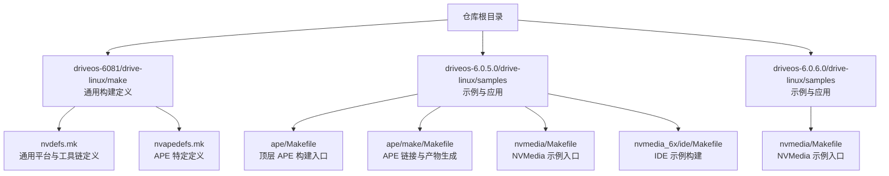
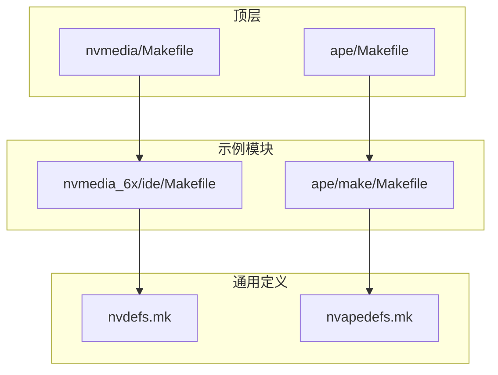
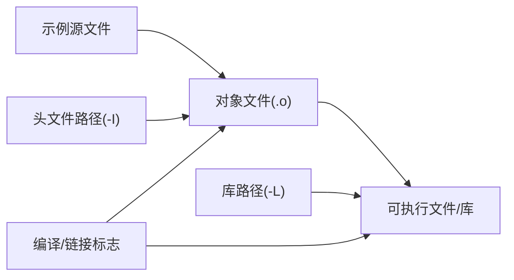

# 编译与构建

<cite>
**本文引用的文件**
- [README.md](file://README.md)
- [nvdefs.mk](file://driveos-6081/drive-linux/make/nvdefs.mk)
- [nvapedefs.mk](file://driveos-6081/drive-linux/make/nvapedefs.mk)
- [ape/Makefile](file://driveos-6.0.5.0/drive-linux/samples/ape/Makefile)
- [ape/make/Makefile](file://driveos-6.0.5.0/drive-linux/samples/ape/make/Makefile)
- [nvmedia/Makefile](file://driveos-6.0.5.0/drive-linux/samples/nvmedia/Makefile)
- [nvmedia_6x/ide/Makefile](file://driveos-6.0.5.0/drive-linux/samples/nvmedia_6x/ide/Makefile)
- [nvmedia/nvsipl/Makefile](file://driveos-6.0.5.0/drive-linux/samples/nvmedia/nvsipl/Makefile)
- [nvmedia/Makefile](file://driveos-6.0.6.0/drive-linux/samples/nvmedia/Makefile)
</cite>

## 目录
1. [引言](#引言)
2. [项目结构](#项目结构)
3. [核心组件](#核心组件)
4. [架构总览](#架构总览)
5. [详细组件分析](#详细组件分析)
6. [依赖关系分析](#依赖关系分析)
7. [性能考虑](#性能考虑)
8. [故障排查指南](#故障排查指南)
9. [结论](#结论)
10. [附录](#附录)

## 引言
本指南面向使用 DriveOS 的开发者，系统性讲解基于 Makefile 的编译与构建体系，覆盖以下主题：
- Makefile 结构与配置要点：编译选项、链接设置、依赖管理
- 交叉编译环境配置：针对 Tegra 平台（aarch64）的工具链与路径约定
- 完整构建流程：从源码获取到可执行产物生成
- 构建系统工作原理：目标文件生成、库链接、符号解析
- 新增源文件与修改配置的方法
- 常见构建错误诊断与解决
- 性能优化的编译选项与建议
- 不同应用场景下的构建配置示例（图形、多媒体、APE 等）

## 项目结构
本仓库包含多个版本的 DriveOS SDK（如 6.0.5.0、6.0.6.0、60100、6081 等），各版本在驱动与样例组织上略有差异。顶层 README 提供了版本与包信息概览；构建系统的核心位于各版本的 drive-linux 目录中，尤其是 make 子目录下的通用构建定义文件，以及 samples 下各功能模块的独立 Makefile。

图表来源
- [README.md:1-128](file://README.md#L1-L128)
- [nvdefs.mk:1-198](file://driveos-6081/drive-linux/make/nvdefs.mk#L1-L198)
- [nvapedefs.mk:1-69](file://driveos-6081/drive-linux/make/nvapedefs.mk#L1-L69)
- [ape/Makefile:1-18](file://driveos-6.0.5.0/drive-linux/samples/ape/Makefile#L1-L18)
- [ape/make/Makefile:1-86](file://driveos-6.0.5.0/drive-linux/samples/ape/make/Makefile#L1-L86)
- [nvmedia/Makefile:1-17](file://driveos-6.0.5.0/drive-linux/samples/nvmedia/Makefile#L1-L17)
- [nvmedia_6x/ide/Makefile:1-41](file://driveos-6.0.5.0/drive-linux/samples/nvmedia_6x/ide/Makefile#L1-L41)
- [nvmedia/Makefile:1-17](file://driveos-6.0.6.0/drive-linux/samples/nvmedia/Makefile#L1-L17)

章节来源
- [README.md:1-128](file://README.md#L1-L128)

## 核心组件
- 通用构建定义（nvdefs.mk）
  - 定义平台变量、工具链前缀、交叉编译器选择、包含与库路径、窗口系统分支、链接器参数等
  - 提供默认优化级别、调试开关、数学与线程库等基础配置
- APE 特定定义（nvapedefs.mk）
  - 针对 APE（Adaptive Processing Engine）目标的 CPU/ABI/编译选项
  - 指定交叉工具链路径、链接脚本、栈分析工具等
- 示例模块 Makefile
  - 顶层聚合（如 ape/Makefile、nvmedia/Makefile）通过 SUBDIRS 递归调用子级 Makefile
  - 具体示例（如 nvmedia_6x/ide/Makefile）声明目标、源文件、头文件路径、库依赖与链接参数

章节来源
- [nvdefs.mk:1-198](file://driveos-6081/drive-linux/make/nvdefs.mk#L1-L198)
- [nvapedefs.mk:1-69](file://driveos-6081/drive-linux/make/nvapedefs.mk#L1-L69)
- [ape/Makefile:1-18](file://driveos-6.0.5.0/drive-linux/samples/ape/Makefile#L1-L18)
- [nvmedia/Makefile:1-17](file://driveos-6.0.5.0/drive-linux/samples/nvmedia/Makefile#L1-L17)
- [nvmedia_6x/ide/Makefile:1-41](file://driveos-6.0.5.0/drive-linux/samples/nvmedia_6x/ide/Makefile#L1-L41)

## 架构总览
下图展示从顶层到示例模块的构建调用关系与关键变量来源：

图表来源
- [ape/Makefile:1-18](file://driveos-6.0.5.0/drive-linux/samples/ape/Makefile#L1-L18)
- [ape/make/Makefile:1-86](file://driveos-6.0.5.0/drive-linux/samples/ape/make/Makefile#L1-L86)
- [nvmedia/Makefile:1-17](file://driveos-6.0.5.0/drive-linux/samples/nvmedia/Makefile#L1-L17)
- [nvmedia_6x/ide/Makefile:1-41](file://driveos-6.0.5.0/drive-linux/samples/nvmedia_6x/ide/Makefile#L1-L41)
- [nvdefs.mk:1-198](file://driveos-6081/drive-linux/make/nvdefs.mk#L1-L198)
- [nvapedefs.mk:1-69](file://driveos-6081/drive-linux/make/nvapedefs.mk#L1-L69)

## 详细组件分析

### 通用构建定义（nvdefs.mk）
- 工具链与交叉编译
  - 通过工具链目录设置交叉编译器前缀，并在非 Yocto 环境下强制替换默认 host 工具为交叉工具
  - 提供 strip、nm、ranlib 等辅助工具的交叉版本
- 平台与优化
  - 默认优化级别与调试开关控制编译选项集合
  - 提供数学库与线程库的默认链接参数
- 包含与库路径
  - SDK 头文件与库路径集中定义，支持 rpath-link 以确保运行时库解析正确
- 窗口系统分支
  - 通过 NV_WINSYS 选择 EGL/Wayland/X11/Direct-to-display 等后端，注入对应的 CPPFLAGS 与链接库
- 目标文件生成规则
  - 为不同窗口系统提供 .o 生成规则，便于按后端分离编译输出

章节来源
- [nvdefs.mk:1-198](file://driveos-6081/drive-linux/make/nvdefs.mk#L1-L198)

### APE 构建定义（nvapedefs.mk）
- APE 专用编译选项
  - 针对 Cortex-A9、NEON、Thumb 模式等的 CPU/ABI 选项
  - 面向嵌入式 DSP 的优化与警告策略
- 工具链与链接脚本
  - 明确交叉工具链路径、链接脚本与栈分析工具位置
- 库与二进制产物
  - 定义 ELF/BIN/DBG/SIZE/SYM/LST/STACK/VECTOR 等产物目标及其生成规则

章节来源
- [nvapedefs.mk:1-69](file://driveos-6081/drive-linux/make/nvapedefs.mk#L1-L69)

### 顶层示例入口（ape/Makefile）
- 通过 SUBDIRS 聚合 libs、plugins、make 等子目录
- 使用递归 make 调用子级 Makefile，实现分层构建

章节来源
- [ape/Makefile:1-18](file://driveos-6.0.5.0/drive-linux/samples/ape/Makefile#L1-L18)

### APE 链接与产物（ape/make/Makefile）
- 目标产物
  - 定义 ELF、BIN、DEBUG、SIZE、SYM、LST、STACK、VECTOR、压缩固件等产物
- 链接与打包
  - 使用链接脚本与全归档方式合并静态库
  - 通过 objcopy 生成二进制镜像与向量表片段
  - 可选压缩镜像模式，拼接加载器或向量表
- 调试与分析
  - 生成反汇编、符号表、大小排序、栈使用分析等辅助文件

章节来源
- [ape/make/Makefile:1-86](file://driveos-6.0.5.0/drive-linux/samples/ape/make/Makefile#L1-L86)

### NVMedia 示例入口（nvmedia/Makefile）
- 顶层聚合 nvsipl 子模块，递归构建子级示例

章节来源
- [nvmedia/Makefile:1-17](file://driveos-6.0.5.0/drive-linux/samples/nvmedia/Makefile#L1-L17)
- [nvmedia/Makefile:1-17](file://driveos-6.0.6.0/drive-linux/samples/nvmedia/Makefile#L1-L17)

### NVMedia_6x IDE 示例（nvmedia_6x/ide/Makefile）
- 目标与源文件
  - 声明可执行目标与对象文件列表
- 编译与链接
  - 统一使用 NV 平台相关变量（NV_PLATFORM_*）进行编译与链接
  - 显式指定第三方库与数学库等链接依赖
- 条件链接
  - 根据操作系统条件追加实时库等链接参数

章节来源
- [nvmedia_6x/ide/Makefile:1-41](file://driveos-6.0.5.0/drive-linux/samples/nvmedia_6x/ide/Makefile#L1-L41)

## 依赖关系分析
- 变量继承链
  - 示例模块 Makefile 通过 include 引入 nvdefs.mk 或 nvapedefs.mk，从而获得统一的工具链、包含与库路径、窗口系统分支等
- 目标文件与库
  - 示例模块将源文件编译为对象文件，再由链接阶段合并为可执行文件或库
  - 链接阶段通过 LDLIBS 与 LDFLAGS 指定外部库与运行时路径
- 顶层聚合
  - 顶层 Makefile 通过 SUBDIRS 将多级目录的构建串联起来，形成清晰的层次化依赖

图表来源
- [nvmedia_6x/ide/Makefile:1-41](file://driveos-6.0.5.0/drive-linux/samples/nvmedia_6x/ide/Makefile#L1-L41)
- [nvdefs.mk:1-198](file://driveos-6081/drive-linux/make/nvdefs.mk#L1-L198)

章节来源
- [nvmedia_6x/ide/Makefile:1-41](file://driveos-6.0.5.0/drive-linux/samples/nvmedia_6x/ide/Makefile#L1-L41)
- [nvdefs.mk:1-198](file://driveos-6081/drive-linux/make/nvdefs.mk#L1-L198)

## 性能考虑
- 编译优化
  - Release 默认采用较小体积优化（-Os），并开启内联与指令调度相关选项；Debug 则启用调试信息
- 链接优化
  - 启用链接器去重与节合并，有助于减小二进制体积
- 运行时库
  - 通过 rpath-link 指定库搜索路径，避免运行时动态链接失败
- 窗口系统选择
  - Wayland/X11 等后端会影响链接库与编译宏，按需选择以减少不必要的依赖

章节来源
- [nvdefs.mk:1-198](file://driveos-6081/drive-linux/make/nvdefs.mk#L1-L198)

## 故障排查指南
- 交叉编译器未生效
  - 现象：构建仍使用 host 工具
  - 排查：确认 nvdefs.mk 中是否处于非 Yocto 环境，且 CC/CXX/AR/LD 是否被强制替换
  - 参考：[nvdefs.mk:92-133](file://driveos-6081/drive-linux/make/nvdefs.mk#L92-L133)
- 工具链路径不正确
  - 现象：找不到交叉编译器或工具
  - 排查：检查 nvdefs.mk/nvapedefs.mk 中的 CROSSBIN 与工具链目录是否存在
  - 参考：[nvdefs.mk:81](file://driveos-6081/drive-linux/make/nvdefs.mk#L81)，[nvapedefs.mk:59](file://driveos-6081/drive-linux/make/nvapedefs.mk#L59)
- 头文件或库找不到
  - 现象：编译报包含/未定义符号
  - 排查：核对 NV_PLATFORM_SDK_INC_DIR/NV_PLATFORM_SDK_LIB_DIR 与 NV_PLATFORM_TARGET_* 路径是否正确
  - 参考：[nvdefs.mk:53-61](file://driveos-6081/drive-linux/make/nvdefs.mk#L53-L61)，[nvdefs.mk:137-147](file://driveos-6081/drive-linux/make/nvdefs.mk#L137-L147)
- 窗口系统配置错误
  - 现象：链接失败或运行时报平台相关错误
  - 排查：检查 NV_WINSYS 设置与对应分支的 CPPFLAGS/库列表
  - 参考：[nvdefs.mk:162-189](file://driveos-6081/drive-linux/make/nvdefs.mk#L162-L189)
- APE 链接问题
  - 现象：APE 链接失败或产物异常
  - 排查：确认链接脚本、全归档合并、objcopy 步骤是否按预期执行
  - 参考：[ape/make/Makefile:61-62](file://driveos-6.0.5.0/drive-linux/samples/ape/make/Makefile#L61-L62)，[ape/make/Makefile:46-59](file://driveos-6.0.5.0/drive-linux/samples/ape/make/Makefile#L46-L59)

## 结论
本指南梳理了 DriveOS 的 Makefile 构建体系，明确了通用定义、示例模块与顶层聚合之间的关系，给出了交叉编译配置、构建流程、依赖管理与性能优化的关键点。按照本文步骤，可在 Tegra 平台上稳定地完成从源码到可执行文件的构建，并根据场景灵活调整窗口系统与工具链配置。

## 附录

### 从源码获取到可执行文件的完整流程
- 准备环境
  - 安装并激活交叉工具链（参考 nvdefs.mk/nvapedefs.mk 中的工具链路径）
  - 设置 NV_WINSYS（x11/wayland/egldevice/direct-to-display）以匹配目标显示后端
- 获取源码
  - 从仓库中检出所需版本的 drive-linux 源码与示例
- 构建步骤
  - 在顶层示例目录执行 make，触发 SUBDIRS 递归构建
  - 示例模块 Makefile 通过 include 引入通用定义，完成编译与链接
- 产物位置
  - APE 产物位于 ape/make/target 目录
  - NVMedia 示例产物位于各自示例目录

章节来源
- [ape/Makefile:1-18](file://driveos-6.0.5.0/drive-linux/samples/ape/Makefile#L1-L18)
- [ape/make/Makefile:1-86](file://driveos-6.0.5.0/drive-linux/samples/ape/make/Makefile#L1-L86)
- [nvmedia/Makefile:1-17](file://driveos-6.0.5.0/drive-linux/samples/nvmedia/Makefile#L1-L17)
- [nvmedia_6x/ide/Makefile:1-41](file://driveos-6.0.5.0/drive-linux/samples/nvmedia_6x/ide/Makefile#L1-L41)

### 添加新源文件与修改现有配置
- 新增源文件
  - 在示例模块 Makefile 中将新增源文件加入 OBJS 列表
  - 如需额外头文件路径，请在 CFLAGS 中追加 -I
- 修改链接库
  - 在 LDLIBS 中追加所需的库名（如 -lnvmedia_*）
- 调整编译选项
  - 在示例模块 Makefile 中修改 CFLAGS/CPPFLAGS/LDFLAGS
- APE 特殊配置
  - 若涉及 APE 相关产物，可在 ape/make/Makefile 中调整目标与链接脚本

章节来源
- [nvmedia_6x/ide/Makefile:1-41](file://driveos-6.0.5.0/drive-linux/samples/nvmedia_6x/ide/Makefile#L1-L41)
- [ape/make/Makefile:1-86](file://driveos-6.0.5.0/drive-linux/samples/ape/make/Makefile#L1-L86)

### 不同应用场景下的构建配置示例
- 图形与显示（Wayland/X11/EGLDevice/Direct-to-display）
  - 通过 NV_WINSYS 选择后端，自动注入相应 CPPFLAGS 与链接库
  - 参考：[nvdefs.mk:162-189](file://driveos-6081/drive-linux/make/nvdefs.mk#L162-L189)
- 多媒体（NVMedia/NVMedia_6x）
  - 在示例模块 Makefile 中声明目标与源文件，复用 NV 平台变量
  - 参考：[nvmedia_6x/ide/Makefile:1-41](file://driveos-6.0.5.0/drive-linux/samples/nvmedia_6x/ide/Makefile#L1-L41)
- APE 固件
  - 使用 ape/make/Makefile 的链接脚本与产物规则，生成 ELF/BIN/VECTOR 等
  - 参考：[ape/make/Makefile:1-86](file://driveos-6.0.5.0/drive-linux/samples/ape/make/Makefile#L1-L86)