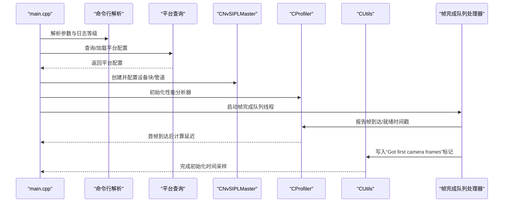
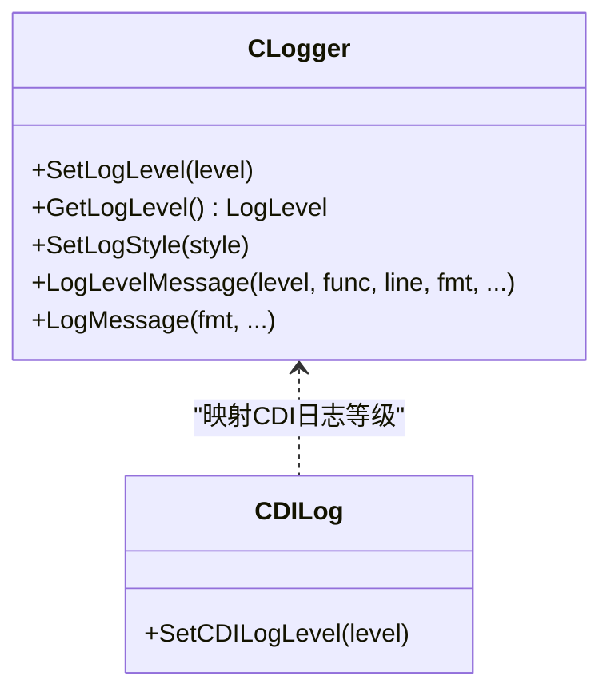
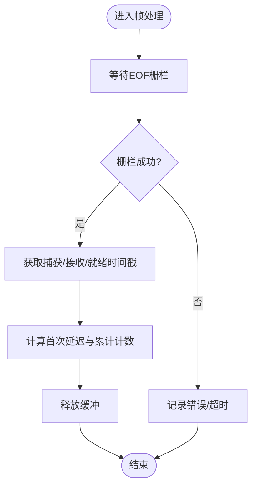
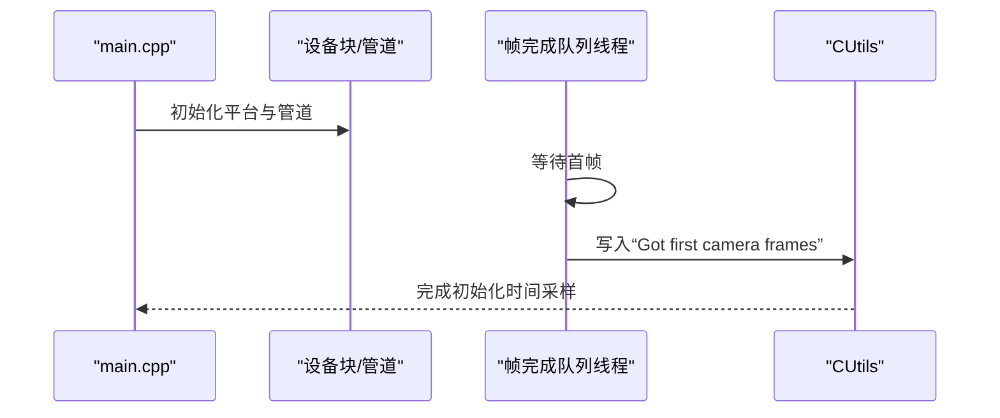
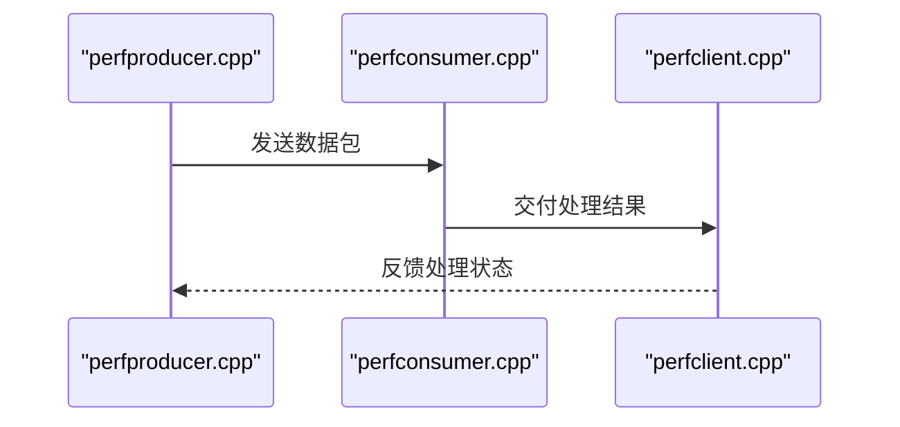
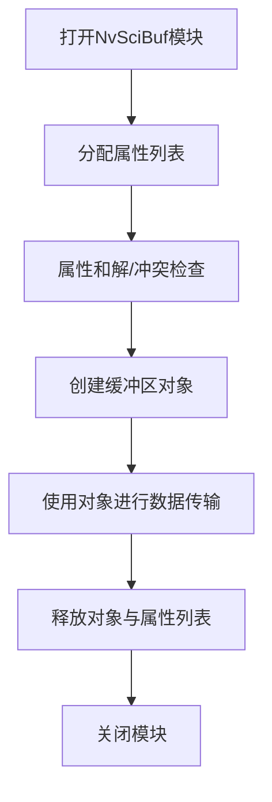
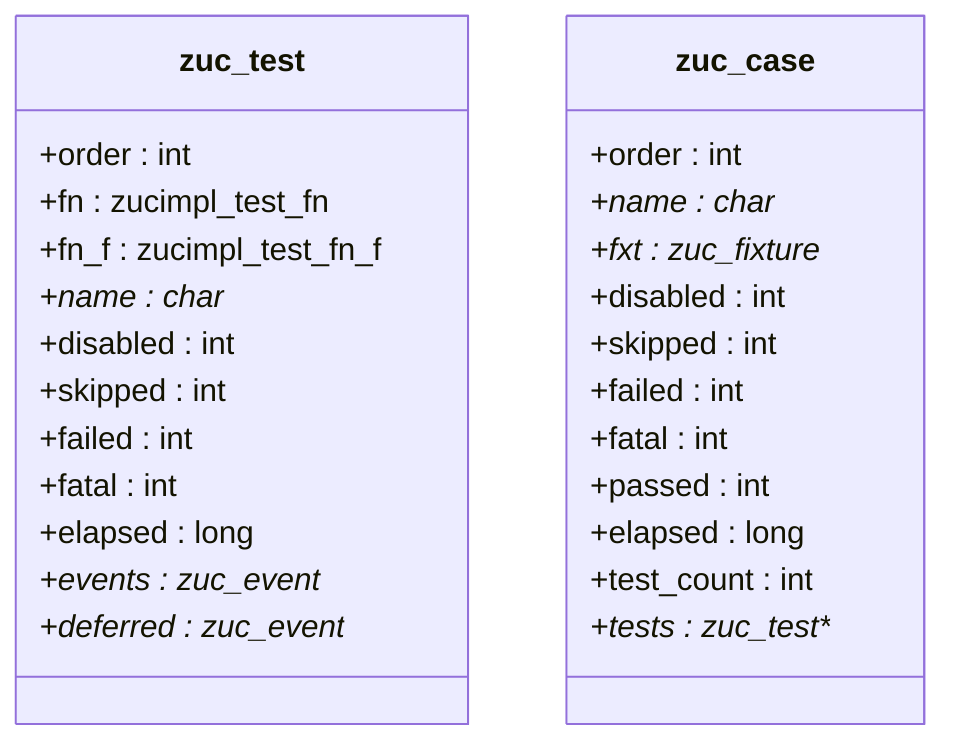
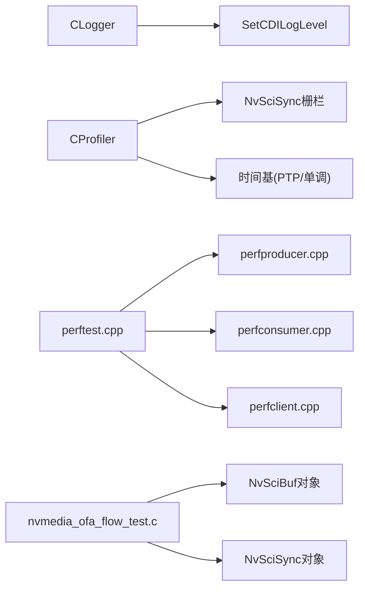

# 调试与测试

<cite>
**本文引用的文件**
- [README.md](file://README.md)
- [main.cpp](file://driveos-6.0.5.0/drive-linux/tests/nvsys_init_time/main.cpp)
- [CProfiler.hpp](file://driveos-6.0.5.0/drive-linux/tests/nvsys_init_time/CProfiler.hpp)
- [CUtils.hpp](file://driveos-6.0.5.0/drive-linux/tests/nvsys_init_time/CUtils.hpp)
- [cdi_debug_log.h](file://driveos-6.0.5.0/drive-linux/samples/nvmedia/nvsipl/devblk/common/trace/cdi_debug_log.h)
- [cdi_debug_log.c](file://driveos-6.0.5.0/drive-linux/samples/nvmedia/nvsipl/devblk/common/trace/cdi_debug_log.c)
- [perftest.cpp](file://driveos-6.0.5.0/drive-linux/samples/nvsci/nvscistream/perf_tests/perftest.cpp)
- [perfclient.cpp](file://driveos-6.0.5.0/drive-linux/samples/nvsci/nvscistream/perf_tests/perfclient.cpp)
- [perfconsumer.cpp](file://driveos-6.0.5.0/drive-linux/samples/nvsci/nvscistream/perf_tests/perfconsumer.cpp)
- [perfproducer.cpp](file://driveos-6.0.5.0/drive-linux/samples/nvsci/nvscistream/perf_tests/perfproducer.cpp)
- [nvmedia_ofa_flow_test.c](file://driveos-6.0.5.0/drive-linux/samples/nvmedia_6x/iofa/flow/nvmedia_ofa_flow_test.c)
- [zuc_types.h](file://driveos-6.0.6.0/drive-linux/samples/wayland/weston/tools/zunitc/src/zuc_types.h)
</cite>

## 目录
1. [引言](#引言)
2. [项目结构](#项目结构)
3. [核心组件](#核心组件)
4. [架构总览](#架构总览)
5. [详细组件分析](#详细组件分析)
6. [依赖关系分析](#依赖关系分析)
7. [性能考量](#性能考量)
8. [故障排查指南](#故障排查指南)
9. [结论](#结论)
10. [附录](#附录)

## 引言
本指南面向DriveOS多媒体与流处理栈的开发者与测试工程师，聚焦于调试与测试实践，覆盖日志系统配置与使用、性能分析、内存与同步对象管理、断点与单步调试、变量监视、性能测试（系统初始化时间、媒体处理链路）、单元与集成测试、压力与稳定性测试、以及常见问题诊断（死锁、内存泄漏、性能瓶颈）与自动化测试最佳实践。文档中的技术细节均基于仓库中现有源码与样例进行归纳总结。

## 项目结构
- 测试与性能基准集中在 tests 与 samples 子目录中，尤其是 nvsys_init_time（系统初始化时间测量）、nvsci 性能测试样例、以及 nvmedia_6x 的功能测试样例。
- 日志与调试接口通过统一的 CLogger 单例与 CDI 日志级别控制实现，便于在不同模块间一致地输出调试信息。
- 性能分析通过 CProfiler 采集帧级时间戳、等待栅栏、以及系统内嵌的“carveout”记录点，形成端到端时延统计。

```mermaid
graph TB
A["tests/nvsys_init_time/main.cpp"] --> B["tests/nvsys_init_time/CProfiler.hpp"]
A --> C["tests/nvsys_init_time/CUtils.hpp"]
D["samples/nvmedia/nvsipl/devblk/common/trace/cdi_debug_log.c"] --> E["samples/nvmedia/nvsipl/devblk/common/trace/cdi_debug_log.h"]
F["samples/nvsci/nvscistream/perf_tests/perftest.cpp"] --> G["samples/nvsci/nvscistream/perf_tests/perfclient.cpp"]
F --> H["samples/nvsci/nvscistream/perf_tests/perfconsumer.cpp"]
F --> I["samples/nvsci/nvscistream/perf_tests/perfproducer.cpp"]
J["samples/nvmedia_6x/iofa/flow/nvmedia_ofa_flow_test.c"] --> K["NvSciBuf/NvSciSync 使用"]
L["samples/wayland/weston/tools/zunitc/src/zuc_types.h"] --> M["ZUnitC 测试框架类型定义"]
```

**图表来源**
- [main.cpp:681-720](file://driveos-6.0.5.0/drive-linux/tests/nvsys_init_time/main.cpp#L681-L720)
- [CProfiler.hpp:93-130](file://driveos-6.0.5.0/drive-linux/tests/nvsys_init_time/CProfiler.hpp#L93-L130)
- [CUtils.hpp:184-271](file://driveos-6.0.5.0/drive-linux/tests/nvsys_init_time/CUtils.hpp#L184-L271)
- [cdi_debug_log.c:12-33](file://driveos-6.0.5.0/drive-linux/samples/nvmedia/nvsipl/devblk/common/trace/cdi_debug_log.c#L12-L33)
- [cdi_debug_log.h:12-32](file://driveos-6.0.5.0/drive-linux/samples/nvmedia/nvsipl/devblk/common/trace/cdi_debug_log.h#L12-L32)
- [perftest.cpp](file://driveos-6.0.5.0/drive-linux/samples/nvsci/nvscistream/perf_tests/perftest.cpp)
- [perfclient.cpp](file://driveos-6.0.5.0/drive-linux/samples/nvsci/nvscistream/perf_tests/perfclient.cpp)
- [perfconsumer.cpp](file://driveos-6.0.5.0/drive-linux/samples/nvsci/nvscistream/perf_tests/perfconsumer.cpp)
- [perfproducer.cpp](file://driveos-6.0.5.0/drive-linux/samples/nvsci/nvscistream/perf_tests/perfproducer.cpp)
- [nvmedia_ofa_flow_test.c:443-473](file://driveos-6.0.5.0/drive-linux/samples/nvmedia_6x/iofa/flow/nvmedia_ofa_flow_test.c#L443-L473)
- [zuc_types.h:36-80](file://driveos-6.0.6.0/drive-linux/samples/wayland/weston/tools/zunitc/src/zuc_types.h#L36-L80)

**章节来源**
- [README.md:1-128](file://README.md#L1-L128)

## 核心组件
- 日志系统与调试
  - 统一日志：CLogger 单例，支持错误、警告、信息、调试四个等级；通过宏快速输出带函数名与行号的日志。
  - CDI 日志：通过 SetCDILogLevel 将 CDI 驱动日志映射到 CLogger 等级，便于统一管理。
- 性能分析
  - CProfiler：采集帧捕获、接收、就绪等时间戳，计算首次延迟与帧间延迟，支持 NvSciSync 栅栏等待与超时处理。
  - 初始化时间：通过 CUtils::recordTimestampInCarveout 在系统“carveout”记录点写入标记，用于测量系统初始化阶段的关键时刻。
- 测试样例
  - nvsys_init_time：完整演示从平台查询、相机管道构建、消费者回调、事件队列、帧完成队列到性能统计的全流程。
  - nvsci 性能测试：生产者-消费者-客户端三段式样例，验证 IPC 通道吞吐与延迟。
  - nvmedia_6x IOFA：NvSciBuf/NvSciSync 属性协商与冲突检查，验证缓冲区与同步对象生命周期管理。
  - Wayland ZUnitC：测试用例与夹具结构，为图形栈测试提供基础。

**章节来源**
- [CUtils.hpp:184-271](file://driveos-6.0.5.0/drive-linux/tests/nvsys_init_time/CUtils.hpp#L184-L271)
- [cdi_debug_log.h:12-32](file://driveos-6.0.5.0/drive-linux/samples/nvmedia/nvsipl/devblk/common/trace/cdi_debug_log.h#L12-L32)
- [cdi_debug_log.c:12-33](file://driveos-6.0.5.0/drive-linux/samples/nvmedia/nvsipl/devblk/common/trace/cdi_debug_log.c#L12-L33)
- [CProfiler.hpp:93-130](file://driveos-6.0.5.0/drive-linux/tests/nvsys_init_time/CProfiler.hpp#L93-L130)
- [main.cpp:681-720](file://driveos-6.0.5.0/drive-linux/tests/nvsys_init_time/main.cpp#L681-L720)
- [perftest.cpp](file://driveos-6.0.5.0/drive-linux/samples/nvsci/nvscistream/perf_tests/perftest.cpp)
- [perfclient.cpp](file://driveos-6.0.5.0/drive-linux/samples/nvsci/nvscistream/perf_tests/perfclient.cpp)
- [perfconsumer.cpp](file://driveos-6.0.5.0/drive-linux/samples/nvsci/nvscistream/perf_tests/perfconsumer.cpp)
- [perfproducer.cpp](file://driveos-6.0.5.0/drive-linux/samples/nvsci/nvscistream/perf_tests/perfproducer.cpp)
- [nvmedia_ofa_flow_test.c:443-473](file://driveos-6.0.5.0/drive-linux/samples/nvmedia_6x/iofa/flow/nvmedia_ofa_flow_test.c#L443-L473)
- [zuc_types.h:36-80](file://driveos-6.0.6.0/drive-linux/samples/wayland/weston/tools/zunitc/src/zuc_types.h#L36-L80)

## 架构总览
下图展示 nvsys_init_time 的核心流程：主程序解析参数、查询平台配置、创建设备块与管道、启动事件与帧完成队列线程、通过 CProfiler 记录时间戳，并在收到首帧后写入初始化时间标记。

**图表来源**
- [main.cpp:701-765](file://driveos-6.0.5.0/drive-linux/tests/nvsys_init_time/main.cpp#L701-L765)
- [CProfiler.hpp:149-156](file://driveos-6.0.5.0/drive-linux/tests/nvsys_init_time/CProfiler.hpp#L149-L156)
- [CUtils.hpp:345-366](file://driveos-6.0.5.0/drive-linux/tests/nvsys_init_time/CUtils.hpp#L345-L366)

**章节来源**
- [main.cpp:681-765](file://driveos-6.0.5.0/drive-linux/tests/nvsys_init_time/main.cpp#L681-L765)

## 详细组件分析

### 日志系统与调试
- 统一日志 CLogger
  - 提供单例访问、等级设置、消息格式化与带函数名/行号输出。
  - 建议在开发阶段将等级设为调试，发布版本降为信息或警告，以减少开销。
- CDI 日志映射
  - 通过 SetCDILogLevel 将 CDI 驱动日志映射到 CLogger 等级，便于集中管理。
- 实践要点
  - 在关键路径（如创建/释放资源、事件回调、错误分支）添加日志。
  - 使用条件编译区分安全与非安全版本的日志输出。

**图表来源**
- [CUtils.hpp:184-271](file://driveos-6.0.5.0/drive-linux/tests/nvsys_init_time/CUtils.hpp#L184-L271)
- [cdi_debug_log.h:12-32](file://driveos-6.0.5.0/drive-linux/samples/nvmedia/nvsipl/devblk/common/trace/cdi_debug_log.h#L12-L32)
- [cdi_debug_log.c:12-33](file://driveos-6.0.5.0/drive-linux/samples/nvmedia/nvsipl/devblk/common/trace/cdi_debug_log.c#L12-L33)

**章节来源**
- [CUtils.hpp:184-271](file://driveos-6.0.5.0/drive-linux/tests/nvsys_init_time/CUtils.hpp#L184-L271)
- [cdi_debug_log.h:12-32](file://driveos-6.0.5.0/drive-linux/samples/nvmedia/nvsipl/devblk/common/trace/cdi_debug_log.h#L12-L32)
- [cdi_debug_log.c:12-33](file://driveos-6.0.5.0/drive-linux/samples/nvmedia/nvsipl/devblk/common/trace/cdi_debug_log.c#L12-L33)

### 性能分析器 CProfiler
- 功能
  - 接收帧缓冲，等待 EOF NvSciSync 栅栏，获取捕获、接收、就绪时间戳。
  - 计算首次捕获/接收/就绪延迟，支持多传感器与多输出类型。
  - 通过条件变量与互斥量保护队列，避免竞争。
- 关键点
  - 栅栏等待超时与任务状态校验，确保性能数据有效。
  - 时间基选择（PTP 或单调时钟），保证跨模块时间对齐。
- 使用建议
  - 在消费者回调中调用 ProfileFrame 并在帧完成后释放缓冲。
  - 结合 CUtils::recordTimestampInCarveout 进行系统级初始化时间标注。

**图表来源**
- [CProfiler.hpp:190-229](file://driveos-6.0.5.0/drive-linux/tests/nvsys_init_time/CProfiler.hpp#L190-L229)
- [CProfiler.hpp:254-347](file://driveos-6.0.5.0/drive-linux/tests/nvsys_init_time/CProfiler.hpp#L254-L347)

**章节来源**
- [CProfiler.hpp:93-130](file://driveos-6.0.5.0/drive-linux/tests/nvsys_init_time/CProfiler.hpp#L93-L130)
- [CProfiler.hpp:149-156](file://driveos-6.0.5.0/drive-linux/tests/nvsys_init_time/CProfiler.hpp#L149-L156)
- [CProfiler.hpp:190-229](file://driveos-6.0.5.0/drive-linux/tests/nvsys_init_time/CProfiler.hpp#L190-L229)
- [CProfiler.hpp:254-347](file://driveos-6.0.5.0/drive-linux/tests/nvsys_init_time/CProfiler.hpp#L254-L347)

### 系统初始化时间测量
- 主流程
  - 解析命令行参数，设置日志等级。
  - 查询平台配置，创建设备块与管道。
  - 帧完成队列线程在收到首帧后调用 CUtils::recordTimestampInCarveout 写入标记。
- 输出
  - 通过系统“carveout”记录点输出初始化关键节点时间戳，便于外部采集与分析。

**图表来源**
- [main.cpp:630-635](file://driveos-6.0.5.0/drive-linux/tests/nvsys_init_time/main.cpp#L630-L635)
- [CUtils.hpp:345-366](file://driveos-6.0.5.0/drive-linux/tests/nvsys_init_time/CUtils.hpp#L345-L366)

**章节来源**
- [main.cpp:630-635](file://driveos-6.0.5.0/drive-linux/tests/nvsys_init_time/main.cpp#L630-L635)
- [CUtils.hpp:345-366](file://driveos-6.0.5.0/drive-linux/tests/nvsys_init_time/CUtils.hpp#L345-L366)

### nvsci 性能测试样例
- 组件
  - perftest：测试入口，协调生产者、消费者、客户端。
  - perfproducer：模拟数据生产，关注吞吐与延迟。
  - perfconsumer：模拟数据消费，关注处理时延与丢帧。
  - perfclient：客户端侧逻辑，验证 IPC 通道稳定性。
- 流程
  - 生产者-消费者-客户端三段式协作，通过队列与同步对象传递数据，记录端到端时延。

**图表来源**
- [perftest.cpp](file://driveos-6.0.5.0/drive-linux/samples/nvsci/nvscistream/perf_tests/perftest.cpp)
- [perfclient.cpp](file://driveos-6.0.5.0/drive-linux/samples/nvsci/nvscistream/perf_tests/perfclient.cpp)
- [perfconsumer.cpp](file://driveos-6.0.5.0/drive-linux/samples/nvsci/nvscistream/perf_tests/perfconsumer.cpp)
- [perfproducer.cpp](file://driveos-6.0.5.0/drive-linux/samples/nvsci/nvscistream/perf_tests/perfproducer.cpp)

**章节来源**
- [perftest.cpp](file://driveos-6.0.5.0/drive-linux/samples/nvsci/nvscistream/perf_tests/perftest.cpp)
- [perfclient.cpp](file://driveos-6.0.5.0/drive-linux/samples/nvsci/nvscistream/perf_tests/perfclient.cpp)
- [perfconsumer.cpp](file://driveos-6.0.5.0/drive-linux/samples/nvsci/nvscistream/perf_tests/perfconsumer.cpp)
- [perfproducer.cpp](file://driveos-6.0.5.0/drive-linux/samples/nvsci/nvscistream/perf_tests/perfproducer.cpp)

### NvSciBuf/NvSciSync 使用与内存检查
- 场景
  - 在 IOFA 测试中打开 NvSciBuf 模块，分配属性列表与对象，进行冲突检查与和解，最后释放对象与属性列表。
- 建议
  - 所有 NvSciBuf/NvSciSync 对象均需成对释放，避免泄漏。
  - 使用 CloseNvSciBufAttrList/CloseNvSciBufObj 等 RAII 包装器，确保异常路径也能正确释放。
  - 在关键路径打印状态码与错误信息，便于定位失败点。

**图表来源**
- [nvmedia_ofa_flow_test.c:443-473](file://driveos-6.0.5.0/drive-linux/samples/nvmedia_6x/iofa/flow/nvmedia_ofa_flow_test.c#L443-L473)

**章节来源**
- [nvmedia_ofa_flow_test.c:443-473](file://driveos-6.0.5.0/drive-linux/samples/nvmedia_6x/iofa/flow/nvmedia_ofa_flow_test.c#L443-L473)

### 单元与集成测试框架
- ZUnitC 类型定义
  - 提供测试用例、夹具、测试顺序、失败/跳过/致命等状态字段，便于组织与报告测试结果。
- 建议
  - 将测试用例按功能模块拆分，使用夹具 setup/teardown 管理共享资源。
  - 通过比较操作符字符串与事件收集，生成可读性高的测试报告。

**图表来源**
- [zuc_types.h:36-80](file://driveos-6.0.6.0/drive-linux/samples/wayland/weston/tools/zunitc/src/zuc_types.h#L36-L80)

**章节来源**
- [zuc_types.h:36-80](file://driveos-6.0.6.0/drive-linux/samples/wayland/weston/tools/zunitc/src/zuc_types.h#L36-L80)

## 依赖关系分析
- 日志与调试
  - CLogger 作为全局日志中心，被各模块通过宏调用；CDI 日志通过 SetCDILogLevel 映射到 CLogger 等级。
- 性能分析
  - CProfiler 依赖 NvSciSync 栅栏与时间基（PTP/单调时钟），并与帧完成队列线程协作。
- 测试样例
  - nvsci 性能测试样例之间通过队列与同步对象耦合，形成生产-处理-消费闭环。
- 资源管理
  - NvSciBuf/NvSciSync 对象生命周期严格受控，需成对释放。

**图表来源**
- [CUtils.hpp:184-271](file://driveos-6.0.5.0/drive-linux/tests/nvsys_init_time/CUtils.hpp#L184-L271)
- [cdi_debug_log.c:12-33](file://driveos-6.0.5.0/drive-linux/samples/nvmedia/nvsipl/devblk/common/trace/cdi_debug_log.c#L12-L33)
- [CProfiler.hpp:190-229](file://driveos-6.0.5.0/drive-linux/tests/nvsys_init_time/CProfiler.hpp#L190-L229)
- [perftest.cpp](file://driveos-6.0.5.0/drive-linux/samples/nvsci/nvscistream/perf_tests/perftest.cpp)
- [perfclient.cpp](file://driveos-6.0.5.0/drive-linux/samples/nvsci/nvscistream/perf_tests/perfclient.cpp)
- [perfconsumer.cpp](file://driveos-6.0.5.0/drive-linux/samples/nvsci/nvscistream/perf_tests/perfconsumer.cpp)
- [perfproducer.cpp](file://driveos-6.0.5.0/drive-linux/samples/nvsci/nvscistream/perf_tests/perfproducer.cpp)
- [nvmedia_ofa_flow_test.c:443-473](file://driveos-6.0.5.0/drive-linux/samples/nvmedia_6x/iofa/flow/nvmedia_ofa_flow_test.c#L443-L473)

**章节来源**
- [CUtils.hpp:184-271](file://driveos-6.0.5.0/drive-linux/tests/nvsys_init_time/CUtils.hpp#L184-L271)
- [CProfiler.hpp:190-229](file://driveos-6.0.5.0/drive-linux/tests/nvsys_init_time/CProfiler.hpp#L190-L229)
- [perftest.cpp](file://driveos-6.0.5.0/drive-linux/samples/nvsci/nvscistream/perf_tests/perftest.cpp)
- [nvmedia_ofa_flow_test.c:443-473](file://driveos-6.0.5.0/drive-linux/samples/nvmedia_6x/iofa/flow/nvmedia_ofa_flow_test.c#L443-L473)

## 性能考量
- 时间基选择
  - PTP 时钟用于高精度时间戳，单调时钟用于跨模块对齐；根据平台能力选择合适的时间源。
- 栅栏等待与超时
  - 设置合理的栅栏等待超时，避免阻塞导致的性能抖动；对任务状态进行校验，确保处理链路健康。
- 初始化时间
  - 使用系统“carveout”记录点标注关键节点，结合 CProfiler 的首次延迟统计，形成完整的初始化性能画像。
- 吞吐与延迟
  - 通过 nvsci 性能测试样例评估生产者-消费者-客户端端到端延迟与吞吐，识别瓶颈环节。

[本节为通用指导，无需特定文件引用]

## 故障排查指南
- 死锁检测
  - 检查条件变量与互斥量的配对使用，确保在所有退出路径上释放锁。
  - 在关键等待点增加超时，避免无限等待。
- 内存泄漏检查
  - 对照 NvSciBuf/NvSciSync 对象的创建与释放，确保每一步都有对应的释放路径。
  - 使用包装器（如 CloseNvSciBufAttrList/CloseNvSciBufObj）自动释放。
- 性能瓶颈分析
  - 使用 CProfiler 的首次延迟与帧间延迟指标，定位卡顿环节。
  - 结合 nvsci 性能测试样例，对比生产、处理、消费三个阶段的耗时。
- 错误日志
  - 将 CDI 日志等级映射到 CLogger，统一输出错误与警告信息，便于集中分析。

**章节来源**
- [CProfiler.hpp:190-229](file://driveos-6.0.5.0/drive-linux/tests/nvsys_init_time/CProfiler.hpp#L190-L229)
- [CProfiler.hpp:254-347](file://driveos-6.0.5.0/drive-linux/tests/nvsys_init_time/CProfiler.hpp#L254-L347)
- [nvmedia_ofa_flow_test.c:443-473](file://driveos-6.0.5.0/drive-linux/samples/nvmedia_6x/iofa/flow/nvmedia_ofa_flow_test.c#L443-L473)
- [cdi_debug_log.c:12-33](file://driveos-6.0.5.0/drive-linux/samples/nvmedia/nvsipl/devblk/common/trace/cdi_debug_log.c#L12-L33)

## 结论
本指南基于仓库中的测试与样例代码，总结了 DriveOS 多媒体栈的调试与测试方法：通过统一日志系统与 CDI 日志映射实现一致的可观测性；借助 CProfiler 与系统“carveout”记录点完成性能度量；利用 nvsci 性能测试样例与 NvSciBuf/NvSciSync 生命周期管理保障稳定性；并通过 ZUnitC 类型定义为自动化测试提供基础。建议在开发与回归流程中持续应用这些方法，以提升系统质量与可维护性。

[本节为总结，无需特定文件引用]

## 附录
- 调试工具与技巧
  - 断点与单步：在关键函数入口（如消费者回调、帧完成处理）设置断点，逐步观察状态变化。
  - 变量监视：监视关键变量（如帧计数、错误标志、队列长度）的变化趋势。
  - 条件断点：针对特定条件（如首帧到达、错误发生）触发断点，提高定位效率。
- 自动化测试实施建议
  - 将 ZUnitC 测试用例与 CI 集成，定期运行性能与稳定性测试。
  - 对关键路径（如资源创建/销毁、栅栏等待、时间戳记录）编写单元测试，确保回归覆盖。

[本节为通用指导，无需特定文件引用]