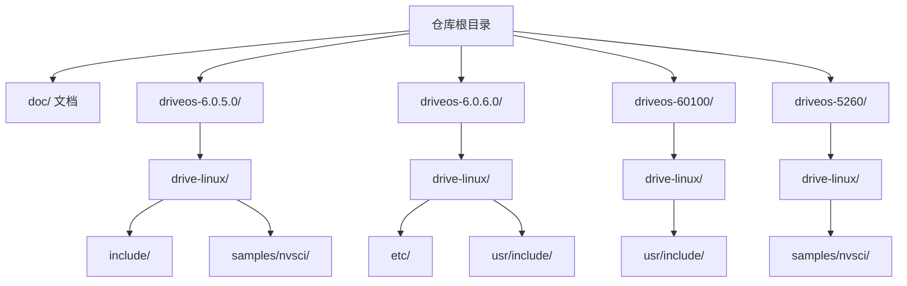
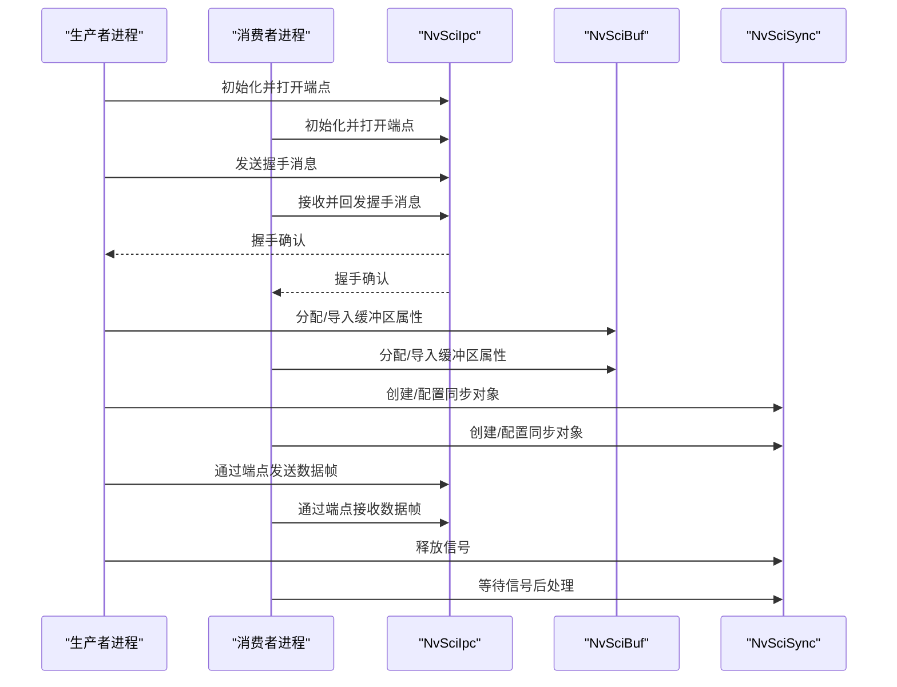
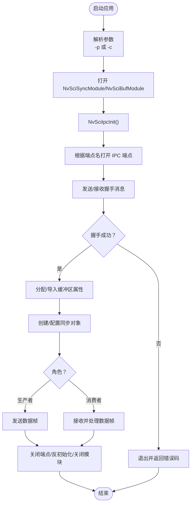
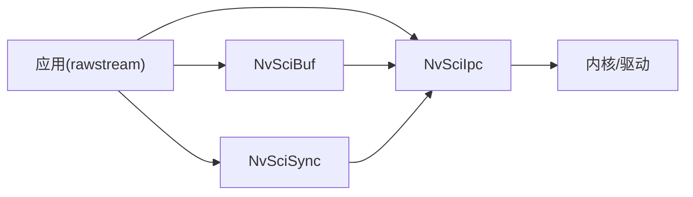

# 快速开始

<cite>
**本文引用的文件**
- [README.md](file://README.md)
- [nvsciipc.cfg（6.0.5.0）](file://driveos-6.0.5.0/etc/nvsciipc.cfg)
- [nvsciipc.cfg（6.0.6.0）](file://driveos-6.0.6.0/etc/nvsciipc.cfg)
- [nvsciipc_secpolicy.cfg（6.0.6.0）](file://driveos-6.0.6.0/etc/nvsciipc_secpolicy.cfg)
- [nvsciipc.h](file://driveos-60100/usr/include/nvsciipc.h)
- [nvscibuf.h](file://driveos-6.0.5.0/drive-linux/include/nvscibuf.h)
- [rawstream/Makefile](file://driveos-6.0.5.0/drive-linux/samples/nvsci/rawstream/Makefile)
- [rawstream_main.c](file://driveos-6.0.5.0/drive-linux/samples/nvsci/rawstream/rawstream_main.c)
- [README.txt（rawstream）](file://driveos-6.0.5.0/drive-linux/samples/nvsci/rawstream/README.txt)
- [README.txt（nvscistream 单播）](file://driveos-5260/drive-linux/samples/nvsci/nvscistream/unicast/README.txt)
- [nvdefs.mk](file://driveos-6081/drive-linux/make/nvdefs.mk)
</cite>

## 目录
1. [简介](#简介)
2. [项目结构](#项目结构)
3. [核心组件](#核心组件)
4. [架构总览](#架构总览)
5. [详细组件分析](#详细组件分析)
6. [依赖关系分析](#依赖关系分析)
7. [性能与构建建议](#性能与构建建议)
8. [故障排除指南](#故障排除指南)
9. [结论](#结论)
10. [附录：常用命令与路径](#附录常用命令与路径)

## 简介
本指南面向首次接触 DriveOS 的开发者，目标是在最短时间内完成环境准备、SDK 获取与安装、首个示例程序的编译与运行，并掌握常用构建配置与基础配置文件的修改方法。文档覆盖以下要点：
- 系统要求与依赖安装
- SDK 包选择与安装（核心包与额外包）
- 编译环境配置与 Makefile 使用
- 基础配置文件 nvsciipc.cfg 的作用与修改
- 常见问题与排障技巧
- 从零到一的示例运行流程（以 rawstream 为例）

## 项目结构
仓库包含多个版本的 DriveOS SDK（例如 6.0.5.0、6.0.6.0、60100、5260 等），以及 samples、include、etc 等关键目录。其中 samples 提供了 nvsci（NvSciBuf/NvSciSync/NvSciIpc）相关示例；include 提供头文件；etc 提供配置文件模板。

图示来源
- [README.md](file://README.md)
- [nvsciipc.cfg（6.0.5.0）](file://driveos-6.0.5.0/etc/nvsciipc.cfg)
- [nvsciipc.cfg（6.0.6.0）](file://driveos-6.0.6.0/etc/nvsciipc.cfg)

章节来源
- [README.md](file://README.md)

## 核心组件
- NvSciIpc：跨进程/跨线程/跨虚拟机/跨芯片的 IPC 通信库，负责端点初始化、事件通知、读写等。
- NvSciBuf：缓冲区分配与交换，支持 Raw/Tensor/Image 等多种类型，常与 NvSciIpc 配合使用。
- NvSciSync：同步原语，用于生产者-消费者场景中的信号与等待。
- 示例应用：rawstream 与 nvscistream 提供了 IPC 通道建立、握手、数据传输与同步的完整流程。

章节来源
- [nvsciipc.h](file://driveos-60100/usr/include/nvsciipc.h)
- [nvscibuf.h](file://driveos-6.0.5.0/drive-linux/include/nvscibuf.h)
- [rawstream_main.c](file://driveos-6.0.5.0/drive-linux/samples/nvsci/rawstream/rawstream_main.c)

## 架构总览
下面的序列图展示了 rawstream 示例中生产者与消费者通过 NvSciIpc 建立通信、进行握手、随后使用 NvSciBuf/NvSciSync 进行数据与同步的典型流程。

图示来源
- [rawstream_main.c](file://driveos-6.0.5.0/drive-linux/samples/nvsci/rawstream/rawstream_main.c)
- [nvsciipc.h](file://driveos-60100/usr/include/nvsciipc.h)
- [nvscibuf.h](file://driveos-6.0.5.0/drive-linux/include/nvscibuf.h)

## 详细组件分析

### 组件一：NvSciIpc 配置文件 nvsciipc.cfg
- 作用：定义 IPC 后端类型、端点名称、帧数量与帧大小、组 ID（GID）等参数，决定不同进程/线程/虚拟机/芯片之间的通信能力与安全策略。
- 版本差异：
  - 6.0.5.0：支持 INTER_PROCESS、INTER_THREAD、INTER_CHIP，不包含 GID 字段。
  - 6.0.6.0：新增 GID 字段，用于 DAC 访问控制；并引入 CFGVER 标记。
- 修改建议：
  - 若需要启用 DAC 安全策略，请参考 6.0.6.0 的格式添加 GID。
  - 端点命名需与示例代码一致（如示例中使用 nvscisync_a_0/nvscisync_a_1）。

章节来源
- [nvsciipc.cfg（6.0.5.0）](file://driveos-6.0.5.0/etc/nvsciipc.cfg)
- [nvsciipc.cfg（6.0.6.0）](file://driveos-6.0.6.0/etc/nvsciipc.cfg)

### 组件二：构建系统与 Makefile 使用
- Makefile 关键点：
  - 使用 NV_PLATFORM_* 变量统一平台选项与链接库。
  - 链接顺序与库依赖：nvscibuf、nvscisync、nvsciipc、nvscicommon、cuda、pthread、stdc++。
  - 通过 nvdefs.mk 引入通用构建宏与路径。
- 常用命令：
  - 清理：make clean
  - 构建：make
  - 如需指定 CUDA Toolkit 路径，确保 NV_PLATFORM_CUDA_TOOLKIT 已正确设置。

章节来源
- [rawstream/Makefile](file://driveos-6.0.5.0/drive-linux/samples/nvsci/rawstream/Makefile)
- [nvdefs.mk](file://driveos-6081/drive-linux/make/nvdefs.mk)

### 组件三：示例应用 rawstream 运行流程
- 运行方式：
  - 生产者：sudo ./rawstream -p
  - 消费者：sudo ./rawstream -c
- 主流程要点：
  - 打开 NvSciSyncModule 与 NvSciBufModule
  - 初始化 NvSciIpc 并根据端点名打开对应端点
  - 通过端点发送/接收握手消息，验证连通性
  - 分配缓冲区属性，创建同步对象
  - 生产者发送数据帧，消费者接收并处理
  - 释放资源：关闭端点、反初始化 IPC、关闭模块

图示来源
- [rawstream_main.c](file://driveos-6.0.5.0/drive-linux/samples/nvsci/rawstream/rawstream_main.c)
- [README.txt（rawstream）](file://driveos-6.0.5.0/drive-linux/samples/nvsci/rawstream/README.txt)

章节来源
- [rawstream_main.c](file://driveos-6.0.5.0/drive-linux/samples/nvsci/rawstream/rawstream_main.c)
- [README.txt（rawstream）](file://driveos-6.0.5.0/drive-linux/samples/nvsci/rawstream/README.txt)

### 组件四：nvscistream 单播示例
- 运行方式：先以生产者模式启动，再以消费者模式启动，可指定队列号等参数。
- 适用场景：多播/单播流通道的演示与测试。

章节来源
- [README.txt（nvscistream 单播）](file://driveos-5260/drive-linux/samples/nvsci/nvscistream/unicast/README.txt)

## 依赖关系分析
- 应用层依赖链：应用 → NvSciIpc → NvSciBuf/NvSciSync → 内核/驱动（设备节点/资源管理器）
- 示例应用 rawstream 的链接依赖：rawstream → nvscibuf → nvscisync → nvsciipc → nvscicommon → cuda → pthread → stdc++

图示来源
- [rawstream/Makefile](file://driveos-6.0.5.0/drive-linux/samples/nvsci/rawstream/Makefile)
- [nvsciipc.h](file://driveos-60100/usr/include/nvsciipc.h)
- [nvscibuf.h](file://driveos-6.0.5.0/drive-linux/include/nvscibuf.h)

## 性能与构建建议
- 平台优化与编译选项：通过 NV_PLATFORM_OPT、NV_PLATFORM_CFLAGS 等变量统一设置，避免重复配置。
- 链接顺序：确保 nvscibuf、nvscisync、nvsciipc、nvscicommon 的顺序正确，CUDA 与 pthread 位于末尾。
- 资源复用：在单个进程中尽量复用 NvSciBufModule/NvSciSyncModule，减少重复打开/关闭带来的开销。
- 调试与日志：示例中使用 fprintf 输出关键信息，便于定位问题。

[本节为通用建议，无需特定文件引用]

## 故障排除指南
- 权限与 DAC 策略
  - 若启用 nvsciipc_secpolicy.cfg，需为每个用户创建独立用户并授予相应端点访问权限。
  - 参考 6.0.6.0 的安全策略配置文件，确保端点名与 GID 映射正确。
- 端点未找到或被占用
  - 检查 nvsciipc.cfg 中端点名称是否与示例一致（如 nvscisync_a_0/nvscisync_a_1）。
  - 确认 IPC 初始化顺序：NvSciIpcInit → OpenEndpoint → GetEventNotifier/WaitEvent → ResetEndpointSafe。
- 握手失败
  - 确保生产者与消费者使用正确的端点名，且端点已在 nvsciipc.cfg 中配置。
  - 检查进程权限与 GID 设置（若启用 DAC）。
- 构建失败
  - 确认 NV_PLATFORM_* 变量已正确设置（尤其是 CUDA Toolkit 路径）。
  - 按 Makefile 顺序检查依赖库是否存在且版本匹配。
- 运行时崩溃或无输出
  - 使用最小化日志输出定位问题，逐步注释掉非必要逻辑，确认 IPC 握手与缓冲区分配阶段是否正常。

章节来源
- [nvsciipc_secpolicy.cfg（6.0.6.0）](file://driveos-6.0.6.0/etc/nvsciipc_secpolicy.cfg)
- [nvsciipc.cfg（6.0.6.0）](file://driveos-6.0.6.0/etc/nvsciipc.cfg)
- [rawstream_main.c](file://driveos-6.0.5.0/drive-linux/samples/nvsci/rawstream/rawstream_main.c)

## 结论
通过本指南，您可以在本地快速完成 DriveOS SDK 的环境准备与示例运行，理解 NvSciIpc/NvSciBuf/NvSciSync 的协作关系，并掌握配置文件与构建系统的使用方法。建议在完成示例运行后，逐步替换示例中的端点名与参数，适配实际业务场景。

[本节为总结，无需特定文件引用]

## 附录：常用命令与路径
- 示例构建与运行
  - 进入示例目录并清理/构建：make clean && make
  - 运行生产者：sudo ./rawstream -p
  - 运行消费者：sudo ./rawstream -c
- 配置文件位置
  - nvsciipc.cfg：driveos-<版本>/etc/nvsciipc.cfg
  - nvsciipc_secpolicy.cfg：driveos-<版本>/etc/nvsciipc_secpolicy.cfg
- 头文件位置
  - nvsciipc.h：driveos-<版本>/usr/include/nvsciipc.h
  - nvscibuf.h：driveos-<版本>/drive-linux/include/nvscibuf.h
- 通用构建宏
  - nvdefs.mk：driveos-<版本>/drive-linux/make/nvdefs.mk

章节来源
- [README.txt（rawstream）](file://driveos-6.0.5.0/drive-linux/samples/nvsci/rawstream/README.txt)
- [nvsciipc.cfg（6.0.5.0）](file://driveos-6.0.5.0/etc/nvsciipc.cfg)
- [nvsciipc.cfg（6.0.6.0）](file://driveos-6.0.6.0/etc/nvsciipc.cfg)
- [nvsciipc_secpolicy.cfg（6.0.6.0）](file://driveos-6.0.6.0/etc/nvsciipc_secpolicy.cfg)
- [nvsciipc.h](file://driveos-60100/usr/include/nvsciipc.h)
- [nvscibuf.h](file://driveos-6.0.5.0/drive-linux/include/nvscibuf.h)
- [nvdefs.mk](file://driveos-6081/drive-linux/make/nvdefs.mk)