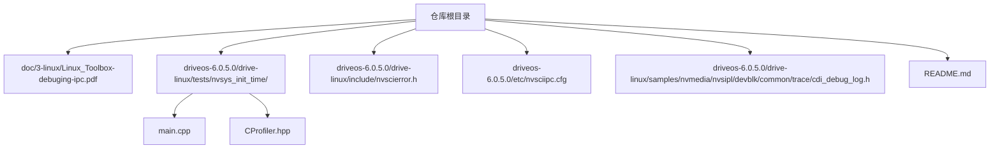
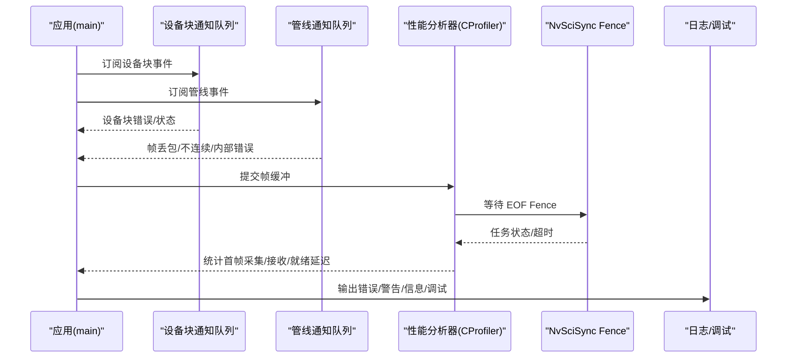
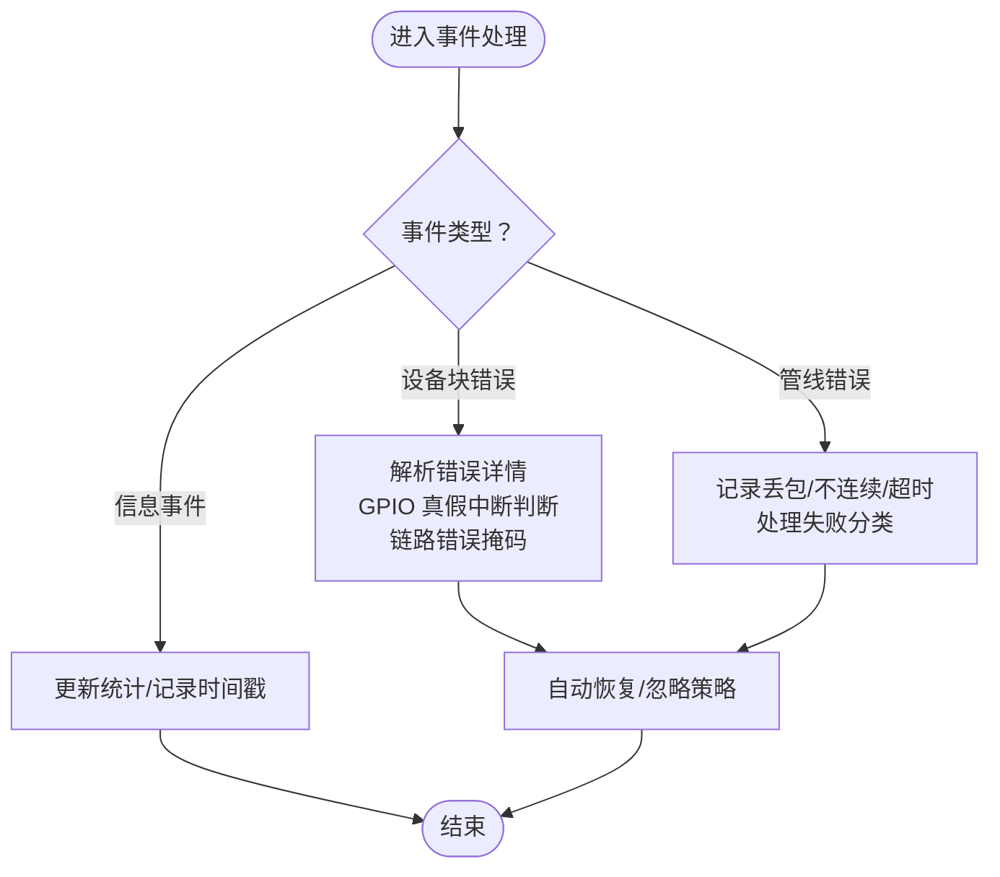
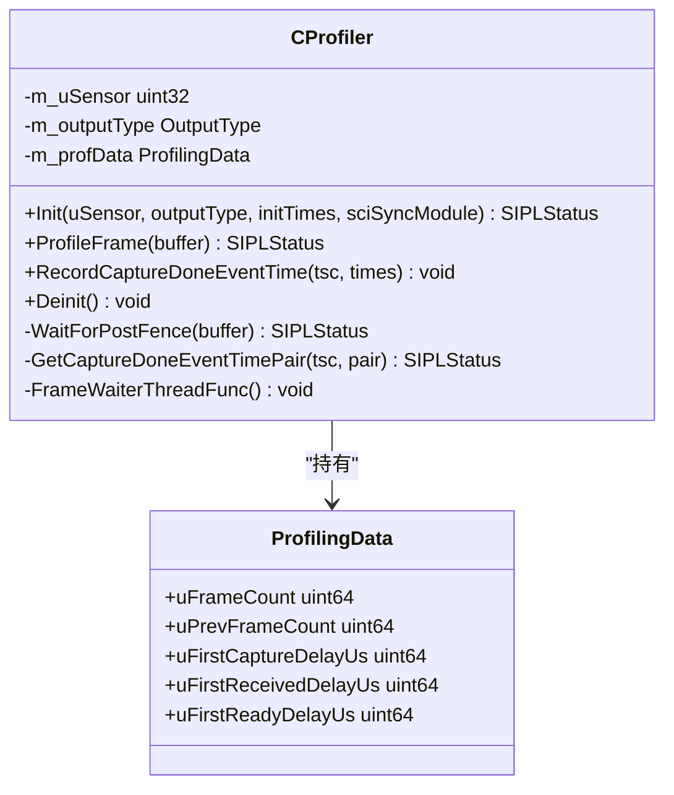
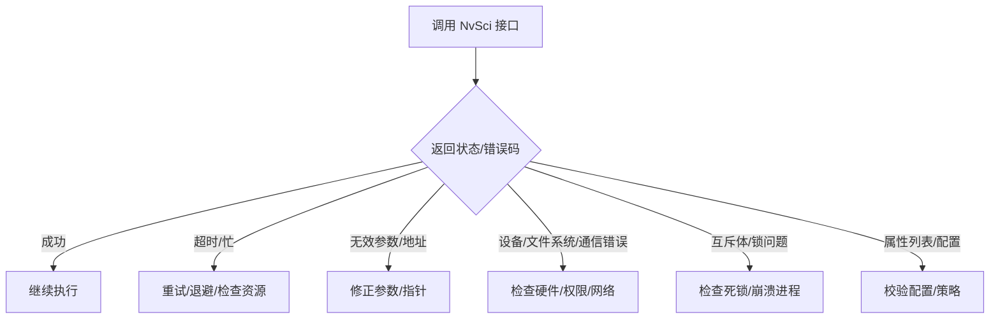
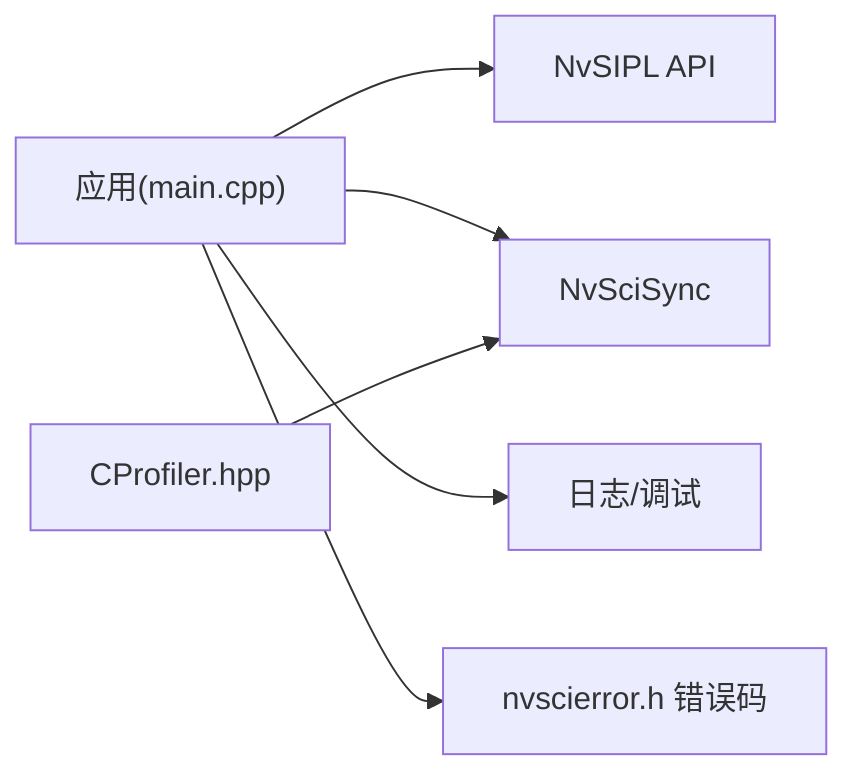

# 故障排除

<cite>
**本文引用的文件**
- [README.md](file://README.md)
- [main.cpp](file://driveos-6.0.5.0/drive-linux/tests/nvsys_init_time/main.cpp)
- [CProfiler.hpp](file://driveos-6.0.5.0/drive-linux/tests/nvsys_init_time/CProfiler.hpp)
- [nvscierror.h](file://driveos-6.0.5.0/drive-linux/include/nvscierror.h)
- [cdi_debug_log.h](file://driveos-6.0.5.0/drive-linux/samples/nvmedia/nvsipl/devblk/common/trace/cdi_debug_log.h)
- [Linux_Toolbox-debuging-ipc.pdf](file://doc/3-linux/Linux_Toolbox-debuging-ipc.pdf)
- [nvsciipc.cfg](file://driveos-6.0.5.0/etc/nvsciipc.cfg)
</cite>

## 目录
1. [简介](#简介)
2. [项目结构](#项目结构)
3. [核心组件](#核心组件)
4. [架构总览](#架构总览)
5. [详细组件分析](#详细组件分析)
6. [依赖关系分析](#依赖关系分析)
7. [性能考虑](#性能考虑)
8. [故障排除指南](#故障排除指南)
9. [结论](#结论)
10. [附录](#附录)

## 简介
本指南面向使用 DriveOS 的开发者与运维人员，聚焦于常见问题的系统化排查与解决，覆盖编译错误、运行时错误、硬件问题、IPC/同步问题、性能瓶颈与资源竞争等场景。文档结合仓库中的测试样例、错误码定义与调试工具资料，给出可操作的诊断流程、工具使用方法与优化建议，并提供社区与支持渠道信息。

## 项目结构
该仓库包含多个 DriveOS 版本（如 6.0.5.0、6.0.6.0、60100、6081）及文档、示例与测试代码。与故障排除直接相关的关键位置包括：
- 测试与性能分析：tests/nvsys_init_time 下的主程序与性能分析器
- 错误码与 IPC 同步：include 与 samples 中的 nvscierror.h、nvsciipc.cfg
- 调试工具与日志：doc/3-linux/Linux_Toolbox-debuging-ipc.pdf 以及 cdi_debug_log.h
- 包与安装说明：根目录 README.md

**图示来源**
- [main.cpp:1-80](file://driveos-6.0.5.0/drive-linux/tests/nvsys_init_time/main.cpp#L1-L80)
- [CProfiler.hpp:1-30](file://driveos-6.0.5.0/drive-linux/tests/nvsys_init_time/CProfiler.hpp#L1-L30)
- [nvscierror.h:1-40](file://driveos-6.0.5.0/drive-linux/include/nvscierror.h#L1-L40)
- [cdi_debug_log.h:1-35](file://driveos-6.0.5.0/drive-linux/samples/nvmedia/nvsipl/devblk/common/trace/cdi_debug_log.h#L1-L35)
- [Linux_Toolbox-debuging-ipc.pdf](file://doc/3-linux/Linux_Toolbox-debuging-ipc.pdf)
- [nvsciipc.cfg](file://driveos-6.0.5.0/etc/nvsciipc.cfg)

**章节来源**
- [README.md:1-128](file://README.md#L1-L128)

## 核心组件
- 运行时事件与错误处理：通过通知队列与回调机制捕获设备块与管线级错误，记录帧丢包、不连续等指标，并支持自动恢复与忽略策略。
- 性能分析器：基于 NvSciSync Fence 与时间戳队列，统计从采集到就绪的延迟，支持多时基与多传感器。
- 错误码体系：统一的 NvSci 错误枚举，涵盖通用、NvSciBuf、NvSciSync、NvSciStream、NvSciIpc、NvSciEvent 等范围。
- 日志与调试：CDI 日志级别控制与 slogger 集成；IPC 调试工具文档；配置文件 nvsciipc.cfg。

**章节来源**
- [main.cpp:93-362](file://driveos-6.0.5.0/drive-linux/tests/nvsys_init_time/main.cpp#L93-L362)
- [CProfiler.hpp:93-374](file://driveos-6.0.5.0/drive-linux/tests/nvsys_init_time/CProfiler.hpp#L93-L374)
- [nvscierror.h:45-281](file://driveos-6.0.5.0/drive-linux/include/nvscierror.h#L45-L281)
- [cdi_debug_log.h:12-31](file://driveos-6.0.5.0/drive-linux/samples/nvmedia/nvsipl/devblk/common/trace/cdi_debug_log.h#L12-L31)

## 架构总览
下图展示从应用到底层驱动的事件流与错误传播路径，以及性能采样的关键节点。

**图示来源**
- [main.cpp:324-542](file://driveos-6.0.5.0/drive-linux/tests/nvsys_init_time/main.cpp#L324-L542)
- [CProfiler.hpp:184-347](file://driveos-6.0.5.0/drive-linux/tests/nvsys_init_time/CProfiler.hpp#L184-L347)

## 详细组件分析

### 设备块与管线事件处理
- 设备块通知处理器负责解析错误详情、GPIO 中断真伪判定、链路错误掩码与远端错误传播。
- 管线通知处理器记录帧丢包、不连续、捕获超时与各类处理失败，支持自动恢复与忽略策略切换。
- 事件队列线程以超时方式轮询，避免阻塞；异常状态通过返回码与日志上报。

**图示来源**
- [main.cpp:282-514](file://driveos-6.0.5.0/drive-linux/tests/nvsys_init_time/main.cpp#L282-L514)

**章节来源**
- [main.cpp:93-362](file://driveos-6.0.5.0/drive-linux/tests/nvsys_init_time/main.cpp#L93-L362)
- [main.cpp:516-542](file://driveos-6.0.5.0/drive-linux/tests/nvsys_init_time/main.cpp#L516-L542)

### 性能分析器（CProfiler）
- 使用 NvSciSync Fence 等待帧完成，获取任务状态与超时处理。
- 维护时间对队列（采集时间戳与系统时间），计算首帧延迟（采集/接收/就绪）。
- 支持多时基与多传感器，线程安全地排队缓冲与时间对。

**图示来源**
- [CProfiler.hpp:93-374](file://driveos-6.0.5.0/drive-linux/tests/nvsys_init_time/CProfiler.hpp#L93-L374)

**章节来源**
- [CProfiler.hpp:105-177](file://driveos-6.0.5.0/drive-linux/tests/nvsys_init_time/CProfiler.hpp#L105-L177)
- [CProfiler.hpp:184-347](file://driveos-6.0.5.0/drive-linux/tests/nvsys_init_time/CProfiler.hpp#L184-L347)

### 错误码与 IPC/同步问题
- NvSci 错误码覆盖通用、NvSciBuf、NvSciSync、NvSciStream、NvSciIpc、NvSciEvent 等范围，便于快速定位来源。
- 常见错误包括：超时、忙/不可用、无效参数/地址、设备/文件系统/通信/进程/互斥体/属性列表等。
- IPC 配置文件用于初始化与权限策略，需与系统服务协同。

**图示来源**
- [nvscierror.h:45-281](file://driveos-6.0.5.0/drive-linux/include/nvscierror.h#L45-L281)
- [nvsciipc.cfg](file://driveos-6.0.5.0/etc/nvsciipc.cfg)

**章节来源**
- [nvscierror.h:45-281](file://driveos-6.0.5.0/drive-linux/include/nvscierror.h#L45-L281)
- [nvsciipc.cfg](file://driveos-6.0.5.0/etc/nvsciipc.cfg)

### 日志与调试
- CDI 日志级别：ERR/WARN/INFO/DBG 四级，可通过接口设置。
- IPC 调试工具文档：Linux 工具箱 PDF 提供 IPC 相关调试方法与命令。
- 应用侧日志：事件处理与性能分析器均输出错误/警告/信息/调试日志，便于定位问题。

**章节来源**
- [cdi_debug_log.h:12-31](file://driveos-6.0.5.0/drive-linux/samples/nvmedia/nvsipl/devblk/common/trace/cdi_debug_log.h#L12-L31)
- [Linux_Toolbox-debuging-ipc.pdf](file://doc/3-linux/Linux_Toolbox-debuging-ipc.pdf)
- [main.cpp:100-110](file://driveos-6.0.5.0/drive-linux/tests/nvsys_init_time/main.cpp#L100-L110)

## 依赖关系分析
- 应用依赖 NvSIPL 查询、相机管线、客户端与通知队列；同时依赖 NvSci 同步进行 Fence 等待与时间戳匹配。
- 性能分析器依赖 NvSciSync 模块分配 CPU 等待上下文与 Fence。
- 错误处理依赖统一的错误码体系与日志模块。

**图示来源**
- [main.cpp:36-51](file://driveos-6.0.5.0/drive-linux/tests/nvsys_init_time/main.cpp#L36-L51)
- [CProfiler.hpp:124-129](file://driveos-6.0.5.0/drive-linux/tests/nvsys_init_time/CProfiler.hpp#L124-L129)
- [nvscierror.h:45-80](file://driveos-6.0.5.0/drive-linux/include/nvscierror.h#L45-L80)

**章节来源**
- [main.cpp:36-51](file://driveos-6.0.5.0/drive-linux/tests/nvsys_init_time/main.cpp#L36-L51)
- [CProfiler.hpp:124-129](file://driveos-6.0.5.0/drive-linux/tests/nvsys_init_time/CProfiler.hpp#L124-L129)

## 性能考虑
- 帧等待与 Fence：确保在获取 EOF Fence 并验证任务状态后再释放缓冲，避免过早释放导致的统计偏差。
- 时间戳匹配：严格匹配采集时间戳与系统时间对，防止因时间基不一致导致的延迟计算错误。
- 线程与队列：事件队列与缓冲队列采用条件变量与互斥量保护，注意避免长时间阻塞与死锁。
- 资源与超时：合理设置等待超时与重试策略，避免资源占用与抖动。

**章节来源**
- [CProfiler.hpp:190-229](file://driveos-6.0.5.0/drive-linux/tests/nvsys_init_time/CProfiler.hpp#L190-L229)
- [CProfiler.hpp:231-252](file://driveos-6.0.5.0/drive-linux/tests/nvsys_init_time/CProfiler.hpp#L231-L252)
- [CProfiler.hpp:254-347](file://driveos-6.0.5.0/drive-linux/tests/nvsys_init_time/CProfiler.hpp#L254-L347)

## 故障排除指南

### 编译错误
- 版本不匹配：头文件与库版本不一致会导致编译或链接失败。请核对头文件与库版本号一致性。
- 缺失依赖：确保已安装对应 SDK 包与工具链，参考根目录 README 中的包清单与拷贝方法。
- 并行构建：使用多线程压缩工具加速打包与解包，减少等待时间。

**章节来源**
- [main.cpp:691-700](file://driveos-6.0.5.0/drive-linux/tests/nvsys_init_time/main.cpp#L691-L700)
- [README.md:28-44](file://README.md#L28-L44)
- [README.md:115-128](file://README.md#L115-L128)

### 运行时错误
- 设备块/管线错误：通过通知处理器输出错误日志，结合错误详情缓冲与 GPIO 事件判断是否为真中断或功能故障。
- 帧丢包/不连续：关注管线事件中的丢包与不连续告警，结合性能分析器统计延迟变化趋势。
- 自动恢复与忽略：根据业务需求启用自动恢复或忽略策略，避免误判导致的系统停机。

**章节来源**
- [main.cpp:282-514](file://driveos-6.0.5.0/drive-linux/tests/nvsys_init_time/main.cpp#L282-L514)

### IPC/同步问题
- NvSci 错误码定位：依据错误码范围快速判断来源（通用/NvSciBuf/NvSciSync/NvSciStream/NvSciIpc/NvSciEvent）。
- 超时与忙：遇到超时或忙状态时，检查资源占用、队列长度与等待上下文配置。
- Fence 等待：确认 Fence 获取与任务状态查询流程正确，避免无效状态导致的统计偏差。

**章节来源**
- [nvscierror.h:45-281](file://driveos-6.0.5.0/drive-linux/include/nvscierror.h#L45-L281)
- [CProfiler.hpp:190-229](file://driveos-6.0.5.0/drive-linux/tests/nvsys_init_time/CProfiler.hpp#L190-L229)

### 硬件问题
- 传感器/链路错误：通过链路错误掩码与远端错误传播判断硬件链路问题。
- GPIO 中断：利用 GPIO 事件接口区分真中断与功能故障，避免误报。
- 硬件权限与策略：核对 IPC 配置与系统服务策略，确保访问权限与安全策略一致。

**章节来源**
- [main.cpp:186-199](file://driveos-6.0.5.0/drive-linux/tests/nvsys_init_time/main.cpp#L186-L199)
- [main.cpp:241-279](file://driveos-6.0.5.0/drive-linux/tests/nvsys_init_time/main.cpp#L241-L279)
- [nvsciipc.cfg](file://driveos-6.0.5.0/etc/nvsciipc.cfg)

### 日志分析与调试
- 设置日志级别：通过 CDI 日志接口调整级别，便于在生产与调试阶段平衡开销与可观测性。
- IPC 调试：参考 Linux 工具箱 PDF 中的 IPC 调试方法与命令，辅助定位通信与同步问题。
- 应用日志：关注错误/警告/信息/调试四类日志，结合事件与性能数据定位根因。

**章节来源**
- [cdi_debug_log.h:12-31](file://driveos-6.0.5.0/drive-linux/samples/nvmedia/nvsipl/devblk/common/trace/cdi_debug_log.h#L12-L31)
- [Linux_Toolbox-debuging-ipc.pdf](file://doc/3-linux/Linux_Toolbox-debuging-ipc.pdf)
- [main.cpp:100-110](file://driveos-6.0.5.0/drive-linux/tests/nvsys_init_time/main.cpp#L100-L110)

### 性能问题诊断与优化
- 首帧延迟：通过性能分析器统计采集/接收/就绪延迟，识别瓶颈环节（采集、传输、处理）。
- 时间基一致性：确保使用正确的时基与时间戳，避免跨时基转换误差。
- 线程与队列：监控事件队列与缓冲队列的吞吐与阻塞情况，避免成为性能瓶颈。

**章节来源**
- [CProfiler.hpp:149-156](file://driveos-6.0.5.0/drive-linux/tests/nvsys_init_time/CProfiler.hpp#L149-L156)
- [CProfiler.hpp:297-323](file://driveos-6.0.5.0/drive-linux/tests/nvsys_init_time/CProfiler.hpp#L297-L323)

### 社区支持与问题反馈
- 参考根目录 README 中的包与安装说明，确保环境与依赖完整。
- 使用仓库内提供的日志与调试工具进行自检，必要时附带日志与配置文件进行问题反馈。

**章节来源**
- [README.md:1-128](file://README.md#L1-L128)

### 预防性维护与风险控制
- 定期检查 IPC 配置与系统服务状态，确保策略与权限一致。
- 在开发阶段启用更高等级日志，上线前回归至合适级别以平衡性能与可观测性。
- 对关键路径增加超时与重试策略，避免单点故障导致系统级影响。

## 结论
本指南基于仓库中的测试样例、错误码定义与调试工具，提供了从编译、运行到性能与硬件问题的系统化排查方法。通过事件与性能分析、统一错误码定位、日志与 IPC 调试工具，开发者可以快速定位并解决问题，提升系统稳定性与可维护性。

## 附录
- 关键文件路径与用途概览
  - tests/nvsys_init_time/main.cpp：事件处理、错误捕获与性能统计入口
  - tests/nvsys_init_time/CProfiler.hpp：帧等待、Fence 与延迟统计
  - include/nvscierror.h：NvSci 错误码枚举
  - samples/*/cdi_debug_log.h：CDI 日志级别接口
  - etc/nvsciipc.cfg：IPC 初始化与安全策略配置
  - doc/3-linux/Linux_Toolbox-debuging-ipc.pdf：IPC 调试工具与方法