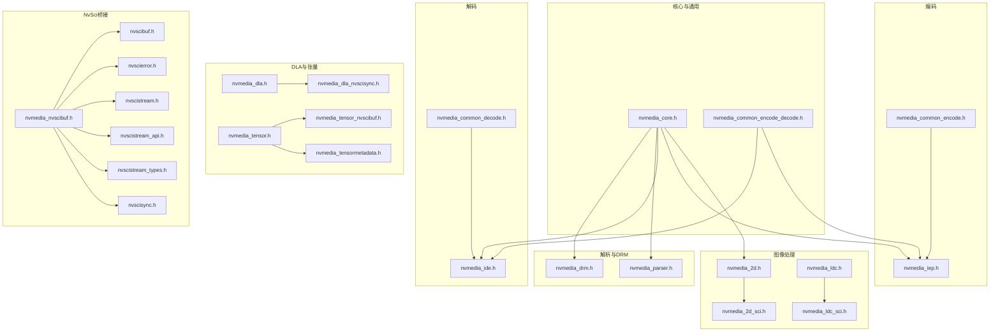
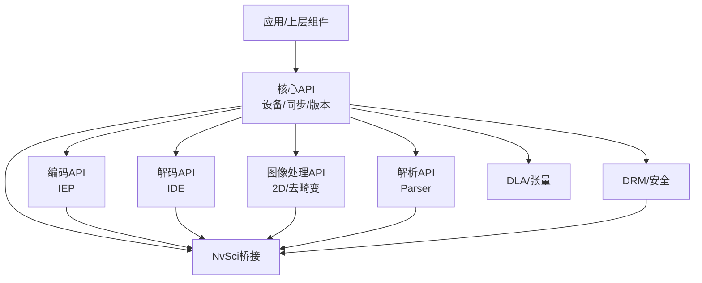
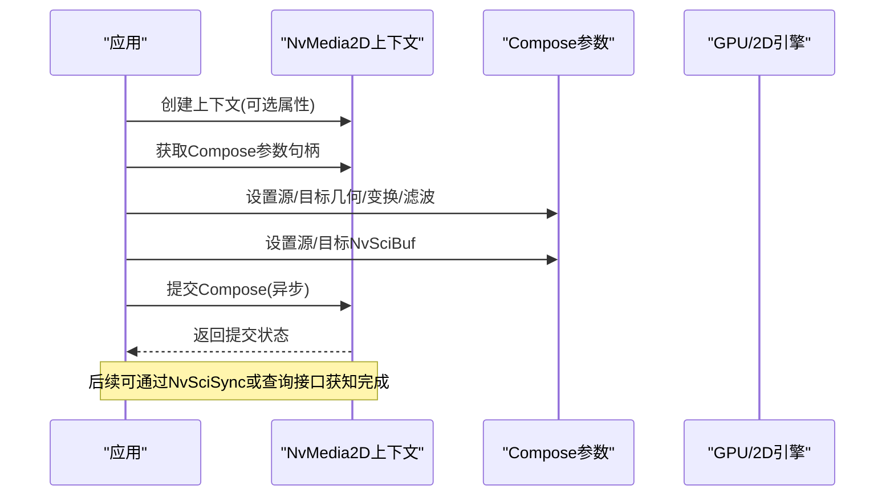
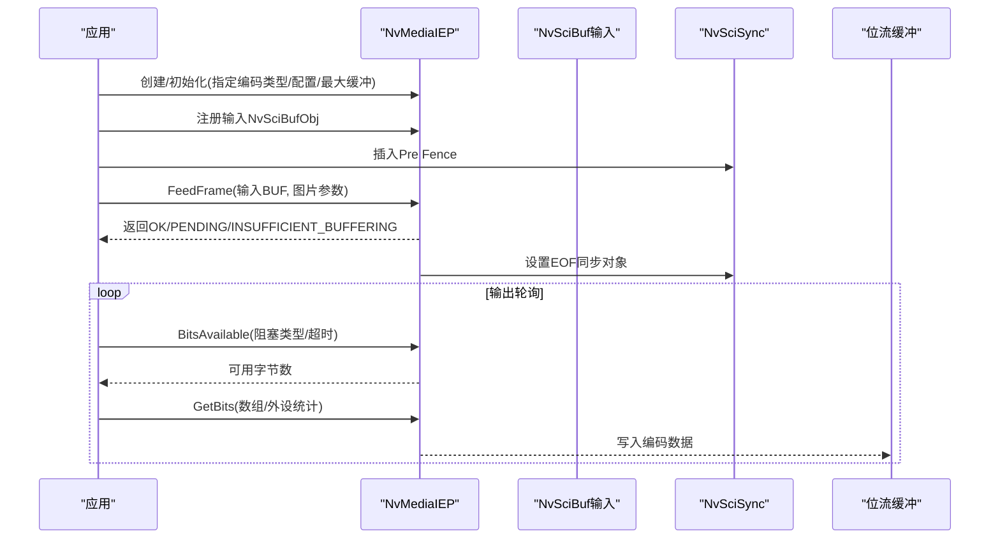
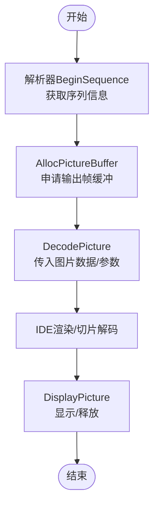
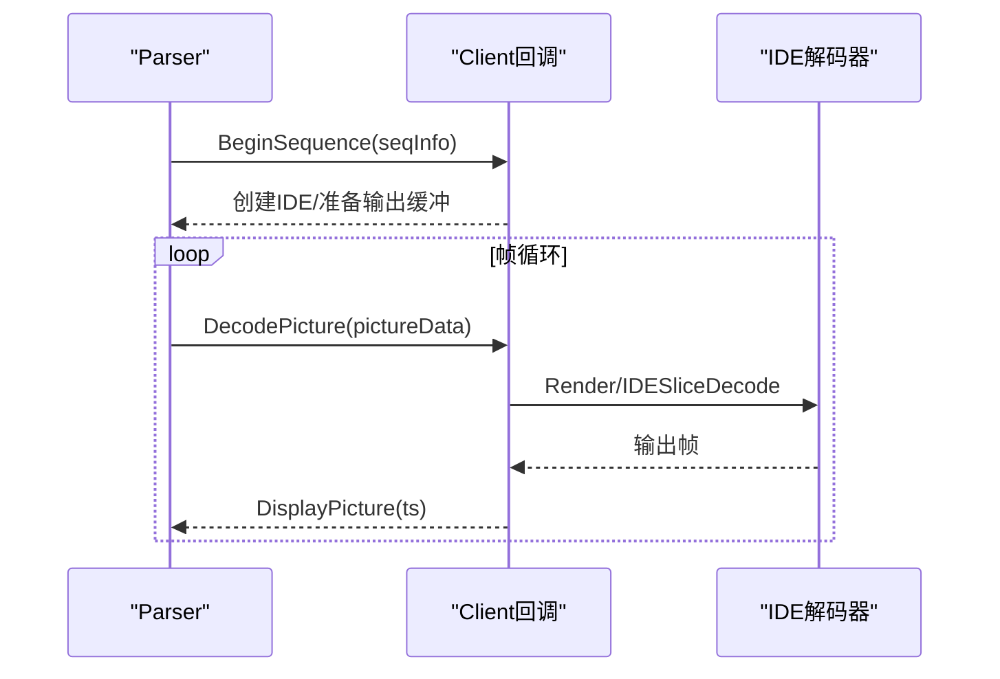
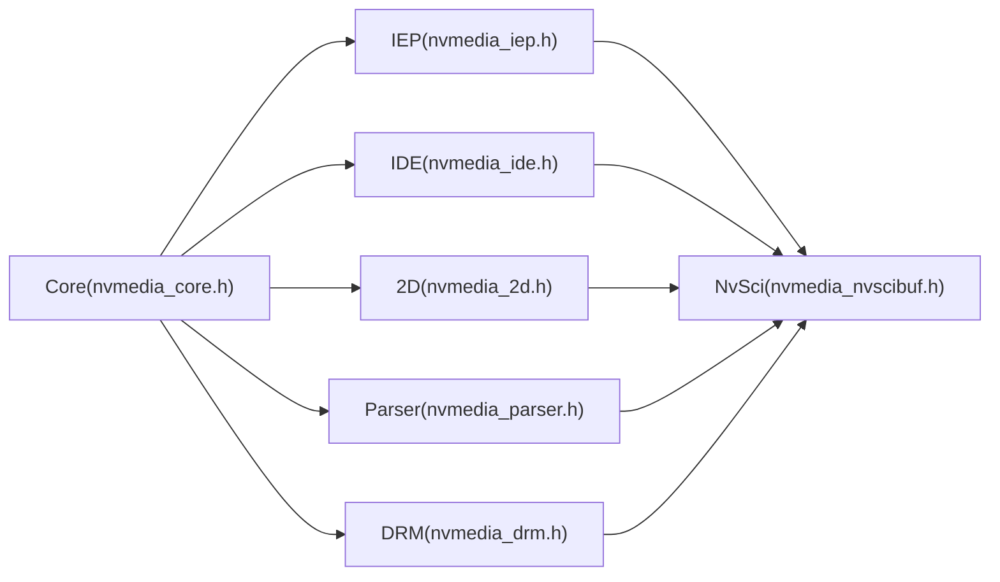

# NvMedia 媒体处理层

<cite>
**本文引用的文件**   
- [nvmedia_core.h](file://driveos-6.0.5.0/drive-linux/include/nvmedia_6x/nvmedia_core.h)
- [nvmedia_2d.h](file://driveos-6.0.5.0/drive-linux/include/nvmedia_6x/nvmedia_2d.h)
- [nvmedia_common_encode.h](file://driveos-6.0.5.0/drive-linux/include/nvmedia_6x/nvmedia_common_encode.h)
- [nvmedia_common_decode.h](file://driveos-6.0.5.0/drive-linux/include/nvmedia_6x/nvmedia_common_decode.h)
- [nvmedia_common_encode_decode.h](file://driveos-6.0.5.0/drive-linux/include/nvmedia_6x/nvmedia_common_encode_decode.h)
- [nvmedia_parser.h](file://driveos-6.0.5.0/drive-linux/include/nvmedia_6x/nvmedia_parser.h)
- [nvmedia_drm.h](file://driveos-6.0.5.0/drive-linux/include/nvmedia_6x/nvmedia_drm.h)
- [nvmedia_iep.h](file://driveos-6.0.5.0/drive-linux/include/nvmedia_6x/nvmedia_iep.h)
- [nvmedia_ide.h](file://driveos-6.0.5.0/drive-linux/include/nvmedia_6x/nvmedia_ide.h)
- [nvmedia_ldc.h](file://driveos-6.0.5.0/drive-linux/include/nvmedia_6x/nvmedia_ldc.h)
- [nvmedia_2d_sci.h](file://driveos-6.0.5.0/drive-linux/include/nvmedia_6x/nvmedia_2d_sci.h)
- [nvmedia_ldc_sci.h](file://driveos-6.0.5.0/drive-linux/include/nvmedia_6x/nvmedia_ldc_sci.h)
- [nvmedia_dla.h](file://driveos-6.0.5.0/drive-linux/include/nvmedia_6x/nvmedia_dla.h)
- [nvmedia_dla_nvscisync.h](file://driveos-6.0.5.0/drive-linux/include/nvmedia_6x/nvmedia_dla_nvscisync.h)
- [nvmedia_tensor.h](file://driveos-6.0.5.0/drive-linux/include/nvmedia_6x/nvmedia_tensor.h)
- [nvmedia_tensor_nvscibuf.h](file://driveos-6.0.5.0/drive-linux/include/nvmedia_6x/nvmedia_tensor_nvscibuf.h)
- [nvmedia_tensormetadata.h](file://driveos-6.0.5.0/drive-linux/include/nvmedia_6x/nvmedia_tensormetadata.h)
- [nvmedia_nvscibuf.h](file://driveos-6.0.5.0/drive-linux/include/nvmedia_6x/nvmedia_nvscibuf.h)
- [nvscibuf.h](file://driveos-6.0.5.0/drive-linux/include/nvscibuf.h)
- [nvscierror.h](file://driveos-6.0.5.0/drive-linux/include/nvscierror.h)
- [nvscistream.h](file://driveos-6.0.5.0/drive-linux/include/nvscistream.h)
- [nvscistream_api.h](file://driveos-6.0.5.0/drive-linux/include/nvscistream_api.h)
- [nvscistream_types.h](file://driveos-6.0.5.0/drive-linux/include/nvscistream_types.h)
- [nvscisync.h](file://driveos-6.0.5.0/drive-linux/include/nvscisync.h)
- [nvmedia_producer.cpp](file://driveos-6.0.5.0/drive-linux/samples/nvsci/nvscistream/multicast/nvmedia_producer.cpp)
- [nvmedia_producer.h](file://driveos-6.0.5.0/drive-linux/samples/nvsci/nvscistream/multicast/nvmedia_producer.h)
</cite>

## 目录
1. [简介](#简介)
2. [项目结构](#项目结构)
3. [核心组件](#核心组件)
4. [架构总bpp概览](#架构概览)
5. [详细组件分析](#详细组件分析)
6. [依赖关系分析](#依赖关系分析)
7. [性能考虑](#性能考虑)
8. [故障排查指南](#故障排查指南)
9. [结论](#结论)
10. [附录](#附录)

## 简介
本技术文档系统性地梳理了NVIDIA DriveOS中NvMedia媒体处理层的架构与实现，覆盖以下关键主题：
- 核心API与数据类型：设备、同步、版本信息等基础能力
- 2D图像处理：变换、滤波、混合与合成
- 编码接口：H.264/H.265/VP9/AV1的参数配置、帧提交与输出获取
- 解码接口：H.264/HEVC/VP9/AV1等的参考帧管理、切片级解码与错误状态
- 媒体解析器：多编解码器的封装、回调驱动的解码流程
- 安全与DRM：加密内容的头解密与清流头获取
- GPU/CUDA/DLA集成：硬件引擎实例化、NvSciBuf/NvSciSync协同
- 协同机制：NvMedia与NvSIPL/NvSci的协作
- 流水线设计与性能优化：异步提交、缓冲区配额、并发与阻塞策略
- 示例与最佳实践：基于样例工程的使用路径

## 项目结构
NvMedia位于DriveOS的include目录下，按功能划分为多个子模块头文件，形成“通用类型 + 功能域API”的层次化组织：
- 通用基础：nvmedia_core.h、nvmedia_common_encode_decode.h
- 图像处理：nvmedia_2d.h、nvmedia_ldc.h、nvmedia_2d_sci.h、nvmedia_ldc_sci.h
- 编码：nvmedia_iep.h + nvmedia_common_encode.h
- 解码：nvmedia_ide.h + nvmedia_common_decode.h
- 解析与DRM：nvmedia_parser.h、nvmedia_drm.h
- DLA与张量：nvmedia_dla.h、nvmedia_dla_nvscisync.h、nvmedia_tensor.h、nvmedia_tensor_nvscibuf.h、nvmedia_tensormetadata.h
- NvSci桥接：nvmedia_nvscibuf.h + nvscibuf.h、nvscierror.h、nvscistream.h、nvscistream_api.h、nvscistream_types.h、nvscisync.h

图表来源
- [nvmedia_core.h:1-265](file://driveos-6.0.5.0/drive-linux/include/nvmedia_6x/nvmedia_core.h#L1-L265)
- [nvmedia_common_encode_decode.h:1-106](file://driveos-6.0.5.0/drive-linux/include/nvmedia_6x/nvmedia_common_encode_decode.h#L1-L106)
- [nvmedia_2d.h:1-800](file://driveos-6.0.5.0/drive-linux/include/nvmedia_6x/nvmedia_2d.h#L1-L800)
- [nvmedia_ldc.h](file://driveos-6.0.5.0/drive-linux/include/nvmedia_6x/nvmedia_ldc.h)
- [nvmedia_2d_sci.h](file://driveos-6.0.5.0/drive-linux/include/nvmedia_6x/nvmedia_2d_sci.h)
- [nvmedia_ldc_sci.h](file://driveos-6.0.5.0/drive-linux/include/nvmedia_6x/nvmedia_ldc_sci.h)
- [nvmedia_iep.h:1-800](file://driveos-6.0.5.0/drive-linux/include/nvmedia_6x/nvmedia_iep.h#L1-L800)
- [nvmedia_common_encode.h:1-800](file://driveos-6.0.5.0/drive-linux/include/nvmedia_6x/nvmedia_common_encode.h#L1-L800)
- [nvmedia_ide.h](file://driveos-6.0.5.0/drive-linux/include/nvmedia_6x/nvmedia_ide.h)
- [nvmedia_common_decode.h:1-800](file://driveos-6.0.5.0/drive-linux/include/nvmedia_6x/nvmedia_common_decode.h#L1-L800)
- [nvmedia_parser.h:1-800](file://driveos-6.0.5.0/drive-linux/include/nvmedia_6x/nvmedia_parser.h#L1-L800)
- [nvmedia_drm.h:1-339](file://driveos-6.0.5.0/drive-linux/include/nvmedia_6x/nvmedia_drm.h#L1-L339)
- [nvmedia_dla.h](file://driveos-6.0.5.0/drive-linux/include/nvmedia_6x/nvmedia_dla.h)
- [nvmedia_dla_nvscisync.h](file://driveos-6.0.5.0/drive-linux/include/nvmedia_6x/nvmedia_dla_nvscisync.h)
- [nvmedia_tensor.h](file://driveos-6.0.5.0/drive-linux/include/nvmedia_6x/nvmedia_tensor.h)
- [nvmedia_tensor_nvscibuf.h](file://driveos-6.0.5.0/drive-linux/include/nvmedia_6x/nvmedia_tensor_nvscibuf.h)
- [nvmedia_tensormetadata.h](file://driveos-6.0.5.0/drive-linux/include/nvmedia_6x/nvmedia_tensormetadata.h)
- [nvmedia_nvscibuf.h](file://driveos-6.0.5.0/drive-linux/include/nvmedia_6x/nvmedia_nvscibuf.h)
- [nvscibuf.h](file://driveos-6.0.5.0/drive-linux/include/nvscibuf.h)
- [nvscierror.h](file://driveos-6.0.5.0/drive-linux/include/nvscierror.h)
- [nvscistream.h](file://driveos-6.0.5.0/drive-linux/include/nvscistream.h)
- [nvscistream_api.h](file://driveos-6.0.5.0/drive-linux/include/nvscistream_api.h)
- [nvscistream_types.h](file://driveos-6.0.5.0/drive-linux/include/nvscistream_types.h)
- [nvscisync.h](file://driveos-6.0.5.0/drive-linux/include/nvscisync.h)

章节来源
- [nvmedia_core.h:1-265](file://driveos-6.0.5.0/drive-linux/include/nvmedia_6x/nvmedia_core.h#L1-L265)
- [nvmedia_common_encode_decode.h:1-106](file://driveos-6.0.5.0/drive-linux/include/nvmedia_6x/nvmedia_common_encode_decode.h#L1-L106)

## 核心组件
- 设备与同步
  - 设备句柄NvMediaDevice用于创建其他对象
  - NvSciSync客户端类型与同步对象类型定义，支持SOFE/EOFE/PRE等时序控制
  - 版本查询接口返回主/次/补丁号
- 错误码与状态
  - 统一的状态枚举涵盖参数、内存、超时、未初始化、不支持、未定义状态等
- 基础数据结构
  - NvMediaRect、NvMediaTime、NvMediaVersion等

章节来源
- [nvmedia_core.h:104-139](file://driveos-6.0.5.0/drive-linux/include/nvmedia_6x/nvmedia_core.h#L104-L139)
- [nvmedia_core.h:189-225](file://driveos-6.0.5.0/drive-linux/include/nvmedia_6x/nvmedia_core.h#L189-L225)
- [nvmedia_core.h:164-171](file://driveos-6.0.5.0/drive-linux/include/nvmedia_6x/nvmedia_core.h#L164-L171)

## 架构概览
NvMedia采用“通用类型 + 功能域API”的分层设计：
- 通用层：设备、同步、版本、编解码通用类型
- 功能域层：2D图像处理、编码、解码、解析、DRM、DLA与张量
- 协同层：通过NvSciBuf/NvSciSync实现跨组件/进程的数据与同步协同

图表来源
- [nvmedia_core.h:251-255](file://driveos-6.0.5.0/drive-linux/include/nvmedia_6x/nvmedia_core.h#L251-L255)
- [nvmedia_iep.h:75-75](file://driveos-6.0.5.0/drive-linux/include/nvmedia_6x/nvmedia_iep.h#L75-L75)
- [nvmedia_ide.h](file://driveos-6.0.5.0/drive-linux/include/nvmedia_6x/nvmedia_ide.h)
- [nvmedia_2d.h:420-421](file://driveos-6.0.5.0/drive-linux/include/nvmedia_6x/nvmedia_2d.h#L420-L421)
- [nvmedia_parser.h:625-626](file://driveos-6.0.5.0/drive-linux/include/nvmedia_6x/nvmedia_parser.h#L625-L626)
- [nvmedia_drm.h:169-174](file://driveos-6.0.5.0/drive-linux/include/nvmedia_6x/nvmedia_drm.h#L169-L174)
- [nvmedia_dla.h](file://driveos-6.0.5.0/drive-linux/include/nvmedia_6x/nvmedia_dla.h)
- [nvmedia_nvscibuf.h](file://driveos-6.0.5.0/drive-linux/include/nvmedia_6x/nvmedia_nvscibuf.h)
- [nvscibuf.h](file://driveos-6.0.5.0/drive-linux/include/nvscibuf.h)

## 详细组件分析

### 核心API与数据类型（nvmedia_core.h）
- 设备与同步
  - NvMediaDevice：根对象，用于创建其他对象
  - NvMediaNvSciSyncClientType：信号者/等待者/双角色
  - NvMediaNvSciSyncObjType：PRE/SOF/EOF等同步对象类型
- 版本信息：NvMediaVersion（主/次/补丁）
- 错误码：NvMediaStatus统一错误语义

章节来源
- [nvmedia_core.h:251-255](file://driveos-6.0.5.0/drive-linux/include/nvmedia_6x/nvmedia_core.h#L251-L255)
- [nvmedia_core.h:189-225](file://driveos-6.0.5.0/drive-linux/include/nvmedia_6x/nvmedia_core.h#L189-L225)
- [nvmedia_core.h:164-171](file://driveos-6.0.5.0/drive-linux/include/nvmedia_6x/nvmedia_core.h#L164-L171)

### 2D图像处理（nvmedia_2d.h）
- 能力概述
  - 支持多源图层合成、几何变换、滤波与混合
  - 提供Compose参数池、滤波系数缓冲、版本查询
- 关键类型与接口
  - NvMedia2D、NvMedia2DAttributes、NvMedia2DComposeParameters、NvMedia2DFilterBuffer
  - 几何设置、滤波模式、混合模式、Compose提交与结果
- 使用要点
  - 源/目标矩形、变换（旋转/镜像/转置）、滤波（OFF/LOW/MEDIUM/HIGH）
  - 参考尺寸限制、色度子采样对齐约束、命令缓冲空间不足时的等待策略

图表来源
- [nvmedia_2d.h:475-526](file://driveos-6.0.5.0/drive-linux/include/nvmedia_6x/nvmedia_2d.h#L475-L526)
- [nvmedia_2d.h:575-696](file://driveos-6.0.5.0/drive-linux/include/nvmedia_6x/nvmedia_2d.h#L575-L696)

章节来源
- [nvmedia_2d.h:68-94](file://driveos-6.0.5.0/drive-linux/include/nvmedia_6x/nvmedia_2d.h#L68-L94)
- [nvmedia_2d.h:164-191](file://driveos-6.0.5.0/drive-linux/include/nvmedia_6x/nvmedia_2d.h#L164-L191)
- [nvmedia_2d.h:241-281](file://driveos-6.0.5.0/drive-linux/include/nvmedia_6x/nvmedia_2d.h#L241-L281)
- [nvmedia_2d.h:475-526](file://driveos-6.0.5.0/drive-linux/include/nvmedia_6x/nvmedia_2d.h#L475-L526)
- [nvmedia_2d.h:575-696](file://driveos-6.0.5.0/drive-linux/include/nvmedia_6x/nvmedia_2d.h#L575-L696)

### 视频编码接口（nvmedia_iep.h + nvmedia_common_encode.h）
- 能力概述
  - 支持H.264/H.265/VP9/AV1编码；通过NvSciBuf/NvSciSync进行异步提交与输出获取
  - 配置GOP、码率控制（CBR/VBR/CONSTQP等）、B帧数、量化参数、预设质量
- 关键类型与接口
  - NvMediaIEP、NvMediaIEPType、NvMediaIEPCreate/Init/Destroy/FeedFrame/GetBits/BitsAvailable
  - 编码配置结构（H264/H265/VP9/AV1），图片参数（PicParams），属性获取（GetAttribute）
- 使用要点
  - 注册输入NvSciBufObj以确保确定性执行时间
  - 通过PreNvSciSyncFence与EOF同步对象协调生产者/消费者
  - maxBuffering限制同时在途帧数，避免输出堆积导致阻塞

图表来源
- [nvmedia_iep.h:196-202](file://driveos-6.0.5.0/drive-linux/include/nvmedia_6x/nvmedia_iep.h#L196-L202)
- [nvmedia_iep.h:413-418](file://driveos-6.0.5.0/drive-linux/include/nvmedia_6x/nvmedia_iep.h#L413-L418)
- [nvmedia_iep.h:630-635](file://driveos-6.0.5.0/drive-linux/include/nvmedia_6x/nvmedia_iep.h#L630-L635)
- [nvmedia_iep.h:557-563](file://driveos-6.0.5.0/drive-linux/include/nvmedia_6x/nvmedia_iep.h#L557-L563)
- [nvmedia_common_encode.h:85-101](file://driveos-6.0.5.0/drive-linux/include/nvmedia_6x/nvmedia_common_encode.h#L85-L101)

章节来源
- [nvmedia_iep.h:196-202](file://driveos-6.0.5.0/drive-linux/include/nvmedia_6x/nvmedia_iep.h#L196-L202)
- [nvmedia_iep.h:413-418](file://driveos-6.0.5.0/drive-linux/include/nvmedia_6x/nvmedia_iep.h#L413-L418)
- [nvmedia_iep.h:630-635](file://driveos-6.0.5.0/drive-linux/include/nvmedia_6x/nvmedia_iep.h#L630-L635)
- [nvmedia_iep.h:557-563](file://driveos-6.0.5.0/drive-linux/include/nvmedia_6x/nvmedia_iep.h#L557-L563)
- [nvmedia_common_encode.h:85-101](file://driveos-6.0.5.0/drive-linux/include/nvmedia_6x/nvmedia_common_encode.h#L85-L101)

### 视频解码接口（nvmedia_ide.h + nvmedia_common_decode.h）
- 能力概述
  - 支持H.264/HEVC/VP9/AV1等解码；提供参考帧管理、切片级解码、错误状态上报
  - 支持DPB（解码参考缓冲）信息导出，便于编码器错误恢复
- 关键类型与接口
  - NvMediaIDE（解码器对象）、NvMediaDecoderInstanceId、NvMediaIDERender/IDESliceDecode
  - 参考帧结构（H.264/HEVC）、宏块元数据、运动矢量Dump、帧统计
- 使用要点
  - 通过Parser回调链路传递序列/图片信息，再调用IDE渲染
  - 切片级解码需启用相应属性并在回调中传入切片数据

图表来源
- [nvmedia_common_decode.h:239-270](file://driveos-6.0.5.0/drive-linux/include/nvmedia_6x/nvmedia_common_decode.h#L239-L270)
- [nvmedia_common_decode.h:169-188](file://driveos-6.0.5.0/drive-linux/include/nvmedia_6x/nvmedia_common_decode.h#L169-L188)
- [nvmedia_parser.h:550-603](file://driveos-6.0.5.0/drive-linux/include/nvmedia_6x/nvmedia_parser.h#L550-L603)

章节来源
- [nvmedia_common_decode.h:239-270](file://driveos-6.0.5.0/drive-linux/include/nvmedia_6x/nvmedia_common_decode.h#L239-L270)
- [nvmedia_common_decode.h:169-188](file://driveos-6.0.5.0/drive-linux/include/nvmedia_6x/nvmedia_common_decode.h#L169-L188)
- [nvmedia_parser.h:550-603](file://driveos-6.0.5.0/drive-linux/include/nvmedia_6x/nvmedia_parser.h#L550-L603)

### 媒体解析器（nvmedia_parser.h）
- 能力概述
  - 封装多编解码器解析流程，提供回调驱动的解码管线
  - 支持帧率过滤、PTS计算、加密内容扫描与头解密
- 关键类型与接口
  - NvMediaParser、NvMediaParserParams、NvMediaParserClientCb回调集
  - 序列信息NvMediaParserSeqInfo、图片数据NvMediaParserPictureData
- 使用要点
  - 在BeginSequence中创建对应IDE对象；在DecodePicture中调用IDE渲染
  - 加密场景先Scan再DecryptHdr，随后GetClearHdr获取清流头

图表来源
- [nvmedia_parser.h:651-654](file://driveos-6.0.5.0/drive-linux/include/nvmedia_6x/nvmedia_parser.h#L651-L654)
- [nvmedia_parser.h:729-732](file://driveos-6.0.5.0/drive-linux/include/nvmedia_6x/nvmedia_parser.h#L729-L732)
- [nvmedia_parser.h:774-777](file://driveos-6.0.5.0/drive-linux/include/nvmedia_6x/nvmedia_parser.h#L774-L777)

章节来源
- [nvmedia_parser.h:651-654](file://driveos-6.0.5.0/drive-linux/include/nvmedia_6x/nvmedia_parser.h#L651-L654)
- [nvmedia_parser.h:729-732](file://driveos-6.0.5.0/drive-linux/include/nvmedia_6x/nvmedia_parser.h#L729-L732)
- [nvmedia_parser.h:774-777](file://driveos-6.0.5.0/drive-linux/include/nvmedia_6x/nvmedia_parser.h#L774-L777)

### 安全与DRM（nvmedia_drm.h）
- 能力概述
  - 支持多种DRM模式（Netflix/Widevine/Ultraviolet等），处理加密位流元数据
  - 提供头解密与清流头获取，配合Parser/IDE完成OTF解码
- 关键类型与接口
  - NvMediaVideoDecrypter、NvMediaEncryptParams、NvMediaAESMetaData
  - DecryptHeader、GetClearHeader
- 使用要点
  - 先创建Decrypter，再在Scan阶段传递加密元数据，随后DecryptHdr与GetClearHdr

章节来源
- [nvmedia_drm.h:216-222](file://driveos-6.0.5.0/drive-linux/include/nvmedia_6x/nvmedia_drm.h#L216-L222)
- [nvmedia_drm.h:287-292](file://driveos-6.0.5.0/drive-linux/include/nvmedia_6x/nvmedia_drm.h#L287-L292)
- [nvmedia_drm.h:327-330](file://driveos-6.0.5.0/drive-linux/include/nvmedia_6x/nvmedia_drm.h#L327-L330)

### GPU加速、DLA加速与CUDA集成
- GPU/CUDA
  - 2D/IEP/IDE均通过NvSciBuf/NvSciSync与GPU/NvENC/NVDEC协同
  - 通过NvSciBuf分配输入/输出表面，利用NvSciSync实现跨组件同步
- DLA
  - 提供DLA引擎与NvSciSync集成头文件，支持张量/元数据的跨组件传输
  - 张量相关头文件提供NvSciBuf桥接，便于DLA与GPU间数据流转

章节来源
- [nvmedia_2d.h:475-526](file://driveos-6.0.5.0/drive-linux/include/nvmedia_6x/nvmedia_2d.h#L475-L526)
- [nvmedia_iep.h:741-744](file://driveos-6.0.5.0/drive-linux/include/nvmedia_6x/nvmedia_iep.h#L741-L744)
- [nvmedia_dla.h](file://driveos-6.0.5.0/drive-linux/include/nvmedia_6x/nvmedia_dla.h)
- [nvmedia_dla_nvscisync.h](file://driveos-6.0.5.0/drive-linux/include/nvmedia_6x/nvmedia_dla_nvscisync.h)
- [nvmedia_tensor_nvscibuf.h](file://driveos-6.0.5.0/drive-linux/include/nvmedia_6x/nvmedia_tensor_nvscibuf.h)

### 与NvSIPL和NvSci的协同机制
- NvSIPL
  - 通过Parser回调链路与NvSIPL设备/管道交互，实现从传感器到解码/渲染的端到端链路
- NvSci
  - 通过nvmedia_nvscibuf.h桥接NvMedia与nvscibuf.h，实现跨进程/跨组件的NvSciBuf/NvSciSync共享
  - 样例工程中的nvmedia_producer展示了如何在多播场景中使用NvSciStream进行数据通道化

章节来源
- [nvmedia_nvscibuf.h](file://driveos-6.0.5.0/drive-linux/include/nvmedia_6x/nvmedia_nvscibuf.h)
- [nvscibuf.h](file://driveos-6.0.5.0/drive-linux/include/nvscibuf.h)
- [nvscistream.h](file://driveos-6.0.5.0/drive-linux/include/nvscistream.h)
- [nvscistream_api.h](file://driveos-6.0.5.0/drive-linux/include/nvscistream_api.h)
- [nvscistream_types.h](file://driveos-6.0.5.0/drive-linux/include/nvscistream_types.h)
- [nvscisync.h](file://driveos-6.0.5.0/drive-linux/include/nvscisync.h)
- [nvmedia_producer.cpp](file://driveos-6.0.5.0/drive-linux/samples/nvsci/nvscistream/multicast/nvmedia_producer.cpp)
- [nvmedia_producer.h](file://driveos-6.0.5.0/drive-linux/samples/nvsci/nvscistream/multicast/nvmedia_producer.h)

## 依赖关系分析
- 组件耦合
  - IEP/IDE/2D/Parser均依赖Core提供的设备/同步/版本能力
  - IEP/IDE/2D通过NvSciBuf/NvSciSync与硬件引擎协同
  - Parser与IDE紧密耦合，通过回调传递序列/图片信息
  - DRM与Parser/IDE协作，处理加密内容的头解密与清流头
- 外部依赖
  - NvSci系列头文件提供跨组件/进程的缓冲与同步抽象
  - DLA/张量相关头文件提供AI/视觉后端的桥接

图表来源
- [nvmedia_core.h:251-255](file://driveos-6.0.5.0/drive-linux/include/nvmedia_6x/nvmedia_core.h#L251-L255)
- [nvmedia_iep.h:75-75](file://driveos-6.0.5.0/drive-linux/include/nvmedia_6x/nvmedia_iep.h#L75-L75)
- [nvmedia_ide.h](file://driveos-6.0.5.0/drive-linux/include/nvmedia_6x/nvmedia_ide.h)
- [nvmedia_2d.h:420-421](file://driveos-6.0.5.0/drive-linux/include/nvmedia_6x/nvmedia_2d.h#L420-L421)
- [nvmedia_parser.h:625-626](file://driveos-6.0.5.0/drive-linux/include/nvmedia_6x/nvmedia_parser.h#L625-L626)
- [nvmedia_drm.h:169-174](file://driveos-6.0.5.0/drive-linux/include/nvmedia_6x/nvmedia_drm.h#L169-L174)
- [nvmedia_nvscibuf.h](file://driveos-6.0.5.0/drive-linux/include/nvmedia_6x/nvmedia_nvscibuf.h)

章节来源
- [nvmedia_core.h:251-255](file://driveos-6.0.5.0/drive-linux/include/nvmedia_6x/nvmedia_core.h#L251-L255)
- [nvmedia_iep.h:75-75](file://driveos-6.0.5.0/drive-linux/include/nvmedia_6x/nvmedia_iep.h#L75-L75)
- [nvmedia_2d.h:420-421](file://driveos-6.0.5.0/drive-linux/include/nvmedia_6x/nvmedia_2d.h#L420-L421)
- [nvmedia_parser.h:625-626](file://driveos-6.0.5.0/drive-linux/include/nvmedia_6x/nvmedia_parser.h#L625-L626)
- [nvmedia_drm.h:169-174](file://driveos-6.0.5.0/drive-linux/include/nvmedia_6x/nvmedia_drm.h#L169-L174)

## 性能考虑
- 异步流水线
  - IEP/2D/IDE均采用异步提交，通过NvSciSync协调完成事件
  - 合理设置maxBuffering与Pre Fence，避免输出堆积与CPU阻塞
- 缓冲区配额
  - IEP注册输入NvSciBufObj以确保确定性执行时间
  - 2D/IEP/IDE均有限制命令缓冲与在途帧数的策略
- 并发与阻塞
  - BitsAvailable支持阻塞/非阻塞两种模式，结合超时参数平衡吞吐与延迟
- 切片级解码
  - HEVC/AV1等支持切片级解码，降低端到端延迟，但需正确传递切片偏移

## 故障排查指南
- 常见错误码
  - 参数错误、内存不足、未初始化、不支持、超时、未定义状态、无效状态
- 编码侧
  - INSUFFICIENT_BUFFERING：输出获取不及时，需调用GetBits回收在途帧
  - ERROR/UNDEFINED_STATE：内部错误，检查配置与硬件状态
- 解码侧
  - 通过IDEFrameStatus/IDEFrameStats获取硬件解码时钟、宏块统计与错误标志
- 2D侧
  - 命令缓冲满：等待最近提交任务完成或增大参数池容量
- DRM侧
  - DecryptHeader失败：确认加密元数据与KeySlot配置正确

章节来源
- [nvmedia_core.h:104-139](file://driveos-6.0.5.0/drive-linux/include/nvmedia_6x/nvmedia_core.h#L104-L139)
- [nvmedia_iep.h:398-410](file://driveos-6.0.5.0/drive-linux/include/nvmedia_6x/nvmedia_iep.h#L398-L410)
- [nvmedia_common_decode.h:105-118](file://driveos-6.0.5.0/drive-linux/include/nvmedia_6x/nvmedia_common_decode.h#L105-L118)
- [nvmedia_2d.h:655-667](file://driveos-6.0.5.0/drive-linux/include/nvmedia_6x/nvmedia_2d.h#L655-L667)
- [nvmedia_drm.h:287-292](file://driveos-6.0.5.0/drive-linux/include/nvmedia_6x/nvmedia_drm.h#L287-L292)

## 结论
NvMedia以统一的Core API为基础，围绕2D图像处理、编码、解码、解析与DRM构建了完整的媒体处理栈，并通过NvSciBuf/NvSciSync实现跨组件/进程的高效协同。其异步流水线、严格的缓冲区配额与同步机制，使得在GPU/CUDA/DLA等异构平台上能够实现高吞吐、低延迟的媒体处理。结合NvSIPL与NvSci的生态，NvMedia为自动驾驶与车载视觉应用提供了坚实的基础。

## 附录
- 代码示例与最佳实践
  - IEP编码：创建/初始化 → 注册输入缓冲 → 插入Pre Fence → 提交帧 → 轮询BitsAvailable → 获取位流
  - 2D合成：创建上下文 → 获取Compose参数 → 配置几何/滤波/混合 → 设置源/目标缓冲 → 提交Compose
  - 解码流程：Parser回调 → 创建IDE → 渲染/切片解码 → 显示/释放
  - DRM：Scan阶段传递加密元数据 → DecryptHdr → GetClearHdr → 继续解码

章节来源
- [nvmedia_iep.h:196-202](file://driveos-6.0.5.0/drive-linux/include/nvmedia_6x/nvmedia_iep.h#L196-L202)
- [nvmedia_iep.h:413-418](file://driveos-6.0.5.0/drive-linux/include/nvmedia_6x/nvmedia_iep.h#L413-L418)
- [nvmedia_iep.h:630-635](file://driveos-6.0.5.0/drive-linux/include/nvmedia_6x/nvmedia_iep.h#L630-L635)
- [nvmedia_iep.h:557-563](file://driveos-6.0.5.0/drive-linux/include/nvmedia_6x/nvmedia_iep.h#L557-L563)
- [nvmedia_2d.h:475-526](file://driveos-6.0.5.0/drive-linux/include/nvmedia_6x/nvmedia_2d.h#L475-L526)
- [nvmedia_2d.h:575-696](file://driveos-6.0.5.0/drive-linux/include/nvmedia_6x/nvmedia_2d.h#L575-L696)
- [nvmedia_parser.h:550-603](file://driveos-6.0.5.0/drive-linux/include/nvmedia_6x/nvmedia_parser.h#L550-L603)
- [nvmedia_drm.h:287-292](file://driveos-6.0.5.0/drive-linux/include/nvmedia_6x/nvmedia_drm.h#L287-L292)
- [nvmedia_drm.h:327-330](file://driveos-6.0.5.0/drive-linux/include/nvmedia_6x/nvmedia_drm.h#L327-L330)