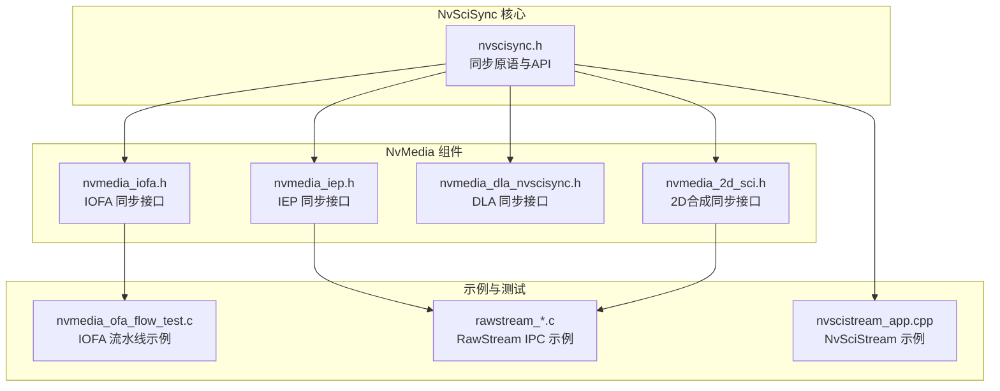
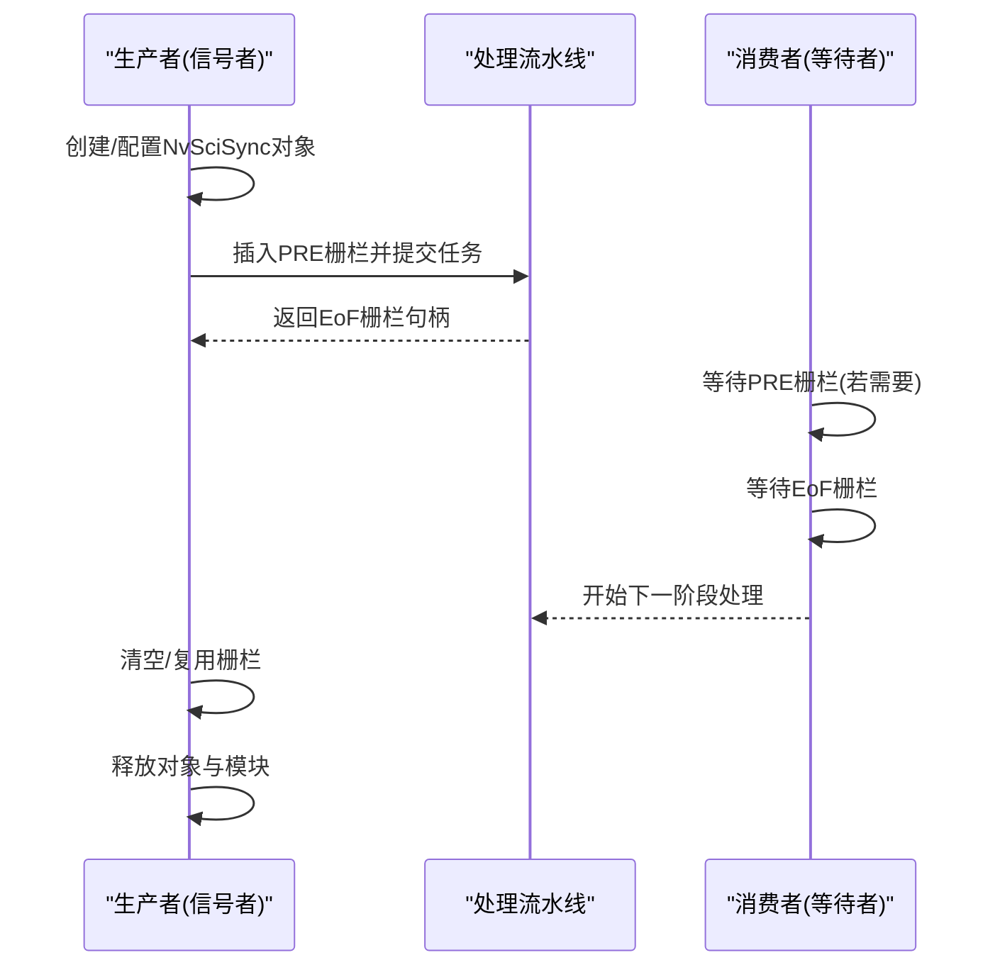
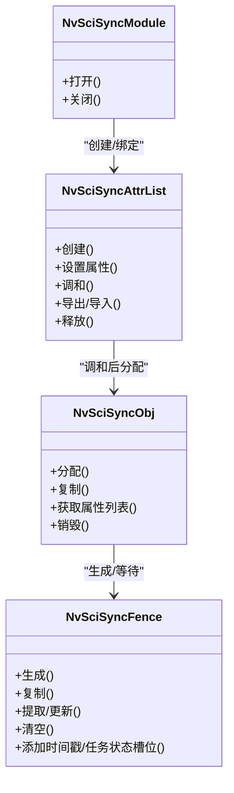
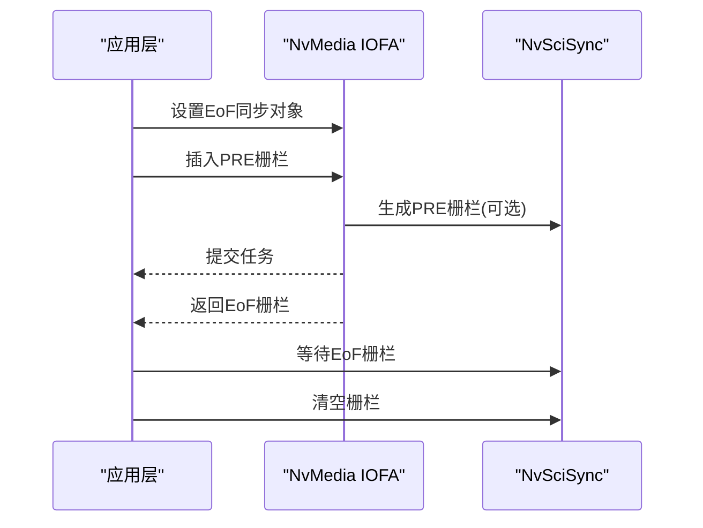
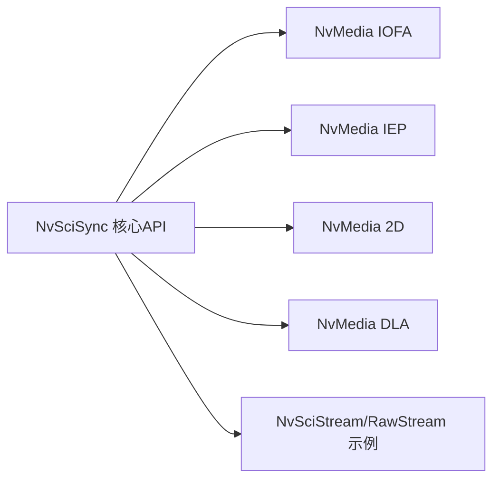

# 同步机制与NvSci集成

<cite>
**本文档引用的文件**
- [nvscisync.h](file://driveos-60100/usr/include/nvscisync.h)
- [nvmedia_iofa.h](file://driveos-60100/drive-linux/include/nvmedia_6x/nvmedia_iofa.h)
- [nvmedia_2d_sci.h](file://driveos-60100/drive-linux/include/nvmedia_6x/nvmedia_2d_sci.h)
- [nvmedia_dla_nvscisync.h](file://driveos-60100/drive-linux/include/nvmedia_6x/nvmedia_dla_nvscisync.h)
- [nvmedia_iep.h](file://driveos-6081/drive-linux/include/nvmedia_6x/nvmedia_iep.h)
- [nvmedia_ofa_flow_test.c](file://driveos-6.0.6.0/drive-linux/samples/nvmedia_6x/iofa/flow/nvmedia_ofa_flow_test.c)
- [nvscistream_app.cpp](file://driveos-5260/drive-linux/samples/nvsci/nvscistream/unicast/nvscistream_app.cpp)
- [nvmedia_producer.h](file://driveos-5260/drive-linux/samples/nvsci/nvscistream/unicast/nvmedia_producer.h)
- [nvscistream_app.cpp](file://driveos-5260/drive-linux/samples/nvsci/nvscistream/multicast/nvscistream_app.cpp)
- [nvmedia_producer.h](file://driveos-5260/drive-linux/samples/nvsci/nvscistream/multicast/nvmedia_producer.h)
- [rawstream_main.c](file://driveos-5260/drive-linux/samples/nvsci/rawstream/rawstream_main.c)
- [rawstream_producer.c](file://driveos-5260/drive-linux/samples/nvsci/rawstream/rawstream_producer.c)
- [rawstream_consumer.c](file://driveos-5260/drive-linux/samples/nvsci/rawstream/rawstream_consumer.c)
- [image_2d.c](file://driveos-6.0.5.0/drive-linux/samples/nvmedia/img_2d/image_2d.c)
- [image_encoder.c](file://driveos-6.0.5.0/drive-linux/samples/nvmedia_6x/iep/image_encoder.c)
- [image_jpegenc.c](file://driveos-6.0.5.0/drive-linux/samples/nvmedia_6x/ijpe/image_jpegenc.c)
- [image_jpegdec.c](file://driveos-6.0.5.0/drive-linux/samples/nvmedia_6x/ijpd/image_jpegdec.c)
- [videodemo.c](file://driveos-6.0.5.0/drive-linux/samples/nvmedia_6x/ide/videodemo.c)
</cite>

## 目录
1. [简介](#简介)
2. [项目结构](#项目结构)
3. [核心组件](#核心组件)
4. [架构总览](#架构总览)
5. [详细组件分析](#详细组件分析)
6. [依赖关系分析](#依赖关系分析)
7. [性能考虑](#性能考虑)
8. [故障排查指南](#故障排查指南)
9. [结论](#结论)
10. [附录](#附录)

## 简介
本技术文档围绕NVIDIA DriveOS中NvMedia与NvSci（NVIDIA Software Communications Interface）的同步机制集成展开，系统阐述NvSciSync在NvMedia中的核心作用、开始帧栅栏(SOF)、结束帧栅栏(EoF)与预栅栏(PRE)的同步原理与应用场景；明确信号者与等待者的角色分工及同步对象类型选择原则；给出从创建、等待、信号到销毁的完整生命周期管理；总结媒体处理流水线中的生产者-消费者协调与并行优化策略；提供性能优化建议、故障排查与调试方法，并展示与其他NvMedia组件的集成最佳实践。

## 项目结构
该仓库包含多版本驱动与SDK头文件、示例程序与测试样例，其中与NvSciSync直接相关的关键路径如下：
- 同步内核与API：`driveos-60100/usr/include/nvscisync.h`
- NvMedia组件对NvSciSync的封装与接口：`driveos-60100/drive-linux/include/nvmedia_6x/` 下各组件头文件
- 示例与测试：`driveos-6.0.6.0/drive-linux/samples/.../iofa/flow/nvmedia_ofa_flow_test.c` 等
- NvSciStream与RawStream示例：`driveos-5260/drive-linux/samples/nvsci/...`

**图表来源**
- [nvscisync.h:1-200](file://driveos-60100/usr/include/nvscisync.h#L1-L200)
- [nvmedia_iofa.h:1145-1344](file://driveos-60100/drive-linux/include/nvmedia_6x/nvmedia_iofa.h#L1145-L1344)
- [nvmedia_iep.h:1148-1324](file://driveos-6081/drive-linux/include/nvmedia_6x/nvmedia_iep.h#L1148-L1324)
- [nvmedia_dla_nvscisync.h:1-200](file://driveos-60100/drive-linux/include/nvmedia_6x/nvmedia_dla_nvscisync.h#L1-L200)
- [nvmedia_2d_sci.h:450-638](file://driveos-60100/drive-linux/include/nvmedia_6x/nvmedia_2d_sci.h#L450-L638)
- [nvmedia_ofa_flow_test.c:1-200](file://driveos-6.0.6.0/drive-linux/samples/nvmedia_6x/iofa/flow/nvmedia_ofa_flow_test.c#L1-L200)

**章节来源**
- [nvscisync.h:1-200](file://driveos-60100/usr/include/nvscisync.h#L1-L200)
- [nvmedia_iofa.h:1145-1344](file://driveos-60100/drive-linux/include/nvmedia_6x/nvmedia_iofa.h#L1145-L1344)
- [nvmedia_2d_sci.h:450-638](file://driveos-60100/drive-linux/include/nvmedia_6x/nvmedia_2d_sci.h#L450-L638)
- [nvmedia_dla_nvscisync.h:1-200](file://driveos-60100/drive-linux/include/nvmedia_6x/nvmedia_dla_nvscisync.h#L1-L200)
- [nvmedia_iep.h:1148-1324](file://driveos-6081/drive-linux/include/nvmedia_6x/nvmedia_iep.h#L1148-L1324)

## 核心组件
- NvSciSync 原语与生命周期
  - 模块与CPU等待上下文：模块打开/关闭、CPU等待上下文分配/释放
  - 属性列表与对象：未调和/已调和属性列表、对象分配/复制/获取属性列表/销毁
  - 同步栅栏：生成栅栏、复制栅栏、提取/更新栅栏、清空栅栏、添加时间戳/任务状态槽位
  - 等待与模式：CPU等待、等待模式（默认/忙等/阻塞）
- NvMedia 对接NvSciSync
  - IOFA/IEP/2D/DLA等组件通过专用API设置EoF栅栏、插入PRE栅栏、获取EOF栅栏
  - 组件注册/注销NvSciSync对象，确保跨引擎流水线同步

**章节来源**
- [nvscisync.h:725-837](file://driveos-60100/usr/include/nvscisync.h#L725-L837)
- [nvscisync.h:873-906](file://driveos-60100/usr/include/nvscisync.h#L873-L906)
- [nvscisync.h:1378-1383](file://driveos-60100/usr/include/nvscisync.h#L1378-L1383)
- [nvscisync.h:1764-1811](file://driveos-60100/usr/include/nvscisync.h#L1764-L1811)
- [nvscisync.h:2055-2057](file://driveos-60100/usr/include/nvscisync.h#L2055-L2057)
- [nvmedia_iofa.h:1244-1312](file://driveos-60100/drive-linux/include/nvmedia_6x/nvmedia_iofa.h#L1244-L1312)
- [nvmedia_2d_sci.h:530-533](file://driveos-60100/drive-linux/include/nvmedia_6x/nvmedia_2d_sci.h#L530-L533)
- [nvmedia_dla_nvscisync.h:144-149](file://driveos-60100/drive-linux/include/nvmedia_6x/nvmedia_dla_nvscisync.h#L144-L149)

## 架构总览
NvSciSync在NvMedia中的作用是提供跨进程/跨引擎的轻量级同步原语，用于协调媒体处理流水线中不同阶段的开始与结束。典型流程：
- 初始化：创建NvSciSync模块，构建并调和属性列表，分配NvSciSync对象
- 预栅栏(PRE)：在提交任务前设置前置栅栏，保证后续阶段仅在PRE栅栏满足后启动
- 结束栅栏(EoF)：任务完成后产生EoF栅栏，下游阶段通过等待EoF栅栏实现有序推进
- 清理：完成处理后清空栅栏，释放对象与模块

**图表来源**
- [nvmedia_ofa_flow_test.c:1634-1710](file://driveos-6.0.6.0/drive-linux/samples/nvmedia_6x/iofa/flow/nvmedia_ofa_flow_test.c#L1634-L1710)
- [nvmedia_ofa_flow_test.c:1712-1787](file://driveos-6.0.6.0/drive-linux/samples/nvmedia_6x/iofa/flow/nvmedia_ofa_flow_test.c#L1712-L1787)
- [nvmedia_iofa.h:1244-1312](file://driveos-60100/drive-linux/include/nvmedia_6x/nvmedia_iofa.h#L1244-L1312)

## 详细组件分析

### NvSciSync 核心原语与生命周期
- 模块与上下文
  - 模块打开/关闭：每个进程独立打开模块，确保资源正确绑定与释放
  - CPU等待上下文：为CPU侧等待提供资源，支持多种等待模式
- 属性列表与对象
  - 未调和属性列表：设置需求权限、CPU访问、基元类型等
  - 调和：将多个未调和列表合并并验证，得到可分配的对象
  - 分配对象：根据调和结果分配NvSciSync对象
  - 复制/获取属性列表/销毁：支持对象复用与生命周期管理
- 栅栏操作
  - 生成栅栏：由信号者在任务开始或完成时生成
  - 复制/提取/更新：支持栅栏传递与跨进程导入导出
  - 清空：释放栅栏持有的引用，允许对象回收
  - 时间戳/任务状态槽位：用于性能统计与任务状态回传

**图表来源**
- [nvscisync.h:725-837](file://driveos-60100/usr/include/nvscisync.h#L725-L837)
- [nvscisync.h:873-906](file://driveos-60100/usr/include/nvscisync.h#L873-L906)
- [nvscisync.h:1378-1383](file://driveos-60100/usr/include/nvscisync.h#L1378-L1383)
- [nvscisync.h:2055-2057](file://driveos-60100/usr/include/nvscisync.h#L2055-L2057)
- [nvscisync.h:1764-1811](file://driveos-60100/usr/include/nvscisync.h#L1764-L1811)

**章节来源**
- [nvscisync.h:725-837](file://driveos-60100/usr/include/nvscisync.h#L725-L837)
- [nvscisync.h:873-906](file://driveos-60100/usr/include/nvscisync.h#L873-L906)
- [nvscisync.h:1378-1383](file://driveos-60100/usr/include/nvscisync.h#L1378-L1383)
- [nvscisync.h:2055-2057](file://driveos-60100/usr/include/nvscisync.h#L2055-L2057)
- [nvscisync.h:1764-1811](file://driveos-60100/usr/include/nvscisync.h#L1764-L1811)

### NvMedia IOFA 的EoF/PRE栅栏集成
- 设置EoF同步对象：在每次任务提交前指定用于EoF栅栏的NvSciSync对象
- 插入PRE栅栏：在任务提交前插入一个或多个PRE栅栏，确保前置条件满足
- 获取EoF栅栏：任务提交后获取EoF栅栏，供下游阶段等待
- 生命周期管理：任务完成后清空栅栏，必要时等待对象不再被使用后再注销

**图表来源**
- [nvmedia_iofa.h:1244-1312](file://driveos-60100/drive-linux/include/nvmedia_6x/nvmedia_iofa.h#L1244-L1312)
- [nvmedia_ofa_flow_test.c:1634-1710](file://driveos-6.0.6.0/drive-linux/samples/nvmedia_6x/iofa/flow/nvmedia_ofa_flow_test.c#L1634-L1710)
- [nvmedia_ofa_flow_test.c:1712-1787](file://driveos-6.0.6.0/drive-linux/samples/nvmedia_6x/iofa/flow/nvmedia_ofa_flow_test.c#L1712-L1787)

**章节来源**
- [nvmedia_iofa.h:1244-1312](file://driveos-60100/drive-linux/include/nvmedia_6x/nvmedia_iofa.h#L1244-L1312)
- [nvmedia_ofa_flow_test.c:1634-1710](file://driveos-6.0.6.0/drive-linux/samples/nvmedia_6x/iofa/flow/nvmedia_ofa_flow_test.c#L1634-L1710)
- [nvmedia_ofa_flow_test.c:1712-1787](file://driveos-6.0.6.0/drive-linux/samples/nvmedia_6x/iofa/flow/nvmedia_ofa_flow_test.c#L1712-L1787)

### NvMedia IEP 的EoF/PRE栅栏集成
- 设置EoF同步对象：在每次编码任务提交前指定EoF同步对象
- 插入PRE栅栏：在编码任务提交前插入PRE栅栏，确保前置条件满足
- 获取EoF栅栏：任务完成后获取EoF栅栏，供下游阶段等待
- 生命周期管理：与IOFA类似，任务完成后清空栅栏并按需等待对象释放

**章节来源**
- [nvmedia_iep.h:1192-1324](file://driveos-6081/drive-linux/include/nvmedia_6x/nvmedia_iep.h#L1192-L1324)

### NvMedia 2D 合成的EoF栅栏集成
- 设置EoF同步对象：在合成参数中设置EoF同步对象
- 获取EoF栅栏：合成完成后获取EoF栅栏，用于下游阶段等待
- 生命周期管理：合成结果对应的栅栏在下一次使用相同EoF对象前失效

**章节来源**
- [nvmedia_2d_sci.h:469-533](file://driveos-60100/drive-linux/include/nvmedia_6x/nvmedia_2d_sci.h#L469-L533)

### DLA 的NvSciSync集成
- 填充属性列表：根据客户端类型（信号者/等待者/信号等待者）填充NvSciSync属性
- 基元类型：支持同步点、系统内存信号量等基元类型
- 最大PRE栅栏数量：限制每次提交前可插入的PRE栅栏数量

**章节来源**
- [nvmedia_dla_nvscisync.h:90-199](file://driveos-60100/drive-linux/include/nvmedia_6x/nvmedia_dla_nvscisync.h#L90-L199)

### NvSciStream 与 RawStream 的同步集成
- NvSciStream：通过流块链路连接生产者/消费者，支持多播、限流、返回同步等扩展
- RawStream：通过生产者/消费者两端的NvSciSync对象进行IPC同步，实现跨进程数据传输

**章节来源**
- [nvscistream_app.cpp](file://driveos-5260/drive-linux/samples/nvsci/nvscistream/unicast/nvscistream_app.cpp)
- [nvmedia_producer.h](file://driveos-5260/drive-linux/samples/nvsci/nvscistream/unicast/nvmedia_producer.h)
- [nvscistream_app.cpp](file://driveos-5260/drive-linux/samples/nvsci/nvscistream/multicast/nvscistream_app.cpp)
- [nvmedia_producer.h](file://driveos-5260/drive-linux/samples/nvsci/nvscistream/multicast/nvmedia_producer.h)
- [rawstream_main.c](file://driveos-5260/drive-linux/samples/nvsci/rawstream/rawstream_main.c)
- [rawstream_producer.c](file://driveos-5260/drive-linux/samples/nvsci/rawstream/rawstream_producer.c)
- [rawstream_consumer.c](file://driveos-5260/drive-linux/samples/nvsci/rawstream/rawstream_consumer.c)

## 依赖关系分析
- 组件耦合
  - NvMedia各组件依赖NvSciSync提供的同步原语，形成统一的跨引擎/跨进程同步框架
  - NvSciSync模块与属性列表在进程内共享，对象与栅栏可跨IPC通道导入导出
- 外部依赖
  - NvSciStream/RawStream示例展示了IPC场景下的同步集成
  - 示例程序演示了信号者/等待者的职责分离与栅栏复用

**图表来源**
- [nvscisync.h:1-200](file://driveos-60100/usr/include/nvscisync.h#L1-L200)
- [nvmedia_iofa.h:1145-1344](file://driveos-60100/drive-linux/include/nvmedia_6x/nvmedia_iofa.h#L1145-L1344)
- [nvmedia_iep.h:1148-1324](file://driveos-6081/drive-linux/include/nvmedia_6x/nvmedia_iep.h#L1148-L1324)
- [nvmedia_2d_sci.h:450-638](file://driveos-60100/drive-linux/include/nvmedia_6x/nvmedia_2d_sci.h#L450-L638)
- [nvmedia_dla_nvscisync.h:1-200](file://driveos-60100/drive-linux/include/nvmedia_6x/nvmedia_dla_nvscisync.h#L1-L200)

**章节来源**
- [nvscisync.h:1-200](file://driveos-60100/usr/include/nvscisync.h#L1-L200)
- [nvmedia_iofa.h:1145-1344](file://driveos-60100/drive-linux/include/nvmedia_6x/nvmedia_iofa.h#L1145-L1344)
- [nvmedia_iep.h:1148-1324](file://driveos-6081/drive-linux/include/nvmedia_6x/nvmedia_iep.h#L1148-L1324)
- [nvmedia_2d_sci.h:450-638](file://driveos-60100/drive-linux/include/nvmedia_6x/nvmedia_2d_sci.h#L450-L638)
- [nvmedia_dla_nvscisync.h:1-200](file://driveos-60100/drive-linux/include/nvmedia_6x/nvmedia_dla_nvscisync.h#L1-L200)

## 性能考虑
- 栅栏复用
  - 在同一EoF对象上重复使用栅栏，避免频繁分配/销毁
  - 使用栅栏复制以减少对象引用开销
- 批量同步
  - 将多个PRE栅栏组合，减少多次等待的系统调用次数
  - 合理设置等待超时，避免无限等待导致的资源占用
- 延迟优化
  - 优先使用确定性栅栏（如系统内存信号量），降低等待延迟
  - 合理配置CPU等待模式（忙等/自旋/阻塞），平衡功耗与延迟
- 并发与流水线
  - 利用多缓冲与环形队列，最大化流水线并行度
  - PRE/EoF栅栏与缓冲池配合，避免数据竞争与死锁

[本节为通用指导，无需特定文件引用]

## 故障排查指南
- 死锁预防
  - 确保PRE栅栏与EoF栅栏的传递方向一致，避免循环依赖
  - 严格遵循“先插入PRE，再提交任务；先等待EoF，再释放栅栏”的顺序
- 常见错误定位
  - 属性列表未调和或权限不匹配：检查NeedCpuAccess、RequiredPerm、基元类型等属性
  - 栅栏状态异常：确认栅栏是否被清空或仍在引用对象
  - IPC导入导出失败：检查端点有效性与描述符长度
- 调试工具
  - 使用CPU等待上下文进行阻塞等待，结合日志输出定位问题
  - 在示例程序中观察栅栏生成/等待/清空的时序

**章节来源**
- [nvscisync.h:140-198](file://driveos-60100/usr/include/nvscisync.h#L140-L198)
- [nvmedia_ofa_flow_test.c:1691-1710](file://driveos-6.0.6.0/drive-linux/samples/nvmedia_6x/iofa/flow/nvmedia_ofa_flow_test.c#L1691-L1710)
- [nvmedia_ofa_flow_test.c:1771-1787](file://driveos-6.0.6.0/drive-linux/samples/nvmedia_6x/iofa/flow/nvmedia_ofa_flow_test.c#L1771-L1787)

## 结论
NvSciSync为NvMedia提供了统一、高效的跨进程/跨引擎同步能力。通过PRE/EoF栅栏模型，NvMedia实现了严格的生产者-消费者协调与流水线并行优化。合理选择同步对象类型、规范栅栏生命周期管理、采用批量与延迟优化策略，可在保证正确性的前提下显著提升系统吞吐与实时性。结合示例程序与调试手段，可快速定位并解决同步相关问题。

[本节为总结性内容，无需特定文件引用]

## 附录
- 示例参考
  - IOFA流水线示例：展示PRE/EoF栅栏的完整使用流程
  - IEP/2D/DLA示例：展示不同组件的EoF栅栏获取与等待
  - NvSciStream/RawStream示例：展示IPC场景下的同步集成

**章节来源**
- [nvmedia_ofa_flow_test.c:1-200](file://driveos-6.0.6.0/drive-linux/samples/nvmedia_6x/iofa/flow/nvmedia_ofa_flow_test.c#L1-L200)
- [image_2d.c:397-400](file://driveos-6.0.5.0/drive-linux/samples/nvmedia/img_2d/image_2d.c#L397-L400)
- [image_encoder.c:1238-1240](file://driveos-6.0.5.0/drive-linux/samples/nvmedia_6x/iep/image_encoder.c#L1238-L1240)
- [image_jpegenc.c:612-612](file://driveos-6.0.5.0/drive-linux/samples/nvmedia_6x/ijpe/image_jpegenc.c#L612-L612)
- [image_jpegdec.c:553-555](file://driveos-6.0.5.0/drive-linux/samples/nvmedia_6x/ijpd/image_jpegdec.c#L553-L555)
- [videodemo.c:1132-1134](file://driveos-6.0.5.0/drive-linux/samples/nvmedia_6x/ide/videodemo.c#L1132-L1134)
- [videodemo.c:1192-1194](file://driveos-6.0.5.0/drive-linux/samples/nvmedia_6x/ide/videodemo.c#L1192-L1194)