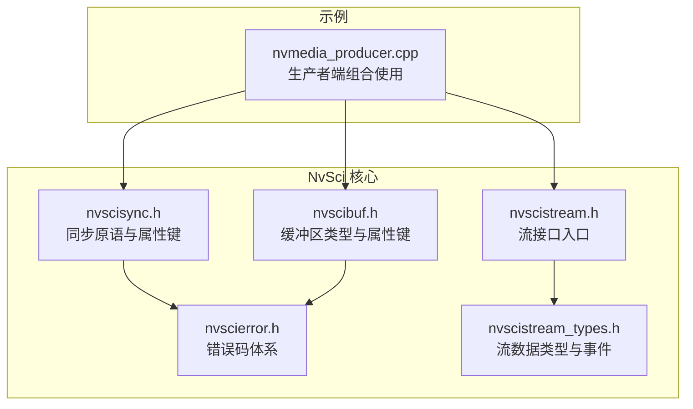
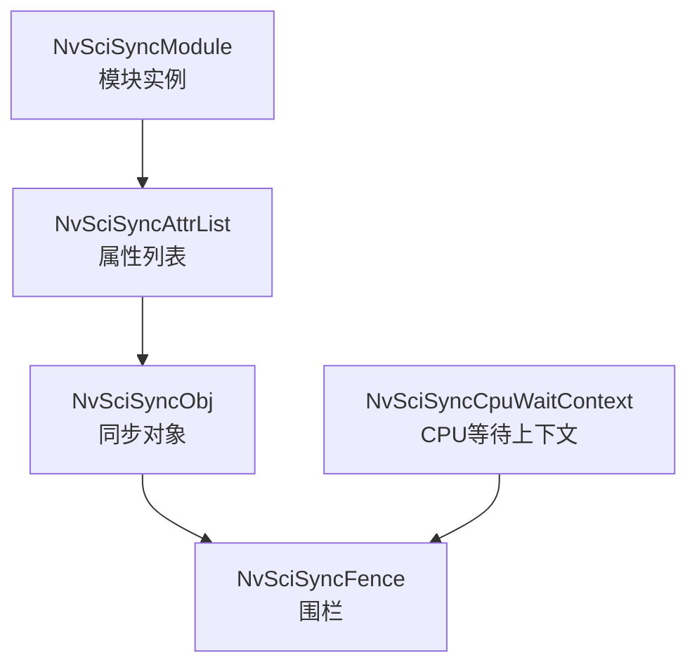
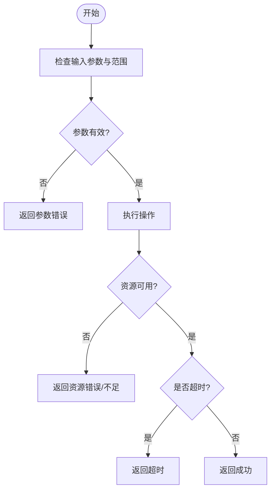
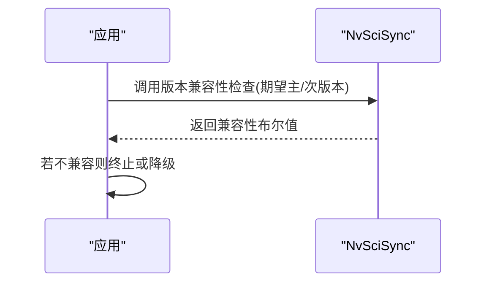
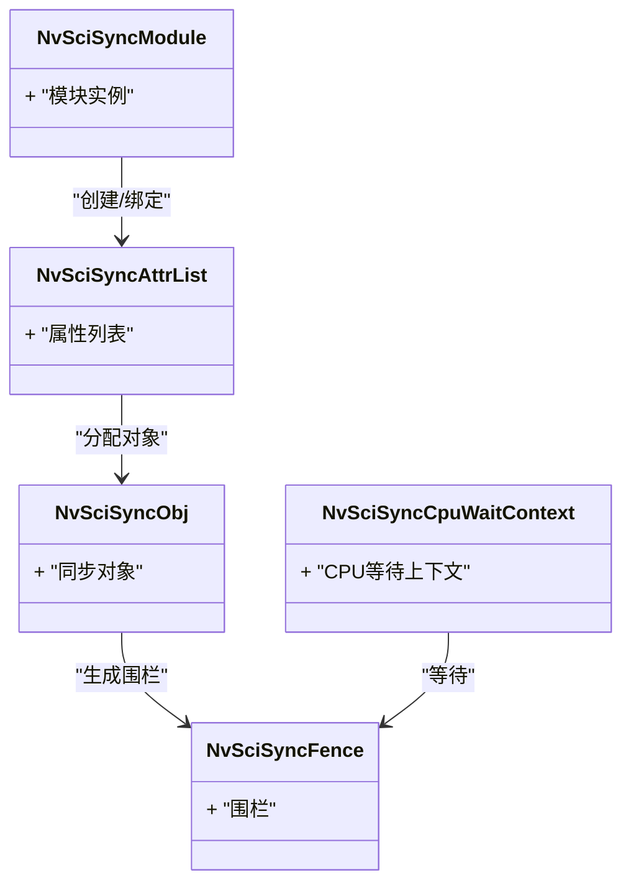
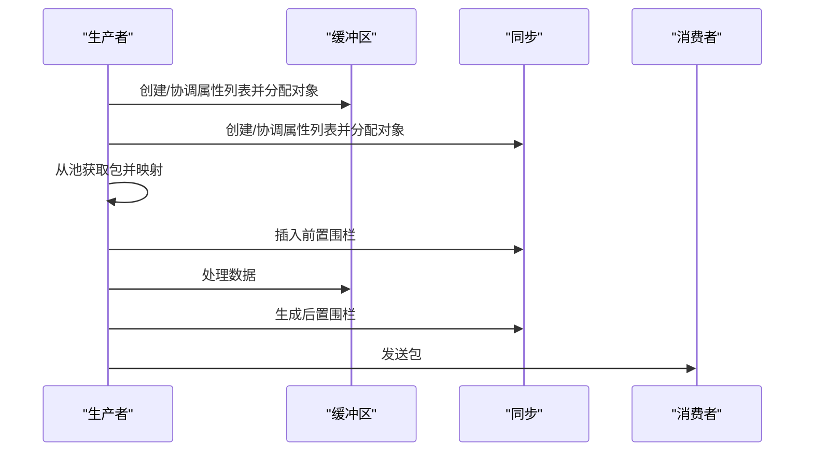
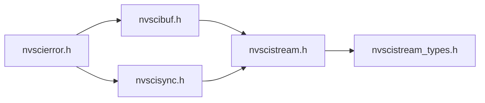

# 核心数据类型与枚举

<cite>
**本文档引用的文件**
- [nvscisync.h](file://driveos-6.0.5.0/usr/include/nvscisync.h)
- [nvscierror.h](file://driveos-6.0.5.0/usr/include/nvscierror.h)
- [nvscibuf.h](file://driveos-6.0.5.0/usr/include/nvscibuf.h)
- [nvscistream_types.h](file://driveos-6.0.5.0/usr/include/nvscistream_types.h)
- [nvscistream.h](file://driveos-6.0.5.0/usr/include/nvscistream.h)
- [nvmedia_producer.cpp](file://driveos-5260/drive-linux/samples/nvsci/nvscistream/multicast/nvmedia_producer.cpp)
</cite>

## 目录
1. [简介](#简介)
2. [项目结构](#项目结构)
3. [核心组件](#核心组件)
4. [架构总览](#架构总览)
5. [详细组件分析](#详细组件分析)
6. [依赖关系分析](#依赖关系分析)
7. [性能考虑](#性能考虑)
8. [故障排查指南](#故障排查指南)
9. [结论](#结论)
10. [附录](#附录)

## 简介
本文件面向NVIDIA NvSci（软件通信接口）核心数据类型与枚举，系统化梳理以下主题：
- 基础数据类型：布尔值、时间戳、句柄与标识符等在NvSci中的表达与使用边界
- 错误状态码体系：按功能域划分的错误分类、典型错误场景与处理建议
- 版本信息结构体与兼容性检查：版本号语义、兼容性判定流程
- NvSciSync相关类型：信号者、等待者、同步对象、围栏（fence）、属性列表等
- 类型转换、边界检查与安全使用最佳实践
- 结合示例展示常见使用场景与调用序列

## 项目结构
围绕NvSci核心头文件与示例代码，关键目录与文件如下：
- 同步与错误处理：nvscisync.h、nvscierror.h
- 缓冲区与流：nvscibuf.h、nvscistream.h、nvscistream_types.h
- 示例：nvmedia_producer.cpp 展示了NvSciSync/NvSciBuf/NvMedia在生产者端的典型组合使用

**图表来源**
- [nvscisync.h:1-120](file://driveos-6.0.5.0/usr/include/nvscisync.h#L1-L120)
- [nvscierror.h:1-120](file://driveos-6.0.5.0/usr/include/nvscierror.h#L1-L120)
- [nvscibuf.h:1-120](file://driveos-6.0.5.0/usr/include/nvscibuf.h#L1-L120)
- [nvscistream.h:1-32](file://driveos-6.0.5.0/usr/include/nvscistream.h#L1-L32)
- [nvscistream_types.h:1-120](file://driveos-6.0.5.0/usr/include/nvscistream_types.h#L1-L120)
- [nvmedia_producer.cpp:1-120](file://driveos-5260/drive-linux/samples/nvsci/nvscistream/multicast/nvmedia_producer.cpp#L1-L120)

**章节来源**
- [nvscisync.h:1-120](file://driveos-6.0.5.0/usr/include/nvscisync.h#L1-L120)
- [nvscierror.h:1-120](file://driveos-6.0.5.0/usr/include/nvscierror.h#L1-L120)
- [nvscibuf.h:1-120](file://driveos-6.0.5.0/usr/include/nvscibuf.h#L1-L120)
- [nvscistream.h:1-32](file://driveos-6.0.5.0/usr/include/nvscistream.h#L1-L32)
- [nvscistream_types.h:1-120](file://driveos-6.0.5.0/usr/include/nvscistream_types.h#L1-L120)
- [nvmedia_producer.cpp:1-120](file://driveos-5260/drive-linux/samples/nvsci/nvscistream/multicast/nvmedia_producer.cpp#L1-L120)

## 核心组件
- 基础类型与枚举
  - 布尔值：C语言布尔类型在NvSci中用于属性开关（如CPU访问、时间戳需求等）
  - 时间戳：微秒级时间戳字段，用于记录围栏触发时刻或任务状态
  - 句柄与标识符：模块句柄、CPU等待上下文、同步对象、围栏、缓冲区对象等
- 错误码体系：按功能域分层（通用、NvSciBuf、NvSciSync、NvSciStream、NvSciIpc、NvSciEvent），覆盖参数错误、资源不足、超时、设备/文件系统/通信错误等
- 版本信息：各库提供主/次版本号，支持版本兼容性检查
- NvSciSync类型族：模块、CPU等待上下文、属性列表、同步对象、围栏、导出描述符、访问权限枚举、任务状态等

**章节来源**
- [nvscisync.h:160-242](file://driveos-6.0.5.0/usr/include/nvscisync.h#L160-L242)
- [nvscierror.h:45-270](file://driveos-6.0.5.0/usr/include/nvscierror.h#L45-L270)
- [nvscibuf.h:140-152](file://driveos-6.0.5.0/usr/include/nvscibuf.h#L140-L152)
- [nvscistream_types.h:77-82](file://driveos-6.0.5.0/usr/include/nvscistream_types.h#L77-L82)

## 架构总览
NvSci通过“模块-属性列表-对象-围栏”的层次化抽象实现跨进程/跨模块的同步与数据交换。生产者通常作为信号者生成围栏并传递给消费者；消费者作为等待者使用CPU等待上下文进行阻塞等待。

**图表来源**
- [nvscisync.h:195-207](file://driveos-6.0.5.0/usr/include/nvscisync.h#L195-L207)
- [nvscisync.h:240-242](file://driveos-6.0.5.0/usr/include/nvscisync.h#L240-L242)
- [nvscisync.h:207-208](file://driveos-6.0.5.0/usr/include/nvscisync.h#L207-L208)

## 详细组件分析

### 基础数据类型与使用规范
- 布尔值
  - 用途：控制是否需要CPU访问、是否要求时间戳、是否启用确定性围栏等
  - 使用要点：在属性列表设置/获取时，确保传入正确的指针与长度，避免空指针与越界
- 时间戳
  - 表达：微秒级时间戳字段，可用于统计延迟或调试
  - 获取：仅在围栏已过期且支持时间戳时有效
- 句柄与标识符
  - 模块句柄：所有对象生命周期受其约束
  - 围栏：需显式清零初始化，避免悬挂引用
  - 对象：分配后需在适当时机释放，防止资源泄漏

**章节来源**
- [nvscisync.h:240-242](file://driveos-6.0.5.0/usr/include/nvscisync.h#L240-L242)
- [nvscisync.h:258-261](file://driveos-6.0.5.0/usr/include/nvscisync.h#L258-L261)
- [nvscisync.h:295-302](file://driveos-6.0.5.0/usr/include/nvscisync.h#L295-L302)

### 错误状态码体系
- 分类与范围
  - 通用错误：参数无效、资源不足、状态不合法、超时等
  - NvSciBuf/NvSciSync/NvSciStream/NvSciIpc/NvSciEvent：各自专用错误码段
- 典型错误与处理
  - 参数错误：检查输入指针、长度与范围，避免空指针与越界
  - 资源不足：适当重试或降级配置
  - 超时：调整等待时间或采用非阻塞策略
  - 设备/文件系统/通信：根据具体错误码采取恢复或回退策略

**图表来源**
- [nvscierror.h:45-270](file://driveos-6.0.5.0/usr/include/nvscierror.h#L45-L270)

**章节来源**
- [nvscierror.h:45-270](file://driveos-6.0.5.0/usr/include/nvscierror.h#L45-L270)

### 版本信息结构体与兼容性检查
- 版本号语义
  - 主版本：破坏性变更时递增，同时次版本清零
  - 次版本：向后兼容的功能增强时递增
- 兼容性检查
  - 提供版本兼容性检查函数，比较编译期期望版本与运行期库版本
  - 返回布尔结果，指导应用决定是否继续运行

**图表来源**
- [nvscisync.h:2794-2802](file://driveos-6.0.5.0/usr/include/nvscisync.h#L2794-L2802)

**章节来源**
- [nvscisync.h:2794-2802](file://driveos-6.0.5.0/usr/include/nvscisync.h#L2794-L2802)

### NvSciSync：客户端类型与对象类型枚举
- 客户端角色
  - 信号者（Signaler）：负责推进同步点并生成围栏
  - 等待者（Waiter）：在同步点上等待并消费围栏
- 访问权限枚举
  - 等待权限、信号权限、等待+信号权限、自动权限等
- 同步对象与围栏
  - 同步对象承载属性列表与底层原语
  - 围栏携带目标同步点的标识与值，支持时间戳与任务状态槽位

**图表来源**
- [nvscisync.h:195-208](file://driveos-6.0.5.0/usr/include/nvscisync.h#L195-L208)
- [nvscisync.h:240-242](file://driveos-6.0.5.0/usr/include/nvscisync.h#L240-L242)
- [nvscisync.h:207-208](file://driveos-6.0.5.0/usr/include/nvscisync.h#L207-L208)

**章节来源**
- [nvscisync.h:321-344](file://driveos-6.0.5.0/usr/include/nvscisync.h#L321-L344)
- [nvscisync.h:357-365](file://driveos-6.0.5.0/usr/include/nvscisync.h#L357-L365)
- [nvscisync.h:240-242](file://driveos-6.0.5.0/usr/include/nvscisync.h#L240-L242)

### NvSciBuf：数据类型与属性键
- 数据类型
  - 通用、原始缓冲、图像、张量、数组、金字塔等
- 属性键
  - 通用属性（CPU访问、权限、GPU缓存、压缩等）
  - 各类型特定属性（如图像布局、尺寸、对齐等）

**章节来源**
- [nvscibuf.h:115-127](file://driveos-6.0.5.0/usr/include/nvscibuf.h#L115-L127)
- [nvscibuf.h:375-413](file://driveos-6.0.5.0/usr/include/nvscibuf.h#L375-L413)

### NvSciStream：数据类型与事件
- 数据类型
  - 主/次版本号、块句柄、包句柄、包Cookie等
- 事件类型
  - 连接、断开、元素、包创建/完成/删除、状态、错误等

**章节来源**
- [nvscistream_types.h:77-82](file://driveos-6.0.5.0/usr/include/nvscistream_types.h#L77-L82)
- [nvscistream_types.h:175-182](file://driveos-6.0.5.0/usr/include/nvscistream_types.h#L175-L182)
- [nvscistream_types.h:356-498](file://driveos-6.0.5.0/usr/include/nvscistream_types.h#L356-L498)

### 常见使用场景与调用序列
- 生产者端典型流程
  - 创建缓冲区属性列表并协调，分配缓冲区对象
  - 创建信号者/等待者属性列表并协调，分配同步对象
  - 从池获取包，映射缓冲区与同步对象
  - 插入前置围栏，处理数据，生成后置围栏
  - 发送包并清理围栏

**图表来源**
- [nvmedia_producer.cpp:306-363](file://driveos-5260/drive-linux/samples/nvsci/nvscistream/multicast/nvmedia_producer.cpp#L306-L363)

**章节来源**
- [nvmedia_producer.cpp:62-108](file://driveos-5260/drive-linux/samples/nvsci/nvscistream/multicast/nvmedia_producer.cpp#L62-L108)
- [nvmedia_producer.cpp:159-170](file://driveos-5260/drive-linux/samples/nvsci/nvscistream/multicast/nvmedia_producer.cpp#L159-L170)
- [nvmedia_producer.cpp:223-231](file://driveos-5260/drive-linux/samples/nvsci/nvscistream/multicast/nvmedia_producer.cpp#L223-L231)
- [nvmedia_producer.cpp:306-363](file://driveos-5260/drive-linux/samples/nvsci/nvscistream/multicast/nvmedia_producer.cpp#L306-L363)

## 依赖关系分析
- 组件耦合
  - 同步模块贯穿属性列表、对象与围栏的生命周期
  - 错误码为所有NvSci子系统共享的统一错误语义
  - 流接口依赖缓冲区与同步能力
- 外部依赖
  - IPC通道用于跨进程传输属性列表、对象与围栏描述符
  - GPU/CPU缓存一致性与压缩策略由平台驱动决定

**图表来源**
- [nvscierror.h:1-120](file://driveos-6.0.5.0/usr/include/nvscierror.h#L1-L120)
- [nvscisync.h:1-120](file://driveos-6.0.5.0/usr/include/nvscisync.h#L1-L120)
- [nvscibuf.h:1-120](file://driveos-6.0.5.0/usr/include/nvscibuf.h#L1-L120)
- [nvscistream.h:1-32](file://driveos-6.0.5.0/usr/include/nvscistream.h#L1-L32)
- [nvscistream_types.h:1-120](file://driveos-6.0.5.0/usr/include/nvscistream_types.h#L1-L120)

**章节来源**
- [nvscierror.h:1-120](file://driveos-6.0.5.0/usr/include/nvscierror.h#L1-L120)
- [nvscisync.h:1-120](file://driveos-6.0.5.0/usr/include/nvscisync.h#L1-L120)
- [nvscibuf.h:1-120](file://driveos-6.0.5.0/usr/include/nvscibuf.h#L1-L120)
- [nvscistream.h:1-32](file://driveos-6.0.5.0/usr/include/nvscistream.h#L1-L32)
- [nvscistream_types.h:1-120](file://driveos-6.0.5.0/usr/include/nvscistream_types.h#L1-L120)

## 性能考虑
- 围栏等待
  - 合理设置超时，避免无限等待导致线程阻塞
  - 使用CPU等待上下文进行同步，注意并发与竞态条件
- 缓冲区与缓存
  - 在多GPU/多引擎场景下，合理配置缓存一致性与压缩策略
  - 避免不必要的CPU/GPU缓存维护操作
- IPC传输
  - 尽量复用导出描述符，减少重复序列化/反序列化成本

## 故障排查指南
- 常见错误定位
  - 参数错误：检查指针有效性、长度与范围
  - 资源错误：确认内存与系统资源可用性
  - 超时：评估等待策略与系统负载
- 日志与诊断
  - 利用事件回调与日志输出定位阶段问题
  - 在属性协调失败时，检查冲突属性列表以定位矛盾项

**章节来源**
- [nvscierror.h:45-270](file://driveos-6.0.5.0/usr/include/nvscierror.h#L45-L270)
- [nvmedia_producer.cpp:256-302](file://driveos-5260/drive-linux/samples/nvsci/nvscistream/multicast/nvmedia_producer.cpp#L256-L302)

## 结论
NvSci通过清晰的类型体系与严格的错误码管理，为跨进程/跨模块的同步与数据交换提供了可靠基础。遵循本文档的类型使用规范、边界检查与安全实践，可显著提升系统的稳定性与可维护性。结合示例代码的调用序列，有助于快速掌握典型场景的实现路径。

## 附录
- 类型定义示例（以路径代替代码片段）
  - [NvSciSyncFence 定义:240-242](file://driveos-6.0.5.0/usr/include/nvscisync.h#L240-L242)
  - [NvSciSyncAccessPerm 枚举:321-344](file://driveos-6.0.5.0/usr/include/nvscisync.h#L321-L344)
  - [NvSciSyncTaskStatusVal 枚举:357-365](file://driveos-6.0.5.0/usr/include/nvscisync.h#L357-L365)
  - [NvSciError 错误码范围:45-270](file://driveos-6.0.5.0/usr/include/nvscierror.h#L45-L270)
  - [NvSciBufType 类型枚举:115-127](file://driveos-6.0.5.0/usr/include/nvscibuf.h#L115-L127)
  - [NvSciStream 主/次版本号:77-82](file://driveos-6.0.5.0/usr/include/nvscistream_types.h#L77-L82)