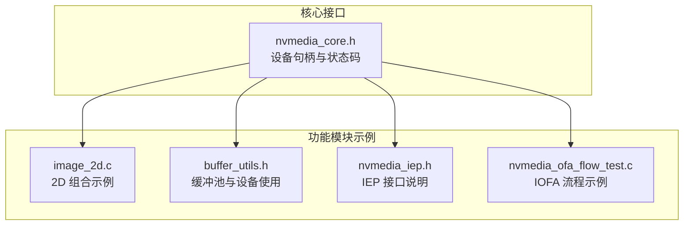
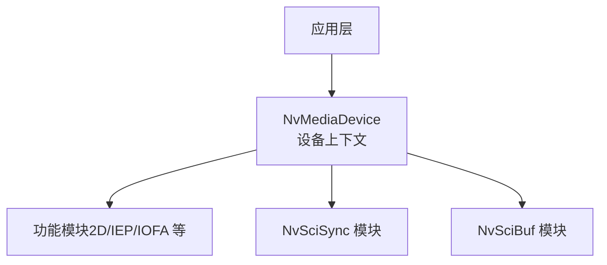
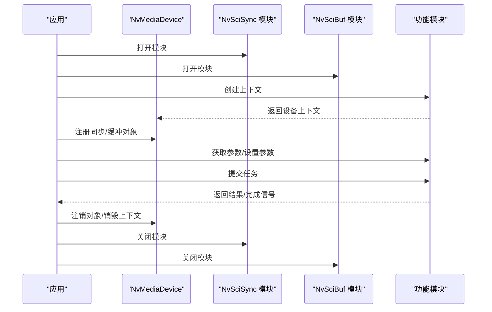
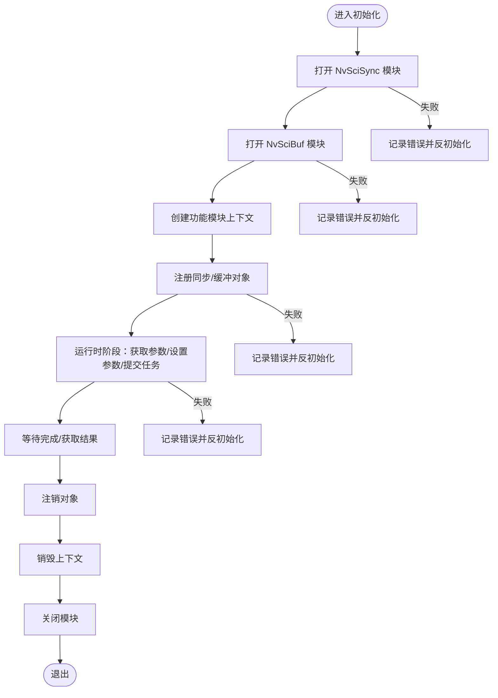
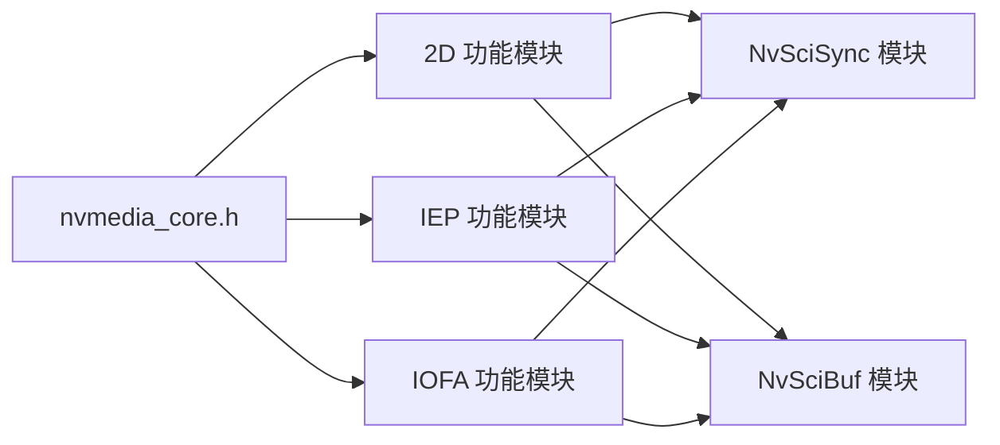

# 设备管理与生命周期

<cite>
**本文引用的文件**
- [nvmedia_core.h（6.0.5）](file://driveos-6.0.5.0/drive-linux/include/nvmedia_6x/nvmedia_core.h)
- [nvmedia_core.h（6.0.6）](file://driveos-6.0.6.0/drive-linux/include/nvmedia_6x/nvmedia_core.h)
- [nvmedia_core.h（60100）](file://driveos-6081/drive-linux/include/nvmedia_6x/nvmedia_core.h)
- [image_2d.c（6.0.5 示例）](file://driveos-6.0.5.0/drive-linux/samples/nvmedia/img_2d/image_2d.c)
- [buffer_utils.h（6.0.5 示例）](file://driveos-6.0.5.0/drive-linux/samples/nvmedia/utils/buffer_utils.h)
- [nvmedia_iep.h（6081 头文件）](file://driveos-6081/drive-linux/include/nvmedia_6x/nvmedia_iep.h)
- [nvmedia_ofa_flow_test.c（6.0.6 示例）](file://driveos-6.0.6.0/drive-linux/samples/nvmedia_6x/iofa/flow/nvmedia_ofa_flow_test.c)
</cite>

## 目录
1. [引言](#引言)
2. [项目结构](#项目结构)
3. [核心组件](#核心组件)
4. [架构总览](#架构总览)
5. [详细组件分析](#详细组件分析)
6. [依赖关系分析](#依赖关系分析)
7. [性能考量](#性能考量)
8. [故障排查指南](#故障排查指南)
9. [结论](#结论)
10. [附录](#附录)

## 引言
本文件围绕 NvMedia 的设备管理与生命周期展开，聚焦于 NvMediaDevice 对象的设计理念、创建/初始化/销毁流程、资源分配与硬件检测、配置验证、句柄生命周期管理（引用计数、状态跟踪、异常处理）、初始化参数配置与性能优化、故障检测与恢复、错误诊断、多设备并发访问控制与资源隔离策略，并总结最佳实践与常见陷阱。

## 项目结构
NvMedia 在不同版本中通过统一的核心头文件暴露设备句柄类型与通用状态码，同时在各功能模块（如 2D、IEP、IOFA 等）中以“先创建设备上下文，再注册同步/缓冲对象，最后执行运行时操作”的范式组织生命周期。示例程序展示了典型的初始化、运行时与反初始化阶段的调用顺序与资源释放路径。

**图表来源**
- [nvmedia_core.h（6.0.5）:239-256](file://driveos-6.0.5.0/drive-linux/include/nvmedia_6x/nvmedia_core.h#L239-L256)
- [image_2d.c（6.0.5 示例）:172-492](file://driveos-6.0.5.0/drive-linux/samples/nvmedia/img_2d/image_2d.c#L172-L492)
- [buffer_utils.h（6.0.5 示例）:52-74](file://driveos-6.0.5.0/drive-linux/samples/nvmedia/utils/buffer_utils.h#L52-L74)
- [nvmedia_iep.h（6081 头文件）:284-433](file://driveos-6081/drive-linux/include/nvmedia_6x/nvmedia_iep.h#L284-L433)
- [nvmedia_ofa_flow_test.c（6.0.6 示例）:1845-1935](file://driveos-6.0.6.0/drive-linux/samples/nvmedia_6x/iofa/flow/nvmedia_ofa_flow_test.c#L1845-L1935)

**章节来源**
- [nvmedia_core.h（6.0.5）:239-256](file://driveos-6.0.5.0/drive-linux/include/nvmedia_6x/nvmedia_core.h#L239-L256)
- [image_2d.c（6.0.5 示例）:172-492](file://driveos-6.0.5.0/drive-linux/samples/nvmedia/img_2d/image_2d.c#L172-L492)
- [buffer_utils.h（6.0.5 示例）:52-74](file://driveos-6.0.5.0/drive-linux/samples/nvmedia/utils/buffer_utils.h#L52-L74)
- [nvmedia_iep.h（6081 头文件）:284-433](file://driveos-6081/drive-linux/include/nvmedia_6x/nvmedia_iep.h#L284-L433)
- [nvmedia_ofa_flow_test.c（6.0.6 示例）:1845-1935](file://driveos-6.0.6.0/drive-linux/samples/nvmedia_6x/iofa/flow/nvmedia_ofa_flow_test.c#L1845-L1935)

## 核心组件
- 设备句柄类型：NvMediaDevice 是一个不透明指针类型，作为所有 NvMedia 对象的根，用于创建其他对象并贯穿其生命周期。
- 状态码体系：提供统一的状态返回值，覆盖成功、参数错误、未初始化、不支持、内存不足、超时、无效状态等，便于上层进行一致性的错误处理与恢复决策。
- 生命周期阶段：典型流程包括初始化阶段（打开模块、创建上下文、注册同步/缓冲对象）、运行时阶段（获取参数、设置输入输出、提交任务、等待完成）、反初始化阶段（注销对象、释放资源、销毁上下文）。

**章节来源**
- [nvmedia_core.h（6.0.5）:251-254](file://driveos-6.0.5.0/drive-linux/include/nvmedia_6x/nvmedia_core.h#L251-L254)
- [nvmedia_core.h（6.0.6）:251-254](file://driveos-6.0.6.0/drive-linux/include/nvmedia_6x/nvmedia_core.h#L251-L254)
- [nvmedia_core.h（60100）:251-254](file://driveos-6081/drive-linux/include/nvmedia_6x/nvmedia_core.h#L251-L254)
- [image_2d.c（6.0.5 示例）:172-492](file://driveos-6.0.5.0/drive-linux/samples/nvmedia/img_2d/image_2d.c#L172-L492)

## 架构总览
NvMedia 的设备管理以“设备上下文”为中心，围绕该上下文进行对象注册与运行时操作。下图展示了从应用到 NvMedia 核心与具体功能模块之间的交互关系。

**图表来源**
- [image_2d.c（6.0.5 示例）:172-232](file://driveos-6.0.5.0/drive-linux/samples/nvmedia/img_2d/image_2d.c#L172-L232)
- [nvmedia_iep.h（6081 头文件）:284-433](file://driveos-6081/drive-linux/include/nvmedia_6x/nvmedia_iep.h#L284-L433)

## 详细组件分析

### NvMediaDevice 对象与生命周期
- 设计理念
  - NvMediaDevice 作为根句柄，承载设备级资源与上下文，是创建其他对象（图像、缓冲、同步对象等）的入口。
  - 通过模块化接口（NvSciSync/NvSciBuf）与功能模块（2D/IEP/IOFA 等）解耦，提升可维护性与扩展性。
- 生命周期阶段
  - 初始化阶段：打开 NvSciSync/NvSciBuf 模块，创建功能模块上下文，注册同步/缓冲对象。
  - 运行时阶段：获取参数对象，设置输入/输出缓冲与几何/滤波/混合等参数，提交任务并等待完成。
  - 反初始化阶段：注销对象、释放缓冲/同步对象、销毁上下文、关闭模块。
- 资源分配与硬件检测
  - 示例程序展示了模块打开失败时的错误处理路径；运行时阶段通过参数校验与对象注册确保硬件资源可用。
- 配置验证
  - 参数解析与有效性检查贯穿配置文件解析与运行时参数设置阶段，确保输入格式与范围正确。

**图表来源**
- [image_2d.c（6.0.5 示例）:172-492](file://driveos-6.0.5.0/drive-linux/samples/nvmedia/img_2d/image_2d.c#L172-L492)

**章节来源**
- [image_2d.c（6.0.5 示例）:172-492](file://driveos-6.0.5.0/drive-linux/samples/nvmedia/img_2d/image_2d.c#L172-L492)

### 设备句柄生命周期管理（引用计数、状态跟踪、异常处理）
- 引用计数与状态跟踪
  - 通过统一的状态码体系（如 OK、BAD_PARAMETER、NOT_INITIALIZED、INVALID_STATE、ERROR 等）对设备与对象状态进行跟踪与断言。
  - 在对象创建/销毁前后进行状态检查，避免重复释放或非法使用。
- 异常处理
  - 模块打开失败、对象注册失败、运行时提交失败均在示例中体现为错误日志与早退路径，确保资源不会泄漏。
  - 反初始化阶段按逆序释放对象与模块，保证清理完整性。

**图表来源**
- [image_2d.c（6.0.5 示例）:172-492](file://driveos-6.0.5.0/drive-linux/samples/nvmedia/img_2d/image_2d.c#L172-L492)

**章节来源**
- [image_2d.c（6.0.5 示例）:172-492](file://driveos-6.0.5.0/drive-linux/samples/nvmedia/img_2d/image_2d.c#L172-L492)

### 设备初始化参数配置与性能优化
- 参数配置
  - 通过配置文件解析与参数对象设置，将输入/输出表面属性、几何参数、滤波与混合模式等传递给功能模块。
  - 示例中展示了颜色格式、扫描类型、平面布局、裁剪矩形、变换与滤波等参数的设置流程。
- 性能优化
  - 使用 NvSciBuf/NvSciSync 实现跨组件零拷贝与同步，减少 CPU 干预。
  - 合理设置缓冲队列容量与超时，避免阻塞与饥饿。
  - 在多线程场景中，确保每个线程使用独立的上下文句柄，避免共享状态带来的竞争。

**章节来源**
- [image_2d.c（6.0.5 示例）:107-134](file://driveos-6.0.5.0/drive-linux/samples/nvmedia/img_2d/image_2d.c#L107-L134)
- [buffer_utils.h（6.0.5 示例）:22-38](file://driveos-6.0.5.0/drive-linux/samples/nvmedia/utils/buffer_utils.h#L22-L38)

### 故障检测、恢复机制与错误诊断
- 故障检测
  - 在模块打开、对象注册、运行时提交等关键步骤进行状态检查与错误码判断。
  - 通过日志输出错误码与阶段信息，辅助定位问题。
- 恢复机制
  - 发生错误时，按逆序执行反初始化流程，确保资源回收。
  - 对于同步/缓冲对象，优先注销再释放，避免悬挂引用。
- 错误诊断
  - 使用统一状态码体系，结合日志与返回值，快速识别“参数错误/未初始化/不支持/无效状态/内存不足/超时/错误”等场景。

**章节来源**
- [image_2d.c（6.0.5 示例）:180-232](file://driveos-6.0.5.0/drive-linux/samples/nvmedia/img_2d/image_2d.c#L180-L232)
- [nvmedia_ofa_flow_test.c（6.0.6 示例）:1845-1935](file://driveos-6.0.6.0/drive-linux/samples/nvmedia_6x/iofa/flow/nvmedia_ofa_flow_test.c#L1845-L1935)

### 多设备环境下的并发访问控制与资源隔离
- 并发访问控制
  - 每个线程应使用独立的功能模块上下文句柄，避免跨线程共享同一上下文导致的竞争与状态混乱。
  - 在多设备场景中，建议为每个设备维护独立的模块句柄与对象注册集合，降低相互影响。
- 资源隔离策略
  - 将缓冲与同步对象限定在对应设备上下文中，避免跨设备误用。
  - 在销毁阶段严格遵循注销-释放-销毁-关闭的顺序，防止资源泄露与竞态。

**章节来源**
- [image_2d.c（6.0.5 示例）:198-205](file://driveos-6.0.5.0/drive-linux/samples/nvmedia/img_2d/image_2d.c#L198-L205)
- [nvmedia_iep.h（6081 头文件）:811-840](file://driveos-6081/drive-linux/include/nvmedia_6x/nvmedia_iep.h#L811-L840)

## 依赖关系分析
- 设备与模块
  - 设备上下文依赖 NvSciSync/NvSciBuf 模块提供的同步与缓冲能力。
- 设备与功能模块
  - 功能模块（2D/IEP/IOFA 等）通过设备上下文进行对象注册与运行时操作。
- 示例与核心
  - 示例程序严格遵循“打开模块—创建上下文—注册对象—运行时—注销—销毁—关闭模块”的依赖链路。

**图表来源**
- [nvmedia_core.h（6.0.5）:239-256](file://driveos-6.0.5.0/drive-linux/include/nvmedia_6x/nvmedia_core.h#L239-L256)
- [image_2d.c（6.0.5 示例）:172-232](file://driveos-6.0.5.0/drive-linux/samples/nvmedia/img_2d/image_2d.c#L172-L232)
- [nvmedia_iep.h（6081 头文件）:284-433](file://driveos-6081/drive-linux/include/nvmedia_6x/nvmedia_iep.h#L284-L433)

**章节来源**
- [nvmedia_core.h（6.0.5）:239-256](file://driveos-6.0.5.0/drive-linux/include/nvmedia_6x/nvmedia_core.h#L239-L256)
- [image_2d.c（6.0.5 示例）:172-232](file://driveos-6.0.5.0/drive-linux/samples/nvmedia/img_2d/image_2d.c#L172-L232)
- [nvmedia_iep.h（6081 头文件）:284-433](file://driveos-6081/drive-linux/include/nvmedia_6x/nvmedia_iep.h#L284-L433)

## 性能考量
- 同步与缓冲
  - 使用 NvSciBuf/NvSciSync 实现零拷贝与高效同步，减少 CPU 开销与数据复制。
- 缓冲池
  - 合理设置缓冲池容量与超时，避免过度阻塞或频繁分配释放。
- 多线程
  - 每线程独立上下文，避免锁竞争；必要时采用信号量/条件变量协调资源占用。
- 参数优化
  - 输入输出尺寸、滤波与混合模式的选择需平衡质量与吞吐；在高负载场景下优先选择更高效的参数组合。

[本节为通用指导，无需特定文件引用]

## 故障排查指南
- 常见错误与定位
  - BAD_PARAMETER：检查参数范围与类型；确认配置文件解析无误。
  - NOT_INITIALIZED：确认模块已打开且上下文已创建。
  - INVALID_STATE：检查调用顺序是否符合“注册—运行—注销—销毁”的规范。
  - ERROR：查看具体模块返回值与日志，定位失败环节。
- 快速修复步骤
  - 回溯到最近一次成功的状态点，逐步重放初始化流程。
  - 在对象注册后立即进行最小化运行时测试，尽早暴露问题。
  - 在销毁阶段打印每一步的返回值，确保无遗漏。

**章节来源**
- [image_2d.c（6.0.5 示例）:180-232](file://driveos-6.0.5.0/drive-linux/samples/nvmedia/img_2d/image_2d.c#L180-L232)
- [nvmedia_ofa_flow_test.c（6.0.6 示例）:1845-1935](file://driveos-6.0.6.0/drive-linux/samples/nvmedia_6x/iofa/flow/nvmedia_ofa_flow_test.c#L1845-L1935)

## 结论
NvMedia 的设备管理以 NvMediaDevice 为核心，通过模块化接口与严格的生命周期管理，实现了对硬件资源的高效利用与稳定控制。遵循“打开模块—创建上下文—注册对象—运行时—注销—销毁—关闭模块”的流程，配合统一的状态码体系与示例程序的错误处理范式，可在多设备与多线程环境下实现可靠的并发访问与资源隔离。

[本节为总结，无需特定文件引用]

## 附录
- 最佳实践
  - 严格遵循生命周期顺序，避免跳过任何阶段。
  - 在多线程环境中为每个线程/设备准备独立上下文与对象集合。
  - 使用缓冲池与同步/缓冲对象时，合理设置容量与超时，避免阻塞。
  - 在生产环境中增加日志与监控，及时发现并定位异常。
- 常见陷阱
  - 忘记注销对象直接销毁上下文，导致悬挂引用与资源泄露。
  - 在多线程中共享同一上下文，引发状态竞争与不可预期行为。
  - 忽视模块打开失败的处理，导致后续步骤异常。

[本节为通用指导，无需特定文件引用]