# NvSIPL 传感器接口层

<cite>
**本文引用的文件**
- [NvSIPLCamera.hpp](file://driveos-6.0.5.0/drive-linux/include/NvSIPLCamera.hpp)
- [NvSIPLCommon.hpp](file://driveos-6.0.5.0/drive-linux/include/NvSIPLCommon.hpp)
- [NvSIPLQuery.hpp](file://driveos-6.0.5.0/drive-linux/include/NvSIPLQuery.hpp)
- [NvSIPLPlatformCfg.hpp](file://driveos-6.0.5.0/drive-linux/include/NvSIPLPlatformCfg.hpp)
- [NvSIPLDeviceBlockInfo.hpp](file://driveos-6.0.5.0/drive-linux/include/NvSIPLDeviceBlockInfo.hpp)
- [NvSIPLPipelineMgr.hpp](file://driveos-6.0.5.0/drive-linux/include/NvSIPLPipelineMgr.hpp)
- [NvSIPLClient.hpp](file://driveos-6.0.5.0/drive-linux/include/NvSIPLClient.hpp)
- [INvSIPLDeviceInterfaceProvider.hpp](file://driveos-6.0.5.0/drive-linux/include/INvSIPLDeviceInterfaceProvider.hpp)
- [INvSiplControlAuto.hpp](file://driveos-6.0.5.0/drive-linux/include/INvSiplControlAuto.hpp)
- [NvSiplControlAutoDef.hpp](file://driveos-6.0.5.0/drive-linux/include/NvSiplControlAutoDef.hpp)
- [NvSIPLISPStat.hpp](file://driveos-6081/drive-linux/include/NvSIPLISPStat.hpp)
</cite>

## 目录
1. [简介](#简介)
2. [项目结构](#项目结构)
3. [核心组件](#核心组件)
4. [架构总览](#架构总览)
5. [详细组件分析](#详细组件分析)
6. [依赖关系分析](#依赖关系分析)
7. [性能考虑](#性能考虑)
8. [故障排查指南](#故障排查指南)
9. [结论](#结论)
10. [附录](#附录)

## 简介
NvSIPL 是 NVIDIA 针对 DRIVE OS 的传感器接口与管道库，提供统一抽象以采集图像传感器输出，并可选地进行图像处理。其核心目标是简化多传感器平台（如 GMSL/CSI）下的设备配置、管道构建、帧交付与事件通知，同时提供自动控制（AE/AWB）插件化扩展能力。本文档围绕以下主题展开：设计理念与架构、核心数据结构（NvSiplRect、NvSiplPoint、NvSiplGlobalTime 等）、错误处理机制（SIPLStatus 枚举与错误码）、设备与管道管理、查询接口、NvSIPLCamera 使用示例、设备驱动接口规范与平台配置说明、时间基选择（PTP 时钟、内核单调时钟、用户自定义时钟）及最佳实践。

## 项目结构
本仓库中与 NvSIPL 相关的关键头文件位于 driveos-6.0.5.0/drive-linux/include 下，涵盖公共数据结构、查询接口、平台配置、设备块信息、管道管理、客户端接口、设备接口提供器以及自动控制接口与定义。下图给出与 NvSIPL 核心相关的文件组织关系与职责划分：

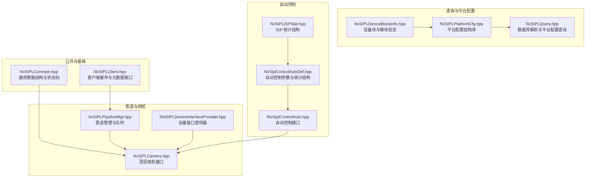

图表来源
- [NvSIPLCommon.hpp:1-219](file://driveos-6.0.5.0/drive-linux/include/NvSIPLCommon.hpp#L1-219)
- [NvSIPLClient.hpp:1-368](file://driveos-6.0.5.0/drive-linux/include/NvSIPLClient.hpp#L1-368)
- [NvSIPLQuery.hpp:1-290](file://driveos-6.0.5.0/drive-linux/include/NvSIPLQuery.hpp#L1-290)
- [NvSIPLPlatformCfg.hpp:1-72](file://driveos-6.0.5.0/drive-linux/include/NvSIPLPlatformCfg.hpp#L1-72)
- [NvSIPLDeviceBlockInfo.hpp:1-352](file://driveos-6.0.5.0/drive-linux/include/NvSIPLDeviceBlockInfo.hpp#L1-352)
- [NvSIPLPipelineMgr.hpp:1-505](file://driveos-6.0.5.0/drive-linux/include/NvSIPLPipelineMgr.hpp#L1-505)
- [NvSIPLCamera.hpp:1-1130](file://driveos-6.0.5.0/drive-linux/include/NvSIPLCamera.hpp#L1-1130)
- [INvSIPLDeviceInterfaceProvider.hpp:1-155](file://driveos-6.0.5.0/drive-linux/include/INvSIPLDeviceInterfaceProvider.hpp#L1-155)
- [INvSiplControlAuto.hpp:1-179](file://driveos-6.0.5.0/drive-linux/include/INvSiplControlAuto.hpp#L1-179)
- [NvSiplControlAutoDef.hpp:1-323](file://driveos-6.0.5.0/drive-linux/include/NvSiplControlAutoDef.hpp#L1-323)
- [NvSIPLISPStat.hpp:1-603](file://driveos-6081/drive-linux/include/NvSIPLISPStat.hpp#L1-603)

章节来源
- [NvSIPLCommon.hpp:1-219](file://driveos-6.0.5.0/drive-linux/include/NvSIPLCommon.hpp#L1-L219)
- [NvSIPLQuery.hpp:1-290](file://driveos-6.0.5.0/drive-linux/include/NvSIPLQuery.hpp#L1-L290)
- [NvSIPLPlatformCfg.hpp:1-72](file://driveos-6.0.5.0/drive-linux/include/NvSIPLPlatformCfg.hpp#L1-L72)
- [NvSIPLDeviceBlockInfo.hpp:1-352](file://driveos-6.0.5.0/drive-linux/include/NvSIPLDeviceBlockInfo.hpp#L1-L352)
- [NvSIPLPipelineMgr.hpp:1-505](file://driveos-6.0.5.0/drive-linux/include/NvSIPLPipelineMgr.hpp#L1-L505)
- [NvSIPLCamera.hpp:1-1130](file://driveos-6.0.5.0/drive-linux/include/NvSIPLCamera.hpp#L1-L1130)
- [INvSIPLDeviceInterfaceProvider.hpp:1-155](file://driveos-6.0.5.0/drive-linux/include/INvSIPLDeviceInterfaceProvider.hpp#L1-L155)
- [INvSiplControlAuto.hpp:1-179](file://driveos-6.0.5.0/drive-linux/include/INvSiplControlAuto.hpp#L1-L179)
- [NvSiplControlAutoDef.hpp:1-323](file://driveos-6.0.5.0/drive-linux/include/NvSiplControlAutoDef.hpp#L1-L323)
- [NvSIPLISPStat.hpp:1-603](file://driveos-6081/drive-linux/include/NvSIPLISPStat.hpp#L1-L603)

## 核心组件
- 公共数据结构与状态码：提供 NvSiplRect、NvSiplPoint、NvSiplGlobalTime、NvSiplTimeBase、SIPLStatus、GPIO 事件与错误详情等通用类型，支撑上层接口与底层驱动交互。
- 查询接口 INvSIPLQuery：解析内置数据库与用户 JSON，提供设备清单与平台配置列表，支持掩码应用以启用特定链路。
- 平台配置与设备块信息：描述平台名称、配置名、设备块数量与数组、每个设备块的 CSI 接口、物理模式、I2C 总线、序列化器/反序列化器/传感器/EEPROM 信息、GPIO 映射、长线缆支持、复位策略等。
- 管理与客户端接口：管道管理器负责事件通知、完成队列、设备块通知队列；客户端接口提供缓冲抽象、元数据与嵌入式数据访问。
- 设备接口提供器：通过 UUID 机制暴露设备特定接口，供客户端在运行时安全获取与调用。
- 自动控制接口与定义：定义 AE/AWB 插件接口、输入输出参数、ISP 统计结构与覆盖设置，支持自定义插件扩展。
- 顶层相机接口 INvSIPLCamera：提供平台配置设置、管道配置、图像注册、启动/停止/去初始化、错误查询、NvSci 同步对象注册、NITO 元数据解析等完整生命周期管理。

章节来源
- [NvSIPLCommon.hpp:1-219](file://driveos-6.0.5.0/drive-linux/include/NvSIPLCommon.hpp#L1-L219)
- [NvSIPLQuery.hpp:1-290](file://driveos-6.0.5.0/drive-linux/include/NvSIPLQuery.hpp#L1-L290)
- [NvSIPLPlatformCfg.hpp:1-72](file://driveos-6.0.5.0/drive-linux/include/NvSIPLPlatformCfg.hpp#L1-L72)
- [NvSIPLDeviceBlockInfo.hpp:1-352](file://driveos-6.0.5.0/drive-linux/include/NvSIPLDeviceBlockInfo.hpp#L1-L352)
- [NvSIPLPipelineMgr.hpp:1-505](file://driveos-6.0.5.0/drive-linux/include/NvSIPLPipelineMgr.hpp#L1-L505)
- [NvSIPLClient.hpp:1-368](file://driveos-6.0.5.0/drive-linux/include/NvSIPLClient.hpp#L1-L368)
- [INvSIPLDeviceInterfaceProvider.hpp:1-155](file://driveos-6.0.5.0/drive-linux/include/INvSIPLDeviceInterfaceProvider.hpp#L1-L155)
- [INvSiplControlAuto.hpp:1-179](file://driveos-6.0.5.0/drive-linux/include/INvSiplControlAuto.hpp#L1-L179)
- [NvSiplControlAutoDef.hpp:1-323](file://driveos-6.0.5.0/drive-linux/include/NvSiplControlAutoDef.hpp#L1-L323)
- [NvSIPLCamera.hpp:1-1130](file://driveos-6.0.5.0/drive-linux/include/NvSIPLCamera.hpp#L1-L1130)

## 架构总览
NvSIPL 将“设备层”（反序列化器、序列化器、传感器、EEPROM）与“软件层”（查询、平台配置、管道管理、客户端）解耦。顶层相机接口协调平台配置与管道配置，驱动硬件完成图像采集与处理，并通过队列向客户端交付完成帧与事件通知。自动控制插件可按需接入，基于 ISP 统计与嵌入式数据生成新的传感器控制参数。

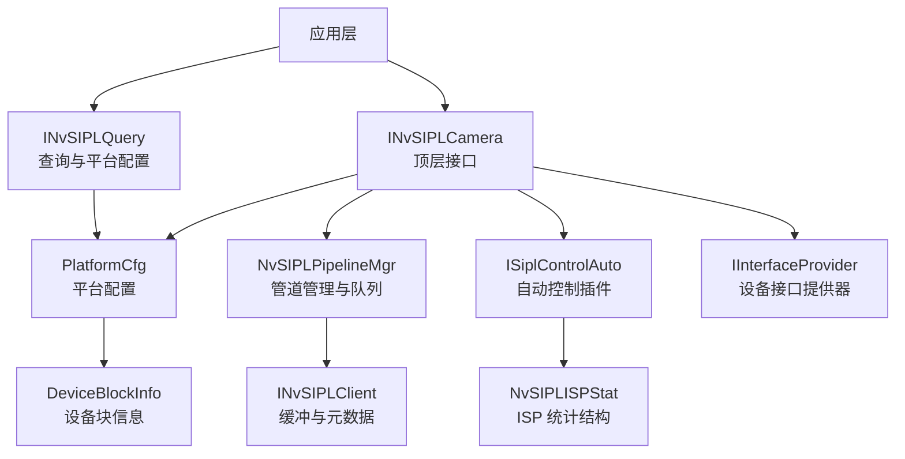

图表来源
- [NvSIPLCamera.hpp:151-701](file://driveos-6.0.5.0/drive-linux/include/NvSIPLCamera.hpp#L151-L701)
- [NvSIPLQuery.hpp:45-281](file://driveos-6.0.5.0/drive-linux/include/NvSIPLQuery.hpp#L45-L281)
- [NvSIPLPlatformCfg.hpp:52-65](file://driveos-6.0.5.0/drive-linux/include/NvSIPLPlatformCfg.hpp#L52-L65)
- [NvSIPLDeviceBlockInfo.hpp:295-345](file://driveos-6.0.5.0/drive-linux/include/NvSIPLDeviceBlockInfo.hpp#L295-L345)
- [NvSIPLPipelineMgr.hpp:44-488](file://driveos-6.0.5.0/drive-linux/include/NvSIPLPipelineMgr.hpp#L44-L488)
- [NvSIPLClient.hpp:46-361](file://driveos-6.0.5.0/drive-linux/include/NvSIPLClient.hpp#L46-L361)
- [INvSiplControlAuto.hpp:40-172](file://driveos-6.0.5.0/drive-linux/include/INvSiplControlAuto.hpp#L40-L172)
- [NvSIPLISPStat.hpp:65-603](file://driveos-6081/drive-linux/include/NvSIPLISPStat.hpp#L65-L603)
- [INvSIPLDeviceInterfaceProvider.hpp:107-150](file://driveos-6.0.5.0/drive-linux/include/INvSIPLDeviceInterfaceProvider.hpp#L107-L150)

## 详细组件分析

### 数据结构与时间基
- NvSiplRect：矩形区域，左上闭右下一开坐标系，用于裁剪与统计窗口。
- NvSiplPoint/NvSiplPointFloat：二维点位置，分别用于整数像素与亚像素计算。
- NvSiplGlobalTime：全局时间戳（微秒），用于帧级时间同步。
- NvSiplTimeBase：时间基选择，支持 PTP 时钟、内核单调时钟、用户自定义时钟，用于不同系统的时间基准需求。

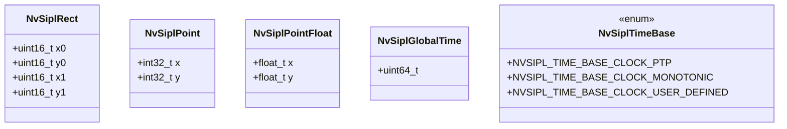

图表来源
- [NvSIPLCommon.hpp:50-112](file://driveos-6.0.5.0/drive-linux/include/NvSIPLCommon.hpp#L50-L112)

章节来源
- [NvSIPLCommon.hpp:40-112](file://driveos-6.0.5.0/drive-linux/include/NvSIPLCommon.hpp#L40-L112)

### 错误处理与状态码
- SIPLStatus：统一的状态返回值，覆盖成功、参数错误、不支持、内存不足、资源错误、超时、无效状态、EOF、未初始化、故障状态、未指定错误等。
- GPIO 事件：NVSIPL_GPIO_EVENT_* 定义了中断、取消等待、CDAC 错误、后端错误、未知错误等事件类型。
- 错误详情结构：SIPLErrorDetails 提供驱动填充的错误缓冲区、最大尺寸与写入大小，便于客户端查询具体错误。

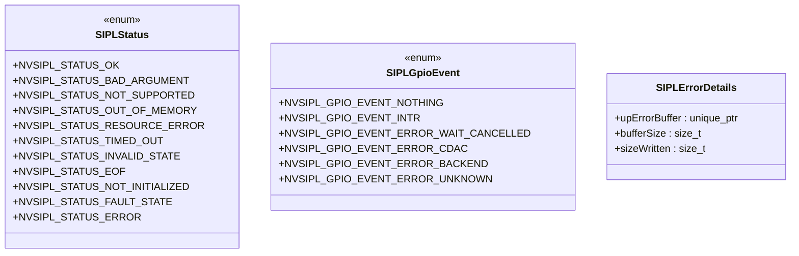

图表来源
- [NvSIPLCommon.hpp:115-193](file://driveos-6.0.5.0/drive-linux/include/NvSIPLCommon.hpp#L115-L193)

章节来源
- [NvSIPLCommon.hpp:115-193](file://driveos-6.0.5.0/drive-linux/include/NvSIPLCommon.hpp#L115-L193)

### 查询接口 INvSIPLQuery
- 职责：解析内置数据库、加载用户 JSON、列举设备与平台配置、按名称获取配置、应用链路掩码。
- 关键流程：ParseDatabase → ParseJsonFile → GetDeviceInfoList/GetPlatformCfgList/GetPlatformCfg → ApplyMask。

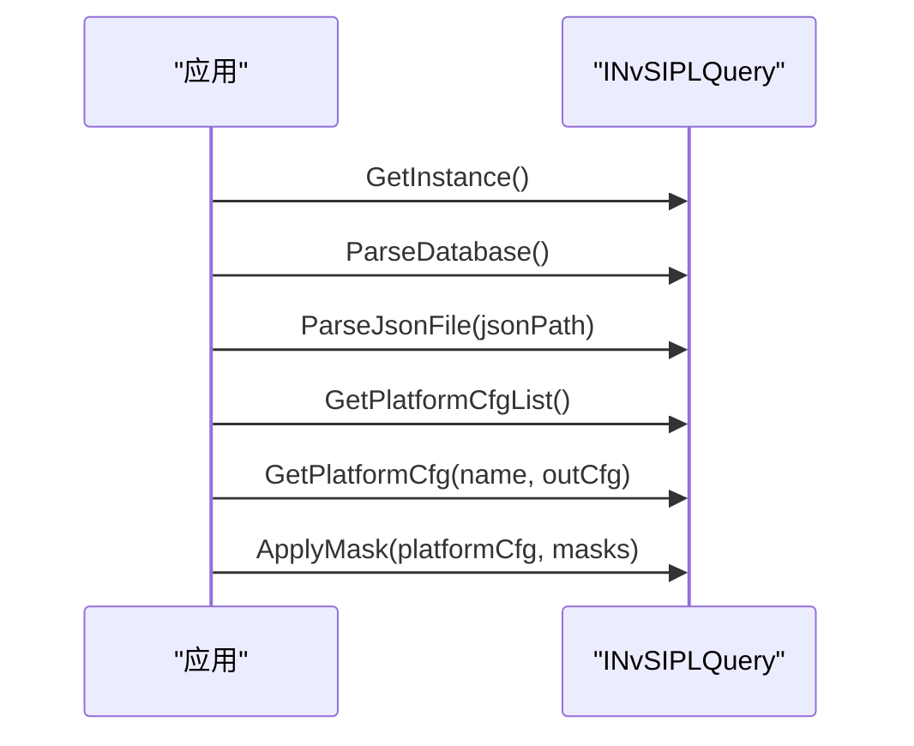

图表来源
- [NvSIPLQuery.hpp:93-276](file://driveos-6.0.5.0/drive-linux/include/NvSIPLQuery.hpp#L93-L276)

章节来源
- [NvSIPLQuery.hpp:93-276](file://driveos-6.0.5.0/drive-linux/include/NvSIPLQuery.hpp#L93-L276)

### 平台配置与设备块信息
- PlatformCfg：平台名称、配置名、描述、设备块数量与数组。
- DeviceBlockInfo：CSI 接口类型、PHY 模式、I2C 总线、反序列化器信息、相机模块数量与列表、长线缆支持、复位策略、GPIO 列表等。
- SensorInfo/SerInfo/EEPROMInfo/CameraModuleInfo：分别描述传感器、序列化器、EEPROM 与相机模块的属性与能力。

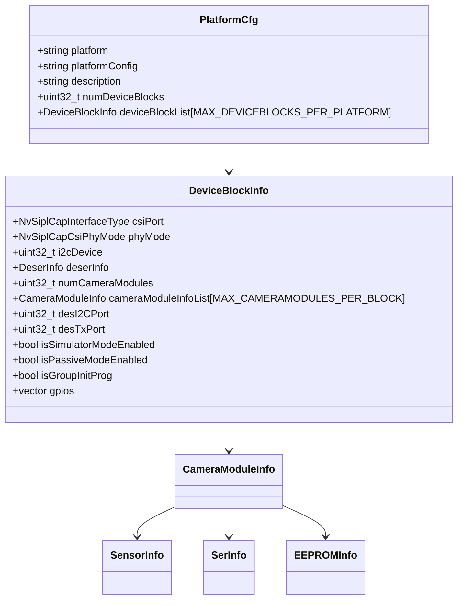

图表来源
- [NvSIPLPlatformCfg.hpp:52-65](file://driveos-6.0.5.0/drive-linux/include/NvSIPLPlatformCfg.hpp#L52-L65)
- [NvSIPLDeviceBlockInfo.hpp:295-345](file://driveos-6.0.5.0/drive-linux/include/NvSIPLDeviceBlockInfo.hpp#L295-L345)

章节来源
- [NvSIPLPlatformCfg.hpp:52-65](file://driveos-6.0.5.0/drive-linux/include/NvSIPLPlatformCfg.hpp#L52-L65)
- [NvSIPLDeviceBlockInfo.hpp:295-345](file://driveos-6.0.5.0/drive-linux/include/NvSIPLDeviceBlockInfo.hpp#L295-L345)

### 管道管理与队列
- NvSIPLPipelineConfiguration：是否请求捕获输出、ISP0/1/2 输出、降采样/裁剪、ISP 统计覆盖、子帧开关、重处理写入器。
- NvSIPLPipelineQueues：捕获完成队列、ISP0/1/2 完成队列与通知队列。
- 通知类型：包含 ICP/ISP/ACP/CDI 处理完成、帧丢弃/不连续/超时、各类错误事件、内部失败等。
- 客户端缓冲接口：INvSIPLBuffer 抽象，支持引用计数、添加/获取 NvSciSync 前后门、获取图像与嵌入式数据。

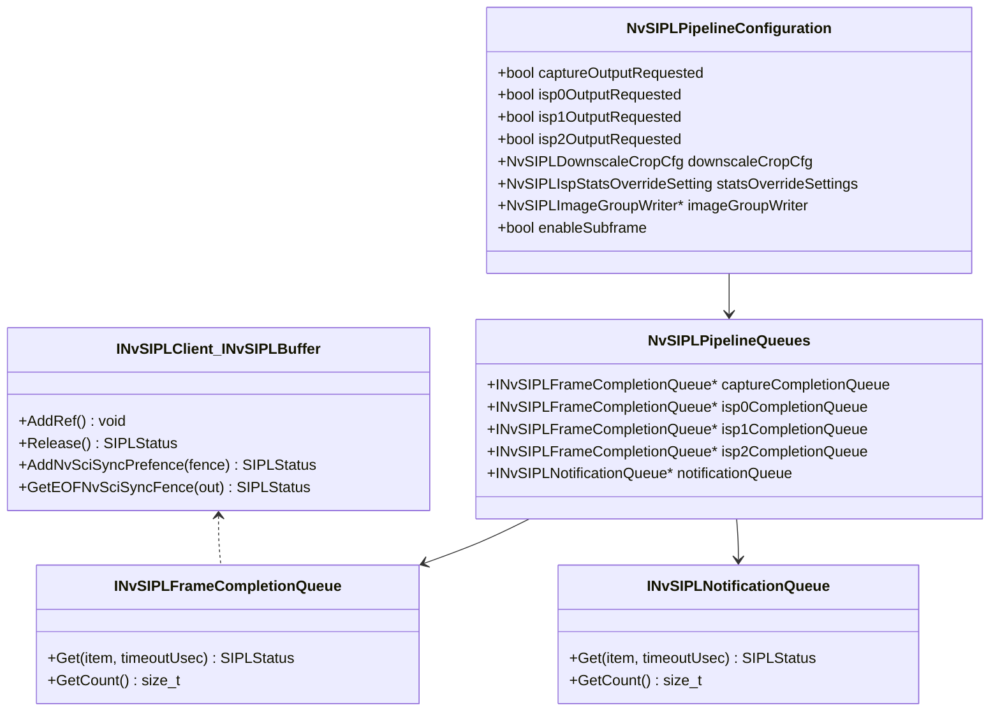

图表来源
- [NvSIPLPipelineMgr.hpp:259-488](file://driveos-6.0.5.0/drive-linux/include/NvSIPLPipelineMgr.hpp#L259-L488)
- [NvSIPLClient.hpp:126-261](file://driveos-6.0.5.0/drive-linux/include/NvSIPLClient.hpp#L126-L261)

章节来源
- [NvSIPLPipelineMgr.hpp:259-488](file://driveos-6.0.5.0/drive-linux/include/NvSIPLPipelineMgr.hpp#L259-L488)
- [NvSIPLClient.hpp:126-261](file://driveos-6.0.5.0/drive-linux/include/NvSIPLClient.hpp#L126-L261)

### 设备接口提供器
- IInterfaceProvider：通过 UUID 获取设备特定接口，确保客户端在运行时安全匹配与调用。
- Interface/UUID：提供实例唯一标识，避免驱动复制与状态重复。

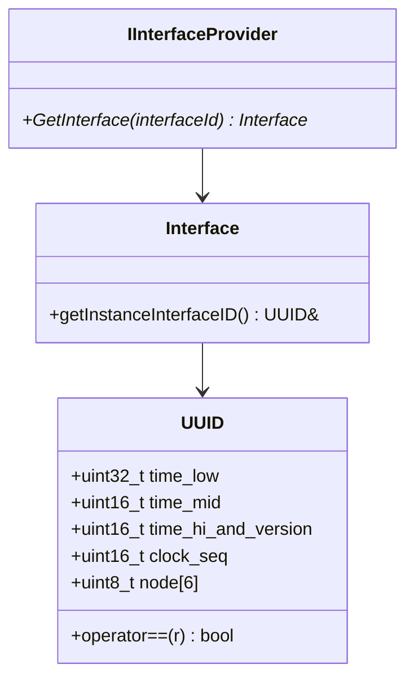

图表来源
- [INvSIPLDeviceInterfaceProvider.hpp:25-150](file://driveos-6.0.5.0/drive-linux/include/INvSIPLDeviceInterfaceProvider.hpp#L25-L150)

章节来源
- [INvSIPLDeviceInterfaceProvider.hpp:25-150](file://driveos-6.0.5.0/drive-linux/include/INvSIPLDeviceInterfaceProvider.hpp#L25-L150)

### 自动控制接口与定义
- ISiplControlAuto：Process（AE/AWB 算法）、GetNoiseProfile（噪声模型）、Reset（重置）。
- SiplControlAutoInputParam/SiplControlAutoOutputParam：输入嵌入式数据、传感器属性、ISP 统计；输出传感器设置、AWB 设置、ISP 数字增益与统计覆盖。
- ISP 统计结构：直方图、局部平均与截断统计、闪烁带统计等，支持覆盖设置。

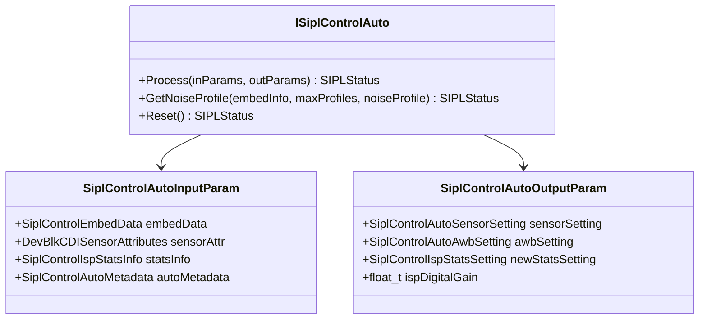

图表来源
- [INvSiplControlAuto.hpp:44-172](file://driveos-6.0.5.0/drive-linux/include/INvSiplControlAuto.hpp#L44-L172)
- [NvSiplControlAutoDef.hpp:245-315](file://driveos-6.0.5.0/drive-linux/include/NvSiplControlAutoDef.hpp#L245-L315)
- [NvSIPLISPStat.hpp:65-603](file://driveos-6081/drive-linux/include/NvSIPLISPStat.hpp#L65-L603)

章节来源
- [INvSiplControlAuto.hpp:44-172](file://driveos-6.0.5.0/drive-linux/include/INvSiplControlAuto.hpp#L44-L172)
- [NvSiplControlAutoDef.hpp:245-315](file://driveos-6.0.5.0/drive-linux/include/NvSiplControlAutoDef.hpp#L245-L315)
- [NvSIPLISPStat.hpp:65-603](file://driveos-6081/drive-linux/include/NvSIPLISPStat.hpp#L65-L603)

### 顶层相机接口 INvSIPLCamera 使用流程
- 初始化阶段：GetInstance → SetPlatformCfg → SetPipelineCfg → RegisterImages → RegisterAutoControlPlugin（可选） → Init → RegisterNvSciSyncObj（可选）
- 运行阶段：Start → 从各队列取帧 → 处理图像 → 释放缓冲 → Stop
- 去初始化：Deinit

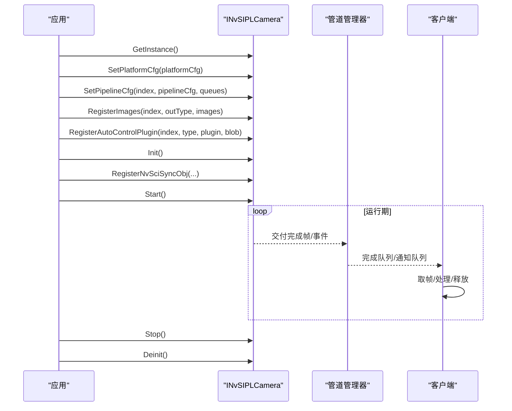

图表来源
- [NvSIPLCamera.hpp:158-701](file://driveos-6.0.5.0/drive-linux/include/NvSIPLCamera.hpp#L158-L701)
- [NvSIPLPipelineMgr.hpp:293-488](file://driveos-6.0.5.0/drive-linux/include/NvSIPLPipelineMgr.hpp#L293-L488)
- [NvSIPLClient.hpp:126-361](file://driveos-6.0.5.0/drive-linux/include/NvSIPLClient.hpp#L126-L361)

章节来源
- [NvSIPLCamera.hpp:158-701](file://driveos-6.0.5.0/drive-linux/include/NvSIPLCamera.hpp#L158-L701)
- [NvSIPLPipelineMgr.hpp:293-488](file://driveos-6.0.5.0/drive-linux/include/NvSIPLPipelineMgr.hpp#L293-L488)
- [NvSIPLClient.hpp:126-361](file://driveos-6.0.5.0/drive-linux/include/NvSIPLClient.hpp#L126-L361)

### 时间基选择与应用场景
- PTP 时钟：适用于需要 IEEE 1588 精确时间同步的场景。
- 内核单调时钟：适用于系统内一致的时间测量，避免被用户态调整影响。
- 用户自定义时钟：适用于特定业务或外部时间源对齐需求。
- 应用位置：客户端元数据中包含时间基与全局时间戳字段，用于帧级时间标注与跨引擎同步。

章节来源
- [NvSIPLCommon.hpp:100-112](file://driveos-6.0.5.0/drive-linux/include/NvSIPLCommon.hpp#L100-L112)
- [NvSIPLClient.hpp:84-89](file://driveos-6.0.5.0/drive-linux/include/NvSIPLClient.hpp#L84-L89)

## 依赖关系分析
- INvSIPLCamera 依赖 NvSIPLCommon、NvSIPLPlatformCfg、NvSIPLPipelineMgr、INvSiplControlAuto、NvSIPLClient、INvSIPLDeviceInterfaceProvider。
- NvSIPLPipelineMgr 依赖 NvSIPLCommon、NvSIPLClient、NvSIPLPlatformCfg、NvSIPLInterrupts。
- INvSiplControlAuto 依赖 NvSIPLCommon、NvSiplControlAutoDef。
- NvSiplControlAutoDef 依赖 NvSIPLISPStat 与 CDI 公共头。
- NvSIPLQuery 依赖 NvSIPLCommon 与 NvSIPLPlatformCfg。
- NvSIPLDeviceBlockInfo 依赖 Capability 结构（来自 CapStructs.h）。

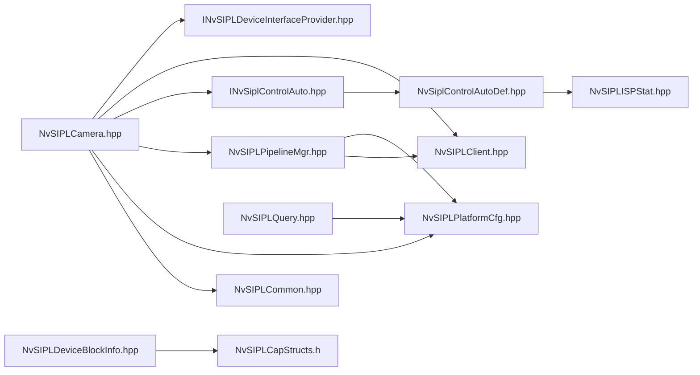

图表来源
- [NvSIPLCamera.hpp:13-26](file://driveos-6.0.5.0/drive-linux/include/NvSIPLCamera.hpp#L13-L26)
- [NvSIPLPipelineMgr.hpp:14-18](file://driveos-6.0.5.0/drive-linux/include/NvSIPLPipelineMgr.hpp#L14-L18)
- [INvSiplControlAuto.hpp:17-18](file://driveos-6.0.5.0/drive-linux/include/INvSiplControlAuto.hpp#L17-L18)
- [NvSiplControlAutoDef.hpp:13-14](file://driveos-6.0.5.0/drive-linux/include/NvSiplControlAutoDef.hpp#L13-L14)
- [NvSIPLQuery.hpp:13-14](file://driveos-6.0.5.0/drive-linux/include/NvSIPLQuery.hpp#L13-L14)
- [NvSIPLDeviceBlockInfo.hpp](file://driveos-6.0.5.0/drive-linux/include/NvSIPLDeviceBlockInfo.hpp#L14)

章节来源
- [NvSIPLCamera.hpp:13-26](file://driveos-6.0.5.0/drive-linux/include/NvSIPLCamera.hpp#L13-L26)
- [NvSIPLPipelineMgr.hpp:14-18](file://driveos-6.0.5.0/drive-linux/include/NvSIPLPipelineMgr.hpp#L14-L18)
- [INvSiplControlAuto.hpp:17-18](file://driveos-6.0.5.0/drive-linux/include/INvSiplControlAuto.hpp#L17-L18)
- [NvSiplControlAutoDef.hpp:13-14](file://driveos-6.0.5.0/drive-linux/include/NvSiplControlAutoDef.hpp#L13-L14)
- [NvSIPLQuery.hpp:13-14](file://driveos-6.0.5.0/drive-linux/include/NvSIPLQuery.hpp#L13-L14)
- [NvSIPLDeviceBlockInfo.hpp:14](file://driveos-6.0.5.0/drive-linux/include/NvSIPLDeviceBlockInfo.hpp#L14)

## 性能考虑
- 队列长度与超时：完成队列与通知队列提供 GetCount 与超时参数，建议根据下游处理能力设置合理超时，避免阻塞。
- 图像格式与内存布局：注册图像时选择合适的 NvSciBuf 表面类型、布局与位深，减少转换开销。
- ISP 统计覆盖：仅在必要时启用覆盖设置，避免频繁切换导致额外开销。
- NvSci 同步：正确使用预/后门同步，确保流水线前后依赖关系明确，避免不必要的等待。
- 时间基选择：在高精度时间同步场景优先使用 PTP；若系统时间不稳定，采用内核单调时钟更稳健。

## 故障排查指南
- 错误查询：通过 GetMaxErrorSize 获取最大错误尺寸，再调用 GetErrorGPIOEventInfo 与通用错误信息接口获取详细错误。
- GPIO 事件：关注 NVSIPL_GPIO_EVENT_* 类型，定位中断、等待取消、CDAC 或后端错误。
- 状态码：结合 SIPLStatus 的语义判断问题来源（参数、资源、超时、无效状态、故障等）。
- 通知队列：检查通知类型，识别 ICP/ISP/ACP/CDI 处理异常、帧丢弃/不连续/超时等告警。

章节来源
- [NvSIPLCamera.hpp:703-799](file://driveos-6.0.5.0/drive-linux/include/NvSIPLCamera.hpp#L703-L799)
- [NvSIPLCommon.hpp:145-172](file://driveos-6.0.5.0/drive-linux/include/NvSIPLCommon.hpp#L145-L172)
- [NvSIPLPipelineMgr.hpp:57-170](file://driveos-6.0.5.0/drive-linux/include/NvSIPLPipelineMgr.hpp#L57-L170)

## 结论
NvSIPL 通过清晰的分层设计与丰富的接口，将复杂的多传感器平台集成、设备配置、管道构建与帧交付过程抽象化，既满足高性能实时处理需求，又提供自动控制扩展与灵活的时间基选择。遵循本文档的使用流程与最佳实践，可在 DRIVE OS 上稳定实现从传感器到图像处理的完整链路。

## 附录
- 设备驱动接口规范：通过 IInterfaceProvider 与 UUID 机制暴露设备特定接口，客户端在运行时验证接口 ID 后安全调用。
- 平台配置说明：使用 INvSIPLQuery 解析数据库与用户 JSON，结合 ApplyMask 选择性启用链路，确保与硬件能力匹配。
- 时间基选择：根据系统需求选择 PTP、内核单调时钟或用户自定义时钟，保证帧级时间标注一致性。