# 数据结构与枚举

<cite>
**本文引用的文件**
- [NvSIPLCommon.hpp](file://driveos-6.0.5.0/drive-linux/include/NvSIPLCommon.hpp)
- [NvSIPLCommon.hpp](file://driveos-6.0.6.0/drive-linux/include/NvSIPLCommon.hpp)
- [NvSIPLCommon.hpp](file://driveos-60100/drive-linux/include/NvSIPLCommon.hpp)
- [NvSIPLCommon.hpp](file://driveos-6081/drive-linux/include/NvSIPLCommon.hpp)
- [NvSIPLInterrupts.hpp](file://driveos-6.0.5.0/drive-linux/include/NvSIPLInterrupts.hpp)
- [NvSIPLISPStructs.hpp](file://driveos-6.0.5.0/drive-linux/include/NvSIPLISPStructs.hpp)
</cite>

## 目录
1. [简介](#简介)
2. [项目结构](#项目结构)
3. [核心组件](#核心组件)
4. [架构总览](#架构总览)
5. [详细组件分析](#详细组件分析)
6. [依赖关系分析](#依赖关系分析)
7. [性能考量](#性能考量)
8. [故障排查指南](#故障排查指南)
9. [结论](#结论)
10. [附录](#附录)

## 简介
本文件面向NvSIPL（NVIDIA Sensor Image Pipeline Library）的数据结构与枚举，系统性梳理以下内容：
- NvSiplRect矩形区域结构的设计原则、坐标语义与使用场景
- NvSiplPoint与NvSiplPointFloat点坐标结构的用途与差异
- NvSiplGlobalTime全局时间戳的精度与单位
- NvSiplBool布尔值的定义与约定
- NvSiplTimeBase时间基枚举的选择依据与应用场景
- 完整的错误码列表（SIPLStatus）
- GPIO事件代码及其设备来源标记
- 数据结构的内存布局、对齐要求与性能影响
- 实际使用示例与常见陷阱的规避建议

## 项目结构
本次文档聚焦于驱动Linux头文件中的公共数据结构与枚举定义，主要位于以下路径：
- 公共类型与枚举：NvSIPLCommon.hpp（多个版本）
- 中断事件枚举：NvSIPLInterrupts.hpp
- ISP相关结构（含NvSiplRect使用）：NvSIPLISPStructs.hpp

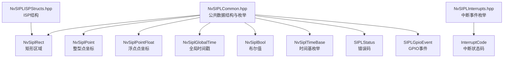

**图表来源**
- [NvSIPLCommon.hpp:40-112](file://driveos-6.0.5.0/drive-linux/include/NvSIPLCommon.hpp#L40-L112)
- [NvSIPLInterrupts.hpp:27-111](file://driveos-6.0.5.0/drive-linux/include/NvSIPLInterrupts.hpp#L27-L111)
- [NvSIPLISPStructs.hpp:87-185](file://driveos-6.0.5.0/drive-linux/include/NvSIPLISPStructs.hpp#L87-L185)

**章节来源**
- [NvSIPLCommon.hpp:40-112](file://driveos-6.0.5.0/drive-linux/include/NvSIPLCommon.hpp#L40-L112)
- [NvSIPLInterrupts.hpp:27-111](file://driveos-6.0.5.0/drive-linux/include/NvSIPLInterrupts.hpp#L27-L111)
- [NvSIPLISPStructs.hpp:87-185](file://driveos-6.0.5.0/drive-linux/include/NvSIPLISPStructs.hpp#L87-L185)

## 核心组件
本节对关键数据结构与枚举进行逐项解析，并给出跨版本一致性说明。

- NvSiplRect（矩形区域）
  - 含义：表示图像或显示表面的一个矩形区域
  - 坐标语义：左上角包含（x0, y0），右下角不包含（x1, y1）
  - 使用场景：裁剪、缩放、统计ROI、显示窗口等
  - 版本一致性：多版本均保持相同字段与语义

- NvSiplPoint（整型点坐标）
  - 含义：二维平面上的整数坐标点
  - 字段：x（水平）、y（垂直）
  - 使用场景：像素坐标、偏移量、锚点定位等

- NvSiplPointFloat（浮点点坐标）
  - 含义：高精度的二维平面坐标点
  - 字段：x（float_t）、y（float_t）
  - 使用场景：亚像素定位、插值计算、变换矩阵运算等

- NvSiplGlobalTime（全局时间戳）
  - 类型：无符号64位整数
  - 单位：微秒（µs）
  - 使用场景：帧时间戳、同步对齐、时序分析

- NvSiplBool（布尔值）
  - 类型：32位无符号整数
  - 取值：通过SIPL_TRUE/SIPL_FALSE宏赋值
  - 使用约定：仅使用这两个常量进行布尔判断与赋值

- NvSiplTimeBase（时间基枚举）
  - 选项：
    - PTP时钟（NVSIPL_TIME_BASE_CLOCK_PTP）
    - 内核单调时钟（NVSIPL_TIME_BASE_CLOCK_MONOTONIC）
    - 用户自定义时钟（NVSIPL_TIME_BASE_CLOCK_USER_DEFINED）
  - 选择依据：系统时钟可用性、精度需求、外部同步要求

- SIPLStatus（错误码）
  - 覆盖范围：成功、参数错误、不支持、资源不足、超时、无效状态、EOF、未初始化、故障状态、通用错误
  - 使用规范：函数返回值统一采用该枚举，便于上层统一处理

- SIPLGpioEvent（GPIO事件）
  - 事件类型：无事件、中断、中断超时、CDAC错误、后端错误、未知错误
  - 设备来源标记（部分版本）：NVSIPL_GPIO_DEVICE_DESERIALIZER、NVSIPL_GPIO_DEVICE_SERIALIZER_n、NVSIPL_GPIO_DEVICE_SENSOR_n、NVSIPL_GPIO_DEVICE_INTR_ERR、NVSIPL_GPIO_DEVICE_INTR_ERR_GETSTATUS
  - 使用场景：GPIO中断回调、设备状态查询、错误定位

**章节来源**
- [NvSIPLCommon.hpp:40-112](file://driveos-6.0.5.0/drive-linux/include/NvSIPLCommon.hpp#L40-L112)
- [NvSIPLCommon.hpp:40-112](file://driveos-6.0.6.0/drive-linux/include/NvSIPLCommon.hpp#L40-L112)
- [NvSIPLCommon.hpp:94-149](file://driveos-60100/drive-linux/include/NvSIPLCommon.hpp#L94-L149)
- [NvSIPLCommon.hpp:50-112](file://driveos-6081/drive-linux/include/NvSIPLCommon.hpp#L50-L112)
- [NvSIPLInterrupts.hpp:27-111](file://driveos-6.0.5.0/drive-linux/include/NvSIPLInterrupts.hpp#L27-L111)
- [NvSIPLCommon.hpp:182-206](file://driveos-60100/drive-linux/include/NvSIPLCommon.hpp#L182-L206)
- [NvSIPLCommon.hpp:181-205](file://driveos-6081/drive-linux/include/NvSIPLCommon.hpp#L181-L205)

## 架构总览
下图展示NvSIPL公共数据结构与枚举在模块间的角色与交互：

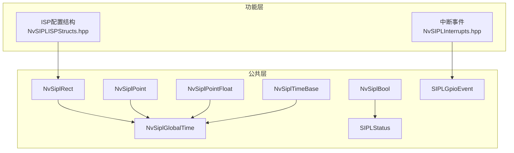

**图表来源**
- [NvSIPLCommon.hpp:40-112](file://driveos-6.0.5.0/drive-linux/include/NvSIPLCommon.hpp#L40-L112)
- [NvSIPLInterrupts.hpp:27-111](file://driveos-6.0.5.0/drive-linux/include/NvSIPLInterrupts.hpp#L27-L111)
- [NvSIPLISPStructs.hpp:87-185](file://driveos-6.0.5.0/drive-linux/include/NvSIPLISPStructs.hpp#L87-L185)

## 详细组件分析

### NvSiplRect（矩形区域）
- 设计要点
  - 左上包含、右下不包含的半开区间设计，避免重复与遗漏
  - 使用16位无符号整数，适合常见分辨率范围
- 使用建议
  - 计算宽高时遵循 width = x1 - x0；height = y1 - y0
  - 与裁剪/缩放结合时，确保边界合法且满足硬件对齐约束
- 示例场景
  - ISP输入裁剪、输出裁剪、显示ROI等

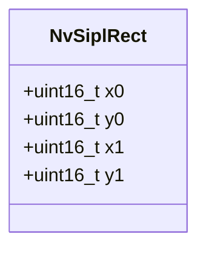

**图表来源**
- [NvSIPLCommon.hpp:50-59](file://driveos-6.0.5.0/drive-linux/include/NvSIPLCommon.hpp#L50-L59)
- [NvSIPLISPStructs.hpp:102-150](file://driveos-6.0.5.0/drive-linux/include/NvSIPLISPStructs.hpp#L102-L150)

**章节来源**
- [NvSIPLCommon.hpp:40-59](file://driveos-6.0.5.0/drive-linux/include/NvSIPLCommon.hpp#L40-L59)
- [NvSIPLISPStructs.hpp:87-185](file://driveos-6.0.5.0/drive-linux/include/NvSIPLISPStructs.hpp#L87-L185)

### NvSiplPoint 与 NvSiplPointFloat（点坐标）
- NvSiplPoint（整型）
  - 适用：像素级定位、离散采样
  - 注意：丢失亚像素精度
- NvSiplPointFloat（浮点）
  - 适用：插值、变换、拟合等连续域计算
  - 注意：与整型坐标转换时的舍入策略
- 使用建议
  - 在需要高精度的场景优先使用浮点坐标
  - 与硬件接口对接前需进行类型转换与范围校验

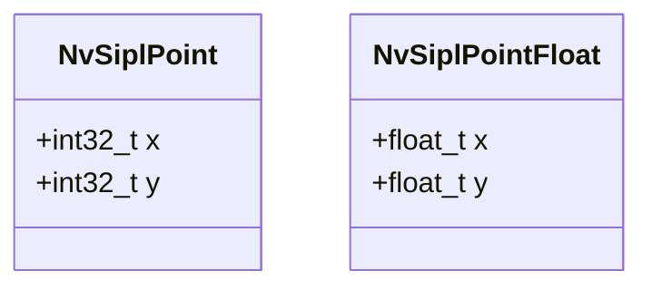

**图表来源**
- [NvSIPLCommon.hpp:69-85](file://driveos-6.0.5.0/drive-linux/include/NvSIPLCommon.hpp#L69-L85)

**章节来源**
- [NvSIPLCommon.hpp:69-85](file://driveos-6.0.5.0/drive-linux/include/NvSIPLCommon.hpp#L69-L85)

### NvSiplGlobalTime（全局时间戳）
- 精度与单位
  - 类型：uint64_t
  - 单位：微秒（µs）
- 应用场景
  - 帧到达时间、事件序列化、跨模块时间对齐
- 注意事项
  - 避免溢出（约585年），在长时间运行系统中应关注回绕策略
  - 与其他时间源（PTP、monotonic）协同使用时，明确转换规则

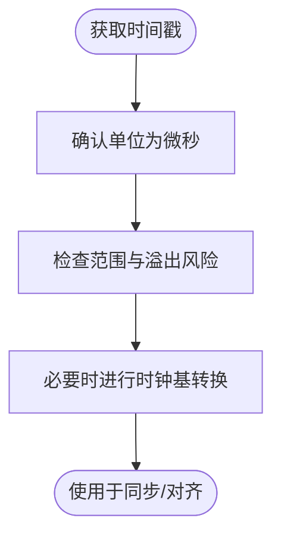

**图表来源**
- [NvSIPLCommon.hpp:62-64](file://driveos-6.0.5.0/drive-linux/include/NvSIPLCommon.hpp#L62-L64)

**章节来源**
- [NvSIPLCommon.hpp:62-64](file://driveos-6.0.5.0/drive-linux/include/NvSIPLCommon.hpp#L62-L64)

### NvSiplBool（布尔值）
- 定义
  - 类型：uint32_t
  - 常量：SIPL_TRUE、SIPL_FALSE（通过宏定义）
- 使用约定
  - 仅使用SIPL_TRUE/SIPL_FALSE赋值
  - 判断逻辑基于非零即真
- 建议
  - 统一使用宏常量，避免直接使用字面量

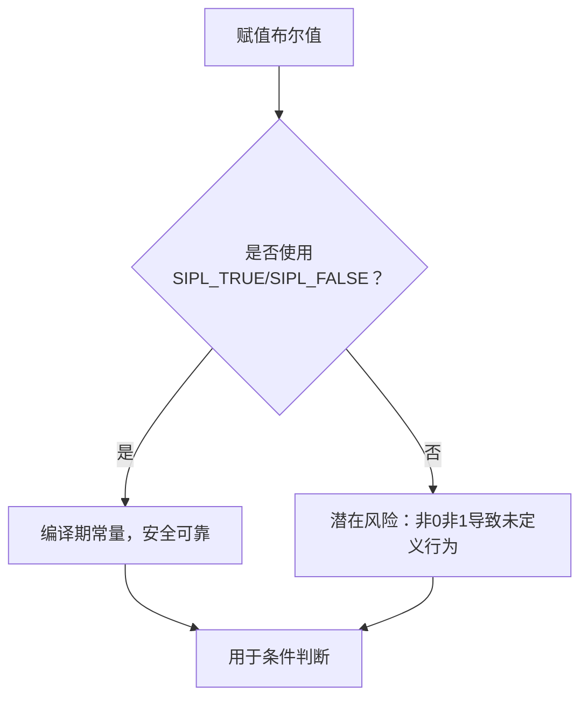

**图表来源**
- [NvSIPLCommon.hpp:87-98](file://driveos-6.0.5.0/drive-linux/include/NvSIPLCommon.hpp#L87-L98)

**章节来源**
- [NvSIPLCommon.hpp:87-98](file://driveos-6.0.5.0/drive-linux/include/NvSIPLCommon.hpp#L87-L98)

### NvSiplTimeBase（时间基枚举）
- 选择依据
  - PTP：高精度、可同步至网络时钟，适用于严格同步场景
  - Monotonic：内核单调递增，避免被用户态调整影响
  - User Defined：自定义实现，满足特殊需求
- 应用场景
  - 多设备同步、时钟校准、日志时间戳对齐

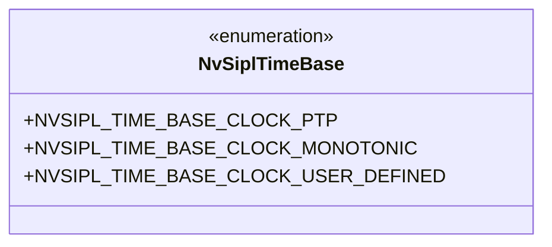

**图表来源**
- [NvSIPLCommon.hpp:102-112](file://driveos-6.0.5.0/drive-linux/include/NvSIPLCommon.hpp#L102-L112)

**章节来源**
- [NvSIPLCommon.hpp:102-112](file://driveos-6.0.5.0/drive-linux/include/NvSIPLCommon.hpp#L102-L112)

### 错误码 SIPLStatus（完整列表）
- 成功
  - NVSIPL_STATUS_OK
- 错误类别
  - 参数错误：NVSIPL_STATUS_BAD_ARGUMENT
  - 不支持：NVSIPL_STATUS_NOT_SUPPORTED
  - 资源不足：NVSIPL_STATUS_OUT_OF_MEMORY、NVSIPL_STATUS_RESOURCE_ERROR
  - 超时：NVSIPL_STATUS_TIMED_OUT
  - 状态异常：NVSIPL_STATUS_INVALID_STATE、NVSIPL_STATUS_NOT_INITIALIZED、NVSIPL_STATUS_FAULT_STATE
  - 文件结束：NVSIPL_STATUS_EOF
  - 通用错误：NVSIPL_STATUS_ERROR

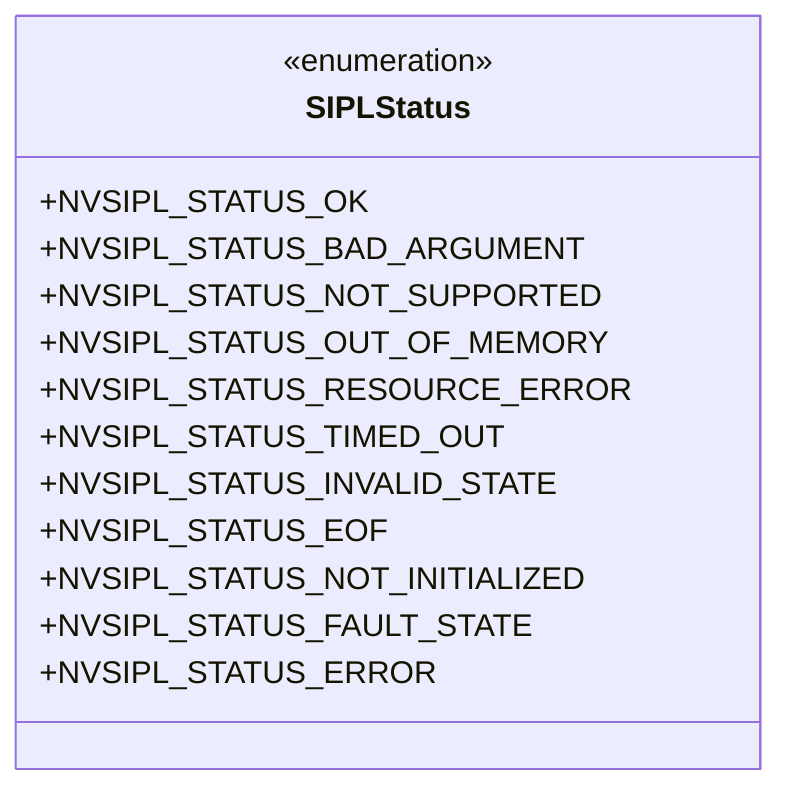

**图表来源**
- [NvSIPLCommon.hpp:115-143](file://driveos-6.0.5.0/drive-linux/include/NvSIPLCommon.hpp#L115-L143)

**章节来源**
- [NvSIPLCommon.hpp:115-143](file://driveos-6.0.5.0/drive-linux/include/NvSIPLCommon.hpp#L115-L143)

### GPIO事件与设备来源标记
- 事件类型（SIPLGpioEvent）
  - NVSIPL_GPIO_EVENT_NOTHING、NVSIPL_GPIO_EVENT_INTR、NVSIPL_GPIO_EVENT_INTR_TIMEOUT、NVSIPL_GPIO_EVENT_ERROR_*、NVSIPL_GPIO_EVENT_ERROR_UNKNOWN
- 设备来源标记（部分版本）
  - 来源：解串器、串行器链路0~3、传感器链路0~3
  - 功能：错误中断、错误定位
- 使用建议
  - 结合设备来源标记快速定位问题模块
  - 对错误类事件进行分级处理与上报

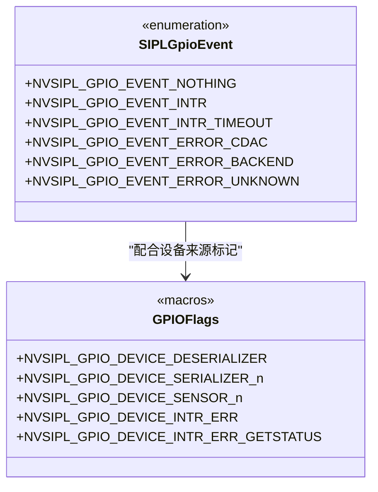

**图表来源**
- [NvSIPLCommon.hpp:182-206](file://driveos-60100/drive-linux/include/NvSIPLCommon.hpp#L182-L206)
- [NvSIPLCommon.hpp:181-205](file://driveos-6081/drive-linux/include/NvSIPLCommon.hpp#L181-L205)

**章节来源**
- [NvSIPLCommon.hpp:182-206](file://driveos-60100/drive-linux/include/NvSIPLCommon.hpp#L182-L206)
- [NvSIPLCommon.hpp:181-205](file://driveos-6081/drive-linux/include/NvSIPLCommon.hpp#L181-L205)

### 中断状态码（InterruptCode）
- 分类
  - 解串器：失败、超时
  - 电源管理：失败、超时
  - 串行器：失败、超时
  - 传感器：失败、超时
  - EEPROM：失败、超时
  - 通用：失败、超时
- 使用场景
  - 设备状态监控、故障诊断、自动恢复策略触发

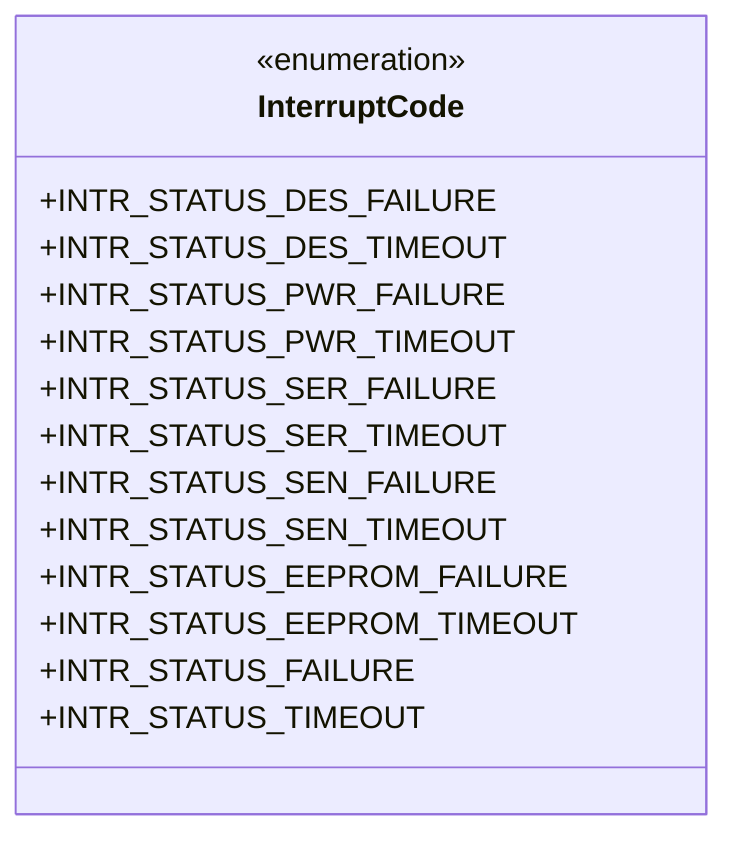

**图表来源**
- [NvSIPLInterrupts.hpp:27-111](file://driveos-6.0.5.0/drive-linux/include/NvSIPLInterrupts.hpp#L27-L111)

**章节来源**
- [NvSIPLInterrupts.hpp:27-111](file://driveos-6.0.5.0/drive-linux/include/NvSIPLInterrupts.hpp#L27-L111)

## 依赖关系分析
- NvSiplRect在ISP结构中广泛使用，作为裁剪与缩放配置的核心元素
- 时间相关类型（GlobalTime、TimeBase）贯穿模块间的时间对齐与同步
- 错误码与GPIO事件共同构成系统的可观测性与可维护性基础

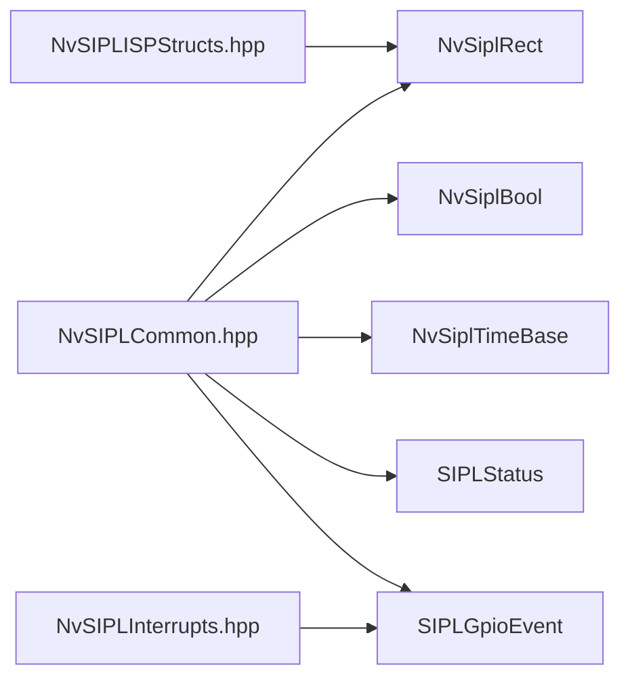

**图表来源**
- [NvSIPLCommon.hpp:40-112](file://driveos-6.0.5.0/drive-linux/include/NvSIPLCommon.hpp#L40-L112)
- [NvSIPLISPStructs.hpp:87-185](file://driveos-6.0.5.0/drive-linux/include/NvSIPLISPStructs.hpp#L87-L185)
- [NvSIPLInterrupts.hpp:27-111](file://driveos-6.0.5.0/drive-linux/include/NvSIPLInterrupts.hpp#L27-L111)

**章节来源**
- [NvSIPLCommon.hpp:40-112](file://driveos-6.0.5.0/drive-linux/include/NvSIPLCommon.hpp#L40-L112)
- [NvSIPLISPStructs.hpp:87-185](file://driveos-6.0.5.0/drive-linux/include/NvSIPLISPStructs.hpp#L87-L185)
- [NvSIPLInterrupts.hpp:27-111](file://driveos-6.0.5.0/drive-linux/include/NvSIPLInterrupts.hpp#L27-L111)

## 性能考量
- 内存占用
  - NvSiplRect：4×16位 = 8字节
  - NvSiplPoint：2×32位 = 8字节
  - NvSiplPointFloat：2×float_t ≈ 8字节（取决于平台）
  - NvSiplGlobalTime：64位 = 8字节
  - NvSiplBool：32位 = 4字节
- 对齐要求
  - 默认ABI对齐，通常按最大成员自然对齐
  - 浮点字段可能受平台ABI影响，建议在结构体末尾放置以减少填充
- 性能影响
  - 浮点坐标在密集计算中带来额外开销，应权衡精度与性能
  - 时间戳微秒级精度足以覆盖大多数媒体应用，避免过高的时间分辨率造成缓存压力

[本节为通用指导，无需特定文件引用]

## 故障排查指南
- 参数错误（NVSIPL_STATUS_BAD_ARGUMENT）
  - 检查NvSiplRect边界合法性（x0<x1、y0<y1、不越界）
  - 校验NvSiplPoint/PointFloat范围与类型匹配
- 资源错误（NVSIPL_STATUS_OUT_OF_MEMORY、NVSIPL_STATUS_RESOURCE_ERROR）
  - 关注缓冲区大小与对齐，避免频繁分配/释放
- 超时（NVSIPL_STATUS_TIMED_OUT）
  - 检查时间基设置与系统时钟稳定性
  - 对GPIO中断设置合理的等待与超时阈值
- 故障状态（NVSIPL_STATUS_FAULT_STATE）
  - 结合InterruptCode与GPIO事件进行定位
  - 优先处理解串器/串行器/传感器链路的失败与超时事件

**章节来源**
- [NvSIPLCommon.hpp:115-143](file://driveos-6.0.5.0/drive-linux/include/NvSIPLCommon.hpp#L115-L143)
- [NvSIPLInterrupts.hpp:27-111](file://driveos-6.0.5.0/drive-linux/include/NvSIPLInterrupts.hpp#L27-L111)

## 结论
本文系统梳理了NvSIPL公共数据结构与枚举，明确了各类型的语义、使用场景与注意事项。通过统一的错误码体系与GPIO事件机制，可有效提升系统的可观测性与可维护性。在实际工程中，应重视坐标语义、时间基选择与布尔值约定，以降低集成复杂度并提升性能表现。

[本节为总结性内容，无需特定文件引用]

## 附录

### 实际使用示例（步骤说明）
- 设置裁剪区域
  - 构造NvSiplRect，确保x0<x1、y0<y1且在图像范围内
  - 将其填入ISP裁剪配置结构
- 像素定位
  - 使用NvSiplPoint进行整型定位
  - 需要亚像素时使用NvSiplPointFloat并在转换前做好舍入策略
- 时间戳记录
  - 使用NvSiplGlobalTime记录微秒级时间戳
  - 根据场景选择PTP或Monotonic作为时间基
- 错误处理
  - 函数返回SIPLStatus，按类别分支处理
  - GPIO事件发生时，结合设备来源标记快速定位问题模块

[本节为概念性指导，无需特定文件引用]

### 常见陷阱与规避
- 坐标边界混淆
  - 避免将“右下角包含”误用为“右下角不包含”
  - 裁剪时确保宽高为偶数（部分硬件要求）
- 布尔值误用
  - 仅使用SIPL_TRUE/SIPL_FALSE，避免直接使用任意整数值
- 时间基混用
  - 明确不同时间基的适用场景，避免跨时基直接比较
- GPIO事件误判
  - 区分“无事件”“中断”“超时”“错误”，并结合设备来源标记进行定位

[本节为通用指导，无需特定文件引用]