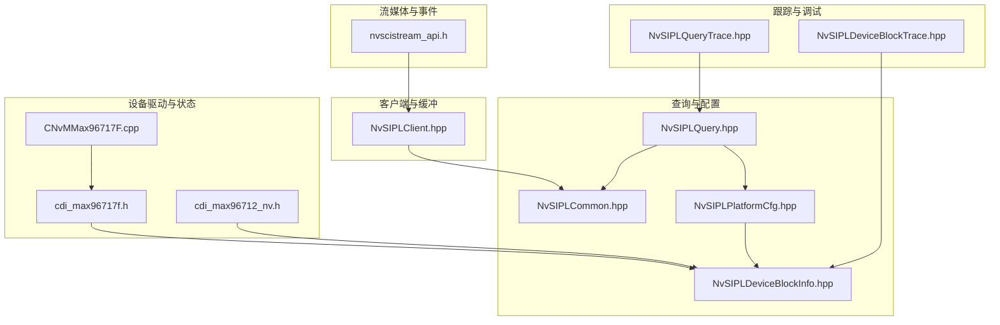
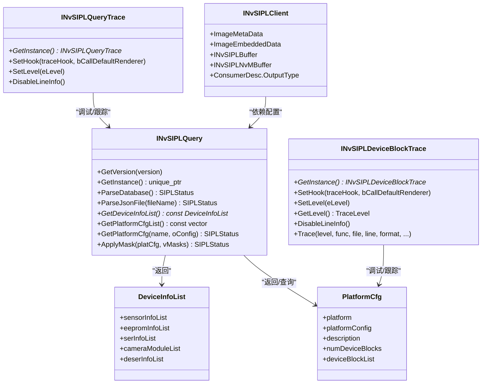
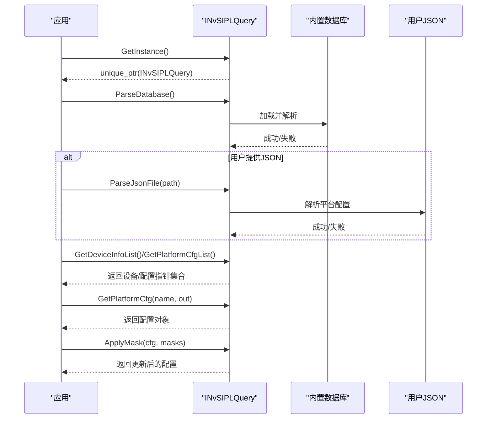
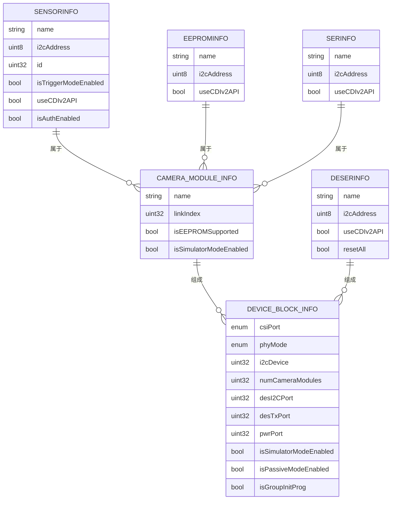
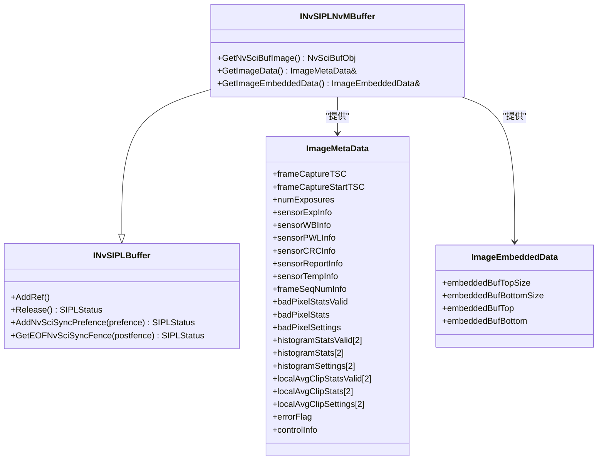
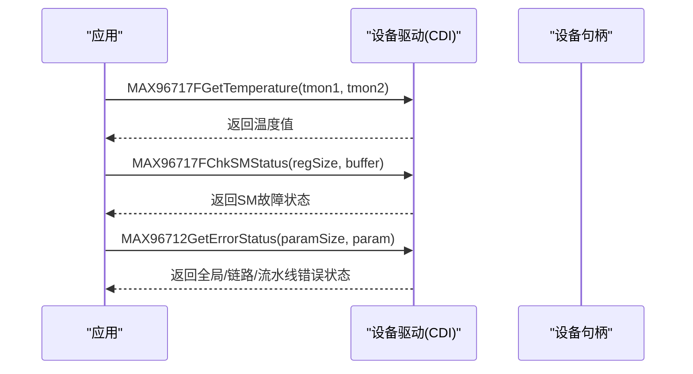
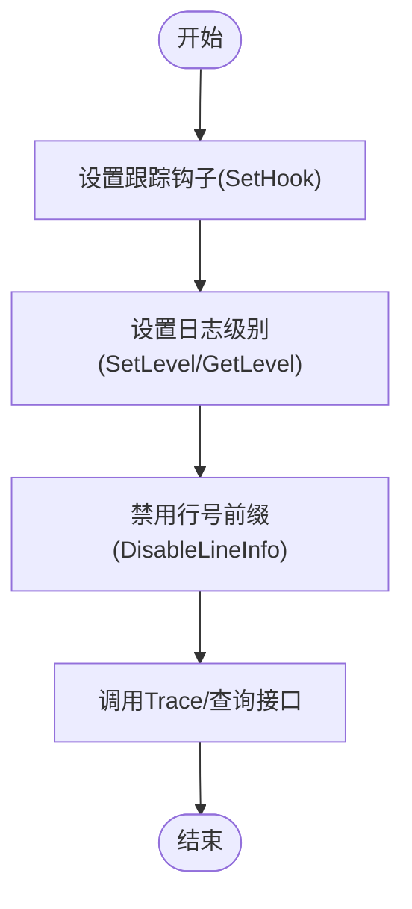
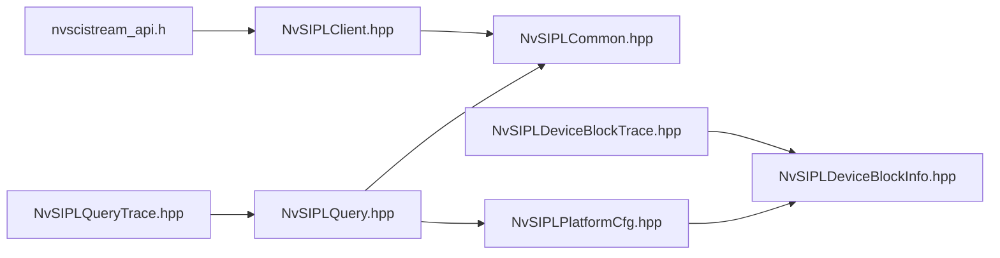

# 查询接口与状态管理

<cite>
**本文引用的文件**   
- [NvSIPLQuery.hpp](file://driveos-6.0.6.0/drive-linux/include/NvSIPLQuery.hpp)
- [NvSIPLQueryTrace.hpp](file://driveos-6.0.6.0/drive-linux/include/NvSIPLQueryTrace.hpp)
- [NvSIPLDeviceBlockTrace.hpp](file://driveos-6.0.6.0/drive-linux/include/NvSIPLDeviceBlockTrace.hpp)
- [NvSIPLClient.hpp](file://driveos-6.0.6.0/drive-linux/include/NvSIPLClient.hpp)
- [NvSIPLCommon.hpp](file://driveos-6.0.6.0/drive-linux/include/NvSIPLCommon.hpp)
- [NvSIPLDeviceBlockInfo.hpp](file://driveos-6.0.6.0/drive-linux/include/NvSIPLDeviceBlockInfo.hpp)
- [NvSIPLPlatformCfg.hpp](file://driveos-6.0.6.0/drive-linux/include/NvSIPLPlatformCfg.hpp)
- [nvscistream_api.h](file://driveos-6.0.5.0/drive-linux/include/nvscistream_api.h)
- [CNvMMax96717F.cpp](file://driveos-6.0.6.0/drive-linux/samples/nvmedia/nvsipl/devblk/devices/MAX96717FSerializerDriver/CNvMMax96717F.cpp)
- [cdi_max96717f.h](file://driveos-6081/drive-linux/samples/nvmedia/nvsipl/devblk/devblk_new/devices/MAX96717FSerializerDriver/cdi_max96717f.h)
- [cdi_max96712_nv.h](file://driveos-6081/drive-linux/samples/nvmedia/nvsipl/devblk/devblk_new/devices/MAX96712DeserializerDriver_nv/cdi_max96712_nv.h)
</cite>

## 目录
1. [简介](#简介)
2. [项目结构](#项目结构)
3. [核心组件](#核心组件)
4. [架构总览](#架构总览)
5. [详细组件分析](#详细组件分析)
6. [依赖关系分析](#依赖关系分析)
7. [性能考虑](#性能考虑)
8. [故障排查指南](#故障排查指南)
9. [结论](#结论)
10. [附录](#附录)

## 简介
本技术文档围绕 NvSIPL 的查询接口与状态管理能力展开，系统性说明以下内容：
- 查询接口的设计原理与实现机制：包括数据库解析、平台配置检索、掩码应用等。
- 设备状态查询、性能指标获取与调试信息收集的方法：通过设备块与传感器驱动提供的状态查询接口实现。
- 查询结果的数据格式与解析方法：以结构化数据模型（设备信息、平台配置）为核心。
- 线程安全与并发访问控制：基于接口文档中的上下文限制与同步语义说明。
- 使用示例与最佳实践：结合样例与接口注释给出可操作建议。
- 缓存策略与性能优化：在解析与查询流程中减少重复开销的建议。
- 错误处理与异常情况：统一的状态码体系与错误缓冲区设计。
- 与跟踪系统的集成：查询与设备块的跟踪接口及日志级别控制。

## 项目结构
本仓库中与查询接口和状态管理直接相关的核心头文件位于 driveos-6.x.x/drive-linux/include 下，主要模块如下：
- 查询接口与平台配置：NvSIPLQuery.hpp、NvSIPLPlatformCfg.hpp、NvSIPLDeviceBlockInfo.hpp
- 调试与跟踪：NvSIPLQueryTrace.hpp、NvSIPLDeviceBlockTrace.hpp
- 客户端与通用类型：NvSIPLClient.hpp、NvSIPLCommon.hpp
- 流媒体与事件查询参考：nvscistream_api.h
- 设备驱动与状态查询接口示例：cdi_max96717f.h、cdi_max96712_nv.h
- 设备错误信息采集示例：CNvMMax96717F.cpp

**图表来源**
- [NvSIPLQuery.hpp:1-290](file://driveos-6.0.6.0/drive-linux/include/NvSIPLQuery.hpp#L1-L290)
- [NvSIPLPlatformCfg.hpp:1-72](file://driveos-6.0.6.0/drive-linux/include/NvSIPLPlatformCfg.hpp#L1-L72)
- [NvSIPLDeviceBlockInfo.hpp:1-370](file://driveos-6.0.6.0/drive-linux/include/NvSIPLDeviceBlockInfo.hpp#L1-L370)
- [NvSIPLClient.hpp:1-362](file://driveos-6.0.6.0/drive-linux/include/NvSIPLClient.hpp#L1-L362)
- [NvSIPLCommon.hpp:1-219](file://driveos-6.0.6.0/drive-linux/include/NvSIPLCommon.hpp#L1-L219)
- [NvSIPLQueryTrace.hpp:1-160](file://driveos-6.0.6.0/drive-linux/include/NvSIPLQueryTrace.hpp#L1-L160)
- [NvSIPLDeviceBlockTrace.hpp:1-121](file://driveos-6.0.6.0/drive-linux/include/NvSIPLDeviceBlockTrace.hpp#L1-L121)
- [nvscistream_api.h:988-1024](file://driveos-6.0.5.0/drive-linux/include/nvscistream_api.h#L988-L1024)
- [cdi_max96717f.h:416-649](file://driveos-6081/drive-linux/samples/nvmedia/nvsipl/devblk/devblk_new/devices/MAX96717FSerializerDriver/cdi_max96717f.h#L416-L649)
- [cdi_max96712_nv.h:869-917](file://driveos-6081/drive-linux/samples/nvmedia/nvsipl/devblk/devblk_new/devices/MAX96712DeserializerDriver_nv/cdi_max96712_nv.h#L869-L917)
- [CNvMMax96717F.cpp:1-60](file://driveos-6.0.6.0/drive-linux/samples/nvmedia/nvsipl/devblk/devices/MAX96717FSerializerDriver/CNvMMax96717F.cpp#L1-L60)

**章节来源**
- [NvSIPLQuery.hpp:1-290](file://driveos-6.0.6.0/drive-linux/include/NvSIPLQuery.hpp#L1-L290)
- [NvSIPLPlatformCfg.hpp:1-72](file://driveos-6.0.6.0/drive-linux/include/NvSIPLPlatformCfg.hpp#L1-L72)
- [NvSIPLDeviceBlockInfo.hpp:1-370](file://driveos-6.0.6.0/drive-linux/include/NvSIPLDeviceBlockInfo.hpp#L1-L370)
- [NvSIPLClient.hpp:1-362](file://driveos-6.0.6.0/drive-linux/include/NvSIPLClient.hpp#L1-L362)
- [NvSIPLCommon.hpp:1-219](file://driveos-6.0.6.0/drive-linux/include/NvSIPLCommon.hpp#L1-L219)
- [NvSIPLQueryTrace.hpp:1-160](file://driveos-6.0.6.0/drive-linux/include/NvSIPLQueryTrace.hpp#L1-L160)
- [NvSIPLDeviceBlockTrace.hpp:1-121](file://driveos-6.0.6.0/drive-linux/include/NvSIPLDeviceBlockTrace.hpp#L1-L121)
- [nvscistream_api.h:988-1024](file://driveos-6.0.5.0/drive-linux/include/nvscistream_api.h#L988-L1024)
- [cdi_max96717f.h:416-649](file://driveos-6081/drive-linux/samples/nvmedia/nvsipl/devblk/devblk_new/devices/MAX96717FSerializerDriver/cdi_max96717f.h#L416-L649)
- [cdi_max96712_nv.h:869-917](file://driveos-6081/drive-linux/samples/nvmedia/nvsipl/devblk/devblk_new/devices/MAX96712DeserializerDriver_nv/cdi_max96712_nv.h#L869-L917)
- [CNvMMax96717F.cpp:1-60](file://driveos-6.0.6.0/drive-linux/samples/nvmedia/nvsipl/devblk/devices/MAX96717FSerializerDriver/CNvMMax96717F.cpp#L1-L60)

## 核心组件
- 查询接口 INvSIPLQuery
  - 提供库版本查询、实例获取、数据库解析、JSON 平台配置解析、设备信息列表与平台配置列表获取、按名称获取平台配置、掩码应用等能力。
  - 关键函数与约束：参见接口注释中的“允许上下文”、“线程安全”、“异步/同步”等说明。
- 平台配置与设备信息
  - PlatformCfg 描述平台与设备块集合；DeviceInfoList 汇总传感器、EEPROM、序列化器、相机模组与反序列化器信息。
  - DeviceBlockInfo 细化到 CSI 接口、PHY 模式、I2C/数据速率、GPIO 映射、启动复位策略等。
- 客户端与缓冲
  - INvSIPLClient 定义图像元数据结构、嵌入式数据结构以及缓冲抽象接口（引用计数、NvSci 同步 Fence 管理），用于从管线输出读取统计与控制信息。
- 通用类型与状态码
  - NvSIPLCommon 定义通用几何、时间、布尔、时钟基、状态码与错误详情结构，统一错误处理与上报。
- 跟踪与调试
  - NvSIPLQueryTrace 与 NvSIPLDeviceBlockTrace 提供查询与设备块的跟踪钩子、日志级别设置与行号前缀控制。

**章节来源**
- [NvSIPLQuery.hpp:44-281](file://driveos-6.0.6.0/drive-linux/include/NvSIPLQuery.hpp#L44-L281)
- [NvSIPLPlatformCfg.hpp:33-65](file://driveos-6.0.6.0/drive-linux/include/NvSIPLPlatformCfg.hpp#L33-L65)
- [NvSIPLDeviceBlockInfo.hpp:28-363](file://driveos-6.0.6.0/drive-linux/include/NvSIPLDeviceBlockInfo.hpp#L28-L363)
- [NvSIPLClient.hpp:46-354](file://driveos-6.0.6.0/drive-linux/include/NvSIPLClient.hpp#L46-L354)
- [NvSIPLCommon.hpp:40-213](file://driveos-6.0.6.0/drive-linux/include/NvSIPLCommon.hpp#L40-L213)
- [NvSIPLQueryTrace.hpp:26-153](file://driveos-6.0.6.0/drive-linux/include/NvSIPLQueryTrace.hpp#L26-L153)
- [NvSIPLDeviceBlockTrace.hpp:33-113](file://driveos-6.0.6.0/drive-linux/include/NvSIPLDeviceBlockTrace.hpp#L33-L113)

## 架构总览
下图展示了查询接口、平台配置、设备信息与客户端之间的交互关系，并标注了与跟踪系统的集成点。

**图表来源**
- [NvSIPLQuery.hpp:44-281](file://driveos-6.0.6.0/drive-linux/include/NvSIPLQuery.hpp#L44-L281)
- [NvSIPLQueryTrace.hpp:26-153](file://driveos-6.0.6.0/drive-linux/include/NvSIPLQueryTrace.hpp#L26-L153)
- [NvSIPLDeviceBlockTrace.hpp:33-113](file://driveos-6.0.6.0/drive-linux/include/NvSIPLDeviceBlockTrace.hpp#L33-L113)
- [NvSIPLClient.hpp:46-354](file://driveos-6.0.6.0/drive-linux/include/NvSIPLClient.hpp#L46-L354)
- [NvSIPLPlatformCfg.hpp:33-65](file://driveos-6.0.6.0/drive-linux/include/NvSIPLPlatformCfg.hpp#L33-L65)
- [NvSIPLDeviceBlockInfo.hpp:28-363](file://driveos-6.0.6.0/drive-linux/include/NvSIPLDeviceBlockInfo.hpp#L28-L363)

## 详细组件分析

### 查询接口 INvSIPLQuery
- 设计要点
  - 静态工厂与单例：通过 GetInstance 获取实例，生命周期由 unique_ptr 管理。
  - 初始化顺序：必须先 ParseDatabase，再进行其他查询或修改操作。
  - 数据来源：内置 JSON 数据库与用户自定义 JSON 文件。
  - 平台配置掩码：支持对反序列化器链路启用掩码，灵活裁剪链路组合。
- 线程安全与上下文
  - 接口注释明确指出：中断处理、信号处理、异步调用均不被允许；非重入、非线程安全。
- 使用流程（概念）
  - 获取实例 → 解析数据库 → 可选：解析用户 JSON → 查询设备列表/平台配置 → 应用掩码 → 获取指定配置。
- 数据格式
  - 设备信息列表：包含传感器、EEPROM、序列化器、相机模组、反序列化器的集合。
  - 平台配置：包含平台名、配置名、描述、设备块数量与数组。

**图表来源**
- [NvSIPLQuery.hpp:93-276](file://driveos-6.0.6.0/drive-linux/include/NvSIPLQuery.hpp#L93-L276)

**章节来源**
- [NvSIPLQuery.hpp:93-276](file://driveos-6.0.6.0/drive-linux/include/NvSIPLQuery.hpp#L93-L276)
- [NvSIPLPlatformCfg.hpp:33-65](file://driveos-6.0.6.0/drive-linux/include/NvSIPLPlatformCfg.hpp#L33-L65)
- [NvSIPLDeviceBlockInfo.hpp:28-363](file://driveos-6.0.6.0/drive-linux/include/NvSIPLDeviceBlockInfo.hpp#L28-L363)

### 平台配置与设备信息模型
- DeviceInfoList
  - 聚合传感器、EEPROM、序列化器、相机模组与反序列化器信息，便于一次性查询与展示。
- PlatformCfg
  - 描述平台与设备块数组，设备块包含 CSI 接口、PHY 模式、I2C/数据速率、GPIO 映射、启动复位策略等。
- 设备块能力边界
  - 安全与非安全构建下的最大设备块、相机模组、传感器数量不同，接口层已内建常量约束。

**图表来源**
- [NvSIPLDeviceBlockInfo.hpp:89-363](file://driveos-6.0.6.0/drive-linux/include/NvSIPLDeviceBlockInfo.hpp#L89-L363)
- [NvSIPLPlatformCfg.hpp:33-65](file://driveos-6.0.6.0/drive-linux/include/NvSIPLPlatformCfg.hpp#L33-L65)

**章节来源**
- [NvSIPLDeviceBlockInfo.hpp:89-363](file://driveos-6.0.6.0/drive-linux/include/NvSIPLDeviceBlockInfo.hpp#L89-L363)
- [NvSIPLPlatformCfg.hpp:33-65](file://driveos-6.0.6.0/drive-linux/include/NvSIPLPlatformCfg.hpp#L33-L65)

### 客户端与缓冲（图像元数据与嵌入式数据）
- 图像元数据 ImageMetaData
  - 包含帧捕获时间戳、曝光/白平衡/PWL/CRC/帧报告/温度/序列号等传感器嵌入数据。
  - 包含 ISP 坏像素统计与设置、直方图统计与设置、局部平均与裁剪统计与设置。
  - 控制信息与错误标志。
- 嵌入式数据 ImageEmbeddedData
  - 提供顶部与底部嵌入数据大小与指针，便于原始解析。
- 缓冲接口 INvSIPLBuffer/INvSIPLNvMBuffer
  - 引用计数 AddRef/Release，NvSciSync 预置 Fence 与 EOF Fence 获取。
  - 注释明确：AddRef/Release/添加 Fence/获取 EOF Fence 在运行期线程安全，但需避免与释放回收竞争。

**图表来源**
- [NvSIPLClient.hpp:52-341](file://driveos-6.0.6.0/drive-linux/include/NvSIPLClient.hpp#L52-L341)

**章节来源**
- [NvSIPLClient.hpp:52-341](file://driveos-6.0.6.0/drive-linux/include/NvSIPLClient.hpp#L52-L341)

### 设备状态查询与性能指标
- 设备驱动状态查询
  - MAX96717F：提供温度、SM 状态检查、MFP 状态、视频状态（溢出/像素时钟检测）、ERRB 检查、寄存器数组写入与校验等接口。
  - MAX96712：提供参数读取、错误状态聚合、寄存器转储等接口。
- 错误信息采集
  - 示例：CNvMMax96717F::GetErrorInfo/GetErrorSize 展示如何返回设备错误缓冲区大小与内容，便于上层统一处理。
- 性能指标
  - 通过传感器/序列化器驱动接口读取温度、状态寄存器、溢出标志等，作为运行时健康度与性能指标的依据。

**图表来源**
- [cdi_max96717f.h:416-649](file://driveos-6081/drive-linux/samples/nvmedia/nvsipl/devblk/devblk_new/devices/MAX96717FSerializerDriver/cdi_max96717f.h#L416-L649)
- [cdi_max96712_nv.h:869-917](file://driveos-6081/drive-linux/samples/nvmedia/nvsipl/devblk/devblk_new/devices/MAX96712DeserializerDriver_nv/cdi_max96712_nv.h#L869-L917)
- [CNvMMax96717F.cpp:42-58](file://driveos-6.0.6.0/drive-linux/samples/nvmedia/nvsipl/devblk/devices/MAX96717FSerializerDriver/CNvMMax96717F.cpp#L42-L58)

**章节来源**
- [cdi_max96717f.h:416-649](file://driveos-6081/drive-linux/samples/nvmedia/nvsipl/devblk/devblk_new/devices/MAX96717FSerializerDriver/cdi_max96717f.h#L416-L649)
- [cdi_max96712_nv.h:869-917](file://driveos-6081/drive-linux/samples/nvmedia/nvsipl/devblk/devblk_new/devices/MAX96712DeserializerDriver_nv/cdi_max96712_nv.h#L869-L917)
- [CNvMMax96717F.cpp:42-58](file://driveos-6.0.6.0/drive-linux/samples/nvmedia/nvsipl/devblk/devices/MAX96717FSerializerDriver/CNvMMax96717F.cpp#L42-L58)

### 调试与跟踪集成
- 查询跟踪 INvSIPLQueryTrace
  - 支持设置回调钩子、设置日志级别、禁用行号前缀。
- 设备块跟踪 INvSIPLDeviceBlockTrace
  - 支持设置回调钩子、设置/获取日志级别、禁用行号前缀、统一 Trace 接口。
- 使用建议
  - 开发阶段使用较高日志级别，定位问题后降低级别以减少开销。
  - 将跟踪钩子输出重定向至集中日志系统，便于跨模块关联分析。

**图表来源**
- [NvSIPLQueryTrace.hpp:70-126](file://driveos-6.0.6.0/drive-linux/include/NvSIPLQueryTrace.hpp#L70-L126)
- [NvSIPLDeviceBlockTrace.hpp:54-108](file://driveos-6.0.6.0/drive-linux/include/NvSIPLDeviceBlockTrace.hpp#L54-L108)

**章节来源**
- [NvSIPLQueryTrace.hpp:70-126](file://driveos-6.0.6.0/drive-linux/include/NvSIPLQueryTrace.hpp#L70-L126)
- [NvSIPLDeviceBlockTrace.hpp:54-108](file://driveos-6.0.6.0/drive-linux/include/NvSIPLDeviceBlockTrace.hpp#L54-L108)

## 依赖关系分析
- 查询接口依赖
  - 依赖 NvSIPLCommon 提供通用类型与状态码。
  - 依赖 NvSIPLPlatformCfg 与 NvSIPLDeviceBlockInfo 提供数据模型。
- 客户端依赖
  - 依赖 NvSIPLCommon 与 NvSIPLISP 结构（如坏像素、直方图等）。
  - 依赖 NvSciStream/NvSciBuf/NvSciSync 进行缓冲与同步（接口注释中明确提及）。
- 设备驱动依赖
  - 通过 CDI 接口访问硬件状态与寄存器，提供温度、状态寄存器、溢出标志等。

**图表来源**
- [NvSIPLCommon.hpp:1-219](file://driveos-6.0.6.0/drive-linux/include/NvSIPLCommon.hpp#L1-L219)
- [NvSIPLPlatformCfg.hpp:1-72](file://driveos-6.0.6.0/drive-linux/include/NvSIPLPlatformCfg.hpp#L1-L72)
- [NvSIPLDeviceBlockInfo.hpp:1-370](file://driveos-6.0.6.0/drive-linux/include/NvSIPLDeviceBlockInfo.hpp#L1-L370)
- [NvSIPLQuery.hpp:1-290](file://driveos-6.0.6.0/drive-linux/include/NvSIPLQuery.hpp#L1-L290)
- [NvSIPLClient.hpp:1-362](file://driveos-6.0.6.0/drive-linux/include/NvSIPLClient.hpp#L1-L362)
- [NvSIPLQueryTrace.hpp:1-160](file://driveos-6.0.6.0/drive-linux/include/NvSIPLQueryTrace.hpp#L1-L160)
- [NvSIPLDeviceBlockTrace.hpp:1-121](file://driveos-6.0.6.0/drive-linux/include/NvSIPLDeviceBlockTrace.hpp#L1-L121)
- [nvscistream_api.h:988-1024](file://driveos-6.0.5.0/drive-linux/include/nvscistream_api.h#L988-L1024)

**章节来源**
- [NvSIPLCommon.hpp:1-219](file://driveos-6.0.6.0/drive-linux/include/NvSIPLCommon.hpp#L1-L219)
- [NvSIPLPlatformCfg.hpp:1-72](file://driveos-6.0.6.0/drive-linux/include/NvSIPLPlatformCfg.hpp#L1-L72)
- [NvSIPLDeviceBlockInfo.hpp:1-370](file://driveos-6.0.6.0/drive-linux/include/NvSIPLDeviceBlockInfo.hpp#L1-L370)
- [NvSIPLQuery.hpp:1-290](file://driveos-6.0.6.0/drive-linux/include/NvSIPLQuery.hpp#L1-L290)
- [NvSIPLClient.hpp:1-362](file://driveos-6.0.6.0/drive-linux/include/NvSIPLClient.hpp#L1-L362)
- [NvSIPLQueryTrace.hpp:1-160](file://driveos-6.0.6.0/drive-linux/include/NvSIPLQueryTrace.hpp#L1-L160)
- [NvSIPLDeviceBlockTrace.hpp:1-121](file://driveos-6.0.6.0/drive-linux/include/NvSIPLDeviceBlockTrace.hpp#L1-L121)
- [nvscistream_api.h:988-1024](file://driveos-6.0.5.0/drive-linux/include/nvscistream_api.h#L988-L1024)

## 性能考虑
- 解析与加载
  - ParseDatabase 仅需执行一次，后续查询复用内部状态，避免重复解析。
  - 用户 JSON 仅在需要扩展或覆盖默认配置时使用，减少不必要的 IO。
- 缓存策略
  - 对设备信息列表与平台配置列表进行缓存，避免频繁分配与拷贝。
  - 平台配置掩码 ApplyMask 仅修改输入配置对象，减少额外内存占用。
- 线程与上下文
  - 查询接口注释明确禁止在中断/信号处理、异步上下文中调用，避免上下文切换与锁竞争带来的性能损耗。
- 日志与跟踪
  - 低级别日志在生产环境应关闭或降级，避免频繁 I/O 影响吞吐。
- 缓冲与同步
  - 客户端缓冲 AddRef/Release 与 NvSci Fence 操作应成对出现，避免悬挂引用导致资源回收延迟。

[本节为通用指导，无需特定文件引用]

## 故障排查指南
- 统一状态码与错误详情
  - NvSIPLCommon 定义了从成功到各类错误（无效参数、资源不足、超时、未初始化、故障状态等）的状态码体系。
  - SIPLErrorDetails 提供错误缓冲区、缓冲大小与实际写入大小，便于上层统一收集与上报。
- 设备错误信息采集
  - 通过设备驱动接口（如 GetErrorInfo/GetErrorSize）读取设备侧错误，结合跟踪日志定位问题根因。
- 调试与跟踪
  - 使用 INvSIPLQueryTrace 与 INvSIPLDeviceBlockTrace 设置钩子与日志级别，逐步缩小问题范围。
- 典型问题定位步骤
  - 确认 ParseDatabase 成功后再进行其他查询。
  - 若 ApplyMask 失败，检查掩码数量与平台配置中反序列化器数量是否一致。
  - 若客户端缓冲操作失败，检查引用计数与 Fence 状态，确保无竞态。

**章节来源**
- [NvSIPLCommon.hpp:114-213](file://driveos-6.0.6.0/drive-linux/include/NvSIPLCommon.hpp#L114-L213)
- [NvSIPLQueryTrace.hpp:70-126](file://driveos-6.0.6.0/drive-linux/include/NvSIPLQueryTrace.hpp#L70-L126)
- [NvSIPLDeviceBlockTrace.hpp:54-108](file://driveos-6.0.6.0/drive-linux/include/NvSIPLDeviceBlockTrace.hpp#L54-L108)
- [CNvMMax96717F.cpp:42-58](file://driveos-6.0.6.0/drive-linux/samples/nvmedia/nvsipl/devblk/devices/MAX96717FSerializerDriver/CNvMMax96717F.cpp#L42-L58)

## 结论
NvSIPL 查询接口通过清晰的数据模型与严格的初始化顺序，提供了稳定可靠的设备与平台配置查询能力。配合设备驱动的状态查询接口与统一的跟踪系统，能够高效完成设备状态监控、性能指标采集与调试信息分析。遵循接口注释中的上下文与线程安全约束，结合缓存与日志优化策略，可在保证正确性的前提下获得良好的运行性能。

[本节为总结，无需特定文件引用]

## 附录
- 使用示例与最佳实践（基于接口注释与数据模型）
  - 实例获取与初始化：先 GetInstance，再 ParseDatabase；若需要用户配置则随后 ParseJsonFile。
  - 查询设备与平台：GetDeviceInfoList 与 GetPlatformCfgList；按名称获取配置后 ApplyMask 裁剪链路。
  - 客户端使用：通过 INvSIPLNvMBuffer 获取图像缓冲与元数据，注意 AddRef/Release 与 Fence 生命周期。
  - 调试：设置跟踪钩子与日志级别，必要时禁用行号前缀以减少输出冗余。
- 与流媒体事件查询的对比参考
  - nvscistream_api.h 中的事件查询接口可用于底层流媒体通道的状态诊断，与查询接口形成互补。

**章节来源**
- [NvSIPLQuery.hpp:93-276](file://driveos-6.0.6.0/drive-linux/include/NvSIPLQuery.hpp#L93-L276)
- [NvSIPLClient.hpp:120-341](file://driveos-6.0.6.0/drive-linux/include/NvSIPLClient.hpp#L120-L341)
- [nvscistream_api.h:988-1024](file://driveos-6.0.5.0/drive-linux/include/nvscistream_api.h#L988-L1024)