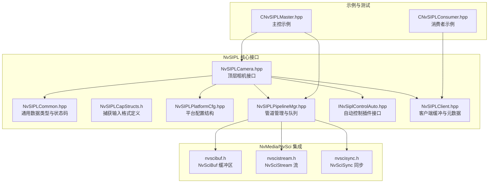
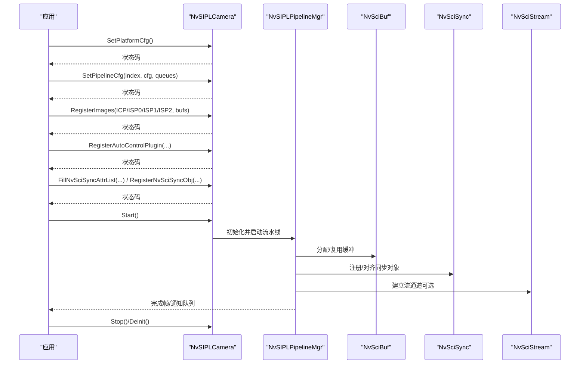
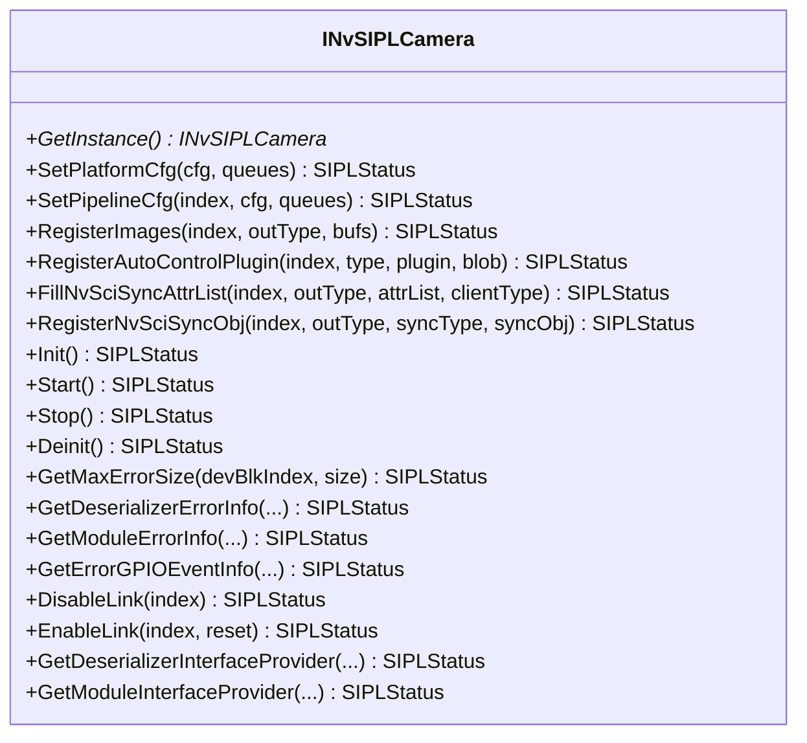
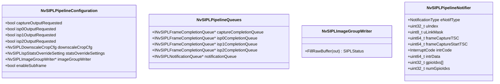
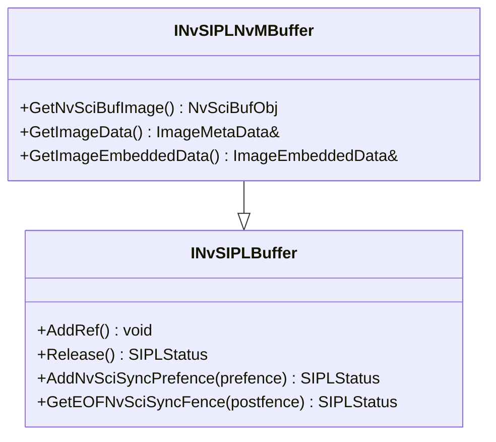
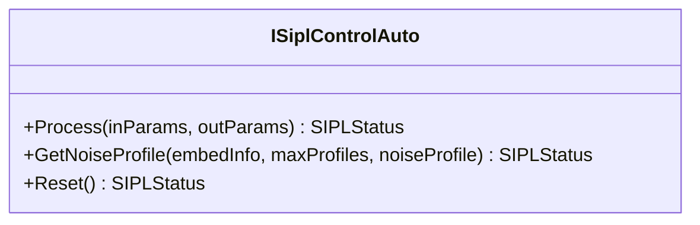
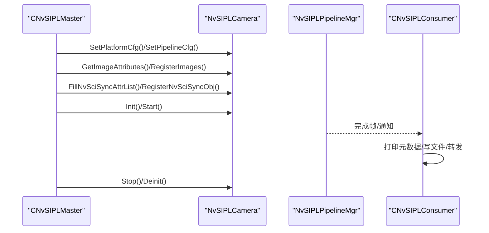
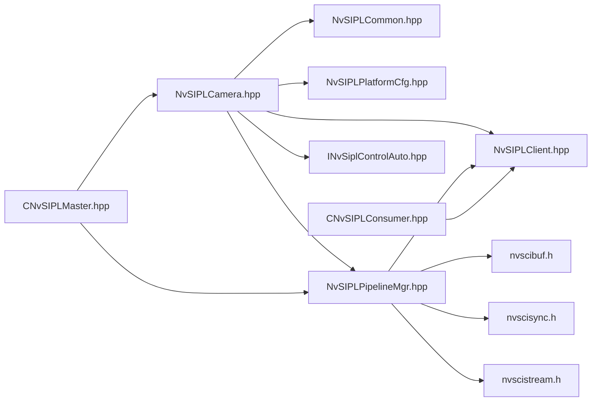

# 相机控制与图像捕获

<cite>
**本文档引用的文件**
- [NvSIPLCamera.hpp](file://driveos-6.0.5.0/drive-linux/include/NvSIPLCamera.hpp)
- [NvSIPLCommon.hpp](file://driveos-6.0.5.0/drive-linux/include/NvSIPLCommon.hpp)
- [NvSIPLCapStructs.h](file://driveos-6.0.5.0/drive-linux/include/NvSIPLCapStructs.h)
- [NvSIPLPlatformCfg.hpp](file://driveos-6.0.5.0/drive-linux/include/NvSIPLPlatformCfg.hpp)
- [NvSIPLPipelineMgr.hpp](file://driveos-6.0.5.0/drive-linux/include/NvSIPLPipelineMgr.hpp)
- [INvSiplControlAuto.hpp](file://driveos-6.0.5.0/drive-linux/include/INvSiplControlAuto.hpp)
- [NvSIPLClient.hpp](file://driveos-6.0.5.0/drive-linux/include/NvSIPLClient.hpp)
- [CNvSIPLMaster.hpp](file://driveos-6.0.5.0/drive-linux/samples/nvmedia/nvsipl/test/camera/CNvSIPLMaster.hpp)
- [CNvSIPLConsumer.hpp](file://driveos-6.0.5.0/drive-linux/samples/nvmedia/nvsipl/test/camera/CNvSIPLConsumer.hpp)
- [nvscibuf.h](file://driveos-6.0.5.0/drive-linux/include/nvscibuf.h)
- [nvscistream.h](file://driveos-6.0.5.0/drive-linux/include/nvscistream.h)
- [nvscisync.h](file://driveos-6.0.5.0/drive-linux/include/nvscisync.h)
</cite>

## 目录
1. [引言](#引言)
2. [项目结构](#项目结构)
3. [核心组件](#核心组件)
4. [架构总览](#架构总览)
5. [详细组件分析](#详细组件分析)
6. [依赖关系分析](#依赖关系分析)
7. [性能考虑](#性能考虑)
8. [故障排查指南](#故障排查指南)
9. [结论](#结论)
10. [附录](#附录)

## 引言
本技术文档围绕NVIDIA DRIVE OS中的NvSIPL（Software Interface for Pixel Link）相机控制与图像捕获能力展开，系统化阐述NvSIPLCamera类的设计架构、核心功能与使用模式，并结合NvMedia与NvSci在缓冲区与同步方面的集成，给出从初始化、配置到图像捕获的完整流程说明。文档同时覆盖图像格式转换、分辨率与帧率控制、多相机协作、自动控制（曝光与白平衡）、错误诊断、性能优化与实时性保障等主题。

## 项目结构
该仓库中与NvSIPL相关的头文件主要位于驱动Linux发行版的include目录下，示例与测试代码位于samples目录中；NvMedia与NvSci接口头文件则分别提供缓冲区、流与同步能力支撑。

**图表来源**
- [NvSIPLCamera.hpp:158-1122](file://driveos-6.0.5.0/drive-linux/include/NvSIPLCamera.hpp#L158-L1122)
- [NvSIPLCommon.hpp:27-218](file://driveos-6.0.5.0/drive-linux/include/NvSIPLCommon.hpp#L27-L218)
- [NvSIPLCapStructs.h:1-257](file://driveos-6.0.5.0/drive-linux/include/NvSIPLCapStructs.h#L1-L257)
- [NvSIPLPlatformCfg.hpp:26-71](file://driveos-6.0.5.0/drive-linux/include/NvSIPLPlatformCfg.hpp#L26-L71)
- [NvSIPLPipelineMgr.hpp:30-504](file://driveos-6.0.5.0/drive-linux/include/NvSIPLPipelineMgr.hpp#L30-L504)
- [INvSiplControlAuto.hpp:33-178](file://driveos-6.0.5.0/drive-linux/include/INvSiplControlAuto.hpp#L33-L178)
- [NvSIPLClient.hpp:40-367](file://driveos-6.0.5.0/drive-linux/include/NvSIPLClient.hpp#L40-L367)
- [nvscibuf.h:1-800](file://driveos-6.0.5.0/drive-linux/include/nvscibuf.h#L1-L800)
- [nvscistream.h:1-32](file://driveos-6.0.5.0/drive-linux/include/nvscistream.h#L1-L32)
- [nvscisync.h:1-800](file://driveos-6.0.5.0/drive-linux/include/nvscisync.h#L1-L800)
- [CNvSIPLMaster.hpp:40-534](file://driveos-6.0.5.0/drive-linux/samples/nvmedia/nvsipl/test/camera/CNvSIPLMaster.hpp#L40-L534)
- [CNvSIPLConsumer.hpp:35-403](file://driveos-6.0.5.0/drive-linux/samples/nvmedia/nvsipl/test/camera/CNvSIPLConsumer.hpp#L35-L403)

**章节来源**
- [NvSIPLCamera.hpp:1-1130](file://driveos-6.0.5.0/drive-linux/include/NvSIPLCamera.hpp#L1-L1130)
- [NvSIPLCommon.hpp:1-218](file://driveos-6.0.5.0/drive-linux/include/NvSIPLCommon.hpp#L1-L218)
- [NvSIPLCapStructs.h:1-257](file://driveos-6.0.5.0/drive-linux/include/NvSIPLCapStructs.h#L1-L257)
- [NvSIPLPlatformCfg.hpp:1-72](file://driveos-6.0.5.0/drive-linux/include/NvSIPLPlatformCfg.hpp#L1-L72)
- [NvSIPLPipelineMgr.hpp:1-505](file://driveos-6.0.5.0/drive-linux/include/NvSIPLPipelineMgr.hpp#L1-L505)
- [INvSiplControlAuto.hpp:1-179](file://driveos-6.0.5.0/drive-linux/include/INvSiplControlAuto.hpp#L1-L179)
- [NvSIPLClient.hpp:1-368](file://driveos-6.0.5.0/drive-linux/include/NvSIPLClient.hpp#L1-L368)
- [nvscibuf.h:1-800](file://driveos-6.0.5.0/drive-linux/include/nvscibuf.h#L1-L800)
- [nvscistream.h:1-32](file://driveos-6.0.5.0/drive-linux/include/nvscistream.h#L1-L32)
- [nvscisync.h:1-800](file://driveos-6.0.5.0/drive-linux/include/nvscisync.h#L1-L800)
- [CNvSIPLMaster.hpp:1-1246](file://driveos-6.0.5.0/drive-linux/samples/nvmedia/nvsipl/test/camera/CNvSIPLMaster.hpp#L1-L1246)
- [CNvSIPLConsumer.hpp:1-403](file://driveos-6.0.5.0/drive-linux/samples/nvmedia/nvsipl/test/camera/CNvSIPLConsumer.hpp#L1-L403)

## 核心组件
- NvSIPLCamera：顶层相机接口，负责平台配置、管道配置、图像注册、启动/停止、去初始化、错误查询、NvSci同步对象注册等。
- NvSIPLPipelineMgr：管道管理器，提供通知与完成队列、图像组写入器、降采样裁剪配置、ISP统计覆盖等。
- NvSIPLClient：客户端缓冲与元数据接口，抽象缓冲、NvSciBuf对象访问、嵌入式数据、时间戳与ISP统计等。
- INvSiplControlAuto：自动控制插件接口，用于AE/AWB算法处理与噪声模型获取。
- NvSIPLCommon：通用数据结构、时间基、布尔、矩形区域、全局时间、状态码与GPIO事件等。
- NvSIPLCapStructs：捕获输入格式、CSI接口类型、像素位深、像素顺序等。
- 平台与设备块配置：PlatformCfg、DeviceBlockInfo、传感器/序列化器/反序列化器信息。
- NvMedia/NvSci：NvSciBuf（缓冲区）、NvSciSync（同步）、NvSciStream（流）支撑跨模块数据交换与同步。

**章节来源**
- [NvSIPLCamera.hpp:158-1122](file://driveos-6.0.5.0/drive-linux/include/NvSIPLCamera.hpp#L158-L1122)
- [NvSIPLPipelineMgr.hpp:42-504](file://driveos-6.0.5.0/drive-linux/include/NvSIPLPipelineMgr.hpp#L42-L504)
- [NvSIPLClient.hpp:46-367](file://driveos-6.0.5.0/drive-linux/include/NvSIPLClient.hpp#L46-L367)
- [INvSiplControlAuto.hpp:40-178](file://driveos-6.0.5.0/drive-linux/include/INvSiplControlAuto.hpp#L40-L178)
- [NvSIPLCommon.hpp:40-218](file://driveos-6.0.5.0/drive-linux/include/NvSIPLCommon.hpp#L40-L218)
- [NvSIPLCapStructs.h:27-257](file://driveos-6.0.5.0/drive-linux/include/NvSIPLCapStructs.h#L27-L257)
- [NvSIPLPlatformCfg.hpp:33-65](file://driveos-6.0.5.0/drive-linux/include/NvSIPLPlatformCfg.hpp#L33-L65)

## 架构总览
NvSIPL通过“平台配置”确定设备块与传感器拓扑，“管道配置”定义输出类型与统计覆盖，“图像注册”建立NvSciBuf缓冲池，随后通过Start启动流水线并由队列交付完成帧与通知。NvSciBuf/NvSciSync/NvSciStream贯穿其中，确保跨进程/跨引擎的缓冲共享与同步。

**图表来源**
- [NvSIPLCamera.hpp:188-1049](file://driveos-6.0.5.0/drive-linux/include/NvSIPLCamera.hpp#L188-L1049)
- [NvSIPLPipelineMgr.hpp:255-488](file://driveos-6.0.5.0/drive-linux/include/NvSIPLPipelineMgr.hpp#L255-L488)
- [nvscibuf.h:1-800](file://driveos-6.0.5.0/drive-linux/include/nvscibuf.h#L1-L800)
- [nvscisync.h:587-800](file://driveos-6.0.5.0/drive-linux/include/nvscisync.h#L587-L800)
- [nvscistream.h:1-32](file://driveos-6.0.5.0/drive-linux/include/nvscistream.h#L1-L32)

## 详细组件分析

### NvSIPLCamera 类设计与职责
- 单例获取：GetInstance()返回唯一实例，生命周期由智能指针管理。
- 平台配置：SetPlatformCfg()绑定设备块与传感器集合，支持返回设备块通知队列。
- 管道配置：SetPipelineCfg()为每个传感器设定输出请求（capture/ISP0/ISP1/ISP2）、降采样裁剪、ISP统计覆盖、重处理写入器与子帧开关。
- 图像注册：RegisterImages()为ICP/ISP输出注册NvSciBuf对象，支持多种表面格式与布局。
- 自动控制：RegisterAutoControlPlugin()注册AE/AWB插件及ISP配置二进制块。
- 启停与去初始化：Start()/Stop()/Deinit()控制流水线生命周期。
- 错误与GPIO：GetMaxErrorSize()/GetDeserializerErrorInfo()/GetModuleErrorInfo()/GetErrorGPIOEventInfo()提供错误详情与GPIO事件。
- 链路控制：DisableLink()/EnableLink()动态禁用/启用链路。
- NvSci集成：FillNvSciSyncAttrList()/RegisterNvSciSyncObj()用于与下游组件对齐同步语义。
- 设备接口：GetDeserializerInterfaceProvider()/GetModuleInterfaceProvider()提供自定义接口以访问底层设备能力。

**图表来源**
- [NvSIPLCamera.hpp:158-1122](file://driveos-6.0.5.0/drive-linux/include/NvSIPLCamera.hpp#L158-L1122)

**章节来源**
- [NvSIPLCamera.hpp:188-1049](file://driveos-6.0.5.0/drive-linux/include/NvSIPLCamera.hpp#L188-L1049)

### 管道管理与队列
- NvSIPLPipelineConfiguration：控制是否请求capture/ISP0/ISP1/ISP2输出、降采样裁剪、ISP统计覆盖、重处理写入器与子帧开关。
- NvSIPLPipelineQueues：封装各输出的完成队列与通知队列。
- NvSIPLImageGroupWriter：重处理模式下的RAW输入馈送接口。
- NvSIPLPipelineNotifier：流水线与设备块事件通知，包括处理完成、丢帧、中断、超时、解析失败、内部错误等。

**图表来源**
- [NvSIPLPipelineMgr.hpp:255-488](file://driveos-6.0.5.0/drive-linux/include/NvSIPLPipelineMgr.hpp#L255-L488)

**章节来源**
- [NvSIPLPipelineMgr.hpp:255-488](file://driveos-6.0.5.0/drive-linux/include/NvSIPLPipelineMgr.hpp#L255-L488)

### 客户端缓冲与元数据
- INvSIPLBuffer：抽象缓冲接口，AddRef()/Release()管理引用计数，AddNvSciSyncPrefence()/GetEOFNvSciSyncFence()与同步对象交互。
- INvSIPLNvMBuffer：继承自INvSIPLBuffer，提供NvSciBufObj访问、图像元数据与嵌入式数据。
- ImageMetaData：包含帧时间戳、曝光/白平衡/温度/CRC/帧报告等传感器嵌入数据，以及ISP坏点、直方图、局部平均裁剪统计与控制信息。
- ImageEmbeddedData：RAW传感器原始嵌入数据上下部尺寸与指针。

**图表来源**
- [NvSIPLClient.hpp:126-347](file://driveos-6.0.5.0/drive-linux/include/NvSIPLClient.hpp#L126-L347)

**章节来源**
- [NvSIPLClient.hpp:55-347](file://driveos-6.0.5.0/drive-linux/include/NvSIPLClient.hpp#L55-L347)

### 自动控制插件（AE/AWB）
- ISiplControlAuto：提供Process()执行AE/AWB算法、GetNoiseProfile()获取噪声模型、Reset()重置状态。
- 插件通过RegisterAutoControlPlugin()注册至指定传感器的ISP输出路径，配合NvSIPL自动控制流程更新传感器控制参数。

**图表来源**
- [INvSiplControlAuto.hpp:40-178](file://driveos-6.0.5.0/drive-linux/include/INvSiplControlAuto.hpp#L40-L178)

**章节来源**
- [INvSiplControlAuto.hpp:40-178](file://driveos-6.0.5.0/drive-linux/include/INvSiplControlAuto.hpp#L40-L178)

### 捕获输入格式与约束
- NvSiplCapInputFormatType/NvSiplBitsPerPixel/NvSiplCapCsiPhyMode：定义CSI输入格式、位深与PHY模式。
- 支持范围：宽度640–3848、高度480–2168、帧率10–60。
- 像素顺序宏：YUV/RGBA/RAW多种分量顺序与布局组合。

**章节来源**
- [NvSIPLCapStructs.h:27-257](file://driveos-6.0.5.0/drive-linux/include/NvSIPLCapStructs.h#L27-L257)

### 示例：主控与消费者工作流
- CNvSIPLMaster：封装Setup()、平台/管道配置、图像属性获取与缓冲分配、NvSciBuf/NvSciSync属性对齐与对象注册、Start/Stop/Deinit。
- CNvSIPLConsumer：接收帧缓冲，打印元数据与统计，写入文件或转发至合成器/流处理器。

**图表来源**
- [CNvSIPLMaster.hpp:72-534](file://driveos-6.0.5.0/drive-linux/samples/nvmedia/nvsipl/test/camera/CNvSIPLMaster.hpp#L72-L534)
- [CNvSIPLConsumer.hpp:120-240](file://driveos-6.0.5.0/drive-linux/samples/nvmedia/nvsipl/test/camera/CNvSIPLConsumer.hpp#L120-L240)

**章节来源**
- [CNvSIPLMaster.hpp:72-534](file://driveos-6.0.5.0/drive-linux/samples/nvmedia/nvsipl/test/camera/CNvSIPLMaster.hpp#L72-L534)
- [CNvSIPLConsumer.hpp:120-240](file://driveos-6.0.5.0/drive-linux/samples/nvmedia/nvsipl/test/camera/CNvSIPLConsumer.hpp#L120-L240)

## 依赖关系分析
- NvSIPLCamera依赖NvSIPLCommon/NvSIPLPlatformCfg/NvSIPLPipelineMgr/INvSiplControlAuto/NvSIPLClient，以及NvSciBuf/NvSciSync进行缓冲与同步。
- NvSIPLPipelineMgr依赖NvSIPLClient与NvSciBuf/NvSciSync/NvSciStream。
- 示例CNvSIPLMaster/CNvSIPLConsumer通过NvSIPLCamera/NvSIPLPipelineMgr/NvSIPLClient与NvSci组件协同。

**图表来源**
- [NvSIPLCamera.hpp:13-26](file://driveos-6.0.5.0/drive-linux/include/NvSIPLCamera.hpp#L13-L26)
- [NvSIPLPipelineMgr.hpp:14-20](file://driveos-6.0.5.0/drive-linux/include/NvSIPLPipelineMgr.hpp#L14-L20)
- [NvSIPLClient.hpp:14-24](file://driveos-6.0.5.0/drive-linux/include/NvSIPLClient.hpp#L14-L24)
- [nvscibuf.h:19-31](file://driveos-6.0.5.0/drive-linux/include/nvscibuf.h#L19-L31)
- [nvscisync.h:10-26](file://driveos-6.0.5.0/drive-linux/include/nvscisync.h#L10-L26)
- [nvscistream.h:10-28](file://driveos-6.0.5.0/drive-linux/include/nvscistream.h#L10-L28)
- [CNvSIPLMaster.hpp:17-26](file://driveos-6.0.5.0/drive-linux/samples/nvmedia/nvsipl/test/camera/CNvSIPLMaster.hpp#L17-L26)
- [CNvSIPLConsumer.hpp:17-25](file://driveos-6.0.5.0/drive-linux/samples/nvmedia/nvsipl/test/camera/CNvSIPLConsumer.hpp#L17-L25)

**章节来源**
- [NvSIPLCamera.hpp:13-26](file://driveos-6.0.5.0/drive-linux/include/NvSIPLCamera.hpp#L13-L26)
- [NvSIPLPipelineMgr.hpp:14-20](file://driveos-6.0.5.0/drive-linux/include/NvSIPLPipelineMgr.hpp#L14-L20)
- [NvSIPLClient.hpp:14-24](file://driveos-6.0.5.0/drive-linux/include/NvSIPLClient.hpp#L14-L24)
- [nvscibuf.h:19-31](file://driveos-6.0.5.0/drive-linux/include/nvscibuf.h#L19-L31)
- [nvscisync.h:10-26](file://driveos-6.0.5.0/drive-linux/include/nvscisync.h#L10-L26)
- [nvscistream.h:10-28](file://driveos-6.0.5.0/drive-linux/include/nvscistream.h#L10-L28)
- [CNvSIPLMaster.hpp:17-26](file://driveos-6.0.5.0/drive-linux/samples/nvmedia/nvsipl/test/camera/CNvSIPLMaster.hpp#L17-L26)
- [CNvSIPLConsumer.hpp:17-25](file://driveos-6.0.5.0/drive-linux/samples/nvmedia/nvsipl/test/camera/CNvSIPLConsumer.hpp#L17-L25)

## 性能考虑
- 缓冲区复用与属性对齐：通过GetImageAttributes()与NvSciBufAttrListReconcile()在不同模块间达成一致，减少拷贝与转换开销。
- 同步对象复用：同一传感器多个ISP输出可共享EOF预信号同步对象，降低同步成本。
- 队列长度与超时：完成队列与通知队列的GetCount()与超时参数需根据负载调整，避免阻塞与抖动。
- 子帧与降采样：合理使用enableSubframe与downscaleCropCfg降低带宽与计算压力。
- 统计覆盖：statsOverrideSettings用于覆盖NITO默认值，按需启用以提升稳定性。
- 多相机协作：通过NvSciSync对齐不同传感器的采集与处理阶段，确保帧时序一致性。

[本节为通用指导，不直接分析具体文件]

## 故障排查指南
- 错误查询：GetMaxErrorSize()获取最大错误缓冲大小；GetDeserializerErrorInfo()/GetModuleErrorInfo()填充详细错误信息；GetErrorGPIOEventInfo()读取GPIO事件。
- 链路控制：DisableLink()/EnableLink()临时禁用/恢复链路，必要时重配置模块。
- 状态码：参考SIPLStatus枚举，定位初始化、资源、超时、无效状态等问题。
- 元数据与统计：通过ImageMetaData与ISP统计字段判断曝光/白平衡/坏点/直方图异常。

**章节来源**
- [NvSIPLCamera.hpp:736-942](file://driveos-6.0.5.0/drive-linux/include/NvSIPLCamera.hpp#L736-L942)
- [NvSIPLClient.hpp:55-112](file://driveos-6.0.5.0/drive-linux/include/NvSIPLClient.hpp#L55-L112)
- [NvSIPLCommon.hpp:114-143](file://driveos-6.0.5.0/drive-linux/include/NvSIPLCommon.hpp#L114-L143)

## 结论
NvSIPL通过清晰的接口分层与NvMedia/NvSci的紧密集成，提供了从平台配置、管道管理到图像捕获与同步的完整解决方案。借助自动控制插件、灵活的图像格式与统计覆盖、完善的错误诊断与链路控制，可在多相机场景下实现高可靠、低延迟与高性能的图像采集与处理。

[本节为总结性内容，不直接分析具体文件]

## 附录

### 相关API与数据结构速查
- 平台配置：PlatformCfg、DeviceBlockInfo、DeviceInfoList
- 管道配置：NvSIPLPipelineConfiguration、NvSIPLPipelineQueues
- 客户端缓冲：INvSIPLBuffer、INvSIPLNvMBuffer、ImageMetaData、ImageEmbeddedData
- 自动控制：ISiplControlAuto、SiplControlAutoInputParam、SiplControlAutoOutputParam
- 捕获格式：NvSiplCapInputFormatType、NvSiplBitsPerPixel、NvSiplCapCsiPhyMode
- 通用类型：NvSiplRect、NvSiplPoint/Float、NvSiplGlobalTime、SIPLStatus、SIPLGpioEvent

**章节来源**
- [NvSIPLPlatformCfg.hpp:33-65](file://driveos-6.0.5.0/drive-linux/include/NvSIPLPlatformCfg.hpp#L33-L65)
- [NvSIPLPipelineMgr.hpp:255-488](file://driveos-6.0.5.0/drive-linux/include/NvSIPLPipelineMgr.hpp#L255-L488)
- [NvSIPLClient.hpp:55-347](file://driveos-6.0.5.0/drive-linux/include/NvSIPLClient.hpp#L55-L347)
- [INvSiplControlAuto.hpp:40-178](file://driveos-6.0.5.0/drive-linux/include/INvSiplControlAuto.hpp#L40-L178)
- [NvSIPLCapStructs.h:27-257](file://driveos-6.0.5.0/drive-linux/include/NvSIPLCapStructs.h#L27-L257)
- [NvSIPLCommon.hpp:40-143](file://driveos-6.0.5.0/drive-linux/include/NvSIPLCommon.hpp#L40-L143)