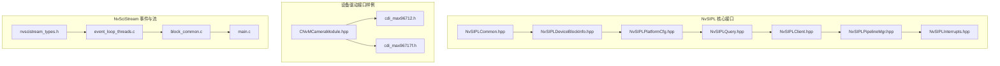
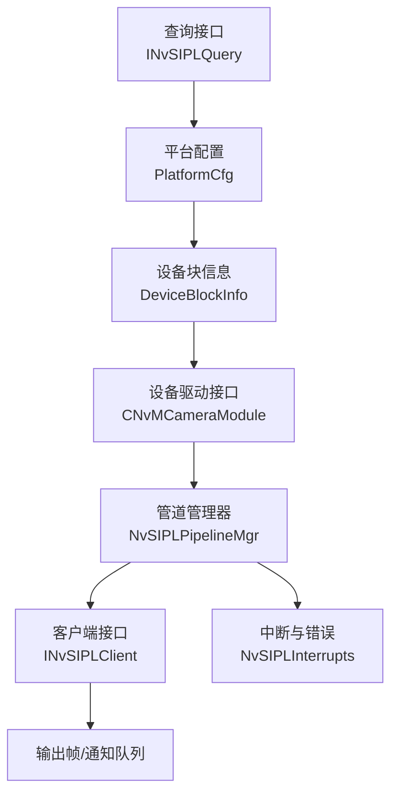
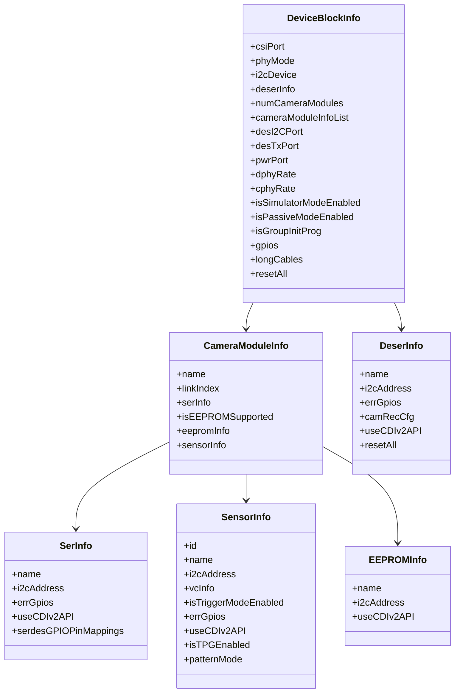
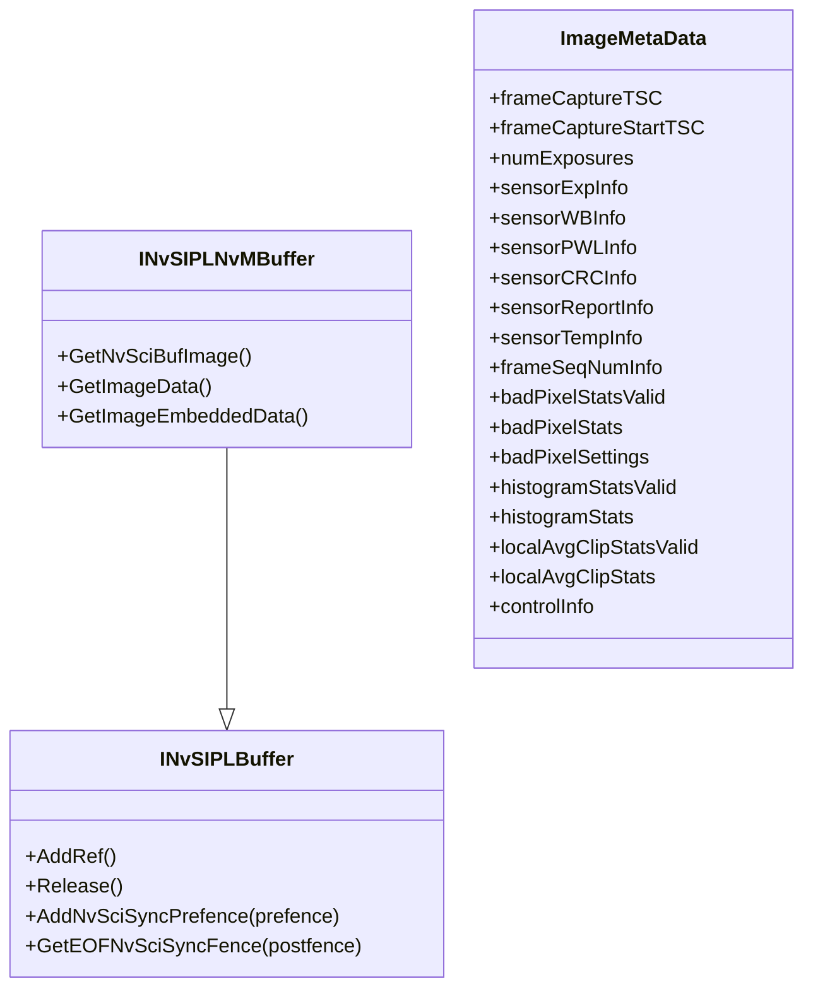
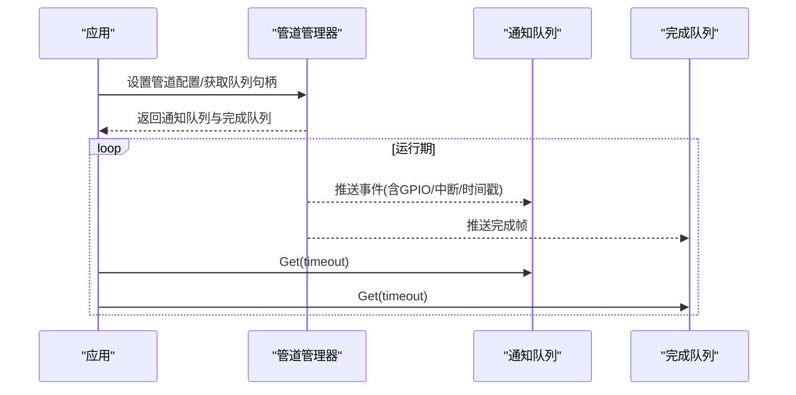
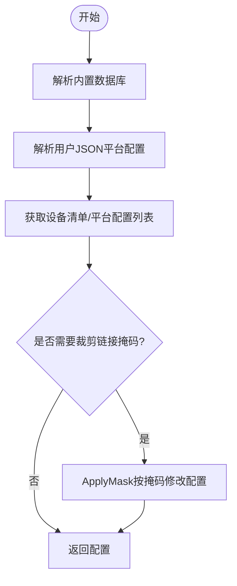
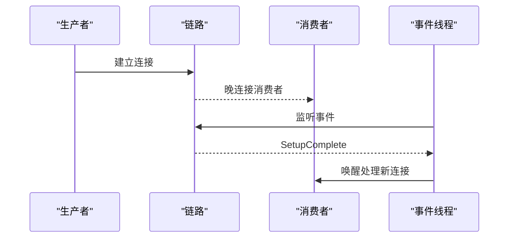
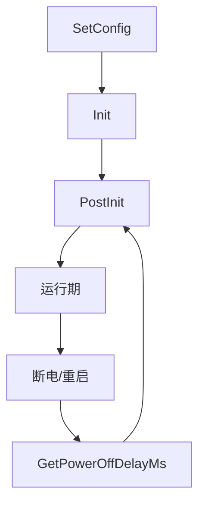
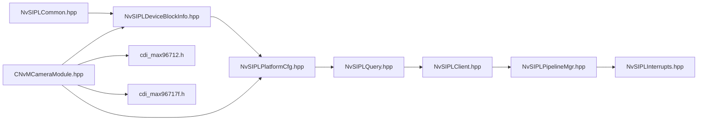

# 设备管理与控制

<cite>
**本文引用的文件**
- [NvSIPLDeviceBlockInfo.hpp](file://driveos-6.0.5.0/drive-linux/include/NvSIPLDeviceBlockInfo.hpp)
- [NvSIPLPipelineMgr.hpp](file://driveos-6.0.5.0/drive-linux/include/NvSIPLPipelineMgr.hpp)
- [NvSIPLClient.hpp](file://driveos-6.0.5.0/drive-linux/include/NvSIPLClient.hpp)
- [NvSIPLQuery.hpp](file://driveos-6.0.5.0/drive-linux/include/NvSIPLQuery.hpp)
- [NvSIPLCommon.hpp](file://driveos-6.0.5.0/drive-linux/include/NvSIPLCommon.hpp)
- [NvSIPLPlatformCfg.hpp](file://driveos-6.0.5.0/drive-linux/include/NvSIPLPlatformCfg.hpp)
- [NvSIPLInterrupts.hpp](file://driveos-6.0.5.0/drive-linux/include/NvSIPLInterrupts.hpp)
- [CNvMCameraModule.hpp](file://driveos-6.0.5.0/drive-linux/samples/nvmedia/nvsipl/devblk/common/ddi/ModuleIF/CNvMCameraModule.hpp)
- [cdi_max96712.h](file://driveos-6081/drive-linux/samples/nvmedia/nvsipl/devblk/devices/MAX96712DeserializerDriver/cdi_max96712.h)
- [cdi_max96717f.h](file://driveos-6.0.5.0/drive-linux/samples/nvmedia/nvsipl/devblk/devices/MAX96717FSerializerDriver/cdi_max96717f.h)
- [nvscistream_types.h](file://driveos-6.0.6.0/usr/include/nvscistream_types.h)
- [event_loop_threads.c](file://driveos-60100/drive-linux/samples/nvsci/nvscistream/event/event_loop_threads.c)
- [block_common.c](file://driveos-60100/drive-linux/samples/nvsci/nvscistream/event/block_common.c)
- [main.c](file://driveos-6081/drive-linux/samples/nvsci/nvscistream/event/main.c)
</cite>

## 目录
1. [引言](#引言)
2. [项目结构](#项目结构)
3. [核心组件](#核心组件)
4. [架构总览](#架构总览)
5. [详细组件分析](#详细组件分析)
6. [依赖关系分析](#依赖关系分析)
7. [性能考量](#性能考量)
8. [故障排查指南](#故障排查指南)
9. [结论](#结论)
10. [附录](#附录)

## 引言
本文件面向NVIDIA DRIVE OS平台下的NvSIPL（Sensor Interface Pipeline Library）设备管理与控制能力，围绕设备块信息管理、客户端接口、管道管理器、设备查询接口、多设备协同与驱动接口开发进行系统化说明。文档以代码级事实为基础，结合架构图与流程图，帮助开发者快速理解设备初始化、配置、生命周期管理、状态监控、故障诊断与恢复策略，并提供热插拔、动态配置与资源管理的实现要点。

## 项目结构
NvSIPL相关头文件集中在include目录，设备驱动接口在samples中按设备类型组织；同时提供NvSciStream样例用于理解流式传输与事件处理机制。

**图表来源**
- [NvSIPLCommon.hpp:24-218](file://driveos-6.0.5.0/drive-linux/include/NvSIPLCommon.hpp#L24-L218)
- [NvSIPLDeviceBlockInfo.hpp:28-351](file://driveos-6.0.5.0/drive-linux/include/NvSIPLDeviceBlockInfo.hpp#L28-L351)
- [NvSIPLPlatformCfg.hpp:26-71](file://driveos-6.0.5.0/drive-linux/include/NvSIPLPlatformCfg.hpp#L26-L71)
- [NvSIPLQuery.hpp:28-289](file://driveos-6.0.5.0/drive-linux/include/NvSIPLQuery.hpp#L28-L289)
- [NvSIPLClient.hpp:40-367](file://driveos-6.0.5.0/drive-linux/include/NvSIPLClient.hpp#L40-L367)
- [NvSIPLPipelineMgr.hpp:30-504](file://driveos-6.0.5.0/drive-linux/include/NvSIPLPipelineMgr.hpp#L30-L504)
- [NvSIPLInterrupts.hpp:21-116](file://driveos-6.0.5.0/drive-linux/include/NvSIPLInterrupts.hpp#L21-L116)
- [CNvMCameraModule.hpp:1-200](file://driveos-6.0.5.0/drive-linux/samples/nvmedia/nvsipl/devblk/common/ddi/ModuleIF/CNvMCameraModule.hpp#L1-L200)
- [cdi_max96712.h:417-474](file://driveos-6081/drive-linux/samples/nvmedia/nvsipl/devblk/devices/MAX96712DeserializerDriver/cdi_max96712.h#L417-L474)
- [cdi_max96717f.h:112-152](file://driveos-6.0.5.0/drive-linux/samples/nvmedia/nvsipl/devblk/devices/MAX96717FSerializerDriver/cdi_max96717f.h#L112-L152)
- [nvscistream_types.h:350-384](file://driveos-6.0.6.0/usr/include/nvscistream_types.h#L350-L384)
- [event_loop_threads.c:32-85](file://driveos-60100/drive-linux/samples/nvsci/nvscistream/event/event_loop_threads.c#L32-L85)
- [block_common.c:164-211](file://driveos-60100/drive-linux/samples/nvsci/nvscistream/event/block_common.c#L164-L211)
- [main.c:220-399](file://driveos-6081/drive-linux/samples/nvsci/nvscistream/event/main.c#L220-L399)

**章节来源**
- [NvSIPLCommon.hpp:24-218](file://driveos-6.0.5.0/drive-linux/include/NvSIPLCommon.hpp#L24-L218)
- [NvSIPLDeviceBlockInfo.hpp:28-351](file://driveos-6.0.5.0/drive-linux/include/NvSIPLDeviceBlockInfo.hpp#L28-L351)
- [NvSIPLPlatformCfg.hpp:26-71](file://driveos-6.0.5.0/drive-linux/include/NvSIPLPlatformCfg.hpp#L26-L71)
- [NvSIPLQuery.hpp:28-289](file://driveos-6.0.5.0/drive-linux/include/NvSIPLQuery.hpp#L28-L289)
- [NvSIPLClient.hpp:40-367](file://driveos-6.0.5.0/drive-linux/include/NvSIPLClient.hpp#L40-L367)
- [NvSIPLPipelineMgr.hpp:30-504](file://driveos-6.0.5.0/drive-linux/include/NvSIPLPipelineMgr.hpp#L30-L504)
- [NvSIPLInterrupts.hpp:21-116](file://driveos-6.0.5.0/drive-linux/include/NvSIPLInterrupts.hpp#L21-L116)
- [CNvMCameraModule.hpp:1-200](file://driveos-6.0.5.0/drive-linux/samples/nvmedia/nvsipl/devblk/common/ddi/ModuleIF/CNvMCameraModule.hpp#L1-L200)
- [cdi_max96712.h:417-474](file://driveos-6081/drive-linux/samples/nvmedia/nvsipl/devblk/devices/MAX96712DeserializerDriver/cdi_max96712.h#L417-L474)
- [cdi_max96717f.h:112-152](file://driveos-6.0.5.0/drive-linux/samples/nvmedia/nvsipl/devblk/devices/MAX96717FSerializerDriver/cdi_max96717f.h#L112-L152)
- [nvscistream_types.h:350-384](file://driveos-6.0.6.0/usr/include/nvscistream_types.h#L350-L384)
- [event_loop_threads.c:32-85](file://driveos-60100/drive-linux/samples/nvsci/nvscistream/event/event_loop_threads.c#L32-L85)
- [block_common.c:164-211](file://driveos-60100/drive-linux/samples/nvsci/nvscistream/event/block_common.c#L164-L211)
- [main.c:220-399](file://driveos-6081/drive-linux/samples/nvsci/nvscistream/event/main.c#L220-L399)

## 核心组件
- 设备块信息模型：定义传感器、EEPROM、序列化器、反序列化器、相机模组及CSI端口、数据速率等硬件参数。
- 平台配置：描述平台名称、配置名、设备块数量与列表，支撑多设备块与多链接的组合。
- 查询接口：解析内置数据库与用户JSON，提供设备清单与平台配置列表，支持掩码裁剪启用链接。
- 客户端接口：抽象图像缓冲、元数据、嵌入数据与NvSci同步对象，统一输出接口。
- 管道管理器：提供通知队列、完成队列、设备块通知队列、管道配置与写入器接口，支撑多ISP输出与统计覆盖。
- 中断与错误：中断码枚举，GPIO事件与模块错误读取标志，支撑设备级故障定位。
- 驱动接口：相机模组抽象接口，定义初始化、后初始化、电源管理、链路模式等，驱动需实现相应能力。

**章节来源**
- [NvSIPLDeviceBlockInfo.hpp:295-345](file://driveos-6.0.5.0/drive-linux/include/NvSIPLDeviceBlockInfo.hpp#L295-L345)
- [NvSIPLPlatformCfg.hpp:52-65](file://driveos-6.0.5.0/drive-linux/include/NvSIPLPlatformCfg.hpp#L52-L65)
- [NvSIPLQuery.hpp:50-281](file://driveos-6.0.5.0/drive-linux/include/NvSIPLQuery.hpp#L50-L281)
- [NvSIPLClient.hpp:52-361](file://driveos-6.0.5.0/drive-linux/include/NvSIPLClient.hpp#L52-L361)
- [NvSIPLPipelineMgr.hpp:44-497](file://driveos-6.0.5.0/drive-linux/include/NvSIPLPipelineMgr.hpp#L44-L497)
- [NvSIPLInterrupts.hpp:27-111](file://driveos-6.0.5.0/drive-linux/include/NvSIPLInterrupts.hpp#L27-L111)
- [CNvMCameraModule.hpp:43-198](file://driveos-6.0.5.0/drive-linux/samples/nvmedia/nvsipl/devblk/common/ddi/ModuleIF/CNvMCameraModule.hpp#L43-L198)

## 架构总览
NvSIPL采用“查询—配置—驱动—管道”的分层架构：应用通过查询接口获取平台配置与设备清单，随后基于平台配置构建设备块拓扑；驱动层负责具体设备的初始化与控制；管道管理器负责流水线调度、通知与输出队列；客户端通过统一接口消费输出帧与事件。

**图表来源**
- [NvSIPLQuery.hpp:50-281](file://driveos-6.0.5.0/drive-linux/include/NvSIPLQuery.hpp#L50-L281)
- [NvSIPLPlatformCfg.hpp:52-65](file://driveos-6.0.5.0/drive-linux/include/NvSIPLPlatformCfg.hpp#L52-L65)
- [NvSIPLDeviceBlockInfo.hpp:295-345](file://driveos-6.0.5.0/drive-linux/include/NvSIPLDeviceBlockInfo.hpp#L295-L345)
- [CNvMCameraModule.hpp:43-198](file://driveos-6.0.5.0/drive-linux/samples/nvmedia/nvsipl/devblk/common/ddi/ModuleIF/CNvMCameraModule.hpp#L43-L198)
- [NvSIPLPipelineMgr.hpp:44-497](file://driveos-6.0.5.0/drive-linux/include/NvSIPLPipelineMgr.hpp#L44-L497)
- [NvSIPLClient.hpp:52-361](file://driveos-6.0.5.0/drive-linux/include/NvSIPLClient.hpp#L52-L361)
- [NvSIPLInterrupts.hpp:27-111](file://driveos-6.0.5.0/drive-linux/include/NvSIPLInterrupts.hpp#L27-L111)

## 详细组件分析

### 设备块信息管理
- 关键结构体：DeviceBlockInfo、CameraModuleInfo、SerInfo、SensorInfo、EEPROMInfo、DeserInfo及其内嵌子结构，涵盖分辨率、像素格式、帧率、触发模式、GPIO中断、CDI版本、长线缆支持、复位序列等。
- 限制与约束：每平台最大设备块数、每设备块最大相机模组数、每平台最大传感器数、CSI链路配置上限等。
- 模拟器与被动模式：支持模拟器模式与被动模式，便于离线与无I2C控制场景。

**图表来源**
- [NvSIPLDeviceBlockInfo.hpp:295-345](file://driveos-6.0.5.0/drive-linux/include/NvSIPLDeviceBlockInfo.hpp#L295-L345)
- [NvSIPLDeviceBlockInfo.hpp:240-260](file://driveos-6.0.5.0/drive-linux/include/NvSIPLDeviceBlockInfo.hpp#L240-L260)
- [NvSIPLDeviceBlockInfo.hpp:208-234](file://driveos-6.0.5.0/drive-linux/include/NvSIPLDeviceBlockInfo.hpp#L208-L234)
- [NvSIPLDeviceBlockInfo.hpp:89-182](file://driveos-6.0.5.0/drive-linux/include/NvSIPLDeviceBlockInfo.hpp#L89-L182)
- [NvSIPLDeviceBlockInfo.hpp:184-200](file://driveos-6.0.5.0/drive-linux/include/NvSIPLDeviceBlockInfo.hpp#L184-L200)
- [NvSIPLDeviceBlockInfo.hpp:262-287](file://driveos-6.0.5.0/drive-linux/include/NvSIPLDeviceBlockInfo.hpp#L262-L287)

**章节来源**
- [NvSIPLDeviceBlockInfo.hpp:41-87](file://driveos-6.0.5.0/drive-linux/include/NvSIPLDeviceBlockInfo.hpp#L41-L87)
- [NvSIPLDeviceBlockInfo.hpp:295-345](file://driveos-6.0.5.0/drive-linux/include/NvSIPLDeviceBlockInfo.hpp#L295-L345)

### 客户端接口与缓冲抽象
- INvSIPLBuffer/INvSIPLNvMBuffer：统一缓冲生命周期管理（AddRef/Release），支持NvSciSync Fence（预/后）传递。
- 元数据与嵌入数据：ImageMetaData与ImageEmbeddedData封装时间戳、曝光、白平衡、CRC、温度、帧序号、ISP直方图/坏点等统计与设置。
- 输出类型：支持ICP、ISP0、ISP1、ISP2等多输出选择。

**图表来源**
- [NvSIPLClient.hpp:131-346](file://driveos-6.0.5.0/drive-linux/include/NvSIPLClient.hpp#L131-L346)

**章节来源**
- [NvSIPLClient.hpp:55-124](file://driveos-6.0.5.0/drive-linux/include/NvSIPLClient.hpp#L55-L124)
- [NvSIPLClient.hpp:263-346](file://driveos-6.0.5.0/drive-linux/include/NvSIPLClient.hpp#L263-L346)

### 管道管理器与通知队列
- 通知器接口：NvSIPLPipelineNotifier定义丰富的事件类型（ICP/ISP/ACP/CDI完成、帧丢弃/不连续/超时、各类错误、内部失败等），并携带GPIO索引、中断码与时间戳。
- 队列接口：INvSIPLFrameCompletionQueue/INvSIPLNotificationQueue提供阻塞/超时获取与长度查询，支持多ISP输出队列与设备块通知队列数组。
- 管道配置：NvSIPLPipelineConfiguration支持请求不同输出、下采样裁剪、ISP统计覆盖与子帧功能；可选NvSIPLImageGroupWriter用于ISP重处理模式。

**图表来源**
- [NvSIPLPipelineMgr.hpp:44-497](file://driveos-6.0.5.0/drive-linux/include/NvSIPLPipelineMgr.hpp#L44-L497)

**章节来源**
- [NvSIPLPipelineMgr.hpp:51-200](file://driveos-6.0.5.0/drive-linux/include/NvSIPLPipelineMgr.hpp#L51-L200)
- [NvSIPLPipelineMgr.hpp:255-288](file://driveos-6.0.5.0/drive-linux/include/NvSIPLPipelineMgr.hpp#L255-L288)
- [NvSIPLPipelineMgr.hpp:293-372](file://driveos-6.0.5.0/drive-linux/include/NvSIPLPipelineMgr.hpp#L293-L372)
- [NvSIPLPipelineMgr.hpp:377-453](file://driveos-6.0.5.0/drive-linux/include/NvSIPLPipelineMgr.hpp#L377-L453)
- [NvSIPLPipelineMgr.hpp:455-497](file://driveos-6.0.5.0/drive-linux/include/NvSIPLPipelineMgr.hpp#L455-L497)

### 设备查询接口
- 数据库解析：ParseDatabase加载内置设备数据库；ParseJsonFile解析用户自定义平台配置。
- 列表与检索：GetDeviceInfoList返回设备清单；GetPlatformCfgList返回平台配置列表；GetPlatformCfg按名称获取配置。
- 掩码裁剪：ApplyMask根据掩码向平台配置注入启用链接集合，支持多设备块。

**图表来源**
- [NvSIPLQuery.hpp:117-276](file://driveos-6.0.5.0/drive-linux/include/NvSIPLQuery.hpp#L117-L276)

**章节来源**
- [NvSIPLQuery.hpp:50-281](file://driveos-6.0.5.0/drive-linux/include/NvSIPLQuery.hpp#L50-L281)

### 多设备协同与热插拔
- 多设备块：平台配置支持多个设备块，每个设备块可挂载多个相机模组，驱动需实现按设备块/链接的初始化与后初始化。
- 热插拔与晚连接：NvSciStream支持晚连接消费者，事件循环线程在收到SetupComplete后唤醒处理后续连接，确保多播/单播场景的动态接入。
- 协调机制：通过通知队列与完成队列，客户端可并行处理来自不同设备块/链接的事件与帧；驱动侧在PostInit阶段执行仅在链路启用后的初始化步骤。

**图表来源**
- [block_common.c:213-242](file://driveos-60100/drive-linux/samples/nvsci/nvscistream/event/block_common.c#L213-L242)
- [event_loop_threads.c:52-66](file://driveos-60100/drive-linux/samples/nvsci/nvscistream/event/event_loop_threads.c#L52-L66)
- [main.c:220-399](file://driveos-6081/drive-linux/samples/nvsci/nvscistream/event/main.c#L220-L399)

**章节来源**
- [CNvMCameraModule.hpp:318-353](file://driveos-6.0.5.0/drive-linux/samples/nvmedia/nvsipl/devblk/common/ddi/ModuleIF/CNvMCameraModule.hpp#L318-L353)
- [nvscistream_types.h:350-384](file://driveos-6.0.6.0/usr/include/nvscistream_types.h#L350-L384)

### 设备驱动接口开发指南与最佳实践
- 必须实现的生命周期：
  - SetConfig：在上电前完成配置与VCID分配。
  - Init：在供电开启、配置已提供但链路未启用时完成初始化。
  - PostInit：在上游链路启用后执行依赖链路的初始化。
  - GetPowerOffDelayMs：设备断电后重启延时。
  - GetLinkMode：返回GMSL1/GMSL2链路模式。
- 电源与复位：遵循设备块信息中的电源端口、复位序列与被动/模拟器模式。
- 错误与中断：注册GPIO中断，解析中断码，上报到通知队列；支持模块错误读取（传感器/序列化器/全部）。
- 性能与同步：合理使用NvSciSync Fence，避免阻塞；在多设备块场景下并行初始化与后初始化，缩短启动时间。

**图表来源**
- [CNvMCameraModule.hpp:232-353](file://driveos-6.0.5.0/drive-linux/samples/nvmedia/nvsipl/devblk/common/ddi/ModuleIF/CNvMCameraModule.hpp#L232-L353)

**章节来源**
- [CNvMCameraModule.hpp:43-198](file://driveos-6.0.5.0/drive-linux/samples/nvmedia/nvsipl/devblk/common/ddi/ModuleIF/CNvMCameraModule.hpp#L43-L198)
- [cdi_max96712.h:417-474](file://driveos-6081/drive-linux/samples/nvmedia/nvsipl/devblk/devices/MAX96712DeserializerDriver/cdi_max96712.h#L417-L474)
- [cdi_max96717f.h:112-152](file://driveos-6.0.5.0/drive-linux/samples/nvmedia/nvsipl/devblk/devices/MAX96717FSerializerDriver/cdi_max96717f.h#L112-L152)

## 依赖关系分析
- 组件耦合：
  - NvSIPLQuery依赖NvSIPLCommon与NvSIPLPlatformCfg，后者依赖NvSIPLDeviceBlockInfo。
  - NvSIPLClient与NvSIPLPipelineMgr相互配合，前者消费后者提供的队列。
  - 驱动接口CNvMCameraModule依赖平台配置与设备块信息，驱动实现决定初始化顺序与能力。
- 外部依赖：
  - NvSciStream/NvSciBuf/NvSciSync用于跨进程/跨线程同步与缓冲管理。
  - 设备驱动接口（如MAX96712/96717F）提供寄存器读写、参数写入与温度等能力。

**图表来源**
- [NvSIPLCommon.hpp:24-218](file://driveos-6.0.5.0/drive-linux/include/NvSIPLCommon.hpp#L24-L218)
- [NvSIPLDeviceBlockInfo.hpp:28-351](file://driveos-6.0.5.0/drive-linux/include/NvSIPLDeviceBlockInfo.hpp#L28-L351)
- [NvSIPLPlatformCfg.hpp:26-71](file://driveos-6.0.5.0/drive-linux/include/NvSIPLPlatformCfg.hpp#L26-L71)
- [NvSIPLQuery.hpp:28-289](file://driveos-6.0.5.0/drive-linux/include/NvSIPLQuery.hpp#L28-L289)
- [NvSIPLClient.hpp:40-367](file://driveos-6.0.5.0/drive-linux/include/NvSIPLClient.hpp#L40-L367)
- [NvSIPLPipelineMgr.hpp:30-504](file://driveos-6.0.5.0/drive-linux/include/NvSIPLPipelineMgr.hpp#L30-L504)
- [NvSIPLInterrupts.hpp:21-116](file://driveos-6.0.5.0/drive-linux/include/NvSIPLInterrupts.hpp#L21-L116)
- [CNvMCameraModule.hpp:1-200](file://driveos-6.0.5.0/drive-linux/samples/nvmedia/nvsipl/devblk/common/ddi/ModuleIF/CNvMCameraModule.hpp#L1-L200)
- [cdi_max96712.h:417-474](file://driveos-6081/drive-linux/samples/nvmedia/nvsipl/devblk/devices/MAX96712DeserializerDriver/cdi_max96712.h#L417-L474)
- [cdi_max96717f.h:112-152](file://driveos-6.0.5.0/drive-linux/samples/nvmedia/nvsipl/devblk/devices/MAX96717FSerializerDriver/cdi_max96717f.h#L112-L152)

**章节来源**
- [NvSIPLCommon.hpp:24-218](file://driveos-6.0.5.0/drive-linux/include/NvSIPLCommon.hpp#L24-L218)
- [NvSIPLDeviceBlockInfo.hpp:28-351](file://driveos-6.0.5.0/drive-linux/include/NvSIPLDeviceBlockInfo.hpp#L28-L351)
- [NvSIPLPlatformCfg.hpp:26-71](file://driveos-6.0.5.0/drive-linux/include/NvSIPLPlatformCfg.hpp#L26-L71)
- [NvSIPLQuery.hpp:28-289](file://driveos-6.0.5.0/drive-linux/include/NvSIPLQuery.hpp#L28-L289)
- [NvSIPLClient.hpp:40-367](file://driveos-6.0.5.0/drive-linux/include/NvSIPLClient.hpp#L40-L367)
- [NvSIPLPipelineMgr.hpp:30-504](file://driveos-6.0.5.0/drive-linux/include/NvSIPLPipelineMgr.hpp#L30-L504)
- [NvSIPLInterrupts.hpp:21-116](file://driveos-6.0.5.0/drive-linux/include/NvSIPLInterrupts.hpp#L21-L116)
- [CNvMCameraModule.hpp:1-200](file://driveos-6.0.5.0/drive-linux/samples/nvmedia/nvsipl/devblk/common/ddi/ModuleIF/CNvMCameraModule.hpp#L1-L200)
- [cdi_max96712.h:417-474](file://driveos-6081/drive-linux/samples/nvmedia/nvsipl/devblk/devices/MAX96712DeserializerDriver/cdi_max96712.h#L417-L474)
- [cdi_max96717f.h:112-152](file://driveos-6.0.5.0/drive-linux/samples/nvmedia/nvsipl/devblk/devices/MAX96717FSerializerDriver/cdi_max96717f.h#L112-L152)

## 性能考量
- 启动时间优化：在支持组初始化的平台上，利用设备块级并行初始化与后初始化，减少链路启用前的等待；合理设置CSI数据速率（DPHY/CPHY）与链路掩码。
- 资源管理：NvSciBuf/NvSciSync对象的注册/映射与释放需成对出现，避免资源泄漏；在多设备块场景下，注意同步对象的最大注册数量与冲突协调。
- 队列吞吐：完成队列与通知队列的长度与超时设置应匹配应用处理能力，避免阻塞或空转。
- 功耗与热插拔：在热插拔场景下，延迟重启与链路复位序列有助于稳定连接；长线缆场景需考虑信号完整性与重试策略。

[本节为通用指导，无需特定文件引用]

## 故障排查指南
- 中断与错误码：通过NvSIPLInterrupts枚举识别设备块/链接级失败与超时；在通知队列中获取中断码与GPIO索引，辅助定位故障模块。
- 模块错误读取：使用SIPLModuleErrorReadFlag区分读取传感器/序列化器/全部错误信息，结合错误缓冲大小与写入量判断驱动填充情况。
- 驱动接口验证：确认SetConfig/Init/PostInit调用顺序正确；检查GPIO中断回调与事件上报；核对链路掩码与设备块配置一致性。
- NvSciStream事件：关注Error/Disconnected/Connected/SetupComplete等事件，必要时增加事件线程与晚连接处理逻辑。

**章节来源**
- [NvSIPLInterrupts.hpp:27-111](file://driveos-6.0.5.0/drive-linux/include/NvSIPLInterrupts.hpp#L27-L111)
- [NvSIPLCommon.hpp:174-212](file://driveos-6.0.5.0/drive-linux/include/NvSIPLCommon.hpp#L174-L212)
- [block_common.c:164-211](file://driveos-60100/drive-linux/samples/nvsci/nvscistream/event/block_common.c#L164-L211)

## 结论
NvSIPL通过清晰的设备块信息模型、平台配置与查询接口，提供了从硬件到软件的完整抽象；管道管理器与客户端接口统一了输出与事件通道；驱动接口规范了初始化与生命周期管理。结合NvSciStream的事件与同步机制，可在多设备块、多链接场景下实现高可靠、低延迟的图像采集与处理。建议在实际部署中重点关注启动并行化、资源配额与事件处理的健壮性，以获得最佳性能与稳定性。

[本节为总结性内容，无需特定文件引用]

## 附录
- 实际使用参考路径（不含代码内容）：
  - 设备块信息结构体定义：[NvSIPLDeviceBlockInfo.hpp:295-345](file://driveos-6.0.5.0/drive-linux/include/NvSIPLDeviceBlockInfo.hpp#L295-L345)
  - 平台配置与设备清单：[NvSIPLPlatformCfg.hpp:52-65](file://driveos-6.0.5.0/drive-linux/include/NvSIPLPlatformCfg.hpp#L52-L65)
  - 查询接口与JSON解析：[NvSIPLQuery.hpp:117-276](file://driveos-6.0.5.0/drive-linux/include/NvSIPLQuery.hpp#L117-L276)
  - 客户端缓冲与元数据：[NvSIPLClient.hpp:131-346](file://driveos-6.0.5.0/drive-linux/include/NvSIPLClient.hpp#L131-L346)
  - 管道配置与队列接口：[NvSIPLPipelineMgr.hpp:255-497](file://driveos-6.0.5.0/drive-linux/include/NvSIPLPipelineMgr.hpp#L255-L497)
  - 中断码与错误读取：[NvSIPLInterrupts.hpp:27-111](file://driveos-6.0.5.0/drive-linux/include/NvSIPLInterrupts.hpp#L27-L111)
  - 相机模组驱动接口：[CNvMCameraModule.hpp:232-353](file://driveos-6.0.5.0/drive-linux/samples/nvmedia/nvsipl/devblk/common/ddi/ModuleIF/CNvMCameraModule.hpp#L232-L353)
  - 反序列化器驱动示例：[cdi_max96712.h:417-474](file://driveos-6081/drive-linux/samples/nvmedia/nvsipl/devblk/devices/MAX96712DeserializerDriver/cdi_max96712.h#L417-L474)
  - 序列化器驱动示例：[cdi_max96717f.h:112-152](file://driveos-6.0.5.0/drive-linux/samples/nvmedia/nvsipl/devblk/devices/MAX96717FSerializerDriver/cdi_max96717f.h#L112-L152)
  - NvSciStream事件与线程：[nvscistream_types.h:350-384](file://driveos-6.0.6.0/usr/include/nvscistream_types.h#L350-L384), [event_loop_threads.c:52-66](file://driveos-60100/drive-linux/samples/nvsci/nvscistream/event/event_loop_threads.c#L52-L66), [block_common.c:213-242](file://driveos-60100/drive-linux/samples/nvsci/nvscistream/event/block_common.c#L213-L242), [main.c:220-399](file://driveos-6081/drive-linux/samples/nvsci/nvscistream/event/main.c#L220-L399)