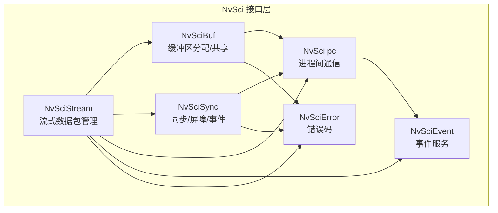
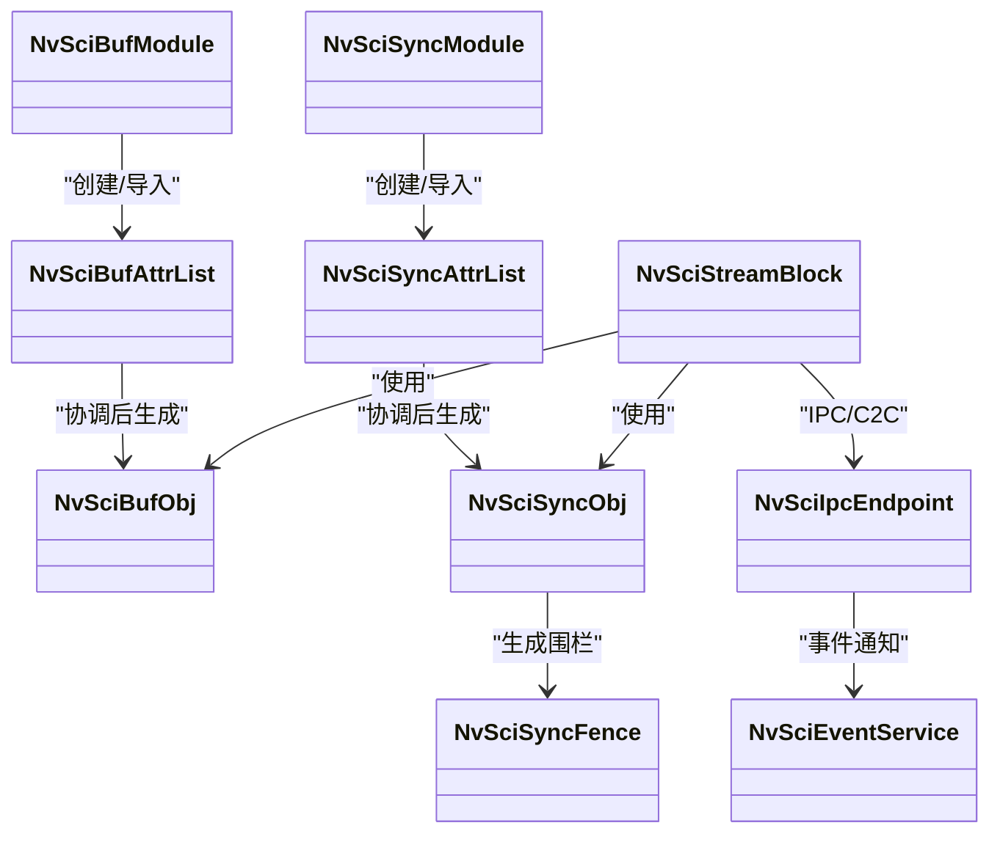
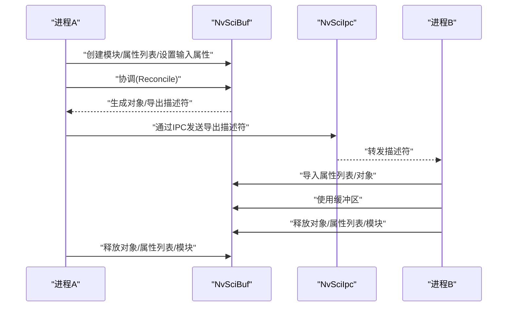
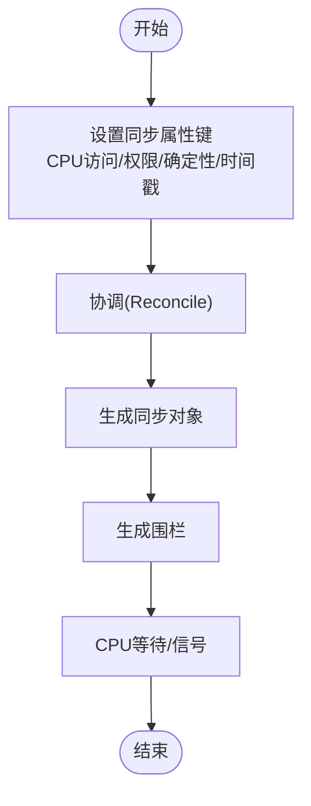
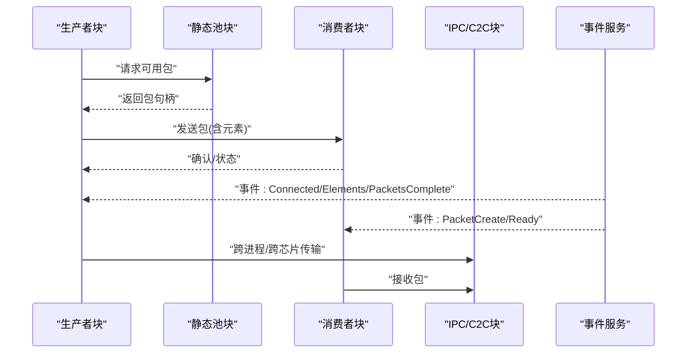
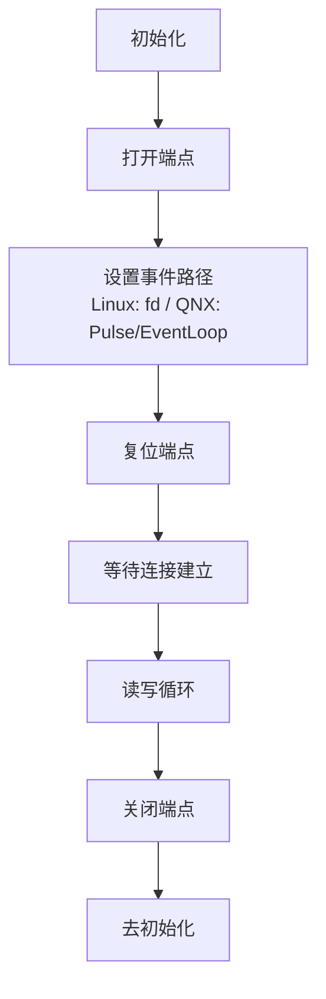
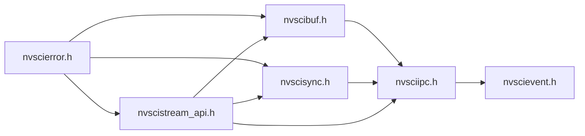

# NvSci 通信接口层

<cite>
**本文引用的文件**
- [nvscibuf.h](file://driveos-6.0.5.0/usr/include/nvscibuf.h)
- [nvscistream.h](file://driveos-6.0.5.0/usr/include/nvscistream.h)
- [nvscistream_api.h](file://driveos-6.0.5.0/usr/include/nvscistream_api.h)
- [nvscistream_types.h](file://driveos-6.0.5.0/usr/include/nvscistream_types.h)
- [nvscisync.h](file://driveos-6.0.5.0/usr/include/nvscisync.h)
- [nvscierror.h](file://driveos-6.0.5.0/usr/include/nvscierror.h)
- [nvsciipc.h](file://driveos-6.0.5.0/usr/include/nvsciipc.h)
- [nvscievent.h](file://driveos-6.0.5.0/usr/include/nvscievent.h)
</cite>

## 目录
1. [简介](#简介)
2. [项目结构](#项目结构)
3. [核心组件](#核心组件)
4. [架构总览](#架构总览)
5. [详细组件分析](#详细组件分析)
6. [依赖关系分析](#依赖关系分析)
7. [性能考量](#性能考量)
8. [故障排查指南](#故障排查指南)
9. [结论](#结论)
10. [附录](#附录)

## 简介
本技术文档面向NVIDIA软件通信接口（SCI）的NvSci通信接口层，系统化阐述其设计理念、架构原理与实现细节。重点覆盖以下方面：
- 缓冲区管理（NvSciBuf）：内存共享机制、跨进程/跨芯片（C2C）共享、属性协商与导出/导入流程。
- 流式数据传输（NvSciStream）：块模型、连接拓扑、元素与包的生命周期、等待/信号同步、事件驱动的运行时。
- 同步机制（NvSciSync）：事件同步、屏障同步、确定性栅栏、CPU等待上下文与任务状态缓冲。
- 错误处理与状态管理：统一错误码体系、模块生命周期、对象有效性约束。
- 集成与使用：与NvSIPL/NvMedia的结合点（如张量、图像、Dla等），以及IPC与事件服务的协同。

## 项目结构
NvSci相关头文件集中在驱动版本目录下的include路径中，按功能划分为：
- 缓冲区接口：nvscibuf.h
- 同步接口：nvscisync.h
- 流接口：nvscistream.h、nvscistream_api.h、nvscistream_types.h
- IPC与事件：nvsciipc.h、nvscievent.h
- 错误码：nvscierror.h

图表来源
- [nvscibuf.h](file://driveos-6.0.5.0/usr/include/nvscibuf.h)
- [nvscisync.h](file://driveos-6.0.5.0/usr/include/nvscisync.h)
- [nvscistream.h](file://driveos-6.0.5.0/usr/include/nvscistream.h)
- [nvscistream_api.h](file://driveos-6.0.5.0/usr/include/nvscistream_api.h)
- [nvsciipc.h](file://driveos-6.0.5.0/usr/include/nvsciipc.h)
- [nvscievent.h](file://driveos-6.0.5.0/usr/include/nvscievent.h)
- [nvscierror.h](file://driveos-6.0.5.0/usr/include/nvscierror.h)

章节来源
- [nvscibuf.h:1-120](file://driveos-6.0.5.0/usr/include/nvscibuf.h#L1-L120)
- [nvscisync.h:10-120](file://driveos-6.0.5.0/usr/include/nvscisync.h#L10-L120)
- [nvscistream.h:10-32](file://driveos-6.0.5.0/usr/include/nvscistream.h#L10-L32)
- [nvscistream_api.h:10-40](file://driveos-6.0.5.0/usr/include/nvscistream_api.h#L10-L40)
- [nvsciipc.h:50-120](file://driveos-6.0.5.0/usr/include/nvsciipc.h#L50-L120)
- [nvscievent.h:40-120](file://driveos-6.0.5.0/usr/include/nvscievent.h#L40-L120)
- [nvscierror.h:20-120](file://driveos-6.0.5.0/usr/include/nvscierror.h#L20-L120)

## 核心组件
- NvSciBuf：提供缓冲区分配、属性协商、导出/导入、CPU/GPU缓存一致性控制、多GPU/VIDMEM域支持等能力，支撑跨进程/跨芯片共享。
- NvSciSync：提供同步对象、围栏（fence）、CPU等待上下文、任务状态缓冲、确定性栅栏等，用于事件同步与屏障同步。
- NvSciStream：在Buf与Sync之上构建流式数据包管理，通过块（block）模型组织生产者、消费者、池、队列、多播、IPC/C2C等拓扑，并以事件驱动的方式推进阶段化配置与运行。
- NvSciIpc/NvSciEvent：提供跨进程/跨芯片通信通道与事件抽象，配合Stream/Buf/Sync完成端到端的数据与同步信息传递。
- NvSciError：统一错误码体系，覆盖通用、Buf、Sync、Stream、IPC、Event等子域。

章节来源
- [nvscibuf.h:100-200](file://driveos-6.0.5.0/usr/include/nvscibuf.h#L100-L200)
- [nvscisync.h:160-240](file://driveos-6.0.5.0/usr/include/nvscisync.h#L160-L240)
- [nvscistream_api.h:120-200](file://driveos-6.0.5.0/usr/include/nvscistream_api.h#L120-L200)
- [nvsciipc.h:320-420](file://driveos-6.0.5.0/usr/include/nvsciipc.h#L320-L420)
- [nvscievent.h:140-220](file://driveos-6.0.5.0/usr/include/nvscievent.h#L140-L220)
- [nvscierror.h:40-280](file://driveos-6.0.5.0/usr/include/nvscierror.h#L40-L280)

## 架构总览
NvSci采用“模块-属性列表-对象”的分层设计：
- 模块（Module）：打开/关闭，承载资源与生命周期。
- 属性列表（AttrList）：输入/输出属性集合，支持未协调/已协调两种形态；通过协商达成跨进程/跨芯片的一致视图。
- 对象（Obj/Fence）：最终可导入/导出的实体，承载实际的缓冲区或同步原语。

图表来源
- [nvscibuf.h:190-210](file://driveos-6.0.5.0/usr/include/nvscibuf.h#L190-L210)
- [nvscisync.h:190-210](file://driveos-6.0.5.0/usr/include/nvscisync.h#L190-L210)
- [nvscistream_api.h:190-210](file://driveos-6.0.5.0/usr/include/nvscistream_api.h#L190-L210)
- [nvsciipc.h:280-320](file://driveos-6.0.5.0/usr/include/nvsciipc.h#L280-L320)
- [nvscievent.h:150-190](file://driveos-6.0.5.0/usr/include/nvscievent.h#L150-L190)

## 详细组件分析

### NvSciBuf 缓冲区管理
- 设计理念
  - 通过属性键值对表达缓冲区需求（类型、尺寸、对齐、CPU/GPU访问权限、缓存策略、压缩、GPU域等），经由协商达成一致，再生成可跨边界共享的对象。
  - 支持多种数据类型（原始缓冲、图像、张量、数组、金字塔等），并提供最大维度/平面数/层级限制常量。
- 内存共享与跨进程/跨芯片
  - 通过导出/导入机制在进程间或芯片间传递缓冲区句柄；导出描述符大小固定，确保跨端互操作。
  - CPU/GPU缓存一致性与显存域（sysmem/vidmem）策略在属性层面明确，避免竞态与脏数据。
- 关键流程
  - 创建模块 -> 创建/克隆属性列表 -> 设置输入属性 -> 协调（Reconcile） -> 生成对象 -> 导入/使用 -> 释放
- API要点
  - 模块打开/关闭、属性列表创建/克隆/导入/释放、对象分配/导入/复制/释放、缓存维护接口等。

图表来源
- [nvscibuf.h:330-420](file://driveos-6.0.5.0/usr/include/nvscibuf.h#L330-L420)
- [nvsciipc.h:420-520](file://driveos-6.0.5.0/usr/include/nvsciipc.h#L420-L520)

章节来源
- [nvscibuf.h:110-200](file://driveos-6.0.5.0/usr/include/nvscibuf.h#L110-L200)
- [nvscibuf.h:330-520](file://driveos-6.0.5.0/usr/include/nvscibuf.h#L330-L520)

### NvSciSync 同步机制
- 设计理念
  - 提供等待/信号能力，支持CPU等待上下文、时间戳槽位、任务状态槽位、确定性围栏等高级特性。
  - 通过属性键（是否需要CPU访问、所需权限、是否要求确定性围栏、时间戳槽位数等）进行协商，确保跨端一致性。
- 事件同步与屏障同步
  - 使用围栏（Fence）表达“到达某时刻”这一条件；多个同步对象可组合形成屏障。
  - 支持确定性栅栏，便于在不导入围栏的情况下由等待方侧生成。
- 关键流程
  - 创建模块 -> 创建/导入属性列表 -> 设置同步属性 -> 协调 -> 生成同步对象 -> 生成/导入围栏 -> 等待/信号 -> 释放

图表来源
- [nvscisync.h:380-520](file://driveos-6.0.5.0/usr/include/nvscisync.h#L380-L520)
- [nvscisync.h:570-750](file://driveos-6.0.5.0/usr/include/nvscisync.h#L570-L750)

章节来源
- [nvscisync.h:380-520](file://driveos-6.0.5.0/usr/include/nvscisync.h#L380-L520)
- [nvscisync.h:570-750](file://driveos-6.0.5.0/usr/include/nvscisync.h#L570-L750)

### NvSciStream 流式数据传输
- 设计理念
  - 基于块（Block）的树形拓扑：生产者、消费者、静态池、队列（FIFO/邮箱）、多播、IPC/C2C等。
  - 分阶段配置（Setup）：元素导出/导入、包导出/导入、等待者属性导出/导入、信号对象导出/导入。
  - 事件驱动：连接建立、元素就绪、包创建/删除/状态、设置完成、错误等事件贯穿生命周期。
- 关键流程
  - 连接拓扑 -> 元素阶段 -> 包阶段 -> 等待者/信号阶段 -> 运行时（生产/消费/回收）-> 停止/清理
- API要点
  - 块创建（生产者/消费者/池/队列/多播/IPC/C2C）-> 连接 -> 阶段化配置 -> 事件查询 -> 数据交换 -> 释放

图表来源
- [nvscistream_api.h:140-220](file://driveos-6.0.5.0/usr/include/nvscistream_api.h#L140-L220)
- [nvscistream_types.h:170-350](file://driveos-6.0.5.0/usr/include/nvscistream_types.h#L170-L350)
- [nvscistream_types.h:350-498](file://driveos-6.0.5.0/usr/include/nvscistream_types.h#L350-L498)

章节来源
- [nvscistream_api.h:140-220](file://driveos-6.0.5.0/usr/include/nvscistream_api.h#L140-L220)
- [nvscistream_types.h:170-350](file://driveos-6.0.5.0/usr/include/nvscistream_types.h#L170-L350)
- [nvscistream_types.h:350-498](file://driveos-6.0.5.0/usr/include/nvscistream_types.h#L350-L498)

### IPC 与事件服务
- 设计理念
  - NvSciIpc提供统一的读写接口与事件掩码，屏蔽不同后端（进程内、进程间、跨VM、跨SoC/C2C）差异。
  - NvSciEvent将OS特定的事件等待抽象为统一接口，便于与IPC/Stream集成。
- 关键流程
  - 初始化 -> 打开端点 -> 设置事件路径 -> 复位/等待连接 -> 读写循环 -> 关闭/去初始化

图表来源
- [nvsciipc.h:80-150](file://driveos-6.0.5.0/usr/include/nvsciipc.h#L80-L150)
- [nvsciipc.h:320-420](file://driveos-6.0.5.0/usr/include/nvsciipc.h#L320-L420)
- [nvscievent.h:470-540](file://driveos-6.0.5.0/usr/include/nvscievent.h#L470-L540)

章节来源
- [nvsciipc.h:80-150](file://driveos-6.0.5.0/usr/include/nvsciipc.h#L80-L150)
- [nvsciipc.h:320-420](file://driveos-6.0.5.0/usr/include/nvsciipc.h#L320-L420)
- [nvscievent.h:470-540](file://driveos-6.0.5.0/usr/include/nvscievent.h#L470-L540)

## 依赖关系分析
- 组件耦合
  - Stream依赖Buf与Sync，通过属性列表与对象在两端保持一致。
  - Buf/Sync均依赖IPC进行跨边界导入/导出；IPC与Event共同构成异步通知基础设施。
- 外部依赖
  - 错误码统一由nvscierror.h提供，各子域错误码范围明确，便于定位问题来源。
- 可能的环路
  - 通过模块与属性列表的生命周期管理，避免直接循环引用；对象释放顺序需遵循“先对象后属性列表后模块”。

图表来源
- [nvscierror.h:40-280](file://driveos-6.0.5.0/usr/include/nvscierror.h#L40-L280)
- [nvscibuf.h:190-210](file://driveos-6.0.5.0/usr/include/nvscibuf.h#L190-L210)
- [nvscisync.h:190-210](file://driveos-6.0.5.0/usr/include/nvscisync.h#L190-L210)
- [nvscistream_api.h:190-210](file://driveos-6.0.5.0/usr/include/nvscistream_api.h#L190-L210)
- [nvsciipc.h:280-320](file://driveos-6.0.5.0/usr/include/nvsciipc.h#L280-L320)
- [nvscievent.h:150-190](file://driveos-6.0.5.0/usr/include/nvscievent.h#L150-L190)

章节来源
- [nvscierror.h:40-280](file://driveos-6.0.5.0/usr/include/nvscierror.h#L40-L280)
- [nvscibuf.h:190-210](file://driveos-6.0.5.0/usr/include/nvscibuf.h#L190-L210)
- [nvscisync.h:190-210](file://driveos-6.0.5.0/usr/include/nvscisync.h#L190-L210)
- [nvscistream_api.h:190-210](file://driveos-6.0.5.0/usr/include/nvscistream_api.h#L190-L210)
- [nvsciipc.h:280-320](file://driveos-6.0.5.0/usr/include/nvsciipc.h#L280-L320)
- [nvscievent.h:150-190](file://driveos-6.0.5.0/usr/include/nvscievent.h#L150-L190)

## 性能考量
- 缓冲区与缓存
  - 合理设置CPU/GPU缓存策略与对齐，减少flush/cache开销；在多GPU场景下明确vidmem/sysmem域，避免不必要的带宽争用。
- 同步与围栏
  - 使用确定性围栏减少导入/导出成本；合理安排等待/信号时机，避免过度阻塞。
- 流式传输
  - 选择合适的队列类型（FIFO/邮箱）与多播输出数量；在元素/包阶段尽量一次性完成配置，减少往返。
- IPC
  - 使用事件服务统一等待，避免轮询；在QNX上建议使用私有脉冲池，防止风暴与拒绝服务。

## 故障排查指南
- 常见错误分类
  - 通用错误：参数无效、资源不足、状态不合法、超时等。
  - Buf错误：属性协商失败、导入导出异常、缓存一致性问题。
  - Sync错误：围栏已清除、权限不足、确定性功能不支持等。
  - Stream错误：未连接、非设置阶段、包不可访问、内部资源失败等。
  - IPC错误：连接重置、消息过大、无远程节点等。
- 定位步骤
  - 检查模块/属性列表/对象的有效性与生命周期；核对协商结果与导入导出路径；确认事件掩码与等待逻辑；验证缓冲区对齐与缓存策略；检查IPC端点复位与事件通知。
- 建议工具
  - 使用事件服务的WaitForMultipleEvents扩展接口集中处理多端点事件；在QNX上利用Inspect接口检测IVC风暴。

章节来源
- [nvscierror.h:40-280](file://driveos-6.0.5.0/usr/include/nvscierror.h#L40-L280)
- [nvscibuf.h:380-420](file://driveos-6.0.5.0/usr/include/nvscibuf.h#L380-L420)
- [nvscisync.h:570-750](file://driveos-6.0.5.0/usr/include/nvscisync.h#L570-L750)
- [nvscistream_api.h:140-220](file://driveos-6.0.5.0/usr/include/nvscistream_api.h#L140-L220)
- [nvsciipc.h:320-420](file://driveos-6.0.5.0/usr/include/nvsciipc.h#L320-L420)
- [nvscievent.h:760-800](file://driveos-6.0.5.0/usr/include/nvscievent.h#L760-L800)

## 结论
NvSci通过模块-属性列表-对象的分层设计，将缓冲区共享、同步与流式传输抽象为可协商、可导入/导出的统一机制。结合IPC与事件服务，实现了从进程内到跨进程/跨芯片的无缝通信。遵循本文的配置流程、错误处理与性能优化建议，可在复杂多媒体与AI工作负载中获得稳定高效的通信能力。

## 附录
- 版本与兼容性
  - 各组件均提供主/次版本号，遵循向后兼容原则；不同进程可使用不同次版本，但需避免互相导入未支持的属性列表。
- 集成参考
  - 与NvMedia的张量/图像/金字塔等数据类型的结合，可通过Buf的类型键与属性协商实现；Dla等硬件加速器可借助Sync的确定性栅栏与任务状态缓冲提升可观测性。