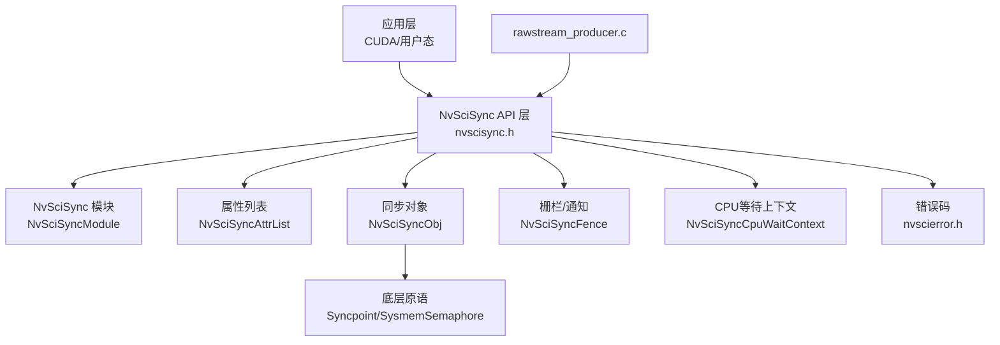
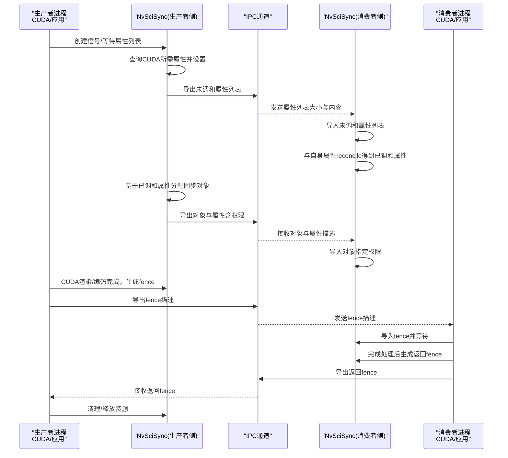
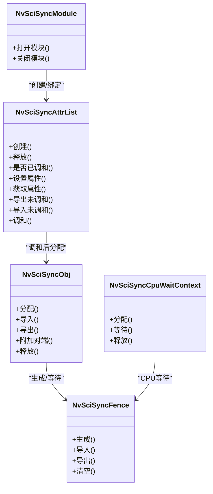
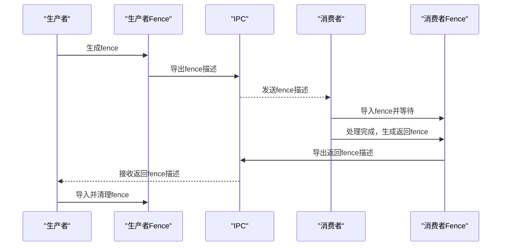
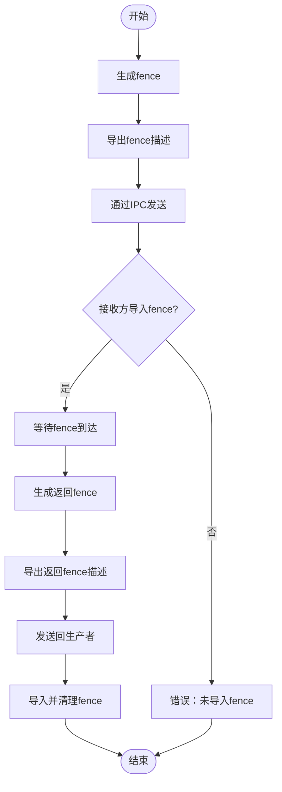
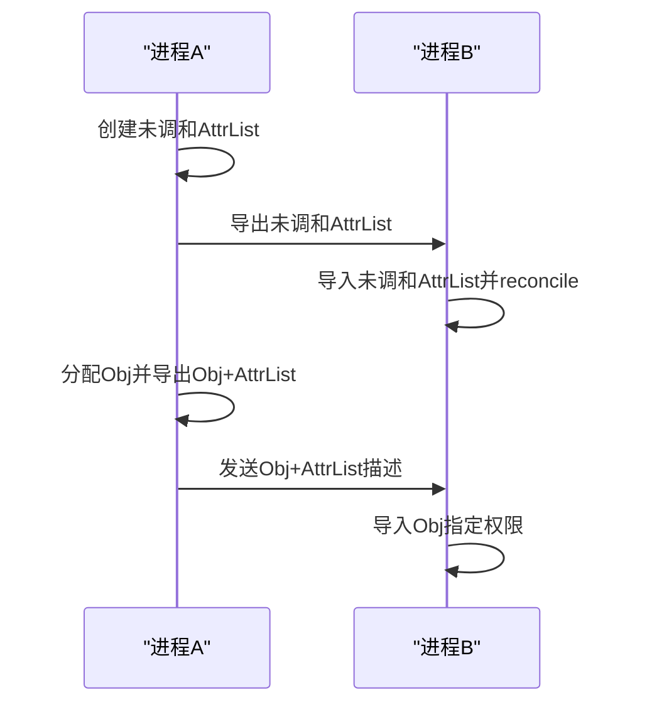
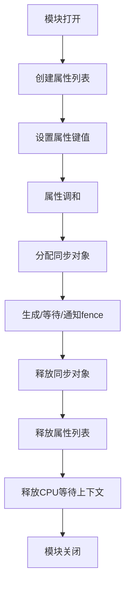
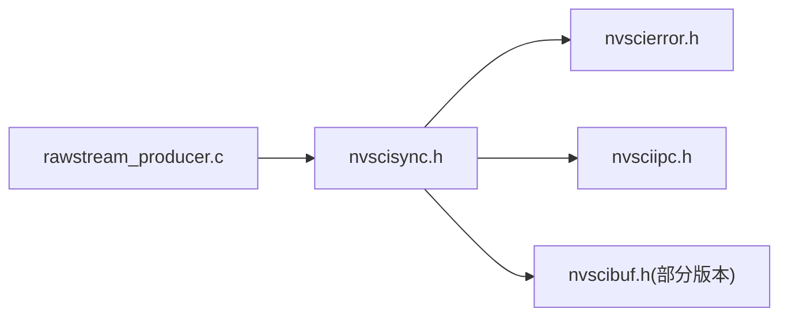

# 同步机制

<cite>
**本文引用的文件**   
- [nvscisync.h](file://driveos-6.0.5.0/usr/include/nvscisync.h)
- [nvscisync.h](file://driveos-6.0.6.0/usr/include/nvscisync.h)
- [nvscisync.h](file://driveos-60100/usr/include/nvscisync.h)
- [nvscierror.h](file://driveos-6.0.5.0/usr/include/nvscierror.h)
- [rawstream_producer.c](file://driveos-6.0.5.0/drive-linux/samples/nvsci/rawstream/rawstream_producer.c)
</cite>

## 目录
1. [简介](#简介)
2. [项目结构](#项目结构)
3. [核心组件](#核心组件)
4. [架构总览](#架构总览)
5. [详细组件分析](#详细组件分析)
6. [依赖关系分析](#依赖关系分析)
7. [性能考虑](#性能考虑)
8. [故障排查指南](#故障排查指南)
9. [结论](#结论)
10. [附录](#附录)

## 简介
本文件围绕NVIDIA NvSci同步机制（NvSciSync）进行系统化技术说明，重点覆盖以下方面：
- 设计原理与同步策略：基于“同步点/信号量”原语的跨进程/跨线程同步模型，支持确定性栅栏（fence）生成与等待。
- 事件同步、屏障同步与信号量机制：通过属性协商（attr list reconcile）与对象分配（obj alloc）实现不同同步语义；结合CUDA等硬件加速路径，形成“渲染/编码/解码”等流水线的同步基元。
- 跨进程与跨线程协调：通过IPC导出/导入（attr list and obj/fence）在进程间共享同步对象；CPU等待上下文（CpuWaitContext）与多种等待模式（阻塞/忙等/自旋）满足不同实时性需求。
- 同步对象生命周期：模块初始化/关闭、属性列表创建/释放、对象分配/释放、栅栏生成/导入/导出、任务状态与时间戳缓冲槽位管理。
- 性能优化与死锁规避：最小化CPU轮询、合理设置权限与原语类型、避免多阶段等待链中的循环依赖。
- API使用示例：以rawstream样例为主线，展示事件触发（CUDA fence生成）、等待（CPU等待/硬件等待）与通知（IPC fence传递）的典型流程。
- 实时性保障、优先级继承与公平调度：通过原语类型选择、权限约束与等待模式组合实现；结合缓冲区管理与流式传输，确保端到端时序可控。
- 诊断与调试：常见错误码、状态检查、日志定位与资源泄漏防护。

## 项目结构
本仓库中与NvSciSync直接相关的核心文件位于各版本驱动树的include目录下，并配套有rawstream样例用于演示同步对象在生产者-消费者场景中的实际使用。

图示来源
- [nvscisync.h:547-750](file://driveos-6.0.5.0/usr/include/nvscisync.h#L547-L750)
- [nvscierror.h:45-270](file://driveos-6.0.5.0/usr/include/nvscierror.h#L45-L270)
- [rawstream_producer.c:13-618](file://driveos-6.0.5.0/drive-linux/samples/nvsci/rawstream/rawstream_producer.c#L13-L618)

章节来源
- [nvscisync.h:547-750](file://driveos-6.0.5.0/usr/include/nvscisync.h#L547-L750)
- [nvscierror.h:45-270](file://driveos-6.0.5.0/usr/include/nvscierror.h#L45-L270)
- [rawstream_producer.c:13-618](file://driveos-6.0.5.0/drive-linux/samples/nvsci/rawstream/rawstream_producer.c#L13-L618)

## 核心组件
- NvSciSyncModule：每个进程内独立的模块实例，绑定该进程内的AttrList、Obj、Fence等对象；模块生命周期由open/close控制。
- NvSciSyncAttrList：未调和/已调和两类，用于声明同步对象的约束（如CPU访问、权限、原语类型、是否需要确定性栅栏、时间戳/任务状态槽位数等），并通过reconcile达成跨进程一致性。
- NvSciSyncObj：已调和属性下的同步对象句柄，承载底层原语（如Syncpoint或SysmemSemaphore），并可附加NvSciBuf时间戳缓冲与任务状态缓冲。
- NvSciSyncFence：同步点快照，表示“必须达到的里程碑”，等待即等待某个fence被触发；支持CPU等待与硬件等待两种路径。
- NvSciSyncCpuWaitContext：CPU侧等待所需的上下文资源，一次只能等待一个fence，但可在不同时刻切换等待目标。
- 错误码体系：统一的NvSciError枚举，涵盖通用错误、参数错误、超时/忙碌、设备/通信错误以及NvSciSync特有错误（如cleared fence）。

章节来源
- [nvscisync.h:194-330](file://driveos-6.0.5.0/usr/include/nvscisync.h#L194-L330)
- [nvscisync.h:397-527](file://driveos-6.0.5.0/usr/include/nvscisync.h#L397-L527)
- [nvscisync.h:547-750](file://driveos-6.0.5.0/usr/include/nvscisync.h#L547-L750)
- [nvscierror.h:45-270](file://driveos-6.0.5.0/usr/include/nvscierror.h#L45-L270)

## 架构总览
NvSciSync在应用层之上提供统一的同步抽象，底层映射到平台原语（Tegra Syncpoint或系统内存信号量）。通过属性协商与IPC导出/导入，实现跨进程共享同一同步语义；配合缓冲区管理（NvSciBuf）与流式传输（NvSciStream），形成从数据准备到渲染/编码/解码的完整时序控制链路。

图示来源
- [rawstream_producer.c:27-260](file://driveos-6.0.5.0/drive-linux/samples/nvsci/rawstream/rawstream_producer.c#L27-L260)
- [nvscisync.h:547-750](file://driveos-6.0.5.0/usr/include/nvscisync.h#L547-L750)

## 详细组件分析

### 组件A：同步对象与属性协商
- 属性键（AttrKey）：包括CPU访问需求、所需权限、实际授予权限、是否需要确定性栅栏、时间戳/任务状态槽位数、原语类型等。这些键值在reconcile前后分别承担输入/输出角色，确保跨进程一致性。
- 权限模型：WaitOnly、SignalOnly、WaitSignal三种权限组合，实际授予权限由所有参与reconcile的AttrList权限求和决定，且需满足“至少一个SignalOnly、至少一个WaitOnly”的约束。
- 原语类型：支持Syncpoint（Tegra平台）、SysmemSemaphore（系统内存）及payload变体等；具体类型在reconcile阶段确定。

图示来源
- [nvscisync.h:194-330](file://driveos-6.0.5.0/usr/include/nvscisync.h#L194-L330)
- [nvscisync.h:397-527](file://driveos-6.0.5.0/usr/include/nvscisync.h#L397-L527)
- [nvscisync.h:547-750](file://driveos-6.0.5.0/usr/include/nvscisync.h#L547-L750)

章节来源
- [nvscisync.h:397-527](file://driveos-6.0.5.0/usr/include/nvscisync.h#L397-L527)
- [nvscisync.h:547-750](file://driveos-6.0.5.0/usr/include/nvscisync.h#L547-L750)

### 组件B：事件同步（基于fence的触发与等待）
- 触发（信号）：生产者在完成GPU工作后生成fence，随后通过IPC导出fence描述发送给消费者。
- 等待（阻塞/忙等）：消费者导入fence并等待；可选择默认/忙等带让出/忙等无让出/阻塞等待模式。
- 返回通知：消费者处理完成后生成返回fence，回传给生产者，生产者再导入并清理，从而完成一次完整的事件同步。

图示来源
- [rawstream_producer.c:476-561](file://driveos-6.0.5.0/drive-linux/samples/nvsci/rawstream/rawstream_producer.c#L476-L561)
- [nvscisync.h:547-750](file://driveos-6.0.5.0/usr/include/nvscisync.h#L547-L750)

章节来源
- [rawstream_producer.c:476-561](file://driveos-6.0.5.0/drive-linux/samples/nvsci/rawstream/rawstream_producer.c#L476-L561)

### 组件C：屏障同步与信号量机制
- 屏障同步：通过多个fence的组合与顺序化等待实现“多参与者汇聚”；在rawstream样例中体现为生产者等待消费者返回fence后再继续下一帧。
- 信号量机制：底层原语可视为广义信号量（如SysmemSemaphore），支持确定性fence生成（每次提交递增实例0的值），便于在等待侧无需导入即可生成fence，降低IPC往返开销。

图示来源
- [rawstream_producer.c:476-561](file://driveos-6.0.5.0/drive-linux/samples/nvsci/rawstream/rawstream_producer.c#L476-L561)
- [nvscisync.h:496-527](file://driveos-6.0.5.0/usr/include/nvscisync.h#L496-L527)

章节来源
- [nvscisync.h:496-527](file://driveos-6.0.5.0/usr/include/nvscisync.h#L496-L527)
- [rawstream_producer.c:476-561](file://driveos-6.0.5.0/drive-linux/samples/nvsci/rawstream/rawstream_producer.c#L476-L561)

### 组件D：跨进程与跨线程协调
- 进程间：通过NvSciSyncAttrListIpcExportUnreconciled/NvSciSyncAttrListIpcImportUnreconciled与NvSciSyncIpcExportAttrListAndObj/NvSciSyncIpcImportAttrListAndObj在进程间传递属性与对象；权限需显式声明（如WaitOnly）。
- 线程间：同一进程内可共享同一NvSciSyncModule下的AttrList/Obj/Fence；CPU等待需通过NvSciSyncCpuWaitContext进行，避免直接在多线程中竞争等待状态。

图示来源
- [rawstream_producer.c:72-260](file://driveos-6.0.5.0/drive-linux/samples/nvsci/rawstream/rawstream_producer.c#L72-L260)
- [nvscisync.h:547-750](file://driveos-6.0.5.0/usr/include/nvscisync.h#L547-L750)

章节来源
- [rawstream_producer.c:72-260](file://driveos-6.0.5.0/drive-linux/samples/nvsci/rawstream/rawstream_producer.c#L72-L260)

### 组件E：同步对象生命周期管理
- 创建：NvSciSyncModuleOpen -> NvSciSyncAttrListCreate -> NvSciSyncAttrListSetAttrs -> NvSciSyncAttrListReconcile -> NvSciSyncObjAlloc
- 使用：生成/导入fence -> 等待/通知 -> 导出/导入返回fence
- 销毁：NvSciSyncObjFree -> NvSciSyncAttrListFree -> NvSciSyncCpuWaitContextFree -> NvSciSyncModuleClose

图示来源
- [nvscisync.h:547-750](file://driveos-6.0.5.0/usr/include/nvscisync.h#L547-L750)

章节来源
- [nvscisync.h:547-750](file://driveos-6.0.5.0/usr/include/nvscisync.h#L547-L750)

## 依赖关系分析
- 头文件依赖：nvscisync.h依赖nvscierror.h与nvsciipc.h（在部分版本中还依赖nvscibuf.h），用于错误码与IPC/缓冲区能力。
- 版本演进：不同版本的nvscisync.h在权限模型、原语类型、等待模式等方面略有差异，但核心API保持稳定；建议在新版本中关注新增属性键（如PeerHwEngineArray）与等待模式扩展。

图示来源
- [nvscisync.h:157-166](file://driveos-6.0.5.0/usr/include/nvscisync.h#L157-L166)
- [nvscierror.h:45-270](file://driveos-6.0.5.0/usr/include/nvscierror.h#L45-L270)
- [rawstream_producer.c:11-13](file://driveos-6.0.5.0/drive-linux/samples/nvsci/rawstream/rawstream_producer.c#L11-L13)

章节来源
- [nvscisync.h:157-166](file://driveos-6.0.5.0/usr/include/nvscisync.h#L157-L166)
- [nvscierror.h:45-270](file://driveos-6.0.5.0/usr/include/nvscierror.h#L45-L270)
- [rawstream_producer.c:11-13](file://driveos-6.0.5.0/drive-linux/samples/nvsci/rawstream/rawstream_producer.c#L11-L13)

## 性能考虑
- CPU等待模式选择：根据实时性需求选择默认/忙等/阻塞等待；在高吞吐场景优先避免CPU忙等，减少功耗与调度抖动。
- 最小化IPC往返：通过“确定性fence”（RequireDeterministicFences）允许等待侧在无需导入的情况下生成fence，降低延迟。
- 原语类型与权限：在满足功能前提下尽量选择轻量原语（如SysmemSemaphore），并仅授予必要权限，减少跨引擎同步成本。
- 时间戳与任务状态：按需开启时间戳与任务状态槽位，避免不必要的缓冲区占用与拷贝。
- 资源复用：在多帧/多缓冲场景中复用AttrList/Obj与CpuWaitContext，减少频繁分配/释放带来的抖动。

## 故障排查指南
- 常见错误码
  - 参数错误：NvSciError_BadParameter（空指针、越界、非法组合）
  - 状态错误：NvSciError_InvalidState（模块未初始化、对象已释放）
  - 资源不足：NvSciError_InsufficientMemory/ResourceError
  - 超时/忙碌：NvSciError_Timeout/NvSciError_Busy
  - NvSciSync特有：NvSciError_ClearedFence（对已清除fence执行操作）
- 状态检查
  - 使用NvSciSyncAttrListIsReconciled确认属性是否已调和
  - 在导入/导出前后核对fence状态（cleared/not cleared）
- 日志与定位
  - rawstream_producer.c展示了从属性创建、reconcile、对象分配、fence生成/导入/导出到最终清理的全流程日志输出，可据此定位失败环节
- 资源泄漏防护
  - 所有AttrList/Obj/CpuWaitContext均需成对释放；IPC导出描述需在使用后释放对应描述空间

章节来源
- [nvscierror.h:45-270](file://driveos-6.0.5.0/usr/include/nvscierror.h#L45-L270)
- [rawstream_producer.c:27-618](file://driveos-6.0.5.0/drive-linux/samples/nvsci/rawstream/rawstream_producer.c#L27-L618)

## 结论
NvSciSync通过“属性协商+对象分配+fence通知”的统一模型，实现了跨进程/跨线程的高效同步；结合CUDA等硬件路径与缓冲区管理，能够支撑复杂的多媒体流水线。实践中应重视权限与原语类型的选择、IPC往返的优化以及CPU等待模式的权衡，以获得更好的实时性与能效表现。

## 附录
- API要点速查
  - 模块：NvSciSyncModuleOpen/NvSciSyncModuleClose
  - 属性：NvSciSyncAttrListCreate/SetAttrs/Reconcile/IsReconciled/IpcExport/IpcImport
  - 对象：NvSciSyncObjAlloc/Import/Export/AttachPeer/Free
  - Fence：NvSciSyncObjGenerateFence/IpcExportFence/IpcImportFence/Clear
  - CPU等待：NvSciSyncCpuWaitContextAlloc/Wait/Free
- 示例参考
  - rawstream_producer.c展示了生产者侧从属性创建、reconcile、对象分配、fence生成与IPC传递到最终清理的完整流程

章节来源
- [nvscisync.h:547-750](file://driveos-6.0.5.0/usr/include/nvscisync.h#L547-L750)
- [rawstream_producer.c:13-618](file://driveos-6.0.5.0/drive-linux/samples/nvsci/rawstream/rawstream_producer.c#L13-L618)