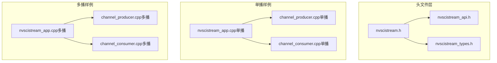
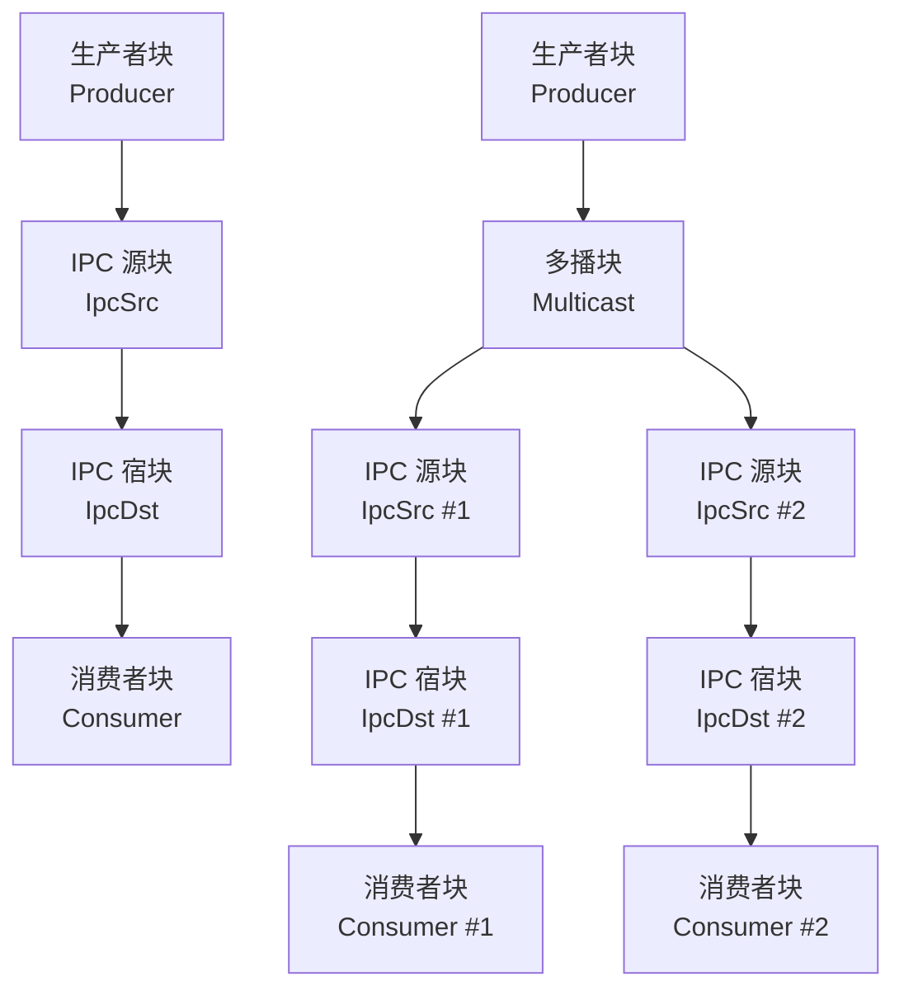
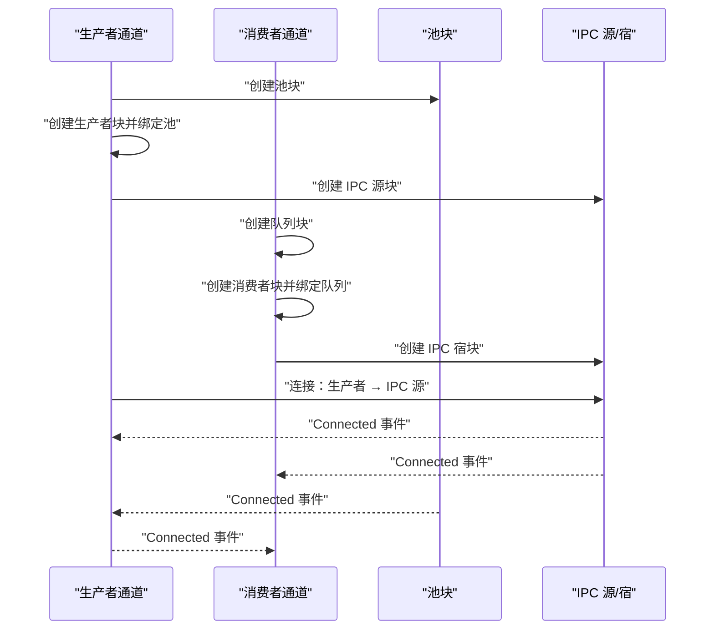
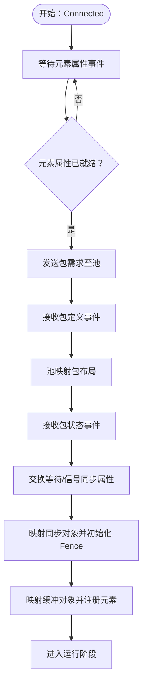
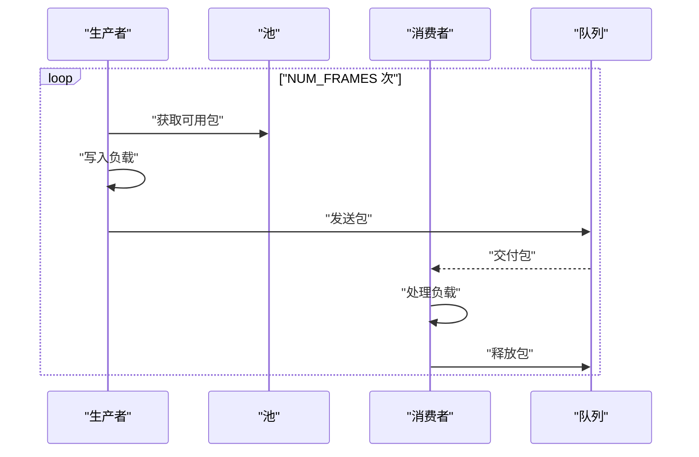
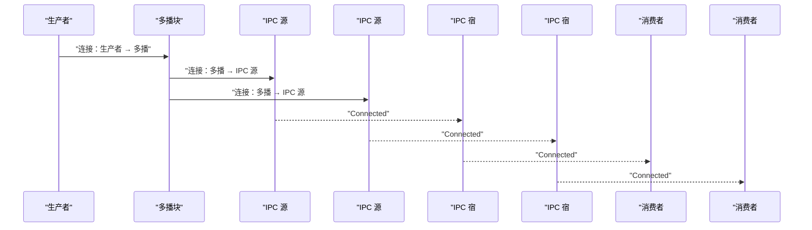
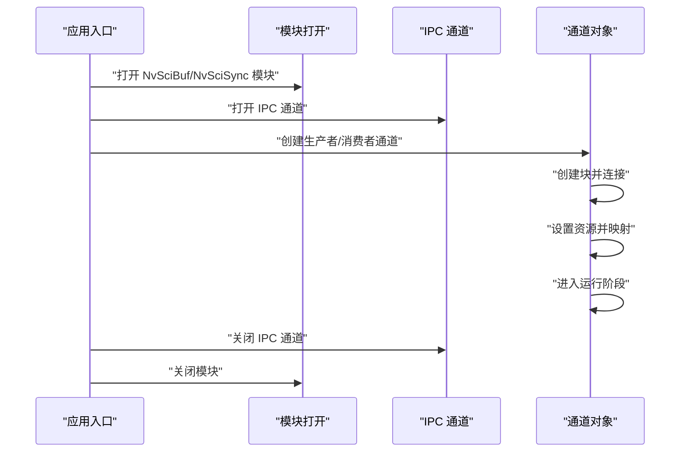
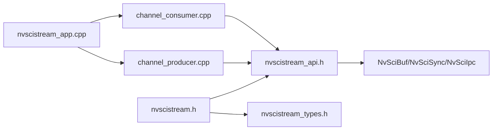

# 流式数据传输

<cite>
**本文引用的文件**
- [nvscistream.h](file://driveos-6.0.5.0/drive-linux/include/nvscistream.h)
- [nvscistream_api.h](file://driveos-6.0.5.0/drive-linux/include/nvscistream_api.h)
- [nvscistream_types.h](file://driveos-6.0.5.0/drive-linux/include/nvscistream_types.h)
- [nvscistream_app.cpp（单播）](file://driveos-5260/drive-linux/samples/nvsci/nvscistream/unicast/nvscistream_app.cpp)
- [nvscistream_app.cpp（多播）](file://driveos-5260/drive-linux/samples/nvsci/nvscistream/multicast/nvscistream_app.cpp)
- [channel_producer.cpp（单播）](file://driveos-5260/drive-linux/samples/nvsci/nvscistream/unicast/channel_producer.cpp)
- [channel_consumer.cpp（单播）](file://driveos-5260/drive-linux/samples/nvsci/nvscistream/unicast/channel_consumer.cpp)
- [channel_producer.cpp（多播）](file://driveos-5260/drive-linux/samples/nvsci/nvscistream/multicast/channel_producer.cpp)
- [channel_consumer.cpp（多播）](file://driveos-5260/drive-linux/samples/nvsci/nvscistream/multicast/channel_consumer.cpp)
</cite>

## 目录
1. [简介](#简介)
2. [项目结构](#项目结构)
3. [核心组件](#核心组件)
4. [架构总览](#架构总览)
5. [详细组件分析](#详细组件分析)
6. [依赖关系分析](#依赖关系分析)
7. [性能考虑](#性能考虑)
8. [故障排查指南](#故障排查指南)
9. [结论](#结论)
10. [附录](#附录)

## 简介
本技术文档围绕 NVIDIA 的 NvSciStream 流式数据传输能力，系统性阐述其设计架构、数据传输机制与运行流程。重点覆盖以下主题：
- 流的创建、配置、启动与停止全流程
- 单播与多播传输模式的实现差异与适用场景
- 数据包管理、序列号控制与流量管理机制
- 流同步、背压处理与错误恢复策略
- 生产者与消费者的 API 使用示例
- 网络拓扑配置、带宽管理与延迟优化
- 与媒体处理和传感器数据的集成方法
- 性能监控、故障诊断与调试工具使用

## 项目结构
仓库中与 NvSciStream 相关的核心内容分布在头文件与样例程序中：
- 头文件：提供流 API、类型定义与事件模型
- 样例程序：单播与多播两种拓扑下的生产者/消费者通道实现

**图表来源**
- [nvscistream.h:1-32](file://driveos-6.0.5.0/drive-linux/include/nvscistream.h#L1-L32)
- [nvscistream_api.h:1-120](file://driveos-6.0.5.0/drive-linux/include/nvscistream_api.h#L1-L120)
- [nvscistream_types.h:1-120](file://driveos-6.0.5.0/drive-linux/include/nvscistream_types.h#L1-L120)
- [nvscistream_app.cpp（单播）:1-120](file://driveos-5260/drive-linux/samples/nvsci/nvscistream/unicast/nvscistream_app.cpp#L1-L120)
- [nvscistream_app.cpp（多播）:1-154](file://driveos-5260/drive-linux/samples/nvsci/nvscistream/multicast/nvscistream_app.cpp#L1-L154)

**章节来源**
- [nvscistream.h:1-32](file://driveos-6.0.5.0/drive-linux/include/nvscistream.h#L1-L32)
- [nvscistream_api.h:1-120](file://driveos-6.0.5.0/drive-linux/include/nvscistream_api.h#L1-L120)
- [nvscistream_types.h:1-120](file://driveos-6.0.5.0/drive-linux/include/nvscistream_types.h#L1-L120)
- [nvscistream_app.cpp（单播）:1-120](file://driveos-5260/drive-linux/samples/nvsci/nvscistream/unicast/nvscistream_app.cpp#L1-L120)
- [nvscistream_app.cpp（多播）:1-154](file://driveos-5260/drive-linux/samples/nvsci/nvscistream/multicast/nvscistream_app.cpp#L1-L154)

## 核心组件
- 块（Block）：流的基本构建单元，包括 Producer、Consumer、Pool、Queue、Multicast、IPC 源/宿等
- 包（Packet）：承载 NvSciBuf 对象的数据单元，元素（Element）即其中的缓冲对象
- 同步（Sync）：通过 NvSciSync 在端点间传递等待/信号语义，实现跨进程/跨芯片同步
- 事件（Event）：块间通信的异步通知机制，驱动状态机推进

关键 API 与类型概览：
- 块创建与连接：Producer/Consumer/Pools/Queues/Multicast/IPC Src/Dst 的创建与连接
- 资源协商阶段：元素属性、包定义、等待/信号同步对象的导入导出
- 运行时阶段：包获取/发送、队列接收/释放、事件查询与处理
- 错误与并发：错误码约定、超时与重试、线程安全与并发模型

**章节来源**
- [nvscistream_api.h:140-800](file://driveos-6.0.5.0/drive-linux/include/nvscistream_api.h#L140-L800)
- [nvscistream_types.h:170-505](file://driveos-6.0.5.0/drive-linux/include/nvscistream_types.h#L170-L505)

## 架构总览
NvSciStream 将 NvSciBuf 与 NvSciSync 抽象为“流”，在多个应用模块之间以“块”的形式组织，形成树状拓扑。典型路径为：Producer → IPC Src → IPC Dst → Consumer；多播场景下，Producer → Multicast → 多个 IPC Src → IPC Dst → Consumer。

**图表来源**
- [nvscistream_api.h:190-790](file://driveos-6.0.5.0/drive-linux/include/nvscistream_api.h#L190-L790)

## 详细组件分析

### 组件一：块生命周期与连接
- 创建顺序：先创建 Pool/Queue，再创建 Producer/Consumer，并绑定到对应块；IPC Src/Dst 用于跨进程/跨芯片连接
- 连接方式：使用 BlockConnect 将上游块与下游块相连；连接完成后各块会收到 Connected 事件
- 事件驱动：通过 EventQuery 获取事件，按事件类型推进资源协商与运行阶段

**图表来源**
- [channel_producer.cpp（单播）:75-100](file://driveos-5260/drive-linux/samples/nvsci/nvscistream/unicast/channel_producer.cpp#L75-L100)
- [channel_consumer.cpp（单播）:75-99](file://driveos-5260/drive-linux/samples/nvsci/nvscistream/unicast/channel_consumer.cpp#L75-L99)

**章节来源**
- [channel_producer.cpp（单播）:55-100](file://driveos-5260/drive-linux/samples/nvsci/nvscistream/unicast/channel_producer.cpp#L55-L100)
- [channel_consumer.cpp（单播）:51-99](file://driveos-5260/drive-linux/samples/nvsci/nvscistream/unicast/channel_consumer.cpp#L51-L99)

### 组件二：资源协商阶段（元素、包、同步）
- 元素属性导出/导入：生产者与消费者分别导出元素支持列表，池据此生成最终包布局
- 包定义：池向生产者与消费者广播包定义，双方确认后进入映射阶段
- 等待/信号同步：双方交换等待属性与信号对象，完成映射后初始化 Fence
- 资源映射：对每个包 Cookie 映射缓冲对象并注册元素

**图表来源**
- [nvscistream_api.h:220-475](file://driveos-6.0.5.0/drive-linux/include/nvscistream_api.h#L220-L475)
- [nvscistream_types.h:220-495](file://driveos-6.0.5.0/drive-linux/include/nvscistream_types.h#L220-L495)

**章节来源**
- [channel_producer.cpp（单播）:102-237](file://driveos-5260/drive-linux/samples/nvsci/nvscistream/unicast/channel_producer.cpp#L102-L237)
- [channel_consumer.cpp（单播）:101-162](file://driveos-5260/drive-linux/samples/nvsci/nvscistream/unicast/channel_consumer.cpp#L101-L162)

### 组件三：运行阶段（包获取/发送与队列管理）
- 生产者：获取包、写入负载、发送包；循环直至帧数完成
- 消费者：从队列获取包、处理负载、释放包；FIFO 队列需确保全部包到达
- 队列类型：Mailbox 保留最新包，FIFO 严格顺序

**图表来源**
- [nvscistream_api.h:470-520](file://driveos-6.0.5.0/drive-linux/include/nvscistream_api.h#L470-L520)
- [nvscistream_types.h:130-160](file://driveos-6.0.5.0/drive-linux/include/nvscistream_types.h#L130-L160)

**章节来源**
- [channel_producer.cpp（单播）:239-253](file://driveos-5260/drive-linux/samples/nvsci/nvscistream/unicast/channel_producer.cpp#L239-L253)
- [channel_consumer.cpp（单播）:164-182](file://driveos-5260/drive-linux/samples/nvsci/nvscistream/unicast/channel_consumer.cpp#L164-L182)

### 组件四：多播传输模式
- 多播拓扑：生产者通过 Multicast 块将消息广播给多个 IPC 源，再由 IPC 宿分发到多个消费者
- 连接策略：单播时直接连接；多播时先连接生产者到 Multicast，再连接 Multicast 到各 IPC 源
- 适用场景：需要将同一数据流分发给多个独立消费者（如多显示输出、多算法并行）

**图表来源**
- [channel_producer.cpp（多播）:90-127](file://driveos-5260/drive-linux/samples/nvsci/nvscistream/multicast/channel_producer.cpp#L90-L127)
- [nvscistream_api.h:470-520](file://driveos-6.0.5.0/drive-linux/include/nvscistream_api.h#L470-L520)

**章节来源**
- [nvscistream_app.cpp（多播）:29-131](file://driveos-5260/drive-linux/samples/nvsci/nvscistream/multicast/nvscistream_app.cpp#L29-L131)
- [channel_producer.cpp（多播）:62-127](file://driveos-5260/drive-linux/samples/nvsci/nvscistream/multicast/channel_producer.cpp#L62-L127)
- [channel_consumer.cpp（多播）:51-99](file://driveos-5260/drive-linux/samples/nvsci/nvscistream/multicast/channel_consumer.cpp#L51-L99)

### 组件五：API 使用示例（生产者/消费者）
- 单播示例入口：解析命令行参数，打开 IPC 通道，创建生产者或消费者通道，执行连接、设置与运行
- 多播示例入口：支持指定消费者数量，为每个消费者打开 IPC 通道，创建多播拓扑

**图表来源**
- [nvscistream_app.cpp（单播）:28-120](file://driveos-5260/drive-linux/samples/nvsci/nvscistream/unicast/nvscistream_app.cpp#L28-L120)
- [nvscistream_app.cpp（多播）:29-154](file://driveos-5260/drive-linux/samples/nvsci/nvscistream/multicast/nvscistream_app.cpp#L29-L154)

**章节来源**
- [nvscistream_app.cpp（单播）:28-120](file://driveos-5260/drive-linux/samples/nvsci/nvscistream/unicast/nvscistream_app.cpp#L28-L120)
- [nvscistream_app.cpp（多播）:29-154](file://driveos-5260/drive-linux/samples/nvsci/nvscistream/multicast/nvscistream_app.cpp#L29-L154)

## 依赖关系分析
- 头文件依赖：nvscistream.h 引入 API 与类型头文件
- 样例依赖：通道类依赖 API 头文件中的块创建、连接与事件查询接口
- IPC 依赖：IPC Src/Dst 依赖 NvSciIpcEndpoint，实现跨进程/跨芯片通信
- 同步依赖：NvSciSync 用于等待/信号对象的导入导出与 Fence 初始化

**图表来源**
- [nvscistream.h:28-31](file://driveos-6.0.5.0/drive-linux/include/nvscistream.h#L28-L31)
- [nvscistream_api.h:27-32](file://driveos-6.0.5.0/drive-linux/include/nvscistream_api.h#L27-L32)

**章节来源**
- [nvscistream.h:28-31](file://driveos-6.0.5.0/drive-linux/include/nvscistream.h#L28-L31)
- [nvscistream_api.h:27-32](file://driveos-6.0.5.0/drive-linux/include/nvscistream_api.h#L27-L32)

## 性能考虑
- 包池大小与队列类型：根据吞吐与延迟需求选择合适的包数量与队列类型（Mailbox/FIFO）
- 同步开销：合理设置等待/信号对象，避免过度同步导致的阻塞
- 背压控制：利用队列容量与事件驱动机制，防止生产者过快导致内存压力
- IPC/C2C 传输：跨进程/跨芯片传输引入额外延迟，应结合业务场景进行拓扑优化
- 缓冲映射：批量映射与注册元素可减少系统调用次数

[本节为通用性能建议，不直接分析具体文件]

## 故障排查指南
- 连接失败：检查 BlockConnect 返回值与 Connected 事件是否到达
- 超时问题：EventQuery 设置合理超时阈值，避免无限等待；超过最大超时次数应记录日志并退出
- 资源不一致：确保元素属性、包定义与状态事件完整接收后再进入映射阶段
- 队列丢包：Mailbox 模式会替换旧包，若需全量接收请使用 FIFO 并校验包计数
- IPC 初始化：确保 IPC 通道正确打开与复位，模块关闭顺序正确

**章节来源**
- [channel_producer.cpp（单播）:117-212](file://driveos-5260/drive-linux/samples/nvsci/nvscistream/unicast/channel_producer.cpp#L117-L212)
- [channel_consumer.cpp（单播）:120-162](file://driveos-5260/drive-linux/samples/nvsci/nvscistream/unicast/channel_consumer.cpp#L120-L162)
- [nvscistream_app.cpp（单播）:72-120](file://driveos-5260/drive-linux/samples/nvsci/nvscistream/unicast/nvscistream_app.cpp#L72-L120)

## 结论
NvSciStream 通过块化抽象与事件驱动模型，提供了高内聚、低耦合的流式数据传输框架。单播与多播模式分别满足点对点与一对多的分发需求；配合 NvSciBuf/NvSciSync 实现跨进程/跨芯片的高效同步与缓冲管理。遵循本文所述的创建/配置/启动/停止流程与最佳实践，可在多媒体与传感器数据场景中获得稳定、低延迟的传输体验。

## 附录
- 常用术语
  - 块（Block）：流的逻辑单元，如 Producer/Consumer/Pool/Queue/Multicast/IPC Src/Dst
  - 包（Packet）：承载数据的容器，包含一个或多个元素（NvSciBuf 对象）
  - 同步（Sync）：通过 NvSciSync 的等待/信号对象实现跨边界同步
  - 事件（Event）：块间异步通知，驱动状态机推进

[本节为概念性总结，不直接分析具体文件]