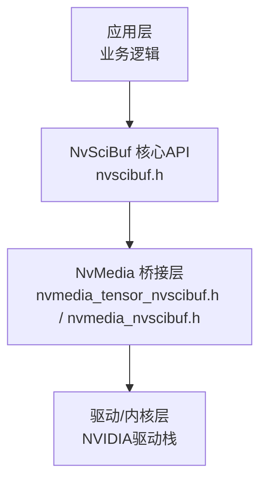
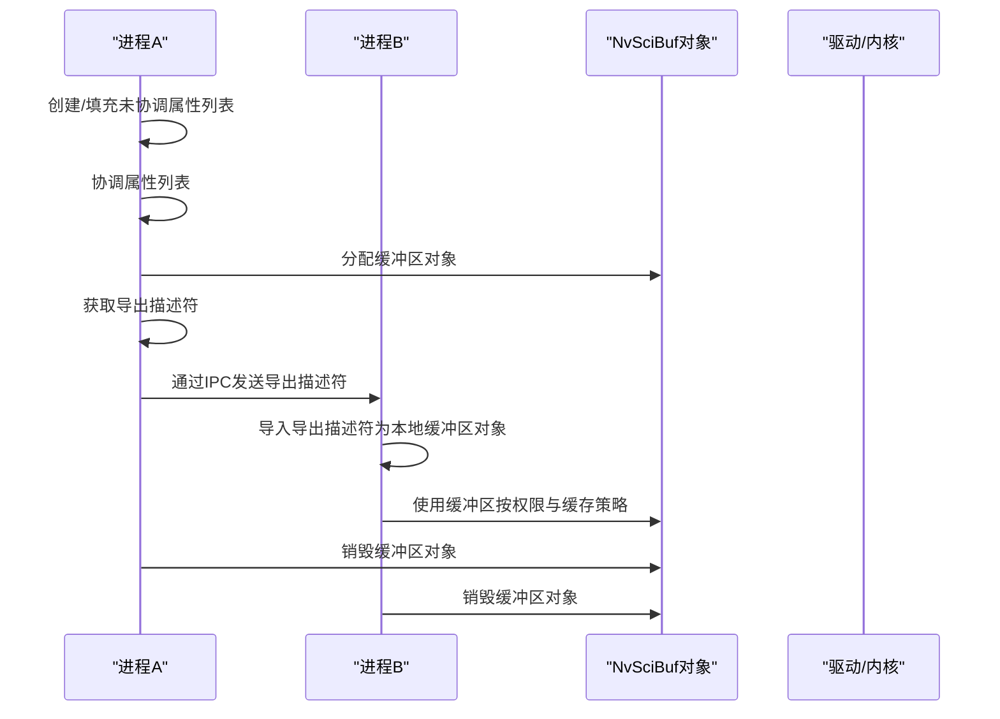
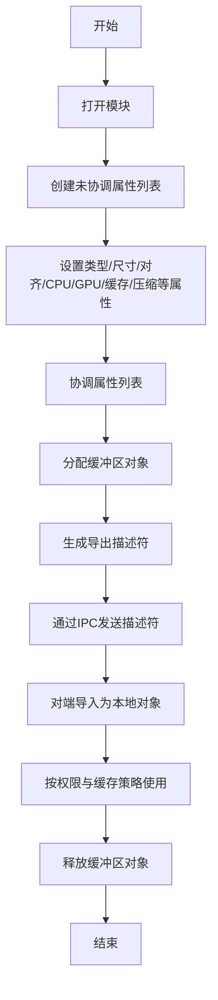

# 缓冲区管理

<cite>
**本文引用的文件**
- [nvscibuf.h（6.0.6.0）](file://driveos-6.0.6.0/usr/include/nvscibuf.h)
- [nvmedia_tensor_nvscibuf.h（6.0.5.0）](file://driveos-6.0.5.0/drive-linux/include/nvmedia_tensor_nvscibuf.h)
- [nvmedia_nvscibuf.h（6.0.5.0）](file://driveos-6.0.5.0/drive-linux/include/nvmedia_6x/nvmedia_nvscibuf.h)
</cite>

## 目录
1. [简介](#简介)
2. [项目结构](#项目结构)
3. [核心组件](#核心组件)
4. [架构总览](#架构总览)
5. [详细组件分析](#详细组件分析)
6. [依赖关系分析](#依赖关系分析)
7. [性能考量](#性能考量)
8. [故障排查指南](#故障排查指南)
9. [结论](#结论)
10. [附录](#附录)

## 简介
本技术文档围绕NVIDIA NvSciBuf缓冲区管理能力，系统阐述其设计原理、内存共享机制、缓冲区全生命周期管理（创建、注册、配置、导入导出、销毁）、跨进程/跨设备访问权限与缓存一致性保障、以及与GPU内存和系统内存的协同使用。文档同时给出缓冲区池化、复用与回收的优化策略，并提供API使用路径指引与最佳实践，帮助开发者在多引擎、多GPU、多进程场景下高效、安全地使用共享缓冲。

## 项目结构
本仓库中与NvSciBuf相关的关键文件集中在以下位置：
- 头文件：驱动/用户态公共头文件位于各版本目录下的include路径中，提供缓冲区对象、属性列表、IPC导出/导入等核心接口定义。
- 集成适配层：NvMedia与NvSciBuf的桥接头文件，提供张量与缓冲区对象之间的互操作API。

图示来源
- [nvscibuf.h（6.0.6.0）](file://driveos-6.0.6.0/usr/include/nvscibuf.h)
- [nvmedia_tensor_nvscibuf.h（6.0.5.0）](file://driveos-6.0.5.0/drive-linux/include/nvmedia_tensor_nvscibuf.h)
- [nvmedia_nvscibuf.h（6.0.5.0）](file://driveos-6.0.5.0/drive-linux/include/nvmedia_6x/nvmedia_nvscibuf.h)

章节来源
- [nvscibuf.h（6.0.6.0）](file://driveos-6.0.6.0/usr/include/nvscibuf.h)
- [nvmedia_tensor_nvscibuf.h（6.0.5.0）](file://driveos-6.0.5.0/drive-linux/include/nvmedia_tensor_nvscibuf.h)
- [nvmedia_nvscibuf.h（6.0.5.0）](file://driveos-6.0.5.0/drive-linux/include/nvmedia_6x/nvmedia_nvscibuf.h)

## 核心组件
- NvSciBuf模块与对象
  - 模块句柄：每个进程需独立打开模块以进行缓冲区操作。
  - 属性列表：用于声明缓冲区类型、尺寸、对齐、CPU/GPU访问需求、缓存策略、压缩策略等约束；支持“已协调/未协调”两种状态。
  - 缓冲区对象：满足属性列表约束的可共享内存对象，支持CPU/GPU访问、缓存维护、跨进程导入导出。
- IPC与导出/导入
  - 通过IPC通道交换“导出描述符”，在对端完成导入后获得可共享的缓冲区对象。
- 引擎与设备域
  - 支持指定多GPU访问集合、VIDMEM来源GPU、GPU缓存策略、压缩策略及是否需要软件缓存一致性维护。

章节来源
- [nvscibuf.h（6.0.6.0）](file://driveos-6.0.6.0/usr/include/nvscibuf.h)

## 架构总览
NvSciBuf在应用与驱动之间提供统一的缓冲区抽象，贯穿“属性协商—对象分配—权限与缓存策略—跨进程共享—生命周期管理”的完整链路。

图示来源
- [nvscibuf.h（6.0.6.0）](file://driveos-6.0.6.0/usr/include/nvscibuf.h)

## 详细组件分析

### 设计原理与内存共享机制
- 抽象与类型
  - 支持通用、原始缓冲、图像、张量、数组、金字塔等多种类型，便于与不同上层库（如NvMedia、TensorRT）对接。
- 共享内存模型
  - 通过NvSciBuf对象在进程间共享物理地址空间，结合权限与缓存策略确保CPU/GPU一致性和可见性。
- 属性协商
  - 未协调属性列表由各参与方声明约束；协调过程计算出满足所有约束的“已协调属性列表”，并据此分配对象。
- IPC导出/导入
  - 通过导出描述符在对端完成导入，形成跨进程共享视图；导入时权限与属性由导出侧决定或由协调结果约束。

章节来源
- [nvscibuf.h（6.0.6.0）](file://driveos-6.0.6.0/usr/include/nvscibuf.h)

### 缓冲区创建、注册、配置与销毁流程
- 创建与配置
  - 步骤：打开模块 → 创建未协调属性列表 → 设置类型/尺寸/对齐/CPU/GPU需求/缓存/压缩等 → 协调属性列表 → 分配缓冲区对象。
  - 关键API路径参考：[属性列表创建/设置/克隆/协调](file://driveos-6.0.6.0/usr/include/nvscibuf.h)，[属性列表协调与对象分配组合接口](file://driveos-6.0.6.0/usr/include/nvscibuf.h)，[对象分配](file://driveos-6.0.6.0/usr/include/nvscibuf.h)。
- 注册与导入
  - 通过IPC通道交换导出描述符，对端导入后获得可共享对象。
  - 关键API路径参考：[导出/导入相关接口](file://driveos-6.0.6.0/usr/include/nvscibuf.h)。
- 销毁
  - 使用完毕后释放缓冲区对象，确保无泄漏。

图示来源
- [nvscibuf.h（6.0.6.0）](file://driveos-6.0.6.0/usr/include/nvscibuf.h)

章节来源
- [nvscibuf.h（6.0.6.0）](file://driveos-6.0.6.0/usr/include/nvscibuf.h)

### 跨进程内存共享与安全机制
- 安全边界
  - 每个进程必须独立打开模块；模块不可跨进程共享。
  - 对象权限与实际权限由协调过程确定，导入端仅能获得导出侧授予的最小权限。
- IPC通道
  - 通过NvSciIpc通道传递导出描述符，保证传输安全与可靠性。
- 权限与缓存一致性
  - 可请求CPU/GPU访问、缓存策略、是否需要软件缓存一致性维护；驱动根据策略保证可见性与一致性。

章节来源
- [nvscibuf.h（6.0.6.0）](file://driveos-6.0.6.0/usr/include/nvscibuf.h)

### 缓冲区属性设置、访问权限控制与生命周期管理
- 属性键族
  - 通用属性：类型、CPU访问需求、所需权限、CPU缓存、GPU集合、VIDMEM来源GPU、GPU缓存、GPU压缩、CPU/GPU软件缓存一致性等。
  - 原始缓冲属性：大小、对齐。
  - 图像/金字塔/数组/张量等类型属性由具体类型键族定义。
- 访问权限
  - 所需权限与实际权限分别在未协调/已协调属性中体现；导入端权限不得高于导出授予。
- 生命周期
  - 对象分配后需显式释放；模块关闭前应确保对象已释放。

章节来源
- [nvscibuf.h（6.0.6.0）](file://driveos-6.0.6.0/usr/include/nvscibuf.h)

### 缓冲区池化、复用与回收优化策略
- 池化与复用
  - 建议按类型/尺寸/对齐/缓存策略分组池化，减少频繁分配/释放带来的抖动。
  - 在多生产者/消费者场景中，采用环形队列或空闲链表管理空闲对象，降低锁竞争。
- 回收与清理
  - 统一回收策略：对象归还池前执行必要的缓存回写/失效；在模块关闭或进程退出时批量回收。
- 并发与线程安全
  - API标注了并发特性；池化实现需自行加锁保护共享队列。

（本节为通用优化建议，不直接分析具体源码）

### API使用示例（路径指引）
以下为常用流程的API路径指引（请在对应头文件中查看详细签名与说明）：
- 打开模块与关闭模块
  - [NvSciBufModuleOpen/NvSciBufModuleClose](file://driveos-6.0.6.0/usr/include/nvscibuf.h)
- 属性列表
  - [NvSciBufAttrListCreate/NvSciBufAttrListSetAttrs/NvSciBufAttrListGetAttrs/NvSciBufAttrListClone](file://driveos-6.0.6.0/usr/include/nvscibuf.h)
  - [NvSciBufAttrListReconcile/NvSciBufAttrListReconcileAndObjAlloc](file://driveos-6.0.6.0/usr/include/nvscibuf.h)
- 对象分配与释放
  - [NvSciBufObjAlloc/NvSciBufObjFree](file://driveos-6.0.6.0/usr/include/nvscibuf.h)
- IPC导出/导入
  - [NvSciBufObjIpcExport/NvSciBufObjIpcImport](file://driveos-6.0.6.0/usr/include/nvscibuf.h)
- 缓存与一致性
  - [NvSciBufObjFlushCpuCacheRange 等缓存维护接口](file://driveos-6.0.6.0/usr/include/nvscibuf.h)
- 与NvMedia集成
  - [NvMediaTensorNvSciBufInit/NvMediaTensorFillNvSciBufAttrs/NvMediaTensorCreateFromNvSciBuf](file://driveos-6.0.5.0/drive-linux/include/nvmedia_tensor_nvscibuf.h)
  - [NvMediaNvSciBufObjPutBits/NvMediaNvSciBufObjGetBits](file://driveos-6.0.5.0/drive-linux/include/nvmedia_6x/nvmedia_nvscibuf.h)

章节来源
- [nvscibuf.h（6.0.6.0）](file://driveos-6.0.6.0/usr/include/nvscibuf.h)
- [nvmedia_tensor_nvscibuf.h（6.0.5.0）](file://driveos-6.0.5.0/drive-linux/include/nvmedia_tensor_nvscibuf.h)
- [nvmedia_nvscibuf.h（6.0.5.0）](file://driveos-6.0.5.0/drive-linux/include/nvmedia_6x/nvmedia_nvscibuf.h)

### 内存对齐、缓存一致性与平滑映射
- 对齐
  - 原始缓冲支持显式对齐设置；协调时取最大对齐值，确保跨访问器兼容。
- 缓存一致性
  - 可启用CPU/GPU缓存；当需要软件一致性维护时，驱动会根据策略在读写前后执行必要的缓存操作。
- 映射与可见性
  - 通过对象指针与导出描述符在进程间共享；驱动负责确保跨进程/跨设备的可见性与一致性。

章节来源
- [nvscibuf.h（6.0.6.0）](file://driveos-6.0.6.0/usr/include/nvscibuf.h)

### 与GPU内存和系统内存的集成使用
- VIDMEM来源
  - 可指定VIDMEM来源GPU；若多GPU共享且来自系统内存，则无需VIDMEM来源。
- GPU缓存与压缩
  - 可针对不同GPU设置缓存策略与压缩策略；协调失败条件包括冲突的压缩/访问需求等。
- 多GPU场景
  - 通过GPU集合与VIDMEM来源GPU联合配置，确保目标设备域内的可见性与一致性。

章节来源
- [nvscibuf.h（6.0.6.0）](file://driveos-6.0.6.0/usr/include/nvscibuf.h)

## 依赖关系分析
- 应用层依赖NvSciBuf核心API进行缓冲区生命周期管理。
- NvMedia层通过桥接API将张量与NvSciBuf对象互转，便于与推理/编解码等引擎对接。
- 驱动层负责实际的内存分配、缓存一致性与跨进程共享。

图示来源
- [nvscibuf.h（6.0.6.0）](file://driveos-6.0.6.0/usr/include/nvscibuf.h)
- [nvmedia_tensor_nvscibuf.h（6.0.5.0）](file://driveos-6.0.5.0/drive-linux/include/nvmedia_tensor_nvscibuf.h)
- [nvmedia_nvscibuf.h（6.0.5.0）](file://driveos-6.0.5.0/drive-linux/include/nvmedia_6x/nvmedia_nvscibuf.h)

章节来源
- [nvscibuf.h（6.0.6.0）](file://driveos-6.0.6.0/usr/include/nvscibuf.h)
- [nvmedia_tensor_nvscibuf.h（6.0.5.0）](file://driveos-6.0.5.0/drive-linux/include/nvmedia_tensor_nvscibuf.h)
- [nvmedia_nvscibuf.h（6.0.5.0）](file://driveos-6.0.5.0/drive-linux/include/nvmedia_6x/nvmedia_nvscibuf.h)

## 性能考量
- 减少协调次数：合并多个属性列表的协调，避免频繁往返。
- 对齐与尺寸：合理设置对齐与尺寸，减少碎片与跨访问器拷贝。
- 缓存策略：在CPU/GPU混合访问场景下，谨慎选择缓存策略与一致性维护，平衡性能与正确性。
- 池化与复用：通过池化降低分配/释放开销，配合空闲队列与批处理提升吞吐。
- 并发控制：在池化实现中采用细粒度锁或无锁队列，降低争用。

（本节为通用性能建议，不直接分析具体源码）

## 故障排查指南
- 常见错误与定位
  - 参数非法：检查模块/属性列表/对象有效性；确认未协调/已协调状态匹配。
  - 协调失败：核对类型、尺寸、对齐、权限、缓存/压缩策略是否冲突；必要时拆分属性列表或放宽约束。
  - IPC失败：确认导出描述符传输成功、对端导入时权限与属性匹配。
  - 缓存问题：在CPU/GPU访问后按需执行缓存维护；避免脏读/脏写。
- 推荐排查步骤
  - 逐项核对属性键值与范围；
  - 分离属性列表进行二分排查；
  - 在导入端打印实际权限与缓存策略；
  - 使用缓存维护接口验证一致性。

章节来源
- [nvscibuf.h（6.0.6.0）](file://driveos-6.0.6.0/usr/include/nvscibuf.h)

## 结论
NvSciBuf为多引擎、多GPU、多进程场景提供了统一的共享缓冲抽象。通过严谨的属性协商、权限与缓存策略控制、以及可靠的IPC导入导出机制，可在保证一致性与安全性的前提下实现高性能的数据共享。结合池化、复用与回收策略，可进一步降低分配开销并提升整体吞吐。建议在工程实践中遵循本文的API使用路径与最佳实践，确保系统的稳定性与可维护性。

## 附录
- 版本信息
  - NvSciBuf主/次版本号在头文件中定义，便于运行时检测与兼容性判断。
- 相关头文件
  - [nvscibuf.h（6.0.6.0）](file://driveos-6.0.6.0/usr/include/nvscibuf.h)
  - [nvmedia_tensor_nvscibuf.h（6.0.5.0）](file://driveos-6.0.5.0/drive-linux/include/nvmedia_tensor_nvscibuf.h)
  - [nvmedia_nvscibuf.h（6.0.5.0）](file://driveos-6.0.5.0/drive-linux/include/nvmedia_6x/nvmedia_nvscibuf.h)