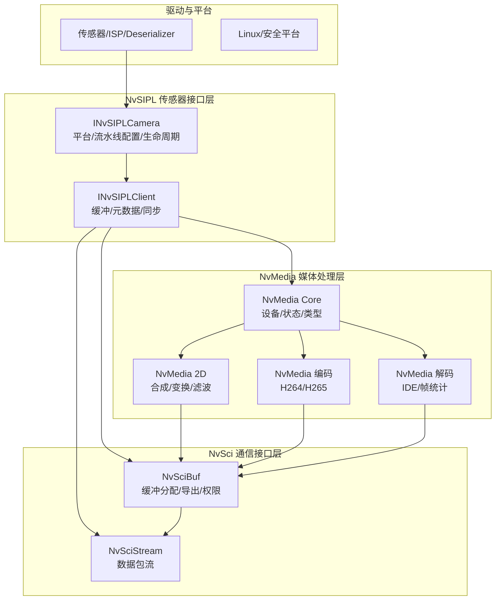
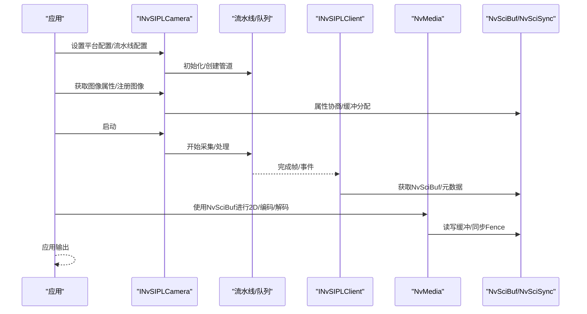
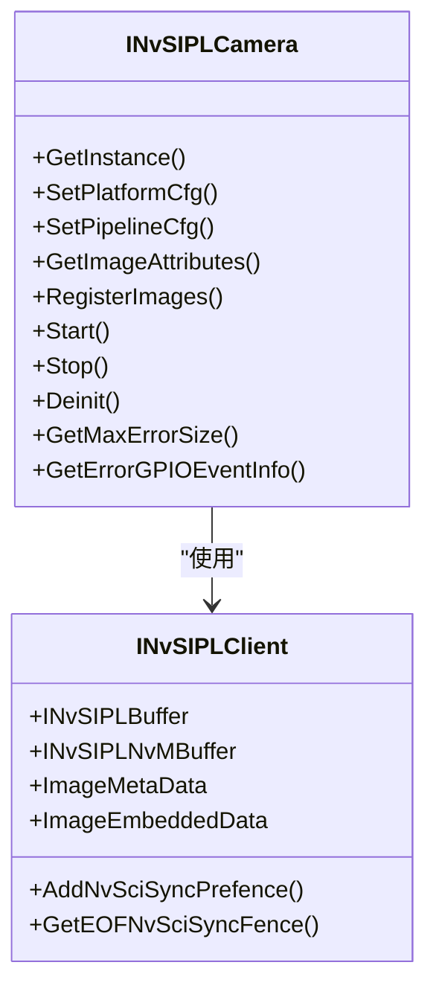
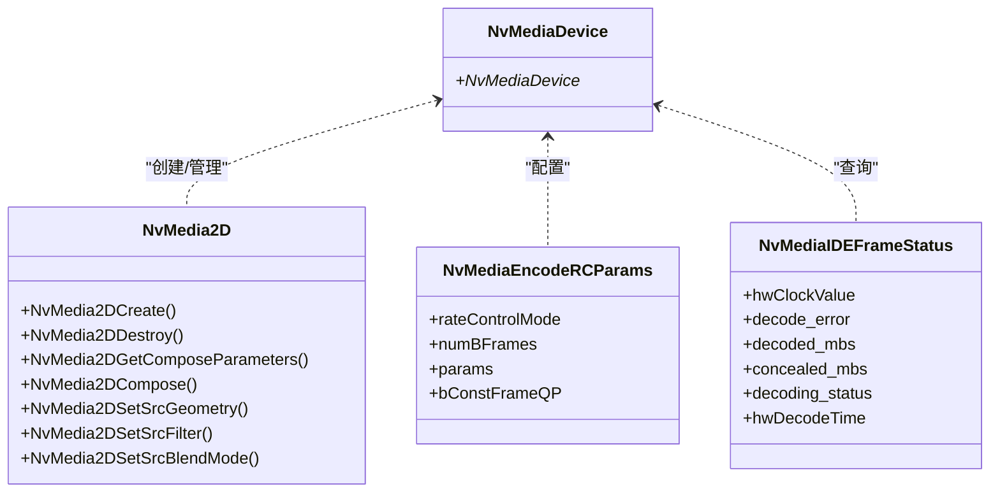
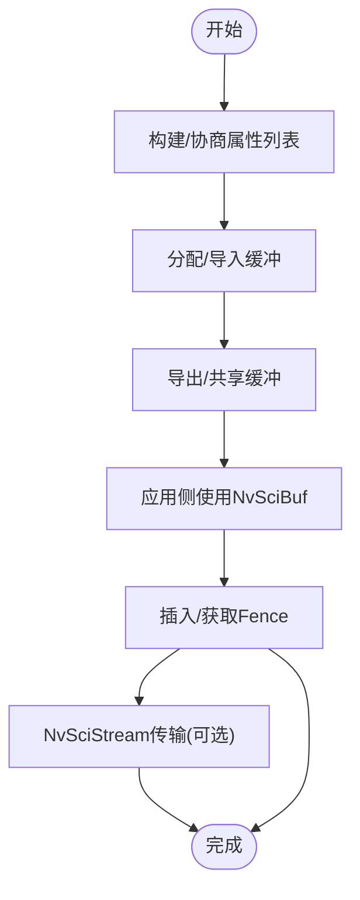
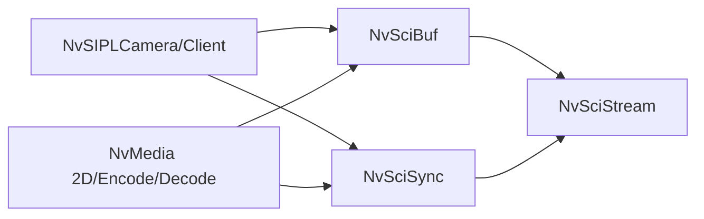

# 核心组件

<cite>
**本文引用的文件**
- [NvSIPLCommon.hpp](file://driveos-6.0.5.0/drive-linux/include/NvSIPLCommon.hpp)
- [NvSIPLClient.hpp](file://driveos-6.0.5.0/drive-linux/include/NvSIPLClient.hpp)
- [NvSIPLCamera.hpp](file://driveos-6.0.5.0/drive-linux/include/NvSIPLCamera.hpp)
- [nvmedia_core.h](file://driveos-6.0.5.0/drive-linux/include/nvmedia_6x/nvmedia_core.h)
- [nvmedia_2d.h](file://driveos-6.0.5.0/drive-linux/include/nvmedia_6x/nvmedia_2d.h)
- [nvmedia_common_decode.h](file://driveos-6.0.5.0/drive-linux/include/nvmedia_6x/nvmedia_common_decode.h)
- [nvmedia_common_encode.h](file://driveos-6.0.5.0/drive-linux/include/nvmedia_6x/nvmedia_common_encode.h)
- [nvscibuf.h](file://driveos-6.0.5.0/drive-linux/include/nvscibuf.h)
- [nvscistream.h](file://driveos-6.0.5.0/drive-linux/include/nvscistream.h)
</cite>

## 目录
1. [引言](#引言)
2. [项目结构](#项目结构)
3. [核心组件](#核心组件)
4. [架构总览](#架构总览)
5. [详细组件分析](#详细组件分析)
6. [依赖关系分析](#依赖关系分析)
7. [性能考量](#性能考量)
8. [故障排查指南](#故障排查指南)
9. [结论](#结论)
10. [附录](#附录)

## 引言
本文件面向DriveOS核心组件的架构与实现，聚焦三大层次：NvSIPL传感器接口层、NvMedia媒体处理层、NvSci通信接口层。文档旨在阐明各组件的设计理念、职责划分、数据流与控制流，以及它们之间的交互关系；并给出端到端从传感器数据采集到应用输出的完整流程说明，帮助开发者快速理解与高效集成。

## 项目结构
- NvSIPL（传感器接口层）：负责平台配置、流水线配置、图像属性查询、图像注册、启动/停止/反初始化等生命周期管理，并通过NvSciBuf/NvSciSync与媒体层解耦。
- NvMedia（媒体处理层）：提供统一的媒体对象模型与API，覆盖2D合成、编码、解码等能力，支持NvSciBuf作为底层缓冲交换介质。
- NvSci（通信接口层）：提供跨进程/跨模块的缓冲分配与同步机制，支撑NvSIPL与NvMedia之间的高性能数据通路。

图表来源
- [NvSIPLCamera.hpp:158-701](file://driveos-6.0.5.0/drive-linux/include/NvSIPLCamera.hpp#L158-L701)
- [NvSIPLClient.hpp:52-361](file://driveos-6.0.5.0/drive-linux/include/NvSIPLClient.hpp#L52-L361)
- [nvmedia_core.h:16-265](file://driveos-6.0.5.0/drive-linux/include/nvmedia_6x/nvmedia_core.h#L16-L265)
- [nvmedia_2d.h:18-526](file://driveos-6.0.5.0/drive-linux/include/nvmedia_6x/nvmedia_2d.h#L18-L526)
- [nvmedia_common_decode.h:1-120](file://driveos-6.0.5.0/drive-linux/include/nvmedia_6x/nvmedia_common_decode.h#L1-L120)
- [nvmedia_common_encode.h:1-196](file://driveos-6.0.5.0/drive-linux/include/nvmedia_6x/nvmedia_common_encode.h#L1-L196)
- [nvscibuf.h:118-182](file://driveos-6.0.5.0/drive-linux/include/nvscibuf.h#L118-L182)
- [nvscistream.h:1-32](file://driveos-6.0.5.0/drive-linux/include/nvscistream.h#L1-L32)

章节来源
- [NvSIPLCamera.hpp:158-701](file://driveos-6.0.5.0/drive-linux/include/NvSIPLCamera.hpp#L158-L701)
- [NvSIPLClient.hpp:52-361](file://driveos-6.0.5.0/drive-linux/include/NvSIPLClient.hpp#L52-L361)
- [nvmedia_core.h:16-265](file://driveos-6.0.5.0/drive-linux/include/nvmedia_6x/nvmedia_core.h#L16-L265)
- [nvscibuf.h:118-182](file://driveos-6.0.5.0/drive-linux/include/nvscibuf.h#L118-L182)
- [nvscistream.h:1-32](file://driveos-6.0.5.0/drive-linux/include/nvscistream.h#L1-L32)

## 核心组件
- NvSIPL（传感器接口层）
  - 职责：平台配置、流水线配置、图像属性查询、图像注册、启动/停止/反初始化、错误查询与GPIO事件读取。
  - 关键接口：INvSIPLCamera生命周期方法、INvSIPLClient缓冲与元数据接口、NvSciSync/NvSciBuf集成点。
- NvMedia（媒体处理层）
  - 职责：统一的媒体对象模型、2D合成、编码、解码；通过NvSciBuf实现跨模块缓冲共享。
  - 关键接口：NvMediaDevice、2D合成、编码参数、解码帧统计等。
- NvSci（通信接口层）
  - 职责：缓冲分配与导出、属性协商、跨进程/跨模块同步（NvSciSync）、数据包流（NvSciStream）。
  - 关键接口：NvSciBuf类型/属性键、NvSciBufAttrList、NvSciSync Fence等。

章节来源
- [NvSIPLCommon.hpp:24-219](file://driveos-6.0.5.0/drive-linux/include/NvSIPLCommon.hpp#L24-L219)
- [NvSIPLClient.hpp:52-361](file://driveos-6.0.5.0/drive-linux/include/NvSIPLClient.hpp#L52-L361)
- [NvSIPLCamera.hpp:158-701](file://driveos-6.0.5.0/drive-linux/include/NvSIPLCamera.hpp#L158-L701)
- [nvmedia_core.h:16-265](file://driveos-6.0.5.0/drive-linux/include/nvmedia_6x/nvmedia_core.h#L16-L265)
- [nvmedia_2d.h:18-526](file://driveos-6.0.5.0/drive-linux/include/nvmedia_6x/nvmedia_2d.h#L18-L526)
- [nvmedia_common_decode.h:1-120](file://driveos-6.0.5.0/drive-linux/include/nvmedia_6x/nvmedia_common_decode.h#L1-L120)
- [nvmedia_common_encode.h:1-196](file://driveos-6.0.5.0/drive-linux/include/nvmedia_6x/nvmedia_common_encode.h#L1-L196)
- [nvscibuf.h:118-182](file://driveos-6.0.5.0/drive-linux/include/nvscibuf.h#L118-L182)

## 架构总览
NvSIPL以“平台-流水线-图像”为主线，完成从传感器原始数据到ISP输出的全链路编排；NvMedia以“设备-任务-缓冲”为核心，提供2D合成、编码、解码等处理能力；NvSci贯穿其中，提供跨模块的缓冲与同步能力，确保高吞吐与低时延。

图表来源
- [NvSIPLCamera.hpp:221-642](file://driveos-6.0.5.0/drive-linux/include/NvSIPLCamera.hpp#L221-L642)
- [NvSIPLClient.hpp:263-346](file://driveos-6.0.5.0/drive-linux/include/NvSIPLClient.hpp#L263-L346)
- [nvmedia_2d.h:474-701](file://driveos-6.0.5.0/drive-linux/include/nvmedia_6x/nvmedia_2d.h#L474-L701)
- [nvscibuf.h:383-471](file://driveos-6.0.5.0/drive-linux/include/nvscibuf.h#L383-L471)

## 详细组件分析

### NvSIPL 传感器接口层
- 设计理念
  - 抽象与简化：向上提供统一的相机接口，向下屏蔽设备块、序列化器、ISP细节。
  - 模块化：平台配置、流水线配置、图像注册、生命周期管理分层清晰。
  - 可扩展：支持多输出类型（ICP/ISP0/ISP1/ISP2），支持自动控制插件注册。
- 关键接口与职责
  - 平台配置：SetPlatformCfg，约束外部设备与平台拓扑。
  - 流水线配置：SetPipelineCfg，定义输出类型与队列。
  - 图像属性与注册：GetImageAttributes/RegisterImages，配合NvSciBuf完成缓冲共享。
  - 生命周期：Init/Start/Stop/Deinit，保证资源有序分配与回收。
  - 错误与事件：GetMaxErrorSize/GetErrorGPIOEventInfo，便于诊断与恢复。
- 数据结构
  - 输出类型枚举：ICP/ISP0/ISP1/ISP2。
  - 元数据结构：ImageMetaData/ImageEmbeddedData，承载曝光、白平衡、温度、直方图等统计信息。
- 与NvSci的集成
  - 通过AddNvSciSyncPrefence/GetEOFNvSciSyncFence实现帧级同步。

图表来源
- [NvSIPLCamera.hpp:158-701](file://driveos-6.0.5.0/drive-linux/include/NvSIPLCamera.hpp#L158-L701)
- [NvSIPLClient.hpp:52-361](file://driveos-6.0.5.0/drive-linux/include/NvSIPLClient.hpp#L52-L361)

章节来源
- [NvSIPLCamera.hpp:158-701](file://driveos-6.0.5.0/drive-linux/include/NvSIPLCamera.hpp#L158-L701)
- [NvSIPLClient.hpp:52-361](file://driveos-6.0.5.0/drive-linux/include/NvSIPLClient.hpp#L52-L361)
- [NvSIPLCommon.hpp:24-219](file://driveos-6.0.5.0/drive-linux/include/NvSIPLCommon.hpp#L24-L219)

### NvMedia 媒体处理层
- 设计理念
  - 统一对象模型：NvMediaDevice作为根，其他对象在其上创建与管理。
  - 类型与属性：通过NvMedia核心类型与属性体系，支撑2D、编码、解码等处理。
  - 同步与缓冲：与NvSciBuf/NvSciSync协同，保障跨引擎数据一致性与时序。
- 关键接口与职责
  - 2D合成：NvMedia2DCreate/Destroy、参数获取、几何/滤波/混合设置、Compose提交与结果返回。
  - 编码：编码参数（码率、GOP、质量预设等）、图片类型、SPS/PPS/VPS获取、特性开关。
  - 解码：IDE帧状态、参考帧集合、运动矢量统计、切片级解码数据。
- 数据结构
  - 版本信息、错误码、时间戳、矩形区域、布尔标志等基础类型。
  - 2D合成参数、滤波系数、Compose结果等处理相关结构。

图表来源
- [nvmedia_core.h:16-265](file://driveos-6.0.5.0/drive-linux/include/nvmedia_6x/nvmedia_core.h#L16-L265)
- [nvmedia_2d.h:18-526](file://driveos-6.0.5.0/drive-linux/include/nvmedia_6x/nvmedia_2d.h#L18-L526)
- [nvmedia_common_encode.h:1-196](file://driveos-6.0.5.0/drive-linux/include/nvmedia_6x/nvmedia_common_encode.h#L1-L196)
- [nvmedia_common_decode.h:1-120](file://driveos-6.0.5.0/drive-linux/include/nvmedia_6x/nvmedia_common_decode.h#L1-L120)

章节来源
- [nvmedia_core.h:16-265](file://driveos-6.0.5.0/drive-linux/include/nvmedia_6x/nvmedia_core.h#L16-L265)
- [nvmedia_2d.h:18-526](file://driveos-6.0.5.0/drive-linux/include/nvmedia_6x/nvmedia_2d.h#L18-L526)
- [nvmedia_common_encode.h:1-196](file://driveos-6.0.5.0/drive-linux/include/nvmedia_6x/nvmedia_common_encode.h#L1-L196)
- [nvmedia_common_decode.h:1-120](file://driveos-6.0.5.0/drive-linux/include/nvmedia_6x/nvmedia_common_decode.h#L1-L120)

### NvSci 通信接口层
- 设计理念
  - 以NvSciBuf为核心，提供跨进程/跨模块的缓冲分配、属性协商与权限控制。
  - 以NvSciSync为纽带，提供Start-of-frame/End-of-frame Fence同步语义。
  - 以NvSciStream为工具，封装数据包流的发送/接收与多播/单播场景。
- 关键接口与职责
  - NvSciBuf：类型/属性键、属性列表、缓冲分配/导入/导出、CPU/GPU缓存一致性、压缩策略。
  - NvSciSync：信号者/等待者角色、SOFFence/EOFFence/Fence管理。
  - NvSciStream：在NvSciBuf/NvSciSync之上提供数据包流抽象。
- 数据结构
  - NvSciBufType（通用/原始缓冲/图像/张量/数组/金字塔）、属性键族、访问权限、GPU缓存/压缩策略等。

图表来源
- [nvscibuf.h:383-471](file://driveos-6.0.5.0/drive-linux/include/nvscibuf.h#L383-L471)
- [nvscibuf.h:118-182](file://driveos-6.0.5.0/drive-linux/include/nvscibuf.h#L118-L182)
- [nvscistream.h:1-32](file://driveos-6.0.5.0/drive-linux/include/nvscistream.h#L1-L32)

章节来源
- [nvscibuf.h:118-182](file://driveos-6.0.5.0/drive-linux/include/nvscibuf.h#L118-L182)
- [nvscibuf.h:383-471](file://driveos-6.0.5.0/drive-linux/include/nvscibuf.h#L383-L471)
- [nvscistream.h:1-32](file://driveos-6.0.5.0/drive-linux/include/nvscistream.h#L1-L32)

## 依赖关系分析
- 组件耦合
  - NvSIPLCamera依赖NvSIPLClient与NvSciBuf/NvSciSync，用于图像缓冲与同步。
  - NvMedia依赖NvSciBuf/NvSciSync实现跨引擎缓冲共享与同步。
  - NvSciBuf/NvSciSync为NvSIPL与NvMedia提供通用基础设施。
- 外部依赖
  - Linux平台与安全平台差异体现在API可用性与权限要求。
  - 驱动栈（传感器/ISP/Deserializer）通过NvSIPL接口暴露能力。

图表来源
- [NvSIPLClient.hpp:52-361](file://driveos-6.0.5.0/drive-linux/include/NvSIPLClient.hpp#L52-L361)
- [nvmedia_2d.h:474-701](file://driveos-6.0.5.0/drive-linux/include/nvmedia_6x/nvmedia_2d.h#L474-L701)
- [nvscibuf.h:118-182](file://driveos-6.0.5.0/drive-linux/include/nvscibuf.h#L118-L182)
- [nvscistream.h:1-32](file://driveos-6.0.5.0/drive-linux/include/nvscistream.h#L1-L32)

章节来源
- [NvSIPLClient.hpp:52-361](file://driveos-6.0.5.0/drive-linux/include/NvSIPLClient.hpp#L52-L361)
- [nvmedia_2d.h:474-701](file://driveos-6.0.5.0/drive-linux/include/nvmedia_6x/nvmedia_2d.h#L474-L701)
- [nvscibuf.h:118-182](file://driveos-6.0.5.0/drive-linux/include/nvscibuf.h#L118-L182)
- [nvscistream.h:1-32](file://driveos-6.0.5.0/drive-linux/include/nvscistream.h#L1-L32)

## 性能考量
- 缓冲与内存
  - 合理设置NvSciBuf属性（类型、尺寸、对齐、CPU/GPU缓存、压缩）以降低拷贝与同步开销。
  - 控制缓冲数量与复用策略，避免频繁分配/释放导致抖动。
- 同步与并发
  - 利用NvSciSync Fence实现帧级同步，减少轮询与阻塞。
  - 将CPU/GPU访问路径最小化，优先使用GPU内核处理。
- 算法与流水线
  - 在NvMedia 2D中选择合适的滤波模式与变换，权衡质量与吞吐。
  - 编码/解码参数（码率、GOP、质量预设）按场景动态调整。
- I/O与带宽
  - NvSciStream适合高吞吐场景，注意包池管理与背压控制。

## 故障排查指南
- 常见错误码与含义
  - NvMediaStatus/NVSIPL_STATUS_*：BAD_PARAMETER/TIMED_OUT/OUT_OF_MEMORY/INVALID_STATE/ERROR等。
- 排查步骤
  - 检查平台/流水线配置是否匹配硬件能力。
  - 确认图像属性与下游消费者一致，避免属性不匹配导致的失败。
  - 使用GetMaxErrorSize/GetErrorGPIOEventInfo获取设备/GPIO错误详情。
  - 核对NvSciBuf属性协商结果与实际使用是否一致。
  - 关注NvSciSync Fence状态，确保同步时机正确。
- 建议
  - 在关键路径打印关键状态（如缓冲分配、属性协商、Fence获取/插入）。
  - 对异常路径增加重试与降级策略（如切换输出格式/降低分辨率）。

章节来源
- [nvmedia_core.h:104-139](file://driveos-6.0.5.0/drive-linux/include/nvmedia_6x/nvmedia_core.h#L104-L139)
- [NvSIPLCommon.hpp:115-143](file://driveos-6.0.5.0/drive-linux/include/NvSIPLCommon.hpp#L115-L143)
- [NvSIPLCamera.hpp:736-799](file://driveos-6.0.5.0/drive-linux/include/NvSIPLCamera.hpp#L736-L799)

## 结论
NvSIPL/NvMedia/NvSci三层次架构通过清晰的职责划分与标准化接口，实现了从传感器数据采集到应用输出的高效、可扩展处理链路。NvSIPL负责平台与流水线编排，NvMedia提供统一的媒体处理能力，NvSci则提供跨模块的缓冲与同步基础设施。遵循本文的集成与优化建议，可在DriveOS平台上实现稳定、高性能的视觉处理系统。

## 附录
- API与类型速览
  - NvSIPL：INvSIPLCamera生命周期、INvSIPLClient缓冲/元数据、NvSciSync/NvSciBuf集成。
  - NvMedia：NvMediaDevice、NvMedia2D、编码参数、解码帧统计。
  - NvSci：NvSciBuf类型/属性键、属性列表、Fence、NvSciStream。