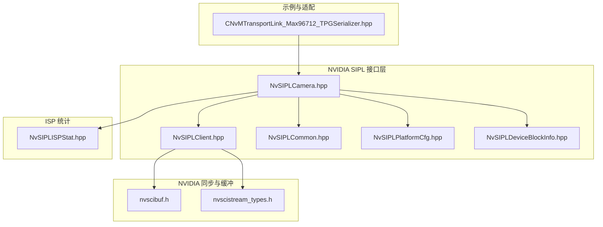
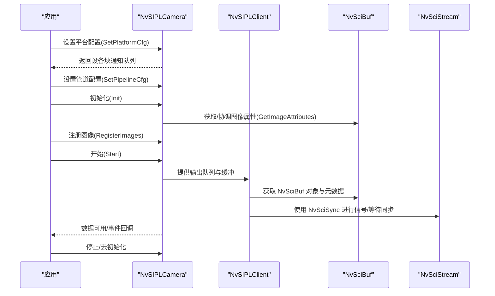
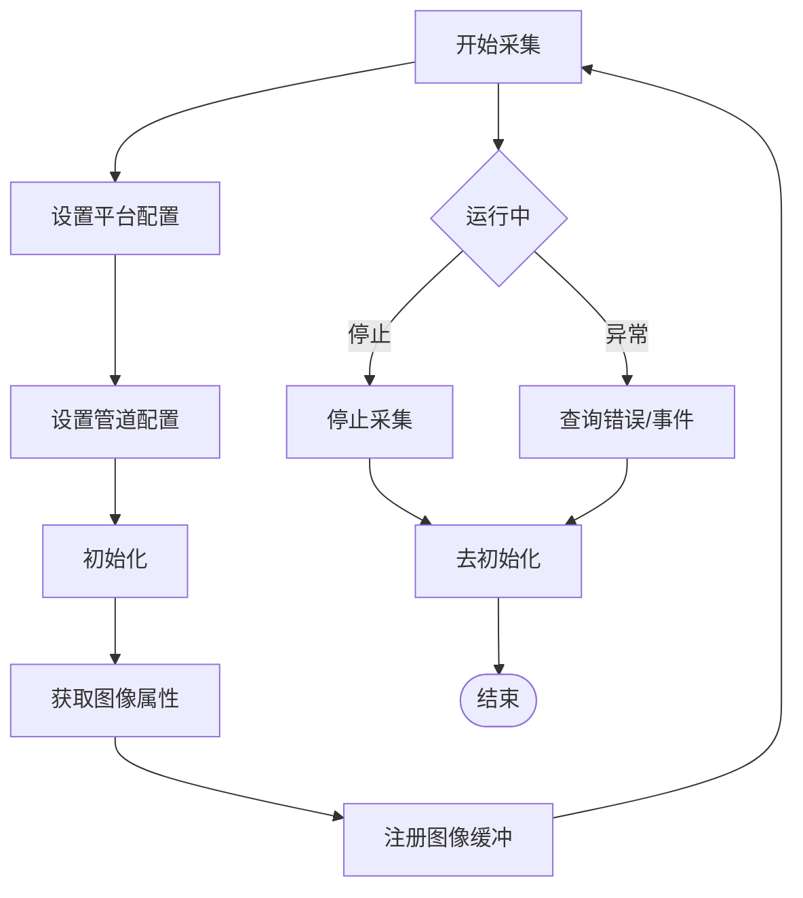
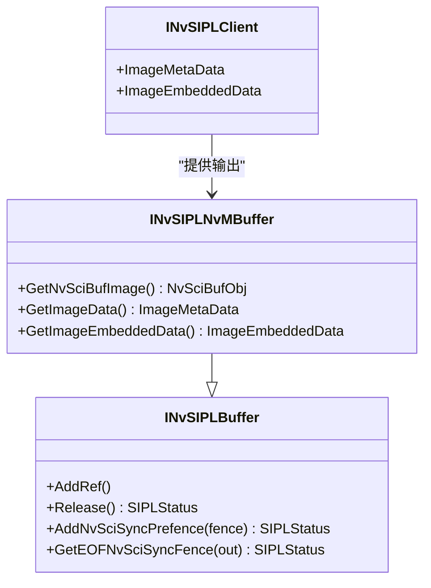
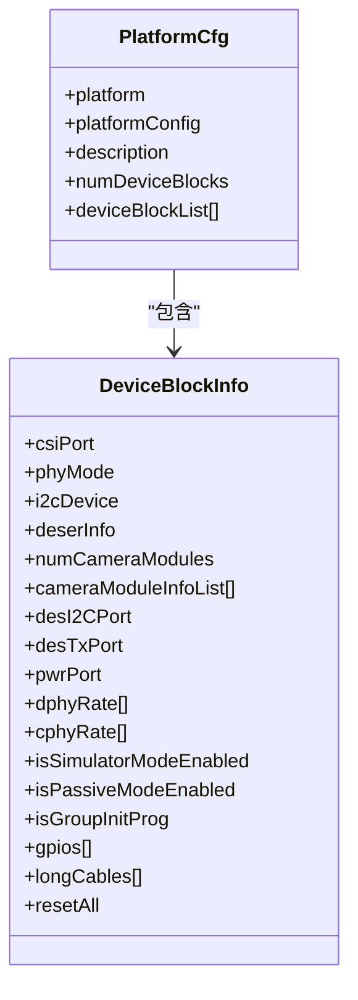
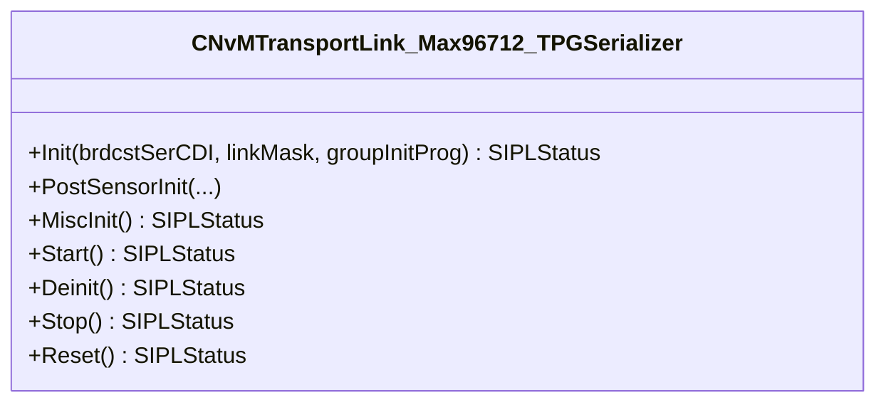
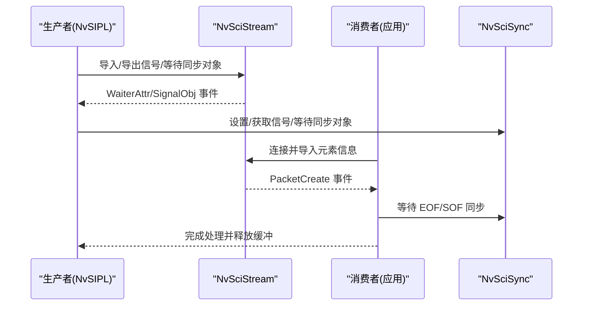
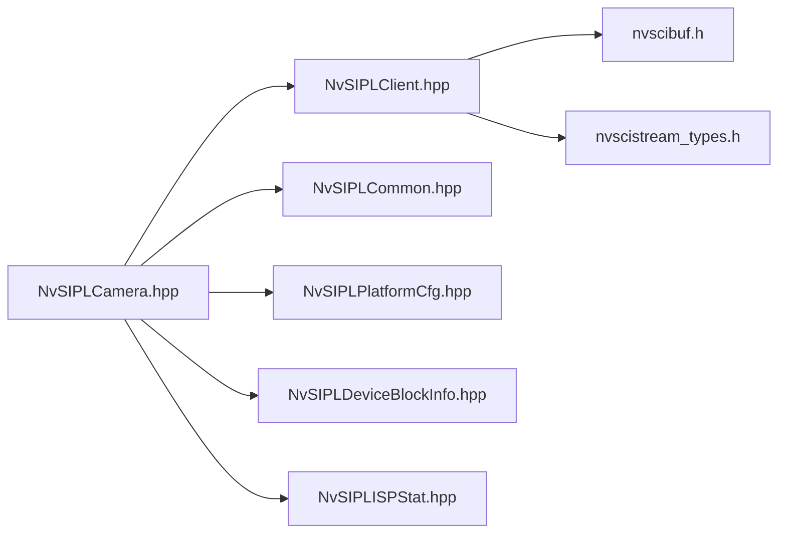

# 传感器集成

<cite>
**本文引用的文件**   
- [NvSIPLCamera.hpp](file://driveos-6.0.5.0/drive-linux/include/NvSIPLCamera.hpp)
- [NvSIPLClient.hpp](file://driveos-6.0.5.0/drive-linux/include/NvSIPLClient.hpp)
- [NvSIPLCommon.hpp](file://driveos-6.0.5.0/drive-linux/include/NvSIPLCommon.hpp)
- [NvSIPLPlatformCfg.hpp](file://driveos-6.0.5.0/drive-linux/include/NvSIPLPlatformCfg.hpp)
- [NvSIPLDeviceBlockInfo.hpp](file://driveos-6.0.5.0/drive-linux/include/NvSIPLDeviceBlockInfo.hpp)
- [NvSIPLISPStat.hpp](file://driveos-6081/drive-linux/include/NvSIPLISPStat.hpp)
- [nvscibuf.h](file://driveos-6.0.6.0/drive-linux/include/nvscibuf.h)
- [nvscistream_types.h](file://driveos-6.0.6.0/usr/include/nvscistream_types.h)
- [CNvMTransportLink_Max96712_TPGSerializer.hpp](file://driveos-6.0.5.0/drive-linux/samples/nvmedia/nvsipl/devblk/cameramodule/MAX96712cameramodule/CNvMTransportLink_Max96712_TPGSerializer.hpp)
- [README.md](file://README.md)
</cite>

## 目录
1. [引言](#引言)
2. [项目结构](#项目结构)
3. [核心组件](#核心组件)
4. [架构总览](#架构总览)
5. [详细组件分析](#详细组件分析)
6. [依赖关系分析](#依赖关系分析)
7. [性能考虑](#性能考虑)
8. [故障排查指南](#故障排查指南)
9. [结论](#结论)
10. [附录](#附录)

## 引言
本文件面向在 DriveOS 平台上集成各类传感器（如摄像头、IMU、雷达等）的开发者，系统性阐述如何通过 NvSIPL 传感器接口层完成从硬件连接到软件配置、从初始化与参数配置到数据采集与控制的全流程。文档同时覆盖多传感器融合与数据同步机制、传感器标定流程、以及常见问题的诊断与解决方法，并提供可直接定位到源码路径的参考线索，便于快速查阅与落地实施。

## 项目结构
本仓库包含多个版本的 DriveOS 发行版与驱动头文件，其中与传感器集成密切相关的头文件主要集中在以下位置：
- NvSIPL 接口与平台配置：位于 driveos-6.0.5.0/drive-linux/include 下
- NvSciBuf/NvSciStream 同步与缓冲交换：位于 driveos-6.0.6.0/drive-linux/include 与 usr/include 下
- ISP 统计结构定义：位于 driveos-6081/drive-linux/include 下
- 示例与传输链路适配：位于 driveos-6.0.5.0/drive-linux/samples 下

下图展示与传感器集成相关的关键文件与模块关系：

图表来源
- [NvSIPLCamera.hpp:151-701](file://driveos-6.0.5.0/drive-linux/include/NvSIPLCamera.hpp#L151-L701)
- [NvSIPLClient.hpp:46-361](file://driveos-6.0.5.0/drive-linux/include/NvSIPLClient.hpp#L46-L361)
- [NvSIPLCommon.hpp:114-143](file://driveos-6.0.5.0/drive-linux/include/NvSIPLCommon.hpp#L114-L143)
- [NvSIPLPlatformCfg.hpp:49-65](file://driveos-6.0.5.0/drive-linux/include/NvSIPLPlatformCfg.hpp#L49-L65)
- [NvSIPLDeviceBlockInfo.hpp:290-345](file://driveos-6.0.5.0/drive-linux/include/NvSIPLDeviceBlockInfo.hpp#L290-L345)
- [nvscibuf.h:99-3439](file://driveos-6.0.6.0/drive-linux/include/nvscibuf.h#L99-L3439)
- [nvscistream_types.h:323-479](file://driveos-6.0.6.0/usr/include/nvscistream_types.h#L323-L479)
- [NvSIPLISPStat.hpp:1-58](file://driveos-6081/drive-linux/include/NvSIPLISPStat.hpp#L1-L58)
- [CNvMTransportLink_Max96712_TPGSerializer.hpp:19-52](file://driveos-6.0.5.0/drive-linux/samples/nvmedia/nvsipl/devblk/cameramodule/MAX96712cameramodule/CNvMTransportLink_Max96712_TPGSerializer.hpp#L19-L52)

章节来源
- [NvSIPLCamera.hpp:1-1130](file://driveos-6.0.5.0/drive-linux/include/NvSIPLCamera.hpp#L1-L1130)
- [NvSIPLClient.hpp:1-368](file://driveos-6.0.5.0/drive-linux/include/NvSIPLClient.hpp#L1-L368)
- [NvSIPLCommon.hpp:1-219](file://driveos-6.0.5.0/drive-linux/include/NvSIPLCommon.hpp#L1-L219)
- [NvSIPLPlatformCfg.hpp:1-72](file://driveos-6.0.5.0/drive-linux/include/NvSIPLPlatformCfg.hpp#L1-L72)
- [NvSIPLDeviceBlockInfo.hpp:1-352](file://driveos-6.0.5.0/drive-linux/include/NvSIPLDeviceBlockInfo.hpp#L1-L352)
- [nvscibuf.h:99-4817](file://driveos-6.0.6.0/drive-linux/include/nvscibuf.h#L99-L4817)
- [nvscistream_types.h:323-479](file://driveos-6.0.6.0/usr/include/nvscistream_types.h#L323-L479)
- [NvSIPLISPStat.hpp:1-510](file://driveos-6081/drive-linux/include/NvSIPLISPStat.hpp#L1-L510)
- [CNvMTransportLink_Max96712_TPGSerializer.hpp:1-52](file://driveos-6.0.5.0/drive-linux/samples/nvmedia/nvsipl/devblk/cameramodule/MAX96712cameramodule/CNvMTransportLink_Max96712_TPGSerializer.hpp#L1-L52)

## 核心组件
- NvSIPLCamera：顶层相机接口，负责平台配置、管道配置、图像注册、启动停止、错误查询等生命周期管理。
- NvSIPLClient：客户端接口，提供输出缓冲、元数据、嵌入式数据、NvSciSync 同步对象等访问能力。
- NvSIPLCommon：通用状态码、时间基、GPIO 事件、错误详情等基础类型与枚举。
- NvSIPLPlatformCfg 与 NvSIPLDeviceBlockInfo：平台与设备块配置，描述传感器、EEPROM、序列化器、反序列化器、CSI 端口、I2C 地址、GPIO 映射等。
- NvSciBuf/NvSciStream：跨进程/跨模块的缓冲属性协商、导入导出、信号/等待同步对象的建立与事件通知。
- ISP 统计结构：直方图、坏像素、局部均值裁剪等统计结构，用于质量评估与自动控制插件。

章节来源
- [NvSIPLCamera.hpp:151-701](file://driveos-6.0.5.0/drive-linux/include/NvSIPLCamera.hpp#L151-L701)
- [NvSIPLClient.hpp:46-361](file://driveos-6.0.5.0/drive-linux/include/NvSIPLClient.hpp#L46-L361)
- [NvSIPLCommon.hpp:114-172](file://driveos-6.0.5.0/drive-linux/include/NvSIPLCommon.hpp#L114-L172)
- [NvSIPLPlatformCfg.hpp:49-65](file://driveos-6.0.5.0/drive-linux/include/NvSIPLPlatformCfg.hpp#L49-L65)
- [NvSIPLDeviceBlockInfo.hpp:290-345](file://driveos-6.0.5.0/drive-linux/include/NvSIPLDeviceBlockInfo.hpp#L290-L345)
- [nvscibuf.h:99-3439](file://driveos-6.0.6.0/drive-linux/include/nvscibuf.h#L99-L3439)
- [nvscistream_types.h:323-479](file://driveos-6.0.6.0/usr/include/nvscistream_types.h#L323-L479)
- [NvSIPLISPStat.hpp:1-510](file://driveos-6081/drive-linux/include/NvSIPLISPStat.hpp#L1-L510)

## 架构总览
下图展示了从传感器到应用的数据通路与控制流，以及与 NvSciBuf/NvSciStream 的同步协作：

图表来源
- [NvSIPLCamera.hpp:188-701](file://driveos-6.0.5.0/drive-linux/include/NvSIPLCamera.hpp#L188-L701)
- [NvSIPLClient.hpp:46-361](file://driveos-6.0.5.0/drive-linux/include/NvSIPLClient.hpp#L46-L361)
- [nvscibuf.h:99-3439](file://driveos-6.0.6.0/drive-linux/include/nvscibuf.h#L99-L3439)
- [nvscistream_types.h:323-479](file://driveos-6.0.6.0/usr/include/nvscistream_types.h#L323-L479)

## 详细组件分析

### NvSIPLCamera 生命周期与控制接口
- 平台配置：设置平台名称、配置名、描述、设备块数量与列表，确保外部设备受支持。
- 管道配置：为每个传感器设置输出类型（ICP/ISP0/ISP1/ISP2）、队列与属性。
- 图像注册：根据下游消费者要求协调 NvSciBuf 属性后注册图像缓冲。
- 启动/停止/去初始化：按序启动流水线、停止采集、释放资源。
- 错误查询：查询最大错误尺寸、读取错误 GPIO 事件、获取详细错误信息。

图表来源
- [NvSIPLCamera.hpp:188-701](file://driveos-6.0.5.0/drive-linux/include/NvSIPLCamera.hpp#L188-L701)

章节来源
- [NvSIPLCamera.hpp:188-701](file://driveos-6.0.5.0/drive-linux/include/NvSIPLCamera.hpp#L188-L701)

### NvSIPLClient 输出与同步
- 输出缓冲：INvSIPLNvMBuffer 暴露 NvSciBufObj、图像元数据与嵌入式数据。
- 同步对象：AddNvSciSyncPrefence/GetEOFNvSciSyncFence 与 NvSciStream 事件配合，实现生产者-消费者的时序同步。
- 元数据：帧时间戳、曝光、白平衡、温度、CRC、ISP 统计等。

图表来源
- [NvSIPLClient.hpp:126-361](file://driveos-6.0.5.0/drive-linux/include/NvSIPLClient.hpp#L126-L361)

章节来源
- [NvSIPLClient.hpp:46-361](file://driveos-6.0.5.0/drive-linux/include/NvSIPLClient.hpp#L46-L361)

### 设备块与平台配置（硬件连接与 I2C/SPI）
- 设备块信息：描述 CSI 端口、I2C 总线、反序列化器、序列化器、传感器、EEPROM、GPIO 映射、速率模式（DPHY/CPHY）等。
- 平台配置：平台名、配置名、描述、设备块数组，限制每平台最大设备块数与模块数。

图表来源
- [NvSIPLDeviceBlockInfo.hpp:290-345](file://driveos-6.0.5.0/drive-linux/include/NvSIPLDeviceBlockInfo.hpp#L290-L345)
- [NvSIPLPlatformCfg.hpp:49-65](file://driveos-6.0.5.0/drive-linux/include/NvSIPLPlatformCfg.hpp#L49-L65)

章节来源
- [NvSIPLDeviceBlockInfo.hpp:66-345](file://driveos-6.0.5.0/drive-linux/include/NvSIPLDeviceBlockInfo.hpp#L66-L345)
- [NvSIPLPlatformCfg.hpp:49-65](file://driveos-6.0.5.0/drive-linux/include/NvSIPLPlatformCfg.hpp#L49-L65)

### 传输链路适配与传感器驱动开发要点
- 传输链路适配器：示例中提供针对特定序列化器（如 MAX96712）的传输链路适配类，实现初始化、启动、停止、复位等生命周期方法。
- 驱动开发关注点：设备树配置、I2C/SPI 接口使用、中断处理、GPIO 映射、CDI v2 API 支持、长线缆/被动模式、组初始化等。

图表来源
- [CNvMTransportLink_Max96712_TPGSerializer.hpp:19-52](file://driveos-6.0.5.0/drive-linux/samples/nvmedia/nvsipl/devblk/cameramodule/MAX96712cameramodule/CNvMTransportLink_Max96712_TPGSerializer.hpp#L19-L52)

章节来源
- [CNvMTransportLink_Max96712_TPGSerializer.hpp:1-52](file://driveos-6.0.5.0/drive-linux/samples/nvmedia/nvsipl/devblk/cameramodule/MAX96712cameramodule/CNvMTransportLink_Max96712_TPGSerializer.hpp#L1-L52)

### 多传感器融合与数据同步机制
- NvSciBuf 属性协商：通过 NvSciBufAttrListReconcile 协调不同模块间图像/张量格式、颜色标准、内存布局等，确保跨进程/跨模块共享。
- NvSciStream 事件与同步对象：利用 Waiter/Signal 同步对象与事件（如 Connected、SignalObj、PacketCreate）实现生产者-消费者时序对齐。
- 时间戳与全局时间：支持 PTP/单调时钟/用户自定义时钟，结合元数据中的 TSC 与帧号，进行跨传感器时间对齐。

图表来源
- [nvscibuf.h:99-3439](file://driveos-6.0.6.0/drive-linux/include/nvscibuf.h#L99-L3439)
- [nvscistream_types.h:323-479](file://driveos-6.0.6.0/usr/include/nvscistream_types.h#L323-L479)

章节来源
- [nvscibuf.h:99-4817](file://driveos-6.0.6.0/drive-linux/include/nvscibuf.h#L99-L4817)
- [nvscistream_types.h:323-479](file://driveos-6.0.6.0/usr/include/nvscistream_types.h#L323-L479)

### 传感器校准与标定流程
- 内参标定：基于 ISP 统计结构（直方图、坏像素、局部均值裁剪）与嵌入式数据解析，评估曝光、白平衡、温度等参数，指导 ISP 参数调整。
- 外参标定：结合多传感器时间戳与几何关系，利用 NvSiplGlobalTime 与帧号进行外参估计与优化。
- 参考结构：ISP 统计结构定义与有效标志位，便于在自动控制插件中启用或禁用相应统计项。

章节来源
- [NvSIPLISPStat.hpp:1-510](file://driveos-6081/drive-linux/include/NvSIPLISPStat.hpp#L1-L510)
- [NvSIPLClient.hpp:55-124](file://driveos-6.0.5.0/drive-linux/include/NvSIPLClient.hpp#L55-L124)

## 依赖关系分析
- NvSIPLCamera 依赖 NvSIPLClient、NvSIPLCommon、NvSIPLPlatformCfg、NvSIPLDeviceBlockInfo。
- NvSIPLClient 依赖 NvSciBuf 与 NvSciStream 类型与事件。
- ISP 统计结构独立于具体传感器，但被 NvSIPLClient 的元数据结构引用。

图表来源
- [NvSIPLCamera.hpp:151-701](file://driveos-6.0.5.0/drive-linux/include/NvSIPLCamera.hpp#L151-L701)
- [NvSIPLClient.hpp:46-361](file://driveos-6.0.5.0/drive-linux/include/NvSIPLClient.hpp#L46-L361)
- [NvSIPLCommon.hpp:114-172](file://driveos-6.0.5.0/drive-linux/include/NvSIPLCommon.hpp#L114-L172)
- [NvSIPLPlatformCfg.hpp:49-65](file://driveos-6.0.5.0/drive-linux/include/NvSIPLPlatformCfg.hpp#L49-L65)
- [NvSIPLDeviceBlockInfo.hpp:290-345](file://driveos-6.0.5.0/drive-linux/include/NvSIPLDeviceBlockInfo.hpp#L290-L345)
- [nvscibuf.h:99-3439](file://driveos-6.0.6.0/drive-linux/include/nvscibuf.h#L99-L3439)
- [nvscistream_types.h:323-479](file://driveos-6.0.6.0/usr/include/nvscistream_types.h#L323-L479)
- [NvSIPLISPStat.hpp:1-510](file://driveos-6081/drive-linux/include/NvSIPLISPStat.hpp#L1-L510)

章节来源
- [NvSIPLCamera.hpp:151-701](file://driveos-6.0.5.0/drive-linux/include/NvSIPLCamera.hpp#L151-L701)
- [NvSIPLClient.hpp:46-361](file://driveos-6.0.5.0/drive-linux/include/NvSIPLClient.hpp#L46-L361)
- [NvSIPLCommon.hpp:114-172](file://driveos-6.0.5.0/drive-linux/include/NvSIPLCommon.hpp#L114-L172)
- [NvSIPLPlatformCfg.hpp:49-65](file://driveos-6.0.5.0/drive-linux/include/NvSIPLPlatformCfg.hpp#L49-L65)
- [NvSIPLDeviceBlockInfo.hpp:290-345](file://driveos-6.0.5.0/drive-linux/include/NvSIPLDeviceBlockInfo.hpp#L290-L345)
- [nvscibuf.h:99-4817](file://driveos-6.0.6.0/drive-linux/include/nvscibuf.h#L99-L4817)
- [nvscistream_types.h:323-479](file://driveos-6.0.6.0/usr/include/nvscistream_types.h#L323-L479)
- [NvSIPLISPStat.hpp:1-510](file://driveos-6081/drive-linux/include/NvSIPLISPStat.hpp#L1-L510)

## 性能考虑
- 缓冲属性协商：尽量减少跨模块属性差异，避免不必要的格式转换与拷贝。
- 同步开销：合理使用 NvSciSync 的信号/等待对象，避免过度阻塞；利用事件驱动模型降低轮询成本。
- ISP 统计：仅启用必要的统计项，减少 CPU/GPU 负载。
- 多传感器同步：优先采用 PTP 时间基，保证跨传感器时间戳一致性，降低后期对齐代价。

## 故障排查指南
- 硬件连接问题
  - 检查设备块配置中的 I2C 地址、CSI 端口、PHY 模式、速率配置是否匹配硬件。
  - 若为长线缆或被动模式，确认对应开关已正确设置。
- 驱动加载失败
  - 确认平台配置与设备块信息一致；检查 CDI v2 API 支持与 GPIO 映射。
  - 查看错误查询接口返回的最大错误尺寸与错误详情，定位具体模块（传感器/序列化器）。
- 数据异常
  - 解析嵌入式数据与元数据，核对曝光、白平衡、温度、CRC 等字段。
  - 结合 ISP 统计（直方图、坏像素、局部均值裁剪）判断是否存在异常区域或统计失效标志。

章节来源
- [NvSIPLCamera.hpp:736-799](file://driveos-6.0.5.0/drive-linux/include/NvSIPLCamera.hpp#L736-L799)
- [NvSIPLClient.hpp:55-124](file://driveos-6.0.5.0/drive-linux/include/NvSIPLClient.hpp#L55-L124)
- [NvSIPLDeviceBlockInfo.hpp:66-345](file://driveos-6.0.5.0/drive-linux/include/NvSIPLDeviceBlockInfo.hpp#L66-L345)

## 结论
通过 NvSIPL 接口层与 NvSciBuf/NvSciStream 的协同，DriveOS 能够高效地集成多种传感器设备，实现从硬件连接到软件配置、从初始化到数据采集与控制的全链路管理。结合 ISP 统计与多传感器同步机制，可进一步提升系统的稳定性与精度。建议在实际部署中严格遵循平台与设备块配置规范，合理选择同步策略与统计项，并建立完善的故障排查流程。

## 附录
- 实际代码示例与配置文件模板可参考以下路径（以“代码片段路径”形式给出，便于快速定位）：
  - 平台配置结构体与设备块信息：[NvSIPLPlatformCfg.hpp:49-65](file://driveos-6.0.5.0/drive-linux/include/NvSIPLPlatformCfg.hpp#L49-L65)，[NvSIPLDeviceBlockInfo.hpp:290-345](file://driveos-6.0.5.0/drive-linux/include/NvSIPLDeviceBlockInfo.hpp#L290-L345)
  - 传感器接口顶层 API：[NvSIPLCamera.hpp:188-701](file://driveos-6.0.5.0/drive-linux/include/NvSIPLCamera.hpp#L188-L701)
  - 客户端输出与同步接口：[NvSIPLClient.hpp:46-361](file://driveos-6.0.5.0/drive-linux/include/NvSIPLClient.hpp#L46-L361)
  - NvSciBuf 属性与导入导出接口：[nvscibuf.h:99-4817](file://driveos-6.0.6.0/drive-linux/include/nvscibuf.h#L99-L4817)
  - NvSciStream 事件与同步对象：[nvscistream_types.h:323-479](file://driveos-6.0.6.0/usr/include/nvscistream_types.h#L323-L479)
  - ISP 统计结构定义：[NvSIPLISPStat.hpp:1-510](file://driveos-6081/drive-linux/include/NvSIPLISPStat.hpp#L1-L510)
  - 传输链路适配示例：[CNvMTransportLink_Max96712_TPGSerializer.hpp:19-52](file://driveos-6.0.5.0/drive-linux/samples/nvmedia/nvsipl/devblk/cameramodule/MAX96712cameramodule/CNvMTransportLink_Max96712_TPGSerializer.hpp#L19-L52)