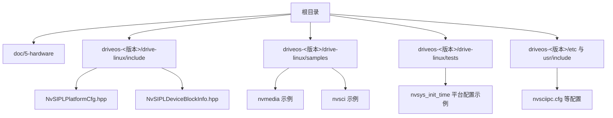
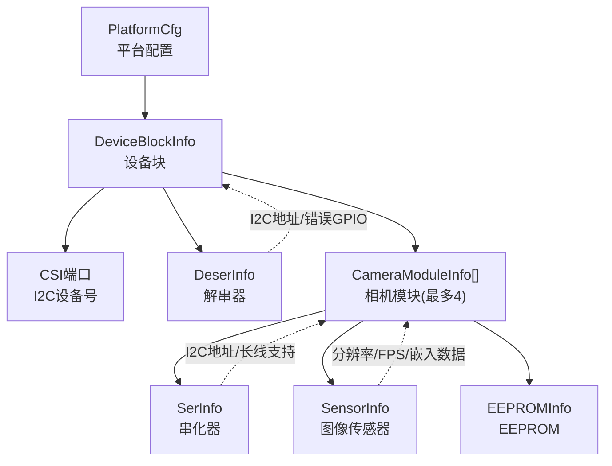
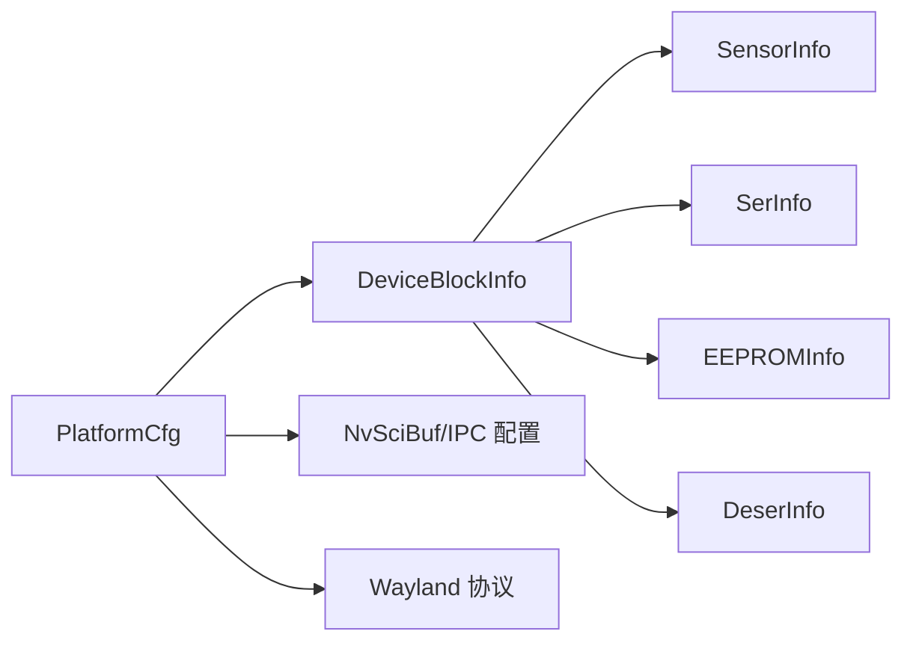

# 平台适配

<cite>
**本文引用的文件**
- [README.md](file://README.md)
- [NvSIPLPlatformCfg.hpp](file://driveos-6.0.5.0/drive-linux/include/NvSIPLPlatformCfg.hpp)
- [NvSIPLDeviceBlockInfo.hpp](file://driveos-6.0.5.0/drive-linux/include/NvSIPLDeviceBlockInfo.hpp)
- [ar0820.hpp](file://driveos-6.0.5.0/drive-linux/tests/nvsys_init_time/platform/ar0820.hpp)
- [common.hpp](file://driveos-6.0.5.0/drive-linux/tests/nvsys_init_time/platform/common.hpp)
- [AR0820_B_3461_CustomData.h](file://driveos-6.0.5.0/drive-linux/include/AR0820_B_3461_CustomData.h)
- [nvscibuf.h](file://driveos-6.0.6.0/drive-linux/include/nvscibuf.h)
- [nvsciipc.cfg（6.0.5）](file://driveos-6.0.5.0/etc/nvsciipc.cfg)
- [nvsciipc.cfg（6.0.6）](file://driveos-6.0.6.0/etc/nvsciipc.cfg)
- [nvsciipc.cfg（60100）](file://driveos-60100/drive-linux/include/nvsciipc.h)
- [wayland-client-protocol.h（6081）](file://driveos-6081/drive-linux/include/wayland-client-protocol.h)
</cite>

## 目录
1. [引言](#引言)
2. [项目结构](#项目结构)
3. [核心组件](#核心组件)
4. [架构总览](#架构总览)
5. [详细组件分析](#详细组件分析)
6. [依赖关系分析](#依赖关系分析)
7. [性能考虑](#性能考虑)
8. [故障排查指南](#故障排查指南)
9. [结论](#结论)
10. [附录](#附录)

## 引言
本指南面向在不同硬件平台上适配DriveOS系统的工程师，聚焦于将系统与AGX系列平台集成，并通过硬件抽象层（HAL）实现跨平台兼容。内容覆盖平台配置文件结构与参数设置、芯片型号识别、内存与外设映射、差异化配置方案（CPU/GPU/存储）、电源与热管理优化、性能调优、验证与测试方法，以及与硬件供应商协作流程与支持渠道。

## 项目结构
仓库包含多个版本的DriveOS发行包与配套样例、头文件与配置文件。与平台适配直接相关的关键路径如下：
- 驱动与接口头文件：各版本驱动Linux子树下的include目录
- 测试与示例：samples与tests目录中的平台初始化与媒体处理示例
- 配置文件：etc与usr/include中的IPC与协议配置
- 文档与硬件信息：doc/5-hardware目录及平台配置头文件

图示来源
- [README.md:1-128](file://README.md#L1-L128)
- [NvSIPLPlatformCfg.hpp:1-72](file://driveos-6.0.5.0/drive-linux/include/NvSIPLPlatformCfg.hpp#L1-L72)
- [NvSIPLDeviceBlockInfo.hpp:1-352](file://driveos-6.0.5.0/drive-linux/include/NvSIPLDeviceBlockInfo.hpp#L1-L352)

章节来源
- [README.md:1-128](file://README.md#L1-L128)

## 核心组件
- 平台配置模型：通过平台配置结构体描述设备块、传感器、串化器/解串器、I2C/I/O等连接关系与速率参数。
- 设备块信息：定义CSI端口、PHY模式、I2C设备号、模块数量、链路速率、GPIO与电源控制等。
- 平台示例：基于AR0820的完整平台配置，展示多模块、多链路、I2C地址与速率设定。
- IPC与缓冲：NvSciBuf与IPC配置用于跨进程/跨域共享与同步，支撑多引擎协同。

章节来源
- [NvSIPLPlatformCfg.hpp:49-71](file://driveos-6.0.5.0/drive-linux/include/NvSIPLPlatformCfg.hpp#L49-L71)
- [NvSIPLDeviceBlockInfo.hpp:295-345](file://driveos-6.0.5.0/drive-linux/include/NvSIPLDeviceBlockInfo.hpp#L295-L345)
- [ar0820.hpp:16-316](file://driveos-6.0.5.0/drive-linux/tests/nvsys_init_time/platform/ar0820.hpp#L16-L316)

## 架构总览
下图展示了从平台配置到设备块、传感器与串化器/解串器之间的关系，以及I2C与CSI接口的连接方式。

图示来源
- [NvSIPLPlatformCfg.hpp:49-71](file://driveos-6.0.5.0/drive-linux/include/NvSIPLPlatformCfg.hpp#L49-L71)
- [NvSIPLDeviceBlockInfo.hpp:295-345](file://driveos-6.0.5.0/drive-linux/include/NvSIPLDeviceBlockInfo.hpp#L295-L345)
- [ar0820.hpp:16-316](file://driveos-6.0.5.0/drive-linux/tests/nvsys_init_time/platform/ar0820.hpp#L16-L316)

## 详细组件分析

### 平台配置结构与参数
- 平台名称/配置名/描述：用于标识平台类型与用途。
- 设备块数量与列表：每个设备块对应一个解串器，最多支持若干个相机模块。
- 关键参数
  - CSI端口：SoC CSI接口类型
  - PHY模式：DPHY或CPHY
  - I2C设备号：解串器与SoC的I2C连接
  - 解串器信息：名称、I2C地址、错误GPIO、是否使用CDI v2
  - 相机模块：串化器、传感器、EEPROM的I2C地址与属性
  - 速率：DPHY/CPHY链路速率数组
  - 控制标志：模拟模式、被动模式、组初始化、电源控制、长线支持、复位序列等

章节来源
- [NvSIPLPlatformCfg.hpp:49-71](file://driveos-6.0.5.0/drive-linux/include/NvSIPLPlatformCfg.hpp#L49-L71)
- [NvSIPLDeviceBlockInfo.hpp:295-345](file://driveos-6.0.5.0/drive-linux/include/NvSIPLDeviceBlockInfo.hpp#L295-L345)

### 设备块与模块关系
- 设备块包含：CSI端口、PHY模式、I2C设备号、解串器信息、模块数量与列表、I2C/TX端口、电源端口、速率、控制标志。
- 相机模块包含：串化器、传感器、EEPROM信息；每个模块有链路索引、I2C地址、触发模式、嵌入数据等。

章节来源
- [NvSIPLDeviceBlockInfo.hpp:236-260](file://driveos-6.0.5.0/drive-linux/include/NvSIPLDeviceBlockInfo.hpp#L236-L260)
- [ar0820.hpp:40-296](file://driveos-6.0.5.0/drive-linux/tests/nvsys_init_time/platform/ar0820.hpp#L40-L296)

### AGX平台差异化配置要点
- CPU/GPU架构：根据AGX SoC的CSI接口与I2C控制器差异设置CSI端口与I2C设备号。
- GPU规格：结合NvSciBuf的GPU缓存与压缩能力，针对不同GPU启用合适的缓存与压缩策略。
- 存储控制器：依据平台的内存带宽与延迟特性，调整缓冲队列深度与DMA参数。
- 电源与热管理：通过平台配置中的电源控制标志与GPIO，配合系统电源策略进行动态降频与温度控制。
- 性能调优：根据链路速率与传感器FPS，优化帧率与分辨率组合，避免链路拥塞。

章节来源
- [nvscibuf.h:550-790](file://driveos-6.0.6.0/drive-linux/include/nvscibuf.h#L550-L790)
- [common.hpp:18-27](file://driveos-6.0.5.0/drive-linux/tests/nvsys_init_time/platform/common.hpp#L18-L27)

### 硬件抽象层（HAL）实现建议
- 接口抽象：将CSI、I2C、GPIO、电源控制等底层接口抽象为统一的HAL层，屏蔽不同SoC差异。
- 配置驱动：以平台配置文件为输入，生成HAL层的设备树或设备节点映射，确保运行时可加载。
- 资源分配：在HAL中实现NvSciBuf的GPU ID与缓存一致性策略，保证多引擎共享缓冲的一致性。
- 可移植性：通过宏与条件编译区分Safety与非Safety构建，适配不同安全等级要求。

章节来源
- [NvSIPLPlatformCfg.hpp:19-71](file://driveos-6.0.5.0/drive-linux/include/NvSIPLPlatformCfg.hpp#L19-L71)
- [NvSIPLDeviceBlockInfo.hpp:66-87](file://driveos-6.0.5.0/drive-linux/include/NvSIPLDeviceBlockInfo.hpp#L66-L87)

### 平台验证与测试
- 功能测试
  - 初始化时间测试：参考nvsys_init_time测试框架，验证平台配置正确性与设备链路连通性。
  - 帧率与分辨率：在AR0820示例基础上，逐项调整分辨率与FPS，确认链路带宽满足需求。
- 性能基准测试
  - NvSciBuf缓存与压缩：对比启用/禁用GPU缓存与压缩对吞吐的影响，选择最优策略。
  - IPC与跨进程共享：评估NvSciBuf与IPC配置对延迟与吞吐的影响。
- 稳定性验证
  - 长时运行：在高负载场景下观察温度与功耗变化，验证电源与热管理策略有效性。
  - 故障注入：模拟I2C通信异常、GPIO中断等，验证错误处理与恢复机制。

章节来源
- [ar0820.hpp:16-316](file://driveos-6.0.5.0/drive-linux/tests/nvsys_init_time/platform/ar0820.hpp#L16-L316)
- [nvscibuf.h:550-790](file://driveos-6.0.6.0/drive-linux/include/nvscibuf.h#L550-L790)

### 与硬件供应商合作与支持
- 获取硬件支持与固件更新
  - 通过官方SDK与发行包获取平台固件与驱动，遵循仓库README中的拷贝与打包流程。
  - 使用平台配置文件与设备树片段，配合供应商提供的I2C/CSI引脚映射，完成硬件对接。
- 合作流程与注意事项
  - 明确安全等级（Safety/非Safety）对CDI API与配置的影响。
  - 在长线传输场景下，确认串化器/解串器的长线支持与GPIO映射。
  - 与供应商共同验证电源控制、热管理与EMI/ESD防护设计。

章节来源
- [README.md:115-128](file://README.md#L115-L128)
- [AR0820_B_3461_CustomData.h:113-138](file://driveos-6.0.5.0/drive-linux/include/AR0820_B_3461_CustomData.h#L113-L138)

## 依赖关系分析
- 平台配置依赖设备块信息结构，设备块再依赖串化器、传感器、EEPROM等子结构。
- 运行时依赖NvSciBuf与IPC配置，确保跨进程/跨域缓冲共享与同步。
- Wayland显示栈在图形输出场景中作为上层依赖，需与显示合成器协议一致。

图示来源
- [NvSIPLPlatformCfg.hpp:49-71](file://driveos-6.0.5.0/drive-linux/include/NvSIPLPlatformCfg.hpp#L49-L71)
- [NvSIPLDeviceBlockInfo.hpp:295-345](file://driveos-6.0.5.0/drive-linux/include/NvSIPLDeviceBlockInfo.hpp#L295-L345)
- [nvscibuf.h:305-2899](file://driveos-6.0.6.0/drive-linux/include/nvscibuf.h#L305-L2899)
- [wayland-client-protocol.h:190-670](file://driveos-6081/drive-linux/include/wayland-client-protocol.h#L190-L670)

章节来源
- [nvsciipc.cfg（6.0.5）](file://driveos-6.0.5.0/etc/nvsciipc.cfg)
- [nvsciipc.cfg（6.0.6）](file://driveos-6.0.6.0/etc/nvsciipc.cfg)
- [nvsciipc.cfg（60100）](file://driveos-60100/drive-linux/include/nvsciipc.h)

## 性能考虑
- 缓存与压缩
  - 启用GPU缓存与压缩需综合考虑系统GPU数量、内存域与硬件引擎访问一致性，避免缓存不一致导致的性能回退。
- 链路速率与帧率
  - 根据DPHY/CPHY速率与传感器FPS，合理选择分辨率与帧率，避免链路拥塞与丢帧。
- IPC与同步
  - 优化NvSciBuf属性协商与GPU ID集合，减少跨域同步开销。
- 显示栈
  - 在Wayland场景下，关注输出刷新率与合成器事件，避免过度同步导致的抖动。

章节来源
- [nvscibuf.h:550-790](file://driveos-6.0.6.0/drive-linux/include/nvscibuf.h#L550-L790)
- [wayland-client-protocol.h:5283-5320](file://driveos-6081/drive-linux/include/wayland-client-protocol.h#L5283-L5320)

## 故障排查指南
- 初始化失败
  - 检查平台配置中的CSI端口、PHY模式、I2C设备号与链路速率是否匹配硬件。
  - 确认解串器/串化器I2C地址与GPIO映射正确，必要时启用被动模式或模拟模式进行诊断。
- 图像异常
  - 核对传感器分辨率、FPS与嵌入数据配置，检查触发模式与VC信息。
  - 在长线场景下，确认长线支持与GPIO映射。
- IPC与缓冲问题
  - 对比NvSciBuf的GPU ID集合与缓存一致性策略，排查跨进程共享失败。
  - 检查IPC配置文件与服务状态，确保通道建立成功。
- 温度与功耗
  - 结合电源控制标志与GPIO，验证动态降频与风扇控制逻辑。

章节来源
- [ar0820.hpp:16-316](file://driveos-6.0.5.0/drive-linux/tests/nvsys_init_time/platform/ar0820.hpp#L16-L316)
- [common.hpp:18-27](file://driveos-6.0.5.0/drive-linux/tests/nvsys_init_time/platform/common.hpp#L18-L27)
- [nvscibuf.h:550-790](file://driveos-6.0.6.0/drive-linux/include/nvscibuf.h#L550-L790)
- [nvsciipc.cfg（6.0.5）](file://driveos-6.0.5.0/etc/nvsciipc.cfg)
- [nvsciipc.cfg（6.0.6）](file://driveos-6.0.6.0/etc/nvsciipc.cfg)

## 结论
通过标准化的平台配置模型与HAL抽象，可在不同AGX平台间实现快速适配。结合NvSciBuf与IPC配置，可有效提升多引擎协同性能；配合电源与热管理策略，可在高负载场景保持稳定运行。建议以平台示例为起点，逐步扩展至目标硬件，严格进行功能、性能与稳定性验证，并与硬件供应商紧密协作获取固件与技术支持。

## 附录
- 版本与拷贝流程参考：README中的拷贝与打包说明，便于提取include与samples进行二次开发。
- PMIC启动ACK配置：针对特定平台的PMIC配置，可用于电源初始化与诊断。

章节来源
- [README.md:115-128](file://README.md#L115-L128)
- [AR0820_B_3461_CustomData.h:113-138](file://driveos-6.0.5.0/drive-linux/include/AR0820_B_3461_CustomData.h#L113-L138)