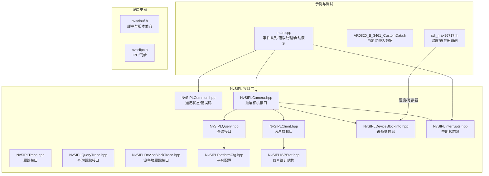
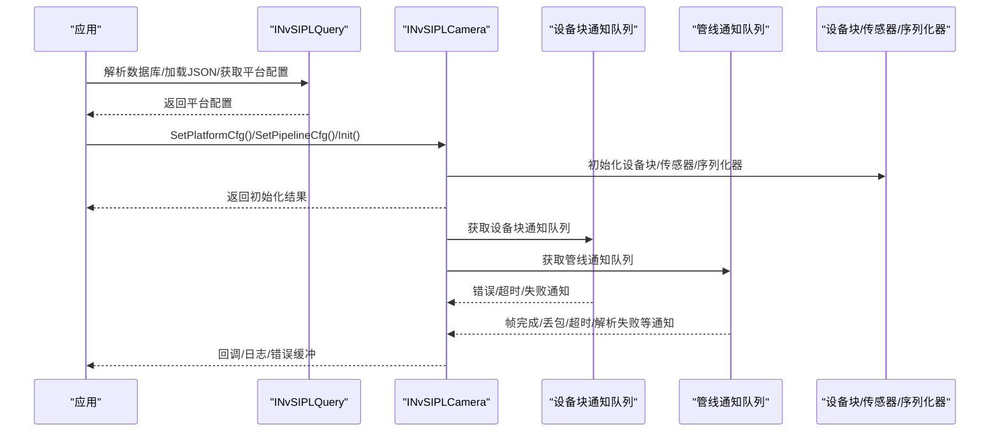
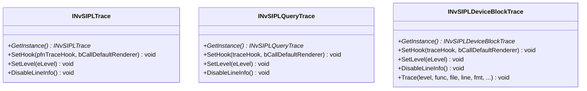
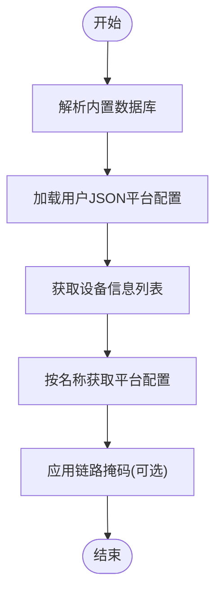
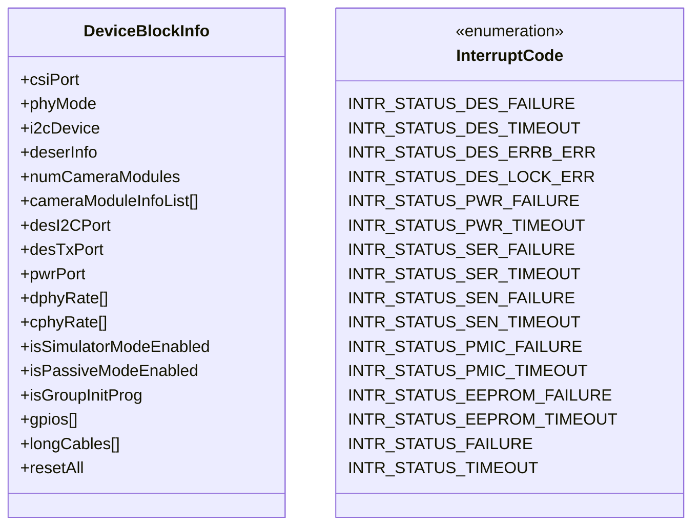
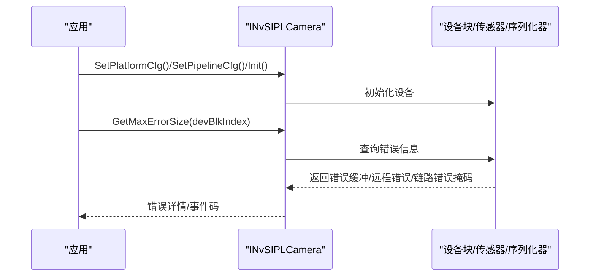
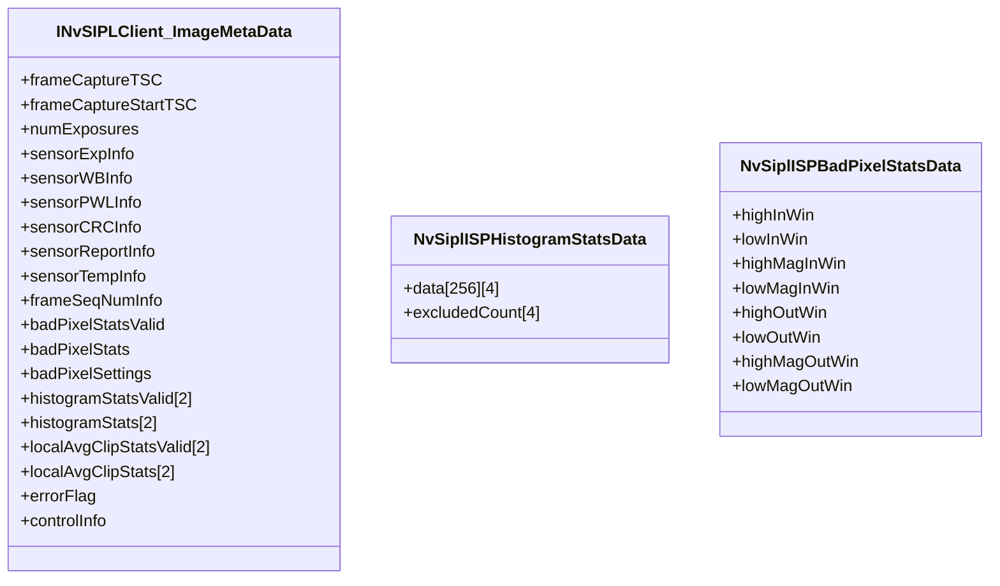
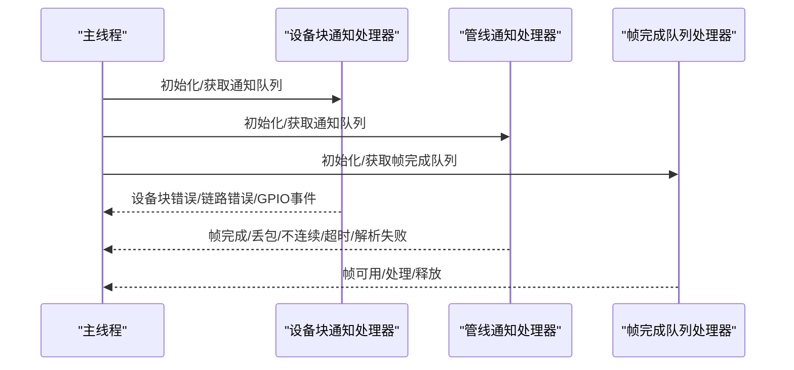
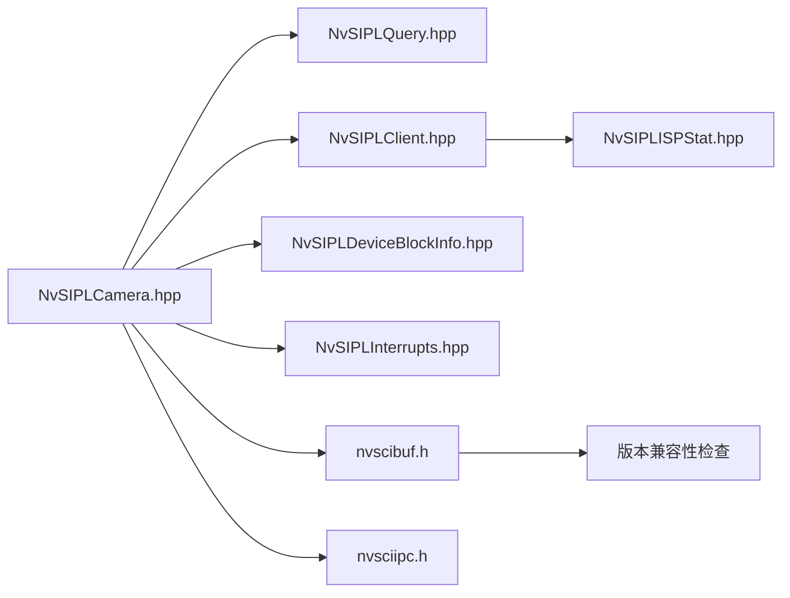

# 硬件故障诊断

<cite>
**本文引用的文件**
- [NvSIPLTrace.hpp](file://driveos-6.0.5.0/drive-linux/include/NvSIPLTrace.hpp)
- [NvSIPLQueryTrace.hpp](file://driveos-6.0.5.0/drive-linux/include/NvSIPLQueryTrace.hpp)
- [NvSIPLDeviceBlockTrace.hpp](file://driveos-6.0.5.0/drive-linux/include/NvSIPLDeviceBlockTrace.hpp)
- [NvSIPLQuery.hpp](file://driveos-6.0.5.0/drive-linux/include/NvSIPLQuery.hpp)
- [NvSIPLClient.hpp](file://driveos-6.0.5.0/drive-linux/include/NvSIPLClient.hpp)
- [NvSIPLCommon.hpp](file://driveos-6.0.5.0/drive-linux/include/NvSIPLCommon.hpp)
- [NvSIPLPlatformCfg.hpp](file://driveos-6.0.5.0/drive-linux/include/NvSIPLPlatformCfg.hpp)
- [NvSIPLCamera.hpp](file://driveos-6.0.5.0/drive-linux/include/NvSIPLCamera.hpp)
- [NvSIPLDeviceBlockInfo.hpp](file://driveos-6.0.5.0/drive-linux/include/NvSIPLDeviceBlockInfo.hpp)
- [NvSIPLInterrupts.hpp](file://driveos-6.0.5.0/drive-linux/include/NvSIPLInterrupts.hpp)
- [NvSIPLISPStat.hpp](file://driveos-6.0.5.0/drive-linux/include/NvSIPLISPStat.hpp)
- [main.cpp](file://driveos-6.0.5.0/drive-linux/tests/nvsys_init_time/main.cpp)
- [AR0820_B_3461_CustomData.h](file://driveos-6.0.5.0/drive-linux/include/AR0820_B_3461_CustomData.h)
- [cdi_max96717f.h](file://driveos-6.0.5.0/drive-linux/samples/nvmedia/nvsipl/devblk/devices/MAX96717FSerializerDriver/cdi_max96717f.h)
- [nvscibuf.h](file://driveos-6.0.6.0/drive-linux/include/nvscibuf.h)
- [nvsciipc.h](file://driveos-6.0.6.0/drive-linux/usr/include/nvsciipc.h)
</cite>

## 目录
1. [简介](#简介)
2. [项目结构](#项目结构)
3. [核心组件](#核心组件)
4. [架构总览](#架构总览)
5. [详细组件分析](#详细组件分析)
6. [依赖关系分析](#依赖关系分析)
7. [性能考量](#性能考量)
8. [故障排查指南](#故障排查指南)
9. [结论](#结论)
10. [附录](#附录)

## 简介
本指南面向硬件工程师与系统集成人员，围绕 NVIDIA DRIVE OS 的 NvSIPL 摄像头子系统，提供一套可操作的“硬件故障诊断”方法论与实践路径。内容涵盖：
- 使用 NvSIPL 跟踪与查询接口进行设备状态查询与错误日志分析
- 常见硬件故障（传感器无响应、设备无法识别、通信超时）的排查流程
- 硬件性能监控与诊断工具（温度、电压、ISP 统计）的使用
- 兼容性问题诊断（驱动/固件/配置）
- 测试与自动化脚本使用
- 与硬件供应商技术支持协作与问题升级机制
- 预防性维护与健康检查最佳实践
- 安全与可靠性相关诊断要点

## 项目结构
该仓库在不同 DRIVE OS 版本中提供了多套头文件与示例，其中与硬件诊断直接相关的核心位于：
- include：NvSIPL 核心接口与数据结构（跟踪、查询、平台配置、设备块信息、中断、ISP 统计等）
- tests：nvsys_init_time 示例程序，展示事件队列、错误处理与自动恢复
- samples：设备驱动与寄存器读写示例，用于温度/电压等硬件参数采集

图示来源
- [NvSIPLTrace.hpp:1-176](file://driveos-6.0.5.0/drive-linux/include/NvSIPLTrace.hpp#L1-176)
- [NvSIPLQueryTrace.hpp:1-160](file://driveos-6.0.5.0/drive-linux/include/NvSIPLQueryTrace.hpp#L1-160)
- [NvSIPLDeviceBlockTrace.hpp:1-112](file://driveos-6.0.5.0/drive-linux/include/NvSIPLDeviceBlockTrace.hpp#L1-112)
- [NvSIPLQuery.hpp:1-290](file://driveos-6.0.5.0/drive-linux/include/NvSIPLQuery.hpp#L1-290)
- [NvSIPLClient.hpp:1-368](file://driveos-6.0.5.0/drive-linux/include/NvSIPLClient.hpp#L1-368)
- [NvSIPLCommon.hpp:1-219](file://driveos-6.0.5.0/drive-linux/include/NvSIPLCommon.hpp#L1-219)
- [NvSIPLPlatformCfg.hpp:1-72](file://driveos-6.0.5.0/drive-linux/include/NvSIPLPlatformCfg.hpp#L1-72)
- [NvSIPLCamera.hpp:1-800](file://driveos-6.0.5.0/drive-linux/include/NvSIPLCamera.hpp#L1-800)
- [NvSIPLDeviceBlockInfo.hpp:1-352](file://driveos-6.0.5.0/drive-linux/include/NvSIPLDeviceBlockInfo.hpp#L1-352)
- [NvSIPLInterrupts.hpp:1-117](file://driveos-6.0.5.0/drive-linux/include/NvSIPLInterrupts.hpp#L1-117)
- [NvSIPLISPStat.hpp:1-649](file://driveos-6.0.5.0/drive-linux/include/NvSIPLISPStat.hpp#L1-649)
- [main.cpp:1-800](file://driveos-6.0.5.0/drive-linux/tests/nvsys_init_time/main.cpp#L1-800)
- [AR0820_B_3461_CustomData.h:1-60](file://driveos-6.0.5.0/drive-linux/include/AR0820_B_3461_CustomData.h#L1-60)
- [cdi_max96717f.h:112-152](file://driveos-6.0.5.0/drive-linux/samples/nvmedia/nvsipl/devblk/devices/MAX96717FSerializerDriver/cdi_max96717f.h#L112-152)
- [nvscibuf.h:5204-5270](file://driveos-6.0.6.0/drive-linux/include/nvscibuf.h#L5204-5270)
- [nvsciipc.h](file://driveos-6.0.6.0/drive-linux/usr/include/nvsciipc.h)

章节来源
- [NvSIPLTrace.hpp:1-176](file://driveos-6.0.5.0/drive-linux/include/NvSIPLTrace.hpp#L1-176)
- [NvSIPLQueryTrace.hpp:1-160](file://driveos-6.0.5.0/drive-linux/include/NvSIPLQueryTrace.hpp#L1-160)
- [NvSIPLDeviceBlockTrace.hpp:1-112](file://driveos-6.0.5.0/drive-linux/include/NvSIPLDeviceBlockTrace.hpp#L1-112)
- [NvSIPLQuery.hpp:1-290](file://driveos-6.0.5.0/drive-linux/include/NvSIPLQuery.hpp#L1-290)
- [NvSIPLClient.hpp:1-368](file://driveos-6.0.5.0/drive-linux/include/NvSIPLClient.hpp#L1-368)
- [NvSIPLCommon.hpp:1-219](file://driveos-6.0.5.0/drive-linux/include/NvSIPLCommon.hpp#L1-219)
- [NvSIPLPlatformCfg.hpp:1-72](file://driveos-6.0.5.0/drive-linux/include/NvSIPLPlatformCfg.hpp#L1-72)
- [NvSIPLCamera.hpp:1-800](file://driveos-6.0.5.0/drive-linux/include/NvSIPLCamera.hpp#L1-800)
- [NvSIPLDeviceBlockInfo.hpp:1-352](file://driveos-6.0.5.0/drive-linux/include/NvSIPLDeviceBlockInfo.hpp#L1-352)
- [NvSIPLInterrupts.hpp:1-117](file://driveos-6.0.5.0/drive-linux/include/NvSIPLInterrupts.hpp#L1-117)
- [NvSIPLISPStat.hpp:1-649](file://driveos-6.0.5.0/drive-linux/include/NvSIPLISPStat.hpp#L1-649)
- [main.cpp:1-800](file://driveos-6.0.5.0/drive-linux/tests/nvsys_init_time/main.cpp#L1-800)
- [AR0820_B_3461_CustomData.h:1-60](file://driveos-6.0.5.0/drive-linux/include/AR0820_B_3461_CustomData.h#L1-60)
- [cdi_max96717f.h:112-152](file://driveos-6.0.5.0/drive-linux/samples/nvmedia/nvsipl/devblk/devices/MAX96717FSerializerDriver/cdi_max96717f.h#L112-152)
- [nvscibuf.h:5204-5270](file://driveos-6.0.6.0/drive-linux/include/nvscibuf.h#L5204-5270)
- [nvsciipc.h](file://driveos-6.0.6.0/drive-linux/usr/include/nvsciipc.h)

## 核心组件
- 跟踪与日志
  - INvSIPLTrace / INvSIPLQueryTrace / INvSIPLDeviceBlockTrace：统一的日志级别、钩子回调与行号信息控制，便于定位问题来源与上下文。
- 查询与平台配置
  - INvSIPLQuery：解析内置数据库、加载用户 JSON、获取设备列表与平台配置；支持掩码裁剪链路。
  - NvSIPLPlatformCfg：描述平台名称、配置名、设备块数组等。
- 设备块与中断
  - NvSIPLDeviceBlockInfo：设备块、相机模块、传感器、序列化器、EEPROM 的能力与属性。
  - NvSIPLInterrupts：中断状态码枚举，覆盖设备块、电源、序列化器、传感器、PMIC、EEPROM 等。
- 顶层相机接口
  - NvSIPLCamera：设置平台/管道配置、初始化、注册图像、启动/停止/反初始化、读取 EEPROM、错误查询与 GPIO 中断事件。
- 客户端与统计
  - NvSIPLClient：帧完成队列、缓冲生命周期、NvSci 同步、元数据（时间戳、曝光、温度、CRC、帧报告等）。
  - NvSIPLISPStat：ISP 统计结构（直方图、坏像素、局部均值/裁剪等），用于质量与稳定性评估。
- 示例与测试
  - nvsys_init_time 示例：事件队列线程、通知处理器、错误缓冲填充、自动恢复、帧丢包/不连续统计。

章节来源
- [NvSIPLTrace.hpp:20-176](file://driveos-6.0.5.0/drive-linux/include/NvSIPLTrace.hpp#L20-176)
- [NvSIPLQueryTrace.hpp:20-160](file://driveos-6.0.5.0/drive-linux/include/NvSIPLQueryTrace.hpp#L20-160)
- [NvSIPLDeviceBlockTrace.hpp:26-112](file://driveos-6.0.5.0/drive-linux/include/NvSIPLDeviceBlockTrace.hpp#L26-112)
- [NvSIPLQuery.hpp:40-290](file://driveos-6.0.5.0/drive-linux/include/NvSIPLQuery.hpp#L40-290)
- [NvSIPLPlatformCfg.hpp:26-72](file://driveos-6.0.5.0/drive-linux/include/NvSIPLPlatformCfg.hpp#L26-72)
- [NvSIPLDeviceBlockInfo.hpp:28-352](file://driveos-6.0.5.0/drive-linux/include/NvSIPLDeviceBlockInfo.hpp#L28-352)
- [NvSIPLInterrupts.hpp:21-117](file://driveos-6.0.5.0/drive-linux/include/NvSIPLInterrupts.hpp#L21-117)
- [NvSIPLCamera.hpp:151-800](file://driveos-6.0.5.0/drive-linux/include/NvSIPLCamera.hpp#L151-800)
- [NvSIPLClient.hpp:46-368](file://driveos-6.0.5.0/drive-linux/include/NvSIPLClient.hpp#L46-368)
- [NvSIPLISPStat.hpp:65-649](file://driveos-6.0.5.0/drive-linux/include/NvSIPLISPStat.hpp#L65-649)
- [main.cpp:93-800](file://driveos-6.0.5.0/drive-linux/tests/nvsys_init_time/main.cpp#L93-800)

## 架构总览
下图展示了从“平台配置选择”到“事件通知与错误处理”的完整链路，以及与底层设备块/传感器/序列化器的交互。

图示来源
- [NvSIPLQuery.hpp:93-211](file://driveos-6.0.5.0/drive-linux/include/NvSIPLQuery.hpp#L93-211)
- [NvSIPLCamera.hpp:158-701](file://driveos-6.0.5.0/drive-linux/include/NvSIPLCamera.hpp#L158-701)
- [main.cpp:93-362](file://driveos-6.0.5.0/drive-linux/tests/nvsys_init_time/main.cpp#L93-362)

## 详细组件分析

### 组件A：跟踪与日志体系（NvSIPLTrace/QueryTrace/DeviceBlockTrace）
- 功能要点
  - 统一日志级别（关闭/错误/警告/信息/调试）
  - 可设置回调钩子接收消息
  - 支持禁用行号前缀以减少噪音
  - 适用于运行时/初始化阶段的精细化日志控制
- 实践建议
  - 在问题复现阶段提升日志级别至“调试”，定位具体模块与函数
  - 将日志重定向到集中式日志系统，结合时间戳与线程名进行关联分析

图示来源
- [NvSIPLTrace.hpp:20-176](file://driveos-6.0.5.0/drive-linux/include/NvSIPLTrace.hpp#L20-176)
- [NvSIPLQueryTrace.hpp:20-160](file://driveos-6.0.5.0/drive-linux/include/NvSIPLQueryTrace.hpp#L20-160)
- [NvSIPLDeviceBlockTrace.hpp:26-112](file://driveos-6.0.5.0/drive-linux/include/NvSIPLDeviceBlockTrace.hpp#L26-112)

章节来源
- [NvSIPLTrace.hpp:20-176](file://driveos-6.0.5.0/drive-linux/include/NvSIPLTrace.hpp#L20-176)
- [NvSIPLQueryTrace.hpp:20-160](file://driveos-6.0.5.0/drive-linux/include/NvSIPLQueryTrace.hpp#L20-160)
- [NvSIPLDeviceBlockTrace.hpp:26-112](file://driveos-6.0.5.0/drive-linux/include/NvSIPLDeviceBlockTrace.hpp#L26-112)

### 组件B：查询与平台配置（INvSIPLQuery/NvSIPLPlatformCfg）
- 功能要点
  - 解析内置数据库与用户 JSON
  - 获取设备信息列表与平台配置
  - 应用链路掩码，裁剪特定 deserializer 链路
- 实践建议
  - 在部署前通过查询接口验证平台配置与硬件能力匹配
  - 对多链路场景使用掩码隔离问题链路，缩小故障范围

图示来源
- [NvSIPLQuery.hpp:117-276](file://driveos-6.0.5.0/drive-linux/include/NvSIPLQuery.hpp#L117-276)
- [NvSIPLPlatformCfg.hpp:26-72](file://driveos-6.0.5.0/drive-linux/include/NvSIPLPlatformCfg.hpp#L26-72)

章节来源
- [NvSIPLQuery.hpp:117-276](file://driveos-6.0.5.0/drive-linux/include/NvSIPLQuery.hpp#L117-276)
- [NvSIPLPlatformCfg.hpp:26-72](file://driveos-6.0.5.0/drive-linux/include/NvSIPLPlatformCfg.hpp#L26-72)

### 组件C：设备块与中断（NvSIPLDeviceBlockInfo/NvSIPLInterrupts）
- 功能要点
  - 描述设备块、相机模块、传感器、序列化器、EEPROM 的能力与属性
  - 中断状态码覆盖设备块级、链路级、电源、传感器、序列化器、PMIC、EEPROM 等
- 实践建议
  - 结合中断码与 GPIO 事件，区分“真实中断”与“功能故障”
  - 对链路级错误（DES_LOCK_ERR）优先检查物理连接与速率配置

图示来源
- [NvSIPLDeviceBlockInfo.hpp:289-352](file://driveos-6.0.5.0/drive-linux/include/NvSIPLDeviceBlockInfo.hpp#L289-352)
- [NvSIPLInterrupts.hpp:21-117](file://driveos-6.0.5.0/drive-linux/include/NvSIPLInterrupts.hpp#L21-117)

章节来源
- [NvSIPLDeviceBlockInfo.hpp:289-352](file://driveos-6.0.5.0/drive-linux/include/NvSIPLDeviceBlockInfo.hpp#L289-352)
- [NvSIPLInterrupts.hpp:21-117](file://driveos-6.0.5.0/drive-linux/include/NvSIPLInterrupts.hpp#L21-117)

### 组件D：顶层相机接口与错误处理（NvSIPLCamera）
- 功能要点
  - 设置平台/管道配置、初始化、注册图像、启动/停止/反初始化
  - 读取 EEPROM、查询最大错误尺寸、获取 GPIO 错误事件、获取详细错误信息
- 实践建议
  - 在 Init/Start 前后分别记录关键状态，确保平台配置与硬件一致
  - 使用 GetMaxErrorSize 分配足够缓冲，再调用 GetDeserializerErrorInfo/GetModuleErrorInfo

图示来源
- [NvSIPLCamera.hpp:158-800](file://driveos-6.0.5.0/drive-linux/include/NvSIPLCamera.hpp#L158-800)
- [main.cpp:93-362](file://driveos-6.0.5.0/drive-linux/tests/nvsys_init_time/main.cpp#L93-362)

章节来源
- [NvSIPLCamera.hpp:158-800](file://driveos-6.0.5.0/drive-linux/include/NvSIPLCamera.hpp#L158-800)
- [main.cpp:93-362](file://driveos-6.0.5.0/drive-linux/tests/nvsys_init_time/main.cpp#L93-362)

### 组件E：客户端与元数据（NvSIPLClient/NvSIPLISPStat）
- 功能要点
  - 帧完成队列、缓冲生命周期管理、NvSci 同步、元数据（时间戳、曝光、温度、CRC、帧报告、ISP 统计）
  - ISP 统计结构（直方图、坏像素、局部均值/裁剪等）
- 实践建议
  - 利用元数据中的温度与曝光信息判断传感器工作状态
  - 关注帧丢包/不连续与解析失败通知，结合中断码定位链路问题

图示来源
- [NvSIPLClient.hpp:52-125](file://driveos-6.0.5.0/drive-linux/include/NvSIPLClient.hpp#L52-125)
- [NvSIPLISPStat.hpp:80-187](file://driveos-6.0.5.0/drive-linux/include/NvSIPLISPStat.hpp#L80-187)

章节来源
- [NvSIPLClient.hpp:52-125](file://driveos-6.0.5.0/drive-linux/include/NvSIPLClient.hpp#L52-125)
- [NvSIPLISPStat.hpp:80-187](file://driveos-6.0.5.0/drive-linux/include/NvSIPLISPStat.hpp#L80-187)

### 组件F：示例程序（nvsys_init_time）
- 功能要点
  - 设备块通知处理器：获取错误缓冲、远程错误、链路错误掩码、GPIO 事件去伪存真
  - 管线通知处理器：帧完成/丢包/不连续/超时/解析失败等事件统计
  - 帧完成队列处理：线程轮询队列、回调消费、释放缓冲
- 实践建议
  - 将通知处理器与事件队列分离，避免阻塞主流程
  - 对链路错误采用“忽略窗口+自动恢复”策略，降低误报影响

图示来源
- [main.cpp:93-800](file://driveos-6.0.5.0/drive-linux/tests/nvsys_init_time/main.cpp#L93-800)

章节来源
- [main.cpp:93-800](file://driveos-6.0.5.0/drive-linux/tests/nvsys_init_time/main.cpp#L93-800)

## 依赖关系分析
- 接口耦合
  - NvSIPLCamera 依赖 NvSIPLQuery（平台配置）、NvSIPLClient（输出消费）、NvSIPLDeviceBlockInfo（设备能力）、NvSIPLInterrupts（中断码）
  - NvSIPLClient 依赖 NvSciBuf/NvSciSync（缓冲与同步）
- 外部依赖
  - NvSciBuf/NvSciSync 的版本兼容性检查，确保运行时库与编译期版本匹配
  - NVCSI IPC 配置与权限策略

图示来源
- [NvSIPLCamera.hpp:151-800](file://driveos-6.0.5.0/drive-linux/include/NvSIPLCamera.hpp#L151-800)
- [NvSIPLQuery.hpp:40-290](file://driveos-6.0.5.0/drive-linux/include/NvSIPLQuery.hpp#L40-290)
- [NvSIPLClient.hpp:46-368](file://driveos-6.0.5.0/drive-linux/include/NvSIPLClient.hpp#L46-368)
- [NvSIPLDeviceBlockInfo.hpp:28-352](file://driveos-6.0.5.0/drive-linux/include/NvSIPLDeviceBlockInfo.hpp#L28-352)
- [NvSIPLInterrupts.hpp:21-117](file://driveos-6.0.5.0/drive-linux/include/NvSIPLInterrupts.hpp#L21-117)
- [NvSIPLISPStat.hpp:65-649](file://driveos-6.0.5.0/drive-linux/include/NvSIPLISPStat.hpp#L65-649)
- [nvscibuf.h:5204-5270](file://driveos-6.0.6.0/drive-linux/include/nvscibuf.h#L5204-5270)
- [nvsciipc.h](file://driveos-6.0.6.0/drive-linux/usr/include/nvsciipc.h)

章节来源
- [NvSIPLCamera.hpp:151-800](file://driveos-6.0.5.0/drive-linux/include/NvSIPLCamera.hpp#L151-800)
- [NvSIPLQuery.hpp:40-290](file://driveos-6.0.5.0/drive-linux/include/NvSIPLQuery.hpp#L40-290)
- [NvSIPLClient.hpp:46-368](file://driveos-6.0.5.0/drive-linux/include/NvSIPLClient.hpp#L46-368)
- [NvSIPLDeviceBlockInfo.hpp:28-352](file://driveos-6.0.5.0/drive-linux/include/NvSIPLDeviceBlockInfo.hpp#L28-352)
- [NvSIPLInterrupts.hpp:21-117](file://driveos-6.0.5.0/drive-linux/include/NvSIPLInterrupts.hpp#L21-117)
- [NvSIPLISPStat.hpp:65-649](file://driveos-6.0.5.0/drive-linux/include/NvSIPLISPStat.hpp#L65-649)
- [nvscibuf.h:5204-5270](file://driveos-6.0.6.0/drive-linux/include/nvscibuf.h#L5204-5270)
- [nvsciipc.h](file://driveos-6.0.6.0/drive-linux/usr/include/nvsciipc.h)

## 性能考量
- 日志级别与开销
  - 过高日志级别会增加 CPU 与 I/O 开销，建议仅在问题复现阶段开启“调试”
- 队列与线程
  - 事件队列轮询应设置合理超时，避免忙等；帧完成队列处理线程需及时释放缓冲
- ISP 统计
  - 直方图/坏像素统计等计算量较大，可根据需求启用/禁用或调整 ROI

## 故障排查指南

### 传感器无响应
- 步骤
  - 使用查询接口确认平台配置与传感器型号匹配
  - 启用查询跟踪与设备块跟踪，观察初始化阶段日志
  - 若出现链路错误（DES_LOCK_ERR），检查物理连接、速率模式与链路掩码
  - 通过 GPIO 事件区分“真实中断”与“功能故障”
- 相关接口
  - 平台配置与链路掩码：[NvSIPLQuery.hpp:235-276](file://driveos-6.0.5.0/drive-linux/include/NvSIPLQuery.hpp#L235-276)
  - 设备块通知与 GPIO 事件：[main.cpp:93-362](file://driveos-6.0.5.0/drive-linux/tests/nvsys_init_time/main.cpp#L93-362)

章节来源
- [NvSIPLQuery.hpp:235-276](file://driveos-6.0.5.0/drive-linux/include/NvSIPLQuery.hpp#L235-276)
- [main.cpp:93-362](file://driveos-6.0.5.0/drive-linux/tests/nvsys_init_time/main.cpp#L93-362)

### 设备无法识别
- 步骤
  - 使用查询接口解析数据库并加载用户 JSON，确认设备信息列表包含目标设备
  - 读取 EEPROM 数据验证设备标识与期望一致
  - 若存在远程错误（isRemoteError），逐级检查序列化器与传感器
- 相关接口
  - 读取 EEPROM：[NvSIPLCamera.hpp:514-517](file://driveos-6.0.5.0/drive-linux/include/NvSIPLCamera.hpp#L514-517)
  - 获取详细错误信息：[NvSIPLCamera.hpp:778-800](file://driveos-6.0.5.0/drive-linux/include/NvSIPLCamera.hpp#L778-800)

章节来源
- [NvSIPLCamera.hpp:514-517](file://driveos-6.0.5.0/drive-linux/include/NvSIPLCamera.hpp#L514-517)
- [NvSIPLCamera.hpp:778-800](file://driveos-6.0.5.0/drive-linux/include/NvSIPLCamera.hpp#L778-800)

### 通信超时
- 步骤
  - 提升日志级别至“调试”，定位超时发生阶段（初始化/传输/处理）
  - 检查中断码是否为 TIMEOUT 类型，结合链路掩码判断受影响链路
  - 使用帧完成队列处理器统计丢包/不连续，辅助定位抖动源
- 相关接口
  - 通知处理器与事件统计：[main.cpp:364-558](file://driveos-6.0.5.0/drive-linux/tests/nvsys_init_time/main.cpp#L364-558)

章节来源
- [main.cpp:364-558](file://driveos-6.0.5.0/drive-linux/tests/nvsys_init_time/main.cpp#L364-558)

### 温度监控与电压检测
- 方法
  - 通过设备驱动接口读取温度（如 MAX96717F）
  - 自定义嵌入数据中包含当前/最大/最小电压与温度字段，可用于快速评估
- 相关接口
  - 温度读取接口声明：[cdi_max96717f.h:147-150](file://driveos-6.0.5.0/drive-linux/samples/nvmedia/nvsipl/devblk/devices/MAX96717FSerializerDriver/cdi_max96717f.h#L147-150)
  - 自定义嵌入数据结构：[AR0820_B_3461_CustomData.h:34-60](file://driveos-6.0.5.0/drive-linux/include/AR0820_B_3461_CustomData.h#L34-60)

章节来源
- [cdi_max96717f.h:147-150](file://driveos-6.0.5.0/drive-linux/samples/nvmedia/nvsipl/devblk/devices/MAX96717FSerializerDriver/cdi_max96717f.h#L147-150)
- [AR0820_B_3461_CustomData.h:34-60](file://driveos-6.0.5.0/drive-linux/include/AR0820_B_3461_CustomData.h#L34-60)

### 硬件性能监控与诊断
- 方法
  - 利用 ISP 统计（直方图、坏像素、局部均值/裁剪）评估图像质量与稳定性
  - 结合元数据中的时间戳与曝光信息，分析处理延迟与一致性
- 相关接口
  - ISP 统计结构：[NvSIPLISPStat.hpp:80-537](file://driveos-6.0.5.0/drive-linux/include/NvSIPLISPStat.hpp#L80-537)
  - 客户端元数据：[NvSIPLClient.hpp:52-125](file://driveos-6.0.5.0/drive-linux/include/NvSIPLClient.hpp#L52-125)

章节来源
- [NvSIPLISPStat.hpp:80-537](file://driveos-6.0.5.0/drive-linux/include/NvSIPLISPStat.hpp#L80-537)
- [NvSIPLClient.hpp:52-125](file://driveos-6.0.5.0/drive-linux/include/NvSIPLClient.hpp#L52-125)

### 兼容性问题诊断
- 驱动/固件/配置不匹配
  - 使用 NvSciBuf 版本兼容性检查，确保运行时库与构建版本匹配
  - 核对平台配置与设备能力，避免超出支持范围的组合
- 相关接口
  - 版本兼容性检查：[nvscibuf.h:5204-5270](file://driveos-6.0.6.0/drive-linux/include/nvscibuf.h#L5204-5270)

章节来源
- [nvscibuf.h:5204-5270](file://driveos-6.0.6.0/drive-linux/include/nvscibuf.h#L5204-5270)

### 测试与自动化脚本
- 示例程序已提供事件队列、通知处理器、帧完成队列与自动恢复的完整框架
- 建议将关键路径封装为自动化测试：初始化/启动/停止/反初始化，记录日志与统计指标
- 相关实现
  - [main.cpp:93-800](file://driveos-6.0.5.0/drive-linux/tests/nvsys_init_time/main.cpp#L93-800)

章节来源
- [main.cpp:93-800](file://driveos-6.0.5.0/drive-linux/tests/nvsys_init_time/main.cpp#L93-800)

### 与硬件供应商技术支持协作
- 协作流程
  - 准备完整日志（含跟踪级别、中断码、错误缓冲、GPIO 事件）
  - 提供平台配置与链路掩码信息，说明受影响链路
  - 记录温度/电压/ISP 统计等关键指标，辅助定位
- 问题升级机制
  - 对于“功能故障”（GPIO 功能异常）与“链路错误”采用不同升级路径
  - 在自动恢复无效时，进入“忽略窗口”后仍持续失败则升级

章节来源
- [main.cpp:93-362](file://driveos-6.0.5.0/drive-linux/tests/nvsys_init_time/main.cpp#L93-362)

### 预防性维护与健康检查最佳实践
- 健康检查
  - 定期读取温度/电压，建立阈值告警
  - 监控帧丢包/不连续率，异常上升即刻排查
- 维护建议
  - 在系统休眠/唤醒前后进行链路自检
  - 对长电缆/高速链路定期校准速率与掩码

章节来源
- [cdi_max96717f.h:147-150](file://driveos-6.0.5.0/drive-linux/samples/nvmedia/nvsipl/devblk/devices/MAX96717FSerializerDriver/cdi_max96717f.h#L147-150)
- [main.cpp:560-646](file://driveos-6.0.5.0/drive-linux/tests/nvsys_init_time/main.cpp#L560-646)

### 安全与可靠性相关诊断
- 关键点
  - 使用中断码区分“真实中断”与“功能故障”，避免误判
  - 对链路错误采用自动恢复策略，必要时启用“忽略窗口”
  - 严格遵循安全手册对 ISP 统计覆盖区域的限制
- 相关接口
  - 中断码枚举：[NvSIPLInterrupts.hpp:21-117](file://driveos-6.0.5.0/drive-linux/include/NvSIPLInterrupts.hpp#L21-117)
  - ISP 统计覆盖说明：[NvSIPLISPStat.hpp:606-642](file://driveos-6.0.5.0/drive-linux/include/NvSIPLISPStat.hpp#L606-642)

章节来源
- [NvSIPLInterrupts.hpp:21-117](file://driveos-6.0.5.0/drive-linux/include/NvSIPLInterrupts.hpp#L21-117)
- [NvSIPLISPStat.hpp:606-642](file://driveos-6.0.5.0/drive-linux/include/NvSIPLISPStat.hpp#L606-642)

## 结论
通过 NvSIPL 的查询、跟踪、设备块信息与中断码体系，结合示例程序提供的事件队列与自动恢复框架，可以系统化地完成硬件故障的识别、分析与解决。建议在日常运维中建立标准化的健康检查与日志规范，配合自动化脚本与供应商协作机制，持续提升系统的稳定性与可靠性。

## 附录
- 常用接口速查
  - 查询与平台配置：[NvSIPLQuery.hpp:93-276](file://driveos-6.0.5.0/drive-linux/include/NvSIPLQuery.hpp#L93-276)
  - 顶层相机接口：[NvSIPLCamera.hpp:158-701](file://driveos-6.0.5.0/drive-linux/include/NvSIPLCamera.hpp#L158-701)
  - 客户端与元数据：[NvSIPLClient.hpp:52-125](file://driveos-6.0.5.0/drive-linux/include/NvSIPLClient.hpp#L52-125)
  - 设备块与中断：[NvSIPLDeviceBlockInfo.hpp:289-352](file://driveos-6.0.5.0/drive-linux/include/NvSIPLDeviceBlockInfo.hpp#L289-352), [NvSIPLInterrupts.hpp:21-117](file://driveos-6.0.5.0/drive-linux/include/NvSIPLInterrupts.hpp#L21-117)
  - ISP 统计：[NvSIPLISPStat.hpp:65-649](file://driveos-6.0.5.0/drive-linux/include/NvSIPLISPStat.hpp#L65-649)
  - 示例程序：[main.cpp:93-800](file://driveos-6.0.5.0/drive-linux/tests/nvsys_init_time/main.cpp#L93-800)
  - 温度/电压接口：[cdi_max96717f.h:147-150](file://driveos-6.0.5.0/drive-linux/samples/nvmedia/nvsipl/devblk/devices/MAX96717FSerializerDriver/cdi_max96717f.h#L147-150), [AR0820_B_3461_CustomData.h:34-60](file://driveos-6.0.5.0/drive-linux/include/AR0820_B_3461_CustomData.h#L34-60)
  - 版本兼容性：[nvscibuf.h:5204-5270](file://driveos-6.0.6.0/drive-linux/include/nvscibuf.h#L5204-5270), [nvsciipc.h](file://driveos-6.0.6.0/drive-linux/usr/include/nvsciipc.h)