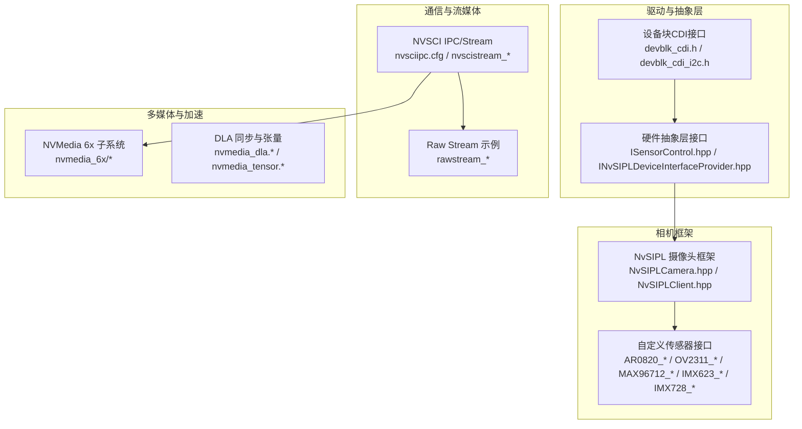
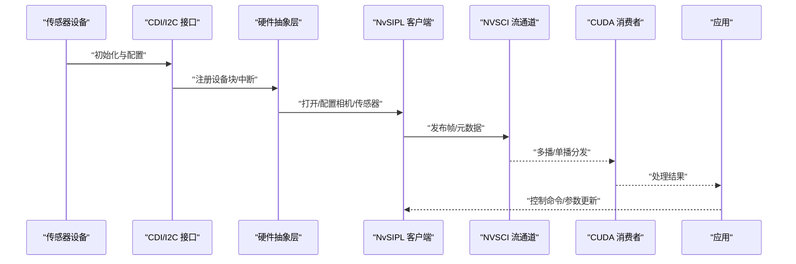
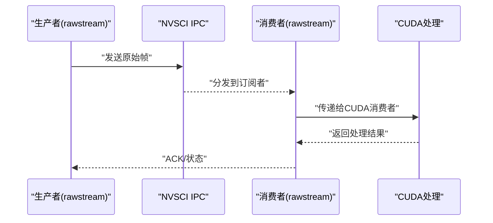
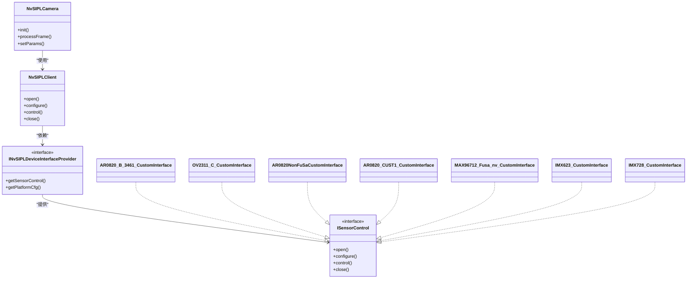
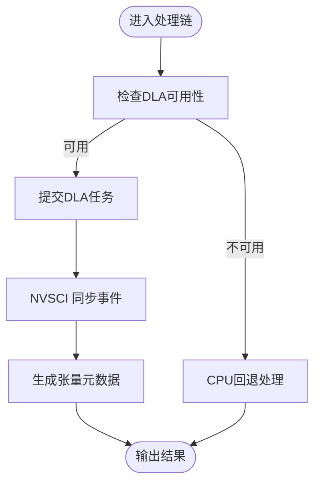
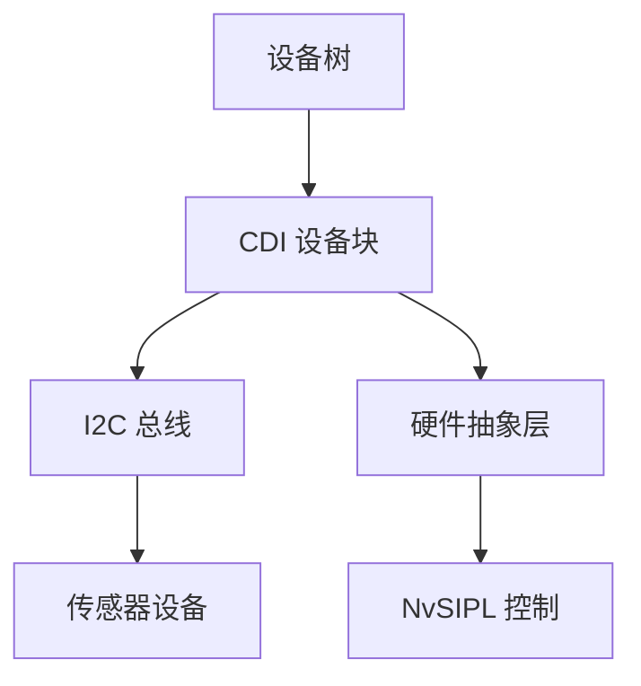

# 硬件集成

<cite>
**本文引用的文件**
- [README.md](file://README.md)
- [nvscibuf.h](file://driveos-6.0.5.0/drive-linux/include/nvscibuf.h)
- [nvscierror.h](file://driveos-6.0.5.0/drive-linux/include/nvscierror.h)
- [nvscievent.h](file://driveos-6.0.5.0/drive-linux/include/nvscievent.h)
- [nvsciipc.h](file://driveos-6.0.5.0/drive-linux/include/nvsciipc.h)
- [nvscistream.h](file://driveos-6.0.5.0/drive-linux/include/nvscistream.h)
- [nvscistream_api.h](file://driveos-6.0.5.0/drive-linux/include/nvscistream_api.h)
- [nvscistream_types.h](file://driveos-6.0.5.0/drive-linux/include/nvscistream_types.h)
- [nvscisync.h](file://driveos-6.0.5.0/drive-linux/include/nvscisync.h)
- [NvSIPLCamera.hpp](file://driveos-6.0.5.0/drive-linux/include/NvSIPLCamera.hpp)
- [NvSIPLClient.hpp](file://driveos-6.0.5.0/drive-linux/include/NvSIPLClient.hpp)
- [NvSIPLCommon.hpp](file://driveos-6.0.5.0/drive-linux/include/NvSIPLCommon.hpp)
- [NvSIPLPlatformCfg.hpp](file://driveos-6.0.5.0/drive-linux/include/NvSIPLPlatformCfg.hpp)
- [ISensorControl.hpp](file://driveos-6.0.5.0/drive-linux/include/ISensorControl.hpp)
- [INvSIPLDeviceInterfaceProvider.hpp](file://driveos-6.0.5.0/drive-linux/include/INvSIPLDeviceInterfaceProvider.hpp)
- [devblk_cdi.h](file://driveos-6.0.5.0/drive-linux/include/devblk_cdi.h)
- [devblk_cdi_i2c.h](file://driveos-6.0.5.0/drive-linux/include/devblk_cdi_i2c.h)
- [AR0820_B_3461_CustomInterface.hpp](file://driveos-6.0.5.0/drive-linux/include/AR0820_B_3461_CustomInterface.hpp)
- [OV2311_C_CustomInterface.hpp](file://driveos-6.0.5.0/drive-linux/include/OV2311_C_CustomInterface.hpp)
- [AR0820NonFuSaCustomInterface.hpp](file://driveos-6.0.6.0/drive-linux/include/AR0820NonFuSaCustomInterface.hpp)
- [AR0820_CUST1_CustomInterface.hpp](file://driveos-6.0.6.0/drive-linux/include/AR0820_CUST1_CustomInterface.hpp)
- [MAX96712_Fusa_nv_CustomInterface.hpp](file://driveos-6.0.6.0/drive-linux/include/MAX96712_Fusa_nv_CustomInterface.hpp)
- [IMX623_CustomInterface.hpp](file://driveos-60100/drive-linux/include/IMX623_CustomInterface.hpp)
- [IMX728_CustomInterface.hpp](file://driveos-60100/drive-linux/include/IMX728_CustomInterface.hpp)
- [TPS650332_CustomData.h](file://driveos-60100/drive-linux/include/TPS650332_CustomData.h)
- [nvmedia_dla.h](file://driveos-6.0.5.0/drive-linux/include/nvmedia_dla.h)
- [nvmedia_dla_nvscisync.h](file://driveos-6.0.5.0/drive-linux/include/nvmedia_dla_nvscisync.h)
- [nvmedia_tensor.h](file://driveos-6.0.5.0/drive-linux/include/nvmedia_tensor.h)
- [nvmedia_tensor_nvscibuf.h](file://driveos-6.0.5.0/drive-linux/include/nvmedia_tensor_nvscibuf.h)
- [nvmedia_tensormetadata.h](file://driveos-6.0.5.0/drive-linux/include/nvmedia_tensormetadata.h)
- [nvmedia_6x](file://driveos-6.0.5.0/drive-linux/include/nvmedia_6x)
- [nvmedia_6x](file://driveos-6.0.6.0/drive-linux/include/nvmedia_6x)
- [nvmedia_6x](file://driveos-60100/drive-linux/include/nvmedia_6x)
- [nvmedia_6x](file://driveos-6081/drive-linux/include/nvmedia_6x)
- [nvsciipc.cfg](file://driveos-6.0.5.0/etc/nvsciipc.cfg)
- [nvsciipc.cfg](file://driveos-6.0.6.0/etc/nvsciipc.cfg)
- [nvsciipc.cfg](file://driveos-60100/etc/nvsciipc.cfg)
- [nvsciipc.cfg](file://driveos-6081/etc/nvsciipc.cfg)
- [99-nvsciipc.rules](file://driveos-6.0.6.0/etc/99-nvsciipc.rules)
- [nv_nvsciipc_init.service](file://driveos-6.0.6.0/etc/nv_nvsciipc_init.service)
- [nvsciipc_add_conf_gid.py](file://driveos-6.0.6.0/usr/bin/nvsciipc_add_conf_gid.py)
- [nvsciipc_gen_uid_gid.py](file://driveos-6.0.6.0/usr/bin/nvsciipc_gen_uid_gid.py)
- [nvscistream_app.cpp](file://driveos-6.0.5.0/drive-linux/samples/nvsci/nvscistream/multicast/nvscistream_app.cpp)
- [channel_producer.cpp](file://driveos-6.0.5.0/drive-linux/samples/nvsci/nvscistream/multicast/channel_producer.cpp)
- [channel_consumer.cpp](file://driveos-6.0.5.0/drive-linux/samples/nvsci/nvscistream/multicast/channel_consumer.cpp)
- [cuda_consumer.cpp](file://driveos-6.0.5.0/drive-linux/samples/nvsci/nvscistream/multicast/cuda_consumer.cpp)
- [nvmedia_producer.cpp](file://driveos-6.0.5.0/drive-linux/samples/nvsci/nvscistream/multicast/nvmedia_producer.cpp)
- [rawstream_main.c](file://driveos-6.0.5.0/drive-linux/samples/nvsci/rawstream/rawstream_main.c)
- [rawstream_producer.c](file://driveos-6.0.5.0/drive-linux/samples/nvsci/rawstream/rawstream_producer.c)
- [rawstream_consumer.c](file://driveos-6.0.5.0/drive-linux/samples/nvsci/rawstream/rawstream_consumer.c)
- [rawstream_cuda.c](file://driveos-6.0.5.0/drive-linux/samples/nvsci/rawstream/rawstream_cuda.c)
- [rawstream_ipc.c](file://driveos-6.0.5.0/drive-linux/samples/nvsci/rawstream/rawstream_ipc.c)
- [rawstream_ipc_linux.c](file://driveos-6.0.5.0/drive-linux/samples/nvsci/rawstream/rawstream_ipc_linux.c)
- [CComposite.cpp](file://driveos-6.0.5.0/drive-linux/tests/nvsys_init_time/CComposite.cpp)
- [CComposite.hpp](file://driveos-6.0.5.0/drive-linux/tests/nvsys_init_time/CComposite.hpp)
- [CNvSIPLMaster.hpp](file://driveos-6.0.5.0/drive-linux/tests/nvsys_init_time/CNvSIPLMaster.hpp)
- [CNvSIPLMasterNvSci.hpp](file://driveos-6.0.5.0/drive-linux/tests/nvsys_init_time/CNvSIPLMasterNvSci.hpp)
- [CNvWfd.cpp](file://driveos-6.0.5.0/drive-linux/tests/nvsys_init_time/CNvWfd.cpp)
- [CNvWfd.hpp](file://driveos-6.0.5.0/drive-linux/tests/nvsys_init_time/CNvWfd.hpp)
- [CUtils.cpp](file://driveos-6.0.5.0/drive-linux/tests/nvsys_init_time/CUtils.cpp)
- [CUtils.hpp](file://driveos-6.0.5.0/drive-linux/tests/nvsys_init_time/CUtils.hpp)
- [main.cpp](file://driveos-6.0.5.0/drive-linux/tests/nvsys_init_time/main.cpp)
</cite>

## 目录
1. [引言](#引言)
2. [项目结构](#项目结构)
3. [核心组件](#核心组件)
4. [架构总览](#架构总览)
5. [详细组件分析](#详细组件分析)
6. [依赖关系分析](#依赖关系分析)
7. [性能考虑](#性能考虑)
8. [故障排查指南](#故障排查指南)
9. [结论](#结论)
10. [附录](#附录)

## 引言
本指南面向在DriveOS平台上进行硬件集成的工程师，聚焦于将各类传感器（摄像头、IMU、雷达等）接入系统，涵盖设备树配置、驱动开发、平台适配（以AGX平台为例）、传感器校准与标定流程、硬件抽象层设计与通信协议、以及硬件故障诊断与供应商协作最佳实践。文档基于仓库中的SDK头文件、示例与测试代码进行归纳总结，帮助读者快速建立从“硬件接入—驱动—应用—验证”的完整知识体系。

## 项目结构
仓库包含多个版本的DriveOS SDK与配套文档、示例及测试代码。与硬件集成直接相关的核心模块包括：
- NVSCI IPC与流媒体通信：提供跨进程/跨组件的高性能数据通道
- NVSIPL相机框架：统一的传感器控制与图像管线接口
- NVMedia多媒体子系统：图像处理、编解码、DLA加速等
- 设备树与CDI接口：硬件抽象与平台配置
- 示例与测试：nvscistream、rawstream、NVSIPL测试等

图示来源
- [devblk_cdi.h](file://driveos-6.0.5.0/drive-linux/include/devblk_cdi.h)
- [devblk_cdi_i2c.h](file://driveos-6.0.5.0/drive-linux/include/devblk_cdi_i2c.h)
- [ISensorControl.hpp](file://driveos-6.0.5.0/drive-linux/include/ISensorControl.hpp)
- [INvSIPLDeviceInterfaceProvider.hpp](file://driveos-6.0.5.0/drive-linux/include/INvSIPLDeviceInterfaceProvider.hpp)
- [NvSIPLCamera.hpp](file://driveos-6.0.5.0/drive-linux/include/NvSIPLCamera.hpp)
- [NvSIPLClient.hpp](file://driveos-6.0.5.0/drive-linux/include/NvSIPLClient.hpp)
- [nvscistream_app.cpp](file://driveos-6.0.5.0/drive-linux/samples/nvsci/nvscistream/multicast/nvscistream_app.cpp)
- [rawstream_main.c](file://driveos-6.0.5.0/drive-linux/samples/nvsci/rawstream/rawstream_main.c)
- [nvmedia_dla.h](file://driveos-6.0.5.0/drive-linux/include/nvmedia_dla.h)
- [nvmedia_tensor.h](file://driveos-6.0.5.0/drive-linux/include/nvmedia_tensor.h)

章节来源
- [README.md:1-128](file://README.md#L1-L128)

## 核心组件
- NVSCI IPC与流媒体
  - 提供跨进程/跨模块的高性能数据通道，支持多播/单播模式，配合CUDA消费者可实现GPU侧高效处理。
  - 关键配置文件与服务：nvsciipc.cfg、99-nvsciipc.rules、nv_nvsciipc_init.service。
  - 示例入口与生产者/消费者：nvscistream_app.cpp、channel_producer.cpp、channel_consumer.cpp、cuda_consumer.cpp、nvmedia_producer.cpp；rawstream_*系列示例展示原始流传输与IPC。

- NVSIPL相机框架
  - 统一的相机客户端与平台配置接口，屏蔽底层硬件差异，便于扩展不同传感器。
  - 自定义传感器接口样例：AR0820_B_3461_CustomInterface.hpp、OV2311_C_CustomInterface.hpp、AR0820NonFuSaCustomInterface.hpp、AR0820_CUST1_CustomInterface.hpp、MAX96712_Fusa_nv_CustomInterface.hpp、IMX623_CustomInterface.hpp、IMX728_CustomInterface.hpp。
  - 平台配置与通用接口：NvSIPLPlatformCfg.hpp、NvSIPLCommon.hpp、NvSIPLClient.hpp、NvSIPLCamera.hpp。

- NVMedia多媒体与DLA加速
  - 图像处理、编解码、张量元数据与同步机制，支撑高吞吐的视觉算法执行。
  - 关键头文件：nvmedia_dla.h、nvmedia_dla_nvscisync.h、nvmedia_tensor.h、nvmedia_tensor_nvscibuf.h、nvmedia_tensormetadata.h。

- 设备树与CDI接口
  - 通过CDI接口描述硬件设备块与I2C等总线信息，为上层HAL提供统一硬件视图。
  - 关键头文件：devblk_cdi.h、devblk_cdi_i2c.h。

章节来源
- [nvscistream_app.cpp](file://driveos-6.0.5.0/drive-linux/samples/nvsci/nvscistream/multicast/nvscistream_app.cpp)
- [channel_producer.cpp](file://driveos-6.0.5.0/drive-linux/samples/nvsci/nvscistream/multicast/channel_producer.cpp)
- [channel_consumer.cpp](file://driveos-6.0.5.0/drive-linux/samples/nvsci/nvscistream/multicast/channel_consumer.cpp)
- [cuda_consumer.cpp](file://driveos-6.0.5.0/drive-linux/samples/nvsci/nvscistream/multicast/cuda_consumer.cpp)
- [nvmedia_producer.cpp](file://driveos-6.0.5.0/drive-linux/samples/nvsci/nvscistream/multicast/nvmedia_producer.cpp)
- [rawstream_main.c](file://driveos-6.0.5.0/drive-linux/samples/nvsci/rawstream/rawstream_main.c)
- [rawstream_producer.c](file://driveos-6.0.5.0/drive-linux/samples/nvsci/rawstream/rawstream_producer.c)
- [rawstream_consumer.c](file://driveos-6.0.5.0/drive-linux/samples/nvsci/rawstream/rawstream_consumer.c)
- [rawstream_cuda.c](file://driveos-6.0.5.0/drive-linux/samples/nvsci/rawstream/rawstream_cuda.c)
- [rawstream_ipc.c](file://driveos-6.0.5.0/drive-linux/samples/nvsci/rawstream/rawstream_ipc.c)
- [rawstream_ipc_linux.c](file://driveos-6.0.5.0/drive-linux/samples/nvsci/rawstream/rawstream_ipc_linux.c)
- [NvSIPLCamera.hpp](file://driveos-6.0.5.0/drive-linux/include/NvSIPLCamera.hpp)
- [NvSIPLClient.hpp](file://driveos-6.0.5.0/drive-linux/include/NvSIPLClient.hpp)
- [NvSIPLCommon.hpp](file://driveos-6.0.5.0/drive-linux/include/NvSIPLCommon.hpp)
- [NvSIPLPlatformCfg.hpp](file://driveos-6.0.5.0/drive-linux/include/NvSIPLPlatformCfg.hpp)
- [ISensorControl.hpp](file://driveos-6.0.5.0/drive-linux/include/ISensorControl.hpp)
- [INvSIPLDeviceInterfaceProvider.hpp](file://driveos-6.0.5.0/drive-linux/include/INvSIPLDeviceInterfaceProvider.hpp)
- [devblk_cdi.h](file://driveos-6.0.5.0/drive-linux/include/devblk_cdi.h)
- [devblk_cdi_i2c.h](file://driveos-6.0.5.0/drive-linux/include/devblk_cdi_i2c.h)
- [AR0820_B_3461_CustomInterface.hpp](file://driveos-6.0.5.0/drive-linux/include/AR0820_B_3461_CustomInterface.hpp)
- [OV2311_C_CustomInterface.hpp](file://driveos-6.0.5.0/drive-linux/include/OV2311_C_CustomInterface.hpp)
- [AR0820NonFuSaCustomInterface.hpp](file://driveos-6.0.6.0/drive-linux/include/AR0820NonFuSaCustomInterface.hpp)
- [AR0820_CUST1_CustomInterface.hpp](file://driveos-6.0.6.0/drive-linux/include/AR0820_CUST1_CustomInterface.hpp)
- [MAX96712_Fusa_nv_CustomInterface.hpp](file://driveos-6.0.6.0/drive-linux/include/MAX96712_Fusa_nv_CustomInterface.hpp)
- [IMX623_CustomInterface.hpp](file://driveos-60100/drive-linux/include/IMX623_CustomInterface.hpp)
- [IMX728_CustomInterface.hpp](file://driveos-60100/drive-linux/include/IMX728_CustomInterface.hpp)
- [nvmedia_dla.h](file://driveos-6.0.5.0/drive-linux/include/nvmedia_dla.h)
- [nvmedia_dla_nvscisync.h](file://driveos-6.0.5.0/drive-linux/include/nvmedia_dla_nvscisync.h)
- [nvmedia_tensor.h](file://driveos-6.0.5.0/drive-linux/include/nvmedia_tensor.h)
- [nvmedia_tensor_nvscibuf.h](file://driveos-6.0.5.0/drive-linux/include/nvmedia_tensor_nvscibuf.h)
- [nvmedia_tensormetadata.h](file://driveos-6.0.5.0/drive-linux/include/nvmedia_tensormetadata.h)

## 架构总览
下图展示了从传感器到应用的数据通路：传感器通过CDI/I2C等总线接入，NVSIPL负责控制与图像管线，NVSCI提供跨组件通信，NVMedia完成加速处理，最终由应用消费或进一步推理。

图示来源
- [devblk_cdi_i2c.h](file://driveos-6.0.5.0/drive-linux/include/devblk_cdi_i2c.h)
- [INvSIPLDeviceInterfaceProvider.hpp](file://driveos-6.0.5.0/drive-linux/include/INvSIPLDeviceInterfaceProvider.hpp)
- [NvSIPLClient.hpp](file://driveos-6.0.5.0/drive-linux/include/NvSIPLClient.hpp)
- [nvscistream_app.cpp](file://driveos-6.0.5.0/drive-linux/samples/nvsci/nvscistream/multicast/nvscistream_app.cpp)
- [cuda_consumer.cpp](file://driveos-6.0.5.0/drive-linux/samples/nvsci/nvscistream/multicast/cuda_consumer.cpp)

## 详细组件分析

### NVSCI IPC与流媒体
- 多播/单播通道：nvscistream_app.cpp、channel_producer.cpp、channel_consumer.cpp、cuda_consumer.cpp、nvmedia_producer.cpp展示了生产者-消费者模型与CUDA路径。
- 原始流传输：rawstream_*系列示例覆盖生产者、消费者、CUDA与IPC路径，适合低延迟直通场景。
- 配置与权限：nvsciipc.cfg、99-nvsciipc.rules、nv_nvsciipc_init.service用于服务化与权限管理；nvsciipc_add_conf_gid.py、nvsciipc_gen_uid_gid.py用于用户/组配置自动化。

图示来源
- [rawstream_main.c](file://driveos-6.0.5.0/drive-linux/samples/nvsci/rawstream/rawstream_main.c)
- [rawstream_producer.c](file://driveos-6.0.5.0/drive-linux/samples/nvsci/rawstream/rawstream_producer.c)
- [rawstream_consumer.c](file://driveos-6.0.5.0/drive-linux/samples/nvsci/rawstream/rawstream_consumer.c)
- [rawstream_cuda.c](file://driveos-6.0.5.0/drive-linux/samples/nvsci/rawstream/rawstream_cuda.c)
- [rawstream_ipc.c](file://driveos-6.0.5.0/drive-linux/samples/nvsci/rawstream/rawstream_ipc.c)
- [rawstream_ipc_linux.c](file://driveos-6.0.5.0/drive-linux/samples/nvsci/rawstream/rawstream_ipc_linux.c)

章节来源
- [nvscistream_app.cpp](file://driveos-6.0.5.0/drive-linux/samples/nvsci/nvscistream/multicast/nvscistream_app.cpp)
- [channel_producer.cpp](file://driveos-6.0.5.0/drive-linux/samples/nvsci/nvscistream/multicast/channel_producer.cpp)
- [channel_consumer.cpp](file://driveos-6.0.5.0/drive-linux/samples/nvsci/nvscistream/multicast/channel_consumer.cpp)
- [cuda_consumer.cpp](file://driveos-6.0.5.0/drive-linux/samples/nvsci/nvscistream/multicast/cuda_consumer.cpp)
- [nvmedia_producer.cpp](file://driveos-6.0.5.0/drive-linux/samples/nvsci/nvscistream/multicast/nvmedia_producer.cpp)
- [rawstream_main.c](file://driveos-6.0.5.0/drive-linux/samples/nvsci/rawstream/rawstream_main.c)
- [rawstream_producer.c](file://driveos-6.0.5.0/drive-linux/samples/nvsci/rawstream/rawstream_producer.c)
- [rawstream_consumer.c](file://driveos-6.0.5.0/drive-linux/samples/nvsci/rawstream/rawstream_consumer.c)
- [rawstream_cuda.c](file://driveos-6.0.5.0/drive-linux/samples/nvsci/rawstream/rawstream_cuda.c)
- [rawstream_ipc.c](file://driveos-6.0.5.0/drive-linux/samples/nvsci/rawstream/rawstream_ipc.c)
- [rawstream_ipc_linux.c](file://driveos-6.0.5.0/drive-linux/samples/nvsci/rawstream/rawstream_ipc_linux.c)
- [nvsciipc.cfg](file://driveos-6.0.5.0/etc/nvsciipc.cfg)
- [99-nvsciipc.rules](file://driveos-6.0.6.0/etc/99-nvsciipc.rules)
- [nv_nvsciipc_init.service](file://driveos-6.0.6.0/etc/nv_nvsciipc_init.service)
- [nvsciipc_add_conf_gid.py](file://driveos-6.0.6.0/usr/bin/nvsciipc_add_conf_gid.py)
- [nvsciipc_gen_uid_gid.py](file://driveos-6.0.6.0/usr/bin/nvsciipc_gen_uid_gid.py)

### NVSIPL相机框架与自定义传感器接口
- NVSIPLClient/NvSIPLCamera提供统一的打开/配置/控制接口，屏蔽底层差异。
- 自定义传感器接口样例覆盖多种传感器型号，展示如何实现ISensorControl与设备接口提供器。
- 平台配置通过NvSIPLPlatformCfg.hpp注入，确保不同硬件平台的一致行为。

图示来源
- [ISensorControl.hpp](file://driveos-6.0.5.0/drive-linux/include/ISensorControl.hpp)
- [INvSIPLDeviceInterfaceProvider.hpp](file://driveos-6.0.5.0/drive-linux/include/INvSIPLDeviceInterfaceProvider.hpp)
- [NvSIPLClient.hpp](file://driveos-6.0.5.0/drive-linux/include/NvSIPLClient.hpp)
- [NvSIPLCamera.hpp](file://driveos-6.0.5.0/drive-linux/include/NvSIPLCamera.hpp)
- [AR0820_B_3461_CustomInterface.hpp](file://driveos-6.0.5.0/drive-linux/include/AR0820_B_3461_CustomInterface.hpp)
- [OV2311_C_CustomInterface.hpp](file://driveos-6.0.5.0/drive-linux/include/OV2311_C_CustomInterface.hpp)
- [AR0820NonFuSaCustomInterface.hpp](file://driveos-6.0.6.0/drive-linux/include/AR0820NonFuSaCustomInterface.hpp)
- [AR0820_CUST1_CustomInterface.hpp](file://driveos-6.0.6.0/drive-linux/include/AR0820_CUST1_CustomInterface.hpp)
- [MAX96712_Fusa_nv_CustomInterface.hpp](file://driveos-6.0.6.0/drive-linux/include/MAX96712_Fusa_nv_CustomInterface.hpp)
- [IMX623_CustomInterface.hpp](file://driveos-60100/drive-linux/include/IMX623_CustomInterface.hpp)
- [IMX728_CustomInterface.hpp](file://driveos-60100/drive-linux/include/IMX728_CustomInterface.hpp)

章节来源
- [NvSIPLClient.hpp](file://driveos-6.0.5.0/drive-linux/include/NvSIPLClient.hpp)
- [NvSIPLCamera.hpp](file://driveos-6.0.5.0/drive-linux/include/NvSIPLCamera.hpp)
- [NvSIPLCommon.hpp](file://driveos-6.0.5.0/drive-linux/include/NvSIPLCommon.hpp)
- [NvSIPLPlatformCfg.hpp](file://driveos-6.0.5.0/drive-linux/include/NvSIPLPlatformCfg.hpp)
- [ISensorControl.hpp](file://driveos-6.0.5.0/drive-linux/include/ISensorControl.hpp)
- [INvSIPLDeviceInterfaceProvider.hpp](file://driveos-6.0.5.0/drive-linux/include/INvSIPLDeviceInterfaceProvider.hpp)
- [AR0820_B_3461_CustomInterface.hpp](file://driveos-6.0.5.0/drive-linux/include/AR0820_B_3461_CustomInterface.hpp)
- [OV2311_C_CustomInterface.hpp](file://driveos-6.0.5.0/drive-linux/include/OV2311_C_CustomInterface.hpp)
- [AR0820NonFuSaCustomInterface.hpp](file://driveos-6.0.6.0/drive-linux/include/AR0820NonFuSaCustomInterface.hpp)
- [AR0820_CUST1_CustomInterface.hpp](file://driveos-6.0.6.0/drive-linux/include/AR0820_CUST1_CustomInterface.hpp)
- [MAX96712_Fusa_nv_CustomInterface.hpp](file://driveos-6.0.6.0/drive-linux/include/MAX96712_Fusa_nv_CustomInterface.hpp)
- [IMX623_CustomInterface.hpp](file://driveos-60100/drive-linux/include/IMX623_CustomInterface.hpp)
- [IMX728_CustomInterface.hpp](file://driveos-60100/drive-linux/include/IMX728_CustomInterface.hpp)

### NVMedia多媒体与DLA加速
- DLA同步与张量：nvmedia_dla.h、nvmedia_dla_nvscisync.h提供DLA任务调度与同步；nvmedia_tensor.h、nvmedia_tensor_nvscibuf.h、nvmedia_tensormetadata.h提供张量封装与元数据。
- 与NVSCI结合：通过nvscibuf与nvscisync实现跨组件的缓冲区与事件同步，保障高吞吐与低延迟。

图示来源
- [nvmedia_dla.h](file://driveos-6.0.5.0/drive-linux/include/nvmedia_dla.h)
- [nvmedia_dla_nvscisync.h](file://driveos-6.0.5.0/drive-linux/include/nvmedia_dla_nvscisync.h)
- [nvmedia_tensor.h](file://driveos-6.0.5.0/drive-linux/include/nvmedia_tensor.h)
- [nvmedia_tensor_nvscibuf.h](file://driveos-6.0.5.0/drive-linux/include/nvmedia_tensor_nvscibuf.h)
- [nvmedia_tensormetadata.h](file://driveos-6.0.5.0/drive-linux/include/nvmedia_tensormetadata.h)
- [nvscisync.h](file://driveos-6.0.5.0/drive-linux/include/nvscisync.h)
- [nvscibuf.h](file://driveos-6.0.5.0/drive-linux/include/nvscibuf.h)

章节来源
- [nvmedia_dla.h](file://driveos-6.0.5.0/drive-linux/include/nvmedia_dla.h)
- [nvmedia_dla_nvscisync.h](file://driveos-6.0.5.0/drive-linux/include/nvmedia_dla_nvscisync.h)
- [nvmedia_tensor.h](file://driveos-6.0.5.0/drive-linux/include/nvmedia_tensor.h)
- [nvmedia_tensor_nvscibuf.h](file://driveos-6.0.5.0/drive-linux/include/nvmedia_tensor_nvscibuf.h)
- [nvmedia_tensormetadata.h](file://driveos-6.0.5.0/drive-linux/include/nvmedia_tensormetadata.h)
- [nvscisync.h](file://driveos-6.0.5.0/drive-linux/include/nvscisync.h)
- [nvscibuf.h](file://driveos-6.0.5.0/drive-linux/include/nvscibuf.h)

### 设备树与CDI接口
- 设备块与I2C：devblk_cdi.h、devblk_cdi_i2c.h定义了设备块描述与I2C接口，为传感器接入提供基础抽象。
- 平台配置：NvSIPLPlatformCfg.hpp用于加载平台特定配置，确保不同硬件平台一致的行为。

图示来源
- [devblk_cdi.h](file://driveos-6.0.5.0/drive-linux/include/devblk_cdi.h)
- [devblk_cdi_i2c.h](file://driveos-6.0.5.0/drive-linux/include/devblk_cdi_i2c.h)
- [NvSIPLPlatformCfg.hpp](file://driveos-6.0.5.0/drive-linux/include/NvSIPLPlatformCfg.hpp)

章节来源
- [devblk_cdi.h](file://driveos-6.0.5.0/drive-linux/include/devblk_cdi.h)
- [devblk_cdi_i2c.h](file://driveos-6.0.5.0/drive-linux/include/devblk_cdi_i2c.h)
- [NvSIPLPlatformCfg.hpp](file://driveos-6.0.5.0/drive-linux/include/NvSIPLPlatformCfg.hpp)

### AGX平台适配案例
- 版本选择：仓库包含多个版本SDK（如6.0.5.0、6.0.6.0、60100、6081），建议根据目标AGX硬件与软件栈选择对应版本。
- 平台差异：不同版本在头文件集合、示例与测试代码上存在差异，需对照相应版本的头文件与示例进行适配。
- 适配步骤建议：
  1) 明确硬件平台与固件版本，选择匹配的SDK版本。
  2) 在设备树中添加/确认传感器设备节点，确保I2C地址与中断配置正确。
  3) 实现自定义传感器接口（参考AR0820_*、OV2311_*、MAX96712_*、IMX623_*、IMX728_*等），实现ISensorControl与设备接口提供器。
  4) 使用NvSIPLClient/NvSIPLCamera进行打开/配置/控制，必要时通过NvSIPLPlatformCfg.hpp注入平台配置。
  5) 通过NVSCI多播/单播通道或rawstream示例进行数据通路验证。
  6) 结合NVMedia DLA与张量元数据进行加速与结果封装。

章节来源
- [README.md:1-128](file://README.md#L1-L128)
- [AR0820_B_3461_CustomInterface.hpp](file://driveos-6.0.5.0/drive-linux/include/AR0820_B_3461_CustomInterface.hpp)
- [OV2311_C_CustomInterface.hpp](file://driveos-6.0.5.0/drive-linux/include/OV2311_C_CustomInterface.hpp)
- [MAX96712_Fusa_nv_CustomInterface.hpp](file://driveos-6.0.6.0/drive-linux/include/MAX96712_Fusa_nv_CustomInterface.hpp)
- [IMX623_CustomInterface.hpp](file://driveos-60100/drive-linux/include/IMX623_CustomInterface.hpp)
- [IMX728_CustomInterface.hpp](file://driveos-60100/drive-linux/include/IMX728_CustomInterface.hpp)
- [NvSIPLClient.hpp](file://driveos-6.0.5.0/drive-linux/include/NvSIPLClient.hpp)
- [NvSIPLCamera.hpp](file://driveos-6.0.5.0/drive-linux/include/NvSIPLCamera.hpp)
- [nvscistream_app.cpp](file://driveos-6.0.5.0/drive-linux/samples/nvsci/nvscistream/multicast/nvscistream_app.cpp)
- [rawstream_main.c](file://driveos-6.0.5.0/drive-linux/samples/nvsci/rawstream/rawstream_main.c)

### 传感器校准与标定流程
- 相机标定：通过NvSIPLClient配置相机参数，结合平台配置文件（NvSIPLPlatformCfg.hpp）设置分辨率、帧率、曝光等；使用自定义接口实现传感器控制（ISensorControl.hpp）。
- 多传感器融合：利用NVSCI多播通道将多源数据汇聚，再由应用侧进行时间戳对齐与空间标定。
- 标定工具链：结合NVMedia图像处理能力与张量元数据，形成闭环验证。

章节来源
- [NvSIPLClient.hpp](file://driveos-6.0.5.0/drive-linux/include/NvSIPLClient.hpp)
- [NvSIPLPlatformCfg.hpp](file://driveos-6.0.5.0/drive-linux/include/NvSIPLPlatformCfg.hpp)
- [ISensorControl.hpp](file://driveos-6.0.5.0/drive-linux/include/ISensorControl.hpp)
- [nvmedia_tensormetadata.h](file://driveos-6.0.5.0/drive-linux/include/nvmedia_tensormetadata.h)

### 硬件抽象层设计与通信协议
- 抽象层职责：屏蔽硬件差异，向上提供统一的控制与查询接口；向下对接CDI/I2C等总线与设备块。
- 接口规范：ISensorControl定义了open/configure/control/close等标准流程；INvSIPLDeviceInterfaceProvider提供设备接口提供能力。
- 通信协议：NVSCI提供跨进程/跨模块的可靠数据通道；NVMedia通过nvscibuf与nvscisync实现缓冲区与事件同步。

章节来源
- [ISensorControl.hpp](file://driveos-6.0.5.0/drive-linux/include/ISensorControl.hpp)
- [INvSIPLDeviceInterfaceProvider.hpp](file://driveos-6.0.5.0/drive-linux/include/INvSIPLDeviceInterfaceProvider.hpp)
- [devblk_cdi_i2c.h](file://driveos-6.0.5.0/drive-linux/include/devblk_cdi_i2c.h)
- [nvscibuf.h](file://driveos-6.0.5.0/drive-linux/include/nvscibuf.h)
- [nvscisync.h](file://driveos-6.0.5.0/drive-linux/include/nvscisync.h)

### 硬件故障诊断与问题排查
- 初始化时延测试：使用nvsys_init_time测试套件（CComposite.cpp、CComposite.hpp、CNvSIPLMaster.hpp、CNvSIPLMasterNvSci.hpp、CNvWfd.cpp、CNvWfd.hpp、CUtils.cpp、CUtils.hpp、main.cpp）评估系统启动与初始化性能瓶颈。
- NVSCI配置核验：检查nvsciipc.cfg、99-nvsciipc.rules、nv_nvsciipc_init.service是否正确部署；使用nvsciipc_add_conf_gid.py、nvsciipc_gen_uid_gid.py进行用户/组配置。
- 数据通路验证：通过nvscistream与rawstream示例验证生产者-消费者链路，定位卡顿或丢帧问题。

章节来源
- [CComposite.cpp](file://driveos-6.0.5.0/drive-linux/tests/nvsys_init_time/CComposite.cpp)
- [CComposite.hpp](file://driveos-6.0.5.0/drive-linux/tests/nvsys_init_time/CComposite.hpp)
- [CNvSIPLMaster.hpp](file://driveos-6.0.5.0/drive-linux/tests/nvsys_init_time/CNvSIPLMaster.hpp)
- [CNvSIPLMasterNvSci.hpp](file://driveos-6.0.5.0/drive-linux/tests/nvsys_init_time/CNvSIPLMasterNvSci.hpp)
- [CNvWfd.cpp](file://driveos-6.0.5.0/drive-linux/tests/nvsys_init_time/CNvWfd.cpp)
- [CNvWfd.hpp](file://driveos-6.0.5.0/drive-linux/tests/nvsys_init_time/CNvWfd.hpp)
- [CUtils.cpp](file://driveos-6.0.5.0/drive-linux/tests/nvsys_init_time/CUtils.cpp)
- [CUtils.hpp](file://driveos-6.0.5.0/drive-linux/tests/nvsys_init_time/CUtils.hpp)
- [main.cpp](file://driveos-6.0.5.0/drive-linux/tests/nvsys_init_time/main.cpp)
- [nvsciipc.cfg](file://driveos-6.0.5.0/etc/nvsciipc.cfg)
- [99-nvsciipc.rules](file://driveos-6.0.6.0/etc/99-nvsciipc.rules)
- [nv_nvsciipc_init.service](file://driveos-6.0.6.0/etc/nv_nvsciipc_init.service)
- [nvsciipc_add_conf_gid.py](file://driveos-6.0.6.0/usr/bin/nvsciipc_add_conf_gid.py)
- [nvsciipc_gen_uid_gid.py](file://driveos-6.0.6.0/usr/bin/nvsciipc_gen_uid_gid.py)

## 依赖关系分析
- 组件耦合：NVSIPL依赖硬件抽象层接口；NVSCI为上层提供通信通道；NVMedia依赖NVSCI进行缓冲区与事件同步。
- 外部依赖：CDI/I2C总线、平台配置文件、NVSCI服务与规则文件。
- 潜在环路：头文件间无循环包含迹象，接口清晰分离。

图示来源
- [devblk_cdi.h](file://driveos-6.0.5.0/drive-linux/include/devblk_cdi.h)
- [devblk_cdi_i2c.h](file://driveos-6.0.5.0/drive-linux/include/devblk_cdi_i2c.h)
- [ISensorControl.hpp](file://driveos-6.0.5.0/drive-linux/include/ISensorControl.hpp)
- [INvSIPLDeviceInterfaceProvider.hpp](file://driveos-6.0.5.0/drive-linux/include/INvSIPLDeviceInterfaceProvider.hpp)
- [NvSIPLClient.hpp](file://driveos-6.0.5.0/drive-linux/include/NvSIPLClient.hpp)
- [NvSIPLCamera.hpp](file://driveos-6.0.5.0/drive-linux/include/NvSIPLCamera.hpp)
- [nvscistream_app.cpp](file://driveos-6.0.5.0/drive-linux/samples/nvsci/nvscistream/multicast/nvscistream_app.cpp)
- [rawstream_main.c](file://driveos-6.0.5.0/drive-linux/samples/nvsci/rawstream/rawstream_main.c)
- [nvscibuf.h](file://driveos-6.0.5.0/drive-linux/include/nvscibuf.h)
- [nvscisync.h](file://driveos-6.0.5.0/drive-linux/include/nvscisync.h)

章节来源
- [devblk_cdi.h](file://driveos-6.0.5.0/drive-linux/include/devblk_cdi.h)
- [devblk_cdi_i2c.h](file://driveos-6.0.5.0/drive-linux/include/devblk_cdi_i2c.h)
- [ISensorControl.hpp](file://driveos-6.0.5.0/drive-linux/include/ISensorControl.hpp)
- [INvSIPLDeviceInterfaceProvider.hpp](file://driveos-6.0.5.0/drive-linux/include/INvSIPLDeviceInterfaceProvider.hpp)
- [NvSIPLClient.hpp](file://driveos-6.0.5.0/drive-linux/include/NvSIPLClient.hpp)
- [NvSIPLCamera.hpp](file://driveos-6.0.5.0/drive-linux/include/NvSIPLCamera.hpp)
- [nvscistream_app.cpp](file://driveos-6.0.5.0/drive-linux/samples/nvsci/nvscistream/multicast/nvscistream_app.cpp)
- [rawstream_main.c](file://driveos-6.0.5.0/drive-linux/samples/nvsci/rawstream/rawstream_main.c)
- [nvscibuf.h](file://driveos-6.0.5.0/drive-linux/include/nvscibuf.h)
- [nvscisync.h](file://driveos-6.0.5.0/drive-linux/include/nvscisync.h)

## 性能考虑
- 低延迟通路：优先采用NVSCI多播/单播与rawstream直通，减少拷贝与转换开销。
- 加速路径：结合NVMedia DLA与张量元数据，提升图像处理吞吐。
- 同步与背压：合理使用nvscisync与nvscibuf，避免生产者过快导致的缓冲区溢出。
- 初始化优化：通过nvsys_init_time测试套件识别瓶颈，优化设备树与驱动初始化顺序。

## 故障排查指南
- 通信问题：检查nvsciipc.cfg与服务状态，确认99-nvsciipc.rules生效；使用nvsciipc_add_conf_gid.py/nvsciipc_gen_uid_gid.py修复权限。
- 数据通路：通过nvscistream与rawstream示例逐步定位问题点，观察卡顿或丢帧现象。
- 初始化问题：运行nvsys_init_time测试，记录各阶段耗时，定位慢环节。

章节来源
- [nvsciipc.cfg](file://driveos-6.0.5.0/etc/nvsciipc.cfg)
- [99-nvsciipc.rules](file://driveos-6.0.6.0/etc/99-nvsciipc.rules)
- [nv_nvsciipc_init.service](file://driveos-6.0.6.0/etc/nv_nvsciipc_init.service)
- [nvsciipc_add_conf_gid.py](file://driveos-6.0.6.0/usr/bin/nvsciipc_add_conf_gid.py)
- [nvsciipc_gen_uid_gid.py](file://driveos-6.0.6.0/usr/bin/nvsciipc_gen_uid_gid.py)
- [CUtils.cpp](file://driveos-6.0.5.0/drive-linux/tests/nvsys_init_time/CUtils.cpp)
- [CUtils.hpp](file://driveos-6.0.5.0/drive-linux/tests/nvsys_init_time/CUtils.hpp)
- [main.cpp](file://driveos-6.0.5.0/drive-linux/tests/nvsys_init_time/main.cpp)

## 结论
本指南基于DriveOS SDK的头文件、示例与测试代码，构建了从硬件接入、抽象层设计、通信协议到性能优化与故障排查的完整知识框架。针对AGX平台，建议依据目标硬件版本选择对应SDK，并遵循CDI/I2C接入、NVSIPL控制、NVSCI通路与NVMedia加速的集成路径，最终通过测试套件与示例验证系统稳定性与性能。

## 附录
- 版本与包信息：README.md列出了关键SDK包与拷贝方法，便于快速获取与整理SDK资源。
- 头文件集合：nvmedia_6x目录在多个版本中存在，建议按版本核对头文件差异。

章节来源
- [README.md:1-128](file://README.md#L1-L128)