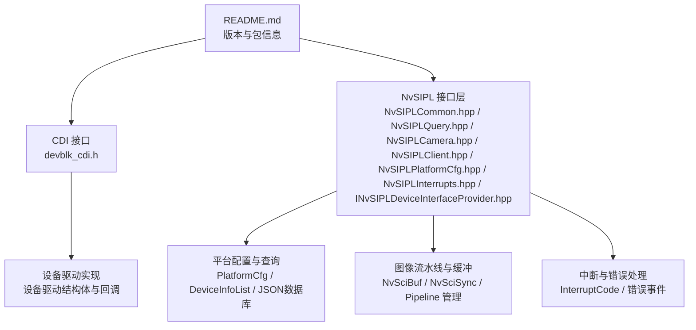
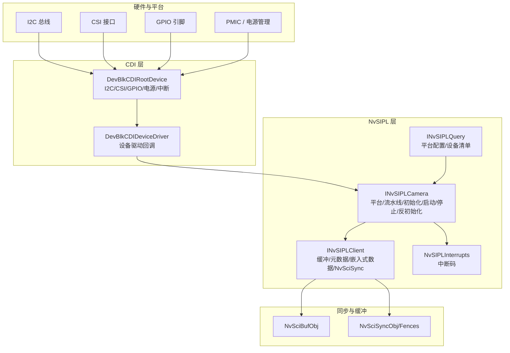
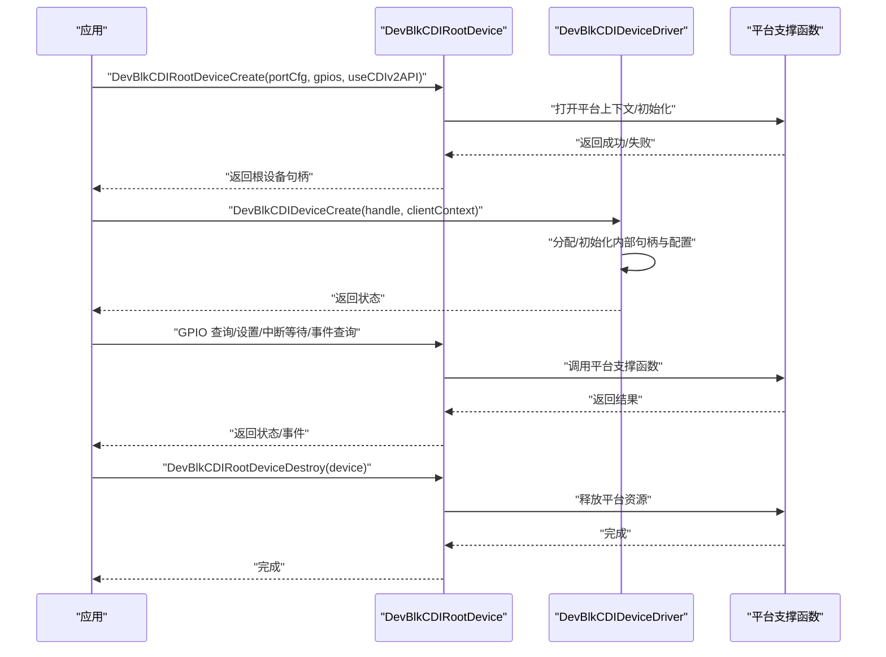
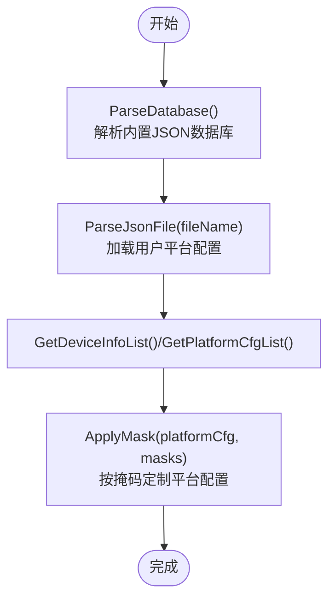
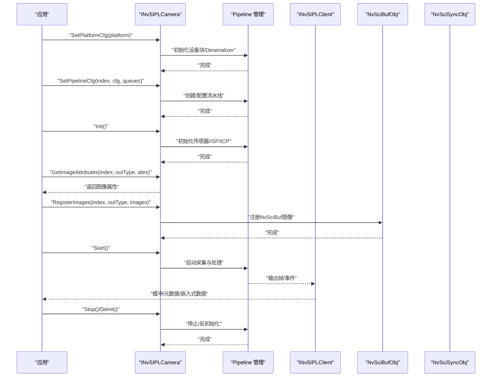
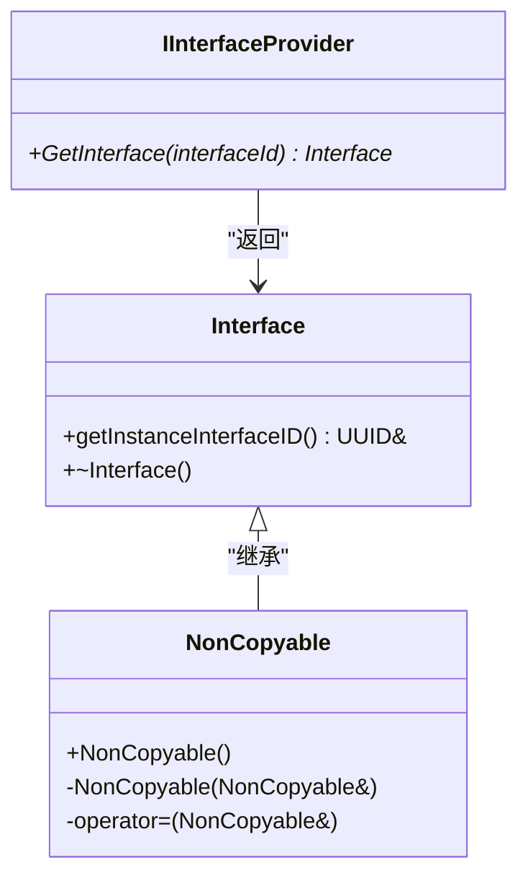
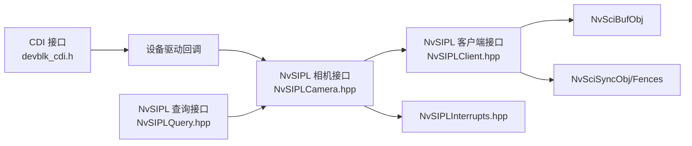

# 设备驱动开发

<cite>
**本文引用的文件**
- [README.md](file://README.md)
- [devblk_cdi.h](file://driveos-6.0.5.0/drive-linux/include/devblk_cdi.h)
- [INvSIPLDeviceInterfaceProvider.hpp](file://driveos-6.0.5.0/drive-linux/include/INvSIPLDeviceInterfaceProvider.hpp)
- [NvSIPLCommon.hpp](file://driveos-6.0.5.0/drive-linux/include/NvSIPLCommon.hpp)
- [NvSIPLQuery.hpp](file://driveos-6.0.5.0/drive-linux/include/NvSIPLQuery.hpp)
- [NvSIPLInterrupts.hpp](file://driveos-6.0.5.0/drive-linux/include/NvSIPLInterrupts.hpp)
- [NvSIPLCamera.hpp](file://driveos-6.0.5.0/drive-linux/include/NvSIPLCamera.hpp)
- [NvSIPLClient.hpp](file://driveos-6.0.5.0/drive-linux/include/NvSIPLClient.hpp)
- [NvSIPLPlatformCfg.hpp](file://driveos-6.0.5.0/drive-linux/include/NvSIPLPlatformCfg.hpp)
</cite>

## 目录
1. [引言](#引言)
2. [项目结构](#项目结构)
3. [核心组件](#核心组件)
4. [架构总览](#架构总览)
5. [详细组件分析](#详细组件分析)
6. [依赖关系分析](#依赖关系分析)
7. [性能考虑](#性能考虑)
8. [故障排查指南](#故障排查指南)
9. [结论](#结论)
10. [附录](#附录)

## 引言
本指南面向在DriveOS平台上开发设备驱动的工程师，系统讲解如何基于CDI（Component Device Interface）与NvSIPL接口层构建自定义设备驱动，覆盖设备抽象层设计、CDI接口使用、设备树配置、中断处理、设备通信协议、设备查询接口、调试与测试方法，以及从简单字符设备到复杂多媒体设备的完整实现路径。文档同时阐述与NvSIPL接口层的数据流转机制，帮助读者快速上手并高质量交付驱动。

## 项目结构
仓库包含多个版本的DriveOS SDK与示例，核心与驱动开发相关的关键目录与文件如下：
- 驱动接口与抽象层：devblk_cdi.h（CDI根设备、设备驱动、GPIO与中断等）
- NvSIPL接口层：NvSIPLCommon.hpp、NvSIPLQuery.hpp、NvSIPLCamera.hpp、NvSIPLClient.hpp、NvSIPLPlatformCfg.hpp、NvSIPLInterrupts.hpp、INvSIPLDeviceInterfaceProvider.hpp
- 示例与工具：samples目录下的多媒体与NvSciStream示例
- README提供版本与包信息概览

**图表来源**
- [README.md:1-128](file://README.md#L1-L128)
- [devblk_cdi.h:1-1777](file://driveos-6.0.5.0/drive-linux/include/devblk_cdi.h#L1-L1777)
- [NvSIPLCommon.hpp:1-219](file://driveos-6.0.5.0/drive-linux/include/NvSIPLCommon.hpp#L1-L219)
- [NvSIPLQuery.hpp:1-290](file://driveos-6.0.5.0/drive-linux/include/NvSIPLQuery.hpp#L1-L290)
- [NvSIPLCamera.hpp:1-1130](file://driveos-6.0.5.0/drive-linux/include/NvSIPLCamera.hpp#L1-L1130)
- [NvSIPLClient.hpp:1-368](file://driveos-6.0.5.0/drive-linux/include/NvSIPLClient.hpp#L1-L368)
- [NvSIPLPlatformCfg.hpp:1-72](file://driveos-6.0.5.0/drive-linux/include/NvSIPLPlatformCfg.hpp#L1-L72)
- [NvSIPLInterrupts.hpp:1-117](file://driveos-6.0.5.0/drive-linux/include/NvSIPLInterrupts.hpp#L1-L117)
- [INvSIPLDeviceInterfaceProvider.hpp:1-155](file://driveos-6.0.5.0/drive-linux/include/INvSIPLDeviceInterfaceProvider.hpp#L1-L155)

**章节来源**
- [README.md:1-128](file://README.md#L1-L128)

## 核心组件
- 设备抽象层（CDI）
  - 根设备管理：I2C端口、CSI端口、GPIO、电源控制、中断等待与事件查询
  - 设备驱动接口：设备名、寄存器长度、数据长度、生命周期回调（创建/销毁）、可选扩展（模块配置、传感器控制、属性、寄存器读写等）
- NvSIPL接口层
  - 平台配置与查询：解析内置JSON数据库、加载用户平台配置、获取设备清单与平台列表
  - 相机顶层接口：设置平台配置、设置流水线配置、初始化、注册图像、启动/停止、反初始化、错误查询与GPIO事件
  - 客户端接口：缓冲抽象、元数据、嵌入式数据、NvSciBuf/NvSciSync集成
  - 中断与错误：中断码枚举、错误详情结构、GPIO事件类型
  - 设备接口提供者：通过UUID检索自定义设备接口

**章节来源**
- [devblk_cdi.h:116-800](file://driveos-6.0.5.0/drive-linux/include/devblk_cdi.h#L116-L800)
- [NvSIPLQuery.hpp:40-290](file://driveos-6.0.5.0/drive-linux/include/NvSIPLQuery.hpp#L40-L290)
- [NvSIPLCamera.hpp:150-1130](file://driveos-6.0.5.0/drive-linux/include/NvSIPLCamera.hpp#L150-L1130)
- [NvSIPLClient.hpp:40-368](file://driveos-6.0.5.0/drive-linux/include/NvSIPLClient.hpp#L40-L368)
- [NvSIPLInterrupts.hpp:20-117](file://driveos-6.0.5.0/drive-linux/include/NvSIPLInterrupts.hpp#L20-L117)
- [INvSIPLDeviceInterfaceProvider.hpp:80-155](file://driveos-6.0.5.0/drive-linux/include/INvSIPLDeviceInterfaceProvider.hpp#L80-L155)

## 架构总览
下图展示了从CDI根设备到NvSIPL相机顶层接口的数据流与职责分工，以及与NvSciBuf/NvSciSync的协作关系。

**图表来源**
- [devblk_cdi.h:238-653](file://driveos-6.0.5.0/drive-linux/include/devblk_cdi.h#L238-L653)
- [NvSIPLQuery.hpp:90-290](file://driveos-6.0.5.0/drive-linux/include/NvSIPLQuery.hpp#L90-L290)
- [NvSIPLCamera.hpp:158-702](file://driveos-6.0.5.0/drive-linux/include/NvSIPLCamera.hpp#L158-L702)
- [NvSIPLClient.hpp:52-368](file://driveos-6.0.5.0/drive-linux/include/NvSIPLClient.hpp#L52-L368)
- [NvSIPLInterrupts.hpp:27-111](file://driveos-6.0.5.0/drive-linux/include/NvSIPLInterrupts.hpp#L27-L111)

## 详细组件分析

### 组件A：CDI根设备与设备驱动
- 根设备职责
  - 管理主机侧I2C与CSI端口，初始化平台上下文
  - 提供GPIO电平查询/设置、中断检测与事件查询
  - 支持被动SoC模式与电源控制信息
- 设备驱动职责
  - 生命周期：创建/销毁时建立/释放内部句柄与配置
  - 可选扩展：模块配置解析、传感器属性与控制、寄存器读写
- 关键API与流程
  - 创建根设备、GPIO操作、等待错误中断、事件查询、销毁根设备
  - 设备驱动回调在公共CDI函数调用时被调用

**图表来源**
- [devblk_cdi.h:318-652](file://driveos-6.0.5.0/drive-linux/include/devblk_cdi.h#L318-L652)

**章节来源**
- [devblk_cdi.h:116-800](file://driveos-6.0.5.0/drive-linux/include/devblk_cdi.h#L116-L800)

### 组件B：NvSIPL查询与平台配置
- 查询接口
  - 解析内置JSON数据库、加载用户JSON平台配置
  - 获取设备清单与平台配置列表，按名称查询平台配置
  - 应用链接使能掩码以定制平台配置
- 平台配置
  - 包含平台名、配置名、描述、设备块数量与设备块列表
  - 设备清单包含传感器、EEPROM、Serializer、CameraModule、Deserializer

**图表来源**
- [NvSIPLQuery.hpp:117-277](file://driveos-6.0.5.0/drive-linux/include/NvSIPLQuery.hpp#L117-L277)
- [NvSIPLPlatformCfg.hpp:49-72](file://driveos-6.0.5.0/drive-linux/include/NvSIPLPlatformCfg.hpp#L49-L72)

**章节来源**
- [NvSIPLQuery.hpp:40-290](file://driveos-6.0.5.0/drive-linux/include/NvSIPLQuery.hpp#L40-L290)
- [NvSIPLPlatformCfg.hpp:26-72](file://driveos-6.0.5.0/drive-linux/include/NvSIPLPlatformCfg.hpp#L26-L72)

### 组件C：NvSIPL相机顶层接口与数据流
- 生命周期
  - 设置平台配置 -> 设置流水线配置 -> 初始化 -> 注册图像 -> 启动 -> 停止 -> 反初始化
- 图像与缓冲
  - 获取图像属性、注册NvSciBuf图像、NvSciSync Fence管理
- 错误与中断
  - 查询最大错误大小、获取GPIO事件、中断码分类（设备块/链路/传感器/Serializer/PMIC/EEPROM）

**图表来源**
- [NvSIPLCamera.hpp:158-702](file://driveos-6.0.5.0/drive-linux/include/NvSIPLCamera.hpp#L158-L702)
- [NvSIPLClient.hpp:52-368](file://driveos-6.0.5.0/drive-linux/include/NvSIPLClient.hpp#L52-L368)

**章节来源**
- [NvSIPLCamera.hpp:150-1130](file://driveos-6.0.5.0/drive-linux/include/NvSIPLCamera.hpp#L150-L1130)
- [NvSIPLClient.hpp:40-368](file://driveos-6.0.5.0/drive-linux/include/NvSIPLClient.hpp#L40-L368)
- [NvSIPLInterrupts.hpp:20-117](file://driveos-6.0.5.0/drive-linux/include/NvSIPLInterrupts.hpp#L20-L117)

### 组件D：设备接口提供者与自定义扩展
- 接口提供者
  - 通过UUID标识唯一接口实例，客户端在获取接口前需校验ID
  - 接口生命周期与设备对象一致，确保线程安全与资源管理
- 最佳实践
  - 使用非拷贝基类避免状态复制
  - 明确接口职责边界，避免跨模块耦合

**图表来源**
- [INvSIPLDeviceInterfaceProvider.hpp:107-150](file://driveos-6.0.5.0/drive-linux/include/INvSIPLDeviceInterfaceProvider.hpp#L107-L150)

**章节来源**
- [INvSIPLDeviceInterfaceProvider.hpp:80-155](file://driveos-6.0.5.0/drive-linux/include/INvSIPLDeviceInterfaceProvider.hpp#L80-L155)

### 组件E：设备查询接口与能力检测
- 能力检测
  - 解析数据库与用户JSON，获取支持的外部设备与平台配置
  - 按名称查询平台配置，应用掩码定制特定链路启用
- 状态查询
  - 查询最大错误大小、获取GPIO事件、判断远程/链路错误状态

**章节来源**
- [NvSIPLQuery.hpp:117-234](file://driveos-6.0.5.0/drive-linux/include/NvSIPLQuery.hpp#L117-L234)
- [NvSIPLCamera.hpp:736-799](file://driveos-6.0.5.0/drive-linux/include/NvSIPLCamera.hpp#L736-L799)

## 依赖关系分析
- CDI与NvSIPL的耦合
  - CDI负责底层设备控制（I2C/CSI/GPIO/电源/中断），NvSIPL负责平台配置、流水线与缓冲管理
  - 设备驱动通过CDI回调参与设备控制，NvSIPL通过查询接口获取平台与设备信息
- 同步与缓冲
  - NvSIPL与NvSciBuf/NvSciSync紧密集成，用于帧同步与跨引擎协调
- 中断与错误
  - NvSIPLInterrupts提供统一中断码，便于上层统一处理不同层级的错误事件

**图表来源**
- [devblk_cdi.h:116-800](file://driveos-6.0.5.0/drive-linux/include/devblk_cdi.h#L116-L800)
- [NvSIPLCamera.hpp:150-1130](file://driveos-6.0.5.0/drive-linux/include/NvSIPLCamera.hpp#L150-L1130)
- [NvSIPLClient.hpp:40-368](file://driveos-6.0.5.0/drive-linux/include/NvSIPLClient.hpp#L40-L368)
- [NvSIPLQuery.hpp:40-290](file://driveos-6.0.5.0/drive-linux/include/NvSIPLQuery.hpp#L40-L290)
- [NvSIPLInterrupts.hpp:20-117](file://driveos-6.0.5.0/drive-linux/include/NvSIPLInterrupts.hpp#L20-L117)

**章节来源**
- [NvSIPLCommon.hpp:24-219](file://driveos-6.0.5.0/drive-linux/include/NvSIPLCommon.hpp#L24-L219)

## 性能考虑
- I/O与中断
  - GPIO中断等待与事件查询应避免阻塞主线程；建议采用异步回调或专用线程处理
- 缓冲与同步
  - 合理设置NvSciBuf图像格式与布局，减少内存拷贝与转换开销
  - 使用NvSciSync Fence进行流水线级联，降低CPU轮询成本
- 平台配置
  - 通过ApplyMask仅启用必要链路，降低带宽与功耗

## 故障排查指南
- 中断与错误
  - 使用中断码分类定位问题层级（设备块/链路/传感器/Serializer/PMIC/EEPROM）
  - 通过GPIO事件查询获取最新事件码，结合错误缓冲大小与内容进行诊断
- 日志与追踪
  - 结合NvSIPLTrace/NvSIPLQueryTrace等接口（如存在）进行事件追踪
- 权限与通道
  - 确保具备public_channel与所需SGIDs权限，避免因权限不足导致API失败

**章节来源**
- [NvSIPLInterrupts.hpp:27-111](file://driveos-6.0.5.0/drive-linux/include/NvSIPLInterrupts.hpp#L27-L111)
- [NvSIPLCamera.hpp:736-799](file://driveos-6.0.5.0/drive-linux/include/NvSIPLCamera.hpp#L736-L799)
- [NvSIPLCommon.hpp:114-143](file://driveos-6.0.5.0/drive-linux/include/NvSIPLCommon.hpp#L114-L143)

## 结论
通过CDI与NvSIPL的分层设计，驱动开发者可以专注于设备控制与平台配置，同时借助NvSIPL的流水线与缓冲机制实现高性能、低延迟的图像处理。遵循本文的接口使用规范、设备树配置要点、中断与错误处理策略以及调试方法，可显著提升开发效率与系统稳定性。

## 附录
- 开发步骤建议
  - 设计设备抽象层：明确设备驱动回调、GPIO/电源/中断需求
  - 实现CDI根设备：选择I2C/CSI端口，实现GPIO与中断处理
  - 集成NvSIPL：解析平台配置，设置流水线，注册图像与同步对象
  - 测试与调试：启用日志、验证缓冲格式、检查中断与错误码
- 示例参考
  - samples目录中的NvSciStream与多媒体示例可作为缓冲与同步的参考实现