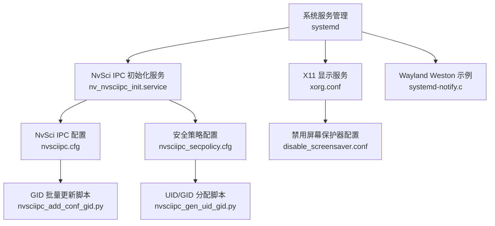
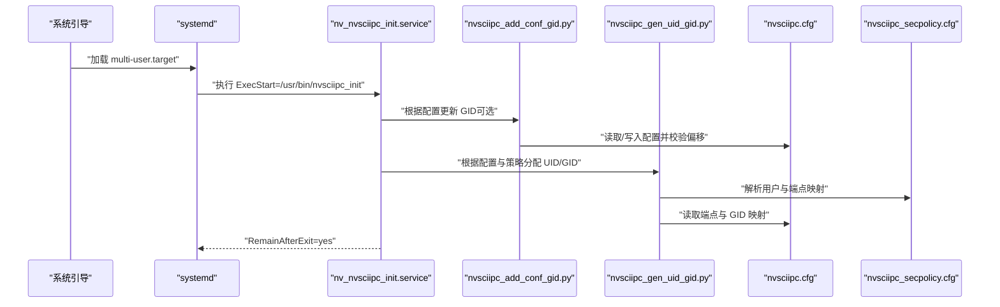
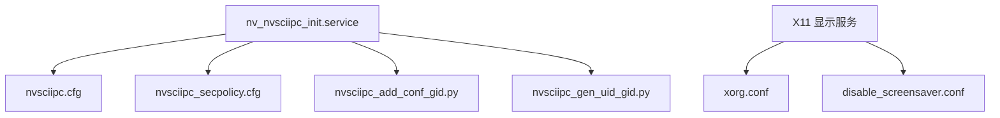

# 服务管理

<cite>
**本文引用的文件**
- [driveos-6.0.6.0/etc/nv_nvsciipc_init.service](file://driveos-6.0.6.0/etc/nv_nvsciipc_init.service)
- [driveos-6.0.6.0/etc/nvsciipc.cfg](file://driveos-6.0.6.0/etc/nvsciipc.cfg)
- [driveos-6.0.6.0/etc/nvsciipc_secpolicy.cfg](file://driveos-6.0.6.0/etc/nvsciipc_secpolicy.cfg)
- [driveos-6.0.6.0/usr/bin/nvsciipc_add_conf_gid.py](file://driveos-6.0.6.0/usr/bin/nvsciipc_add_conf_gid.py)
- [driveos-6.0.6.0/usr/bin/nvsciipc_gen_uid_gid.py](file://driveos-6.0.6.0/usr/bin/nvsciipc_gen_uid_gid.py)
- [driveos-6.0.6.0/drive-linux/filesystem/contents/config/x11/xorg.conf](file://driveos-6.0.6.0/drive-linux/filesystem/contents/config/x11/xorg.conf)
- [driveos-6.0.6.0/drive-linux/filesystem/contents/config/x11/disable_screensaver.conf](file://driveos-6.0.6.0/drive-linux/filesystem/contents/config/x11/disable_screensaver.conf)
- [driveos-6.0.6.0/drive-linux/samples/wayland/weston/compositor/systemd-notify.c](file://driveos-6.0.6.0/drive-linux/samples/wayland/weston/compositor/systemd-notify.c)
</cite>

## 目录
1. [简介](#简介)
2. [项目结构](#项目结构)
3. [核心组件](#核心组件)
4. [架构总览](#架构总览)
5. [详细组件分析](#详细组件分析)
6. [依赖关系分析](#依赖关系分析)
7. [性能考虑](#性能考虑)
8. [故障排查指南](#故障排查指南)
9. [结论](#结论)
10. [附录](#附录)

## 简介
本指南围绕 DriveOS 的服务管理展开，重点覆盖以下方面：
- 系统服务的启动、停止、重启与状态查询方法（基于 systemd）。
- NvSci IPC 初始化服务的配置与管理，包括 systemd 服务配置文件与配置文件的生成与更新流程。
- X11 显示服务的配置，包括如何禁用屏幕保护器等显示相关设置。
- 服务日志查看与故障诊断方法。
- 服务自动启动配置与依赖关系管理。
- 服务监控与健康检查的实现思路。
- 常见服务问题的排查与解决方案。

## 项目结构
本仓库包含多个版本的 DriveOS 发行包，其中与服务管理直接相关的内容主要集中在：
- 配置与脚本：位于各版本目录下的 etc 与 usr/bin。
- X11 配置：位于 drive-linux/filesystem/contents/config/x11。
- Wayland 示例：位于 drive-linux/samples/wayland/weston，包含与 systemd 通知相关的示例。

**图示来源**
- [driveos-6.0.6.0/etc/nv_nvsciipc_init.service:1-21](file://driveos-6.0.6.0/etc/nv_nvsciipc_init.service#L1-L21)
- [driveos-6.0.6.0/etc/nvsciipc.cfg:1-95](file://driveos-6.0.6.0/etc/nvsciipc.cfg#L1-L95)
- [driveos-6.0.6.0/etc/nvsciipc_secpolicy.cfg:1-37](file://driveos-6.0.6.0/etc/nvsciipc_secpolicy.cfg#L1-L37)
- [driveos-6.0.6.0/usr/bin/nvsciipc_add_conf_gid.py:1-225](file://driveos-6.0.6.0/usr/bin/nvsciipc_add_conf_gid.py#L1-L225)
- [driveos-6.0.6.0/usr/bin/nvsciipc_gen_uid_gid.py:1-261](file://driveos-6.0.6.0/usr/bin/nvsciipc_gen_uid_gid.py#L1-L261)
- [driveos-6.0.6.0/drive-linux/filesystem/contents/config/x11/xorg.conf](file://driveos-6.0.6.0/drive-linux/filesystem/contents/config/x11/xorg.conf)
- [driveos-6.0.6.0/drive-linux/filesystem/contents/config/x11/disable_screensaver.conf](file://driveos-6.0.6.0/drive-linux/filesystem/contents/config/x11/disable_screensaver.conf)
- [driveos-6.0.6.0/drive-linux/samples/wayland/weston/compositor/systemd-notify.c](file://driveos-6.0.6.0/drive-linux/samples/wayland/weston/compositor/systemd-notify.c)

**章节来源**
- [driveos-6.0.6.0/etc/nv_nvsciipc_init.service:1-21](file://driveos-6.0.6.0/etc/nv_nvsciipc_init.service#L1-L21)
- [driveos-6.0.6.0/etc/nvsciipc.cfg:1-95](file://driveos-6.0.6.0/etc/nvsciipc.cfg#L1-L95)
- [driveos-6.0.6.0/etc/nvsciipc_secpolicy.cfg:1-37](file://driveos-6.0.6.0/etc/nvsciipc_secpolicy.cfg#L1-L37)
- [driveos-6.0.6.0/usr/bin/nvsciipc_add_conf_gid.py:1-225](file://driveos-6.0.6.0/usr/bin/nvsciipc_add_conf_gid.py#L1-L225)
- [driveos-6.0.6.0/usr/bin/nvsciipc_gen_uid_gid.py:1-261](file://driveos-6.0.6.0/usr/bin/nvsciipc_gen_uid_gid.py#L1-L261)
- [driveos-6.0.6.0/drive-linux/filesystem/contents/config/x11/xorg.conf](file://driveos-6.0.6.0/drive-linux/filesystem/contents/config/x11/xorg.conf)
- [driveos-6.0.6.0/drive-linux/filesystem/contents/config/x11/disable_screensaver.conf](file://driveos-6.0.6.0/drive-linux/filesystem/contents/config/x11/disable_screensaver.conf)

## 核心组件
- NvSci IPC 初始化服务：通过 systemd 在系统引导阶段执行一次性的初始化任务，确保 IPC 端点与组权限正确建立。
- NvSci IPC 配置文件：定义不同后端类型（进程间、线程间、跨虚拟机、芯片到芯片）的端点、帧参数与 GID。
- 安全策略配置文件：将用户 ID 与特定端点进行映射，控制访问权限。
- GID 批量更新脚本：为配置文件中的端点批量添加或更新 GID，并校验偏移范围。
- UID/GID 分配脚本：从配置与安全策略中读取端点与用户映射，向系统组与用户分配相应的 GID/UID。
- X11 显示配置：包含基础显示配置与禁用屏幕保护器的设置。
- Wayland Weston 示例：展示如何在 Wayland 环境下使用 systemd 通知机制。

**章节来源**
- [driveos-6.0.6.0/etc/nv_nvsciipc_init.service:9-21](file://driveos-6.0.6.0/etc/nv_nvsciipc_init.service#L9-L21)
- [driveos-6.0.6.0/etc/nvsciipc.cfg:36-42](file://driveos-6.0.6.0/etc/nvsciipc.cfg#L36-L42)
- [driveos-6.0.6.0/etc/nvsciipc_secpolicy.cfg:6-14](file://driveos-6.0.6.0/etc/nvsciipc_secpolicy.cfg#L6-L14)
- [driveos-6.0.6.0/usr/bin/nvsciipc_add_conf_gid.py:47-64](file://driveos-6.0.6.0/usr/bin/nvsciipc_add_conf_gid.py#L47-L64)
- [driveos-6.0.6.0/usr/bin/nvsciipc_gen_uid_gid.py:48-86](file://driveos-6.0.6.0/usr/bin/nvsciipc_gen_uid_gid.py#L48-L86)
- [driveos-6.0.6.0/drive-linux/filesystem/contents/config/x11/xorg.conf](file://driveos-6.0.6.0/drive-linux/filesystem/contents/config/x11/xorg.conf)
- [driveos-6.0.6.0/drive-linux/filesystem/contents/config/x11/disable_screensaver.conf](file://driveos-6.0.6.0/drive-linux/filesystem/contents/config/x11/disable_screensaver.conf)

## 架构总览
下图展示了 NvSci IPC 初始化服务在系统启动时的调用链与配置文件之间的关系：

**图示来源**
- [driveos-6.0.6.0/etc/nv_nvsciipc_init.service:14-18](file://driveos-6.0.6.0/etc/nv_nvsciipc_init.service#L14-L18)
- [driveos-6.0.6.0/usr/bin/nvsciipc_add_conf_gid.py:213-221](file://driveos-6.0.6.0/usr/bin/nvsciipc_add_conf_gid.py#L213-L221)
- [driveos-6.0.6.0/usr/bin/nvsciipc_gen_uid_gid.py:241-257](file://driveos-6.0.6.0/usr/bin/nvsciipc_gen_uid_gid.py#L241-L257)
- [driveos-6.0.6.0/etc/nvsciipc.cfg:42-42](file://driveos-6.0.6.0/etc/nvsciipc.cfg#L42-L42)
- [driveos-6.0.6.0/etc/nvsciipc_secpolicy.cfg:6-14](file://driveos-6.0.6.0/etc/nvsciipc_secpolicy.cfg#L6-L14)

## 详细组件分析

### NvSci IPC 初始化服务（systemd）
- 作用：在系统引导完成后以一次性任务方式运行，负责初始化 NvSci IPC 相关的端点与权限。
- 关键字段：
  - [Unit] 段：描述服务用途，声明在 sysinit.target 后启动。
  - [Service] 段：以 root 用户运行，执行路径指向 /usr/bin/nvsciipc_init；类型为 oneshot，退出后保持活跃。
  - [Install] 段：安装到 multi-user.target，随系统进入多用户模式而启用。
- 管理命令（示例）：
  - 启动：sudo systemctl start nv_nvsciipc_init.service
  - 停止：sudo systemctl stop nv_nvsciipc_init.service
  - 重启：sudo systemctl restart nv_nvsciipc_init.service
  - 状态：sudo systemctl status nv_nvsciipc_init.service
  - 日志：journalctl -u nv_nvsciipc_init.service -n 100

**章节来源**
- [driveos-6.0.6.0/etc/nv_nvsciipc_init.service:9-21](file://driveos-6.0.6.0/etc/nv_nvsciipc_init.service#L9-L21)

### NvSci IPC 配置文件（nvsciipc.cfg）
- 作用：定义不同后端类型的端点、传输参数与 GID。支持的后端类型包括 INTER_THREAD、INTER_PROCESS、INTER_VM、INTER_CHIP。
- 关键要点：
  - 配置版本：通过注释行包含 CFGVER:1。
  - GID 基准偏移：进程内/线程间默认从 30000 起始，芯片到芯片从 36000 起始；可通过脚本调整。
  - 支持 include 子配置文件，便于模块化管理。
- 使用建议：
  - 修改前备份原配置。
  - 使用 nvsciipc_add_conf_gid.py 批量更新 GID 并校验偏移范围。

**章节来源**
- [driveos-6.0.6.0/etc/nvsciipc.cfg:42-42](file://driveos-6.0.6.0/etc/nvsciipc.cfg#L42-L42)
- [driveos-6.0.6.0/etc/nvsciipc.cfg:36-42](file://driveos-6.0.6.0/etc/nvsciipc.cfg#L36-L42)
- [driveos-6.0.6.0/etc/nvsciipc.cfg:20-34](file://driveos-6.0.6.0/etc/nvsciipc.cfg#L20-L34)

### 安全策略配置文件（nvsciipc_secpolicy.cfg）
- 作用：将用户 ID 与一组端点关联，用于基于 DAC 的访问控制。
- 关键要点：
  - 格式：用户 ID:端点列表。
  - 限制：单行最大长度 4096 字节；可通过换行分段。
  - 可通过 useradd -M -N 创建无家目录与无组的用户，再由脚本分配 GID。
- 使用建议：
  - 先用脚本生成并分配 GID，再将用户加入相应 GID 组。

**章节来源**
- [driveos-6.0.6.0/etc/nvsciipc_secpolicy.cfg:6-14](file://driveos-6.0.6.0/etc/nvsciipc_secpolicy.cfg#L6-L14)
- [driveos-6.0.6.0/etc/nvsciipc_secpolicy.cfg:16-28](file://driveos-6.0.6.0/etc/nvsciipc_secpolicy.cfg#L16-L28)

### GID 批量更新脚本（nvsciipc_add_conf_gid.py）
- 功能：
  - 解析命令行参数，支持指定配置文件与三类 GID 基础偏移。
  - 读取配置文件（含 include 子文件），为 INTER_PROCESS/INTER_THREAD、INTER_VM、INTER_CHIP 类型的端点添加或替换 GID。
  - 校验偏移范围，防止覆盖。
- 使用场景：
  - 部署前统一调整 GID 偏移，避免冲突。
  - 与 nvsciipc.cfg 协同工作，确保 CFGVER:1 存在且有效。

**章节来源**
- [driveos-6.0.6.0/usr/bin/nvsciipc_add_conf_gid.py:65-106](file://driveos-6.0.6.0/usr/bin/nvsciipc_add_conf_gid.py#L65-L106)
- [driveos-6.0.6.0/usr/bin/nvsciipc_add_conf_gid.py:155-208](file://driveos-6.0.6.0/usr/bin/nvsciipc_add_conf_gid.py#L155-L208)
- [driveos-6.0.6.0/usr/bin/nvsciipc_add_conf_gid.py:213-221](file://driveos-6.0.6.0/usr/bin/nvsciipc_add_conf_gid.py#L213-L221)

### UID/GID 分配脚本（nvsciipc_gen_uid_gid.py）
- 功能：
  - 读取 nvsciipc.cfg 与 nvsciipc_secpolicy.cfg，构建端点到 GID、用户到端点的映射。
  - 可选择为系统添加组（groupadd -g），并将 GID 分配给对应用户（usermod -a -G）。
- 使用场景：
  - 在部署阶段完成用户与端点的权限绑定，确保运行时访问控制生效。

**章节来源**
- [driveos-6.0.6.0/usr/bin/nvsciipc_gen_uid_gid.py:94-157](file://driveos-6.0.6.0/usr/bin/nvsciipc_gen_uid_gid.py#L94-L157)
- [driveos-6.0.6.0/usr/bin/nvsciipc_gen_uid_gid.py:159-195](file://driveos-6.0.6.0/usr/bin/nvsciipc_gen_uid_gid.py#L159-L195)
- [driveos-6.0.6.0/usr/bin/nvsciipc_gen_uid_gid.py:197-218](file://driveos-6.0.6.0/usr/bin/nvsciipc_gen_uid_gid.py#L197-L218)
- [driveos-6.0.6.0/usr/bin/nvsciipc_gen_uid_gid.py:219-239](file://driveos-6.0.6.0/usr/bin/nvsciipc_gen_uid_gid.py#L219-L239)

### X11 显示服务配置（xorg.conf 与禁用屏幕保护器）
- xorg.conf：基础显示配置文件，用于定义输入/输出设备、驱动与显示模式等。
- disable_screensaver.conf：用于禁用屏幕保护器，适合无人值守或演示场景。
- 管理建议：
  - 将 xorg.conf 放置于系统 X11 配置目录，确保被 X 服务器加载。
  - 屏幕保护器禁用需结合系统电源管理策略，避免误触发。

**章节来源**
- [driveos-6.0.6.0/drive-linux/filesystem/contents/config/x11/xorg.conf](file://driveos-6.0.6.0/drive-linux/filesystem/contents/config/x11/xorg.conf)
- [driveos-6.0.6.0/drive-linux/filesystem/contents/config/x11/disable_screensaver.conf](file://driveos-6.0.6.0/drive-linux/filesystem/contents/config/x11/disable_screensaver.conf)

### Wayland 与 systemd 通知（systemd-notify.c）
- 说明：Wayland compositor 示例中展示了如何使用 systemd 通知机制报告启动状态，便于集成到 systemd 服务生命周期管理。
- 应用：可借鉴该模式在自研服务中上报 Ready/Reload/Stop 等状态，提升可观测性。

**章节来源**
- [driveos-6.0.6.0/drive-linux/samples/wayland/weston/compositor/systemd-notify.c](file://driveos-6.0.6.0/drive-linux/samples/wayland/weston/compositor/systemd-notify.c)

## 依赖关系分析
- NvSci IPC 初始化服务依赖于：
  - systemd（作为服务管理器）。
  - nvsciipc.cfg 与 nvsciipc_secpolicy.cfg（作为配置源）。
  - nvsciipc_add_conf_gid.py 与 nvsciipc_gen_uid_gid.py（作为配置与权限自动化工具）。
- X11 服务依赖于：
  - xorg.conf 与 disable_screensaver.conf。
  - 系统显示堆栈（X 服务器、显示驱动、电源管理）。

**图示来源**
- [driveos-6.0.6.0/etc/nv_nvsciipc_init.service:14-18](file://driveos-6.0.6.0/etc/nv_nvsciipc_init.service#L14-L18)
- [driveos-6.0.6.0/etc/nvsciipc.cfg:42-42](file://driveos-6.0.6.0/etc/nvsciipc.cfg#L42-L42)
- [driveos-6.0.6.0/etc/nvsciipc_secpolicy.cfg:6-14](file://driveos-6.0.6.0/etc/nvsciipc_secpolicy.cfg#L6-L14)
- [driveos-6.0.6.0/usr/bin/nvsciipc_add_conf_gid.py:107-129](file://driveos-6.0.6.0/usr/bin/nvsciipc_add_conf_gid.py#L107-L129)
- [driveos-6.0.6.0/usr/bin/nvsciipc_gen_uid_gid.py:94-157](file://driveos-6.0.6.0/usr/bin/nvsciipc_gen_uid_gid.py#L94-L157)
- [driveos-6.0.6.0/drive-linux/filesystem/contents/config/x11/xorg.conf](file://driveos-6.0.6.0/drive-linux/filesystem/contents/config/x11/xorg.conf)
- [driveos-6.0.6.0/drive-linux/filesystem/contents/config/x11/disable_screensaver.conf](file://driveos-6.0.6.0/drive-linux/filesystem/contents/config/x11/disable_screensaver.conf)

## 性能考虑
- NvSci IPC 配置文件规模与 include 子文件数量会影响初始化时间，建议：
  - 合理拆分子配置，减少单次扫描与写入开销。
  - 使用 nvsciipc_add_conf_gid.py 批量更新时，避免频繁重复执行。
- X11 屏幕保护器禁用仅影响电源管理行为，对性能影响有限；但需注意与系统节能策略的协调。

## 故障排查指南
- NvSci IPC 初始化失败
  - 检查服务状态与日志：journalctl -u nv_nvsciipc_init.service -n 100
  - 核对 nvsciipc.cfg 是否存在 CFGVER:1 注释行，且格式正确。
  - 使用 nvsciipc_add_conf_gid.py 校验 GID 偏移是否越界。
  - 使用 nvsciipc_gen_uid_gid.py 检查用户与端点映射是否匹配。
- 权限不足或访问被拒
  - 确认用户已加入对应 GID 组（由脚本分配）。
  - 检查 nvsciipc_secpolicy.cfg 中用户与端点映射是否正确。
- X11 显示异常
  - 检查 xorg.conf 是否被 X 服务器加载。
  - 确认 disable_screensaver.conf 已生效，且未与其他电源管理策略冲突。
- Wayland 服务状态上报
  - 参考 systemd-notify.c 示例，在服务启动过程中发送 Ready/Reload/Stop 等通知，便于 systemd 跟踪。

**章节来源**
- [driveos-6.0.6.0/etc/nv_nvsciipc_init.service:14-18](file://driveos-6.0.6.0/etc/nv_nvsciipc_init.service#L14-L18)
- [driveos-6.0.6.0/etc/nvsciipc.cfg:138-153](file://driveos-6.0.6.0/etc/nvsciipc.cfg#L138-L153)
- [driveos-6.0.6.0/etc/nvsciipc_secpolicy.cfg:16-28](file://driveos-6.0.6.0/etc/nvsciipc_secpolicy.cfg#L16-L28)
- [driveos-6.0.6.0/usr/bin/nvsciipc_add_conf_gid.py:47-64](file://driveos-6.0.6.0/usr/bin/nvsciipc_add_conf_gid.py#L47-L64)
- [driveos-6.0.6.0/usr/bin/nvsciipc_gen_uid_gid.py:197-218](file://driveos-6.0.6.0/usr/bin/nvsciipc_gen_uid_gid.py#L197-L218)
- [driveos-6.0.6.0/drive-linux/filesystem/contents/config/x11/xorg.conf](file://driveos-6.0.6.0/drive-linux/filesystem/contents/config/x11/xorg.conf)
- [driveos-6.0.6.0/drive-linux/filesystem/contents/config/x11/disable_screensaver.conf](file://driveos-6.0.6.0/drive-linux/filesystem/contents/config/x11/disable_screensaver.conf)
- [driveos-6.0.6.0/drive-linux/samples/wayland/weston/compositor/systemd-notify.c](file://driveos-6.0.6.0/drive-linux/samples/wayland/weston/compositor/systemd-notify.c)

## 结论
本指南提供了 DriveOS 下服务管理的完整实践路径，涵盖 NvSci IPC 初始化服务的配置与自动化脚本、X11 显示服务的配置与屏幕保护器禁用、以及基于 systemd 的服务生命周期管理与故障排查方法。通过合理使用这些工具与配置，可以稳定地实现服务的自动启动、权限控制与可观测性增强。

## 附录
- 服务管理命令（示例）
  - 启动：sudo systemctl start 服务名
  - 停止：sudo systemctl stop 服务名
  - 重启：sudo systemctl restart 服务名
  - 查看状态：sudo systemctl status 服务名
  - 查看日志：journalctl -u 服务名 -n 行数
- 常用文件路径参考
  - NvSci IPC 初始化服务：/etc/systemd/system/nv_nvsciipc_init.service
  - NvSci IPC 配置：/etc/nvsciipc.cfg
  - 安全策略：/etc/nvsciipc_secpolicy.cfg
  - X11 配置：/usr/share/X11/xorg.conf 或 /etc/X11/xorg.conf
  - 屏幕保护器禁用：/etc/X11/xinitrc 或会话配置目录