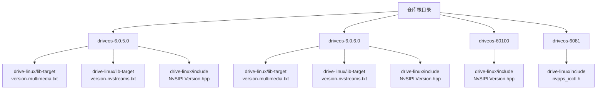
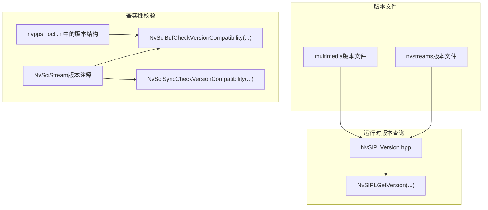
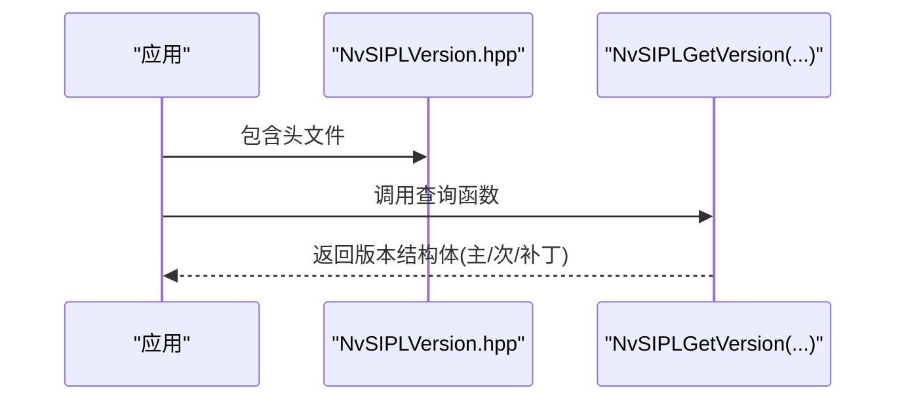
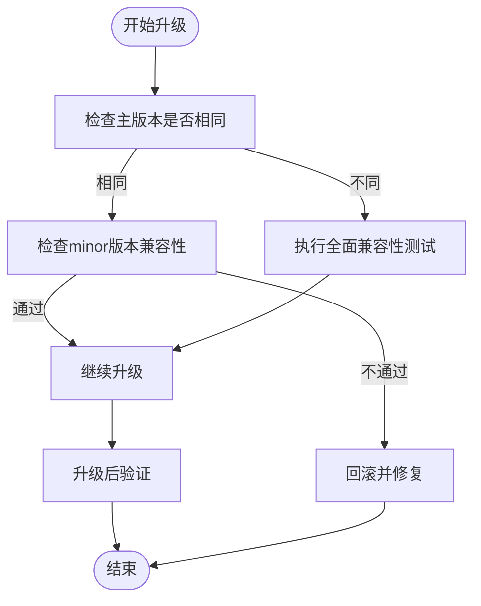
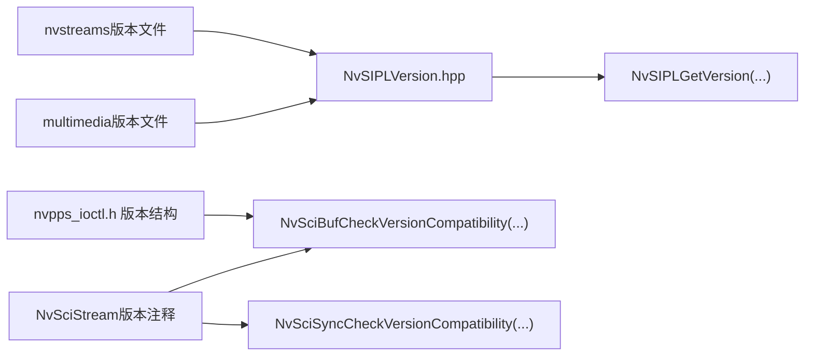

# 版本管理与升级

<cite>
**本文引用的文件**
- [README.md](file://README.md)
- [version-multimedia.txt（6.0.5.0）](file://driveos-6.0.5.0/drive-linux/lib-target/version-multimedia.txt)
- [version-nvstreams.txt（6.0.5.0）](file://driveos-6.0.5.0/drive-linux/lib-target/version-nvstreams.txt)
- [version-multimedia.txt（6.0.6.0）](file://driveos-6.0.6.0/drive-linux/lib-target/version-multimedia.txt)
- [version-nvstreams.txt（6.0.6.0）](file://driveos-6.0.6.0/drive-linux/lib-target/version-nvstreams.txt)
- [NvSIPLVersion.hpp（6.0.5.0）](file://driveos-6.0.5.0/drive-linux/include/NvSIPLVersion.hpp)
- [NvSIPLVersion.hpp（6.0.6.0）](file://driveos-6.0.6.0/drive-linux/include/NvSIPLVersion.hpp)
- [NvSIPLVersion.hpp（60100）](file://driveos-60100/drive-linux/include/NvSIPLVersion.hpp)
- [nvscistream_types.h（6.0.6.0）](file://driveos-6.0.6.0/usr/include/nvscistream_types.h)
- [nvscibuf.h（6.0.6.0）](file://driveos-6.0.6.0/drive-linux/include/nvscibuf.h)
- [nvscisync.h（60100）](file://driveos-60100/usr/include/nvscisync.h)
- [nvpps_ioctl.h（6081）](file://driveos-6081/drive-linux/include/nvpps_ioctl.h)
- [nvmedia_ofa_flow_test.c（6.0.6.0）](file://driveos-6.0.6.0/drive-linux/samples/nvmedia_6x/iofa/flow/nvmedia_ofa_flow_test.c)
- [cmdline.c（6081）](file://driveos-6081/drive-linux/samples/nvmedia_6x/iep/cmdline.c)
</cite>

## 目录
1. [引言](#引言)
2. [项目结构](#项目结构)
3. [核心组件](#核心组件)
4. [架构总览](#架构总览)
5. [详细组件分析](#详细组件分析)
6. [依赖关系分析](#依赖关系分析)
7. [性能考量](#性能考量)
8. [故障排查指南](#故障排查指南)
9. [结论](#结论)
10. [附录](#附录)

## 引言
本指南聚焦于DriveOS版本管理与升级流程，围绕multimedia与nvstreams两类版本文件展开，系统阐述版本格式、兼容性要求、升级路径、查询与验证方法、向后兼容与迁移策略、增量与全量升级差异、升级前后检查清单、回滚与故障恢复，以及最佳实践与注意事项。文中所有技术细节均基于仓库中实际文件与注释进行归纳总结。

## 项目结构
仓库包含多个DriveOS版本分支（如6.0.5.0、6.0.6.0、60100、6081），每个版本下包含驱动Linux层、用户态头文件、示例与测试等资源。multimedia与nvstreams的版本信息通常以独立文本文件形式存在，便于快速查询与自动化比对。

图表来源
- [README.md:1-128](file://README.md#L1-L128)
- [version-multimedia.txt（6.0.5.0）:1-2](file://driveos-6.0.5.0/drive-linux/lib-target/version-multimedia.txt#L1-L2)
- [version-nvstreams.txt（6.0.5.0）:1-2](file://driveos-6.0.5.0/drive-linux/lib-target/version-nvstreams.txt#L1-L2)
- [version-multimedia.txt（6.0.6.0）:1-2](file://driveos-6.0.6.0/drive-linux/lib-target/version-multimedia.txt#L1-L2)
- [version-nvstreams.txt（6.0.6.0）:1-2](file://driveos-6.0.6.0/drive-linux/lib-target/version-nvstreams.txt#L1-L2)
- [NvSIPLVersion.hpp（6.0.5.0）:1-61](file://driveos-6.0.5.0/drive-linux/include/NvSIPLVersion.hpp#L1-L61)
- [NvSIPLVersion.hpp（6.0.6.0）:1-61](file://driveos-6.0.6.0/drive-linux/include/NvSIPLVersion.hpp#L1-L61)
- [NvSIPLVersion.hpp（60100）:1-63](file://driveos-60100/drive-linux/include/NvSIPLVersion.hpp#L1-L63)
- [nvpps_ioctl.h（6081）:1-67](file://driveos-6081/drive-linux/include/nvpps_ioctl.h#L1-L67)

章节来源
- [README.md:1-128](file://README.md#L1-L128)

## 核心组件
- 版本文件
  - multimedia版本：位于各版本目录下的“lib-target/version-multimedia.txt”，记录multimedia子系统的版本标识。
  - nvstreams版本：位于各版本目录下的“lib-target/version-nvstreams.txt”，记录nvstreams子系统的版本标识。
- 版本头文件
  - NvSIPLVersion.hpp：提供NvSIPL库的版本结构体与查询接口，用于运行时获取版本信息。
- 兼容性接口
  - NvSciStream数据类型注释：明确major/minor版本兼容策略与演进规则。
  - NvSciBuf/NvSciSync版本兼容检查函数：用于运行时校验库版本兼容性。
- 设备/内核接口
  - nvpps_ioctl.h：定义设备侧版本结构与API版本字段，用于内核/设备交互的版本一致性校验。

章节来源
- [version-multimedia.txt（6.0.5.0）:1-2](file://driveos-6.0.5.0/drive-linux/lib-target/version-multimedia.txt#L1-L2)
- [version-nvstreams.txt（6.0.5.0）:1-2](file://driveos-6.0.5.0/drive-linux/lib-target/version-nvstreams.txt#L1-L2)
- [version-multimedia.txt（6.0.6.0）:1-2](file://driveos-6.0.6.0/drive-linux/lib-target/version-multimedia.txt#L1-L2)
- [version-nvstreams.txt（6.0.6.0）:1-2](file://driveos-6.0.6.0/drive-linux/lib-target/version-nvstreams.txt#L1-L2)
- [NvSIPLVersion.hpp（6.0.5.0）:1-61](file://driveos-6.0.5.0/drive-linux/include/NvSIPLVersion.hpp#L1-L61)
- [NvSIPLVersion.hpp（6.0.6.0）:1-61](file://driveos-6.0.6.0/drive-linux/include/NvSIPLVersion.hpp#L1-L61)
- [NvSIPLVersion.hpp（60100）:1-63](file://driveos-60100/drive-linux/include/NvSIPLVersion.hpp#L1-L63)
- [nvscistream_types.h（6.0.6.0）:42-74](file://driveos-6.0.6.0/usr/include/nvscistream_types.h#L42-L74)
- [nvscibuf.h（6.0.6.0）:5204-5270](file://driveos-6.0.6.0/drive-linux/include/nvscibuf.h#L5204-L5270)
- [nvscisync.h（60100）:3027-3066](file://driveos-60100/usr/include/nvscisync.h#L3027-L3066)
- [nvpps_ioctl.h（6081）:23-37](file://driveos-6081/drive-linux/include/nvpps_ioctl.h#L23-L37)

## 架构总览
下图展示版本文件、头文件与兼容性接口之间的关系，以及它们在升级过程中的作用。

图表来源
- [version-multimedia.txt（6.0.5.0）:1-2](file://driveos-6.0.5.0/drive-linux/lib-target/version-multimedia.txt#L1-L2)
- [version-nvstreams.txt（6.0.5.0）:1-2](file://driveos-6.0.5.0/drive-linux/lib-target/version-nvstreams.txt#L1-L2)
- [NvSIPLVersion.hpp（6.0.5.0）:1-61](file://driveos-6.0.5.0/drive-linux/include/NvSIPLVersion.hpp#L1-L61)
- [nvscistream_types.h（6.0.6.0）:42-74](file://driveos-6.0.6.0/usr/include/nvscistream_types.h#L42-L74)
- [nvscibuf.h（6.0.6.0）:5204-5270](file://driveos-6.0.6.0/drive-linux/include/nvscibuf.h#L5204-L5270)
- [nvscisync.h（60100）:3027-3066](file://driveos-60100/usr/include/nvscisync.h#L3027-L3066)
- [nvpps_ioctl.h（6081）:23-37](file://driveos-6081/drive-linux/include/nvpps_ioctl.h#L23-L37)

## 详细组件分析

### 版本文件格式与内容
- multimedia版本文件
  - 位置：各版本目录下的“lib-target/version-multimedia.txt”。
  - 内容：单行版本字符串，形如“主.次.修订-构建号”，例如“6.0.5.0-31732390”。
- nvstreams版本文件
  - 位置：各版本目录下的“lib-target/version-nvstreams.txt”。
  - 内容：与multimedia版本文件一致的格式，便于统一管理与比对。

图表来源
- [version-multimedia.txt（6.0.5.0）:1-2](file://driveos-6.0.5.0/drive-linux/lib-target/version-multimedia.txt#L1-L2)
- [version-nvstreams.txt（6.0.5.0）:1-2](file://driveos-6.0.5.0/drive-linux/lib-target/version-nvstreams.txt#L1-L2)
- [version-multimedia.txt（6.0.6.0）:1-2](file://driveos-6.0.6.0/drive-linux/lib-target/version-multimedia.txt#L1-L2)
- [version-nvstreams.txt（6.0.6.0）:1-2](file://driveos-6.0.6.0/drive-linux/lib-target/version-nvstreams.txt#L1-L2)

章节来源
- [version-multimedia.txt（6.0.5.0）:1-2](file://driveos-6.0.5.0/drive-linux/lib-target/version-multimedia.txt#L1-L2)
- [version-nvstreams.txt（6.0.5.0）:1-2](file://driveos-6.0.5.0/drive-linux/lib-target/version-nvstreams.txt#L1-L2)
- [version-multimedia.txt（6.0.6.0）:1-2](file://driveos-6.0.6.0/drive-linux/lib-target/version-multimedia.txt#L1-L2)
- [version-nvstreams.txt（6.0.6.0）:1-2](file://driveos-6.0.6.0/drive-linux/lib-target/version-nvstreams.txt#L1-L2)

### 版本查询与验证
- 运行时查询NvSIPL版本
  - 使用NvSIPLVersion.hpp提供的结构体与查询函数，可在运行时获取NvSIPL库的主/次/补丁版本。
- 设备侧版本结构
  - nvpps_ioctl.h中定义了设备侧版本结构与API版本字段，可用于设备/内核交互前的版本一致性校验。

图表来源
- [NvSIPLVersion.hpp（6.0.5.0）:1-61](file://driveos-6.0.5.0/drive-linux/include/NvSIPLVersion.hpp#L1-L61)
- [NvSIPLVersion.hpp（6.0.6.0）:1-61](file://driveos-6.0.6.0/drive-linux/include/NvSIPLVersion.hpp#L1-L61)
- [NvSIPLVersion.hpp（60100）:1-63](file://driveos-60100/drive-linux/include/NvSIPLVersion.hpp#L1-L63)
- [nvpps_ioctl.h（6081）:23-37](file://driveos-6081/drive-linux/include/nvpps_ioctl.h#L23-L37)

章节来源
- [NvSIPLVersion.hpp（6.0.5.0）:1-61](file://driveos-6.0.5.0/drive-linux/include/NvSIPLVersion.hpp#L1-L61)
- [NvSIPLVersion.hpp（6.0.6.0）:1-61](file://driveos-6.0.6.0/drive-linux/include/NvSIPLVersion.hpp#L1-L61)
- [NvSIPLVersion.hpp（60100）:1-63](file://driveos-60100/drive-linux/include/NvSIPLVersion.hpp#L1-L63)
- [nvpps_ioctl.h（6081）:23-37](file://driveos-6081/drive-linux/include/nvpps_ioctl.h#L23-L37)

### 兼容性要求与升级路径
- NvSciStream兼容性
  - 注释明确：同一主版本下，minor版本可向前兼容；不同minor版本间共享流需确保未使用低minor版本不支持的功能。
- NvSciBuf/NvSciSync兼容性
  - 提供版本兼容性检查函数，用于在初始化阶段校验加载库与编译期期望的版本是否匹配。
- 升级路径建议
  - 同主版本内升级：优先选择同主版本内的次版本或修订版本，确保minor兼容性。
  - 不同主版本升级：需严格验证兼容性接口返回值与功能回归测试，必要时进行灰度发布。

图表来源
- [nvscistream_types.h（6.0.6.0）:42-74](file://driveos-6.0.6.0/usr/include/nvscistream_types.h#L42-L74)
- [nvscibuf.h（6.0.6.0）:5204-5270](file://driveos-6.0.6.0/drive-linux/include/nvscibuf.h#L5204-L5270)
- [nvscisync.h（60100）:3027-3066](file://driveos-60100/usr/include/nvscisync.h#L3027-L3066)

章节来源
- [nvscistream_types.h（6.0.6.0）:42-74](file://driveos-6.0.6.0/usr/include/nvscistream_types.h#L42-L74)
- [nvscibuf.h（6.0.6.0）:5204-5270](file://driveos-6.0.6.0/drive-linux/include/nvscibuf.h#L5204-L5270)
- [nvscisync.h（60100）:3027-3066](file://driveos-60100/usr/include/nvscisync.h#L3027-L3066)

### 增量升级与全量升级
- 增量升级
  - 适用于同主版本内的小版本更新，通常仅包含补丁与安全更新，风险较低。
  - 适合频繁发布与快速修复场景。
- 全量升级
  - 涉及主版本变更或重大功能调整，需要完整的兼容性验证与回归测试。
  - 建议采用灰度发布与监控策略，确保业务连续性。

章节来源
- [nvscistream_types.h（6.0.6.0）:42-74](file://driveos-6.0.6.0/usr/include/nvscistream_types.h#L42-L74)

### 升级前准备与升级后验证
- 升级前准备
  - 备份当前版本的multimedia与nvstreams版本文件。
  - 记录当前NvSIPL版本与设备侧版本信息。
  - 准备兼容性检查脚本，调用NvSciBuf/NvSciSync版本检查函数。
- 升级后验证
  - 对比版本文件与运行时查询结果，确保一致。
  - 执行关键功能测试，如媒体处理与流传输。
  - 验证CRC/校验流程（参考IOFA测试样例）以确保数据完整性。

章节来源
- [nvmedia_ofa_flow_test.c（6.0.6.0）:717-744](file://driveos-6.0.6.0/drive-linux/samples/nvmedia_6x/iofa/flow/nvmedia_ofa_flow_test.c#L717-L744)

### 回滚与故障恢复
- 回滚策略
  - 保留旧版本的版本文件与二进制包，确保可快速回退。
  - 在升级失败时，优先执行兼容性检查函数，确认库版本状态。
- 故障恢复
  - 结合样例中的错误日志与清理逻辑，确保异常状态下资源释放与状态重置。

章节来源
- [nvmedia_ofa_flow_test.c（6.0.6.0）:1879-1935](file://driveos-6.0.6.0/drive-linux/samples/nvmedia_6x/iofa/flow/nvmedia_ofa_flow_test.c#L1879-L1935)

### 最佳实践与注意事项
- 统一版本管理
  - multimedia与nvstreams版本应保持一致，避免交叉版本导致的兼容性问题。
- 版本演进策略
  - 严格遵循主/次/补丁语义，主版本变更需谨慎评估影响范围。
- 测试与验证
  - 升级前后均需执行兼容性检查与功能回归测试，CRC/校验流程作为数据完整性保障。
- 文档与追踪
  - 将版本文件与变更记录纳入版本控制系统，便于审计与追溯。

## 依赖关系分析
下图展示版本文件、头文件与兼容性接口之间的依赖关系，以及它们在升级过程中的耦合度。

图表来源
- [version-multimedia.txt（6.0.5.0）:1-2](file://driveos-6.0.5.0/drive-linux/lib-target/version-multimedia.txt#L1-L2)
- [version-nvstreams.txt（6.0.5.0）:1-2](file://driveos-6.0.5.0/drive-linux/lib-target/version-nvstreams.txt#L1-L2)
- [NvSIPLVersion.hpp（6.0.5.0）:1-61](file://driveos-6.0.5.0/drive-linux/include/NvSIPLVersion.hpp#L1-L61)
- [nvscistream_types.h（6.0.6.0）:42-74](file://driveos-6.0.6.0/usr/include/nvscistream_types.h#L42-L74)
- [nvscibuf.h（6.0.6.0）:5204-5270](file://driveos-6.0.6.0/drive-linux/include/nvscibuf.h#L5204-L5270)
- [nvscisync.h（60100）:3027-3066](file://driveos-60100/usr/include/nvscisync.h#L3027-L3066)
- [nvpps_ioctl.h（6081）:23-37](file://driveos-6081/drive-linux/include/nvpps_ioctl.h#L23-L37)

章节来源
- [version-multimedia.txt（6.0.5.0）:1-2](file://driveos-6.0.5.0/drive-linux/lib-target/version-multimedia.txt#L1-L2)
- [version-nvstreams.txt（6.0.5.0）:1-2](file://driveos-6.0.5.0/drive-linux/lib-target/version-nvstreams.txt#L1-L2)
- [NvSIPLVersion.hpp（6.0.5.0）:1-61](file://driveos-6.0.5.0/drive-linux/include/NvSIPLVersion.hpp#L1-L61)
- [nvscistream_types.h（6.0.6.0）:42-74](file://driveos-6.0.6.0/usr/include/nvscistream_types.h#L42-L74)
- [nvscibuf.h（6.0.6.0）:5204-5270](file://driveos-6.0.6.0/drive-linux/include/nvscibuf.h#L5204-L5270)
- [nvscisync.h（60100）:3027-3066](file://driveos-60100/usr/include/nvscisync.h#L3027-L3066)
- [nvpps_ioctl.h（6081）:23-37](file://driveos-6081/drive-linux/include/nvpps_ioctl.h#L23-L37)

## 性能考量
- 版本查询开销
  - 运行时版本查询为轻量操作，通常不会成为性能瓶颈。
- 兼容性检查
  - 初始化阶段的兼容性检查会引入少量开销，但能有效避免运行时兼容性问题带来的性能与稳定性风险。
- 数据完整性校验
  - IOFA测试样例中的CRC流程有助于早期发现数据异常，减少后续处理成本。

## 故障排查指南
- 版本不一致
  - 当multimedia与nvstreams版本不一致时，优先检查版本文件与运行时查询结果，确认是否存在打包遗漏或环境污染。
- 兼容性失败
  - 若兼容性检查返回不兼容，需核对主/次版本是否满足最小兼容要求，并评估是否需要降级或升级到目标主版本。
- 设备侧版本不匹配
  - 通过nvpps_ioctl.h中的版本结构核对设备侧版本，确保驱动与固件版本匹配。

章节来源
- [nvmedia_ofa_flow_test.c（6.0.6.0）:717-744](file://driveos-6.0.6.0/drive-linux/samples/nvmedia_6x/iofa/flow/nvmedia_ofa_flow_test.c#L717-L744)
- [nvscibuf.h（6.0.6.0）:5204-5270](file://driveos-6.0.6.0/drive-linux/include/nvscibuf.h#L5204-L5270)
- [nvscisync.h（60100）:3027-3066](file://driveos-60100/usr/include/nvscisync.h#L3027-L3066)
- [nvpps_ioctl.h（6081）:23-37](file://driveos-6081/drive-linux/include/nvpps_ioctl.h#L23-L37)

## 结论
通过规范化的版本文件管理、严格的兼容性检查与完善的升级前后验证流程，可以显著降低DriveOS升级过程中的风险。建议在生产环境中采用灰度发布与回滚预案，并结合CRC/校验流程确保数据完整性与功能正确性。

## 附录
- 示例命令与路径
  - 查看multimedia版本：参见“lib-target/version-multimedia.txt”。
  - 查看nvstreams版本：参见“lib-target/version-nvstreams.txt”。
  - 查询NvSIPL版本：参见“NvSIPLVersion.hpp”与“NvSIPLGetVersion(...)”。