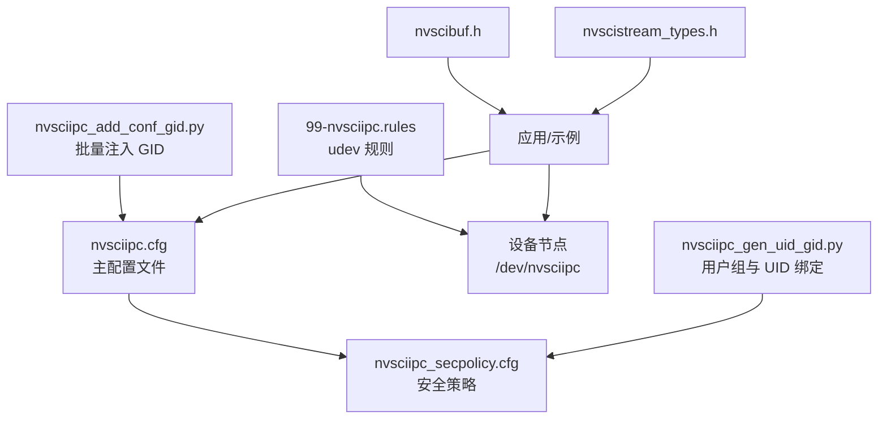
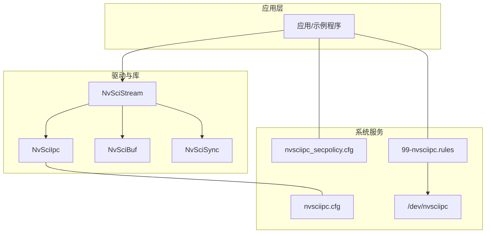
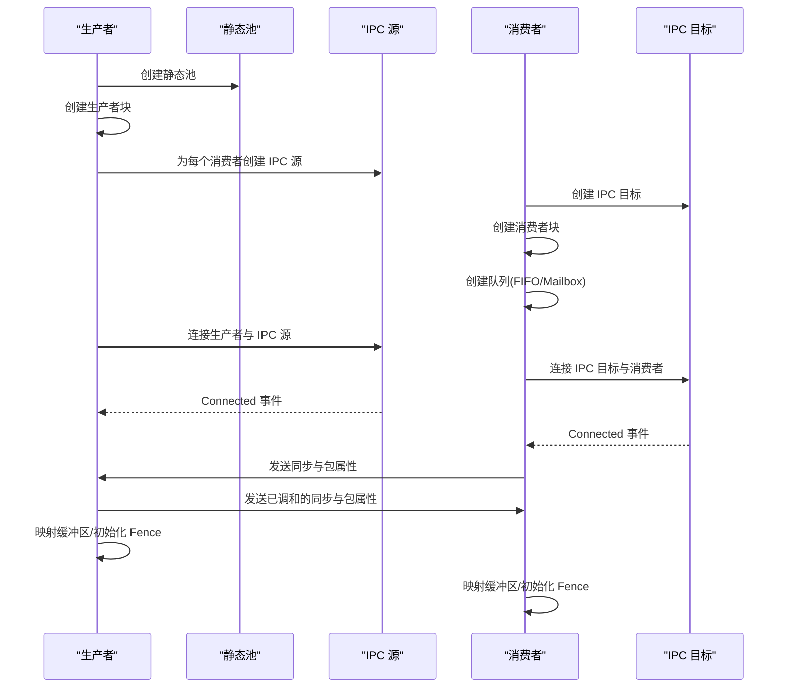
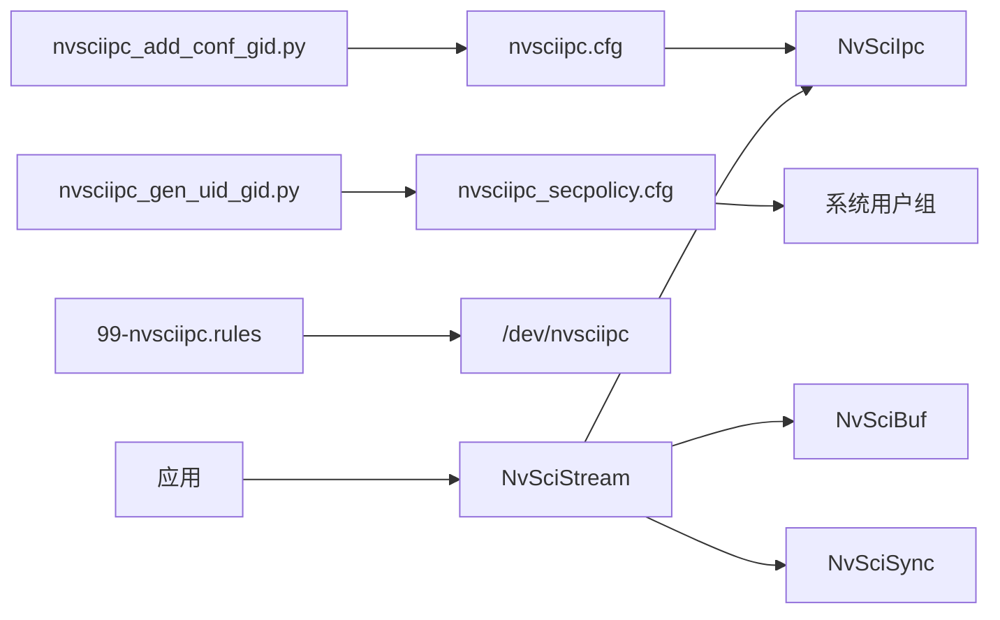

# 系统配置

<cite>
**本文引用的文件**   
- [nvsciipc.cfg（6.0.5.0）](file://driveos-6.0.5.0/etc/nvsciipc.cfg)
- [nvsciipc.cfg（6.0.6.0）](file://driveos-6.0.6.0/etc/nvsciipc.cfg)
- [nvsciipc.cfg（6081）](file://driveos-6081/etc/nvsciipc.cfg)
- [nvsciipc_secpolicy.cfg（6.0.6.0）](file://driveos-6.0.6.0/etc/nvsciipc_secpolicy.cfg)
- [99-nvsciipc.rules（6.0.6.0）](file://driveos-6.0.6.0/etc/99-nvsciipc.rules)
- [nvsciipc_add_conf_gid.py（6.0.6.0）](file://driveos-6.0.6.0/usr/bin/nvsciipc_add_conf_gid.py)
- [nvsciipc_gen_uid_gid.py（6.0.6.0）](file://driveos-6.0.6.0/usr/bin/nvsciipc_gen_uid_gid.py)
- [nvscibuf.h（6.0.6.0）](file://driveos-6.0.6.0/drive-linux/include/nvscibuf.h)
- [nvscistream_types.h（6.0.6.0）](file://driveos-6.0.6.0/usr/include/nvscistream_types.h)
- [channel_producer.cpp（5260）](file://driveos-5260/drive-linux/samples/nvsci/nvscistream/multicast/channel_producer.cpp)
- [channel_consumer.cpp（5260）](file://driveos-5260/drive-linux/samples/nvsci/nvscistream/multicast/channel_consumer.cpp)
</cite>

## 目录
1. [简介](#简介)
2. [项目结构](#项目结构)
3. [核心组件](#核心组件)
4. [架构总览](#架构总览)
5. [详细组件分析](#详细组件分析)
6. [依赖关系分析](#依赖关系分析)
7. [性能考虑](#性能考虑)
8. [故障排查指南](#故障排查指南)
9. [结论](#结论)
10. [附录](#附录)

## 简介
本指南面向在 DriveOS 上进行 NvSci IPC 配置与运维的工程师，聚焦于系统级配置文件的格式、字段语义、后端类型（INTER_PROCESS、INTER_THREAD、INTER_VM、INTER_CHIP）的配置方法，以及安全策略、权限管理、udev 规则与设备访问控制。同时提供多场景配置示例（单机多进程、跨虚拟机、跨芯片）、配置验证与故障排除流程，帮助快速搭建稳定可靠的 IPC 通信通道。

## 项目结构
与 NvSci IPC 配置直接相关的文件主要位于以下位置：
- 配置文件：驱动版本目录下的 etc 目录中包含主配置与安全策略配置
- 工具脚本：usr/bin 下提供 GID 批量注入与用户组分配工具
- 头文件：驱动版本目录下的 include/usr/include 中提供 IPC/Buffer/Sync 类型定义
- 示例代码：samples/nvsci 下的流式传输示例展示典型连接与资源映射流程

图表来源
- [nvsciipc.cfg（6.0.6.0）:42-95](file://driveos-6.0.6.0/etc/nvsciipc.cfg#L42-L95)
- [nvsciipc_secpolicy.cfg（6.0.6.0）:1-37](file://driveos-6.0.6.0/etc/nvsciipc_secpolicy.cfg#L1-L37)
- [99-nvsciipc.rules（6.0.6.0）:10-14](file://driveos-6.0.6.0/etc/99-nvsciipc.rules#L10-L14)
- [nvsciipc_add_conf_gid.py（6.0.6.0）:107-221](file://driveos-6.0.6.0/usr/bin/nvsciipc_add_conf_gid.py#L107-L221)
- [nvsciipc_gen_uid_gid.py（6.0.6.0）:94-258](file://driveos-6.0.6.0/usr/bin/nvsciipc_gen_uid_gid.py#L94-L258)
- [nvscibuf.h（6.0.6.0）:3000-3033](file://driveos-6.0.6.0/drive-linux/include/nvscibuf.h#L3000-L3033)
- [nvscistream_types.h（6.0.6.0）:1-40](file://driveos-6.0.6.0/usr/include/nvscistream_types.h#L1-L40)

章节来源
- [nvsciipc.cfg（6.0.6.0）:1-95](file://driveos-6.0.6.0/etc/nvsciipc.cfg#L1-L95)
- [nvsciipc.cfg（6.0.5.0）:1-81](file://driveos-6.0.5.0/etc/nvsciipc.cfg#L1-L81)
- [nvsciipc.cfg（6081）:1-95](file://driveos-6081/etc/nvsciipc.cfg#L1-L95)
- [nvsciipc_secpolicy.cfg（6.0.6.0）:1-37](file://driveos-6.0.6.0/etc/nvsciipc_secpolicy.cfg#L1-L37)
- [99-nvsciipc.rules（6.0.6.0）:1-14](file://driveos-6.0.6.0/etc/99-nvsciipc.rules#L1-L14)
- [nvsciipc_add_conf_gid.py（6.0.6.0）:1-225](file://driveos-6.0.6.0/usr/bin/nvsciipc_add_conf_gid.py#L1-L225)
- [nvsciipc_gen_uid_gid.py（6.0.6.0）:1-261](file://driveos-6.0.6.0/usr/bin/nvsciipc_gen_uid_gid.py#L1-L261)
- [nvscibuf.h（6.0.6.0）:3000-3033](file://driveos-6.0.6.0/drive-linux/include/nvscibuf.h#L3000-L3033)
- [nvscistream_types.h（6.0.6.0）:1-40](file://driveos-6.0.6.0/usr/include/nvscistream_types.h#L1-L40)

## 核心组件
- 主配置文件（nvsciipc.cfg）
  - 定义后端类型、端点名称、帧数、帧大小、可选 GID、可选设备信息等字段
  - 支持 INTER_PROCESS、INTER_THREAD、INTER_VM、INTER_CHIP 四类后端
  - 6.0.6.0 及更高版本引入 CFGVER:1 与 GID 字段，增强安全与可维护性
- 安全策略文件（nvsciipc_secpolicy.cfg）
  - 将用户 ID 与端点集合绑定，实现基于 DAC 的访问控制
- udev 规则（99-nvsciipc.rules）
  - 控制 /dev/nvsciipc 设备节点的访问模式与所属组
- 工具脚本
  - nvsciipc_add_conf_gid.py：为配置文件批量添加或更新 GID，并校验基偏移合法性
  - nvsciipc_gen_uid_gid.py：从配置与安全策略生成组并分配给用户

章节来源
- [nvsciipc.cfg（6.0.6.0）:42-95](file://driveos-6.0.6.0/etc/nvsciipc.cfg#L42-L95)
- [nvsciipc_secpolicy.cfg（6.0.6.0）:1-37](file://driveos-6.0.6.0/etc/nvsciipc_secpolicy.cfg#L1-L37)
- [99-nvsciipc.rules（6.0.6.0）:10-14](file://driveos-6.0.6.0/etc/99-nvsciipc.rules#L10-L14)
- [nvsciipc_add_conf_gid.py（6.0.6.0）:47-106](file://driveos-6.0.6.0/usr/bin/nvsciipc_add_conf_gid.py#L47-L106)
- [nvsciipc_gen_uid_gid.py（6.0.6.0）:48-93](file://driveos-6.0.6.0/usr/bin/nvsciipc_gen_uid_gid.py#L48-L93)

## 架构总览
下图展示了 NvSci IPC 在系统中的角色与交互：应用通过 NvSciStream/NvSciBuf/NvSciSync 与 IPC 端点建立连接，配置文件决定端点与后端类型，安全策略与 udev 规则保障访问控制，工具脚本辅助自动化配置与权限下发。

图表来源
- [nvscibuf.h（6.0.6.0）:3000-3033](file://driveos-6.0.6.0/drive-linux/include/nvscibuf.h#L3000-L3033)
- [nvscistream_types.h（6.0.6.0）:1-40](file://driveos-6.0.6.0/usr/include/nvscistream_types.h#L1-L40)
- [nvsciipc.cfg（6.0.6.0）:42-95](file://driveos-6.0.6.0/etc/nvsciipc.cfg#L42-L95)
- [nvsciipc_secpolicy.cfg（6.0.6.0）:1-37](file://driveos-6.0.6.0/etc/nvsciipc_secpolicy.cfg#L1-L37)
- [99-nvsciipc.rules（6.0.6.0）:10-14](file://driveos-6.0.6.0/etc/99-nvsciipc.rules#L10-L14)

## 详细组件分析

### 主配置文件字段与后端类型
- 后端类型
  - INTER_PROCESS：进程间 IPC，需要两个不同的端点名，后接“帧数”“帧大小”
  - INTER_THREAD：线程间 IPC，同样需要两个不同端点名，后接“帧数”“帧大小”
  - INTER_VM：跨虚拟机 IPC，后接“队列号”
  - INTER_CHIP：跨芯片 IPC，后接“传输角色+设备ID”，两位十进制组合
- 公共字段
  - 帧数（backend_info1）：缓冲池中数据包数量，影响吞吐与延迟
  - 帧大小（backend_info2）：单包字节数，影响内存占用与带宽
  - GID（可选，6.0.6.0+）：用于 DAC 访问控制，按后端类型有默认基偏移
  - 设备信息（INTER_CHIP）：传输角色与设备ID，两位十进制拼接
- 版本标记
  - CFGVER:1：启用 GID 注入与安全策略支持

章节来源
- [nvsciipc.cfg（6.0.5.0）:4-30](file://driveos-6.0.5.0/etc/nvsciipc.cfg#L4-L30)
- [nvsciipc.cfg（6.0.6.0）:4-42](file://driveos-6.0.6.0/etc/nvsciipc.cfg#L4-L42)
- [nvsciipc.cfg（6081）:4-42](file://driveos-6081/etc/nvsciipc.cfg#L4-L42)

### 安全策略与权限管理
- 用户到端点映射
  - 每行以“用户ID:端点列表”的形式定义，限制特定用户仅能访问指定端点
  - 支持分组与扩展，便于大规模部署
- 组与用户绑定
  - 使用 nvsciipc_gen_uid_gid.py 从安全策略读取用户与端点映射，自动生成组并分配给用户
- 设备节点访问
  - 通过 99-nvsciipc.rules 设置 /dev/nvsciipc 的 MODE 与 GROUP，实现最小权限访问

章节来源
- [nvsciipc_secpolicy.cfg（6.0.6.0）:6-37](file://driveos-6.0.6.0/etc/nvsciipc_secpolicy.cfg#L6-L37)
- [99-nvsciipc.rules（6.0.6.0）:10-14](file://driveos-6.0.6.0/etc/99-nvsciipc.rules#L10-L14)
- [nvsciipc_gen_uid_gid.py（6.0.6.0）:159-258](file://driveos-6.0.6.0/usr/bin/nvsciipc_gen_uid_gid.py#L159-L258)

### udev 规则与设备访问
- 两种模式
  - 全员可读写：MODE="0666"，GROUP="nvsciipc"
  - 仅组内可读写：MODE="0660"，GROUP="nvsciipc"
- 建议
  - 生产环境优先使用组内可读写模式，结合安全策略与用户组分配，确保最小权限

章节来源
- [99-nvsciipc.rules（6.0.6.0）:10-14](file://driveos-6.0.6.0/etc/99-nvsciipc.rules#L10-L14)

### 工具链：GID 注入与用户组分配
- nvsciipc_add_conf_gid.py
  - 功能：为配置文件批量添加/更新 GID；校验基偏移顺序（INTRA_VM < INTER_VM < C2C）
  - 流程：解析命令行 -> 读取配置文件（含 include）-> 写回更新后的 GID
- nvsciipc_gen_uid_gid.py
  - 功能：从配置与安全策略生成组并分配给用户
  - 流程：读取配置（CFGVER>=1）与安全策略 -> 生成组 -> 分配用户组

章节来源
- [nvsciipc_add_conf_gid.py（6.0.6.0）:47-221](file://driveos-6.0.6.0/usr/bin/nvsciipc_add_conf_gid.py#L47-L221)
- [nvsciipc_gen_uid_gid.py（6.0.6.0）:94-258](file://driveos-6.0.6.0/usr/bin/nvsciipc_gen_uid_gid.py#L94-L258)

### 示例：NvSciStream 连接与资源映射
- 生产者侧
  - 创建静态池、生产者块、IPC 源块，连接多播或单播路径，等待消费者连接事件
  - 接收消费者同步对象与包属性，映射缓冲区并注册元素
- 消费者侧
  - 创建队列（FIFO 或 Mailbox）、消费者块、IPC 目标块，连接并等待事件
  - 发送自身同步与包属性，接收并映射资源，进入流式处理阶段

图表来源
- [channel_producer.cpp（5260）:90-127](file://driveos-5260/drive-linux/samples/nvsci/nvscistream/multicast/channel_producer.cpp#L90-L127)
- [channel_consumer.cpp（5260）:75-99](file://driveos-5260/drive-linux/samples/nvsci/nvscistream/multicast/channel_consumer.cpp#L75-L99)

章节来源
- [channel_producer.cpp（5260）:62-127](file://driveos-5260/drive-linux/samples/nvsci/nvscistream/multicast/channel_producer.cpp#L62-L127)
- [channel_consumer.cpp（5260）:51-99](file://driveos-5260/drive-linux/samples/nvsci/nvscistream/multicast/channel_consumer.cpp#L51-L99)

## 依赖关系分析
- 配置到运行时依赖
  - nvsciipc.cfg 决定端点与后端类型，驱动根据配置创建 IPC 端点
  - 安全策略与 udev 规则共同决定进程对设备节点的访问权限
- 应用到库依赖
  - 应用通过 NvSciStream/NvSciBuf/NvSciSync 与 IPC 端点交互，底层由驱动实现
- 工具到配置依赖
  - 工具脚本读取配置与安全策略，生成组与用户映射，再写回系统

图表来源
- [nvsciipc.cfg（6.0.6.0）:42-95](file://driveos-6.0.6.0/etc/nvsciipc.cfg#L42-L95)
- [nvsciipc_secpolicy.cfg（6.0.6.0）:1-37](file://driveos-6.0.6.0/etc/nvsciipc_secpolicy.cfg#L1-L37)
- [99-nvsciipc.rules（6.0.6.0）:10-14](file://driveos-6.0.6.0/etc/99-nvsciipc.rules#L10-L14)
- [nvscibuf.h（6.0.6.0）:3000-3033](file://driveos-6.0.6.0/drive-linux/include/nvscibuf.h#L3000-L3033)
- [nvscistream_types.h（6.0.6.0）:1-40](file://driveos-6.0.6.0/usr/include/nvscistream_types.h#L1-L40)

章节来源
- [nvsciipc.cfg（6.0.6.0）:42-95](file://driveos-6.0.6.0/etc/nvsciipc.cfg#L42-L95)
- [nvsciipc_secpolicy.cfg（6.0.6.0）:1-37](file://driveos-6.0.6.0/etc/nvsciipc_secpolicy.cfg#L1-L37)
- [99-nvsciipc.rules（6.0.6.0）:10-14](file://driveos-6.0.6.0/etc/99-nvsciipc.rules#L10-L14)
- [nvscibuf.h（6.0.6.0）:3000-3033](file://driveos-6.0.6.0/drive-linux/include/nvscibuf.h#L3000-L3033)
- [nvscistream_types.h（6.0.6.0）:1-40](file://driveos-6.0.6.0/usr/include/nvscistream_types.h#L1-L40)

## 性能考虑
- 帧数与帧大小
  - 增大帧数可提升吞吐但增加延迟与内存占用；增大帧大小可减少系统调用次数，但会放大尾延迟
  - 建议根据业务峰值带宽与延迟预算折中选择
- 后端类型选择
  - 同机多进程/线程：INTER_PROCESS/INTER_THREAD，避免跨机/跨虚拟机开销
  - 跨虚拟机：INTER_VM，注意队列号与调度开销
  - 跨芯片：INTER_CHIP，关注传输角色与设备ID配置正确性
- 缓冲与同步
  - 合理设置同步对象数量与 Fence 初始化策略，避免阻塞与饥饿
- I/O 与内存域
  - NvSciBuf 的内存域与缓存策略会影响跨模块共享性能，需与硬件平台特性匹配

## 故障排查指南
- 配置语法错误
  - 检查是否包含 CFGVER:1（6.0.6.0+），字段数量与顺序是否符合后端类型要求
  - 使用 nvsciipc_add_conf_gid.py 自动注入 GID 并校验基偏移
- 权限问题
  - 确认 /dev/nvsciipc 的 MODE 与 GROUP 是否与安全策略一致
  - 使用 nvsciipc_gen_uid_gid.py 重新生成组并分配用户
- 连接失败
  - 查看应用侧事件日志（Connected/Timeout），确认生产者与消费者端点名称与后端类型一致
  - 核对 NvSciStream 的连接顺序与资源映射流程
- 跨芯片/跨虚拟机异常
  - 检查传输角色与设备ID配置是否为两位十进制拼接
  - 确认队列号（INTER_VM）与分区/虚拟化配置一致

章节来源
- [nvsciipc_add_conf_gid.py（6.0.6.0）:47-106](file://driveos-6.0.6.0/usr/bin/nvsciipc_add_conf_gid.py#L47-L106)
- [nvsciipc_gen_uid_gid.py（6.0.6.0）:197-258](file://driveos-6.0.6.0/usr/bin/nvsciipc_gen_uid_gid.py#L197-L258)
- [channel_producer.cpp（5260）:90-127](file://driveos-5260/drive-linux/samples/nvsci/nvscistream/multicast/channel_producer.cpp#L90-L127)
- [channel_consumer.cpp（5260）:75-99](file://driveos-5260/drive-linux/samples/nvsci/nvscistream/multicast/channel_consumer.cpp#L75-L99)

## 结论
通过规范化的 NvSci IPC 配置文件、严格的安全策略与 udev 规则，配合自动化工具链，可在 DriveOS 上构建高可靠、高性能且具备最小权限原则的 IPC 通信体系。建议在开发与集成阶段即明确后端类型、帧数与帧大小，并在测试阶段验证连接事件与资源映射流程，最终在生产环境采用组内可读写的设备节点访问模式与细粒度的用户端点映射。

## 附录

### 场景化配置示例（概念性说明）
- 单机多进程（INTER_PROCESS）
  - 两进程分别使用不同后缀的端点名，帧数与帧大小按业务需求设定
  - 为每条链路分配唯一 GID，便于后续权限控制
- 跨虚拟机（INTER_VM）
  - 使用队列号标识虚拟化通道，确保同源同宿端点一致
  - 为 VM 间链路分配独立 GID 基偏移
- 跨芯片（INTER_CHIP）
  - 传输角色与设备ID采用两位十进制拼接，确保唯一性
  - 为芯片间链路分配最高基偏移，避免与前两类冲突

章节来源
- [nvsciipc.cfg（6.0.6.0）:20-42](file://driveos-6.0.6.0/etc/nvsciipc.cfg#L20-L42)
- [nvsciipc.cfg（6081）:20-42](file://driveos-6081/etc/nvsciipc.cfg#L20-L42)