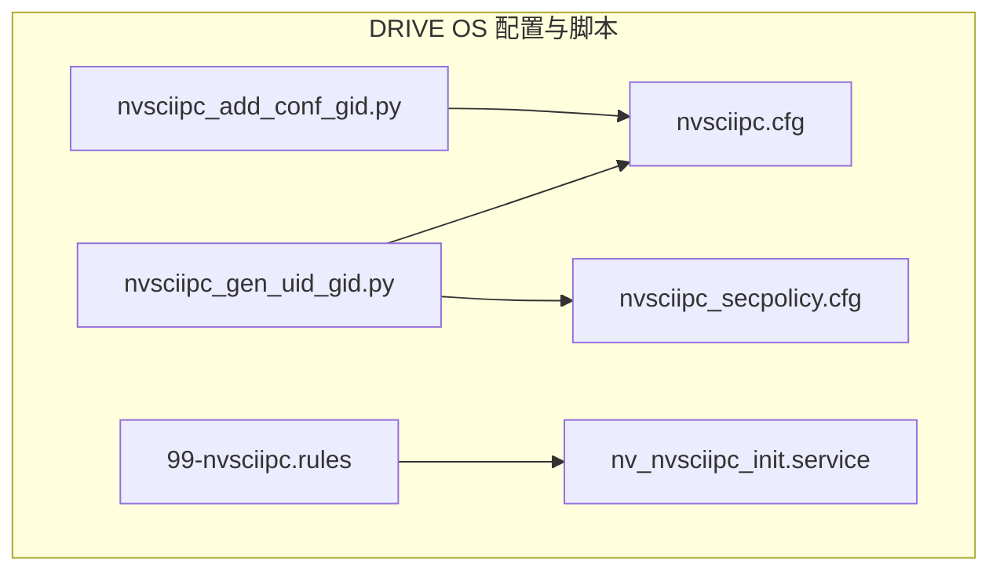
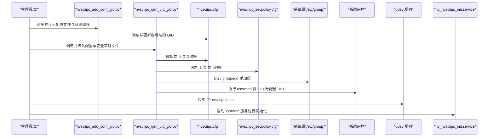
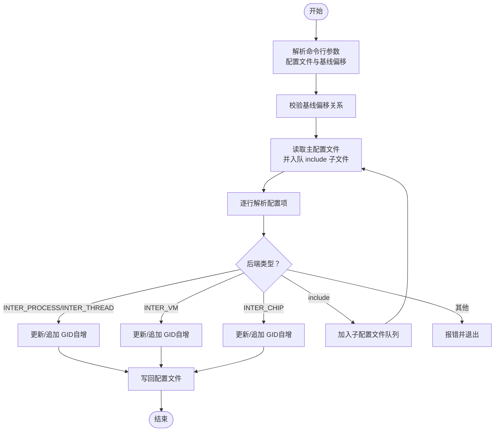
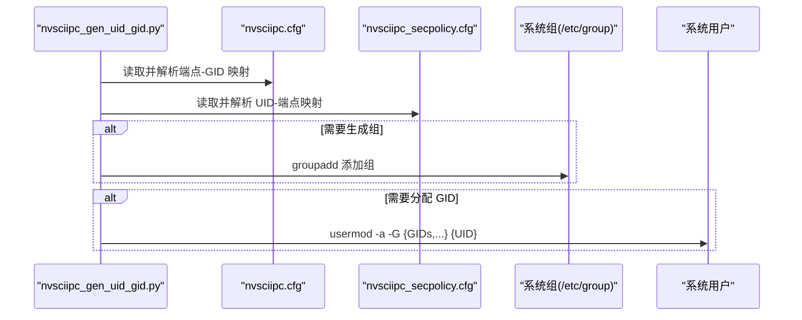
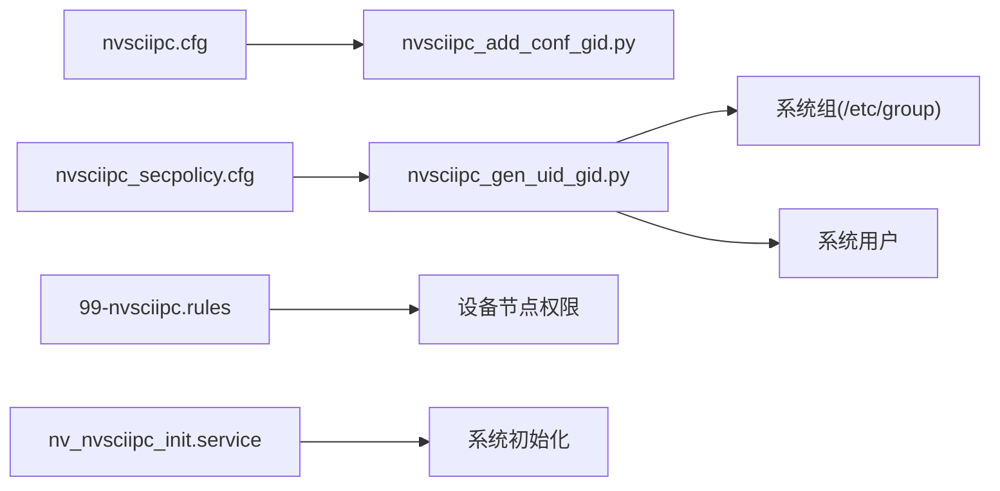
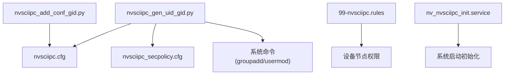

# 部署自动化

<cite>
**本文引用的文件**   
- [nvsciipc_add_conf_gid.py](file://driveos-6.0.6.0/usr/bin/nvsciipc_add_conf_gid.py)
- [nvsciipc_gen_uid_gid.py](file://driveos-6.0.6.0/usr/bin/nvsciipc_gen_uid_gid.py)
- [nvsciipc.cfg](file://driveos-6.0.6.0/etc/nvsciipc.cfg)
- [nvsciipc_secpolicy.cfg](file://driveos-6.0.6.0/etc/nvsciipc_secpolicy.cfg)
- [99-nvsciipc.rules](file://driveos-6.0.6.0/etc/99-nvsciipc.rules)
- [nv_nvsciipc_init.service](file://driveos-6.0.6.0/etc/nv_nvsciipc_init.service)
- [README.md](file://README.md)
</cite>

## 目录
1. [简介](#简介)
2. [项目结构](#项目结构)
3. [核心组件](#核心组件)
4. [架构总览](#架构总览)
5. [详细组件分析](#详细组件分析)
6. [依赖关系分析](#依赖关系分析)
7. [性能考量](#性能考量)
8. [故障排查指南](#故障排查指南)
9. [结论](#结论)
10. [附录](#附录)

## 简介
本指南面向在 NVIDIA DRIVE OS 环境中进行自动化部署与运维的工程师，系统讲解如何使用仓库中的 NvSciIPC 自动化脚本（nvsciipc_add_conf_gid.py、nvsciipc_gen_uid_gid.py）完成配置文件的 GID 基线更新与用户/组权限的自动配置；并提供批量部署脚本编写范式、标准化配置模板、CI/CD 集成建议、容器化与 Kubernetes 部署策略、监控与自动化运维工具以及失败重试与回滚机制。

## 项目结构
该仓库包含多个 DRIVE OS 版本的驱动与示例，其中与 NvSciIPC 部署自动化直接相关的核心文件位于：
- 用户态二进制脚本：usr/bin 下的 nvsciipc_add_conf_gid.py、nvsciipc_gen_uid_gid.py
- 配置文件：etc 下的 nvsciipc.cfg、nvsciipc_secpolicy.cfg、99-nvsciipc.rules、nv_nvsciipc_init.service
- 顶层说明文档：README.md

**图表来源**
- [nvsciipc_add_conf_gid.py](file://driveos-6.0.6.0/usr/bin/nvsciipc_add_conf_gid.py)
- [nvsciipc_gen_uid_gid.py](file://driveos-6.0.6.0/usr/bin/nvsciipc_gen_uid_gid.py)
- [nvsciipc.cfg](file://driveos-6.0.6.0/etc/nvsciipc.cfg)
- [nvsciipc_secpolicy.cfg](file://driveos-6.0.6.0/etc/nvsciipc_secpolicy.cfg)
- [99-nvsciipc.rules](file://driveos-6.0.6.0/etc/99-nvsciipc.rules)
- [nv_nvsciipc_init.service](file://driveos-6.0.6.0/etc/nv_nvsciipc_init.service)

**章节来源**
- [README.md](file://README.md)

## 核心组件
- 配置文件 nvsciipc.cfg：定义 NvSciIPC 各端点后端类型、端点名、后端参数与 GID 基线。支持 INTER_THREAD/INTER_PROCESS/INTER_VM/INTER_CHIP 四类后端，且要求配置版本为 1（CFGVER:1）。
- 安全策略文件 nvsciipc_secpolicy.cfg：将用户 ID 映射到一组端点，用于授权访问。
- udev 规则 99-nvsciipc.rules：控制设备节点权限（如 nvsciipc 设备），决定访问模式（如仅组内可读写）。
- systemd 服务 nv_nvsciipc_init.service：以单次执行方式初始化 NvSciIPC 相关资源。
- 自动化脚本：
  - nvsciipc_add_conf_gid.py：为配置文件中的端点分配或更新 GID，支持按后端类型设置基线偏移。
  - nvsciipc_gen_uid_gid.py：从配置文件提取端点-GID 映射，从安全策略文件提取 UID-端点映射，自动添加组并把相应 GID 分配给 UID。

**章节来源**
- [nvsciipc.cfg](file://driveos-6.0.6.0/etc/nvsciipc.cfg)
- [nvsciipc_secpolicy.cfg](file://driveos-6.0.6.0/etc/nvsciipc_secpolicy.cfg)
- [99-nvsciipc.rules](file://driveos-6.0.6.0/etc/99-nvsciipc.rules)
- [nv_nvsciipc_init.service](file://driveos-6.0.6.0/etc/nv_nvsciipc_init.service)
- [nvsciipc_add_conf_gid.py](file://driveos-6.0.6.0/usr/bin/nvsciipc_add_conf_gid.py)
- [nvsciipc_gen_uid_gid.py](file://driveos-6.0.6.0/usr/bin/nvsciipc_gen_uid_gid.py)

## 架构总览
下图展示自动化部署的关键流程：先通过 nvsciipc_add_conf_gid.py 更新配置文件的 GID 基线，再用 nvsciipc_gen_uid_gid.py 将组与用户权限映射落地，最后由 systemd 服务初始化相关资源。

**图表来源**
- [nvsciipc_add_conf_gid.py](file://driveos-6.0.6.0/usr/bin/nvsciipc_add_conf_gid.py)
- [nvsciipc_gen_uid_gid.py](file://driveos-6.0.6.0/usr/bin/nvsciipc_gen_uid_gid.py)
- [nvsciipc.cfg](file://driveos-6.0.6.0/etc/nvsciipc.cfg)
- [nvsciipc_secpolicy.cfg](file://driveos-6.0.6.0/etc/nvsciipc_secpolicy.cfg)
- [99-nvsciipc.rules](file://driveos-6.0.6.0/etc/99-nvsciipc.rules)
- [nv_nvsciipc_init.service](file://driveos-6.0.6.0/etc/nv_nvsciipc_init.service)

## 详细组件分析

### 组件A：配置文件 GID 基线更新（nvsciipc_add_conf_gid.py）
- 功能要点
  - 支持命令行参数：配置文件路径、三类后端的 GID 基线偏移（进程内/线程、跨 VM、芯片间）。
  - 自动检测并写入配置版本标记（CFGVER:1），确保后续解析正确。
  - 对 INTER_PROCESS/INTER_THREAD：若未指定 GID，则追加自增 GID；若已存在 GID 则替换。
  - 对 INTER_VM：若未指定 GID 则追加自增 GID；若已存在 GID 则替换。
  - 对 INTER_CHIP：若未指定 GID 则追加自增 GID；若已存在 GID 则替换。
  - include 子配置文件会按顺序被读取并更新。
  - 参数校验：跨 VM 的基线必须大于进程内/线程基线；芯片间基线必须大于跨 VM 基线；否则报错退出。
- 使用场景
  - 在多实例或多主机环境中避免 GID 冲突。
  - 与 CI/CD 流水线结合，按环境变量动态设置基线偏移。

**图表来源**
- [nvsciipc_add_conf_gid.py](file://driveos-6.0.6.0/usr/bin/nvsciipc_add_conf_gid.py)

**章节来源**
- [nvsciipc_add_conf_gid.py](file://driveos-6.0.6.0/usr/bin/nvsciipc_add_conf_gid.py)

### 组件B：用户与组权限自动配置（nvsciipc_gen_uid_gid.py）
- 功能要点
  - 从 nvsciipc.cfg 提取端点到 GID 的映射，从 nvsciipc_secpolicy.cfg 提取 UID 到端点列表的映射。
  - 可选步骤：
    - 自动生成组：根据端点后端类型生成组名并调用 groupadd 添加组。
    - 分配 GID：对每个 UID，将其关联的端点对应的 GID 追加到 usermod 的附加组参数中。
  - 支持指定固定 nvsciipc 组 ID，便于统一管理。
- 使用场景
  - 在容器或裸机环境中快速完成用户权限与 IPC 组的绑定。
  - 与部署清单（如 Ansible/Puppet/Terraform）集成，实现幂等部署。

**图表来源**
- [nvsciipc_gen_uid_gid.py](file://driveos-6.0.6.0/usr/bin/nvsciipc_gen_uid_gid.py)
- [nvsciipc.cfg](file://driveos-6.0.6.0/etc/nvsciipc.cfg)
- [nvsciipc_secpolicy.cfg](file://driveos-6.0.6.0/etc/nvsciipc_secpolicy.cfg)

**章节来源**
- [nvsciipc_gen_uid_gid.py](file://driveos-6.0.6.0/usr/bin/nvsciipc_gen_uid_gid.py)

### 组件C：配置文件与安全策略模板
- nvsciipc.cfg
  - 定义后端类型、端点名称、后端参数与 GID。
  - 要求配置版本为 1（CFGVER:1），否则解析会失败。
  - 提供默认 GID 基线（进程/线程 30000，芯片间 36000），可在部署时通过脚本调整。
- nvsciipc_secpolicy.cfg
  - 定义用户 ID 到端点集合的映射，用于授权访问。
  - 建议为不同模块（如 nvscistream、nvscisync、nvscibuf 等）建立独立用户，便于最小权限管理。
- 99-nvsciipc.rules
  - 控制设备节点权限，例如仅组内可读写，或所有用户可读写（视安全策略而定）。
- nv_nvsciipc_init.service
  - 以 root 权限一次性执行初始化逻辑，适合在系统启动阶段运行。

**图表来源**
- [nvsciipc.cfg](file://driveos-6.0.6.0/etc/nvsciipc.cfg)
- [nvsciipc_secpolicy.cfg](file://driveos-6.0.6.0/etc/nvsciipc_secpolicy.cfg)
- [99-nvsciipc.rules](file://driveos-6.0.6.0/etc/99-nvsciipc.rules)
- [nv_nvsciipc_init.service](file://driveos-6.0.6.0/etc/nv_nvsciipc_init.service)

**章节来源**
- [nvsciipc.cfg](file://driveos-6.0.6.0/etc/nvsciipc.cfg)
- [nvsciipc_secpolicy.cfg](file://driveos-6.0.6.0/etc/nvsciipc_secpolicy.cfg)
- [99-nvsciipc.rules](file://driveos-6.0.6.0/etc/99-nvsciipc.rules)
- [nv_nvsciipc_init.service](file://driveos-6.0.6.0/etc/nv_nvsciipc_init.service)

## 依赖关系分析
- 脚本依赖
  - nvsciipc_add_conf_gid.py 依赖于 nvsciipc.cfg 的格式与 CFGVER:1 标记。
  - nvsciipc_gen_uid_gid.py 依赖于 nvsciipc.cfg 与 nvsciipc_secpolicy.cfg 的正确格式。
- 系统依赖
  - groupadd、usermod 等系统命令需具备相应权限。
  - udev 规则需要在系统加载时生效。
  - systemd 服务需要启用并随系统启动。

**图表来源**
- [nvsciipc_add_conf_gid.py](file://driveos-6.0.6.0/usr/bin/nvsciipc_add_conf_gid.py)
- [nvsciipc_gen_uid_gid.py](file://driveos-6.0.6.0/usr/bin/nvsciipc_gen_uid_gid.py)
- [nvsciipc.cfg](file://driveos-6.0.6.0/etc/nvsciipc.cfg)
- [nvsciipc_secpolicy.cfg](file://driveos-6.0.6.0/etc/nvsciipc_secpolicy.cfg)
- [99-nvsciipc.rules](file://driveos-6.0.6.0/etc/99-nvsciipc.rules)
- [nv_nvsciipc_init.service](file://driveos-6.0.6.0/etc/nv_nvsciipc_init.service)

**章节来源**
- [nvsciipc_add_conf_gid.py](file://driveos-6.0.6.0/usr/bin/nvsciipc_add_conf_gid.py)
- [nvsciipc_gen_uid_gid.py](file://driveos-6.0.6.0/usr/bin/nvsciipc_gen_uid_gid.py)

## 性能考量
- 脚本复杂度
  - nvsciipc_add_conf_gid.py：按行扫描配置文件，时间复杂度 O(N)，空间复杂度 O(K)（K 为 include 子文件数量）。
  - nvsciipc_gen_uid_gid.py：解析两份配置文件，时间复杂度 O(M)，空间复杂度 O(U+E)（U 为 UID 数量，E 为端点数）。
- 权限变更开销
  - groupadd/usermod 为系统级操作，建议在部署窗口集中执行，避免频繁变更导致的缓存抖动。
- 设备权限
  - udev 规则生效可能受内核事件队列影响，建议在系统启动早期加载。

## 故障排查指南
- 常见错误与定位
  - 配置版本缺失或不合法：nvsciipc.cfg 缺少 CFGVER:1 或版本号非法，会导致解析失败。
  - 基线偏移冲突：跨 VM 或芯片间的基线小于等于前序基线，脚本会报错并退出。
  - 端点格式错误：nvsciipc.cfg 中某行字段不完整或后端类型不受支持，解析时报错。
  - 安全策略格式错误：nvsciipc_secpolicy.cfg 中某行分隔符或字段不合法，解析时报错。
  - 权限不足：执行 groupadd/usermod 失败，检查是否以 root 权限运行。
- 排查步骤
  - 检查 nvsciipc.cfg 与 nvsciipc_secpolicy.cfg 的语法与完整性。
  - 使用脚本的调试输出（如开启 INFO/DEBUG 日志）定位问题行。
  - 验证 udev 规则是否生效（查看设备节点权限）。
  - 查看 systemd 服务状态与日志，确认初始化是否成功。

**章节来源**
- [nvsciipc_add_conf_gid.py](file://driveos-6.0.6.0/usr/bin/nvsciipc_add_conf_gid.py)
- [nvsciipc_gen_uid_gid.py](file://driveos-6.0.6.0/usr/bin/nvsciipc_gen_uid_gid.py)
- [nvsciipc.cfg](file://driveos-6.0.6.0/etc/nvsciipc.cfg)
- [nvsciipc_secpolicy.cfg](file://driveos-6.0.6.0/etc/nvsciipc_secpolicy.cfg)
- [99-nvsciipc.rules](file://driveos-6.0.6.0/etc/99-nvsciipc.rules)
- [nv_nvsciipc_init.service](file://driveos-6.0.6.0/etc/nv_nvsciipc_init.service)

## 结论
通过 nvsciipc_add_conf_gid.py 与 nvsciipc_gen_uid_gid.py，可以实现 NvSciIPC 配置文件的 GID 基线更新与用户/组权限的自动化落地。配合 udev 规则与 systemd 服务，可形成从配置到权限再到系统初始化的完整自动化闭环。建议在 CI/CD 中以幂等方式调用这些脚本，并结合监控与回滚策略，保障大规模部署的稳定性与可追溯性。

## 附录

### A. 批量部署脚本编写与执行流程
- 建议流程
  - 步骤1：准备 nvsciipc.cfg 模板与 nvsciipc_secpolicy.cfg 模板。
  - 步骤2：在 CI/CD 中调用 nvsciipc_add_conf_gid.py，传入环境变量确定基线偏移。
  - 步骤3：调用 nvsciipc_gen_uid_gid.py，传入生成后的配置与安全策略文件，执行组与用户权限分配。
  - 步骤4：应用 99-nvsciipc.rules 并重启 udev 规则。
  - 步骤5：启用并启动 nv_nvsciipc_init.service。
- 幂等性保证
  - 脚本内部对已存在的 GID 采用替换策略，对已存在的组/用户采用跳过策略，确保重复执行不产生副作用。

**章节来源**
- [nvsciipc_add_conf_gid.py](file://driveos-6.0.6.0/usr/bin/nvsciipc_add_conf_gid.py)
- [nvsciipc_gen_uid_gid.py](file://driveos-6.0.6.0/usr/bin/nvsciipc_gen_uid_gid.py)
- [nvsciipc.cfg](file://driveos-6.0.6.0/etc/nvsciipc.cfg)
- [nvsciipc_secpolicy.cfg](file://driveos-6.0.6.0/etc/nvsciipc_secpolicy.cfg)
- [99-nvsciipc.rules](file://driveos-6.0.6.0/etc/99-nvsciipc.rules)
- [nv_nvsciipc_init.service](file://driveos-6.0.6.0/etc/nv_nvsciipc_init.service)

### B. CI/CD 集成方法
- GitOps 工作流
  - 将 nvsciipc.cfg 与 nvsciipc_secpolicy.cfg 作为受控资源提交到版本库。
  - 在流水线中：
    - 使用模板引擎渲染环境特定的基线偏移与端点列表。
    - 调用 nvsciipc_add_conf_gid.py 生成最终配置。
    - 调用 nvsciipc_gen_uid_gid.py 应用权限。
    - 使用部署工具（如 Ansible/Terraform/Helm）推送配置与服务。
- 失败重试与回滚
  - 为每一步添加重试与超时控制，失败时记录日志并触发回滚（恢复上一版本配置与权限）。

**章节来源**
- [nvsciipc_add_conf_gid.py](file://driveos-6.0.6.0/usr/bin/nvsciipc_add_conf_gid.py)
- [nvsciipc_gen_uid_gid.py](file://driveos-6.0.6.0/usr/bin/nvsciipc_gen_uid_gid.py)

### C. 容器化与 Kubernetes 部署策略
- 容器内部署
  - 在容器启动入口脚本中顺序执行：
    - nvsciipc_add_conf_gid.py（挂载配置卷）
    - nvsciipc_gen_uid_gid.py（挂载配置与安全策略卷）
    - 应用 udev 规则（必要时以特权模式运行）
    - 启动应用进程
- Kubernetes 部署
  - 使用 initContainer 完成配置与权限准备，主容器负责业务进程。
  - 使用 ConfigMap/Secret 管理 nvsciipc.cfg 与 nvsciipc_secpolicy.cfg。
  - 使用 DaemonSet/Deployment 部署服务，确保每台节点都执行初始化。

**章节来源**
- [nvsciipc_add_conf_gid.py](file://driveos-6.0.6.0/usr/bin/nvsciipc_add_conf_gid.py)
- [nvsciipc_gen_uid_gid.py](file://driveos-6.0.6.0/usr/bin/nvsciipc_gen_uid_gid.py)
- [nvsciipc.cfg](file://driveos-6.0.6.0/etc/nvsciipc.cfg)
- [nvsciipc_secpolicy.cfg](file://driveos-6.0.6.0/etc/nvsciipc_secpolicy.cfg)
- [99-nvsciipc.rules](file://driveos-6.0.6.0/etc/99-nvsciipc.rules)
- [nv_nvsciipc_init.service](file://driveos-6.0.6.0/etc/nv_nvsciipc_init.service)

### D. 部署监控与自动化运维
- 监控指标
  - 配置文件变更审计（GitOps 场景）
  - 权限分配结果（组/用户映射）
  - 设备节点权限一致性（udev 生效）
  - systemd 服务状态与初始化耗时
- 运维工具
  - 使用日志聚合与告警（如 ELK/Fluentd+Prometheus/Grafana）
  - 使用配置管理工具（Ansible/Terraform）实现声明式管理

**章节来源**
- [nvsciipc.cfg](file://driveos-6.0.6.0/etc/nvsciipc.cfg)
- [nvsciipc_secpolicy.cfg](file://driveos-6.0.6.0/etc/nvsciipc_secpolicy.cfg)
- [99-nvsciipc.rules](file://driveos-6.0.6.0/etc/99-nvsciipc.rules)
- [nv_nvsciipc_init.service](file://driveos-6.0.6.0/etc/nv_nvsciipc_init.service)