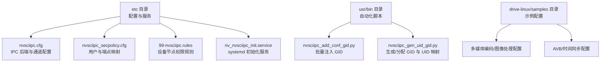
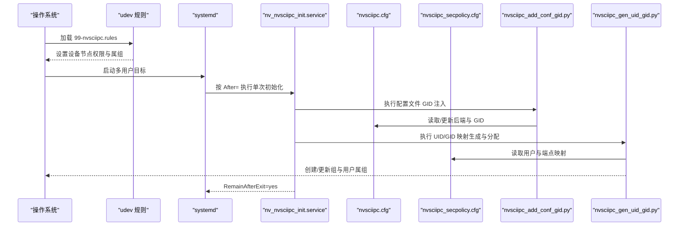
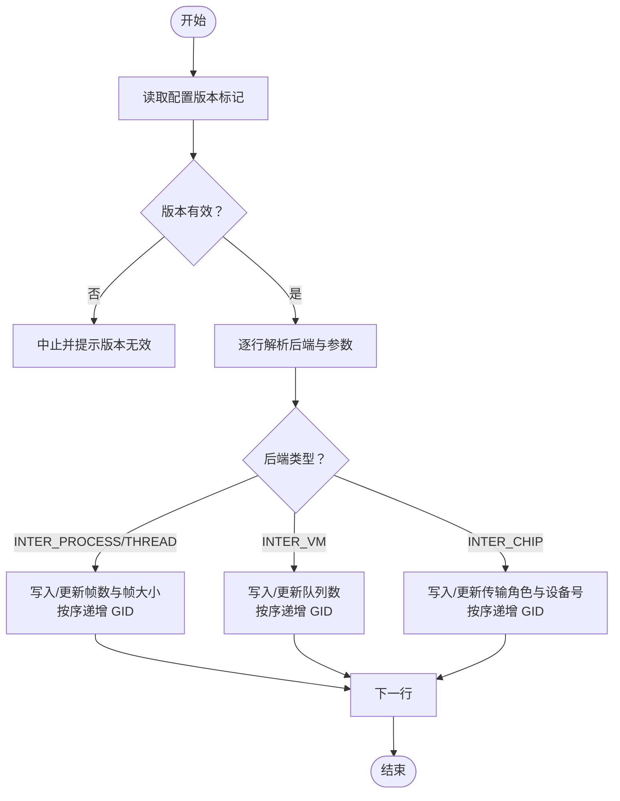
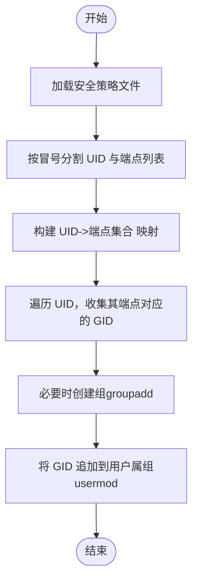
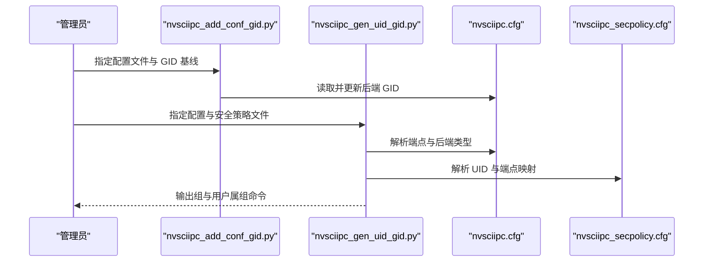
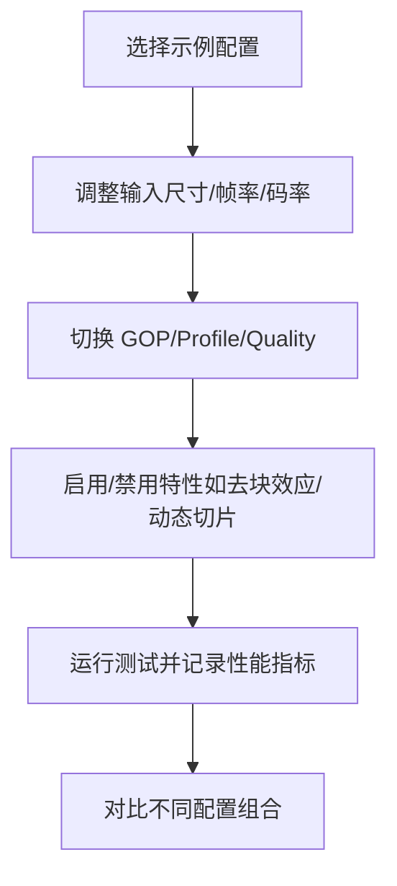
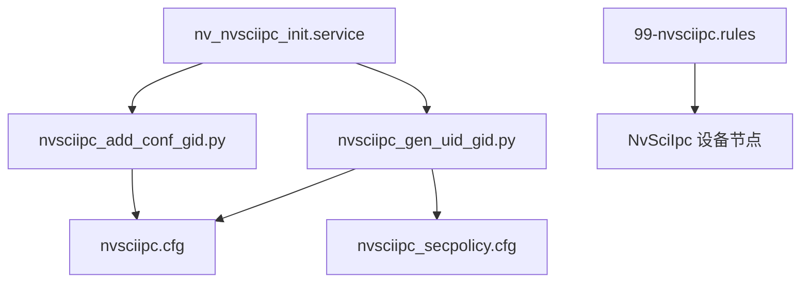

# 配置与部署

<cite>
**本文引用的文件**
- [nvsciipc.cfg](file://driveos-6.0.6.0/etc/nvsciipc.cfg)
- [nvsciipc_secpolicy.cfg](file://driveos-6.0.6.0/etc/nvsciipc_secpolicy.cfg)
- [nv_nvsciipc_init.service](file://driveos-6.0.6.0/etc/nv_nvsciipc_init.service)
- [99-nvsciipc.rules](file://driveos-6.0.6.0/etc/99-nvsciipc.rules)
- [nvsciipc_add_conf_gid.py](file://driveos-6.0.6.0/usr/bin/nvsciipc_add_conf_gid.py)
- [nvsciipc_gen_uid_gid.py](file://driveos-6.0.6.0/usr/bin/nvsciipc_gen_uid_gid.py)
- [automotive-master.cfg](file://driveos-6.0.6.0/drive-linux/samples/nvavb/daemons/automotive-master.cfg)
- [blend_yuv420_planar.cfg](file://driveos-6.0.6.0/drive-linux/samples/nvmedia/img_2d/blend_yuv420_planar.cfg)
- [enc_av1_sample.cfg](file://driveos-6.0.6.0/drive-linux/samples/nvmedia/img_enc/enc_av1_sample.cfg)
- [enc_h264_sample.cfg](file://driveos-6.0.6.0/drive-linux/samples/nvmedia_6x/iep/enc_h264_sample.cfg)
- [enc_h264_sample_uhp.cfg](file://driveos-6.0.6.0/drive-linux/samples/nvmedia_6x/iep/enc_h264_sample_uhp.cfg)
</cite>

## 目录
1. [简介](#简介)
2. [项目结构](#项目结构)
3. [核心组件](#核心组件)
4. [架构总览](#架构总览)
5. [详细组件分析](#详细组件分析)
6. [依赖分析](#依赖分析)
7. [性能考量](#性能考量)
8. [故障排查指南](#故障排查指南)
9. [结论](#结论)
10. [附录](#附录)

## 简介
本指南面向在 DriveOS 平台上进行配置与部署的工程人员，聚焦以下目标：
- 系统配置文件的设置与管理：重点覆盖 IPC（NvSciIpc）配置、安全策略、设备节点权限规则及 systemd 初始化服务。
- 不同部署场景的配置差异：开发、测试、生产三类环境的配置要点与最佳实践。
- 自动化部署脚本与工具：基于仓库提供的 Python 脚本，实现配置文件 GID 批量注入、用户组与 UID/GID 映射分配。
- 服务启动与管理：systemd 单元文件的职责、执行顺序与运行方式。
- 版本管理与升级策略：配置版本标记、向后兼容性与迁移注意事项。
- 监控与维护：日志与性能监控建议、故障预警与排障流程。

## 项目结构
本仓库包含多个 DriveOS 版本目录，每个版本下包含驱动 Linux 文件系统、示例程序、配置样例与工具脚本。与配置与部署直接相关的关键位置如下：
- 配置与服务：位于各版本的 etc 目录，包含 NvSciIpc 配置、安全策略、udev 规则与 systemd 服务单元。
- 工具脚本：位于各版本的 usr/bin 目录，提供配置文件 GID 注入与 UID/GID 分配自动化。
- 示例配置：位于各版本的 drive-linux/samples 下，涵盖多媒体、网络与 AVB 等子系统的参数样例，可作为性能调优与功能验证参考。

**图表来源**
- [nvsciipc.cfg:1-95](file://driveos-6.0.6.0/etc/nvsciipc.cfg#L1-L95)
- [nvsciipc_secpolicy.cfg:1-37](file://driveos-6.0.6.0/etc/nvsciipc_secpolicy.cfg#L1-L37)
- [99-nvsciipc.rules:1-14](file://driveos-6.0.6.0/etc/99-nvsciipc.rules#L1-L14)
- [nv_nvsciipc_init.service:1-21](file://driveos-6.0.6.0/etc/nv_nvsciipc_init.service#L1-L21)
- [nvsciipc_add_conf_gid.py:1-225](file://driveos-6.0.6.0/usr/bin/nvsciipc_add_conf_gid.py#L1-L225)
- [nvsciipc_gen_uid_gid.py:1-261](file://driveos-6.0.6.0/usr/bin/nvsciipc_gen_uid_gid.py#L1-L261)

**章节来源**
- [nvsciipc.cfg:1-95](file://driveos-6.0.6.0/etc/nvsciipc.cfg#L1-L95)
- [nvsciipc_secpolicy.cfg:1-37](file://driveos-6.0.6.0/etc/nvsciipc_secpolicy.cfg#L1-L37)
- [99-nvsciipc.rules:1-14](file://driveos-6.0.6.0/etc/99-nvsciipc.rules#L1-L14)
- [nv_nvsciipc_init.service:1-21](file://driveos-6.0.6.0/etc/nv_nvsciipc_init.service#L1-L21)
- [nvsciipc_add_conf_gid.py:1-225](file://driveos-6.0.6.0/usr/bin/nvsciipc_add_conf_gid.py#L1-L225)
- [nvsciipc_gen_uid_gid.py:1-261](file://driveos-6.0.6.0/usr/bin/nvsciipc_gen_uid_gid.py#L1-L261)

## 核心组件
- IPC 配置文件：定义后端类型、端点对、帧数与帧大小、GID 基线等，支持 INTER_THREAD、INTER_PROCESS、INTER_VM、INTER_CHIP 四类后端。
- 安全策略文件：将用户 ID 与端点集合关联，用于 DAC 访问控制。
- 设备节点权限规则：udev 规则为 NvSciIpc 设备节点设置访问模式与所属组。
- systemd 初始化服务：以单次执行方式在系统初始化阶段完成 IPC 资源准备。
- 自动化脚本：批量为配置文件注入 GID；根据安全策略生成/分配组与用户组成员关系。

**章节来源**
- [nvsciipc.cfg:1-95](file://driveos-6.0.6.0/etc/nvsciipc.cfg#L1-L95)
- [nvsciipc_secpolicy.cfg:1-37](file://driveos-6.0.6.0/etc/nvsciipc_secpolicy.cfg#L1-L37)
- [99-nvsciipc.rules:1-14](file://driveos-6.0.6.0/etc/99-nvsciipc.rules#L1-L14)
- [nv_nvsciipc_init.service:1-21](file://driveos-6.0.6.0/etc/nv_nvsciipc_init.service#L1-L21)
- [nvsciipc_add_conf_gid.py:1-225](file://driveos-6.0.6.0/usr/bin/nvsciipc_add_conf_gid.py#L1-L225)
- [nvsciipc_gen_uid_gid.py:1-261](file://driveos-6.0.6.0/usr/bin/nvsciipc_gen_uid_gid.py#L1-L261)

## 架构总览
下图展示从系统启动到 IPC 资源可用的整体流程，以及配置文件与脚本之间的协作关系。

**图表来源**
- [99-nvsciipc.rules:1-14](file://driveos-6.0.6.0/etc/99-nvsciipc.rules#L1-L14)
- [nv_nvsciipc_init.service:1-21](file://driveos-6.0.6.0/etc/nv_nvsciipc_init.service#L1-L21)
- [nvsciipc.cfg:1-95](file://driveos-6.0.6.0/etc/nvsciipc.cfg#L1-L95)
- [nvsciipc_secpolicy.cfg:1-37](file://driveos-6.0.6.0/etc/nvsciipc_secpolicy.cfg#L1-L37)
- [nvsciipc_add_conf_gid.py:1-225](file://driveos-6.0.6.0/usr/bin/nvsciipc_add_conf_gid.py#L1-L225)
- [nvsciipc_gen_uid_gid.py:1-261](file://driveos-6.0.6.0/usr/bin/nvsciipc_gen_uid_gid.py#L1-L261)

## 详细组件分析

### 组件一：IPC 配置文件（nvsciipc.cfg）
- 作用：定义 NvSciIpc 的后端类型、端点名称、缓冲参数与 GID，支持 INTER_THREAD、INTER_PROCESS、INTER_VM、INTER_CHIP。
- 关键字段：
  - 后端类型：INTER_PROCESS/INTER_THREAD/INTER_VM/INTER_CHIP
  - 端点名称：成对或单端点名称
  - 后端信息：INTER_PROCESS/INTER_THREAD 表示“帧数”和“帧大小”，INTER_VM 表示队列数量，INTER_CHIP 表示传输角色与设备号
  - GID：访问控制基线，按后端类型分段分配
- 版本标记：通过注释行声明配置版本，便于脚本识别与兼容处理。

**图表来源**
- [nvsciipc.cfg:1-95](file://driveos-6.0.6.0/etc/nvsciipc.cfg#L1-L95)
- [nvsciipc_add_conf_gid.py:107-221](file://driveos-6.0.6.0/usr/bin/nvsciipc_add_conf_gid.py#L107-L221)

**章节来源**
- [nvsciipc.cfg:1-95](file://driveos-6.0.6.0/etc/nvsciipc.cfg#L1-L95)
- [nvsciipc_add_conf_gid.py:1-225](file://driveos-6.0.6.0/usr/bin/nvsciipc_add_conf_gid.py#L1-L225)

### 组件二：安全策略文件（nvsciipc_secpolicy.cfg）
- 作用：将用户 ID 与一组端点进行映射，用于 DAC 权限控制。
- 使用方式：通过 useradd 创建专用用户，再由脚本将对应 GID 分配给该用户，使其具备访问特定端点的权限。
- 最大行长限制：单行不超过 4096 字节，超限需拆分。

**图表来源**
- [nvsciipc_secpolicy.cfg:1-37](file://driveos-6.0.6.0/etc/nvsciipc_secpolicy.cfg#L1-L37)
- [nvsciipc_gen_uid_gid.py:159-257](file://driveos-6.0.6.0/usr/bin/nvsciipc_gen_uid_gid.py#L159-L257)

**章节来源**
- [nvsciipc_secpolicy.cfg:1-37](file://driveos-6.0.6.0/etc/nvsciipc_secpolicy.cfg#L1-L37)
- [nvsciipc_gen_uid_gid.py:1-261](file://driveos-6.0.6.0/usr/bin/nvsciipc_gen_uid_gid.py#L1-L261)

### 组件三：设备节点权限规则（99-nvsciipc.rules）
- 作用：udev 规则为 NvSciIpc 设备节点设置访问模式与属组，确保不同场景下的访问控制。
- 建议：在生产环境优先使用更严格的访问模式，仅允许特定组访问。

**章节来源**
- [99-nvsciipc.rules:1-14](file://driveos-6.0.6.0/etc/99-nvsciipc.rules#L1-L14)

### 组件四：systemd 初始化服务（nv_nvsciipc_init.service）
- 作用：在系统初始化阶段一次性执行 IPC 资源准备任务。
- 关键属性：
  - User=root：以 root 权限执行
  - Type=oneshot：单次执行
  - RemainAfterExit=yes：即使进程退出也视为激活
  - After=sysinit.target：在系统初始化完成后执行

**章节来源**
- [nv_nvsciipc_init.service:1-21](file://driveos-6.0.6.0/etc/nv_nvsciipc_init.service#L1-L21)

### 组件五：自动化部署脚本
- nvsciipc_add_conf_gid.py
  - 功能：为配置文件中的各后端条目批量注入或更新 GID，支持校验 GID 基线顺序与冲突检测。
  - 参数：配置文件名、各类后端的 GID 基线偏移。
- nvsciipc_gen_uid_gid.py
  - 功能：读取配置与安全策略，生成组与用户属组映射，支持指定 GID 或自动创建组。
  - 参数：配置文件、安全策略文件、是否生成组、是否分配给 UID、指定 nvsciipc 组 ID。

**图表来源**
- [nvsciipc_add_conf_gid.py:65-221](file://driveos-6.0.6.0/usr/bin/nvsciipc_add_conf_gid.py#L65-L221)
- [nvsciipc_gen_uid_gid.py:48-257](file://driveos-6.0.6.0/usr/bin/nvsciipc_gen_uid_gid.py#L48-L257)

**章节来源**
- [nvsciipc_add_conf_gid.py:1-225](file://driveos-6.0.6.0/usr/bin/nvsciipc_add_conf_gid.py#L1-L225)
- [nvsciipc_gen_uid_gid.py:1-261](file://driveos-6.0.6.0/usr/bin/nvsciipc_gen_uid_gid.py#L1-L261)

### 组件六：示例配置（性能调优参考）
- 多媒体图像处理：提供图像混合、合成、缩放等配置项，可用于评估不同布局、扫描类型与色彩格式对性能的影响。
- 编码器配置：H.264/AV1 等编码器的 GOP、帧率、码率控制、量化参数等，可作为性能与质量权衡的参考模板。
- AVB 时间同步：汽车应用场景的时间同步配置，可作为实时性保障的参考。

**图表来源**
- [blend_yuv420_planar.cfg:1-61](file://driveos-6.0.6.0/drive-linux/samples/nvmedia/img_2d/blend_yuv420_planar.cfg#L1-L61)
- [enc_av1_sample.cfg:1-172](file://driveos-6.0.6.0/drive-linux/samples/nvmedia/img_enc/enc_av1_sample.cfg#L1-L172)
- [enc_h264_sample.cfg:1-318](file://driveos-6.0.6.0/drive-linux/samples/nvmedia_6x/iep/enc_h264_sample.cfg#L1-L318)
- [enc_h264_sample_uhp.cfg:1-318](file://driveos-6.0.6.0/drive-linux/samples/nvmedia_6x/iep/enc_h264_sample_uhp.cfg#L1-L318)
- [automotive-master.cfg:1-32](file://driveos-6.0.6.0/drive-linux/samples/nvavb/daemons/automotive-master.cfg#L1-L32)

**章节来源**
- [blend_yuv420_planar.cfg:1-61](file://driveos-6.0.6.0/drive-linux/samples/nvmedia/img_2d/blend_yuv420_planar.cfg#L1-L61)
- [enc_av1_sample.cfg:1-172](file://driveos-6.0.6.0/drive-linux/samples/nvmedia/img_enc/enc_av1_sample.cfg#L1-L172)
- [enc_h264_sample.cfg:1-318](file://driveos-6.0.6.0/drive-linux/samples/nvmedia_6x/iep/enc_h264_sample.cfg#L1-L318)
- [enc_h264_sample_uhp.cfg:1-318](file://driveos-6.0.6.0/drive-linux/samples/nvmedia_6x/iep/enc_h264_sample_uhp.cfg#L1-L318)
- [automotive-master.cfg:1-32](file://driveos-6.0.6.0/drive-linux/samples/nvavb/daemons/automotive-master.cfg#L1-L32)

## 依赖分析
- 组件耦合关系
  - nv_nvsciipc_init.service 依赖于 nvsciipc_add_conf_gid.py 与 nvsciipc_gen_uid_gid.py 的执行结果。
  - nvsciipc_add_conf_gid.py 依赖 nvsciipc.cfg 的存在与正确格式。
  - nvsciipc_gen_uid_gid.py 依赖 nvsciipc.cfg 与 nvsciipc_secpolicy.cfg 的一致性。
  - 99-nvsciipc.rules 与设备节点访问权限相关，影响用户侧访问行为。
- 外部依赖
  - systemd：负责服务生命周期与执行顺序。
  - udev：负责设备节点权限与属组设置。
  - 用户与组管理命令：groupadd、usermod。

**图表来源**
- [nv_nvsciipc_init.service:1-21](file://driveos-6.0.6.0/etc/nv_nvsciipc_init.service#L1-L21)
- [nvsciipc_add_conf_gid.py:1-225](file://driveos-6.0.6.0/usr/bin/nvsciipc_add_conf_gid.py#L1-L225)
- [nvsciipc_gen_uid_gid.py:1-261](file://driveos-6.0.6.0/usr/bin/nvsciipc_gen_uid_gid.py#L1-L261)
- [nvsciipc.cfg:1-95](file://driveos-6.0.6.0/etc/nvsciipc.cfg#L1-L95)
- [nvsciipc_secpolicy.cfg:1-37](file://driveos-6.0.6.0/etc/nvsciipc_secpolicy.cfg#L1-L37)
- [99-nvsciipc.rules:1-14](file://driveos-6.0.6.0/etc/99-nvsciipc.rules#L1-L14)

**章节来源**
- [nv_nvsciipc_init.service:1-21](file://driveos-6.0.6.0/etc/nv_nvsciipc_init.service#L1-L21)
- [nvsciipc_add_conf_gid.py:1-225](file://driveos-6.0.6.0/usr/bin/nvsciipc_add_conf_gid.py#L1-L225)
- [nvsciipc_gen_uid_gid.py:1-261](file://driveos-6.0.6.0/usr/bin/nvsciipc_gen_uid_gid.py#L1-L261)
- [nvsciipc.cfg:1-95](file://driveos-6.0.6.0/etc/nvsciipc.cfg#L1-L95)
- [nvsciipc_secpolicy.cfg:1-37](file://driveos-6.0.6.0/etc/nvsciipc_secpolicy.cfg#L1-L37)
- [99-nvsciipc.rules:1-14](file://driveos-6.0.6.0/etc/99-nvsciipc.rules#L1-L14)

## 性能考量
- 图像处理与编码
  - 输入尺寸与帧率直接影响吞吐与延迟，应结合硬件能力与业务需求进行折中。
  - GOP 结构与码率控制模式（CBR/VBR/CR/QP）对压缩效率与实时性有显著影响。
  - 启用/禁用去块效应、动态切片等特性可平衡质量与计算负载。
- 实时性保障
  - AVB 时间同步配置可提升网络时钟同步精度，适用于对抖动敏感的应用。
- 调优建议
  - 以示例配置为基准，逐步调整关键参数并进行回归测试。
  - 在开发与测试环境先验证参数组合，再迁移到生产环境。

**章节来源**
- [blend_yuv420_planar.cfg:1-61](file://driveos-6.0.6.0/drive-linux/samples/nvmedia/img_2d/blend_yuv420_planar.cfg#L1-L61)
- [enc_av1_sample.cfg:1-172](file://driveos-6.0.6.0/drive-linux/samples/nvmedia/img_enc/enc_av1_sample.cfg#L1-L172)
- [enc_h264_sample.cfg:1-318](file://driveos-6.0.6.0/drive-linux/samples/nvmedia_6x/iep/enc_h264_sample.cfg#L1-L318)
- [automotive-master.cfg:1-32](file://driveos-6.0.6.0/drive-linux/samples/nvavb/daemons/automotive-master.cfg#L1-L32)

## 故障排查指南
- 启动失败
  - 检查 systemd 日志：确认 nv_nvsciipc_init.service 是否按预期执行且无错误。
  - 检查 udev 规则是否生效：确认设备节点权限与属组符合预期。
- 权限问题
  - 确认安全策略文件中的 UID 与端点映射正确，且已通过脚本完成组与用户属组分配。
  - 若出现 GID 冲突或越界，检查 GID 基线设置与脚本输出。
- 配置不生效
  - 确认配置文件版本标记存在且有效，脚本会据此判断是否需要更新。
  - 检查 include 语句是否正确指向子配置文件。

**章节来源**
- [nv_nvsciipc_init.service:1-21](file://driveos-6.0.6.0/etc/nv_nvsciipc_init.service#L1-L21)
- [99-nvsciipc.rules:1-14](file://driveos-6.0.6.0/etc/99-nvsciipc.rules#L1-L14)
- [nvsciipc_secpolicy.cfg:1-37](file://driveos-6.0.6.0/etc/nvsciipc_secpolicy.cfg#L1-L37)
- [nvsciipc_add_conf_gid.py:47-106](file://driveos-6.0.6.0/usr/bin/nvsciipc_add_conf_gid.py#L47-L106)
- [nvsciipc_gen_uid_gid.py:197-257](file://driveos-6.0.6.0/usr/bin/nvsciipc_gen_uid_gid.py#L197-L257)

## 结论
通过规范化的配置文件、严谨的安全策略与自动化脚本，可在不同部署环境中稳定地完成 IPC 资源的初始化与权限分配。结合示例配置进行性能调优与实时性保障，配合 systemd 与 udev 的协同，可实现从开发到生产的平滑过渡与持续运维。

## 附录
- 不同部署场景的配置要点
  - 开发环境：优先使用宽松的设备节点权限与简化的安全策略，便于快速迭代。
  - 测试环境：启用更严格的权限控制与最小化用户映射，模拟生产约束。
  - 生产环境：严格限定访问范围，使用稳定的 GID 基线与明确的用户/组映射，定期审计与备份配置文件。
- 版本管理与升级策略
  - 保持配置版本标记一致，避免脚本误判。
  - 升级前备份现有配置与安全策略，验证新版本脚本的兼容性与输出。
  - 对向后兼容性敏感的系统，保留历史 GID 基线并在迁移时避免重叠。
- 监控与维护
  - 建立日志采集与告警机制，关注 IPC 初始化、设备节点访问与用户权限变更。
  - 定期巡检配置文件与脚本输出，确保 GID 与用户映射未被意外修改。
  - 性能监控结合示例配置进行回归测试，形成参数调优基线。