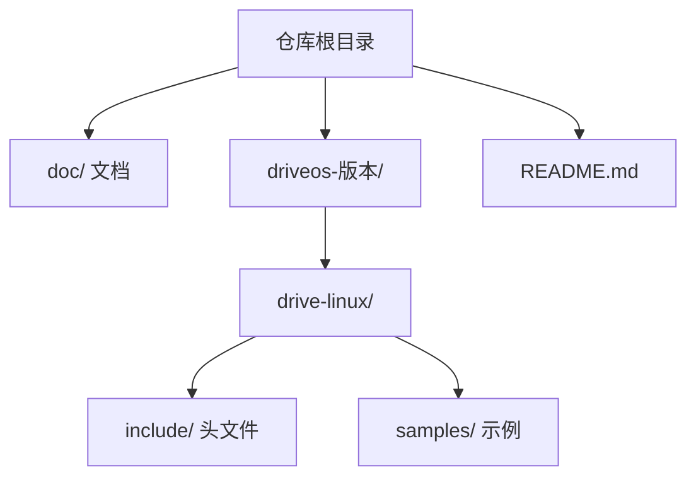
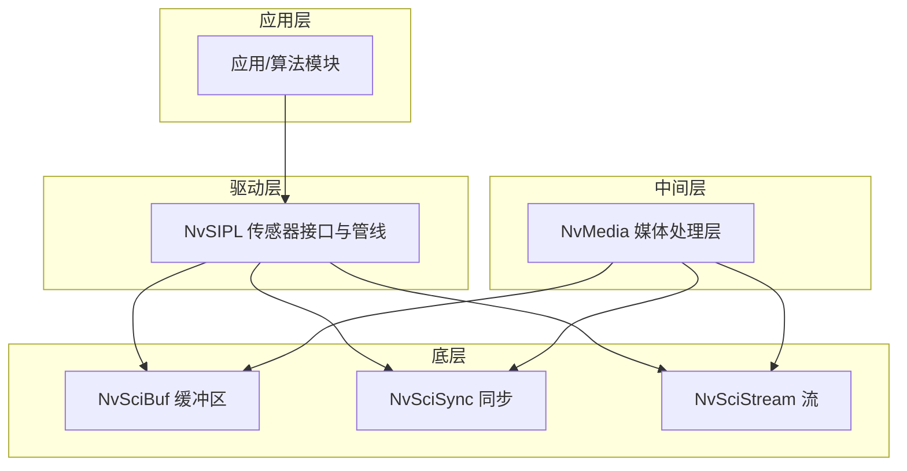
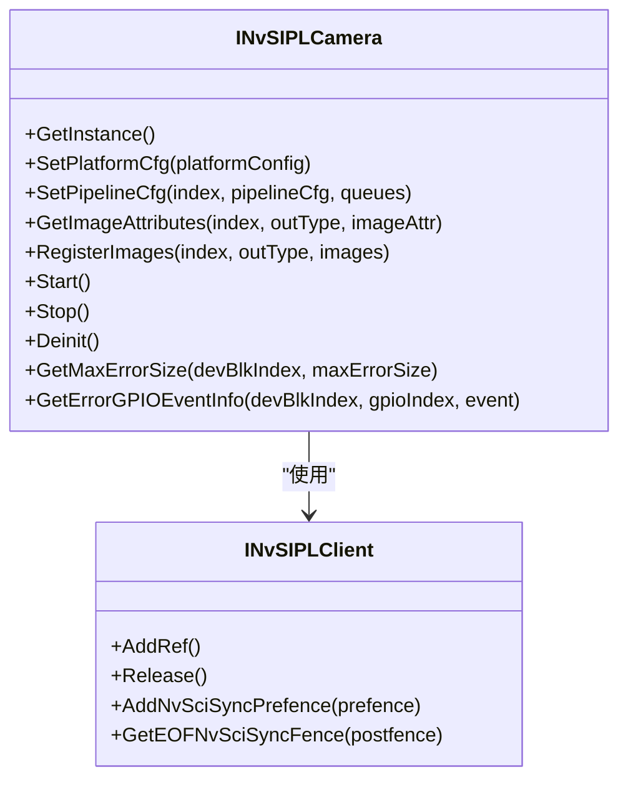
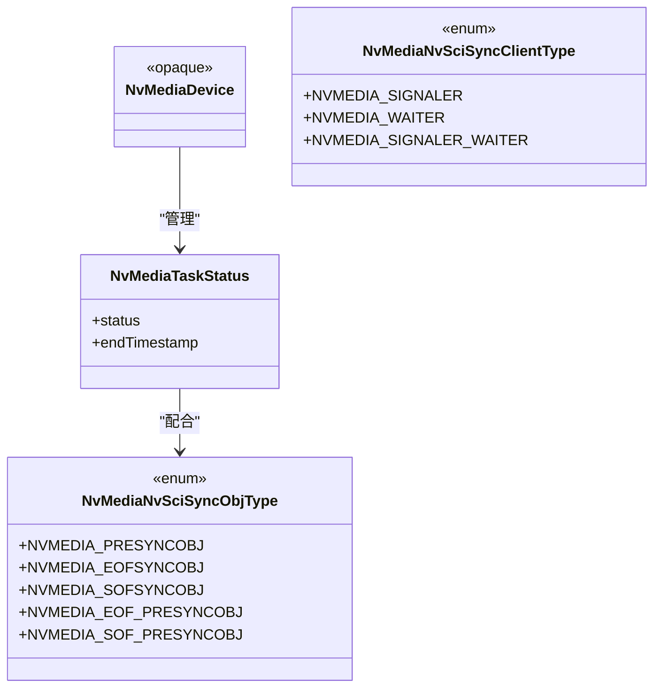
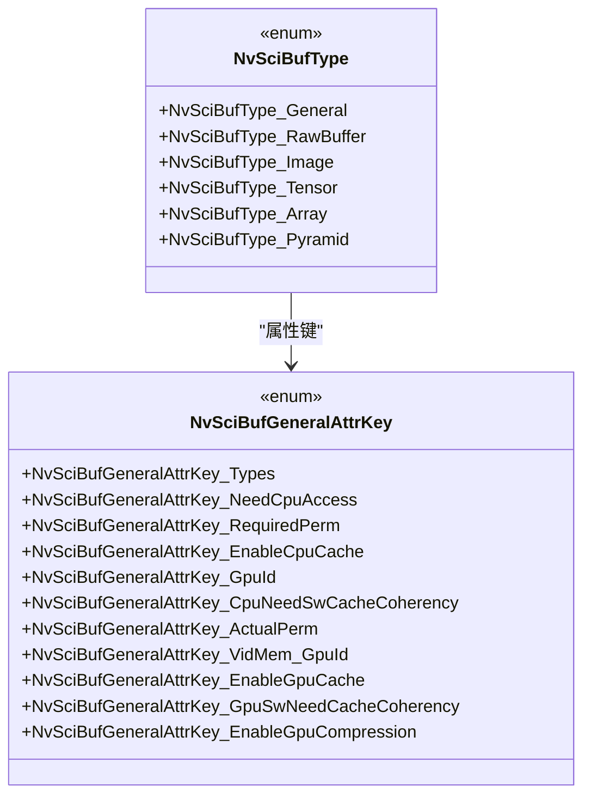
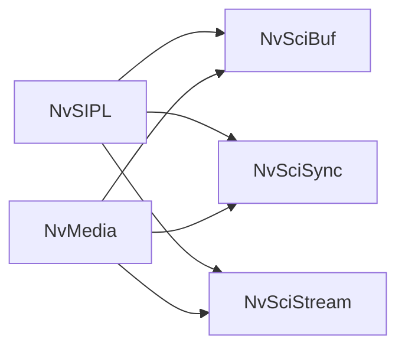

# 项目概述

<cite>
**本文档引用的文件**
- [README.md](file://README.md)
- [NvSIPLCommon.hpp](file://driveos-6.0.5.0/drive-linux/include/NvSIPLCommon.hpp)
- [NvSIPLClient.hpp](file://driveos-6.0.5.0/drive-linux/include/NvSIPLClient.hpp)
- [NvSIPLCamera.hpp](file://driveos-6.0.5.0/drive-linux/include/NvSIPLCamera.hpp)
- [NvSIPLPlatformCfg.hpp](file://driveos-6.0.5.0/drive-linux/include/NvSIPLPlatformCfg.hpp)
- [nvscibuf.h](file://driveos-6.0.5.0/drive-linux/include/nvscibuf.h)
- [nvscistream.h](file://driveos-6.0.5.0/drive-linux/include/nvscistream.h)
- [nvmedia_core.h](file://driveos-6.0.5.0/drive-linux/include/nvmedia_6x/nvmedia_core.h)
</cite>

## 目录
1. [引言](#引言)
2. [项目结构](#项目结构)
3. [核心组件](#核心组件)
4. [架构总览](#架构总览)
5. [详细组件分析](#详细组件分析)
6. [依赖关系分析](#依赖关系分析)
7. [性能考虑](#性能考虑)
8. [故障排查指南](#故障排查指南)
9. [结论](#结论)
10. [附录](#附录)

## 引言
NVIDIA DriveOS 是面向自动驾驶与机器人平台的车载操作系统框架，提供从传感器数据采集、图像/视频处理到跨模块通信与同步的完整能力。本项目以分层架构为核心：上层通过 NvSIPL（Sensor Interface and Pipeline Library）抽象传感器接口与图像处理管线；中间层由 NvMedia 媒体处理层负责编解码、图像增强、张量处理等；底层通过 NvSci 通信与同步层实现跨进程/跨模块的缓冲区共享与同步。该架构支持多传感器融合、实时媒体处理与 GPU 加速计算，广泛应用于 ADAS、自动驾驶、车载娱乐系统等场景。

## 项目结构
仓库包含多个版本的 DriveOS 发行包与配套 SDK，核心目录与文件组织如下：
- 文档与说明：doc/ 下涵盖 CUDA、Linux、QNX、硬件、TRT、第三方等内容
- 多版本 SDK：driveos-5260、driveos-6.0.5.0、driveos-6.0.6.0、driveos-60100 等
- 关键头文件与示例：各版本 drive-linux/include 与 samples 目录
- 版本与打包信息：README.md 提供安装与打包说明

章节来源
- [README.md:1-128](file://README.md#L1-L128)

## 核心组件
- NvSIPL（传感器接口与管线库）
  - 职责：抽象外部图像设备编程，管理 Tegra 侧图像处理管线，输出 NvSciBuf 对象
  - 关键接口：平台配置、管线配置、图像属性查询、图像注册、启动/停止/反初始化
  - 数据结构：通用类型、时间基、状态码、错误详情等
- NvMedia（媒体处理层）
  - 职责：提供图像/视频处理、编解码、ISP/IEP/IDE/IOFA 等能力，统一版本与同步语义
  - 关键接口：设备对象、任务状态、NvSciSync 客户端类型与同步对象类型
- NvSci（通信与同步层）
  - 职责：提供 NvSciBuf（缓冲区分配与交换）、NvSciSync（同步原语）、NvSciStream（数据包流）等
  - 应用：在 NvSIPL 与 NvMedia 之间传递图像帧与元数据，保证跨模块时序与一致性

章节来源
- [NvSIPLCommon.hpp:1-219](file://driveos-6.0.5.0/drive-linux/include/NvSIPLCommon.hpp#L1-L219)
- [NvSIPLClient.hpp:1-368](file://driveos-6.0.5.0/drive-linux/include/NvSIPLClient.hpp#L1-L368)
- [NvSIPLCamera.hpp:1-800](file://driveos-6.0.5.0/drive-linux/include/NvSIPLCamera.hpp#L1-L800)
- [nvmedia_core.h:1-265](file://driveos-6.0.5.0/drive-linux/include/nvmedia_6x/nvmedia_core.h#L1-L265)
- [nvscibuf.h:1-4920](file://driveos-6.0.5.0/drive-linux/include/nvscibuf.h#L1-L4920)
- [nvscistream.h:1-32](file://driveos-6.0.5.0/drive-linux/include/nvscistream.h#L1-L32)

## 架构总览
分层设计理念与交互关系：
- 顶层（应用层）：调用 NvSIPL 接口进行平台与管线配置，注册图像缓冲并启动采集
- 中间层（处理层）：NvMedia 执行编解码、ISP/IEP/IDE/IOFA 等处理，生成处理结果
- 底层（通信层）：NvSciBuf/NvSciSync/NvSciStream 实现跨进程/跨模块的缓冲区共享与同步

图表来源
- [NvSIPLCamera.hpp:150-700](file://driveos-6.0.5.0/drive-linux/include/NvSIPLCamera.hpp#L150-L700)
- [nvmedia_core.h:170-265](file://driveos-6.0.5.0/drive-linux/include/nvmedia_6x/nvmedia_core.h#L170-L265)
- [nvscibuf.h:100-4920](file://driveos-6.0.5.0/drive-linux/include/nvscibuf.h#L100-L4920)
- [nvscistream.h:1-32](file://driveos-6.0.5.0/drive-linux/include/nvscistream.h#L1-L32)

## 详细组件分析

### NvSIPL 组件分析
- 平台与管线配置
  - 平台配置：描述平台名称、配置名、设备块数量与设备块列表
  - 管线配置：为每个传感器设置输出类型（ICP/ISP0/ISP1/ISP2），并返回队列用于完成帧与事件通知
- 图像属性与注册
  - 查询图像属性：根据输出类型获取图像属性，用于与下游消费者属性对齐
  - 注册图像：向管线注册 NvSciBuf 对象作为 ICP/ISP 输出缓冲
- 生命周期管理
  - 初始化、启动、停止、反初始化，确保传感器与处理管线正确启停
- 错误与事件
  - 获取最大错误尺寸、GPIO 错误事件信息、反序列化器错误详情等

图表来源
- [NvSIPLCamera.hpp:150-700](file://driveos-6.0.5.0/drive-linux/include/NvSIPLCamera.hpp#L150-L700)
- [NvSIPLClient.hpp:40-368](file://driveos-6.0.5.0/drive-linux/include/NvSIPLClient.hpp#L40-L368)

章节来源
- [NvSIPLPlatformCfg.hpp:49-72](file://driveos-6.0.5.0/drive-linux/include/NvSIPLPlatformCfg.hpp#L49-L72)
- [NvSIPLCamera.hpp:220-700](file://driveos-6.0.5.0/drive-linux/include/NvSIPLCamera.hpp#L220-L700)
- [NvSIPLClient.hpp:120-368](file://driveos-6.0.5.0/drive-linux/include/NvSIPLClient.hpp#L120-L368)

### NvMedia 组件分析
- 设备与任务
  - 设备对象作为所有其他对象的根，用于创建图像/数组等资源
  - 任务状态包含最近一次操作的状态与结束时间戳
- 同步语义
  - NvSciSync 客户端类型：信号者、等待者、同时具备
  - 同步对象类型：预同步（PRE）、帧开始（SOF）、帧结束（EOF）、循环使用（EOF/PRE）
- 版本信息
  - 提供主/次/补丁版本号，便于兼容性检查

图表来源
- [nvmedia_core.h:240-265](file://driveos-6.0.5.0/drive-linux/include/nvmedia_6x/nvmedia_core.h#L240-L265)
- [nvmedia_core.h:170-237](file://driveos-6.0.5.0/drive-linux/include/nvmedia_6x/nvmedia_core.h#L170-L237)

章节来源
- [nvmedia_core.h:100-172](file://driveos-6.0.5.0/drive-linux/include/nvmedia_6x/nvmedia_core.h#L100-L172)

### NvSci 组件分析
- NvSciBuf
  - 类型：原始缓冲、图像、张量、数组、金字塔等
  - 属性键：通用属性、图像属性、张量属性等，支持 CPU/GPU 访问权限、缓存策略、压缩控制等
  - 版本：主/次版本号，便于 ABI 兼容性判断
- NvSciStream
  - 在 NvSciBuf/NvSciSync 基础上提供数据包流能力，支撑多模块间数据序列传输
- NvSciSync
  - 与 NvMedia 的同步对象类型协同，保障处理阶段间的时序一致性

图表来源
- [nvscibuf.h:118-800](file://driveos-6.0.5.0/drive-linux/include/nvscibuf.h#L118-L800)

章节来源
- [nvscibuf.h:140-200](file://driveos-6.0.5.0/drive-linux/include/nvscibuf.h#L140-L200)
- [nvscistream.h:1-32](file://driveos-6.0.5.0/drive-linux/include/nvscistream.h#L1-L32)

## 依赖关系分析
- 组件耦合
  - NvSIPL 依赖 NvSciBuf/NvSciSync/NvSciStream 进行缓冲与同步
  - NvMedia 依赖 NvSciBuf/NvSciSync 实现跨模块数据与同步
- 外部依赖
  - 驱动与固件：传感器、反序列化器、ISP/IEP/IDE/IOFA 等
  - 系统库：OpenGL/Vulkan/Wayland/DRI/GBM 等（在不同版本中提供）

图表来源
- [NvSIPLCamera.hpp:150-230](file://driveos-6.0.5.0/drive-linux/include/NvSIPLCamera.hpp#L150-L230)
- [nvmedia_core.h:170-237](file://driveos-6.0.5.0/drive-linux/include/nvmedia_6x/nvmedia_core.h#L170-L237)
- [nvscibuf.h:100-200](file://driveos-6.0.5.0/drive-linux/include/nvscibuf.h#L100-L200)

## 性能考虑
- 缓存与内存一致性
  - CPU/GPU 缓存策略与显式缓存维护需求需结合实际访问模式配置，避免不必要的同步开销
- GPU 压缩与域选择
  - 在满足引擎与 CPU 访问要求的前提下启用 GPU 压缩可降低带宽占用
- 同步粒度
  - 使用最小必要的同步对象类型（PRE/SOF/EOF）减少等待延迟
- 管线并行
  - 合理划分 ICP/ISP 处理阶段，利用多输出缓冲与多队列提升吞吐

## 故障排查指南
- 错误信息获取
  - 通过查询最大错误尺寸并分配相应缓冲，获取反序列化器与链路错误信息
  - GPIO 错误事件可用于定位传感器/序列化器异常
- 状态码与返回值
  - NvSIPL/NvMedia 提供统一状态码，结合日志与错误详情定位问题
- 版本兼容
  - 核对 NvMedia 版本信息与 NvSciBuf 主/次版本，避免 ABI 不匹配导致的运行时错误

章节来源
- [NvSIPLCamera.hpp:736-799](file://driveos-6.0.5.0/drive-linux/include/NvSIPLCamera.hpp#L736-L799)
- [NvSIPLCommon.hpp:114-143](file://driveos-6.0.5.0/drive-linux/include/NvSIPLCommon.hpp#L114-L143)
- [nvmedia_core.h:160-172](file://driveos-6.0.5.0/drive-linux/include/nvmedia_6x/nvmedia_core.h#L160-L172)

## 结论
NVIDIA DriveOS 通过 NvSIPL、NvMedia、NvSci 三层架构，为自动驾驶与机器人平台提供了高可靠、高性能的车载操作系统能力。其分层设计既简化了上层开发复杂度，又保留了底层灵活配置空间。结合多传感器融合、实时媒体处理与 GPU 加速，DriveOS 能够满足从 ADAS 到高级别自动驾驶及车载娱乐系统的多样化需求。

## 附录
- 版本与打包
  - README 提供安装路径映射与包清单，便于快速定位与部署
- 硬件平台
  - 项目覆盖多种车载硬件平台，适配不同传感器与处理需求（详见各版本 include 与 samples）

章节来源
- [README.md:20-128](file://README.md#L20-L128)