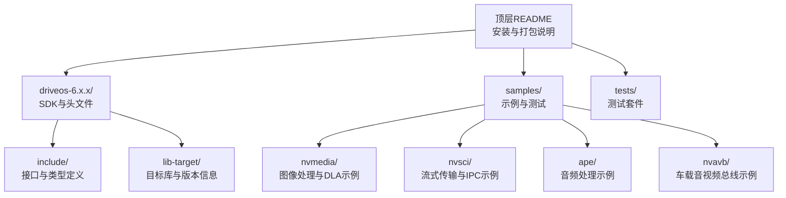
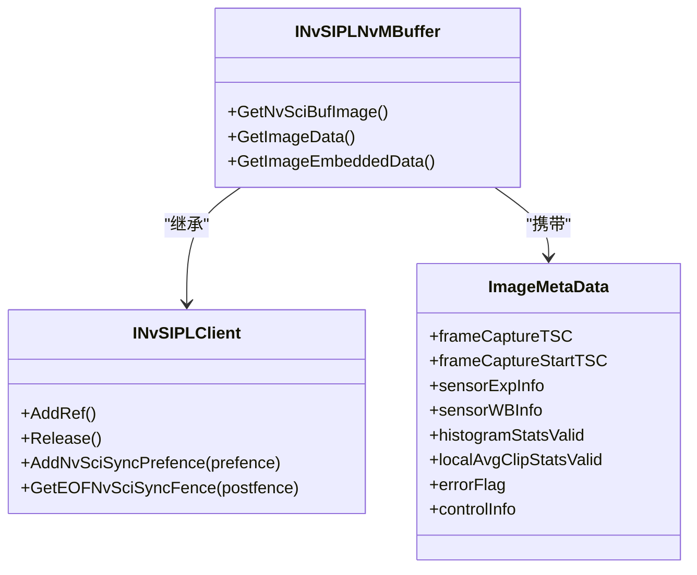
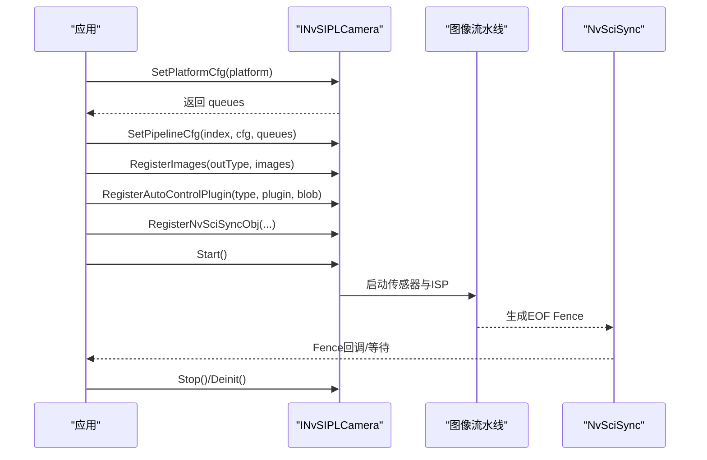
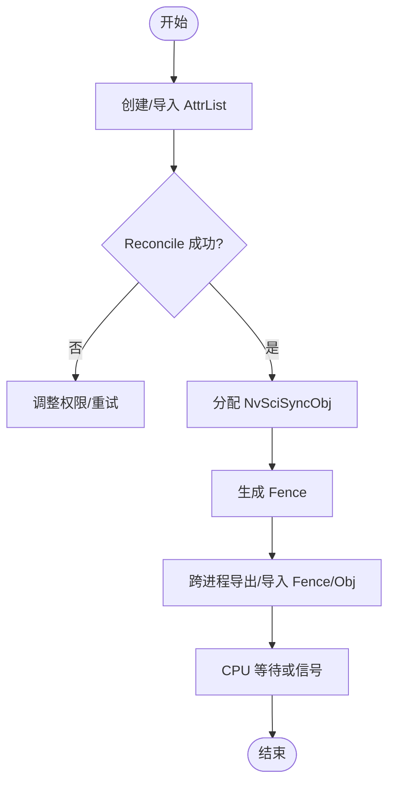
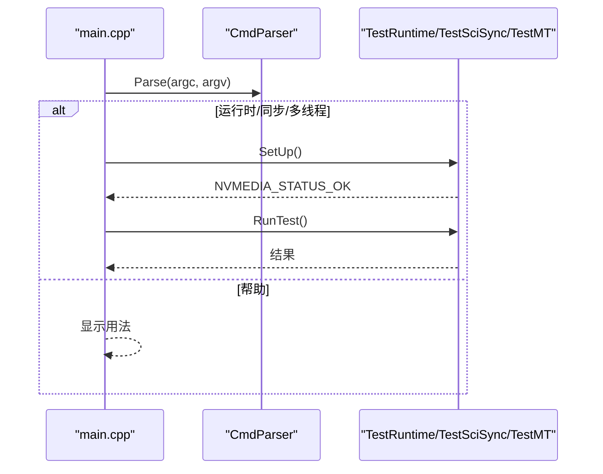
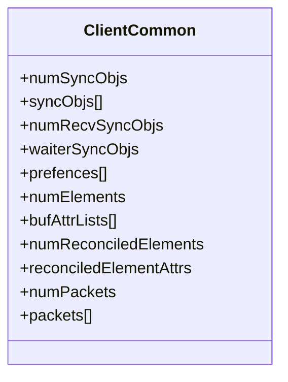
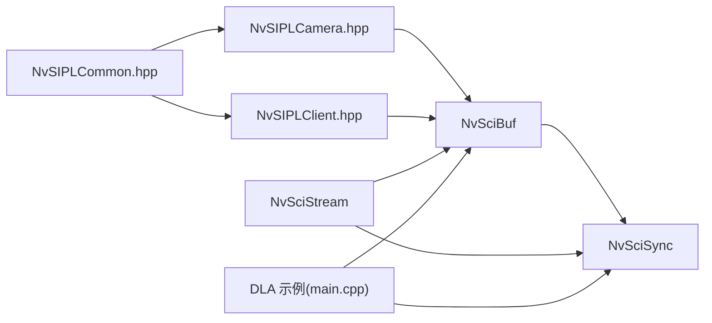

# 专家级实践指南

<cite>
**本文引用的文件**
- [README.md](file://README.md)
- [NvSIPLClient.hpp](file://driveos-6.0.5.0/drive-linux/include/NvSIPLClient.hpp)
- [NvSIPLCamera.hpp](file://driveos-6.0.5.0/drive-linux/include/NvSIPLCamera.hpp)
- [NvSIPLCommon.hpp](file://driveos-6.0.5.0/drive-linux/include/NvSIPLCommon.hpp)
- [nvscistream.h](file://driveos-6.0.5.0/drive-linux/include/nvscistream.h)
- [nvscisync.h](file://driveos-6.0.5.0/drive-linux/include/nvscisync.h)
- [main.cpp（DLA示例）](file://driveos-6.0.5.0/drive-linux/samples/nvmedia/dla_sample/main.cpp)
- [thread_utils.h](file://driveos-6.0.5.0/drive-linux/samples/nvmedia/utils/thread_utils.h)
- [client_common.h（单播流示例）](file://driveos-5260/drive-linux/samples/nvsci/nvscistream/unicast/client_common.h)
</cite>

## 目录
1. [引言](#引言)
2. [项目结构](#项目结构)
3. [核心组件](#核心组件)
4. [架构总览](#架构总览)
5. [详细组件分析](#详细组件分析)
6. [依赖关系分析](#依赖关系分析)
7. [性能考量](#性能考量)
8. [故障排除指南](#故障排除指南)
9. [结论](#结论)
10. [附录](#附录)

## 引言
本指南面向DriveOS高级开发者，聚焦于复杂场景下的系统设计与工程实践，包括多传感器融合、实时数据处理、跨进程同步与流式传输、分布式系统集成等。内容基于仓库中的接口定义与示例代码，提炼出可复用的架构模式、调试技巧、性能优化策略与团队协作规范，帮助提升项目成功率与技术深度。

## 项目结构
仓库以版本化目录组织，包含不同版本的驱动与SDK头文件、示例程序与测试工具。顶层README提供了安装与打包信息；核心功能由多组API与示例构成：图像采集与处理（SIPL/NvMedia）、跨进程同步（NvSciSync）、流式传输（NvSciStream）以及相关工具与测试。



图示来源
- [README.md:1-128](file://README.md#L1-L128)

章节来源
- [README.md:1-128](file://README.md#L1-L128)

## 核心组件
- SIPL（Sensor Image Pipeline）：提供从传感器到ISP/ICP输出的统一接口，支持平台配置、流水线配置、图像注册与启动停止控制，并通过NvSciBuf/NvSciSync实现缓冲与同步。
- NvMedia：图像处理与加速（如DLA）运行时与测试框架，覆盖运行时、同步与多线程测试。
- NvSciStream/NvSciSync：提供跨进程数据包流式传输与同步对象管理，支撑多模块协作与实时性保障。
- 示例与测试：包含多传感器采集、流式传输、DLA推理、多线程与同步验证等典型场景。

章节来源
- [NvSIPLClient.hpp:1-368](file://driveos-6.0.5.0/drive-linux/include/NvSIPLClient.hpp#L1-L368)
- [NvSIPLCamera.hpp:1-800](file://driveos-6.0.5.0/drive-linux/include/NvSIPLCamera.hpp#L1-L800)
- [NvSIPLCommon.hpp:1-219](file://driveos-6.0.5.0/drive-linux/include/NvSIPLCommon.hpp#L1-L219)
- [nvscistream.h:1-32](file://driveos-6.0.5.0/drive-linux/include/nvscistream.h#L1-L32)
- [nvscisync.h:1-800](file://driveos-6.0.5.0/drive-linux/include/nvscisync.h#L1-L800)
- [main.cpp（DLA示例）:1-115](file://driveos-6.0.5.0/drive-linux/samples/nvmedia/dla_sample/main.cpp#L1-L115)

## 架构总览
下图展示了从传感器输入到图像输出的关键路径，以及跨进程同步与流式传输的协同方式。

```mermaid
graph TB
subgraph "传感器侧"
CAM["传感器"]
DES["解串器/Serializer"]
end
subgraph "驱动与管线"
SIPL["SIPL 客户端接口<br/>NvSIPLCamera/NvSIPLClient"]
PIPE["图像处理流水线<br/>ICP/ISP 输出"]
BUF["NvSciBuf 缓冲对象"]
end
subgraph "同步与流式传输"
SYNC["NvSciSync 同步对象<br/>Fence/AttrList/Obj"]
STREAM["NvSciStream 流式传输<br/>数据包/队列"]
end
subgraph "应用与测试"
APP["应用/算法模块"]
DLA["NvMedia DLA 测试"]
THREAD["多线程与同步工具"]
end
CAM --> DES --> SIPL --> PIPE --> BUF
BUF <- --> SYNC
BUF <- --> STREAM
SYNC --> APP
STREAM --> APP
DLA --> BUF
THREAD --> SYNC
```

图示来源
- [NvSIPLClient.hpp:1-368](file://driveos-6.0.5.0/drive-linux/include/NvSIPLClient.hpp#L1-L368)
- [NvSIPLCamera.hpp:1-800](file://driveos-6.0.5.0/drive-linux/include/NvSIPLCamera.hpp#L1-L800)
- [nvscisync.h:1-800](file://driveos-6.0.5.0/drive-linux/include/nvscisync.h#L1-L800)
- [nvscistream.h:1-32](file://driveos-6.0.5.0/drive-linux/include/nvscistream.h#L1-L32)
- [main.cpp（DLA示例）:1-115](file://driveos-6.0.5.0/drive-linux/samples/nvmedia/dla_sample/main.cpp#L1-L115)

## 详细组件分析

### SIPL客户端与图像缓冲接口
- 图像元数据与嵌入数据：封装帧时间戳、曝光/白平衡/温度等统计与设置，便于上层算法进行动态控制与质量评估。
- 缓冲抽象：INvSIPLBuffer/INvSIPLNvMBuffer定义了引用计数、EOF Fence获取与NvSciBuf对象访问，确保跨模块共享与生命周期安全。
- 输出类型：支持ICP、ISP0/1/2等多级输出，满足不同后处理需求。



图示来源
- [NvSIPLClient.hpp:46-361](file://driveos-6.0.5.0/drive-linux/include/NvSIPLClient.hpp#L46-L361)

章节来源
- [NvSIPLClient.hpp:1-368](file://driveos-6.0.5.0/drive-linux/include/NvSIPLClient.hpp#L1-L368)

### SIPL相机接口与流水线控制
- 平台配置与流水线配置：通过SetPlatformCfg/SetPipelineCfg建立传感器与处理链路，支持返回设备块通知队列。
- 自动控制插件：为启用ISP输出的流水线注册自动控制插件，结合NvSciSync Fence实现前后处理同步。
- 生命周期管理：Init/RegisterImages/Start/Stop/Deinit形成清晰的初始化与释放流程，错误查询与GPIO事件接口用于诊断。



图示来源
- [NvSIPLCamera.hpp:158-701](file://driveos-6.0.5.0/drive-linux/include/NvSIPLCamera.hpp#L158-L701)
- [nvscisync.h:587-628](file://driveos-6.0.5.0/drive-linux/include/nvscisync.h#L587-L628)

章节来源
- [NvSIPLCamera.hpp:1-800](file://driveos-6.0.5.0/drive-linux/include/NvSIPLCamera.hpp#L1-L800)
- [NvSIPLCommon.hpp:115-143](file://driveos-6.0.5.0/drive-linux/include/NvSIPLCommon.hpp#L115-L143)

### NvSciStream与NvSciSync：跨进程流式传输与同步
- NvSciStream：在多个应用模块间提供数据包序列的流式传输能力，常与NvSciBuf/NvSciSync配合使用。
- NvSciSync：提供同步对象、属性列表与Fence机制，支持CPU等待上下文、确定性Fence与任务状态缓冲，保障跨进程/跨模块时序一致性。



图示来源
- [nvscisync.h:729-731](file://driveos-6.0.5.0/drive-linux/include/nvscisync.h#L729-L731)
- [nvscisync.h:587-628](file://driveos-6.0.5.0/drive-linux/include/nvscisync.h#L587-L628)
- [nvscistream.h:19-31](file://driveos-6.0.5.0/drive-linux/include/nvscistream.h#L19-L31)

章节来源
- [nvscisync.h:1-800](file://driveos-6.0.5.0/drive-linux/include/nvscisync.h#L1-L800)
- [nvscistream.h:1-32](file://driveos-6.0.5.0/drive-linux/include/nvscistream.h#L1-L32)

### DLA测试与多线程同步
- DLA示例入口：解析命令行参数，选择运行时/同步/多线程测试，分别调用对应测试类的SetUp/RunTest。
- 多线程与同步：提供线程、事件、信号量与队列等基础工具，便于构建高性能并发路径。



图示来源
- [main.cpp（DLA示例）:21-115](file://driveos-6.0.5.0/drive-linux/samples/nvmedia/dla_sample/main.cpp#L21-L115)

章节来源
- [main.cpp（DLA示例）:1-115](file://driveos-6.0.5.0/drive-linux/samples/nvmedia/dla_sample/main.cpp#L1-L115)
- [thread_utils.h:1-70](file://driveos-6.0.5.0/drive-linux/samples/nvmedia/utils/thread_utils.h#L1-L70)

### 单播流式传输示例：同步对象与元素属性
- 同步对象数组与接收者映射：通过waiterSyncObjs/prefences实现前向Fence传递，保证迭代间的时序约束。
- 数据包元素属性：bufAttrLists与reconciledElementAttrs描述每个数据包的缓冲属性，确保跨进程一致的内存布局与格式。



图示来源
- [client_common.h（单播流示例）:123-145](file://driveos-5260/drive-linux/samples/nvsci/nvscistream/unicast/client_common.h#L123-L145)

章节来源
- [client_common.h（单播流示例）:123-145](file://driveos-5260/drive-linux/samples/nvsci/nvscistream/unicast/client_common.h#L123-L145)

## 依赖关系分析
- SIPL依赖NvSciBuf/NvSciSync以实现缓冲与同步；同时通过NvSIPLCommon定义的状态码与错误模型贯穿整个调用链。
- NvSciStream在SIPL之上提供流式传输能力，常与NvSciSync配合完成跨模块的数据与时序编排。
- 示例程序（DLA、流式传输）展示如何在真实场景中组合上述组件，形成端到端的数据通路。



图示来源
- [NvSIPLCommon.hpp:115-143](file://driveos-6.0.5.0/drive-linux/include/NvSIPLCommon.hpp#L115-L143)
- [NvSIPLCamera.hpp:158-701](file://driveos-6.0.5.0/drive-linux/include/NvSIPLCamera.hpp#L158-L701)
- [NvSIPLClient.hpp:46-361](file://driveos-6.0.5.0/drive-linux/include/NvSIPLClient.hpp#L46-L361)
- [nvscisync.h:587-628](file://driveos-6.0.5.0/drive-linux/include/nvscisync.h#L587-L628)
- [nvscistream.h:19-31](file://driveos-6.0.5.0/drive-linux/include/nvscistream.h#L19-L31)
- [main.cpp（DLA示例）:21-115](file://driveos-6.0.5.0/drive-linux/samples/nvmedia/dla_sample/main.cpp#L21-L115)

章节来源
- [NvSIPLCommon.hpp:1-219](file://driveos-6.0.5.0/drive-linux/include/NvSIPLCommon.hpp#L1-L219)
- [NvSIPLCamera.hpp:1-800](file://driveos-6.0.5.0/drive-linux/include/NvSIPLCamera.hpp#L1-L800)
- [NvSIPLClient.hpp:1-368](file://driveos-6.0.5.0/drive-linux/include/NvSIPLClient.hpp#L1-L368)
- [nvscisync.h:1-800](file://driveos-6.0.5.0/drive-linux/include/nvscisync.h#L1-L800)
- [nvscistream.h:1-32](file://driveos-6.0.5.0/drive-linux/include/nvscistream.h#L1-L32)
- [main.cpp（DLA示例）:1-115](file://driveos-6.0.5.0/drive-linux/samples/nvmedia/dla_sample/main.cpp#L1-L115)

## 性能考量
- 缓冲与内存布局：优先采用块对齐/半平面/平面等高效布局，减少拷贝与转换开销；在多输出场景下，合理选择表面类型与位深，避免不必要的格式转换。
- 同步与Fence：利用NvSciSync Fence实现无锁或低锁的跨阶段协调，避免全局互斥；对需要CPU等待的场景，使用CpuWaitContext降低轮询成本。
- 多线程与并发：通过线程池、信号量与队列解耦生产/消费阶段，结合批处理与流水线提高吞吐；注意避免热点竞争与死锁。
- 流式传输：在NvSciStream中复用PacketPool与Reconciled AttrList，减少频繁Reconcile带来的开销；控制数据包大小与元素数量，保持稳定的延迟分布。
- 调试与剖析：结合GetMaxErrorSize/GetErrorGPIOEventInfo定位硬件/链路异常；使用日志与计时统计评估瓶颈。

## 故障排除指南
- 初始化失败：检查SetPlatformCfg/SetPipelineCfg顺序与参数有效性；确认已调用RegisterImages/RegisterAutoControlPlugin并满足格式要求。
- 同步异常：核对NvSciSync Fence导出/导入路径与权限；确保Waiter/Signer角色匹配；必要时启用确定性Fence与任务状态缓冲。
- 错误查询：使用GetMaxErrorSize获取最大错误尺寸，再调用GetErrorGPIOEventInfo读取GPIO事件码，辅助定位链路/传感器问题。
- 资源泄漏：确保所有NvSciBufObj在Deinit前被正确释放；DLA示例中注意在退出路径清理NvSciSyncModule/CpuWaitContext等资源。
- 日志与诊断：参考示例中的LOG_INFO/LOG_ERR输出，结合命令行参数与测试用例逐步缩小问题范围。

章节来源
- [NvSIPLCamera.hpp:736-799](file://driveos-6.0.5.0/drive-linux/include/NvSIPLCamera.hpp#L736-L799)
- [nvscisync.h:663-694](file://driveos-6.0.5.0/drive-linux/include/nvscisync.h#L663-L694)
- [main.cpp（DLA示例）:95-114](file://driveos-6.0.5.0/drive-linux/samples/nvmedia/dla_sample/main.cpp#L95-L114)

## 结论
本指南基于DriveOS的SIPL、NvMedia、NvSciSync/NvSciStream等核心组件，总结了多传感器融合、实时数据处理与分布式系统集成的架构模式与工程实践。通过规范化的接口抽象、严格的生命周期管理与高效的同步机制，可在保证实时性的前提下实现高可靠与高扩展的系统设计。建议在实际项目中结合本文的调试与优化策略，持续完善测试与文档体系，提升交付质量与团队效率。

## 附录
- 版本与打包：顶层README提供了各版本SDK与包清单，便于快速定位所需组件与依赖。
- 示例索引：DLA示例、流式传输示例与多线程工具为复杂场景提供了可复用的模板与最佳实践参考。

章节来源
- [README.md:20-128](file://README.md#L20-L128)