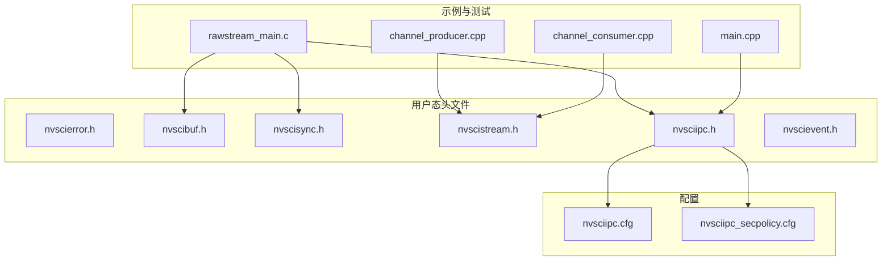
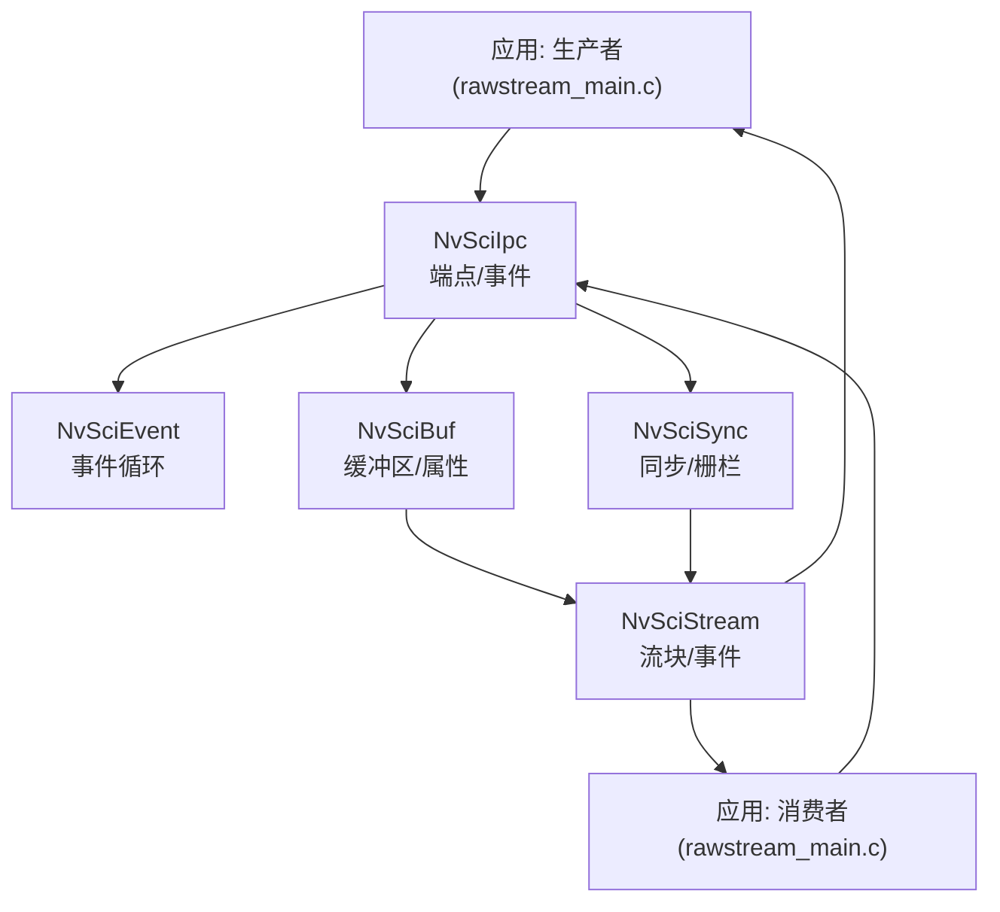
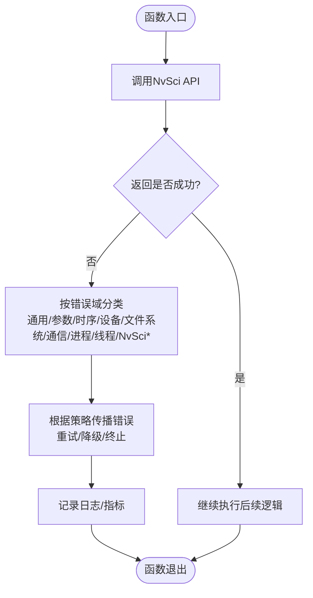
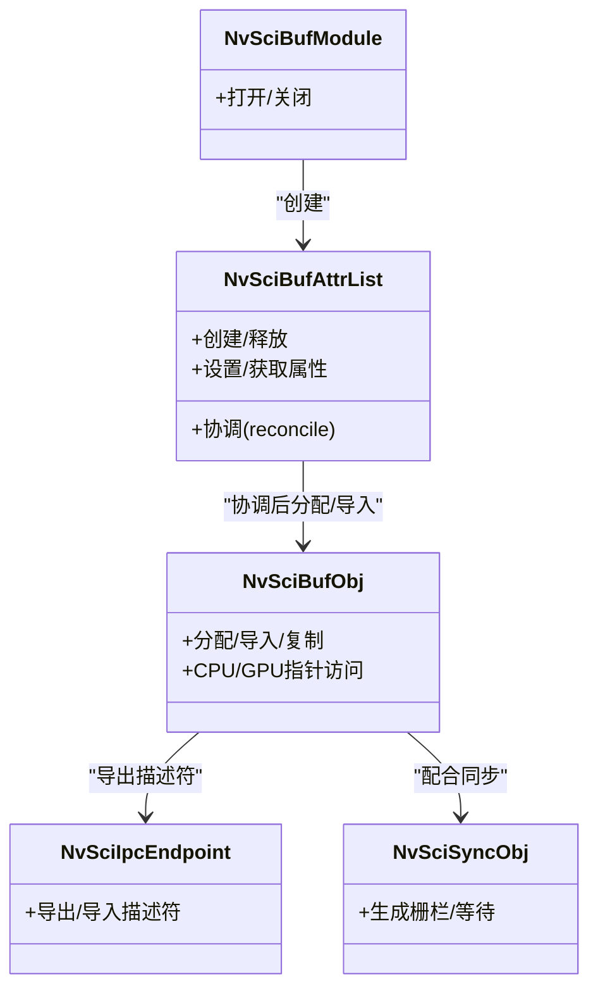
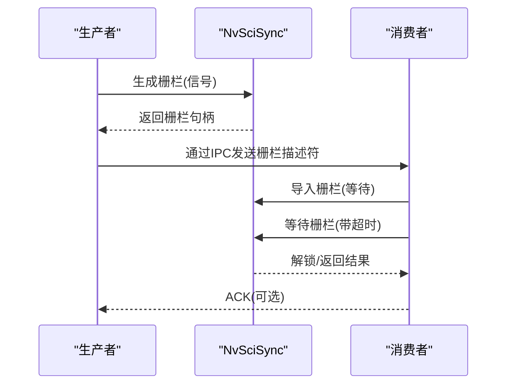
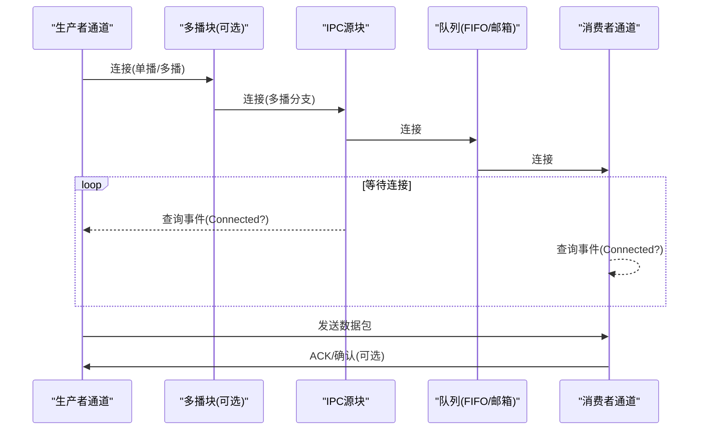
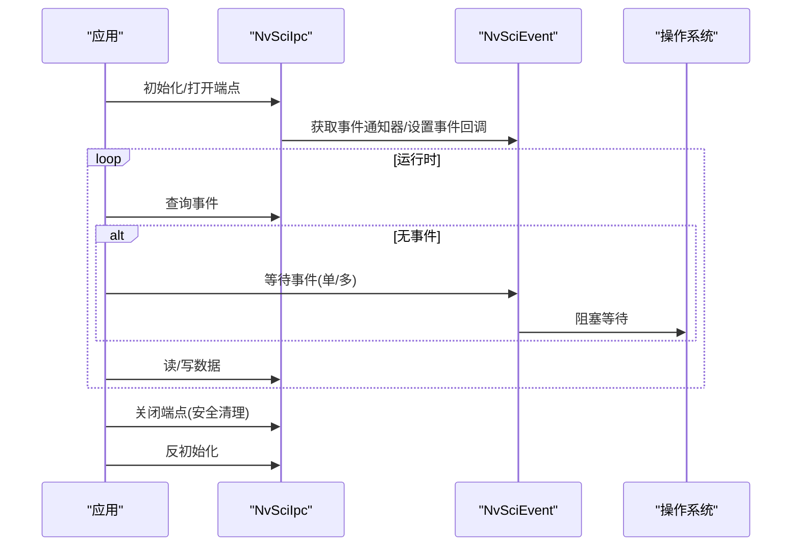
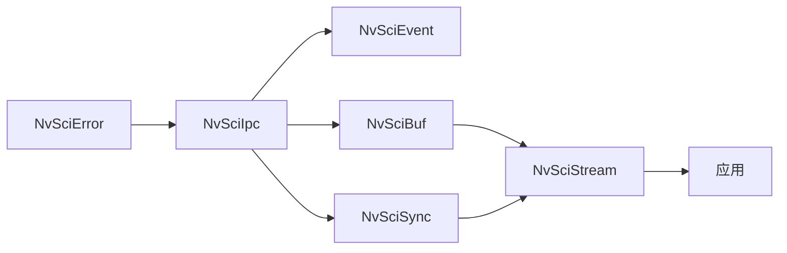

# 安全与可靠性

<cite>
**本文引用的文件**
- [nvscierror.h](file://driveos-6.0.5.0/usr/include/nvscierror.h)
- [nvscibuf.h](file://driveos-6.0.5.0/usr/include/nvscibuf.h)
- [nvscisync.h](file://driveos-6.0.5.0/usr/include/nvscisync.h)
- [nvscistream.h](file://driveos-6.0.5.0/usr/include/nvscistream.h)
- [nvsciipc.h](file://driveos-6.0.5.0/usr/include/nvsciipc.h)
- [nvscievent.h](file://driveos-6.0.5.0/usr/include/nvscievent.h)
- [nvsciipc.cfg](file://driveos-6.0.5.0/etc/nvsciipc.cfg)
- [nvsciipc_secpolicy.cfg](file://driveos-6.0.6.0/etc/nvsciipc_secpolicy.cfg)
- [rawstream_main.c](file://driveos-6.0.5.0/drive-linux/samples/nvsci/rawstream/rawstream_main.c)
- [channel_producer.cpp](file://driveos-5260/drive-linux/samples/nvsci/nvscistream/multicast_safety/channel_producer.cpp)
- [channel_consumer.cpp](file://driveos-5260/drive-linux/samples/nvsci/nvscistream/multicast_safety/channel_consumer.cpp)
- [main.cpp](file://driveos-6.0.5.0/drive-linux/tests/nvsys_init_time/main.cpp)
</cite>

## 目录
1. [引言](#引言)
2. [项目结构](#项目结构)
3. [核心组件](#核心组件)
4. [架构总览](#架构总览)
5. [详细组件分析](#详细组件分析)
6. [依赖关系分析](#依赖关系分析)
7. [性能考量](#性能考量)
8. [故障排查指南](#故障排查指南)
9. [结论](#结论)
10. [附录](#附录)

## 引言
本指南面向DriveOS平台的安全与可靠性设计，聚焦以下目标：
- 错误处理机制：异常处理、错误传播、降级策略
- 故障恢复策略：系统重启、状态恢复、数据保护
- 安全通信协议：NvSci IPC的安全配置、权限管理、访问控制
- 系统监控与诊断：日志记录、健康检查、性能监控
- 嵌入式系统特殊安全考虑：内存保护、中断处理、实时性保障
- 实际安全漏洞防护案例与最佳实践

本指南以仓库中的NvSci系列头文件、配置文件及示例代码为依据，结合代码级流程图与类图，帮助读者建立从接口到实现的完整理解。

## 项目结构
本仓库围绕DriveOS提供多版本的驱动与SDK，其中与安全与可靠性直接相关的核心内容集中在：
- 用户态头文件：nvscierror.h、nvscibuf.h、nvscisync.h、nvscistream.h、nvsciipc.h、nvscievent.h
- 配置文件：nvsciipc.cfg（通道与队列参数）、nvsciipc_secpolicy.cfg（用户与端点映射）
- 示例与测试：rawstream示例、nvscistream多播/单播生产者/消费者通道、nvsys_init_time测试用例

**图表来源**
- [nvscierror.h:1-281](file://driveos-6.0.5.0/usr/include/nvscierror.h#L1-L281)
- [nvscibuf.h:1-4884](file://driveos-6.0.5.0/usr/include/nvscibuf.h#L1-L4884)
- [nvscisync.h:1-2809](file://driveos-6.0.5.0/usr/include/nvscisync.h#L1-L2809)
- [nvscistream.h:1-32](file://driveos-6.0.5.0/usr/include/nvscistream.h#L1-L32)
- [nvsciipc.h:1-1639](file://driveos-6.0.5.0/usr/include/nvsciipc.h#L1-L1639)
- [nvscievent.h:1-867](file://driveos-6.0.5.0/usr/include/nvscievent.h#L1-L867)
- [nvsciipc.cfg:1-81](file://driveos-6.0.5.0/etc/nvsciipc.cfg#L1-L81)
- [nvsciipc_secpolicy.cfg:1-37](file://driveos-6.0.6.0/etc/nvsciipc_secpolicy.cfg#L1-L37)
- [rawstream_main.c:1-210](file://driveos-6.0.5.0/drive-linux/samples/nvsci/rawstream/rawstream_main.c#L1-L210)
- [channel_producer.cpp:1-242](file://driveos-5260/drive-linux/samples/nvsci/nvscistream/multicast_safety/channel_producer.cpp#L1-L242)
- [channel_consumer.cpp:1-158](file://driveos-5260/drive-linux/samples/nvsci/nvscistream/multicast_safety/channel_consumer.cpp#L1-L158)
- [main.cpp:1-1603](file://driveos-6.0.5.0/drive-linux/tests/nvsys_init_time/main.cpp#L1-L1603)

**章节来源**
- [nvsciipc.cfg:1-81](file://driveos-6.0.5.0/etc/nvsciipc.cfg#L1-L81)
- [nvsciipc_secpolicy.cfg:1-37](file://driveos-6.0.6.0/etc/nvsciipc_secpolicy.cfg#L1-L37)

## 核心组件
- 错误码体系：统一的NvSciError枚举覆盖通用、参数、时序、设备、文件系统、通信、进程/线程、NvSciBuf/NvSciSync/NvSciStream/NvSciIpc/NvSciEvent等错误域，便于跨模块一致化处理与传播。
- 缓冲区与属性：NvSciBuf提供类型化缓冲区分配与导出，支持CPU/GPU缓存一致性、权限控制、GPU压缩等属性，确保跨进程共享的正确性与性能。
- 同步原语：NvSciSync提供跨进程同步对象与栅栏，支持确定性栅栏、时间戳槽位、任务状态槽位，满足高可靠场景下的时序与可观测性需求。
- 流通道：NvSciStream在Buf与Sync之上提供数据包流控、连接事件、资源映射与分发，支撑生产者-消费者模型与多播拓扑。
- IPC与事件：NvSciIpc负责端点打开、重置、读写与事件通知；NvSciEvent提供事件循环抽象，屏蔽OS差异，提升可移植性与可维护性。

**章节来源**
- [nvscierror.h:45-280](file://driveos-6.0.5.0/usr/include/nvscierror.h#L45-L280)
- [nvscibuf.h:115-333](file://driveos-6.0.5.0/usr/include/nvscibuf.h#L115-L333)
- [nvscisync.h:397-527](file://driveos-6.0.5.0/usr/include/nvscisync.h#L397-L527)
- [nvscistream.h:1-32](file://driveos-6.0.5.0/usr/include/nvscistream.h#L1-L32)
- [nvsciipc.h:280-322](file://driveos-6.0.5.0/usr/include/nvsciipc.h#L280-L322)
- [nvscievent.h:140-188](file://driveos-6.0.5.0/usr/include/nvscievent.h#L140-L188)

## 架构总览
下图展示典型生产者-消费者链路在DriveOS上的安全与可靠性架构：IPC负责端点间通信与事件通知，NvSciBuf负责缓冲区共享与一致性，NvSciSync负责同步与栅栏，NvSciStream负责数据包流控与连接事件，NvSciEvent提供事件循环抽象。

**图表来源**
- [rawstream_main.c:34-168](file://driveos-6.0.5.0/drive-linux/samples/nvsci/rawstream/rawstream_main.c#L34-L168)
- [nvsciipc.h:96-151](file://driveos-6.0.5.0/usr/include/nvsciipc.h#L96-L151)
- [nvscievent.h:96-139](file://driveos-6.0.5.0/usr/include/nvscievent.h#L96-L139)
- [nvscibuf.h:115-333](file://driveos-6.0.5.0/usr/include/nvscibuf.h#L115-L333)
- [nvscisync.h:397-527](file://driveos-6.0.5.0/usr/include/nvscisync.h#L397-L527)
- [nvscistream.h:1-32](file://driveos-6.0.5.0/usr/include/nvscistream.h#L1-L32)

## 详细组件分析

### 组件A：错误处理与传播（NvSciError）
- 设计原则
  - 明确的错误域划分：通用、参数、时序、设备、文件系统、通信、进程/线程、NvSciBuf/NvSciSync/NvSciStream/NvSciIpc/NvSciEvent等，便于快速定位来源。
  - 与标准errno映射：部分错误码与标准错误一一对应，利于与底层系统调用协同诊断。
  - 可传播性：错误码通过返回值在各层API间传递，配合日志与上层策略进行降级或恢复。
- 实现要点
  - 在IPC、Buf、Sync、Stream各层均使用统一错误码，保证跨模块一致性。
  - 对于超时、忙、中断等临时性错误，建议采用指数退避与重试策略，并在上层进行熔断与告警。
- 降级策略
  - 当出现资源不足或不可用时，优先降低带宽/帧率/分辨率，或切换到本地处理路径。
  - 对于通信错误，可尝试重置端点或回退到更简单的后端（如线程内通信）。

**图表来源**
- [nvscierror.h:45-280](file://driveos-6.0.5.0/usr/include/nvscierror.h#L45-L280)

**章节来源**
- [nvscierror.h:45-280](file://driveos-6.0.5.0/usr/include/nvscierror.h#L45-L280)

### 组件B：缓冲区与属性（NvSciBuf）
- 数据结构与复杂度
  - 支持多种类型（RawBuffer/Image/Tensor/Array/Pyramid），每种类型有对应的属性键集，属性键由类型+键号构成，支持输入/输出属性与存在性约束（必选/可选/条件）。
  - 属性协调（reconcile）过程决定最终可用属性，涉及CPU/GPU缓存一致性、访问权限、GPU压缩、VIDMEM选择等，时间复杂度与参与方数量线性相关。
- 依赖链
  - Buf依赖IPC导出描述符与Sync权限，最终映射到具体内存区域。
- 优化机会
  - 合理设置缓存与压缩属性，减少CPU/GPU间数据拷贝与不一致风险。
  - 使用合适的对齐与尺寸，避免碎片化与TLB抖动。
- 安全要点
  - 权限控制：通过RequiredPerm/ActualPerm限制CPU/GPU访问粒度。
  - 缓存一致性：启用必要时的CPU/GPU缓存一致性标志，避免脏读/写。

**图表来源**
- [nvscibuf.h:115-333](file://driveos-6.0.5.0/usr/include/nvscibuf.h#L115-L333)
- [nvscibuf.h:345-742](file://driveos-6.0.5.0/usr/include/nvscibuf.h#L345-L742)

**章节来源**
- [nvscibuf.h:115-333](file://driveos-6.0.5.0/usr/include/nvscibuf.h#L115-L333)
- [nvscibuf.h:345-742](file://driveos-6.0.5.0/usr/include/nvscibuf.h#L345-L742)

### 组件C：同步与栅栏（NvSciSync）
- 设计模式
  - 提供Wait/Signal能力与确定性栅栏，支持CPU等待上下文与时间戳/任务状态槽位，便于调试与性能分析。
  - 权限模型：WaitOnly/SignalOnly/WaitSignal/Auto，确保最小权限原则。
- 处理逻辑
  - 通过AttrList声明所需权限与特性（如CPU访问、确定性栅栏、时间戳），经协调后在IPC对端生效。
  - 栅栏在信号侧生成，在等待侧消费，支持超时与中断。
- 性能影响
  - 时间戳/任务状态槽位会引入额外内存占用，应按需开启。
  - 确定性栅栏可能带来额外开销，仅在需要严格时序时启用。

**图表来源**
- [nvscisync.h:397-527](file://driveos-6.0.5.0/usr/include/nvscisync.h#L397-L527)
- [nvscisync.h:579-620](file://driveos-6.0.5.0/usr/include/nvscisync.h#L579-L620)

**章节来源**
- [nvscisync.h:397-527](file://driveos-6.0.5.0/usr/include/nvscisync.h#L397-L527)
- [nvscisync.h:579-620](file://driveos-6.0.5.0/usr/include/nvscisync.h#L579-L620)

### 组件D：流通道与事件（NvSciStream）
- 数据流
  - 生产者/消费者通过静态池、生产者/消费者块、队列（FIFO/邮箱）与IPC源/目的块连接，形成完整的数据通路。
  - 连接阶段通过事件查询等待“已连接”事件，确保上下游就绪后再进入流式阶段。
- 事件与错误处理
  - 通过NvSciStreamBlockEventQuery轮询事件，遇到超时或错误时进行重试或终止。
  - finalize阶段完成属性协调与资源映射，随后进入稳定流式阶段。
- 多播支持
  - 多消费者场景下，通过多播块将数据分发至多个IPC源块，简化拓扑。

**图表来源**
- [channel_producer.cpp:80-125](file://driveos-5260/drive-linux/samples/nvsci/nvscistream/multicast_safety/channel_producer.cpp#L80-L125)
- [channel_consumer.cpp:66-92](file://driveos-5260/drive-linux/samples/nvsci/nvscistream/multicast_safety/channel_consumer.cpp#L66-L92)

**章节来源**
- [channel_producer.cpp:80-125](file://driveos-5260/drive-linux/samples/nvsci/nvscistream/multicast_safety/channel_producer.cpp#L80-L125)
- [channel_consumer.cpp:66-92](file://driveos-5260/drive-linux/samples/nvsci/nvscistream/multicast_safety/channel_consumer.cpp#L66-L92)

### 组件E：IPC与事件服务（NvSciIpc/NvSciEvent）
- IPC初始化与端点生命周期
  - 初始化解析配置文件，打开端点，设置事件上报路径，重置端点以建立连接，运行时通过事件驱动读写。
  - 关闭时支持安全清理（清空TX队列），避免残留数据导致安全问题。
- 事件服务
  - NvSciEvent提供跨平台事件循环抽象，支持单事件与多事件等待，便于集中处理多个端点事件。
- 安全策略
  - 通过nvsciipc_secpolicy.cfg将特定用户绑定到指定端点集合，实现最小权限与访问控制。

**图表来源**
- [nvsciipc.h:82-151](file://driveos-6.0.5.0/usr/include/nvsciipc.h#L82-L151)
- [nvscievent.h:96-139](file://driveos-6.0.5.0/usr/include/nvscievent.h#L96-L139)
- [nvsciipc.h:350-376](file://driveos-6.0.5.0/usr/include/nvsciipc.h#L350-L376)

**章节来源**
- [nvsciipc.h:82-151](file://driveos-6.0.5.0/usr/include/nvsciipc.h#L82-L151)
- [nvscievent.h:96-139](file://driveos-6.0.5.0/usr/include/nvscievent.h#L96-L139)
- [nvsciipc.h:350-376](file://driveos-6.0.5.0/usr/include/nvsciipc.h#L350-L376)
- [nvsciipc.cfg:1-81](file://driveos-6.0.5.0/etc/nvsciipc.cfg#L1-L81)
- [nvsciipc_secpolicy.cfg:1-37](file://driveos-6.0.6.0/etc/nvsciipc_secpolicy.cfg#L1-L37)

### 组件F：示例与测试（rawstream、nvscistream、nvsys_init_time）
- rawstream示例
  - 展示了同步模块/缓冲模块的打开、IPC初始化、握手验证、线程启动与资源回收的完整流程，适合学习错误码与资源生命周期管理。
- nvscistream示例
  - 生产者/消费者通道分别演示了连接建立、事件查询、属性协调、资源映射与流式传输，体现可靠性设计中的事件驱动与超时处理。
- nvsys_init_time测试
  - 包含设备块通知、错误忽略状态机、自动恢复与插件加载等，体现系统级错误处理与自愈能力。

**章节来源**
- [rawstream_main.c:34-168](file://driveos-6.0.5.0/drive-linux/samples/nvsci/rawstream/rawstream_main.c#L34-L168)
- [channel_producer.cpp:127-156](file://driveos-5260/drive-linux/samples/nvsci/nvscistream/multicast_safety/channel_producer.cpp#L127-L156)
- [channel_consumer.cpp:94-130](file://driveos-5260/drive-linux/samples/nvsci/nvscistream/multicast_safety/channel_consumer.cpp#L94-L130)
- [main.cpp:93-200](file://driveos-6.0.5.0/drive-linux/tests/nvsys_init_time/main.cpp#L93-L200)

## 依赖关系分析
- 模块耦合
  - Stream依赖Buf与Sync；Buf与Sync依赖IPC；IPC依赖Event；Event为上层提供统一事件抽象。
- 外部依赖
  - 配置文件nvsciipc.cfg定义端点与队列参数；nvsciipc_secpolicy.cfg定义用户与端点映射，决定访问控制边界。
- 循环依赖
  - 未发现直接循环依赖；错误码作为横切关注点被所有模块使用，但不持有模块实例。

**图表来源**
- [nvsciipc.h:280-322](file://driveos-6.0.5.0/usr/include/nvsciipc.h#L280-L322)
- [nvscievent.h:140-188](file://driveos-6.0.5.0/usr/include/nvscievent.h#L140-L188)
- [nvscibuf.h:115-333](file://driveos-6.0.5.0/usr/include/nvscibuf.h#L115-L333)
- [nvscisync.h:397-527](file://driveos-6.0.5.0/usr/include/nvscisync.h#L397-L527)
- [nvscistream.h:1-32](file://driveos-6.0.5.0/usr/include/nvscistream.h#L1-L32)

**章节来源**
- [nvsciipc.h:280-322](file://driveos-6.0.5.0/usr/include/nvsciipc.h#L280-L322)
- [nvscievent.h:140-188](file://driveos-6.0.5.0/usr/include/nvscievent.h#L140-L188)
- [nvscibuf.h:115-333](file://driveos-6.0.5.0/usr/include/nvscibuf.h#L115-L333)
- [nvscisync.h:397-527](file://driveos-6.0.5.0/usr/include/nvscisync.h#L397-L527)
- [nvscistream.h:1-32](file://driveos-6.0.5.0/usr/include/nvscistream.h#L1-L32)

## 性能考量
- 缓存与一致性
  - 合理设置EnableCpuCache/EnableGpuCache与CPU/GPU缓存一致性标志，避免频繁刷新带来的性能损耗。
- 带宽与帧率
  - 在资源紧张时优先降低帧率/分辨率，或减少并发端点数，确保关键路径稳定。
- 事件驱动与阻塞
  - 使用NvSciEvent的多事件等待减少线程数量；对IPC读写采用非阻塞+事件轮询，避免忙等。
- 超时与退避
  - 对超时/忙/中断类错误采用指数退避与最大重试次数，防止雪崩效应。

[本节为通用指导，无需列出具体文件来源]

## 故障排查指南
- 日志与健康检查
  - 应用层在关键API调用前后记录错误码与参数，便于回溯。
  - 使用NvSciStream事件查询与NvSciIpc事件掩码判断连接状态与读写可用性。
- 自动恢复
  - 在设备块/链路错误场景中，结合自动恢复模块与错误忽略状态机，实现局部隔离与快速恢复。
- 配置校验
  - 校验nvsciipc.cfg中的端点名称、帧数与帧大小；核对nvsciipc_secpolicy.cfg中的用户与端点映射。

**章节来源**
- [main.cpp:149-200](file://driveos-6.0.5.0/drive-linux/tests/nvsys_init_time/main.cpp#L149-L200)
- [nvsciipc.cfg:1-81](file://driveos-6.0.5.0/etc/nvsciipc.cfg#L1-L81)
- [nvsciipc_secpolicy.cfg:1-37](file://driveos-6.0.6.0/etc/nvsciipc_secpolicy.cfg#L1-L37)

## 结论
本指南基于DriveOS的NvSci生态，系统阐述了错误处理、故障恢复、安全通信与监控诊断的关键设计与实现要点。通过统一错误码、严格的权限与缓存一致性、事件驱动的IPC与流通道、以及完善的配置与策略，可在复杂嵌入式场景中实现高可靠与高性能的数据通路。建议在实际工程中遵循最小权限、渐进降级、可观测性与可恢复性的原则，持续优化性能与稳定性。

[本节为总结性内容，无需列出具体文件来源]

## 附录
- 安全配置清单
  - 确认nvsciipc.cfg中的端点与队列参数符合预期
  - 核对nvsciipc_secpolicy.cfg中的用户与端点映射
  - 在生产环境启用必要的缓存一致性与权限控制
- 最佳实践
  - 所有API调用均检查返回错误码并记录上下文
  - 对临时性错误采用指数退避与最大重试
  - 在关键路径启用事件驱动与超时控制
  - 对缓冲区与同步对象进行生命周期管理与安全关闭

[本节为通用指导，无需列出具体文件来源]