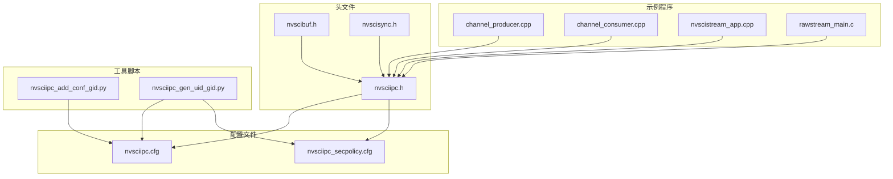
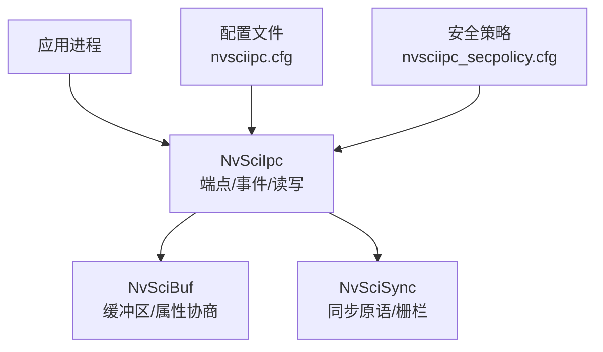
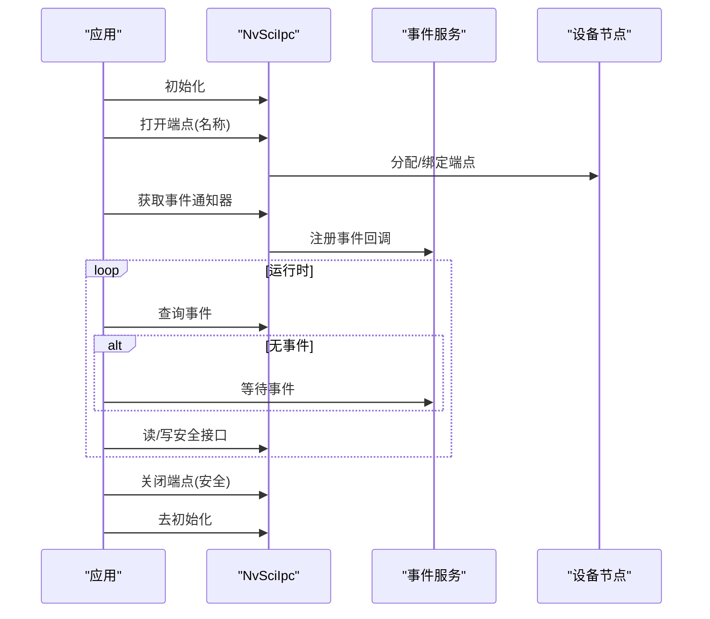
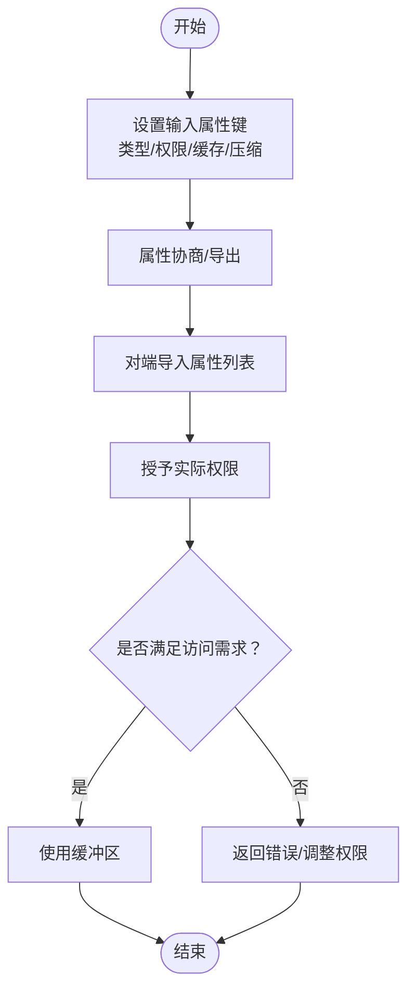
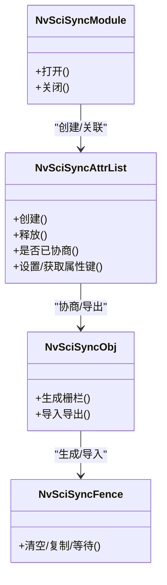
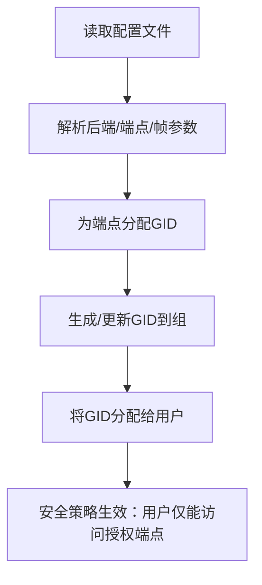
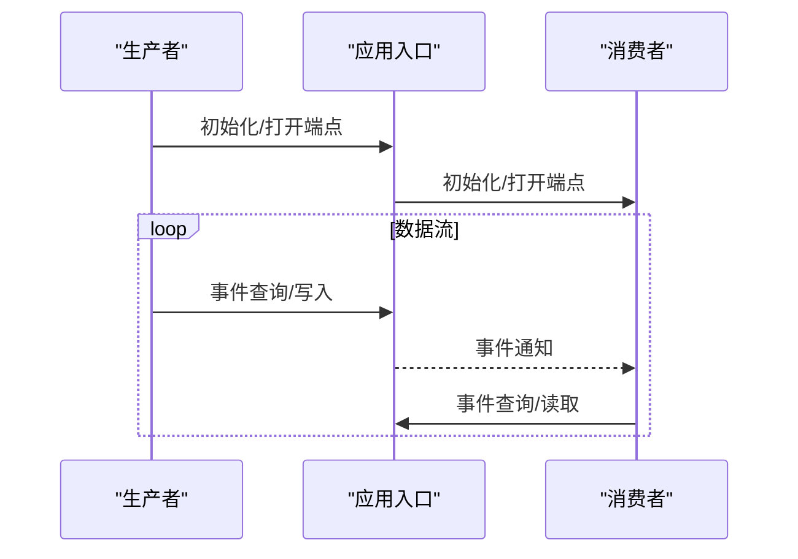
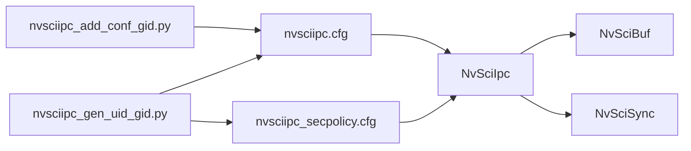

# 安全通信协议

<cite>
**本文引用的文件**
- [nvsciipc.h](file://driveos-6.0.5.0/usr/include/nvsciipc.h)
- [nvscibuf.h](file://driveos-6.0.5.0/usr/include/nvscibuf.h)
- [nvscisync.h](file://driveos-6.0.5.0/usr/include/nvscisync.h)
- [nvsciipc.cfg](file://driveos-6.0.5.0/etc/nvsciipc.cfg)
- [nvsciipc_secpolicy.cfg](file://driveos-6.0.6.0/etc/nvsciipc_secpolicy.cfg)
- [nvsciipc_add_conf_gid.py](file://driveos-6.0.6.0/usr/bin/nvsciipc_add_conf_gid.py)
- [nvsciipc_gen_uid_gid.py](file://driveos-6.0.6.0/usr/bin/nvsciipc_gen_uid_gid.py)
- [channel_producer.cpp](file://driveos-5260/drive-linux/samples/nvsci/nvscistream/multicast/channel_producer.cpp)
- [channel_consumer.cpp](file://driveos-5260/drive-linux/samples/nvsci/nvscistream/multicast/channel_consumer.cpp)
- [nvscistream_app.cpp](file://driveos-5260/drive-linux/samples/nvsci/nvscistream/multicast/nvscistream_app.cpp)
- [packet_pool_manager.cpp](file://driveos-5260/drive-linux/samples/nvsci/nvscistream/multicast/packet_pool_manager.cpp)
- [rawstream_main.c](file://driveos-5260/drive-linux/samples/nvsci/rawstream/rawstream_main.c)
</cite>

## 目录
1. [引言](#引言)
2. [项目结构](#项目结构)
3. [核心组件](#核心组件)
4. [架构总览](#架构总览)
5. [详细组件分析](#详细组件分析)
6. [依赖关系分析](#依赖关系分析)
7. [性能考虑](#性能考虑)
8. [故障排查指南](#故障排查指南)
9. [结论](#结论)
10. [附录](#附录)

## 引言
本文件面向DriveOS平台的NVIDIA Software Communications Interface（SCI）安全通信体系，聚焦NvSci IPC在多进程、跨VM与芯片间通信中的安全配置与访问控制机制。内容覆盖：
- 权限管理与访问控制列表（ACL）的配置与应用
- 进程间通信（IPC）的安全保障：数据完整性、身份认证、消息校验
- 用户/组权限验证、资源访问限制
- 配置示例与最佳实践：配置文件参数说明、安全策略制定、威胁防护
- 安全审计与监控：通信日志、异常行为检测、安全事件响应

## 项目结构
该仓库包含多个版本的驱动与示例，其中与NvSci IPC安全通信直接相关的文件主要分布在以下位置：
- 头文件：位于各版本的usr/include目录，定义IPC、缓冲区与同步对象接口
- 配置文件：位于etc目录，定义端点、后端类型、权限映射等
- 工具脚本：位于usr/bin目录，用于生成GID、更新配置文件
- 示例程序：位于samples目录，展示生产者/消费者通道、流式传输与原始流处理

**图表来源**
- [nvsciipc.h](file://driveos-6.0.5.0/usr/include/nvsciipc.h)
- [nvscibuf.h](file://driveos-6.0.5.0/usr/include/nvscibuf.h)
- [nvscisync.h](file://driveos-6.0.5.0/usr/include/nvscisync.h)
- [nvsciipc.cfg](file://driveos-6.0.5.0/etc/nvsciipc.cfg)
- [nvsciipc_secpolicy.cfg](file://driveos-6.0.6.0/etc/nvsciipc_secpolicy.cfg)
- [nvsciipc_add_conf_gid.py](file://driveos-6.0.6.0/usr/bin/nvsciipc_add_conf_gid.py)
- [nvsciipc_gen_uid_gid.py](file://driveos-6.0.6.0/usr/bin/nvsciipc_gen_uid_gid.py)
- [channel_producer.cpp](file://driveos-5260/drive-linux/samples/nvsci/nvscistream/multicast/channel_producer.cpp)
- [channel_consumer.cpp](file://driveos-5260/drive-linux/samples/nvsci/nvscistream/multicast/channel_consumer.cpp)
- [nvscistream_app.cpp](file://driveos-5260/drive-linux/samples/nvsci/nvscistream/multicast/nvscistream_app.cpp)
- [rawstream_main.c](file://driveos-5260/drive-linux/samples/nvsci/rawstream/rawstream_main.c)

**章节来源**
- [nvsciipc.h](file://driveos-6.0.5.0/usr/include/nvsciipc.h)
- [nvscibuf.h](file://driveos-6.0.5.0/usr/include/nvscibuf.h)
- [nvscisync.h](file://driveos-6.0.5.0/usr/include/nvscisync.h)
- [nvsciipc.cfg](file://driveos-6.0.5.0/etc/nvsciipc.cfg)
- [nvsciipc_secpolicy.cfg](file://driveos-6.0.6.0/etc/nvsciipc_secpolicy.cfg)
- [nvsciipc_add_conf_gid.py](file://driveos-6.0.6.0/usr/bin/nvsciipc_add_conf_gid.py)
- [nvsciipc_gen_uid_gid.py](file://driveos-6.0.6.0/usr/bin/nvsciipc_gen_uid_gid.py)

## 核心组件
- NvSciIpc：提供统一的跨线程/进程/VM/芯片间通信接口，支持事件通知、连接建立与读写操作
- NvSciBuf：缓冲区分配与共享，支持属性协商、CPU/GPU缓存一致性与访问权限控制
- NvSciSync：同步原语（栅栏/信号量）的跨进程/跨域共享，支持权限与时间戳能力
- 配置与策略：通过配置文件定义端点、后端类型、帧数与帧大小；通过安全策略文件绑定用户ID与端点集合

关键特性与约束：
- 事件模型：读/写/连接建立/重置等事件掩码，需在读写前查询事件状态
- 数据完整性：库不内置校验和，需应用层自行实现
- 线程模型：QNX建议单线程处理事件阻塞，避免竞争；Linux使用select/epoll或事件服务
- 最大端点数量：单进程最多打开500个端点

**章节来源**
- [nvsciipc.h](file://driveos-6.0.5.0/usr/include/nvsciipc.h)
- [nvscibuf.h](file://driveos-6.0.5.0/usr/include/nvscibuf.h)
- [nvscisync.h](file://driveos-6.0.5.0/usr/include/nvscisync.h)

## 架构总览
下图展示了NvSci IPC在系统中的角色与交互关系：应用通过NvSciIpc打开端点、建立连接、进行事件轮询与数据读写；NvSciBuf/NvSciSync作为上层能力提供缓冲与同步支撑。

**图表来源**
- [nvsciipc.h](file://driveos-6.0.5.0/usr/include/nvsciipc.h)
- [nvscibuf.h](file://driveos-6.0.5.0/usr/include/nvscibuf.h)
- [nvscisync.h](file://driveos-6.0.5.0/usr/include/nvscisync.h)
- [nvsciipc.cfg](file://driveos-6.0.5.0/etc/nvsciipc.cfg)
- [nvsciipc_secpolicy.cfg](file://driveos-6.0.6.0/etc/nvsciipc_secpolicy.cfg)

## 详细组件分析

### 组件A：NvSci IPC 初始化与端点管理
- 初始化与去初始化：解析配置文件，建立内部端点数据库
- 打开端点：根据名称定位端点，返回句柄；支持带事件服务的打开方式
- 事件通知：获取事件通知器，结合事件服务或OS阻塞API等待事件
- 连接复位与关闭：提供安全版本的复位与关闭，确保队列清理与资源释放

**图表来源**
- [nvsciipc.h](file://driveos-6.0.5.0/usr/include/nvsciipc.h)

**章节来源**
- [nvsciipc.h](file://driveos-6.0.5.0/usr/include/nvsciipc.h)

### 组件B：NvSciBuf 缓冲区与访问控制
- 属性键：通用属性（类型、CPU/GPU访问需求、缓存一致性、压缩）、图像/张量等专用属性
- 访问权限：通过“所需权限”与“实际权限”键控制读/写能力
- 导出导入：跨IPC通道导出/导入属性列表与对象，权限在导出端受控
- 缓存一致性：CPU/GPU侧缓存维护标志，确保跨域可见性

**图表来源**
- [nvscibuf.h](file://driveos-6.0.5.0/usr/include/nvscibuf.h)

**章节来源**
- [nvscibuf.h](file://driveos-6.0.5.0/usr/include/nvscibuf.h)

### 组件C：NvSciSync 同步与权限
- 模块与上下文：模块打开/关闭，CPU等待上下文分配
- 属性键：CPU访问需求、所需权限、确定性栅栏、时间戳槽位等
- 栅栏导出：支持跨IPC路径导出栅栏描述符，保证一致性
- 任务状态：可选的任务状态缓冲，记录信号者任务状态

**图表来源**
- [nvscisync.h](file://driveos-6.0.5.0/usr/include/nvscisync.h)

**章节来源**
- [nvscisync.h](file://driveos-6.0.5.0/usr/include/nvscisync.h)

### 组件D：配置与安全策略
- 端点配置：定义后端类型（线程/进程/VM/芯片）、端点名、帧数与帧大小、可选GID
- 安全策略：将用户ID与端点集合绑定，限定进程可访问的端点范围
- 工具脚本：自动生成/更新GID并将其分配给用户组，简化部署

**图表来源**
- [nvsciipc.cfg](file://driveos-6.0.5.0/etc/nvsciipc.cfg)
- [nvsciipc_secpolicy.cfg](file://driveos-6.0.6.0/etc/nvsciipc_secpolicy.cfg)
- [nvsciipc_add_conf_gid.py](file://driveos-6.0.6.0/usr/bin/nvsciipc_add_conf_gid.py)
- [nvsciipc_gen_uid_gid.py](file://driveos-6.0.6.0/usr/bin/nvsciipc_gen_uid_gid.py)

**章节来源**
- [nvsciipc.cfg](file://driveos-6.0.5.0/etc/nvsciipc.cfg)
- [nvsciipc_secpolicy.cfg](file://driveos-6.0.6.0/etc/nvsciipc_secpolicy.cfg)
- [nvsciipc_add_conf_gid.py](file://driveos-6.0.6.0/usr/bin/nvsciipc_add_conf_gid.py)
- [nvsciipc_gen_uid_gid.py](file://driveos-6.0.6.0/usr/bin/nvsciipc_gen_uid_gid.py)

### 组件E：示例程序与工作流
- 流式传输示例：生产者/消费者通道、应用入口、包池管理
- 原始流示例：主程序入口，展示IPC读写流程

**图表来源**
- [channel_producer.cpp](file://driveos-5260/drive-linux/samples/nvsci/nvscistream/multicast/channel_producer.cpp)
- [channel_consumer.cpp](file://driveos-5260/drive-linux/samples/nvsci/nvscistream/multicast/channel_consumer.cpp)
- [nvscistream_app.cpp](file://driveos-5260/drive-linux/samples/nvsci/nvscistream/multicast/nvscistream_app.cpp)
- [packet_pool_manager.cpp](file://driveos-5260/drive-linux/samples/nvsci/nvscistream/multicast/packet_pool_manager.cpp)
- [rawstream_main.c](file://driveos-5260/drive-linux/samples/nvsci/rawstream/rawstream_main.c)

**章节来源**
- [channel_producer.cpp](file://driveos-5260/drive-linux/samples/nvsci/nvscistream/multicast/channel_producer.cpp)
- [channel_consumer.cpp](file://driveos-5260/drive-linux/samples/nvsci/nvscistream/multicast/channel_consumer.cpp)
- [nvscistream_app.cpp](file://driveos-5260/drive-linux/samples/nvsci/nvscistream/multicast/nvscistream_app.cpp)
- [packet_pool_manager.cpp](file://driveos-5260/drive-linux/samples/nvsci/nvscistream/multicast/packet_pool_manager.cpp)
- [rawstream_main.c](file://driveos-5260/drive-linux/samples/nvsci/rawstream/rawstream_main.c)

## 依赖关系分析
- 接口耦合：NvSciBuf/NvSciSync均依赖NvSciIpc提供的端点能力进行跨进程/跨域导出/导入
- 配置耦合：端点后端类型、帧参数与GID由配置文件决定；安全策略文件决定用户访问边界
- 脚本耦合：工具脚本负责将配置文件中的端点映射到系统GID，并将GID分配给用户组

**图表来源**
- [nvsciipc.cfg](file://driveos-6.0.5.0/etc/nvsciipc.cfg)
- [nvsciipc_secpolicy.cfg](file://driveos-6.0.6.0/etc/nvsciipc_secpolicy.cfg)
- [nvsciipc_add_conf_gid.py](file://driveos-6.0.6.0/usr/bin/nvsciipc_add_conf_gid.py)
- [nvsciipc_gen_uid_gid.py](file://driveos-6.0.6.0/usr/bin/nvsciipc_gen_uid_gid.py)
- [nvsciipc.h](file://driveos-6.0.5.0/usr/include/nvsciipc.h)
- [nvscibuf.h](file://driveos-6.0.5.0/usr/include/nvscibuf.h)
- [nvscisync.h](file://driveos-6.0.5.0/usr/include/nvscisync.h)

**章节来源**
- [nvsciipc.h](file://driveos-6.0.5.0/usr/include/nvsciipc.h)
- [nvscibuf.h](file://driveos-6.0.5.0/usr/include/nvscibuf.h)
- [nvscisync.h](file://driveos-6.0.5.0/usr/include/nvscisync.h)
- [nvsciipc.cfg](file://driveos-6.0.5.0/etc/nvsciipc.cfg)
- [nvsciipc_secpolicy.cfg](file://driveos-6.0.6.0/etc/nvsciipc_secpolicy.cfg)
- [nvsciipc_add_conf_gid.py](file://driveos-6.0.6.0/usr/bin/nvsciipc_add_conf_gid.py)
- [nvsciipc_gen_uid_gid.py](file://driveos-6.0.6.0/usr/bin/nvsciipc_gen_uid_gid.py)

## 性能考虑
- 事件阻塞：优先使用事件服务或单线程阻塞调用，减少线程创建开销
- 端点数量：单进程最多500个端点，合理规划端点复用与生命周期
- 线程池容量：QNX资源管理器线程池容量需评估并发请求数，避免阻塞
- 缓冲与同步：NvSciBuf/NvSciSync的权限与缓存一致性直接影响跨域可见性与性能

## 故障排查指南
常见问题与处理建议：
- 无法打开端点：检查配置文件中后端类型与端点名是否匹配，确认GID分配正确
- 事件未触发：确认事件查询与阻塞调用顺序，Linux使用select/epoll，QNX使用事件服务
- 数据完整性缺失：应用层实现校验和或消息摘要，NvSciIpc不提供内置校验
- 权限不足：核对安全策略文件中的用户ID与端点映射，确保用户具备相应GID

**章节来源**
- [nvsciipc.h](file://driveos-6.0.5.0/usr/include/nvsciipc.h)
- [nvsciipc_secpolicy.cfg](file://driveos-6.0.6.0/etc/nvsciipc_secpolicy.cfg)

## 结论
NvSci IPC在DriveOS中提供了统一的跨域通信能力，配合NvSciBuf/NvSciSync实现了缓冲与同步的跨进程/跨域共享。通过配置文件与安全策略文件，系统实现了基于用户/组的访问控制与资源隔离；工具脚本进一步简化了GID与用户组的自动化管理。应用层应关注事件驱动模型、线程模型与数据完整性校验，以构建安全、可靠且高性能的通信链路。

## 附录

### A. 配置文件参数说明
- nvsciipc.cfg
  - 后端类型：INTER_THREAD、INTER_PROCESS、INTER_VM、INTER_CHIP
  - 参数格式：端点名/端点名、帧数、帧大小（进程/线程），或端点名、队列号（VM）
  - 可选字段：GID（用于Linux组级访问控制）
- nvsciipc_secpolicy.cfg
  - 格式：用户ID:端点1,端点2,...,端点N
  - 作用：将用户ID与端点集合绑定，限制其可访问的IPC端点

**章节来源**
- [nvsciipc.cfg](file://driveos-6.0.5.0/etc/nvsciipc.cfg)
- [nvsciipc_secpolicy.cfg](file://driveos-6.0.6.0/etc/nvsciipc_secpolicy.cfg)

### B. 安全策略制定与威胁防护
- 策略制定
  - 将不同业务域的端点分配至独立GID，最小化用户可访问范围
  - 使用工具脚本批量生成与分配GID，避免手工配置错误
- 威胁防护
  - 防止越权访问：严格遵循安全策略文件中的用户-端点映射
  - 防止拒绝服务：QNX场景下避免滥用脉冲池，必要时启用事件风暴检测
  - 数据完整性：应用层实现消息校验与完整性保护

**章节来源**
- [nvsciipc_add_conf_gid.py](file://driveos-6.0.6.0/usr/bin/nvsciipc_add_conf_gid.py)
- [nvsciipc_gen_uid_gid.py](file://driveos-6.0.6.0/usr/bin/nvsciipc_gen_uid_gid.py)
- [nvsciipc.h](file://driveos-6.0.5.0/usr/include/nvsciipc.h)

### C. 示例参考
- 流式传输：生产者/消费者通道、应用入口、包池管理
- 原始流：主程序入口，展示IPC读写流程

**章节来源**
- [channel_producer.cpp](file://driveos-5260/drive-linux/samples/nvsci/nvscistream/multicast/channel_producer.cpp)
- [channel_consumer.cpp](file://driveos-5260/drive-linux/samples/nvsci/nvscistream/multicast/channel_consumer.cpp)
- [nvscistream_app.cpp](file://driveos-5260/drive-linux/samples/nvsci/nvscistream/multicast/nvscistream_app.cpp)
- [packet_pool_manager.cpp](file://driveos-5260/drive-linux/samples/nvsci/nvscistream/multicast/packet_pool_manager.cpp)
- [rawstream_main.c](file://driveos-5260/drive-linux/samples/nvsci/rawstream/rawstream_main.c)