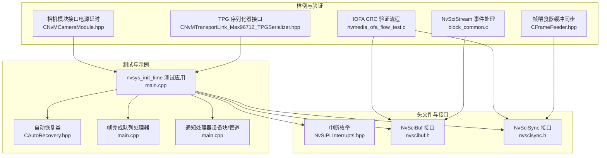
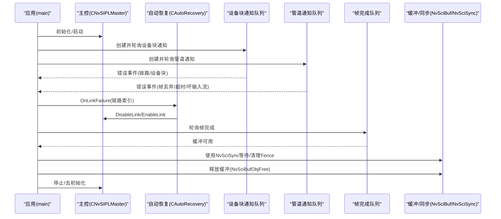
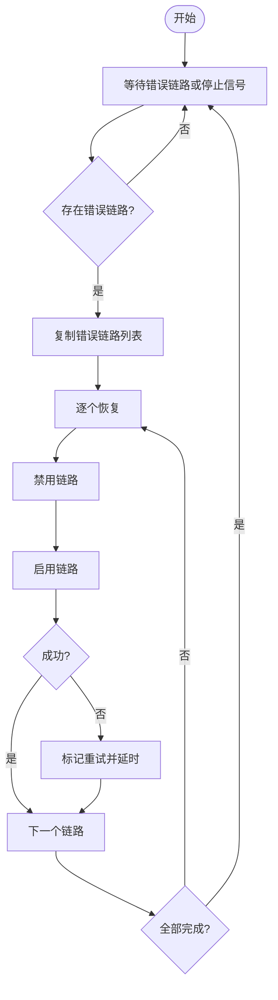
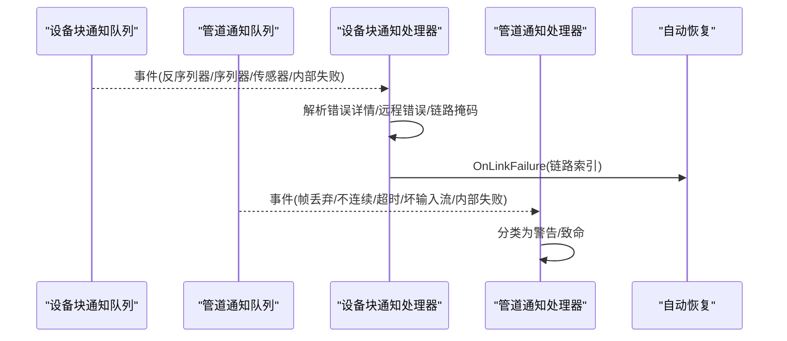
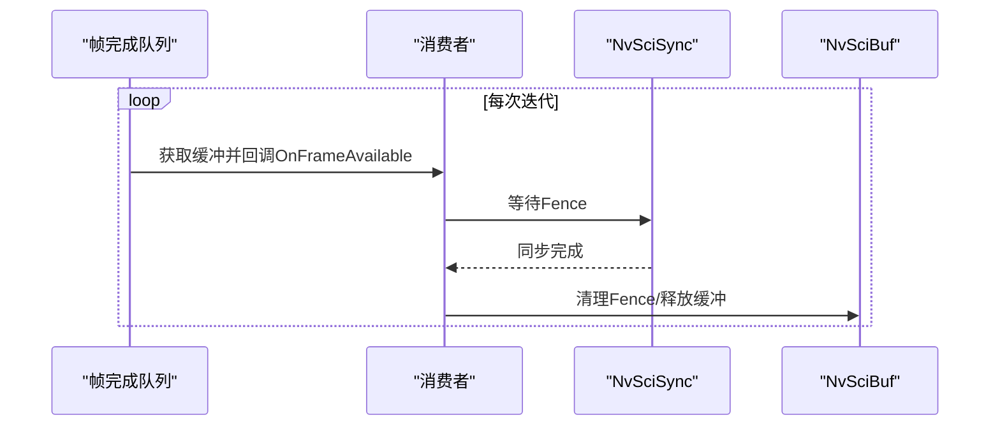
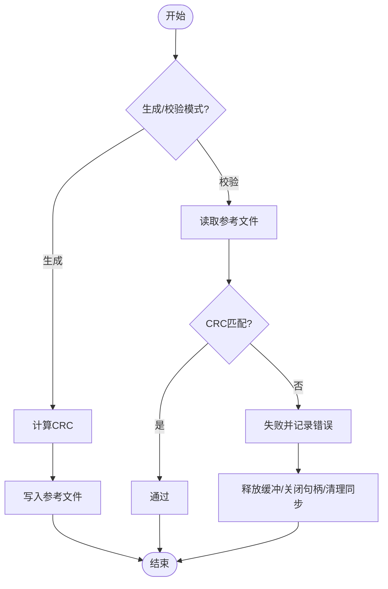
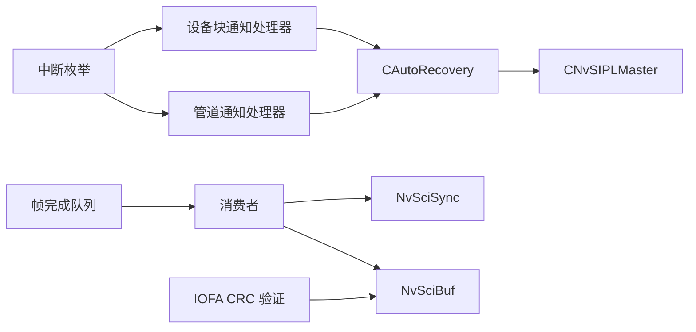

# 故障恢复策略

<cite>
**本文引用的文件**
- [CAutoRecovery.hpp](file://driveos-6.0.5.0/drive-linux/tests/nvsys_init_time/CAutoRecovery.hpp)
- [main.cpp](file://driveos-6.0.5.0/drive-linux/tests/nvsys_init_time/main.cpp)
- [NvSIPLInterrupts.hpp](file://driveos-6.0.5.0/drive-linux/include/NvSIPLInterrupts.hpp)
- [nvmedia_ofa_flow_test.c](file://driveos-6.0.6.0/drive-linux/samples/nvmedia_6x/iofa/flow/nvmedia_ofa_flow_test.c)
- [nvscibuf.h](file://driveos-6.0.6.0/drive-linux/include/nvscibuf.h)
- [nvscisync.h](file://driveos-60100/usr/include/nvscisync.h)
- [block_common.c](file://driveos-60100/drive-linux/samples/nvsci/nvscistream/event/block_common.c)
- [CFrameFeeder.hpp](file://driveos-6.0.5.0/drive-linux/samples/nvmedia/nvsipl/test/camera/CFrameFeeder.hpp)
- [CNvMTransportLink_Max96712_TPGSerializer.hpp](file://driveos-6.0.5.0/drive-linux/samples/nvmedia/nvsipl/devblk/cameramodule/MAX96712cameramodule/CNvMTransportLink_Max96712_TPGSerializer.hpp)
- [CNvMCameraModule.hpp](file://driveos-6.0.5.0/drive-linux/samples/nvmedia/nvsipl/devblk/common/ddi/ModuleIF/CNvMCameraModule.hpp)
</cite>

## 目录
1. [引言](#引言)
2. [项目结构](#项目结构)
3. [核心组件](#核心组件)
4. [架构总览](#架构总览)
5. [详细组件分析](#详细组件分析)
6. [依赖关系分析](#依赖关系分析)
7. [性能考量](#性能考量)
8. [故障排查指南](#故障排查指南)
9. [结论](#结论)
10. [附录](#附录)

## 引言
本指南围绕 NVIDIA DRIVE OS 的故障恢复策略，系统阐述系统重启与优雅关闭流程、进程间状态同步与缓冲区恢复、通信连接重建、数据完整性验证与备份恢复点管理，以及心跳检测、超时与重试机制。文档以代码级实证为基础，结合自动驾驶场景的关键故障处理策略与最佳实践，帮助读者在真实硬件与驱动环境下构建稳健的容错体系。

## 项目结构
本仓库包含多个版本的 DRIVE OS 源码与示例，其中与故障恢复直接相关的核心模块集中在以下路径：
- 测试与示例：用于演示自动恢复、事件队列、帧完成队列与资源释放
- 头文件：定义中断类型、SCI 同步与缓冲接口
- 样例：基于 NvSciStream/NvSciBuf 的数据流与 CRC 验证流程

**图表来源**
- [main.cpp:1-1603](file://driveos-6.0.5.0/drive-linux/tests/nvsys_init_time/main.cpp#L1-1603)
- [CAutoRecovery.hpp:1-158](file://driveos-6.0.5.0/drive-linux/tests/nvsys_init_time/CAutoRecovery.hpp#L1-158)
- [NvSIPLInterrupts.hpp:1-117](file://driveos-6.0.5.0/drive-linux/include/NvSIPLInterrupts.hpp#L1-117)
- [nvscibuf.h:1-166](file://driveos-6.0.6.0/drive-linux/include/nvscibuf.h#L1-166)
- [nvscisync.h:1736-1765](file://driveos-60100/usr/include/nvscisync.h#L1736-1765)
- [nvmedia_ofa_flow_test.c:871-1935](file://driveos-6.0.6.0/drive-linux/samples/nvmedia_6x/iofa/flow/nvmedia_ofa_flow_test.c#L871-1935)
- [block_common.c:164-211](file://driveos-60100/drive-linux/samples/nvsci/nvscistream/event/block_common.c#L164-211)
- [CFrameFeeder.hpp:55-168](file://driveos-6.0.5.0/drive-linux/samples/nvmedia/nvsipl/test/camera/CFrameFeeder.hpp#L55-168)
- [CNvMCameraModule.hpp:505-715](file://driveos-6.0.5.0/drive-linux/samples/nvmedia/nvsipl/devblk/common/ddi/ModuleIF/CNvMCameraModule.hpp#L505-715)
- [CNvMTransportLink_Max96712_TPGSerializer.hpp:49-69](file://driveos-6.0.5.0/drive-linux/samples/nvmedia/nvsipl/devblk/cameramodule/MAX96712cameramodule/CNvMTransportLink_Max96712_TPGSerializer.hpp#L49-69)

**章节来源**
- [main.cpp:1-1603](file://driveos-6.0.5.0/drive-linux/tests/nvsys_init_time/main.cpp#L1-1603)
- [CAutoRecovery.hpp:1-158](file://driveos-6.0.5.0/drive-linux/tests/nvsys_init_time/CAutoRecovery.hpp#L1-158)

## 核心组件
- 自动恢复线程与链路恢复：通过专用线程周期性检查错误链路并执行禁用/启用操作，失败时按固定间隔重试。
- 事件与通知处理：设备块与管道级通知队列驱动的错误检测与分类，区分致命错误与可恢复错误。
- 帧完成队列与缓冲同步：基于 NvSciSync 的 CPU 等待上下文与 Fence 清理，确保缓冲区安全释放。
- 数据完整性验证：基于 NvSciBuf 的 CRC 计算与文件比对，支持生成与校验模式。
- 中断与错误码：统一的中断状态码定义，便于定位链路、电源、传感器等层面的故障。

**章节来源**
- [CAutoRecovery.hpp:24-158](file://driveos-6.0.5.0/drive-linux/tests/nvsys_init_time/CAutoRecovery.hpp#L24-158)
- [main.cpp:93-362](file://driveos-6.0.5.0/drive-linux/tests/nvsys_init_time/main.cpp#L93-362)
- [main.cpp:560-646](file://driveos-6.0.5.0/drive-linux/tests/nvsys_init_time/main.cpp#L560-646)
- [nvmedia_ofa_flow_test.c:871-965](file://driveos-6.0.6.0/drive-linux/samples/nvmedia_6x/iofa/flow/nvmedia_ofa_flow_test.c#L871-965)
- [NvSIPLInterrupts.hpp:27-111](file://driveos-6.0.5.0/drive-linux/include/NvSIPLInterrupts.hpp#L27-111)

## 架构总览
下图展示了从应用层到驱动层的故障恢复路径：应用启动后初始化主控、消费者、通知与帧完成队列；当发生链路或设备块错误时，通知处理器将错误上报至自动恢复线程；自动恢复线程对链路执行禁用/启用操作；同时，帧完成队列与缓冲同步确保资源被正确释放；最后，IOFA 样例通过 CRC 验证保障输出数据一致性。

**图表来源**
- [main.cpp:1158-1599](file://driveos-6.0.5.0/drive-linux/tests/nvsys_init_time/main.cpp#L1158-1599)
- [CAutoRecovery.hpp:86-135](file://driveos-6.0.5.0/drive-linux/tests/nvsys_init_time/CAutoRecovery.hpp#L86-135)
- [CFrameFeeder.hpp:133-168](file://driveos-6.0.5.0/drive-linux/samples/nvmedia/nvsipl/test/camera/CFrameFeeder.hpp#L133-168)
- [nvscisync.h:1736-1765](file://driveos-60100/usr/include/nvscisync.h#L1736-1765)

## 详细组件分析

### 组件A：自动恢复线程与链路恢复
- 触发条件：设备块通知处理器检测到链路错误掩码后，调用自动恢复对象的 OnLinkFailure。
- 执行逻辑：线程循环等待或被唤醒，复制错误链路列表，逐个尝试禁用/启用；若失败则标记重试并在固定间隔后重试。
- 关键点：使用互斥锁与条件变量协调；避免重复标记同一链路；失败时延时退避。

**图表来源**
- [CAutoRecovery.hpp:86-135](file://driveos-6.0.5.0/drive-linux/tests/nvsys_init_time/CAutoRecovery.hpp#L86-135)

**章节来源**
- [CAutoRecovery.hpp:24-158](file://driveos-6.0.5.0/drive-linux/tests/nvsys_init_time/CAutoRecovery.hpp#L24-158)
- [main.cpp:186-198](file://driveos-6.0.5.0/drive-linux/tests/nvsys_init_time/main.cpp#L186-198)

### 组件B：事件与通知处理（设备块/管道）
- 设备块通知：解析错误详情、远程错误与链路掩码，必要时触发自动恢复。
- 管道通知：记录帧丢弃、不连续、捕获超时、坏输入流等警告；某些错误被视为致命。
- 事件队列：独立线程轮询通知队列，超时/EOF/异常均做安全退出处理。

**图表来源**
- [main.cpp:148-362](file://driveos-6.0.5.0/drive-linux/tests/nvsys_init_time/main.cpp#L148-362)
- [main.cpp:424-557](file://driveos-6.0.5.0/drive-linux/tests/nvsys_init_time/main.cpp#L424-557)

**章节来源**
- [main.cpp:93-362](file://driveos-6.0.5.0/drive-linux/tests/nvsys_init_time/main.cpp#L93-362)
- [main.cpp:424-557](file://driveos-6.0.5.0/drive-linux/tests/nvsys_init_time/main.cpp#L424-557)

### 组件C：帧完成队列与缓冲同步
- 帧完成队列线程：遍历各输出队列获取缓冲，回调消费者处理，随后释放缓冲。
- 同步与 Fence：使用 NvSciSync CPU 等待上下文进行同步，处理完成后清理 Fence 并释放缓冲对象。
- 容错：超时/EOF/异常分支均设置退出标志，保证线程安全退出。

**图表来源**
- [main.cpp:591-635](file://driveos-6.0.5.0/drive-linux/tests/nvsys_init_time/main.cpp#L591-635)
- [CFrameFeeder.hpp:133-168](file://driveos-6.0.5.0/drive-linux/samples/nvmedia/nvsipl/test/camera/CFrameFeeder.hpp#L133-168)
- [nvscisync.h:1736-1765](file://driveos-60100/usr/include/nvscisync.h#L1736-1765)

**章节来源**
- [main.cpp:560-646](file://driveos-6.0.5.0/drive-linux/tests/nvsys_init_time/main.cpp#L560-646)
- [CFrameFeeder.hpp:55-168](file://driveos-6.0.5.0/drive-linux/samples/nvmedia/nvsipl/test/camera/CFrameFeeder.hpp#L55-168)

### 组件D：数据完整性验证与恢复点管理
- IOFA 样例通过 CRC 生成与校验保障输出一致性，支持 FLOW/COST 两种通道。
- 支持生成参考文件与校验模式，失败时记录详细错误信息并进入失败路径。
- 资源释放：在失败路径中统一释放所有缓冲对象，关闭文件句柄，释放 CPU 等待上下文与同步模块。

**图表来源**
- [nvmedia_ofa_flow_test.c:871-965](file://driveos-6.0.6.0/drive-linux/samples/nvmedia_6x/iofa/flow/nvmedia_ofa_flow_test.c#L871-965)
- [nvmedia_ofa_flow_test.c:1809-1935](file://driveos-6.0.6.0/drive-linux/samples/nvmedia_6x/iofa/flow/nvmedia_ofa_flow_test.c#L1809-1935)

**章节来源**
- [nvmedia_ofa_flow_test.c:871-965](file://driveos-6.0.6.0/drive-linux/samples/nvmedia_6x/iofa/flow/nvmedia_ofa_flow_test.c#L871-965)
- [nvmedia_ofa_flow_test.c:1809-1935](file://driveos-6.0.6.0/drive-linux/samples/nvmedia_6x/iofa/flow/nvmedia_ofa_flow_test.c#L1809-1935)

### 组件E：NvSciStream 事件与连接状态
- 事件类型：错误、断开、连接、设置完成等；断开时返回非错误状态，错误事件在特定条件下可视为可恢复。
- 连接建立：连接后等待无限超时，便于持续接收后续事件。

**章节来源**
- [block_common.c:164-211](file://driveos-60100/drive-linux/samples/nvsci/nvscistream/event/block_common.c#L164-211)

### 组件F：电源延时与链路模式（相机模块）
- 电源延时：模块接口定义上电/掉电后的等待时间，确保稳定后再编程或重启。
- 链路模式：标识 GMSL1/GMSL2，影响链路配置与恢复策略。

**章节来源**
- [CNvMCameraModule.hpp:618-715](file://driveos-6.0.5.0/drive-linux/samples/nvmedia/nvsipl/devblk/common/ddi/ModuleIF/CNvMCameraModule.hpp#L618-715)
- [CNvMTransportLink_Max96712_TPGSerializer.hpp:49-69](file://driveos-6.0.5.0/drive-linux/samples/nvmedia/nvsipl/devblk/cameramodule/MAX96712cameramodule/CNvMTransportLink_Max96712_TPGSerializer.hpp#L49-69)

## 依赖关系分析
- 自动恢复依赖主控接口的链路禁用/启用能力；设备块/管道通知处理器负责错误上报。
- 帧完成队列依赖消费者回调与 NvSciSync/Fence；缓冲对象由 NvSciBuf 管理。
- IOFA CRC 验证依赖 NvSciBuf 的 CRC 计算接口与文件 I/O。
- 中断枚举为统一的错误分类依据，便于快速定位问题来源。

**图表来源**
- [CAutoRecovery.hpp:24-158](file://driveos-6.0.5.0/drive-linux/tests/nvsys_init_time/CAutoRecovery.hpp#L24-158)
- [main.cpp:93-362](file://driveos-6.0.5.0/drive-linux/tests/nvsys_init_time/main.cpp#L93-362)
- [nvmedia_ofa_flow_test.c:871-965](file://driveos-6.0.6.0/drive-linux/samples/nvmedia_6x/iofa/flow/nvmedia_ofa_flow_test.c#L871-965)
- [NvSIPLInterrupts.hpp:27-111](file://driveos-6.0.5.0/drive-linux/include/NvSIPLInterrupts.hpp#L27-111)

**章节来源**
- [main.cpp:1158-1599](file://driveos-6.0.5.0/drive-linux/tests/nvsys_init_time/main.cpp#L1158-1599)
- [nvmedia_ofa_flow_test.c:1809-1935](file://driveos-6.0.6.0/drive-linux/samples/nvmedia_6x/iofa/flow/nvmedia_ofa_flow_test.c#L1809-1935)

## 性能考量
- 自动恢复线程采用固定间隔重试，避免频繁操作导致抖动；建议根据链路特性调整间隔参数。
- 事件队列轮询设置合理超时，防止长时间阻塞；在高负载场景下可考虑优先级调度。
- CRC 校验与文件 I/O 在批量处理时可能成为瓶颈，建议异步写入与分批处理。
- NvSciSync/Fence 的使用需注意清理时机，避免悬挂等待导致资源泄漏。

[本节为通用指导，无需具体文件分析]

## 故障排查指南
- 链路错误：检查设备块通知处理器是否上报链路掩码；确认自动恢复线程已调用禁用/启用；查看日志中“链路错误”与“恢复失败”的提示。
- 帧丢弃/不连续：关注管道通知处理器的帧丢弃与不连续计数；核对上游采集/ISP阶段是否存在超时或坏输入流。
- CRC 不一致：在 IOFA 流程中确认参考文件生成/校验模式；检查缓冲对象是否正确释放；核对文件句柄与路径。
- 资源泄漏：确保帧完成队列线程在异常路径中调用缓冲释放与同步模块关闭；检查 Fence 是否被清理。

**章节来源**
- [main.cpp:148-362](file://driveos-6.0.5.0/drive-linux/tests/nvsys_init_time/main.cpp#L148-362)
- [nvmedia_ofa_flow_test.c:1809-1935](file://driveos-6.0.6.0/drive-linux/samples/nvmedia_6x/iofa/flow/nvmedia_ofa_flow_test.c#L1809-1935)
- [nvscisync.h:1736-1765](file://driveos-60100/usr/include/nvscisync.h#L1736-1765)

## 结论
本指南基于 DRIVE OS 代码库中的测试与示例，总结了从应用层到驱动层的故障恢复路径：通过自动恢复线程、事件通知、帧完成队列与缓冲同步、CRC 验证与资源释放，形成闭环的容错体系。结合中断枚举与电源延时/链路模式等接口，可在自动驾驶场景中实现稳健的链路与设备块故障处理策略。

[本节为总结性内容，无需具体文件分析]

## 附录
- 心跳检测与超时处理：在通知处理器中对捕获超时与帧完成事件进行统计与记录，作为心跳与健康度指标。
- 重试机制：自动恢复线程在失败时延时重试，避免忙等；建议结合指数退避策略提升稳定性。
- 最佳实践：在关键路径中增加日志与告警；对资源释放与同步清理进行幂等检查；在多线程环境中严格使用互斥与条件变量。

[本节为通用指导，无需具体文件分析]