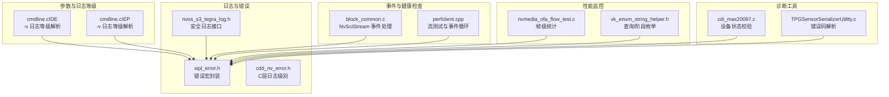
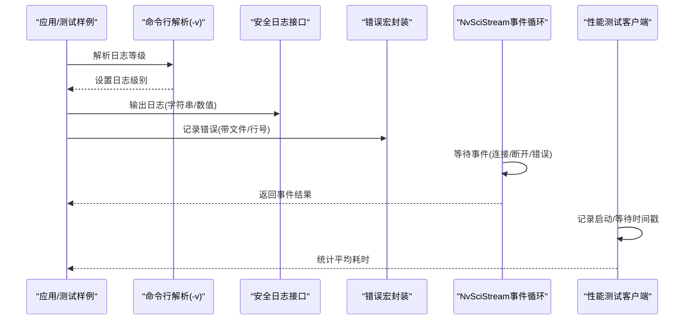
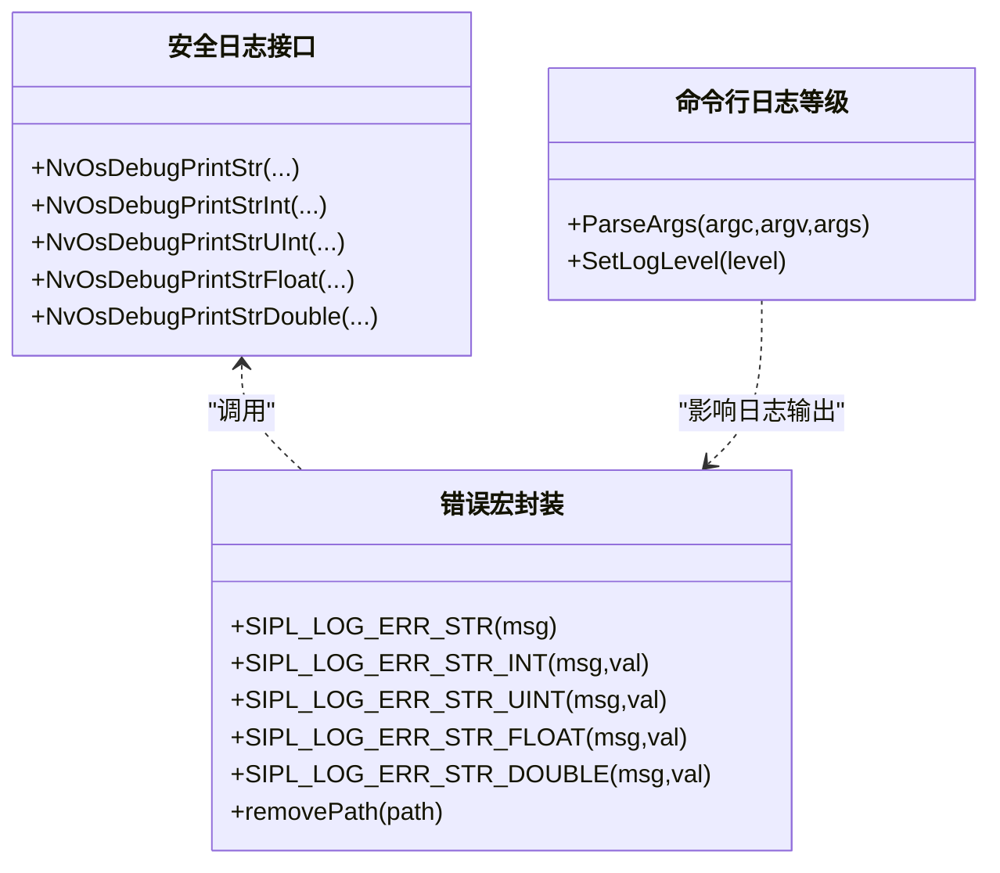
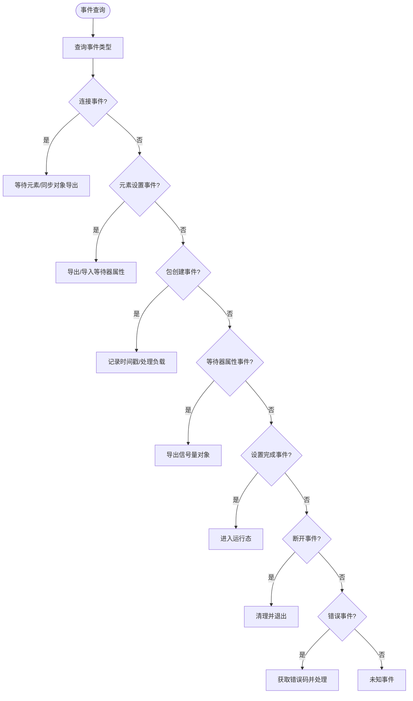
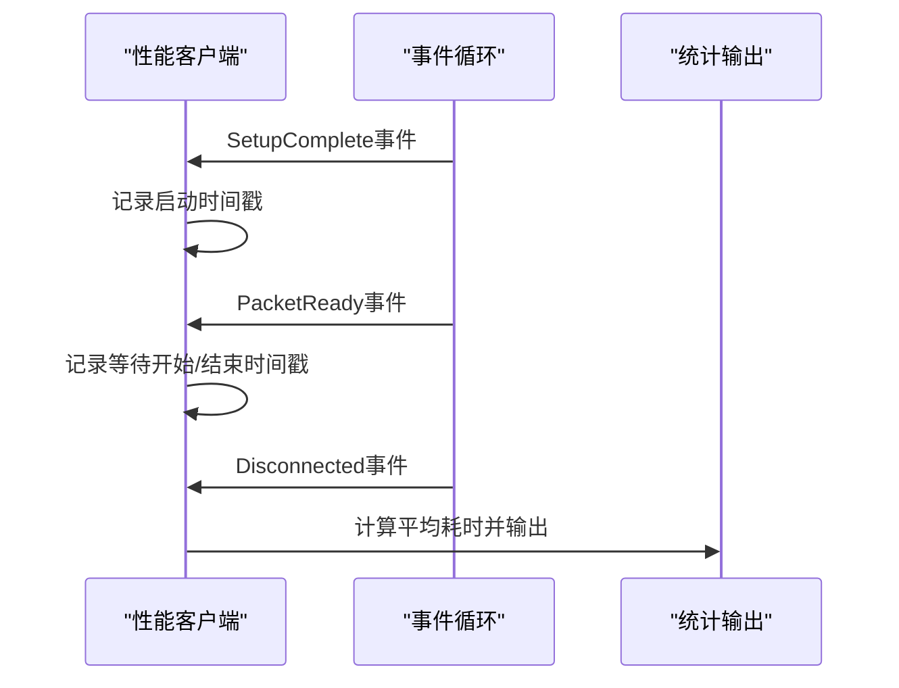
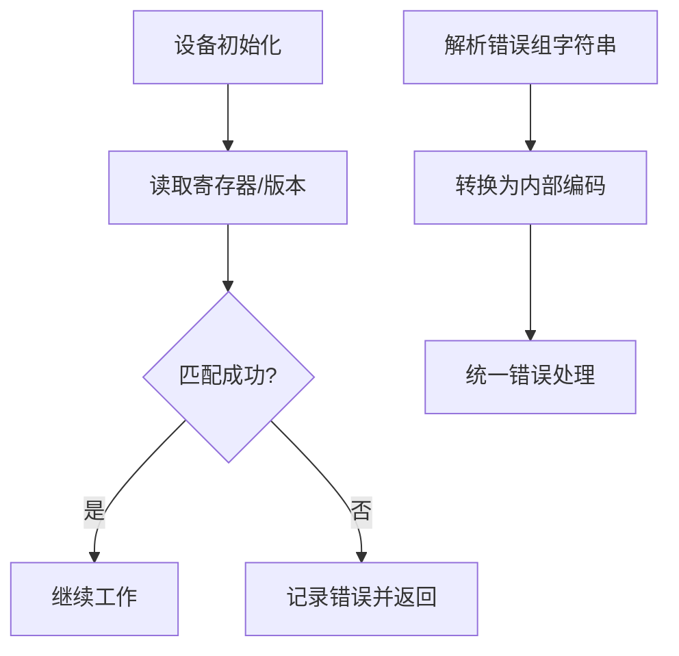
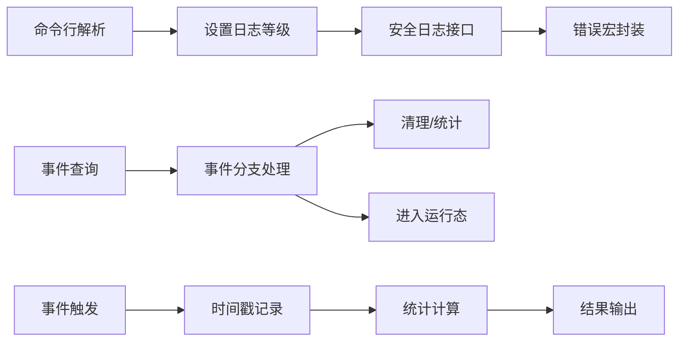

# 系统监控与诊断

<cite>
**本文引用的文件**
- [sipl_error.h](file://driveos-6081/drive-linux/samples/nvmedia/nvsipl/devblk/common/utils/sipl_error.h)
- [nvos_s3_tegra_log.h](file://driveos-60100/drive-linux/include/nvos_s3_tegra_log.h)
- [cmdline.c（IDE）](file://driveos-6.0.6.0/drive-linux/samples/nvmedia_6x/ide/cmdline.c)
- [cmdline.c（IEP）](file://driveos-6.0.6.0/drive-linux/samples/nvmedia_6x/iep/cmdline.c)
- [block_common.c](file://driveos-60100/drive-linux/samples/nvsci/nvscistream/event/block_common.c)
- [perfclient.cpp](file://driveos-6081/drive-linux/samples/nvsci/nvscistream/perf_tests/perfclient.cpp)
- [nvmedia_ofa_flow_test.c](file://driveos-6.0.6.0/drive-linux/samples/nvmedia_6x/iofa/flow/nvmedia_ofa_flow_test.c)
- [vk_enum_string_helper.h](file://driveos-6.0.6.0/drive-linux/samples/vulkan/vkcube/vk_enum_string_helper.h)
- [cdd_nv_error.h](file://driveos-6081/drive-linux/samples/nvmedia/nvsipl/devblk/devblk_new/logging/cdd_nv_error.h)
- [cdi_max20087.c](file://driveos-6081/drive-linux/samples/nvmedia/nvsipl/devblk/devices/MAX20087Driver/cdi_max20087.c)
- [TPGSensorSerializerUtility.c](file://driveos-6081/drive-linux/samples/nvmedia/nvsipl/devblk/devices/TPGSerializerDriver/TPGSensorSerializerUtility.c)
</cite>

## 目录
1. [简介](#简介)
2. [项目结构](#项目结构)
3. [核心组件](#核心组件)
4. [架构总览](#架构总览)
5. [详细组件分析](#详细组件分析)
6. [依赖关系分析](#依赖关系分析)
7. [性能考虑](#性能考虑)
8. [故障排查指南](#故障排查指南)
9. [结论](#结论)
10. [附录](#附录)

## 简介
本指南面向 NVIDIA DRIVE OS 的系统监控与诊断，围绕日志记录、健康检查、性能监控、诊断工具与数据分析等方面，结合仓库中的实际代码实现，给出可操作的配置与实践建议。内容覆盖：
- 日志级别与格式：统一的安全日志接口、错误宏封装、命令行日志等级控制
- 健康检查：事件驱动的连接/断开/错误处理、设备状态校验
- 性能监控：帧级统计、延迟测量、NvSciStream 流测试
- 诊断工具：参数解析与运行时选项、图形/编码器调试信息
- 数据分析与告警：平均耗时统计、异常检测思路

## 项目结构
本仓库在多个版本目录下提供了与监控诊断相关的组件，主要包括：
- 日志与错误：安全日志接口与 SIPL 错误宏封装
- 参数与日志等级：各媒体测试样例对 -v 日志等级的解析与设置
- 事件与健康检查：NvSciStream 事件循环与错误事件处理
- 性能测试：NvSciStream 性能客户端、IOFA 流测试统计
- 图形与编码器调试：Vulkan 查询标志、IEP/IDE 参数解析

**图表来源**
- [nvos_s3_tegra_log.h:1-547](file://driveos-60100/drive-linux/include/nvos_s3_tegra_log.h#L1-L547)
- [sipl_error.h:1-407](file://driveos-6081/drive-linux/samples/nvmedia/nvsipl/devblk/common/utils/sipl_error.h#L1-L407)
- [cmdline.c（IDE）:1-296](file://driveos-6.0.6.0/drive-linux/samples/nvmedia_6x/ide/cmdline.c#L1-L296)
- [cmdline.c（IEP）:1-486](file://driveos-6.0.6.0/drive-linux/samples/nvmedia_6x/iep/cmdline.c#L1-L486)
- [block_common.c:1-280](file://driveos-60100/drive-linux/samples/nvsci/nvscistream/event/block_common.c#L1-L280)
- [perfclient.cpp:1-322](file://driveos-6081/drive-linux/samples/nvsci/nvscistream/perf_tests/perfclient.cpp#L1-L322)
- [nvmedia_ofa_flow_test.c:988-1019](file://driveos-6.0.6.0/drive-linux/samples/nvmedia_6x/iofa/flow/nvmedia_ofa_flow_test.c#L988-L1019)
- [vk_enum_string_helper.h:1331-1457](file://driveos-6.0.6.0/drive-linux/samples/vulkan/vkcube/vk_enum_string_helper.h#L1331-L1457)
- [cdd_nv_error.h:1-43](file://driveos-6081/drive-linux/samples/nvmedia/nvsipl/devblk/devblk_new/logging/cdd_nv_error.h#L1-L43)
- [cdi_max20087.c:186-236](file://driveos-6081/drive-linux/samples/nvmedia/nvsipl/devblk/devices/MAX20087Driver/cdi_max20087.c#L186-L236)
- [TPGSensorSerializerUtility.c:67-114](file://driveos-6081/drive-linux/samples/nvmedia/nvsipl/devblk/devices/TPGSerializerDriver/TPGSensorSerializerUtility.c#L67-L114)

**章节来源**
- [sipl_error.h:1-407](file://driveos-6081/drive-linux/samples/nvmedia/nvsipl/devblk/common/utils/sipl_error.h#L1-L407)
- [nvos_s3_tegra_log.h:1-547](file://driveos-60100/drive-linux/include/nvos_s3_tegra_log.h#L1-L547)

## 核心组件
- 安全日志接口：提供字符串、整数、浮点等多类型日志输出函数，支持模块标识与严重级别
- 错误宏封装：为 SIPL 模块提供统一的错误日志宏，自动携带文件名与行号
- 命令行日志等级：IDE/IEP 示例通过 -v 控制日志等级，便于运行时调节
- 事件处理：NvSciStream 事件循环对连接、断开、错误进行处理
- 性能测试：流测试客户端记录启动/等待时间戳，统计吞吐与延迟
- 设备诊断：设备驱动中对寄存器读写、状态校验与错误码解析

**章节来源**
- [nvos_s3_tegra_log.h:56-540](file://driveos-60100/drive-linux/include/nvos_s3_tegra_log.h#L56-L540)
- [sipl_error.h:126-392](file://driveos-6081/drive-linux/samples/nvmedia/nvsipl/devblk/common/utils/sipl_error.h#L126-L392)
- [cmdline.c（IDE）:146-158](file://driveos-6.0.6.0/drive-linux/samples/nvmedia_6x/ide/cmdline.c#L146-L158)
- [cmdline.c（IEP）:257-269](file://driveos-6.0.6.0/drive-linux/samples/nvmedia_6x/iep/cmdline.c#L257-L269)
- [block_common.c:155-242](file://driveos-60100/drive-linux/samples/nvsci/nvscistream/event/block_common.c#L155-L242)
- [perfclient.cpp:237-321](file://driveos-6081/drive-linux/samples/nvsci/nvscistream/perf_tests/perfclient.cpp#L237-L321)
- [nvmedia_ofa_flow_test.c:992-1019](file://driveos-6.0.6.0/drive-linux/samples/nvmedia_6x/iofa/flow/nvmedia_ofa_flow_test.c#L992-L1019)

## 架构总览
下图展示了从应用到底层日志与事件处理的整体路径，以及性能测试与诊断工具的交互。

**图表来源**
- [cmdline.c（IDE）:146-158](file://driveos-6.0.6.0/drive-linux/samples/nvmedia_6x/ide/cmdline.c#L146-L158)
- [cmdline.c（IEP）:257-269](file://driveos-6.0.6.0/drive-linux/samples/nvmedia_6x/iep/cmdline.c#L257-L269)
- [nvos_s3_tegra_log.h:56-540](file://driveos-60100/drive-linux/include/nvos_s3_tegra_log.h#L56-L540)
- [sipl_error.h:126-392](file://driveos-6081/drive-linux/samples/nvmedia/nvsipl/devblk/common/utils/sipl_error.h#L126-L392)
- [block_common.c:125-242](file://driveos-60100/drive-linux/samples/nvsci/nvscistream/event/block_common.c#L125-L242)
- [perfclient.cpp:245-321](file://driveos-6081/drive-linux/samples/nvsci/nvscistream/perf_tests/perfclient.cpp#L245-L321)

## 详细组件分析

### 日志记录机制
- 安全日志接口：提供多种类型重载的日志输出函数，统一由安全日志模块承载
- 错误宏封装：为 SIPL 提供带文件名与行号的错误日志宏，便于快速定位
- 命令行日志等级：IDE/IEP 示例通过 -v 设置日志等级，范围通常为 0~3（错误/警告/信息/调试）

**图表来源**
- [nvos_s3_tegra_log.h:56-540](file://driveos-60100/drive-linux/include/nvos_s3_tegra_log.h#L56-L540)
- [sipl_error.h:126-392](file://driveos-6081/drive-linux/samples/nvmedia/nvsipl/devblk/common/utils/sipl_error.h#L126-L392)
- [cmdline.c（IDE）:146-158](file://driveos-6.0.6.0/drive-linux/samples/nvmedia_6x/ide/cmdline.c#L146-L158)
- [cmdline.c（IEP）:257-269](file://driveos-6.0.6.0/drive-linux/samples/nvmedia_6x/iep/cmdline.c#L257-L269)

**章节来源**
- [nvos_s3_tegra_log.h:56-540](file://driveos-60100/drive-linux/include/nvos_s3_tegra_log.h#L56-L540)
- [sipl_error.h:126-392](file://driveos-6081/drive-linux/samples/nvmedia/nvsipl/devblk/common/utils/sipl_error.h#L126-L392)
- [cmdline.c（IDE）:146-158](file://driveos-6.0.6.0/drive-linux/samples/nvmedia_6x/ide/cmdline.c#L146-L158)
- [cmdline.c（IEP）:257-269](file://driveos-6.0.6.0/drive-linux/samples/nvmedia_6x/iep/cmdline.c#L257-L269)

### 健康检查与事件处理
- 连接/断开/错误事件：事件循环根据事件类型执行不同分支，错误事件会尝试获取具体错误码
- 延迟消费者场景：支持晚连接/重连场景下的端点关闭与清理
- 启动完成事件：进入运行态，开始采集性能数据或处理业务

**图表来源**
- [block_common.c:125-242](file://driveos-60100/drive-linux/samples/nvsci/nvscistream/event/block_common.c#L125-L242)
- [perfclient.cpp:245-321](file://driveos-6081/drive-linux/samples/nvsci/nvscistream/perf_tests/perfclient.cpp#L245-L321)

**章节来源**
- [block_common.c:155-242](file://driveos-60100/drive-linux/samples/nvsci/nvscistream/event/block_common.c#L155-L242)
- [perfclient.cpp:237-321](file://driveos-6081/drive-linux/samples/nvsci/nvscistream/perf_tests/perfclient.cpp#L237-L321)

### 性能监控与KPI
- 帧级统计：IOFA 流测试计算平均软件/硬件/同步等待时间
- 延迟测量：性能客户端在设置完成前后记录时间戳，用于计算延迟
- 图形查询：Vulkan 查询标志与管线阶段枚举可用于图形性能分析

**图表来源**
- [perfclient.cpp:237-321](file://driveos-6081/drive-linux/samples/nvsci/nvscistream/perf_tests/perfclient.cpp#L237-L321)
- [nvmedia_ofa_flow_test.c:992-1019](file://driveos-6.0.6.0/drive-linux/samples/nvmedia_6x/iofa/flow/nvmedia_ofa_flow_test.c#L992-L1019)
- [vk_enum_string_helper.h:1331-1457](file://driveos-6.0.6.0/drive-linux/samples/vulkan/vkcube/vk_enum_string_helper.h#L1331-L1457)

**章节来源**
- [perfclient.cpp:245-321](file://driveos-6081/drive-linux/samples/nvsci/nvscistream/perf_tests/perfclient.cpp#L245-L321)
- [nvmedia_ofa_flow_test.c:992-1019](file://driveos-6.0.6.0/drive-linux/samples/nvmedia_6x/iofa/flow/nvmedia_ofa_flow_test.c#L992-L1019)
- [vk_enum_string_helper.h:1331-1457](file://driveos-6.0.6.0/drive-linux/samples/vulkan/vkcube/vk_enum_string_helper.h#L1331-L1457)

### 诊断工具与技术
- 设备状态诊断：通过寄存器读写与状态校验判断设备是否存在/版本是否匹配
- 错误码解析：将字符串形式的错误组解析为内部编码，便于统一处理
- 参数解析：命令行解析支持 CRC 校验、事件数据记录、性能测试阈值等

**图表来源**
- [cdi_max20087.c:208-236](file://driveos-6081/drive-linux/samples/nvmedia/nvsipl/devblk/devices/MAX20087Driver/cdi_max20087.c#L208-L236)
- [TPGSensorSerializerUtility.c:67-114](file://driveos-6081/drive-linux/samples/nvmedia/nvsipl/devblk/devices/TPGSerializerDriver/TPGSensorSerializerUtility.c#L67-L114)
- [cmdline.c（IEP）:440-457](file://driveos-6.0.6.0/drive-linux/samples/nvmedia_6x/iep/cmdline.c#L440-L457)

**章节来源**
- [cdi_max20087.c:208-236](file://driveos-6081/drive-linux/samples/nvmedia/nvsipl/devblk/devices/MAX20087Driver/cdi_max20087.c#L208-L236)
- [TPGSensorSerializerUtility.c:67-114](file://driveos-6081/drive-linux/samples/nvmedia/nvsipl/devblk/devices/TPGSerializerDriver/TPGSensorSerializerUtility.c#L67-L114)
- [cmdline.c（IEP）:440-457](file://driveos-6.0.6.0/drive-linux/samples/nvmedia_6x/iep/cmdline.c#L440-L457)

## 依赖关系分析
- 日志链路：命令行解析设置日志等级 → 安全日志接口输出 → 错误宏封装增强可读性
- 事件链路：NvSciStream 事件查询 → 事件分发 → 清理/统计/运行态切换
- 性能链路：事件触发 → 时间戳记录 → 统计计算 → 结果输出

**图表来源**
- [cmdline.c（IDE）:146-158](file://driveos-6.0.6.0/drive-linux/samples/nvmedia_6x/ide/cmdline.c#L146-L158)
- [cmdline.c（IEP）:257-269](file://driveos-6.0.6.0/drive-linux/samples/nvmedia_6x/iep/cmdline.c#L257-L269)
- [nvos_s3_tegra_log.h:56-540](file://driveos-60100/drive-linux/include/nvos_s3_tegra_log.h#L56-L540)
- [sipl_error.h:126-392](file://driveos-6081/drive-linux/samples/nvmedia/nvsipl/devblk/common/utils/sipl_error.h#L126-L392)
- [block_common.c:155-242](file://driveos-60100/drive-linux/samples/nvsci/nvscistream/event/block_common.c#L155-L242)
- [perfclient.cpp:245-321](file://driveos-6081/drive-linux/samples/nvsci/nvscistream/perf_tests/perfclient.cpp#L245-L321)

**章节来源**
- [cmdline.c（IDE）:146-158](file://driveos-6.0.6.0/drive-linux/samples/nvmedia_6x/ide/cmdline.c#L146-L158)
- [cmdline.c（IEP）:257-269](file://driveos-6.0.6.0/drive-linux/samples/nvmedia_6x/iep/cmdline.c#L257-L269)
- [nvos_s3_tegra_log.h:56-540](file://driveos-60100/drive-linux/include/nvos_s3_tegra_log.h#L56-L540)
- [sipl_error.h:126-392](file://driveos-6081/drive-linux/samples/nvmedia/nvsipl/devblk/common/utils/sipl_error.h#L126-L392)
- [block_common.c:155-242](file://driveos-60100/drive-linux/samples/nvsci/nvscistream/event/block_common.c#L155-L242)
- [perfclient.cpp:245-321](file://driveos-6081/drive-linux/samples/nvsci/nvscistream/perf_tests/perfclient.cpp#L245-L321)

## 性能考虑
- 事件等待超时：初始连接等待时间可配置，避免长时间阻塞
- 同步等待：CPU 等待上下文与信号量属性协调，减少不必要的映射
- 帧级统计：仅在有帧处理时进行平均值计算，降低开销
- 图形查询：合理使用查询标志与阶段枚举，避免过度采样

[本节为通用指导，不直接分析具体文件]

## 故障排查指南
- 日志等级：通过 -v 调整日志等级，优先在调试级别下复现问题
- 错误事件：关注错误事件类型与错误码，区分超时与致命错误
- 设备诊断：核对寄存器读取结果与期望值，确认设备存在与版本匹配
- 错误码解析：将字符串错误组转换为内部编码，统一处理路径
- 性能回退：关闭性能测试或降低帧率，观察系统稳定性变化

**章节来源**
- [cmdline.c（IDE）:146-158](file://driveos-6.0.6.0/drive-linux/samples/nvmedia_6x/ide/cmdline.c#L146-L158)
- [cmdline.c（IEP）:257-269](file://driveos-6.0.6.0/drive-linux/samples/nvmedia_6x/iep/cmdline.c#L257-L269)
- [block_common.c:175-193](file://driveos-60100/drive-linux/samples/nvsci/nvscistream/event/block_common.c#L175-L193)
- [cdi_max20087.c:208-236](file://driveos-6081/drive-linux/samples/nvmedia/nvsipl/devblk/devices/MAX20087Driver/cdi_max20087.c#L208-L236)
- [TPGSensorSerializerUtility.c:67-114](file://driveos-6081/drive-linux/samples/nvmedia/nvsipl/devblk/devices/TPGSerializerDriver/TPGSensorSerializerUtility.c#L67-L114)

## 结论
本指南基于仓库中的实际实现，梳理了 DRIVE OS 的监控与诊断能力：以安全日志接口为基础，配合错误宏封装与命令行日志等级控制；通过 NvSciStream 事件循环实现健康检查；借助性能测试客户端与帧级统计实现性能监控；并通过设备状态校验与错误码解析完善诊断工具链。结合这些组件，可在生产环境中建立完善的监控与诊断体系。

[本节为总结性内容，不直接分析具体文件]

## 附录
- 实际配置示例（路径参考）
  - 日志等级设置：参考 IDE/IEP 示例中的 -v 参数解析与日志等级设置
    - [cmdline.c（IDE）:146-158](file://driveos-6.0.6.0/drive-linux/samples/nvmedia_6x/ide/cmdline.c#L146-L158)
    - [cmdline.c（IEP）:257-269](file://driveos-6.0.6.0/drive-linux/samples/nvmedia_6x/iep/cmdline.c#L257-L269)
  - 错误日志输出：参考 SIPL 错误宏封装
    - [sipl_error.h:126-392](file://driveos-6081/drive-linux/samples/nvmedia/nvsipl/devblk/common/utils/sipl_error.h#L126-L392)
  - 事件处理与健康检查：参考 NvSciStream 事件循环
    - [block_common.c:155-242](file://driveos-60100/drive-linux/samples/nvsci/nvscistream/event/block_common.c#L155-L242)
  - 性能监控：参考性能客户端与 IOFA 流测试
    - [perfclient.cpp:245-321](file://driveos-6081/drive-linux/samples/nvsci/nvscistream/perf_tests/perfclient.cpp#L245-L321)
    - [nvmedia_ofa_flow_test.c:992-1019](file://driveos-6.0.6.0/drive-linux/samples/nvmedia_6x/iofa/flow/nvmedia_ofa_flow_test.c#L992-L1019)
  - 诊断工具：参考设备状态校验与错误码解析
    - [cdi_max20087.c:208-236](file://driveos-6081/drive-linux/samples/nvmedia/nvsipl/devblk/devices/MAX20087Driver/cdi_max20087.c#L208-L236)
    - [TPGSensorSerializerUtility.c:67-114](file://driveos-6081/drive-linux/samples/nvmedia/nvsipl/devblk/devices/TPGSerializerDriver/TPGSensorSerializerUtility.c#L67-L114)

[本节为补充说明，不直接分析具体文件]