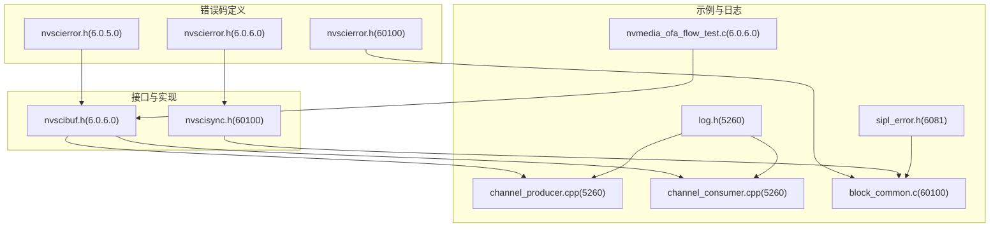
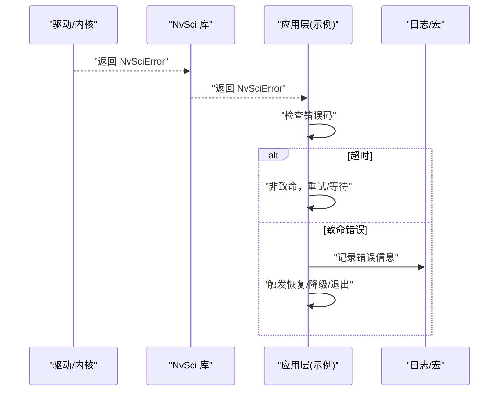
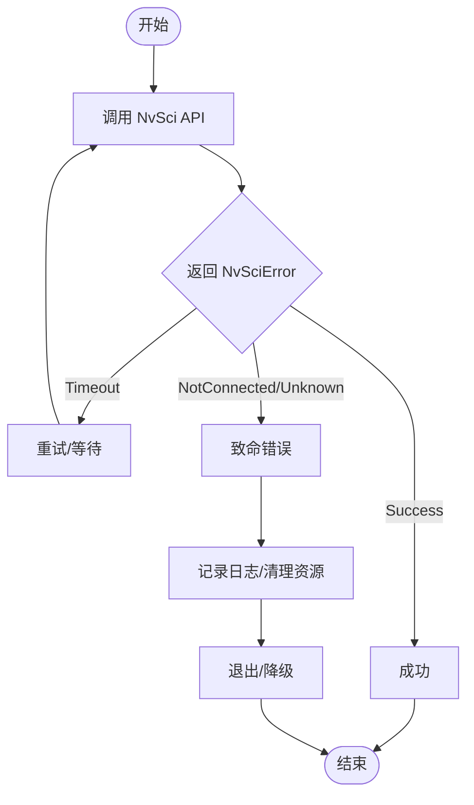
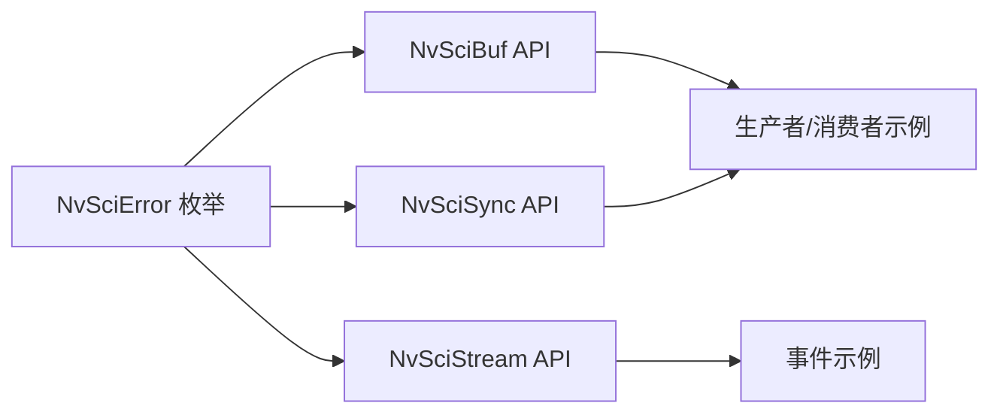

# 错误处理机制

<cite>
**本文引用的文件**
- [nvscierror.h（6.0.5.0）](file://driveos-6.0.5.0/usr/include/nvscierror.h)
- [nvscierror.h（6.0.6.0）](file://driveos-6.0.6.0/usr/include/nvscierror.h)
- [nvscierror.h（60100）](file://driveos-60100/usr/include/nvscierror.h)
- [nvscibuf.h（6.0.6.0）](file://driveos-6.0.6.0/drive-linux/include/nvscibuf.h)
- [nvscisync.h（60100）](file://driveos-60100/usr/include/nvscisync.h)
- [channel_producer.cpp（5260）](file://driveos-5260/drive-linux/samples/nvsci/nvscistream/multicast/channel_producer.cpp)
- [channel_consumer.cpp（5260）](file://driveos-5260/drive-linux/samples/nvsci/nvscistream/multicast/channel_consumer.cpp)
- [log.h（5260）](file://driveos-5260/drive-linux/samples/nvsci/nvscistream/multicast/log.h)
- [block_common.c（60100）](file://driveos-60100/drive-linux/samples/nvsci/nvscistream/event/block_common.c)
- [sipl_error.h（6081）](file://driveos-6081/drive-linux/samples/nvmedia/nvsipl/devblk/common/utils/sipl_error.h)
- [nvmedia_ofa_flow_test.c（6.0.6.0）](file://driveos-6.0.6.0/drive-linux/samples/nvmedia_6x/iofa/flow/nvmedia_ofa_flow_test.c)
</cite>

## 目录
1. [简介](#简介)
2. [项目结构](#项目结构)
3. [核心组件](#核心组件)
4. [架构总览](#架构总览)
5. [详细组件分析](#详细组件分析)
6. [依赖关系分析](#依赖关系分析)
7. [性能考量](#性能考量)
8. [故障排查指南](#故障排查指南)
9. [结论](#结论)
10. [附录](#附录)

## 简介
本文件系统性梳理 DriveOS 中基于 NvSci 的错误处理机制，重点覆盖以下方面：
- NvSci 错误码体系：分层与语义，以及与标准 errno 的映射关系
- 错误传播路径：从底层驱动到应用层的传递与处理策略
- 异常处理策略：捕获、恢复、降级与容错
- 实战示例：多版本头文件中的错误码使用与日志宏
- 日志与调试：错误信息格式化、堆栈跟踪与性能影响最小化的实践

## 项目结构
围绕错误处理的关键目录与文件如下：
- 错误码定义：位于各版本的 usr/include 下的 nvscierror.h
- NvSci 接口与错误码使用：nvscibuf.h、nvscisync.h
- 示例与日志宏：samples 中的 nvscistream 与 nvmedia 示例
- 安全模块日志工具：sipl_error.h

图表来源
- [nvscierror.h（6.0.5.0）:45-280](file://driveos-6.0.5.0/usr/include/nvscierror.h#L45-L280)
- [nvscierror.h（6.0.6.0）:45-280](file://driveos-6.0.6.0/usr/include/nvscierror.h#L45-L280)
- [nvscierror.h（60100）:45-295](file://driveos-60100/usr/include/nvscierror.h#L45-L295)
- [nvscibuf.h（6.0.6.0）:4309-4753](file://driveos-6.0.6.0/drive-linux/include/nvscibuf.h#L4309-L4753)
- [nvscisync.h（60100）:59-78](file://driveos-60100/usr/include/nvscisync.h#L59-L78)
- [channel_producer.cpp（5260）:62-281](file://driveos-5260/drive-linux/samples/nvsci/nvscistream/multicast/channel_producer.cpp#L62-L281)
- [channel_consumer.cpp（5260）:51-182](file://driveos-5260/drive-linux/samples/nvsci/nvscistream/multicast/channel_consumer.cpp#L51-L182)
- [log.h（5260）:41-73](file://driveos-5260/drive-linux/samples/nvsci/nvscistream/multicast/log.h#L41-L73)
- [block_common.c（60100）:129-211](file://driveos-60100/drive-linux/samples/nvsci/nvscistream/event/block_common.c#L129-L211)
- [sipl_error.h（6081）:126-170](file://driveos-6081/drive-linux/samples/nvmedia/nvsipl/devblk/common/utils/sipl_error.h#L126-L170)
- [nvmedia_ofa_flow_test.c（6.0.6.0）:1750-1769](file://driveos-6.0.6.0/drive-linux/samples/nvmedia_6x/iofa/flow/nvmedia_ofa_flow_test.c#L1750-L1769)

章节来源
- [nvscierror.h（6.0.5.0）:45-280](file://driveos-6.0.5.0/usr/include/nvscierror.h#L45-L280)
- [nvscierror.h（6.0.6.0）:45-280](file://driveos-6.0.6.0/usr/include/nvscierror.h#L45-L280)
- [nvscierror.h（60100）:45-295](file://driveos-60100/usr/include/nvscierror.h#L45-L295)

## 核心组件
- NvSci 错误码枚举：统一的错误分类与编号，覆盖通用、参数、时序、设备、文件系统、通信、进程/线程、属性列表、以及各子模块（Buf/Sync/Stream/Ipc/Event）的专用错误范围
- 接口层错误返回：如 NvSciBuf/NvSciSync 等 API 在失败时返回 NvSciError，调用方据此进行分支处理
- 示例层错误处理：通过 CHECK_NVSCIERR 等宏快速失败退出；或在事件查询中区分超时与致命错误
- 日志与安全模块：提供统一的错误日志宏与安全构建下的日志开关

章节来源
- [nvscibuf.h（6.0.6.0）:4309-4753](file://driveos-6.0.6.0/drive-linux/include/nvscibuf.h#L4309-L4753)
- [nvscisync.h（60100）:59-78](file://driveos-60100/usr/include/nvscisync.h#L59-L78)
- [log.h（5260）:41-73](file://driveos-5260/drive-linux/samples/nvsci/nvscistream/multicast/log.h#L41-L73)
- [block_common.c（60100）:129-211](file://driveos-60100/drive-linux/samples/nvsci/nvscistream/event/block_common.c#L129-L211)
- [sipl_error.h（6081）:126-170](file://driveos-6081/drive-linux/samples/nvmedia/nvsipl/devblk/common/utils/sipl_error.h#L126-L170)

## 架构总览
下图展示了从底层驱动到应用层的错误传播路径与处理策略：

图表来源
- [nvscibuf.h（6.0.6.0）:4309-4753](file://driveos-6.0.6.0/drive-linux/include/nvscibuf.h#L4309-L4753)
- [block_common.c（60100）:129-211](file://driveos-60100/drive-linux/samples/nvsci/nvscistream/event/block_common.c#L129-L211)
- [log.h（5260）:41-73](file://driveos-5260/drive-linux/samples/nvsci/nvscistream/multicast/log.h#L41-L73)

## 详细组件分析

### NvSci 错误码体系与使用场景
- 分层设计
  - 通用错误（0x00xxxxxx）：访问拒绝、状态非法、资源不足、内存不足、无效操作等
  - 参数错误（0x000001xx）：参数越界、溢出、不一致数据、索引越界等
  - 时序/临时错误（0x000002xx）：超时、忙、中断、再次尝试
  - 设备/文件系统/通信/进程/互斥体/属性列表等专用范围
  - 子模块专用范围：Buf（0x01xxxxxx）、Sync（0x02xxxxxx）、Stream（0x03xxxxxx）、Ipc（0x04xxxxxx）、Event（0x05xxxxxx）
- 版本演进
  - 60100 新增：Revalidation_Success、ObjValidationFailed；Ipc 增加 PCIe 相关错误码
- 使用场景
  - Buf：导出/导入、权限校验、溢出、资源错误、C2C 再次尝试
  - Sync：配置不支持、围栏已清除、对象验证
  - Stream：未连接、阶段不符、包不可访问、内部锁失败等

章节来源
- [nvscierror.h（6.0.5.0）:45-280](file://driveos-6.0.5.0/usr/include/nvscierror.h#L45-L280)
- [nvscierror.h（6.0.6.0）:45-280](file://driveos-6.0.6.0/usr/include/nvscierror.h#L45-L280)
- [nvscierror.h（60100）:45-295](file://driveos-60100/usr/include/nvscierror.h#L45-L295)
- [nvscibuf.h（6.0.6.0）:4309-4753](file://driveos-6.0.6.0/drive-linux/include/nvscibuf.h#L4309-L4753)
- [nvscisync.h（60100）:2418-2469](file://driveos-60100/usr/include/nvscisync.h#L2418-L2469)

### 错误传播机制（从底层到应用层）
- 底层驱动返回 NvSciError
- NvSci 库封装为统一枚举值
- 应用层通过 CHECK_NVSCIERR 或事件查询区分错误类型
- 针对性处理：超时可重试；连接失败触发清理；未知事件直接退出

图表来源
- [channel_producer.cpp（5260）:144-238](file://driveos-5260/drive-linux/samples/nvsci/nvscistream/multicast/channel_producer.cpp#L144-L238)
- [channel_consumer.cpp（5260）:123-144](file://driveos-5260/drive-linux/samples/nvsci/nvscistream/multicast/channel_consumer.cpp#L123-L144)
- [block_common.c（60100）:129-211](file://driveos-60100/drive-linux/samples/nvsci/nvscistream/event/block_common.c#L129-L211)

章节来源
- [channel_producer.cpp（5260）:144-238](file://driveos-5260/drive-linux/samples/nvsci/nvscistream/multicast/channel_producer.cpp#L144-L238)
- [channel_consumer.cpp（5260）:123-144](file://driveos-5260/drive-linux/samples/nvsci/nvscistream/multicast/channel_consumer.cpp#L123-L144)
- [block_common.c（60100）:129-211](file://driveos-60100/drive-linux/samples/nvsci/nvscistream/event/block_common.c#L129-L211)

### 异常处理策略
- 捕获与快速失败
  - 使用 CHECK_NVSCIERR 在关键路径上立即失败退出，避免状态污染
- 超时与重试
  - 区分 waitTime 与超时，非阻塞等待时将超时视为“无事件”，继续循环
- 连接与阶段控制
  - 仅在 Setup/Safety 阶段允许某些操作；未连接时按策略降级或退出
- 事件驱动的错误处理
  - Error 事件用于诊断；Disconnected 视为正常收尾；Unknown 事件直接报错

章节来源
- [log.h（5260）:41-73](file://driveos-5260/drive-linux/samples/nvsci/nvscistream/multicast/log.h#L41-L73)
- [block_common.c（60100）:129-211](file://driveos-60100/drive-linux/samples/nvsci/nvscistream/event/block_common.c#L129-L211)

### 具体错误处理代码示例（路径指引）
- 快速失败宏
  - [CHECK_NVSCIERR 使用示例（生产者）:66-88](file://driveos-5260/drive-linux/samples/nvsci/nvscistream/multicast/channel_producer.cpp#L66-L88)
  - [CHECK_NVSCIERR 使用示例（消费者）:62-73](file://driveos-5260/drive-linux/samples/nvsci/nvscistream/multicast/channel_consumer.cpp#L62-L73)
- 事件查询与错误分支
  - [事件查询与超时处理（生产者）:144-238](file://driveos-5260/drive-linux/samples/nvsci/nvscistream/multicast/channel_producer.cpp#L144-L238)
  - [事件查询与超时处理（消费者）:123-144](file://driveos-5260/drive-linux/samples/nvsci/nvscistream/multicast/channel_consumer.cpp#L123-L144)
  - [事件查询与 Error/Disconnected 处理:129-211](file://driveos-60100/drive-linux/samples/nvsci/nvscistream/event/block_common.c#L129-L211)
- Buf/Sync 错误码使用
  - [NvSciBufIpcExportAttrListAndObj 错误码说明:4309-4753](file://driveos-6.0.6.0/drive-linux/include/nvscibuf.h#L4309-L4753)
  - [NvSciSyncObjValidate 错误码说明:2418-2469](file://driveos-60100/usr/include/nvscisync.h#L2418-L2469)
- IOFA 流测试中的错误处理
  - [任务状态错误日志与退出:1750-1769](file://driveos-6.0.6.0/drive-linux/samples/nvmedia_6x/iofa/flow/nvmedia_ofa_flow_test.c#L1750-L1769)

章节来源
- [channel_producer.cpp（5260）:66-88](file://driveos-5260/drive-linux/samples/nvsci/nvscistream/multicast/channel_producer.cpp#L66-L88)
- [channel_consumer.cpp（5260）:62-73](file://driveos-5260/drive-linux/samples/nvsci/nvscistream/multicast/channel_consumer.cpp#L62-L73)
- [block_common.c（60100）:129-211](file://driveos-60100/drive-linux/samples/nvsci/nvscistream/event/block_common.c#L129-L211)
- [nvscibuf.h（6.0.6.0）:4309-4753](file://driveos-6.0.6.0/drive-linux/include/nvscibuf.h#L4309-L4753)
- [nvscisync.h（60100）:2418-2469](file://driveos-60100/usr/include/nvscisync.h#L2418-L2469)
- [nvmedia_ofa_flow_test.c（6.0.6.0）:1750-1769](file://driveos-6.0.6.0/drive-linux/samples/nvmedia_6x/iofa/flow/nvmedia_ofa_flow_test.c#L1750-L1769)

### 错误日志记录与调试
- 统一日志宏
  - [CHECK_NVSCIERR/EXIT 宏:41-73](file://driveos-5260/drive-linux/samples/nvsci/nvscistream/multicast/log.h#L41-L73)
- 安全模块日志
  - [SIPL 错误日志宏（字符串/十六进制/整数）:126-170](file://driveos-6081/drive-linux/samples/nvmedia/nvsipl/devblk/common/utils/sipl_error.h#L126-L170)
- 调试建议
  - 将错误码与上下文信息组合输出，便于定位
  - 对超时与未知事件进行明确分支，避免静默失败
  - 在安全构建中注意日志开销，必要时关闭低优先级日志

章节来源
- [log.h（5260）:41-73](file://driveos-5260/drive-linux/samples/nvsci/nvscistream/multicast/log.h#L41-L73)
- [sipl_error.h（6081）:126-170](file://driveos-6081/drive-linux/samples/nvmedia/nvsipl/devblk/common/utils/sipl_error.h#L126-L170)

## 依赖关系分析
- 错误码依赖
  - 所有 NvSci API 返回值均基于 NvSciError 枚举
  - 各子模块（Buf/Sync/Stream/Ipc/Event）扩展各自范围
- 示例依赖
  - 生产者/消费者示例依赖日志宏与事件查询
  - 事件示例依赖错误事件查询与断开事件处理
- 接口依赖
  - Buf/Sync 接口文档明确列出可能返回的错误码，指导调用方分支处理

图表来源
- [nvscierror.h（6.0.5.0）:45-280](file://driveos-6.0.5.0/usr/include/nvscierror.h#L45-L280)
- [nvscibuf.h（6.0.6.0）:4309-4753](file://driveos-6.0.6.0/drive-linux/include/nvscibuf.h#L4309-L4753)
- [nvscisync.h（60100）:59-78](file://driveos-60100/usr/include/nvscisync.h#L59-L78)
- [channel_producer.cpp（5260）:62-281](file://driveos-5260/drive-linux/samples/nvsci/nvscistream/multicast/channel_producer.cpp#L62-L281)
- [channel_consumer.cpp（5260）:51-182](file://driveos-5260/drive-linux/samples/nvsci/nvscistream/multicast/channel_consumer.cpp#L51-L182)
- [block_common.c（60100）:129-211](file://driveos-60100/drive-linux/samples/nvsci/nvscistream/event/block_common.c#L129-L211)

章节来源
- [nvscierror.h（6.0.5.0）:45-280](file://driveos-6.0.5.0/usr/include/nvscierror.h#L45-L280)
- [nvscibuf.h（6.0.6.0）:4309-4753](file://driveos-6.0.6.0/drive-linux/include/nvscibuf.h#L4309-L4753)
- [nvscisync.h（60100）:59-78](file://driveos-60100/usr/include/nvscisync.h#L59-L78)
- [channel_producer.cpp（5260）:62-281](file://driveos-5260/drive-linux/samples/nvsci/nvscistream/multicast/channel_producer.cpp#L62-L281)
- [channel_consumer.cpp（5260）:51-182](file://driveos-5260/drive-linux/samples/nvsci/nvscistream/multicast/channel_consumer.cpp#L51-L182)
- [block_common.c（60100）:129-211](file://driveos-60100/drive-linux/samples/nvsci/nvscistream/event/block_common.c#L129-L211)

## 性能考量
- 错误处理的性能影响最小化
  - 超时分支应避免忙轮询，结合指数退避或条件变量
  - 对于 C2C 场景，TryItAgain 可减少不必要的重试次数
  - 在安全构建中谨慎使用高频率日志，必要时降低日志级别
- 资源释放与回退
  - 发生错误时尽快释放资源，避免泄漏
  - 对于连接类错误，优先尝试重连而非直接退出

## 故障排查指南
- 常见错误与处置
  - 超时（Timeout）：检查连接建立与事件查询超时阈值设置
  - 未连接（StreamNotConnected）：确认 Setup/Safety 阶段顺序与端点信息
  - 参数错误（BadParameter/ValueOutOfRange）：核对属性列表与权限设置
  - 资源不足（InsufficientMemory/ResourceError）：监控系统资源与驱动状态
- 日志与定位
  - 使用统一日志宏输出错误码与上下文
  - 安全模块日志可用于跨模块问题定位
- 退出策略
  - 致命错误直接退出并清理资源
  - 可恢复错误进入降级模式或重试流程

章节来源
- [block_common.c（60100）:129-211](file://driveos-60100/drive-linux/samples/nvsci/nvscistream/event/block_common.c#L129-L211)
- [log.h（5260）:41-73](file://driveos-5260/drive-linux/samples/nvsci/nvscistream/multicast/log.h#L41-L73)
- [sipl_error.h（6081）:126-170](file://driveos-6081/drive-linux/samples/nvmedia/nvsipl/devblk/common/utils/sipl_error.h#L126-L170)

## 结论
- NvSci 错误码体系清晰覆盖通用与子模块专用错误，便于统一处理与扩展
- 示例代码展示了从事件查询到错误分支再到资源清理的完整闭环
- 通过宏与日志工具，可在保证可观测性的同时控制性能开销
- 建议在实际工程中遵循“快速失败、超时重试、错误降级”的原则，确保系统稳定性与可维护性

## 附录
- 关键路径参考
  - [生产者通道创建与连接:62-127](file://driveos-5260/drive-linux/samples/nvsci/nvscistream/multicast/channel_producer.cpp#L62-L127)
  - [消费者通道创建与连接:51-99](file://driveos-5260/drive-linux/samples/nvsci/nvscistream/multicast/channel_consumer.cpp#L51-L99)
  - [事件查询与错误处理:129-211](file://driveos-60100/drive-linux/samples/nvsci/nvscistream/event/block_common.c#L129-L211)
  - [Buf 导出/导入错误码说明:4309-4753](file://driveos-6.0.6.0/drive-linux/include/nvscibuf.h#L4309-L4753)
  - [Sync 对象验证错误码说明:2418-2469](file://driveos-60100/usr/include/nvscisync.h#L2418-L2469)