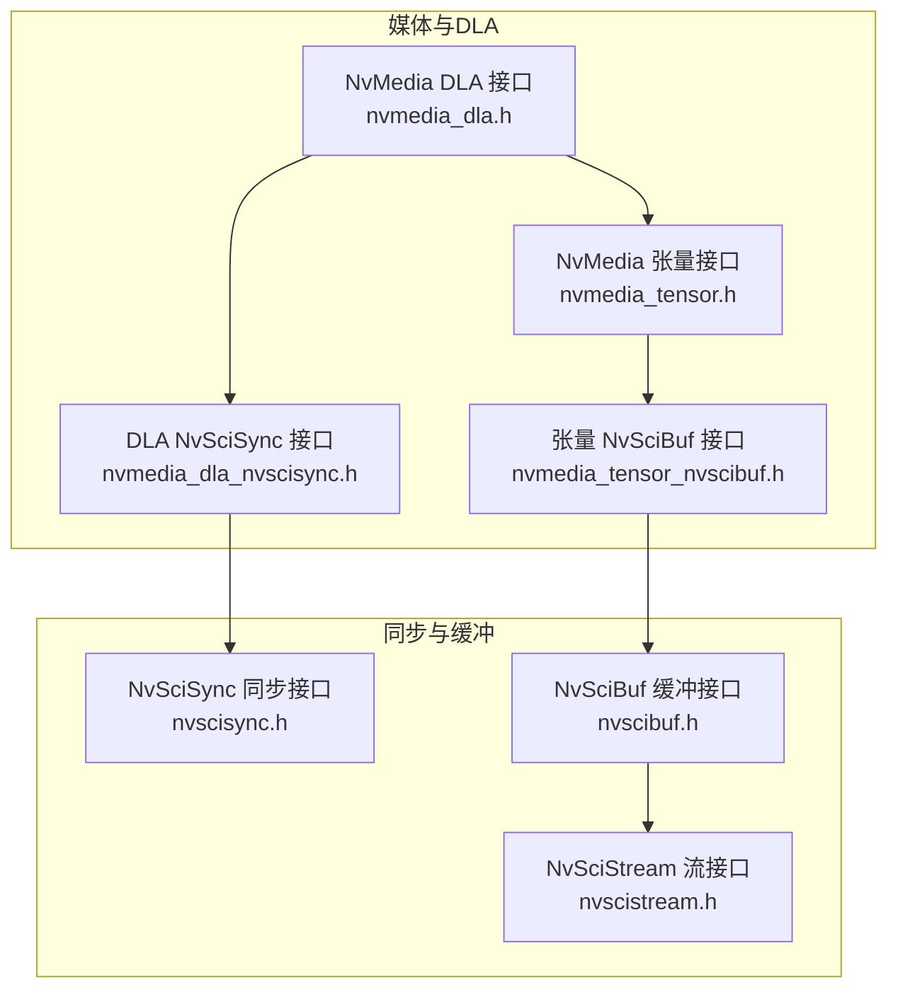
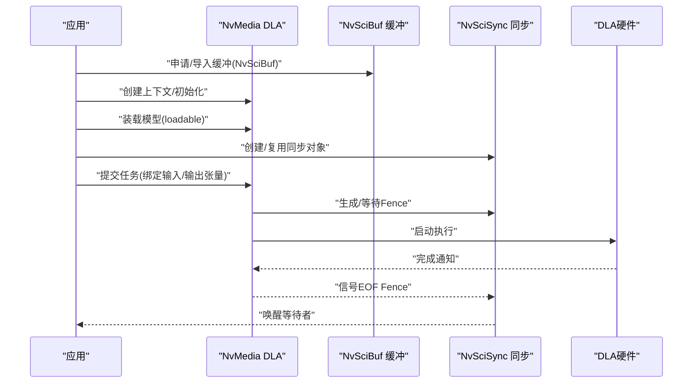
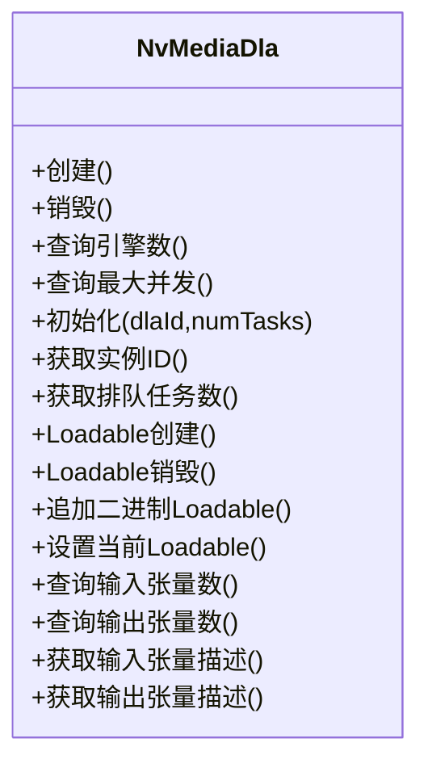
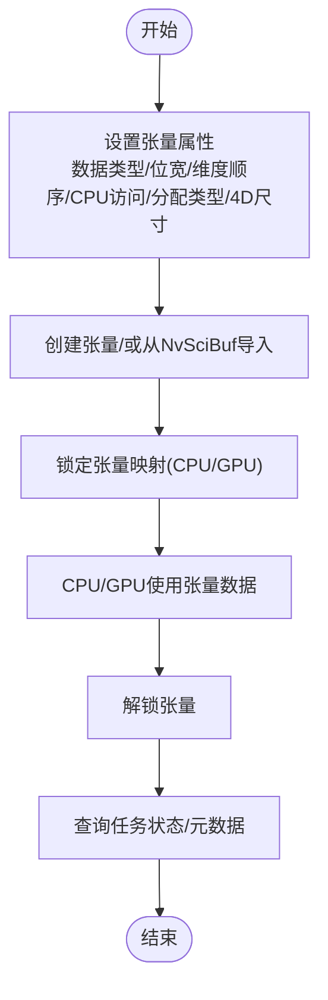
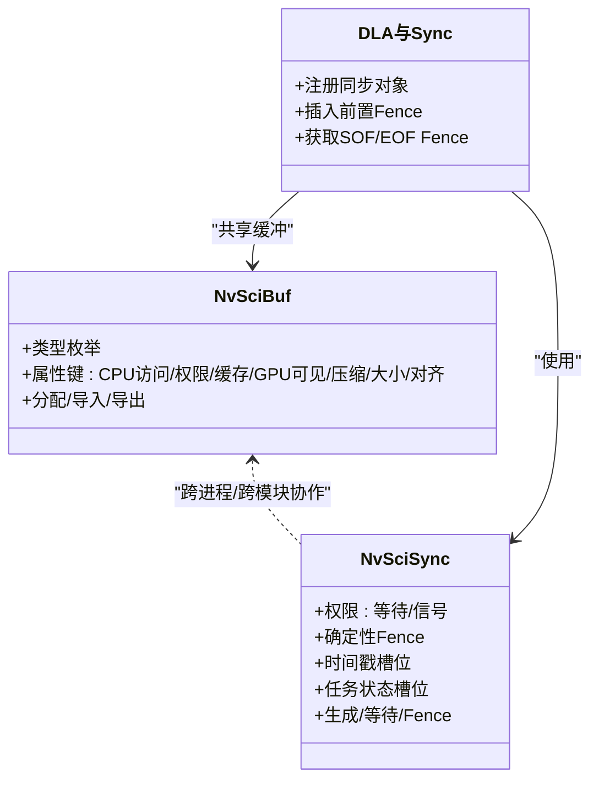
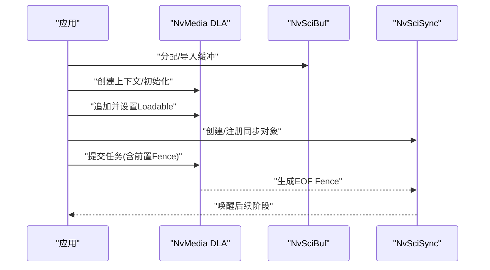
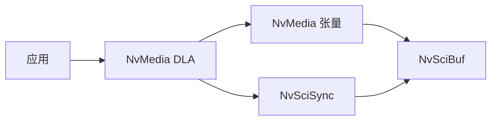

# GPU加速优化

<cite>
**本文引用的文件**
- [nvmedia_dla.h](file://driveos-6.0.5.0/drive-linux/include/nvmedia_dla.h)
- [nvmedia_tensor.h](file://driveos-6.0.5.0/drive-linux/include/nvmedia_tensor.h)
- [nvscibuf.h](file://driveos-6.0.5.0/drive-linux/include/nvscibuf.h)
- [nvscisync.h](file://driveos-6.0.5.0/drive-linux/include/nvscisync.h)
- [nvscistream.h](file://driveos-6.0.5.0/drive-linux/include/nvscistream.h)
- [nvmedia_dla_nvscisync.h](file://driveos-6.0.5.0/drive-linux/include/nvmedia_dla_nvscisync.h)
- [nvmedia_tensor_nvscibuf.h](file://driveos-6.0.5.0/drive-linux/include/nvmedia_tensor_nvscibuf.h)
</cite>

## 目录
1. [简介](#简介)
2. [项目结构](#项目结构)
3. [核心组件](#核心组件)
4. [架构总览](#架构总览)
5. [详细组件分析](#详细组件分析)
6. [依赖关系分析](#依赖关系分析)
7. [性能考量](#性能考量)
8. [故障排查指南](#故障排查指南)
9. [结论](#结论)
10. [附录](#附录)

## 简介
本指南面向在DriveOS平台进行GPU加速优化的开发者，系统性阐述以下主题：
- CUDA编程最佳实践：内核优化、内存访问模式优化、线程块配置策略
- DLA（深度学习加速器）使用：模型加载、推理优化、资源管理
- 张量处理优化：张量内存布局、批处理优化、量化技术
- NvSci同步机制在GPU加速中的应用：缓冲区同步、数据传输优化
- 性能测试与profiler工具使用方法

本指南以仓库中提供的NVIDIA Media接口与NvSci相关头文件为依据，结合其API语义与约束，给出可操作的优化建议与流程图示。

## 项目结构
本仓库围绕NVIDIA Media与NvSci两大能力域组织：
- 媒体与深度学习加速：nvmedia_dla.h、nvmedia_tensor.h、nvmedia_dla_nvscisync.h、nvmedia_tensor_nvscibuf.h
- 同步与缓冲：nvscisync.h、nvscibuf.h、nvscistream.h

图表来源
- [nvmedia_dla.h:1-1234](file://driveos-6.0.5.0/drive-linux/include/nvmedia_dla.h#L1-L1234)
- [nvmedia_tensor.h:1-544](file://driveos-6.0.5.0/drive-linux/include/nvmedia_tensor.h#L1-L544)
- [nvmedia_dla_nvscisync.h:1-704](file://driveos-6.0.5.0/drive-linux/include/nvmedia_dla_nvscisync.h#L1-L704)
- [nvmedia_tensor_nvscibuf.h:1-265](file://driveos-6.0.5.0/drive-linux/include/nvmedia_tensor_nvscibuf.h#L1-L265)
- [nvscisync.h:1-2832](file://driveos-6.0.5.0/drive-linux/include/nvscisync.h#L1-L2832)
- [nvscibuf.h:1-4920](file://driveos-6.0.5.0/drive-linux/include/nvscibuf.h#L1-L4920)
- [nvscistream.h:1-32](file://driveos-6.0.5.0/drive-linux/include/nvscistream.h#L1-L32)

章节来源
- [nvmedia_dla.h:1-1234](file://driveos-6.0.5.0/drive-linux/include/nvmedia_dla.h#L1-L1234)
- [nvmedia_tensor.h:1-544](file://driveos-6.0.5.0/drive-linux/include/nvmedia_tensor.h#L1-L544)
- [nvmedia_dla_nvscisync.h:1-704](file://driveos-6.0.5.0/drive-linux/include/nvmedia_dla_nvscisync.h#L1-L704)
- [nvmedia_tensor_nvscibuf.h:1-265](file://driveos-6.0.5.0/drive-linux/include/nvmedia_tensor_nvscibuf.h#L1-L265)
- [nvscisync.h:1-2832](file://driveos-6.0.5.0/drive-linux/include/nvscisync.h#L1-L2832)
- [nvscibuf.h:1-4920](file://driveos-6.0.5.0/drive-linux/include/nvscibuf.h#L1-L4920)
- [nvscistream.h:1-32](file://driveos-6.0.5.0/drive-linux/include/nvscistream.h#L1-L32)

## 核心组件
- DLA运行时与任务队列：提供设备句柄、引擎数量、最大并发任务数查询，以及上下文初始化、负载装载、输入输出张量描述等能力
- 张量处理：提供张量创建属性、CPU/GPU访问控制、锁定/解锁、状态查询、元数据获取等
- NvSciBuf缓冲分配：定义通用缓冲类型、对齐、缓存一致性、GPU可见性、压缩等属性键
- NvSciSync同步原语：提供等待/信号权限、确定性Fence、时间戳槽位、任务状态槽位等属性
- NvSciStream流层：基于NvSciBuf/NvSciSync的跨模块数据包流式传输抽象

章节来源
- [nvmedia_dla.h:346-502](file://driveos-6.0.5.0/drive-linux/include/nvmedia_dla.h#L346-L502)
- [nvmedia_tensor.h:154-259](file://driveos-6.0.5.0/drive-linux/include/nvmedia_tensor.h#L154-L259)
- [nvscibuf.h:383-750](file://driveos-6.0.5.0/drive-linux/include/nvscibuf.h#L383-L750)
- [nvscisync.h:405-535](file://driveos-6.0.5.0/drive-linux/include/nvscisync.h#L405-L535)
- [nvscistream.h:1-32](file://driveos-6.0.5.0/drive-linux/include/nvscistream.h#L1-L32)

## 架构总览
下图展示从应用到硬件的端到端路径：应用通过NvMedia API构建任务，借助NvSciBuf在多引擎间共享内存，用NvSciSync协调执行时机，最终由DLA执行深度学习计算。

图表来源
- [nvmedia_dla.h:533-693](file://driveos-6.0.5.0/drive-linux/include/nvmedia_dla.h#L533-L693)
- [nvmedia_dla_nvscisync.h:131-241](file://driveos-6.0.5.0/drive-linux/include/nvmedia_dla_nvscisync.h#L131-L241)
- [nvscibuf.h:774-800](file://driveos-6.0.5.0/drive-linux/include/nvscibuf.h#L774-L800)
- [nvscisync.h:587-628](file://driveos-6.0.5.0/drive-linux/include/nvscisync.h#L587-L628)

## 详细组件分析

### DLA组件分析
- 设备与上下文
  - 创建/销毁句柄、查询引擎数、最大并发任务数、实例ID、当前排队任务数
  - 初始化指定引擎与并发任务数
- 模型装载
  - 创建/销毁loadable、追加二进制loadable、设置当前loadable
  - 查询输入/输出张量个数与描述
- 推理调用
  - 通过参数数组传入输入输出张量指针，提交任务

图表来源
- [nvmedia_dla.h:249-428](file://driveos-6.0.5.0/drive-linux/include/nvmedia_dla.h#L249-L428)
- [nvmedia_dla.h:533-693](file://driveos-6.0.5.0/drive-linux/include/nvmedia_dla.h#L533-L693)

章节来源
- [nvmedia_dla.h:249-428](file://driveos-6.0.5.0/drive-linux/include/nvmedia_dla.h#L249-L428)
- [nvmedia_dla.h:533-693](file://driveos-6.0.5.0/drive-linux/include/nvmedia_dla.h#L533-L693)

### 张量处理组件分析
- 属性与创建
  - 数据类型、位宽、维度顺序、CPU访问方式、分配类型、4D尺寸、X维等
  - 提供宏简化属性初始化与设置
- 访问与状态
  - 锁定/解锁、超时等待、获取任务状态、读取元数据
- 与NvSciBuf集成
  - 初始化模块、填充NvSciBuf属性、从NvSciBuf创建张量

图表来源
- [nvmedia_tensor.h:154-259](file://driveos-6.0.5.0/drive-linux/include/nvmedia_tensor.h#L154-L259)
- [nvmedia_tensor.h:347-413](file://driveos-6.0.5.0/drive-linux/include/nvmedia_tensor.h#L347-L413)
- [nvmedia_tensor_nvscibuf.h:136-190](file://driveos-6.0.5.0/drive-linux/include/nvmedia_tensor_nvscibuf.h#L136-L190)

章节来源
- [nvmedia_tensor.h:154-259](file://driveos-6.0.5.0/drive-linux/include/nvmedia_tensor.h#L154-L259)
- [nvmedia_tensor.h:347-413](file://driveos-6.0.5.0/drive-linux/include/nvmedia_tensor.h#L347-L413)
- [nvmedia_tensor_nvscibuf.h:136-190](file://driveos-6.0.5.0/drive-linux/include/nvmedia_tensor_nvscibuf.h#L136-L190)

### NvSciBuf与NvSciSync组件分析
- NvSciBuf
  - 类型：通用/原始缓冲/图像/张量/数组/金字塔
  - 属性键：类型集合、CPU访问需求、权限、缓存策略、GPU可见性、GPU缓存、GPU压缩、大小、对齐等
  - 支持跨进程导出/导入与一致性保证
- NvSciSync
  - 同步对象：等待/信号权限、确定性Fence、时间戳槽位、任务状态槽位
  - Fence生命周期：生成、导入导出、等待、清理
  - 与DLA/NvMedia集成：注册同步对象、插入前置Fence、获取SOF/EOF Fence

图表来源
- [nvscibuf.h:123-750](file://driveos-6.0.5.0/drive-linux/include/nvscibuf.h#L123-L750)
- [nvscisync.h:405-535](file://driveos-6.0.5.0/drive-linux/include/nvscisync.h#L405-L535)
- [nvmedia_dla_nvscisync.h:131-241](file://driveos-6.0.5.0/drive-linux/include/nvmedia_dla_nvscisync.h#L131-L241)

章节来源
- [nvscibuf.h:123-750](file://driveos-6.0.5.0/drive-linux/include/nvscibuf.h#L123-L750)
- [nvscisync.h:405-535](file://driveos-6.0.5.0/drive-linux/include/nvscisync.h#L405-L535)
- [nvmedia_dla_nvscisync.h:131-241](file://driveos-6.0.5.0/drive-linux/include/nvmedia_dla_nvscisync.h#L131-L241)

### CUDA编程最佳实践（基于仓库API语义）
- 内核优化
  - 使用NvSciBuf/NvSciSync确保缓冲一致性和跨引擎可见性，避免不必要的CPU-GPU往返
  - 利用NvSciBuf的GPU缓存与压缩属性，减少带宽压力
- 内存访问模式优化
  - 采用连续内存布局与对齐，遵循NvSciBuf对齐要求
  - 控制CPU/GPU缓存一致性，必要时使用缓存维护接口
- 线程块配置策略
  - 结合DLA最大并发任务数与张量尺寸，合理设置块/网格维度
  - 通过NvSciSync Fence串行化阶段，避免竞争与资源争用

章节来源
- [nvscibuf.h:508-748](file://driveos-6.0.5.0/drive-linux/include/nvscibuf.h#L508-L748)
- [nvscisync.h:405-535](file://driveos-6.0.5.0/drive-linux/include/nvscisync.h#L405-L535)
- [nvmedia_dla.h:382-428](file://driveos-6.0.5.0/drive-linux/include/nvmedia_dla.h#L382-L428)

### DLA使用方法（模型加载、推理优化、资源管理）
- 模型加载
  - 创建上下文、初始化指定引擎与并发度
  - 追加二进制loadable并设置为当前loadable
  - 查询输入/输出张量描述，准备参数数组
- 推理优化
  - 使用NvSciSync注册同步对象，插入前置Fence，获取SOF/EOF Fence
  - 通过NvSciBuf共享中间结果，减少拷贝
- 资源管理
  - 严格遵循注册/注销生命周期，确保销毁前释放所有已注册对象

图表来源
- [nvmedia_dla.h:533-693](file://driveos-6.0.5.0/drive-linux/include/nvmedia_dla.h#L533-L693)
- [nvmedia_dla_nvscisync.h:236-434](file://driveos-6.0.5.0/drive-linux/include/nvmedia_dla_nvscisync.h#L236-L434)
- [nvscibuf.h:774-800](file://driveos-6.0.5.0/drive-linux/include/nvscibuf.h#L774-L800)

章节来源
- [nvmedia_dla.h:533-693](file://driveos-6.0.5.0/drive-linux/include/nvmedia_dla.h#L533-L693)
- [nvmedia_dla_nvscisync.h:236-434](file://driveos-6.0.5.0/drive-linux/include/nvmedia_dla_nvscisync.h#L236-L434)
- [nvscibuf.h:774-800](file://driveos-6.0.5.0/drive-linux/include/nvscibuf.h#L774-L800)

### 张量处理优化技巧（内存布局、批处理、量化）
- 内存布局
  - 使用NvMedia张量属性设置维度顺序与4D尺寸，结合NvSciBuf对齐与缓存策略
- 批处理优化
  - 通过NvSciBuf在进程间共享批量数据，减少重复分配与拷贝
- 量化技术
  - 在张量属性中设置位宽与数据类型，利用NvSciBuf的GPU缓存与压缩属性降低存储与带宽占用

章节来源
- [nvmedia_tensor.h:154-259](file://driveos-6.0.5.0/drive-linux/include/nvmedia_tensor.h#L154-L259)
- [nvscibuf.h:508-748](file://driveos-6.0.5.0/drive-linux/include/nvscibuf.h#L508-L748)

### NvSci同步机制在GPU加速中的应用
- 缓冲区同步
  - 使用NvSciBuf属性控制CPU/GPU缓存一致性与GPU可见性，避免脏缓存导致的错误
- 数据传输优化
  - 通过NvSciSync Fence串行化阶段，确保数据就绪后再执行后续算子
  - 利用确定性Fence与时间戳槽位进行性能分析与流水线优化

章节来源
- [nvscibuf.h:508-748](file://driveos-6.0.5.0/drive-linux/include/nvscibuf.h#L508-L748)
- [nvscisync.h:405-535](file://driveos-6.0.5.0/drive-linux/include/nvscisync.h#L405-L535)

## 依赖关系分析
- 组件耦合
  - DLA依赖张量与同步；张量依赖NvSciBuf；DLA与同步共同依赖NvSciSync
- 外部依赖
  - NvSciBuf/NvSciSync提供跨进程/跨模块的一致性与同步能力
- 可能的循环依赖
  - 当前接口设计为单向依赖（应用→DLA→同步/缓冲），未见循环

图表来源
- [nvmedia_dla.h:249-428](file://driveos-6.0.5.0/drive-linux/include/nvmedia_dla.h#L249-L428)
- [nvmedia_tensor.h:154-259](file://driveos-6.0.5.0/drive-linux/include/nvmedia_tensor.h#L154-L259)
- [nvmedia_dla_nvscisync.h:131-241](file://driveos-6.0.5.0/drive-linux/include/nvmedia_dla_nvscisync.h#L131-L241)
- [nvscibuf.h:123-750](file://driveos-6.0.5.0/drive-linux/include/nvscibuf.h#L123-L750)
- [nvscisync.h:405-535](file://driveos-6.0.5.0/drive-linux/include/nvscisync.h#L405-L535)

章节来源
- [nvmedia_dla.h:249-428](file://driveos-6.0.5.0/drive-linux/include/nvmedia_dla.h#L249-L428)
- [nvmedia_tensor.h:154-259](file://driveos-6.0.5.0/drive-linux/include/nvmedia_tensor.h#L154-L259)
- [nvmedia_dla_nvscisync.h:131-241](file://driveos-6.0.5.0/drive-linux/include/nvmedia_dla_nvscisync.h#L131-L241)
- [nvscibuf.h:123-750](file://driveos-6.0.5.0/drive-linux/include/nvscibuf.h#L123-L750)
- [nvscisync.h:405-535](file://driveos-6.0.5.0/drive-linux/include/nvscisync.h#L405-L535)

## 性能考量
- 带宽与延迟
  - 合理设置NvSciBuf的GPU缓存与压缩属性，减少显存带宽占用
  - 使用NvSciSync Fence进行阶段化流水，避免阻塞
- 并发与调度
  - 结合DLA最大并发任务数与张量尺寸，调整线程块配置
  - 通过NvSciBuf共享中间结果，降低重复分配与拷贝
- 可观测性
  - 利用NvSciSync时间戳槽位与任务状态槽位进行性能分析

## 故障排查指南
- 常见错误与定位
  - 参数为空/越界：检查NvMedia/DLA/Tensor API的输入参数合法性
  - 超时：确认NvSciSync Fence等待超时设置与同步对象状态
  - 资源不足：检查NvSciBuf/NvSciSync对象分配与释放是否匹配
- 调试建议
  - 使用NvMedia张量状态查询接口获取最近一次操作的耗时与状态
  - 逐步验证缓冲分配、同步对象注册、任务提交与Fence获取流程

章节来源
- [nvmedia_tensor.h:380-413](file://driveos-6.0.5.0/drive-linux/include/nvmedia_tensor.h#L380-L413)
- [nvscisync.h:587-628](file://driveos-6.0.5.0/drive-linux/include/nvscisync.h#L587-L628)

## 结论
本指南基于仓库提供的NVIDIA Media与NvSci接口，给出了从缓冲分配、同步协调到DLA推理的完整优化路径。通过合理运用NvSciBuf/NvSciSync的缓存一致性与跨模块共享能力，结合DLA的任务队列与张量属性，可在DriveOS平台上实现高效稳定的GPU加速方案。

## 附录
- 版本信息
  - DLA版本：主/次/补丁号在头文件中定义
  - 张量版本：主/次/补丁号在头文件中定义
  - NvSciBuf版本：主/次号在头文件中定义
  - NvSciSync版本：主/次号在头文件中定义
- 相关API参考
  - DLA：上下文创建/销毁、引擎查询、并发配置、模型装载、输入输出描述
  - 张量：属性设置、锁定/解锁、状态/元数据查询、NvSciBuf集成
  - NvSciBuf：类型与属性键、分配/导入/导出
  - NvSciSync：权限与Fence、确定性Fence、时间戳/任务状态槽位

章节来源
- [nvmedia_dla.h:50-90](file://driveos-6.0.5.0/drive-linux/include/nvmedia_dla.h#L50-L90)
- [nvmedia_tensor.h:49-54](file://driveos-6.0.5.0/drive-linux/include/nvmedia_tensor.h#L49-L54)
- [nvscibuf.h:148-160](file://driveos-6.0.5.0/drive-linux/include/nvscibuf.h#L148-L160)
- [nvscisync.h:171-184](file://driveos-6.0.5.0/drive-linux/include/nvscisync.h#L171-L184)