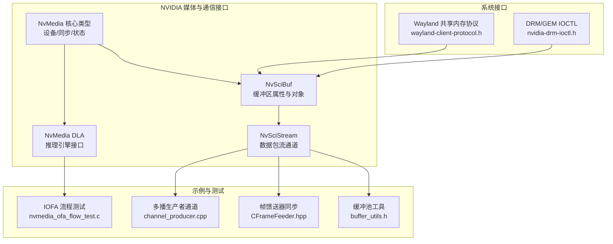
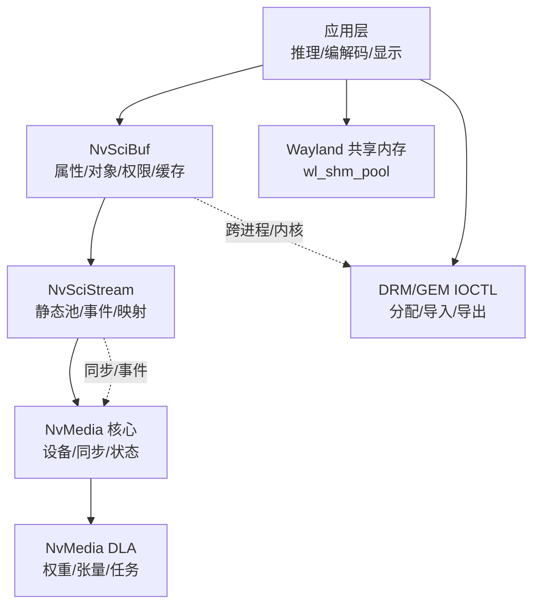
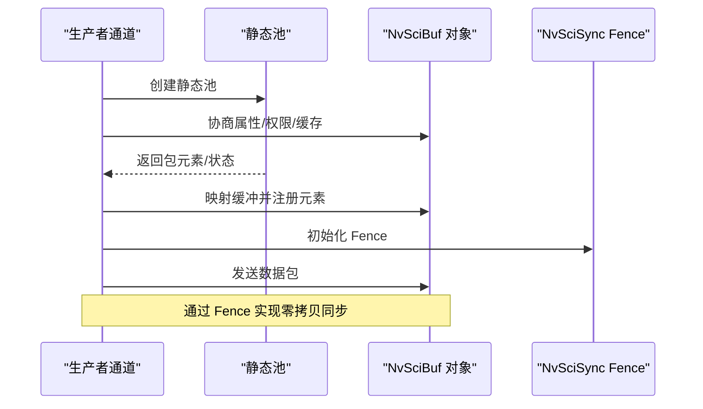
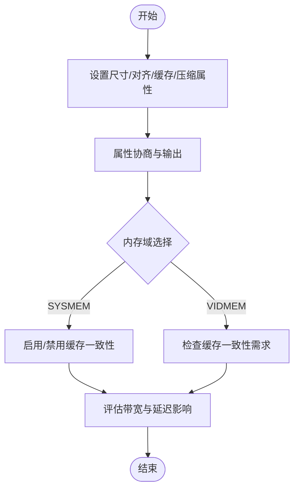
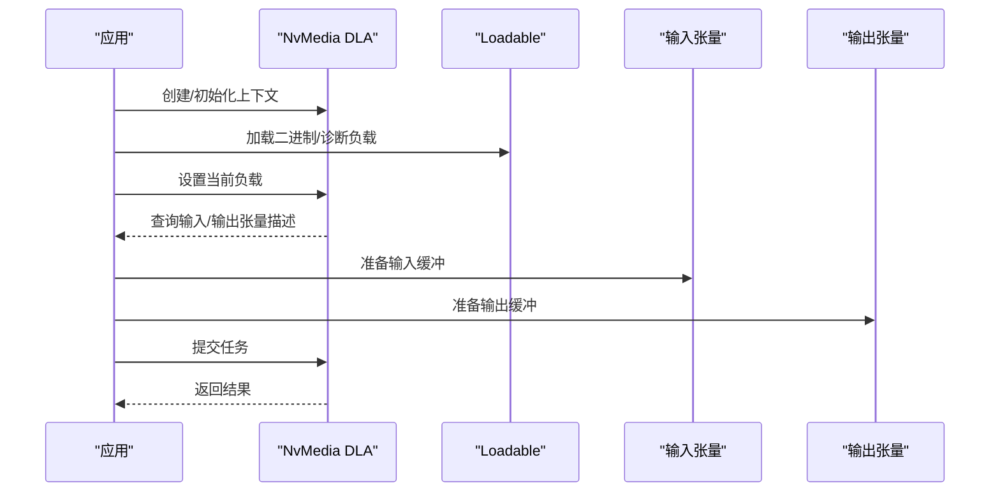
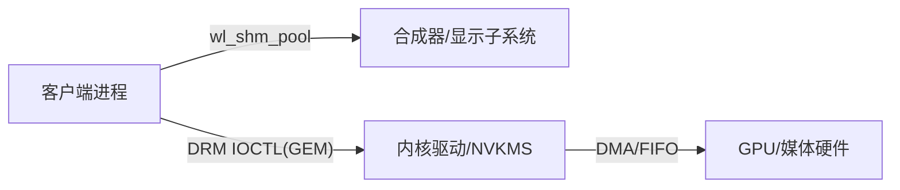
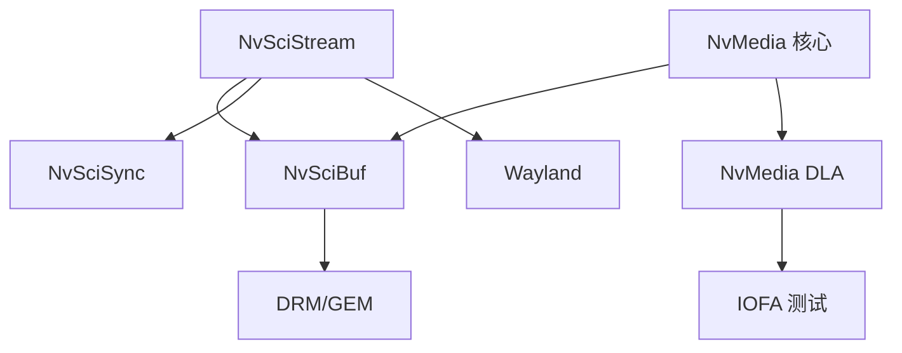

# 内存管理优化

<cite>
**本文引用的文件**
- [nvscibuf.h](file://driveos-6.0.5.0/drive-linux/include/nvscibuf.h)
- [nvscistream.h](file://driveos-6.0.5.0/drive-linux/include/nvscistream.h)
- [nvmedia_dla.h](file://driveos-6.0.5.0/drive-linux/include/nvmedia_dla.h)
- [buffer_utils.h](file://driveos-6.0.5.0/drive-linux/samples/nvmedia/utils/buffer_utils.h)
- [nvmedia_core.h](file://driveos-6.0.5.0/drive-linux/include/nvmedia_6x/nvmedia_core.h)
- [nvmedia_ofa_flow_test.c](file://driveos-6.0.6.0/drive-linux/samples/nvmedia_6x/iofa/flow/nvmedia_ofa_flow_test.c)
- [CFrameFeeder.hpp](file://driveos-6.0.5.0/drive-linux/samples/nvmedia/nvsipl/test/camera/CFrameFeeder.hpp)
- [channel_producer.cpp](file://driveos-5260/drive-linux/samples/nvsci/nvscistream/multicast/channel_producer.cpp)
- [nvidia-drm-ioctl.h](file://driveos-6081/drive-linux/include/nvidia-drm-ioctl.h)
- [wayland-client-protocol.h](file://driveos-6.0.6.0/drive-linux/include/wayland-client-protocol.h)
</cite>

## 目录
1. [简介](#简介)
2. [项目结构](#项目结构)
3. [核心组件](#核心组件)
4. [架构总览](#架构总览)
5. [详细组件分析](#详细组件分析)
6. [依赖关系分析](#依赖关系分析)
7. [性能考量](#性能考量)
8. [故障排查指南](#故障排查指南)
9. [结论](#结论)
10. [附录](#附录)

## 简介
本指南围绕 DriveOS/NVIDIA 平台的内存管理优化展开，聚焦以下主题：
- NvSci 缓冲区管理：缓冲区池化、内存复用、零拷贝与跨进程共享
- GPU 显存优化：分配策略、内存对齐、缓存一致性与带宽利用
- DLA 内存管理：权重存储、激活值管理、内存带宽优化
- 泄漏检测与调试：工具链与最佳实践
- 高级技术：跨进程共享、DMA 传输优化
- 提供可直接定位到源码路径的示例与性能分析方法

## 项目结构
该仓库在不同版本中提供了多套内存管理相关头文件与示例，覆盖 NvSciBuf、NvSciStream、NvMedia（含 DLA）、Wayland 共享内存、DRM/GEM 接口等。下图给出与内存管理相关的关键模块关系。

**图表来源**
- [nvscibuf.h](file://driveos-6.0.5.0/drive-linux/include/nvscibuf.h)
- [nvscistream.h](file://driveos-6.0.5.0/drive-linux/include/nvscistream.h)
- [nvmedia_core.h](file://driveos-6.0.5.0/drive-linux/include/nvmedia_6x/nvmedia_core.h)
- [nvmedia_dla.h](file://driveos-6.0.5.0/drive-linux/include/nvmedia_dla.h)
- [buffer_utils.h](file://driveos-6.0.5.0/drive-linux/samples/nvmedia/utils/buffer_utils.h)
- [nvmedia_ofa_flow_test.c](file://driveos-6.0.6.0/drive-linux/samples/nvmedia_6x/iofa/flow/nvmedia_ofa_flow_test.c)
- [CFrameFeeder.hpp](file://driveos-6.0.5.0/drive-linux/samples/nvmedia/nvsipl/test/camera/CFrameFeeder.hpp)
- [channel_producer.cpp](file://driveos-5260/drive-linux/samples/nvsci/nvscistream/multicast/channel_producer.cpp)
- [wayland-client-protocol.h](file://driveos-6.0.6.0/drive-linux/include/wayland-client-protocol.h)
- [nvidia-drm-ioctl.h](file://driveos-6081/drive-linux/include/nvidia-drm-ioctl.h)

**章节来源**
- [nvscibuf.h](file://driveos-6.0.5.0/drive-linux/include/nvscibuf.h)
- [nvscistream.h](file://driveos-6.0.5.0/drive-linux/include/nvscistream.h)
- [nvmedia_core.h](file://driveos-6.0.5.0/drive-linux/include/nvmedia_6x/nvmedia_core.h)
- [nvmedia_dla.h](file://driveos-6.0.5.0/drive-linux/include/nvmedia_dla.h)
- [buffer_utils.h](file://driveos-6.0.5.0/drive-linux/samples/nvmedia/utils/buffer_utils.h)
- [nvmedia_ofa_flow_test.c](file://driveos-6.0.6.0/drive-linux/samples/nvmedia_6x/iofa/flow/nvmedia_ofa_flow_test.c)
- [CFrameFeeder.hpp](file://driveos-6.0.5.0/drive-linux/samples/nvmedia/nvsipl/test/camera/CFrameFeeder.hpp)
- [channel_producer.cpp](file://driveos-5260/drive-linux/samples/nvsci/nvscistream/multicast/channel_producer.cpp)
- [wayland-client-protocol.h](file://driveos-6.0.6.0/drive-linux/include/wayland-client-protocol.h)
- [nvidia-drm-ioctl.h](file://driveos-6081/drive-linux/include/nvidia-drm-ioctl.h)

## 核心组件
- NvSciBuf：定义缓冲区类型、属性键、访问权限、缓存一致性、压缩控制等；支持跨进程导入导出、重复引用与释放。
- NvSciStream：基于 NvSciBuf 的数据包流通道，提供静态池、生产者/消费者连接、事件驱动资源映射。
- NvMedia 核心：统一的状态码、设备句柄、同步对象类型、访问模式等基础类型。
- NvMedia DLA：推理引擎接口，涉及权重/张量描述符、任务上下文与输入输出数据指针。
- 缓冲池工具：图像/兄弟缓冲池的创建、获取、归还、遍历与引用计数。
- 示例与测试：IOFA 流程中对 NvSciBuf 对象的成对释放；帧馈送器中通过 NvSciSync Fence 实现跨阶段同步与缓冲复用；多播生产者通道展示资源协商与映射流程。

**章节来源**
- [nvscibuf.h](file://driveos-6.0.5.0/drive-linux/include/nvscibuf.h)
- [nvscistream.h](file://driveos-6.0.5.0/drive-linux/include/nvscistream.h)
- [nvmedia_core.h](file://driveos-6.0.5.0/drive-linux/include/nvmedia_6x/nvmedia_core.h)
- [nvmedia_dla.h](file://driveos-6.0.5.0/drive-linux/include/nvmedia_dla.h)
- [buffer_utils.h](file://driveos-6.0.5.0/drive-linux/samples/nvmedia/utils/buffer_utils.h)
- [nvmedia_ofa_flow_test.c](file://driveos-6.0.6.0/drive-linux/samples/nvmedia_6x/iofa/flow/nvmedia_ofa_flow_test.c)
- [CFrameFeeder.hpp](file://driveos-6.0.5.0/drive-linux/samples/nvmedia/nvsipl/test/camera/CFrameFeeder.hpp)
- [channel_producer.cpp](file://driveos-5260/drive-linux/samples/nvsci/nvscistream/multicast/channel_producer.cpp)

## 架构总览
下图展示从应用层到底层通信与图形接口的内存管理路径：应用通过 NvSciBuf/NvSciStream 分配/共享缓冲，NvMedia 进行设备抽象与同步，Wayland/DRM 则提供用户态共享内存与内核接口。

**图表来源**
- [nvscibuf.h](file://driveos-6.0.5.0/drive-linux/include/nvscibuf.h)
- [nvscistream.h](file://driveos-6.0.5.0/drive-linux/include/nvscistream.h)
- [nvmedia_core.h](file://driveos-6.0.5.0/drive-linux/include/nvmedia_6x/nvmedia_core.h)
- [nvmedia_dla.h](file://driveos-6.0.5.0/drive-linux/include/nvmedia_dla.h)
- [wayland-client-protocol.h](file://driveos-6.0.6.0/drive-linux/include/wayland-client-protocol.h)
- [nvidia-drm-ioctl.h](file://driveos-6081/drive-linux/include/nvidia-drm-ioctl.h)

## 详细组件分析

### NvSci 缓冲区管理策略
- 缓冲区池化与复用
  - 使用静态池（NvSciStream Static Pool）减少频繁分配/释放开销，配合事件驱动完成映射与注册。
  - 示例：多播生产者通道在连接后创建静态池，并在收到所有属性/状态事件后进行包重协调与缓冲映射。
  - 参考路径：[channel_producer.cpp](file://driveos-5260/drive-linux/samples/nvsci/nvscistream/multicast/channel_producer.cpp)

- 零拷贝与跨进程共享
  - NvSciBuf 支持跨进程导入导出，结合 NvSciSync Fence 实现无 CPU 拷贝的数据传递与同步。
  - 示例：帧馈送器通过获取 EOF Fence 并设置为下游预 Fence，实现缓冲复用与阶段间同步。
  - 参考路径：[CFrameFeeder.hpp](file://driveos-6.0.5.0/drive-linux/samples/nvmedia/nvsipl/test/camera/CFrameFeeder.hpp)

- 缓存一致性与访问权限
  - 属性键控制 CPU/GPU 缓存、访问权限、压缩与缓存维护需求；在多 GPU/多域场景下需谨慎设置 VIDMEM/GPUID。
  - 参考路径：[nvscibuf.h](file://driveos-6.0.5.0/drive-linux/include/nvscibuf.h)

**图表来源**
- [channel_producer.cpp](file://driveos-5260/drive-linux/samples/nvsci/nvscistream/multicast/channel_producer.cpp)
- [CFrameFeeder.hpp](file://driveos-6.0.5.0/drive-linux/samples/nvmedia/nvsipl/test/camera/CFrameFeeder.hpp)
- [nvscibuf.h](file://driveos-6.0.5.0/drive-linux/include/nvscibuf.h)

**章节来源**
- [channel_producer.cpp](file://driveos-5260/drive-linux/samples/nvsci/nvscistream/multicast/channel_producer.cpp)
- [CFrameFeeder.hpp](file://driveos-6.0.5.0/drive-linux/samples/nvmedia/nvsipl/test/camera/CFrameFeeder.hpp)
- [nvscibuf.h](file://driveos-6.0.5.0/drive-linux/include/nvscibuf.h)

### GPU 显存优化技巧
- 分配策略与对齐
  - 使用 NvSciBuf 属性键设置尺寸与对齐，避免跨行/跨页导致的额外填充与带宽浪费。
  - 参考路径：[nvscibuf.h](file://driveos-6.0.5.0/drive-linux/include/nvscibuf.h)

- 缓存行与缓存一致性
  - 在需要 CPU/GPU 共享时启用缓存一致性控制，并根据实际访问路径决定是否需要软件缓存维护。
  - 参考路径：[nvscibuf.h](file://driveos-6.0.5.0/drive-linux/include/nvscibuf.h)

- 压缩与域选择
  - 当存在多 GPU 或 SYSMEM/VIDMEM 域时，合理配置压缩与缓存策略以平衡吞吐与延迟。
  - 参考路径：[nvscibuf.h](file://driveos-6.0.5.0/drive-linux/include/nvscibuf.h)

**图表来源**
- [nvscibuf.h](file://driveos-6.0.5.0/drive-linux/include/nvscibuf.h)

**章节来源**
- [nvscibuf.h](file://driveos-6.0.5.0/drive-linux/include/nvscibuf.h)

### DLA 内存管理
- 权重存储优化
  - 通过 NvMediaDlaLoadable 机制加载/设置当前可执行负载，确保权重数据布局与访问模式匹配硬件要求。
  - 参考路径：[nvmedia_dla.h](file://driveos-6.0.5.0/drive-linux/include/nvmedia_dla.h)

- 激活值管理
  - 输入/输出张量描述符与数量由当前负载决定，应按描述符组织缓冲，避免跨层拷贝。
  - 参考路径：[nvmedia_dla.h](file://driveos-6.0.5.0/drive-linux/include/nvmedia_dla.h)

- 内存带宽优化
  - 在 IOFA 流程中，对输入帧/输出面/代价面进行成对释放，减少峰值占用与抖动。
  - 参考路径：[nvmedia_ofa_flow_test.c](file://driveos-6.0.6.0/drive-linux/samples/nvmedia_6x/iofa/flow/nvmedia_ofa_flow_test.c)

**图表来源**
- [nvmedia_dla.h](file://driveos-6.0.5.0/drive-linux/include/nvmedia_dla.h)
- [nvmedia_ofa_flow_test.c](file://driveos-6.0.6.0/drive-linux/samples/nvmedia_6x/iofa/flow/nvmedia_ofa_flow_test.c)

**章节来源**
- [nvmedia_dla.h](file://driveos-6.0.5.0/drive-linux/include/nvmedia_dla.h)
- [nvmedia_ofa_flow_test.c](file://driveos-6.0.6.0/drive-linux/samples/nvmedia_6x/iofa/flow/nvmedia_ofa_flow_test.c)

### 缓冲池与内存复用
- 图像缓冲池
  - 支持单图像与兄弟图像（Sibling）聚合，统一容量、超时与互斥控制，便于流水线复用。
  - 参考路径：[buffer_utils.h](file://driveos-6.0.5.0/drive-linux/samples/nvmedia/utils/buffer_utils.h)

- 成对释放与生命周期
  - 在 IOFA 测试中，对输入帧、副本与输出面/代价面进行成对释放，避免泄漏与峰值占用。
  - 参考路径：[nvmedia_ofa_flow_test.c](file://driveos-6.0.6.0/drive-linux/samples/nvmedia_6x/iofa/flow/nvmedia_ofa_flow_test.c)

**章节来源**
- [buffer_utils.h](file://driveos-6.0.5.0/drive-linux/samples/nvmedia/utils/buffer_utils.h)
- [nvmedia_ofa_flow_test.c](file://driveos-6.0.6.0/drive-linux/samples/nvmedia_6x/iofa/flow/nvmedia_ofa_flow_test.c)

### 跨进程内存共享与 DMA 传输
- Wayland 共享内存池
  - wl_shm_pool 将底层文件描述符映射为共享内存，用于批量缓冲复用与交互式表面调整。
  - 参考路径：[wayland-client-protocol.h](file://driveos-6.0.6.0/drive-linux/include/wayland-client-protocol.h)

- DRM/GEM IOCTL
  - 通过 IOCTL 进行 GEM 对象的导入/导出、映射偏移、分配与权限授予，支撑内核侧 DMA 传输。
  - 参考路径：[nvidia-drm-ioctl.h](file://driveos-6081/drive-linux/include/nvidia-drm-ioctl.h)

**图表来源**
- [wayland-client-protocol.h](file://driveos-6.0.6.0/drive-linux/include/wayland-client-protocol.h)
- [nvidia-drm-ioctl.h](file://driveos-6081/drive-linux/include/nvidia-drm-ioctl.h)

**章节来源**
- [wayland-client-protocol.h](file://driveos-6.0.6.0/drive-linux/include/wayland-client-protocol.h)
- [nvidia-drm-ioctl.h](file://driveos-6081/drive-linux/include/nvidia-drm-ioctl.h)

## 依赖关系分析
- 组件耦合
  - NvSciStream 依赖 NvSciBuf/NvSciSync 完成资源协商与同步；NvMedia 核心为上层提供统一类型与状态。
  - DLA 依赖 NvMedia 张量与设备抽象；IOFA 测试依赖 NvSciBuf 对象生命周期管理。
- 外部接口
  - Wayland 与 DRM/GEM 作为系统级共享内存与 DMA 通道，贯穿跨进程与内核路径。

**图表来源**
- [nvscibuf.h](file://driveos-6.0.5.0/drive-linux/include/nvscibuf.h)
- [nvscistream.h](file://driveos-6.0.5.0/drive-linux/include/nvscistream.h)
- [nvmedia_core.h](file://driveos-6.0.5.0/drive-linux/include/nvmedia_6x/nvmedia_core.h)
- [nvmedia_dla.h](file://driveos-6.0.5.0/drive-linux/include/nvmedia_dla.h)
- [nvmedia_ofa_flow_test.c](file://driveos-6.0.6.0/drive-linux/samples/nvmedia_6x/iofa/flow/nvmedia_ofa_flow_test.c)
- [wayland-client-protocol.h](file://driveos-6.0.6.0/drive-linux/include/wayland-client-protocol.h)
- [nvidia-drm-ioctl.h](file://driveos-6081/drive-linux/include/nvidia-drm-ioctl.h)

**章节来源**
- [nvscibuf.h](file://driveos-6.0.5.0/drive-linux/include/nvscibuf.h)
- [nvscistream.h](file://driveos-6.0.5.0/drive-linux/include/nvscistream.h)
- [nvmedia_core.h](file://driveos-6.0.5.0/drive-linux/include/nvmedia_6x/nvmedia_core.h)
- [nvmedia_dla.h](file://driveos-6.0.5.0/drive-linux/include/nvmedia_dla.h)
- [nvmedia_ofa_flow_test.c](file://driveos-6.0.6.0/drive-linux/samples/nvmedia_6x/iofa/flow/nvmedia_ofa_flow_test.c)
- [wayland-client-protocol.h](file://driveos-6.0.6.0/drive-linux/include/wayland-client-protocol.h)
- [nvidia-drm-ioctl.h](file://driveos-6081/drive-linux/include/nvidia-drm-ioctl.h)

## 性能考量
- 缓冲区池化与流水线复用
  - 通过静态池与缓冲池工具减少分配/释放抖动，提升吞吐稳定性。
  - 参考路径：[channel_producer.cpp](file://driveos-5260/drive-linux/samples/nvsci/nvscistream/multicast/channel_producer.cpp)，[buffer_utils.h](file://driveos-6.0.5.0/drive-linux/samples/nvmedia/utils/buffer_utils.h)

- 缓存一致性与带宽
  - 合理设置缓存与压缩属性，避免不必要的缓存维护与跨域转换。
  - 参考路径：[nvscibuf.h](file://driveos-6.0.5.0/drive-linux/include/nvscibuf.h)

- DLA 带宽与延迟
  - 通过负载描述符与成对释放降低峰值占用，结合同步 Fence 控制流水线深度。
  - 参考路径：[nvmedia_dla.h](file://driveos-6.0.5.0/drive-linux/include/nvmedia_dla.h)，[nvmedia_ofa_flow_test.c](file://driveos-6.0.6.0/drive-linux/samples/nvmedia_6x/iofa/flow/nvmedia_ofa_flow_test.c)

- 跨进程与 DMA
  - 使用 wl_shm_pool 与 DRM GEM IOCTL 降低拷贝与上下文切换成本。
  - 参考路径：[wayland-client-protocol.h](file://driveos-6.0.6.0/drive-linux/include/wayland-client-protocol.h)，[nvidia-drm-ioctl.h](file://driveos-6081/drive-linux/include/nvidia-drm-ioctl.h)

## 故障排查指南
- 泄漏检测与调试
  - 确保每处 NvSciBufObjDup/Alloc 均有对应 NvSciBufObjFree；在 IOFA 流程中成对释放输入/输出缓冲。
  - 参考路径：[nvmedia_ofa_flow_test.c](file://driveos-6.0.6.0/drive-linux/samples/nvmedia_6x/iofa/flow/nvmedia_ofa_flow_test.c)

- 同步与死锁
  - 使用 NvSciSync Fence 管理阶段边界，避免无界等待；检查 EOF/PRE Fence 设置是否正确。
  - 参考路径：[CFrameFeeder.hpp](file://driveos-6.0.5.0/drive-linux/samples/nvmedia/nvsipl/test/camera/CFrameFeeder.hpp)

- 属性协商失败
  - 若缓存/压缩/权限不一致导致协商失败，检查各端属性键设置与默认值策略。
  - 参考路径：[nvscibuf.h](file://driveos-6.0.5.0/drive-linux/include/nvscibuf.h)

**章节来源**
- [nvmedia_ofa_flow_test.c](file://driveos-6.0.6.0/drive-linux/samples/nvmedia_6x/iofa/flow/nvmedia_ofa_flow_test.c)
- [CFrameFeeder.hpp](file://driveos-6.0.5.0/drive-linux/samples/nvmedia/nvsipl/test/camera/CFrameFeeder.hpp)
- [nvscibuf.h](file://driveos-6.0.5.0/drive-linux/include/nvscibuf.h)

## 结论
本指南基于仓库中的 NvSciBuf/NvSciStream/NvMedia/DLA/Wayland/DRM 接口与示例，总结了面向 NVIDIA 平台的内存管理优化策略：通过池化与复用、零拷贝与同步、缓存一致性与压缩、以及跨进程共享与 DMA 通道，实现低延迟、高带宽与稳定性的系统级表现。建议在设计阶段即明确缓冲属性、访问权限与生命周期，并在测试阶段严格遵循成对释放与 Fence 同步规范。

## 附录
- 关键 API 与数据结构参考路径
  - [NvSciBuf 属性与对象](file://driveos-6.0.5.0/drive-linux/include/nvscibuf.h)
  - [NvSciStream 通道与静态池](file://driveos-6.0.5.0/drive-linux/include/nvscistream.h)
  - [NvMedia 核心类型与状态](file://driveos-6.0.5.0/drive-linux/include/nvmedia_6x/nvmedia_core.h)
  - [NvMedia DLA 接口](file://driveos-6.0.5.0/drive-linux/include/nvmedia_dla.h)
  - [缓冲池工具](file://driveos-6.0.5.0/drive-linux/samples/nvmedia/utils/buffer_utils.h)
  - [IOFA 流程测试](file://driveos-6.0.6.0/drive-linux/samples/nvmedia_6x/iofa/flow/nvmedia_ofa_flow_test.c)
  - [帧馈送器同步](file://driveos-6.0.5.0/drive-linux/samples/nvmedia/nvsipl/test/camera/CFrameFeeder.hpp)
  - [Wayland 共享内存](file://driveos-6.0.6.0/drive-linux/include/wayland-client-protocol.h)
  - [DRM/GEM IOCTL](file://driveos-6081/drive-linux/include/nvidia-drm-ioctl.h)