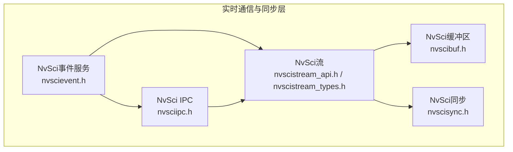
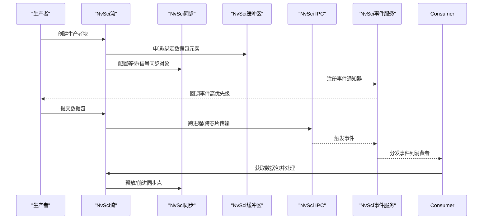
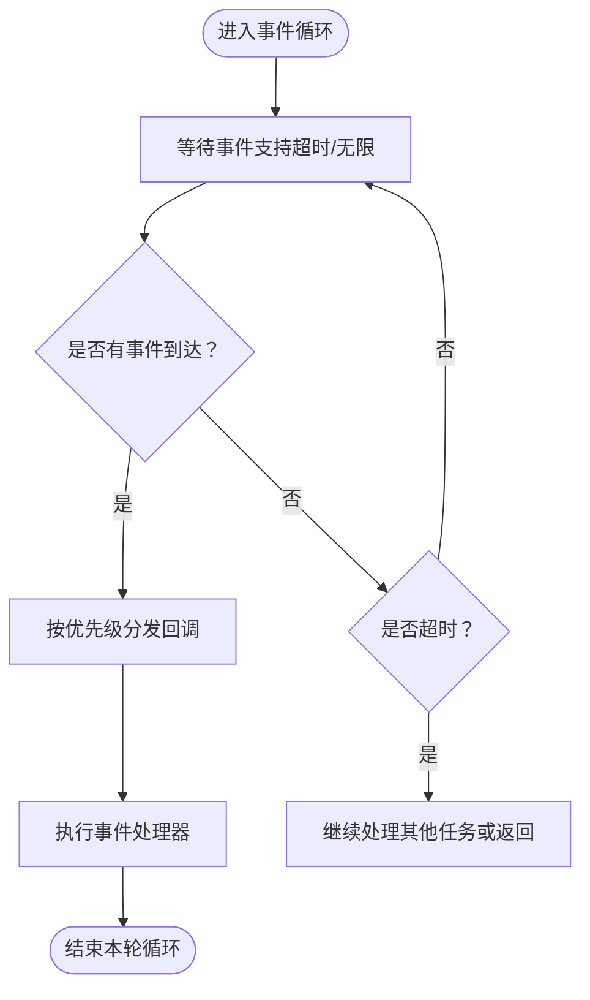
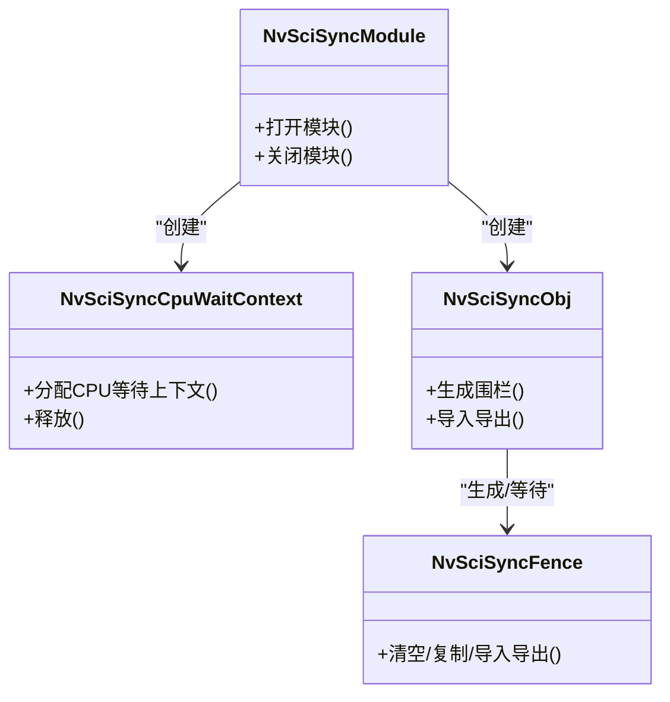
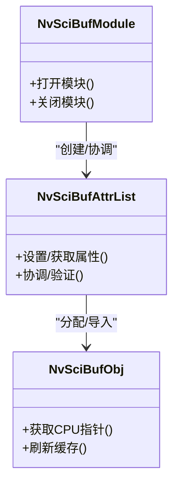
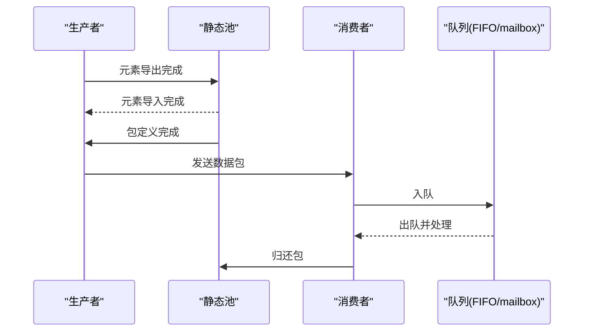
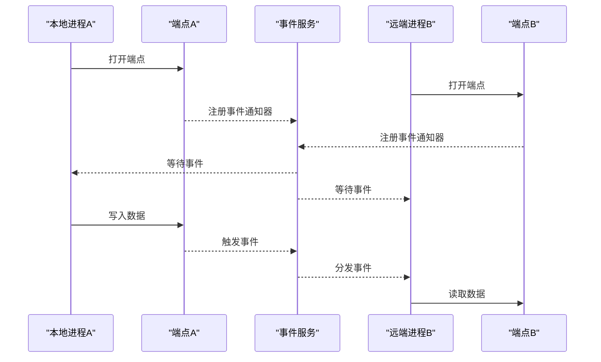
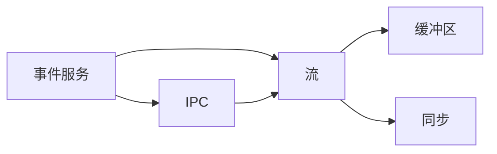

# 实时性性能保证

<cite>
**本文档引用的文件**
- [nvscievent.h](file://driveos-6.0.5.0/usr/include/nvscievent.h)
- [nvscisync.h](file://driveos-6.0.5.0/usr/include/nvscisync.h)
- [nvscibuf.h](file://driveos-6.0.5.0/usr/include/nvscibuf.h)
- [nvscistream.h](file://driveos-6.0.5.0/usr/include/nvscistream.h)
- [nvscistream_api.h](file://driveos-6.0.5.0/usr/include/nvscistream_api.h)
- [nvscistream_types.h](file://driveos-6.0.5.0/usr/include/nvscistream_types.h)
- [nvsciipc.h](file://driveos-6.0.5.0/usr/include/nvsciipc.h)
- [nvscierror.h](file://driveos-6.0.5.0/usr/include/nvscierror.h)
</cite>

## 目录
1. [引言](#引言)
2. [项目结构](#项目结构)
3. [核心组件](#核心组件)
4. [架构总览](#架构总览)
5. [详细组件分析](#详细组件分析)
6. [依赖关系分析](#依赖关系分析)
7. [性能考量](#性能考量)
8. [故障排除指南](#故障排除指南)
9. [结论](#结论)
10. [附录](#附录)

## 引言
本指南面向实时系统开发者，围绕NVIDIA NvSci系列接口（事件服务、同步、缓冲区、流与IPC）构建实时性性能保证体系。内容覆盖：
- 硬实时与软实时的差异及工程实践
- NvSci事件机制在实时应用中的使用：事件优先级管理、中断处理优化
- 系统级实时性策略：调度器配置、CPU亲和性、中断屏蔽
- 使用Nsight工具进行实时性能分析
- 缓冲区管理的实时考虑、内存分配的确定性、网络通信的延迟优化
- 实时应用的测试方法、性能指标评估与故障排除

## 项目结构
该仓库提供了实时通信与同步的核心头文件，涵盖事件驱动模型、跨进程通信、缓冲区与同步对象管理以及数据流管道。下图展示与实时性相关的关键模块及其交互。

**图表来源**
- [nvscievent.h:1-800](file://driveos-6.0.5.0/usr/include/nvscievent.h#L1-L800)
- [nvscisync.h:1-800](file://driveos-6.0.5.0/usr/include/nvscisync.h#L1-L800)
- [nvscibuf.h:1-800](file://driveos-6.0.5.0/usr/include/nvscibuf.h#L1-L800)
- [nvscistream_api.h:1-800](file://driveos-6.0.5.0/usr/include/nvscistream_api.h#L1-L800)
- [nvscistream_types.h:1-505](file://driveos-6.0.5.0/usr/include/nvscistream_types.h#L1-L505)
- [nvsciipc.h:1-800](file://driveos-6.0.5.0/usr/include/nvsciipc.h#L1-L800)

**章节来源**
- [nvscievent.h:1-800](file://driveos-6.0.5.0/usr/include/nvscievent.h#L1-L800)
- [nvscisync.h:1-800](file://driveos-6.0.5.0/usr/include/nvscisync.h#L1-L800)
- [nvscibuf.h:1-800](file://driveos-6.0.5.0/usr/include/nvscibuf.h#L1-L800)
- [nvscistream_api.h:1-800](file://driveos-6.0.5.0/usr/include/nvscistream_api.h#L1-L800)
- [nvscistream_types.h:1-505](file://driveos-6.0.5.0/usr/include/nvscistream_types.h#L1-L505)
- [nvsciipc.h:1-800](file://driveos-6.0.5.0/usr/include/nvsciipc.h#L1-L800)

## 核心组件
- NvSci事件服务：提供事件驱动框架，支持优先级事件等待、事件风暴检测与处理，适用于实时回调与中断场景。
- NvSci同步：提供跨进程/跨芯片的同步原语（如fence、同步对象），确保数据生产消费的时序一致性。
- NvSci缓冲区：统一的缓冲区分配与共享接口，支持CPU/GPU缓存一致性、多GPU访问控制与压缩策略。
- NvSci流：在缓冲区与同步之上构建数据包流水线，管理生产者、消费者、池化与队列等块类型。
- NvSci IPC：提供跨进程/跨芯片的可靠通道，结合事件服务实现低延迟通知与事件聚合。

**章节来源**
- [nvscievent.h:145-800](file://driveos-6.0.5.0/usr/include/nvscievent.h#L145-L800)
- [nvscisync.h:1-800](file://driveos-6.0.5.0/usr/include/nvscisync.h#L1-L800)
- [nvscibuf.h:1-800](file://driveos-6.0.5.0/usr/include/nvscibuf.h#L1-L800)
- [nvscistream_api.h:1-800](file://driveos-6.0.5.0/usr/include/nvscistream_api.h#L1-L800)
- [nvscistream_types.h:1-505](file://driveos-6.0.5.0/usr/include/nvscistream_types.h#L1-L505)
- [nvsciipc.h:1-800](file://driveos-6.0.5.0/usr/include/nvsciipc.h#L1-L800)

## 架构总览
实时系统通常采用“事件驱动 + 同步原语 + 流水线”的分层架构。事件服务负责异步事件的收集与分发；IPC负责跨边界通信；缓冲区与同步保障数据一致性与时序；流封装了生产/消费/池化/队列等块类型，形成可扩展的数据通路。

**图表来源**
- [nvscievent.h:540-773](file://driveos-6.0.5.0/usr/include/nvscievent.h#L540-L773)
- [nvscisync.h:579-620](file://driveos-6.0.5.0/usr/include/nvscisync.h#L579-L620)
- [nvscibuf.h:1-800](file://driveos-6.0.5.0/usr/include/nvscibuf.h#L1-L800)
- [nvscistream_api.h:194-311](file://driveos-6.0.5.0/usr/include/nvscistream_api.h#L194-L311)
- [nvsciipc.h:473-517](file://driveos-6.0.5.0/usr/include/nvsciipc.h#L473-L517)

## 详细组件分析

### NvSci事件服务与实时优先级
- 事件优先级：事件服务定义了优先级上限常量，并允许为处理器设置优先级，确保关键事件优先响应。
- 事件等待：提供单事件与多事件等待接口，支持超时与无限等待，避免阻塞导致的抖动。
- 事件风暴检测：在特定平台提供事件风暴检测与处理能力，防止过多事件导致系统过载。

**图表来源**
- [nvscievent.h:145-150](file://driveos-6.0.5.0/usr/include/nvscievent.h#L145-L150)
- [nvscievent.h:540-773](file://driveos-6.0.5.0/usr/include/nvscievent.h#L540-L773)

**章节来源**
- [nvscievent.h:145-800](file://driveos-6.0.5.0/usr/include/nvscievent.h#L145-L800)

### NvSci同步与确定性
- 同步对象与围栏：通过同步对象与围栏实现跨端点的确定性时序控制，支持CPU等待上下文与最大等待时间。
- 权限与缓存：通过属性键控制CPU/GPU访问权限与缓存一致性，减少不必要的缓存维护开销。
- 任务状态与时间戳：可选的任务状态缓冲与时间戳槽位，便于统计与回溯。

**图表来源**
- [nvscisync.h:579-620](file://driveos-6.0.5.0/usr/include/nvscisync.h#L579-L620)
- [nvscisync.h:240-261](file://driveos-6.0.5.0/usr/include/nvscisync.h#L240-L261)
- [nvscisync.h:168-182](file://driveos-6.0.5.0/usr/include/nvscisync.h#L168-L182)

**章节来源**
- [nvscisync.h:1-800](file://driveos-6.0.5.0/usr/include/nvscisync.h#L1-L800)

### NvSci缓冲区与内存确定性
- 类型与属性：支持原始缓冲、图像、张量等多种类型，通过属性键控制CPU/GPU访问、缓存一致性与压缩策略。
- 多GPU与缓存：针对不同GPU与内存域（系统内存/显存）提供缓存一致性与压缩能力，降低跨域访问开销。
- 导出描述符：提供固定大小的导出描述符，便于跨进程/跨芯片安全共享。

**图表来源**
- [nvscibuf.h:1-800](file://driveos-6.0.5.0/usr/include/nvscibuf.h#L1-L800)

**章节来源**
- [nvscibuf.h:1-800](file://driveos-6.0.5.0/usr/include/nvscibuf.h#L1-L800)

### NvSci流与数据通路
- 块类型：生产者、消费者、静态池、队列（FIFO/mailbox）、多播、IPC/C2C源/汇等。
- 事件模型：通过事件类型驱动连接建立、元素交换、包生命周期管理与错误上报。
- 设置阶段：元素导出/导入、包导出/映射、等待者属性导出/导入、信号对象导出/映射等阶段化配置。

**图表来源**
- [nvscistream_types.h:175-182](file://driveos-6.0.5.0/usr/include/nvscistream_types.h#L175-L182)
- [nvscistream_types.h:356-498](file://driveos-6.0.5.0/usr/include/nvscistream_types.h#L356-L498)
- [nvscistream_api.h:194-311](file://driveos-6.0.5.0/usr/include/nvscistream_api.h#L194-L311)

**章节来源**
- [nvscistream_types.h:1-505](file://driveos-6.0.5.0/usr/include/nvscistream_types.h#L1-L505)
- [nvscistream_api.h:1-800](file://driveos-6.0.5.0/usr/include/nvscistream_api.h#L1-L800)

### NvSci IPC与跨边界通信
- 端点与事件：支持打开端点、获取事件通知器、重置端点、安全关闭等流程。
- 事件服务集成：通过事件服务统一等待多个端点事件，减少线程与阻塞调用数量。
- 平台特性：提供事件风暴检测与脉冲池配置等平台级优化建议。

**图表来源**
- [nvsciipc.h:423-474](file://driveos-6.0.5.0/usr/include/nvsciipc.h#L423-L474)
- [nvsciipc.h:516-517](file://driveos-6.0.5.0/usr/include/nvsciipc.h#L516-L517)
- [nvscievent.h:540-773](file://driveos-6.0.5.0/usr/include/nvscievent.h#L540-L773)

**章节来源**
- [nvsciipc.h:1-800](file://driveos-6.0.5.0/usr/include/nvsciipc.h#L1-L800)
- [nvscievent.h:1-800](file://driveos-6.0.5.0/usr/include/nvscievent.h#L1-L800)

## 依赖关系分析
- 事件服务依赖IPC以获取远端事件通知，并通过事件等待接口统一阻塞。
- 流在缓冲区与同步之上工作，通过事件类型驱动状态机推进。
- IPC与事件服务共同构成跨进程/跨芯片的低延迟通知路径。

**图表来源**
- [nvscievent.h:1-800](file://driveos-6.0.5.0/usr/include/nvscievent.h#L1-L800)
- [nvscistream_api.h:1-800](file://driveos-6.0.5.0/usr/include/nvscistream_api.h#L1-L800)
- [nvscibuf.h:1-800](file://driveos-6.0.5.0/usr/include/nvscibuf.h#L1-L800)
- [nvscisync.h:1-800](file://driveos-6.0.5.0/usr/include/nvscisync.h#L1-L800)
- [nvsciipc.h:1-800](file://driveos-6.0.5.0/usr/include/nvsciipc.h#L1-L800)

**章节来源**
- [nvscievent.h:1-800](file://driveos-6.0.5.0/usr/include/nvscievent.h#L1-L800)
- [nvscistream_api.h:1-800](file://driveos-6.0.5.0/usr/include/nvscistream_api.h#L1-L800)
- [nvscibuf.h:1-800](file://driveos-6.0.5.0/usr/include/nvscibuf.h#L1-L800)
- [nvscisync.h:1-800](file://driveos-6.0.5.0/usr/include/nvscisync.h#L1-L800)
- [nvsciipc.h:1-800](file://driveos-6.0.5.0/usr/include/nvsciipc.h#L1-L800)

## 性能考量
- 硬实时 vs 软实时
  - 硬实时：严格截止时间，必须保证在最坏情况下也能满足；适合控制环、触发器等。
  - 软实时：容忍一定抖动，追求平均延迟与吞吐；适合媒体/视觉处理流水线。
  - 工程要点：通过事件优先级、最小化阻塞等待、确定性内存与缓存策略降低抖动。

- 事件优先级与中断处理
  - 利用事件服务的优先级设置，将关键事件（如传感器中断、控制命令）置于更高优先级。
  - 在中断上下文中仅做轻量处理，将重负载放入事件处理器或工作线程。

- 系统级实时性策略
  - 调度器配置：优先使用实时调度策略（如SCHED_FIFO/RTP），限制时间片抢占。
  - CPU亲和性：将关键线程绑定到特定CPU核，减少跨核迁移与TLB抖动。
  - 中断屏蔽：缩短中断处理时间，必要时启用中断合并与批处理。

- 缓冲区管理与内存分配
  - 使用NvSci缓冲区的导出描述符与属性键，提前声明CPU/GPU访问权限与缓存需求，避免运行期反复调整。
  - 控制缓存一致性与压缩策略，减少跨域访问带来的延迟与带宽消耗。

- 网络通信延迟优化
  - 使用事件服务聚合多个端点事件，减少线程与阻塞调用数量。
  - IPC端点配置脉冲池与事件风暴检测，避免大量脉冲导致的系统过载。

- Nsight工具使用
  - 使用Nsight Systems/Nsight Compute对实时路径进行采样，识别瓶颈（CPU、GPU、IPC、缓存）。
  - 关注中断延迟、上下文切换、锁竞争与内存带宽利用率。

[本节为通用指导，不直接分析具体文件]

## 故障排除指南
- 常见错误码与定位
  - 初始化/参数错误：检查初始化顺序与参数有效性（如端点名、句柄、属性列表）。
  - 资源不足：内存/资源不足时需释放占用资源或扩大系统资源。
  - 连接/状态异常：确认端点已建立连接且处于正确状态（连接/断开/就绪）。
  - 超时/忙：合理设置超时与重试策略，避免长时间阻塞。

- 事件风暴与端点异常
  - 使用事件风暴检测接口定位问题端点，采取关闭端点、重启进程或降级处理等措施。
  - 调整脉冲池容量与阈值，缓解事件洪峰。

- 同步与缓冲一致性
  - 检查同步对象权限与围栏状态，确保等待/信号配对正确。
  - 根据属性键配置缓存一致性，避免脏读与写放大。

**章节来源**
- [nvscierror.h:45-281](file://driveos-6.0.5.0/usr/include/nvscierror.h#L45-L281)
- [nvsciipc.h:268-275](file://driveos-6.0.5.0/usr/include/nvsciipc.h#L268-L275)
- [nvscisync.h:579-620](file://driveos-6.0.5.0/usr/include/nvscisync.h#L579-L620)
- [nvscibuf.h:1-800](file://driveos-6.0.5.0/usr/include/nvscibuf.h#L1-L800)

## 结论
通过事件驱动、确定性同步与缓冲区管理，结合IPC的低延迟通知与流的流水线化组织，NvSci为实时系统提供了可扩展、可预测的性能基础。工程实践中应重视事件优先级、内存与缓存策略、系统调度与中断处理，并借助Nsight工具进行深入分析与优化，最终达成硬实时或软实时的性能目标。

[本节为总结性内容，不直接分析具体文件]

## 附录
- 实时测试方法
  - 基准测试：在稳定负载下测量端到端延迟分布（均值、P95/P99）。
  - 抖动测试：施加突发流量与干扰，观察延迟抖动与恢复时间。
  - 压力测试：逐步提升负载，记录系统崩溃点与退化点。
- 性能指标
  - 延迟：最小/最大/均值/P95/P99
  - 吞吐：包/帧/字节速率
  - 抖动：标准差/变异系数
  - 可靠性：丢包率、重传率、错误率
- 故障排除清单
  - 检查初始化顺序与参数
  - 核对事件优先级与等待策略
  - 审视缓冲区权限与缓存一致性
  - 分析IPC端点状态与事件风暴

[本节为通用指导，不直接分析具体文件]