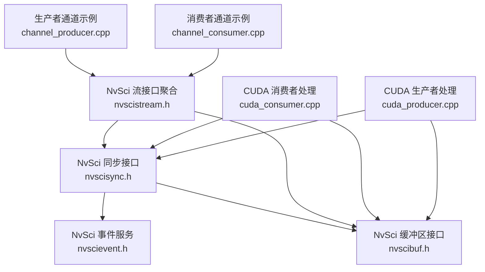
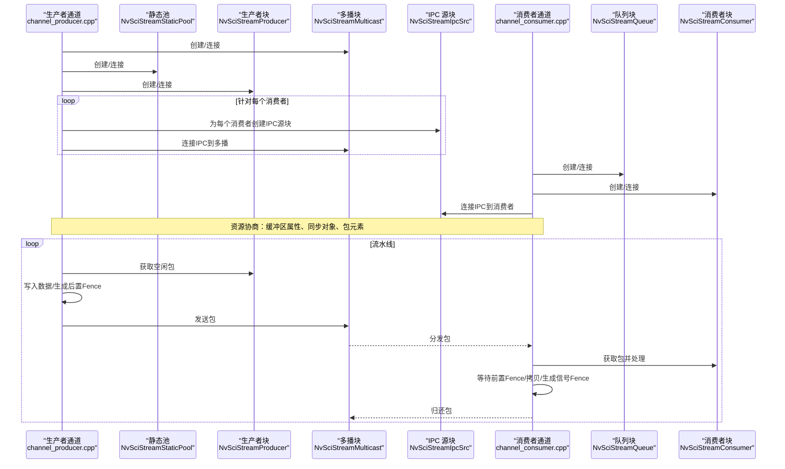
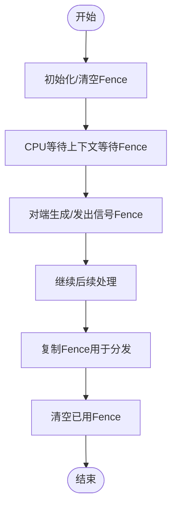
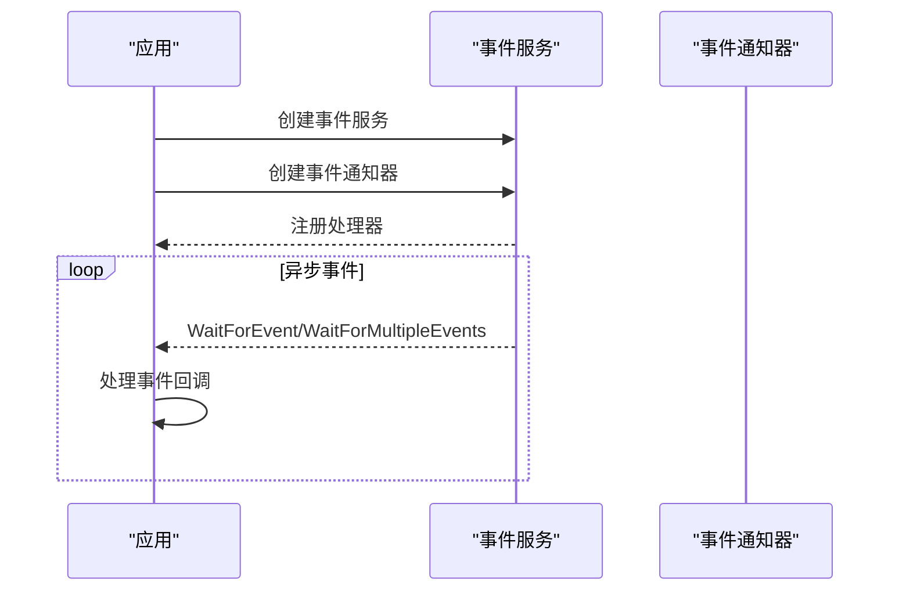
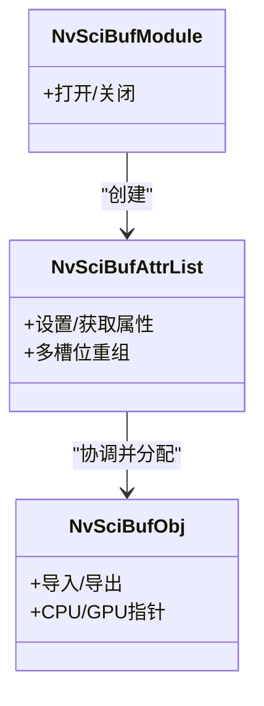
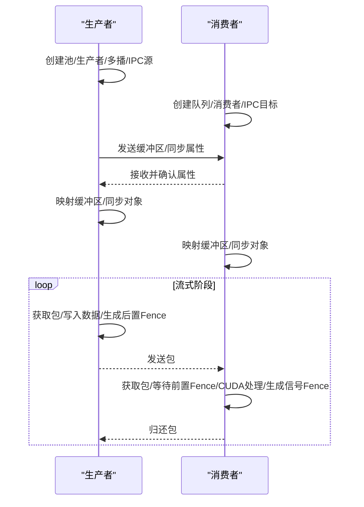
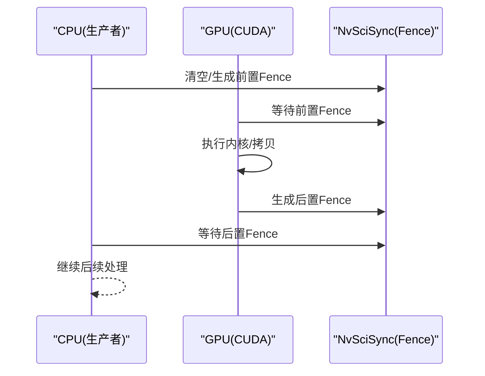
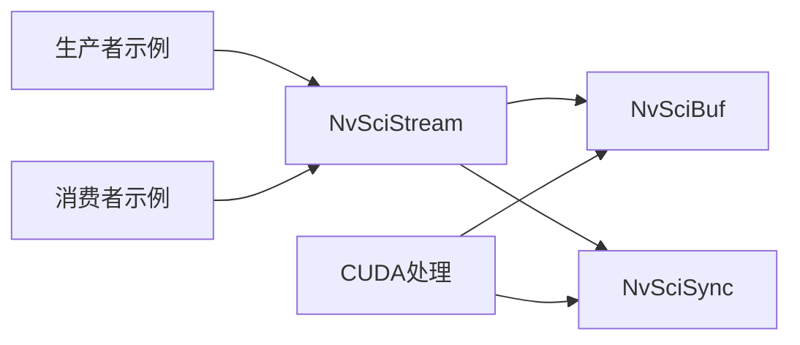

# 并行处理优化

<cite>
**本文引用的文件**
- [nvscisync.h](file://driveos-5260/drive-linux/include/nvscisync.h)
- [nvscievent.h](file://driveos-5260/drive-linux/include/nvscievent.h)
- [nvscibuf.h](file://driveos-5260/drive-linux/include/nvscibuf.h)
- [nvscistream.h](file://driveos-5260/drive-linux/include/nvscistream.h)
- [channel_producer.cpp](file://driveos-5260/drive-linux/samples/nvsci/nvscistream/multicast/channel_producer.cpp)
- [channel_consumer.cpp](file://driveos-5260/drive-linux/samples/nvsci/nvscistream/multicast/channel_consumer.cpp)
- [cuda_consumer.cpp](file://driveos-5260/drive-linux/samples/nvsci/nvscistream/multicast/cuda_consumer.cpp)
- [cuda_producer.cpp](file://driveos-5260/drive-linux/samples/nvsci/nvscistream/multicast_safety/cuda_producer.cpp)
- [README.md](file://README.md)
</cite>

## 目录
1. [引言](#引言)
2. [项目结构](#项目结构)
3. [核心组件](#核心组件)
4. [架构总览](#架构总览)
5. [详细组件分析](#详细组件分析)
6. [依赖关系分析](#依赖关系分析)
7. [性能考量](#性能考量)
8. [故障排查指南](#故障排查指南)
9. [结论](#结论)
10. [附录](#附录)

## 引言
本指南聚焦于在DriveOS/NVIDIA平台上的并行处理优化实践，围绕NvSci同步机制（屏障与事件同步）、CUDA并行编程、流水线并行策略、以及Thrust库使用进行系统化阐述，并结合仓库中提供的NvSciStream多播示例，给出可落地的实现路径、性能测试方法与调试技巧。

## 项目结构
该仓库包含驱动与SDK文档、CUDA相关主题文档、以及NvSci流媒体示例。与并行优化直接相关的代码位于：
- NvSci头文件：nvscisync.h、nvscievent.h、nvscibuf.h、nvscistream.h
- 示例：多播生产者/消费者通道与CUDA端处理逻辑

图示来源
- [nvscisync.h](file://driveos-5260/drive-linux/include/nvscisync.h)
- [nvscievent.h](file://driveos-5260/drive-linux/include/nvscievent.h)
- [nvscibuf.h](file://driveos-5260/drive-linux/include/nvscibuf.h)
- [nvscistream.h](file://driveos-5260/drive-linux/include/nvscistream.h)
- [channel_producer.cpp](file://driveos-5260/drive-linux/samples/nvsci/nvscistream/multicast/channel_producer.cpp)
- [channel_consumer.cpp](file://driveos-5260/drive-linux/samples/nvsci/nvscistream/multicast/channel_consumer.cpp)
- [cuda_consumer.cpp](file://driveos-5260/drive-linux/samples/nvsci/nvscistream/multicast/cuda_consumer.cpp)
- [cuda_producer.cpp](file://driveos-5260/drive-linux/samples/nvsci/nvscistream/multicast_safety/cuda_producer.cpp)

章节来源
- [README.md](file://README.md)

## 核心组件
- NvSciSync：跨进程/跨模块的同步原语，提供等待/信号能力与Fence管理，支持CPU等待上下文与跨进程导出导入。
- NvSciBuf：缓冲区分配与跨进程共享，支持图像/张量等类型，提供访问权限、缓存一致性、GPU可见性等属性。
- NvSciEvent：事件循环抽象，封装异步事件等待与回调，支撑NvSci IPC与Stream的事件驱动模型。
- NvSciStream：在NvSciBuf与NvSciSync之上构建的流式数据包传输框架，支持静态池、队列、多播连接与资源协商。

章节来源
- [nvscisync.h](file://driveos-5260/drive-linux/include/nvscisync.h)
- [nvscievent.h](file://driveos-5260/drive-linux/include/nvscievent.h)
- [nvscibuf.h](file://driveos-5260/drive-linux/include/nvscibuf.h)
- [nvscistream.h](file://driveos-5260/drive-linux/include/nvscistream.h)

## 架构总览
下图展示生产者-消费者多播流水线在NvSciStream中的连接与数据流：

图示来源
- [channel_producer.cpp](file://driveos-5260/drive-linux/samples/nvsci/nvscistream/multicast/channel_producer.cpp)
- [channel_consumer.cpp](file://driveos-5260/drive-linux/samples/nvsci/nvscistream/multicast/channel_consumer.cpp)

## 详细组件分析

### NvSci 同步机制与Fence管理
- Fence生命周期与状态：清空态与非清空态；通过生成/复制/清空控制；支持跨进程导出/导入。
- CPU等待上下文：为CPU侧等待提供专用上下文，避免阻塞式轮询。
- 权限模型：等待/信号权限组合决定对象的可用能力；导出导入时权限累加与校验。

图示来源
- [nvscisync.h](file://driveos-5260/drive-linux/include/nvscisync.h)

章节来源
- [nvscisync.h](file://driveos-5260/drive-linux/include/nvscisync.h)

### 事件驱动与异步通知
- 事件服务抽象：事件循环、等待多个事件、处理器注册。
- 在NvSciStream中，事件驱动贯穿连接建立、资源协商、包就绪通知等阶段。

图示来源
- [nvscievent.h](file://driveos-5260/drive-linux/include/nvscievent.h)

章节来源
- [nvscievent.h](file://driveos-5260/drive-linux/include/nvscievent.h)

### 缓冲区共享与GPU可见性
- 类型与权限：图像/张量/原始缓冲区；读写权限、CPU访问需求、缓存一致性开关。
- GPU可见性：通过GPU ID与外部内存导入，使CUDA内核直接访问共享缓冲区。
- 属性协商：在NvSciStream中由生产者/消费者分别声明并最终协调一致。

图示来源
- [nvscibuf.h](file://driveos-5260/drive-linux/include/nvscibuf.h)

章节来源
- [nvscibuf.h](file://driveos-5260/drive-linux/include/nvscibuf.h)

### 生产者-消费者多播流水线
- 生产者侧：创建静态池、生产者块、多播/单播连接、IPC源块、发送包。
- 消费者侧：创建队列、消费者块、IPC目标块、接收包、处理并归还。
- 资源协商：先交换缓冲区与同步对象属性，再映射缓冲区与同步对象，最后进入流式阶段。

图示来源
- [channel_producer.cpp](file://driveos-5260/drive-linux/samples/nvsci/nvscistream/multicast/channel_producer.cpp)
- [channel_consumer.cpp](file://driveos-5260/drive-linux/samples/nvsci/nvscistream/multicast/channel_consumer.cpp)

章节来源
- [channel_producer.cpp](file://driveos-5260/drive-linux/samples/nvsci/nvscistream/multicast/channel_producer.cpp)
- [channel_consumer.cpp](file://driveos-5260/drive-linux/samples/nvsci/nvscistream/multicast/channel_consumer.cpp)

### CUDA端并行处理与同步
- 外部内存/信号量导入：将NvSciBuf/NvSciSync对象转换为CUDA可直接使用的句柄。
- 前置/后置Fence：在CUDA执行前后分别等待/信号，确保严格的时序约束。
- 数据传输：主机到设备/设备到主机拷贝，配合Fence保证数据可见性。

图示来源
- [cuda_consumer.cpp](file://driveos-5260/drive-linux/samples/nvsci/nvscistream/multicast/cuda_consumer.cpp)
- [cuda_producer.cpp](file://driveos-5260/drive-linux/samples/nvsci/nvscistream/multicast_safety/cuda_producer.cpp)

章节来源
- [cuda_consumer.cpp](file://driveos-5260/drive-linux/samples/nvsci/nvscistream/multicast/cuda_consumer.cpp)
- [cuda_producer.cpp](file://driveos-5260/drive-linux/samples/nvsci/nvscistream/multicast_safety/cuda_producer.cpp)

## 依赖关系分析
- NvSciStream依赖NvSciBuf与NvSciSync完成缓冲区与同步对象的跨进程/跨模块共享。
- 示例生产者/消费者通过NvSciStream块连接形成多播拓扑，事件驱动贯穿整个生命周期。
- CUDA端通过外部导入接口与NvSci对象协作，实现高性能的数据搬运与计算。

图示来源
- [nvscistream.h](file://driveos-5260/drive-linux/include/nvscistream.h)
- [nvscibuf.h](file://driveos-5260/drive-linux/include/nvscibuf.h)
- [nvscisync.h](file://driveos-5260/drive-linux/include/nvscisync.h)
- [channel_producer.cpp](file://driveos-5260/drive-linux/samples/nvsci/nvscistream/multicast/channel_producer.cpp)
- [channel_consumer.cpp](file://driveos-5260/drive-linux/samples/nvsci/nvscistream/multicast/channel_consumer.cpp)
- [cuda_consumer.cpp](file://driveos-5260/drive-linux/samples/nvsci/nvscistream/multicast/cuda_consumer.cpp)
- [cuda_producer.cpp](file://driveos-5260/drive-linux/samples/nvsci/nvscistream/multicast_safety/cuda_producer.cpp)

## 性能考量
- 同步粒度与开销
  - 使用Fence进行细粒度同步，避免全局屏障导致的串行化瓶颈。
  - 将CPU等待限制在必要场景，优先采用事件驱动与异步通知。
- 缓冲区与内存一致性
  - 合理设置CPU缓存与GPU可见性，减少不必要的flush与同步。
  - 利用NvSciBuf的多类型支持，选择最适合的布局（如块线性）以提升GPU访问效率。
- CUDA执行与传输
  - 将数据搬运与计算重叠，利用多流或多GPU并行。
  - 控制线程块/网格规模，确保SM利用率与占用率平衡。
- 流水线深度
  - 增大静态池大小与队列深度，提高并发度与吞吐。
  - 保持生产者/消费者速率匹配，避免拥塞或饥饿。

## 故障排查指南
- 连接与事件查询超时
  - 检查IPC端点是否正确打开与复位；确认事件循环正常运行。
  - 在资源协商阶段，逐步打印收到的事件类型，定位阻塞点。
- 同步对象未就绪或权限不匹配
  - 校验属性列表的权限与CPU访问需求是否一致；导出/导入后验证实际权限。
  - 确保Fence在每次使用前被清空并在传递后及时复制/清空。
- CUDA导入失败或访问异常
  - 确认GPU UUID与NvSciBuf/GPU ID一致；检查外部内存/信号量导入参数。
  - 核对缓冲区尺寸与对齐要求，避免越界访问。
- 性能退化
  - 使用事件查询超时阈值与轮询次数上限，避免死等。
  - 评估流水线深度与缓冲区大小，调整以适配带宽与延迟预算。

章节来源
- [channel_producer.cpp](file://driveos-5260/drive-linux/samples/nvsci/nvscistream/multicast/channel_producer.cpp)
- [channel_consumer.cpp](file://driveos-5260/drive-linux/samples/nvsci/nvscistream/multicast/channel_consumer.cpp)
- [cuda_consumer.cpp](file://driveos-5260/drive-linux/samples/nvsci/nvscistream/multicast/cuda_consumer.cpp)
- [cuda_producer.cpp](file://driveos-5260/drive-linux/samples/nvsci/nvscistream/multicast_safety/cuda_producer.cpp)

## 结论
通过NvSciStream的事件驱动与资源协商机制，结合NvSciBuf/NvSciSync的跨进程共享与同步能力，可在多核CPU与GPU环境下构建高吞吐、低延迟的并行流水线。CUDA端通过外部导入接口与Fence严格时序控制，实现高效的数据搬运与计算。建议在工程实践中以事件驱动为核心，以细粒度同步与合理的流水线深度为抓手，持续进行性能测试与调优。

## 附录
- 参考文档主题（CUDA）
  - 性能剖析与分析：nsight-compute、nsight-system、profiler
  - CUDA微调与兼容性：tuning、compatibility
  - DLA与MIG：dla、mig
  - CUDA实用工具：utilities
  - Thrust库：thrust