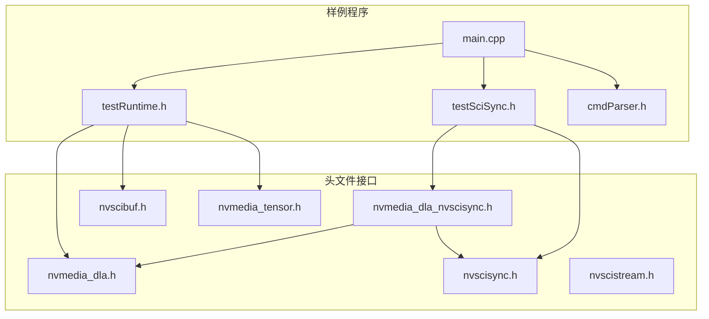
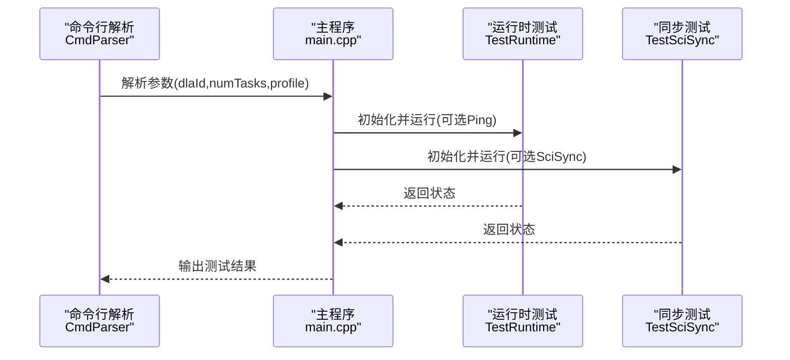
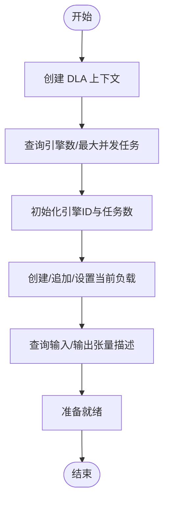
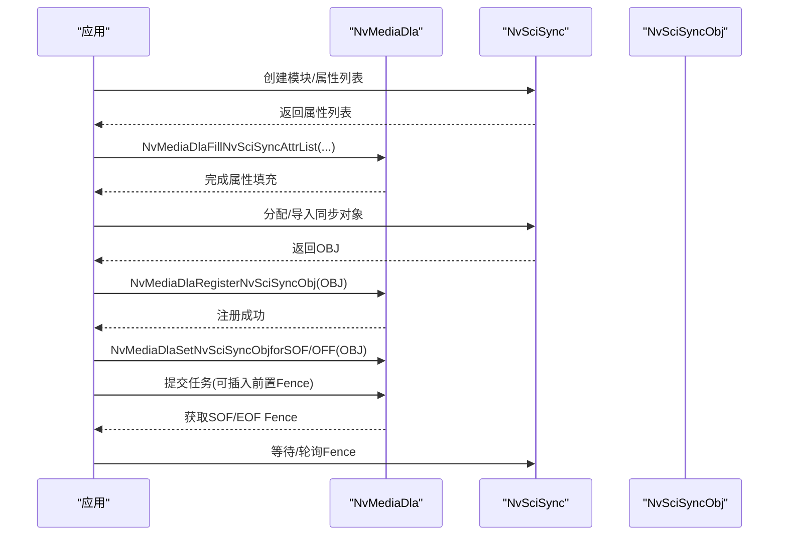
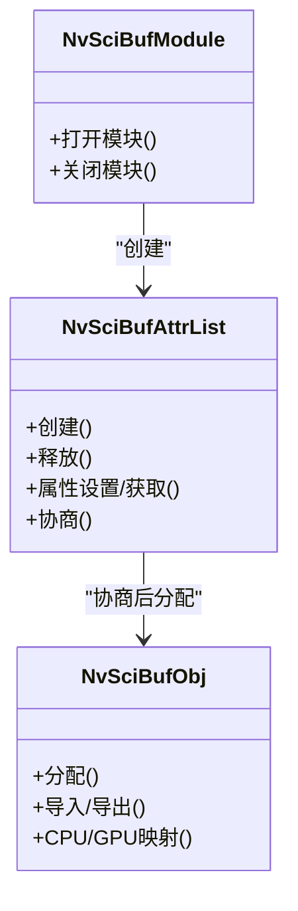
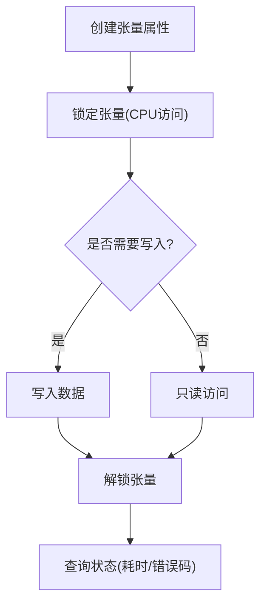
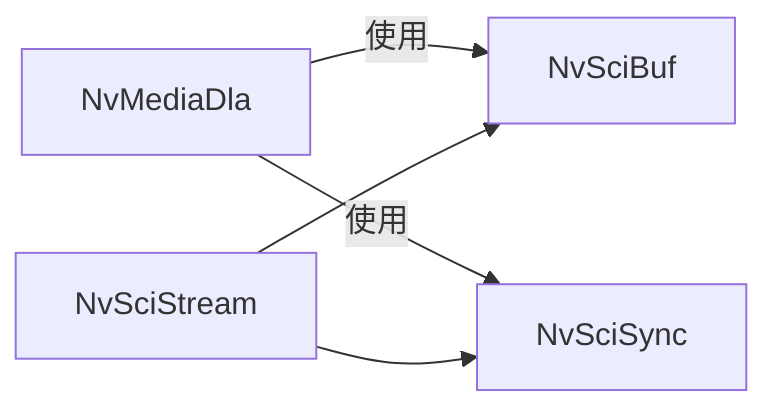

# 性能优化

<cite>
**本文引用的文件**
- [nvmedia_dla.h](file://driveos-6.0.5.0/drive-linux/include/nvmedia_dla.h)
- [nvmedia_dla_nvscisync.h](file://driveos-6.0.5.0/drive-linux/include/nvmedia_dla_nvscisync.h)
- [nvscisync.h](file://driveos-6.0.5.0/drive-linux/include/nvscisync.h)
- [nvscibuf.h](file://driveos-6.0.5.0/drive-linux/include/nvscibuf.h)
- [nvscistream.h](file://driveos-6.0.5.0/drive-linux/include/nvscistream.h)
- [nvmedia_tensor.h](file://driveos-6.0.5.0/drive-linux/include/nvmedia_tensor.h)
- [main.cpp](file://driveos-6.0.5.0/drive-linux/samples/nvmedia/dla_sample/main.cpp)
- [testRuntime.h](file://driveos-6.0.5.0/drive-linux/samples/nvmedia/dla_sample/testRuntime.h)
- [testSciSync.h](file://driveos-6.0.5.0/drive-linux/samples/nvmedia/dla_sample/testSciSync.h)
- [cmdParser.h](file://driveos-6.0.5.0/drive-linux/samples/nvmedia/dla_sample/cmdline/cmdParser.h)
</cite>

## 目录
1. [简介](#简介)
2. [项目结构](#项目结构)
3. [核心组件](#核心组件)
4. [架构总览](#架构总览)
5. [详细组件分析](#详细组件分析)
6. [依赖关系分析](#依赖关系分析)
7. [性能考量与优化建议](#性能考量与优化建议)
8. [故障排查指南](#故障排查指南)
9. [结论](#结论)
10. [附录：性能测试与分析方法](#附录性能测试与分析方法)

## 简介
本指南面向在 DriveOS 平台上进行高性能推理与媒体处理的开发者，聚焦以下主题：
- GPU 加速优化策略：CUDA 编程最佳实践、内存管理优化、并行处理技巧
- DLA（深度学习加速器）使用与调优：上下文配置、任务队列、输入输出张量与负载管理
- NvSci 同步机制：NvSciBuf/NvSciSync/NvSciStream 在跨模块/进程数据流与同步中的作用
- Profiler 工具与性能分析：如何利用现有样例与工具定位瓶颈
- 实时性保障、缓存优化、流水线处理等系统级优化方案

本指南以仓库中 DLA 样例与 NvSci 接口为依据，结合接口文档与样例入口，给出可操作的优化路径与验证方法。

## 项目结构
本仓库与性能优化相关的核心目录与文件如下：
- 头文件层：包含 DLA、NvSciBuf、NvSciSync、NvSciStream、Tensor 等接口定义
- 样例层：基于 DLA 的运行时测试、同步测试与命令行参数解析
- 配置与工具：命令行参数解析、日志与测试流程组织

图示来源
- [nvmedia_dla.h:1-1234](file://driveos-6.0.5.0/drive-linux/include/nvmedia_dla.h#L1-L1234)
- [nvmedia_dla_nvscisync.h:1-704](file://driveos-6.0.5.0/drive-linux/include/nvmedia_dla_nvscisync.h#L1-L704)
- [nvscisync.h:1-800](file://driveos-6.0.5.0/drive-linux/include/nvscisync.h#L1-L800)
- [nvscibuf.h:1-800](file://driveos-6.0.5.0/drive-linux/include/nvscibuf.h#L1-L800)
- [nvscistream.h:1-32](file://driveos-6.0.5.0/drive-linux/include/nvscistream.h#L1-L32)
- [nvmedia_tensor.h:1-544](file://driveos-6.0.5.0/drive-linux/include/nvmedia_tensor.h#L1-L544)
- [main.cpp:1-115](file://driveos-6.0.5.0/drive-linux/samples/nvmedia/dla_sample/main.cpp#L1-L115)
- [testRuntime.h:1-77](file://driveos-6.0.5.0/drive-linux/samples/nvmedia/dla_sample/testRuntime.h#L1-L77)
- [testSciSync.h:1-69](file://driveos-6.0.5.0/drive-linux/samples/nvmedia/dla_sample/testSciSync.h#L1-L69)
- [cmdParser.h:1-51](file://driveos-6.0.5.0/drive-linux/samples/nvmedia/dla_sample/cmdline/cmdParser.h#L1-L51)

章节来源
- [main.cpp:1-115](file://driveos-6.0.5.0/drive-linux/samples/nvmedia/dla_sample/main.cpp#L1-L115)
- [cmdParser.h:1-51](file://driveos-6.0.5.0/drive-linux/samples/nvmedia/dla_sample/cmdline/cmdParser.h#L1-L51)

## 核心组件
- DLA 运行时接口：设备创建、上下文初始化、引擎数量与最大并发任务查询、负载加载与当前负载的输入/输出张量描述获取
- DLA 与 NvSci 同步集成：注册/注销同步对象、设置帧起止事件、插入前置同步栅栏、获取起止 Fence
- NvSciBuf：缓冲区属性协商、CPU/GPU 可见性、缓存一致性、GPU 压缩与缓存维护
- NvSciSync：模块/属性列表/同步对象/Fence 生命周期与等待
- NvSciStream：在 NvSciBuf/NvSciSync 之上提供数据包流式传输能力
- Tensor 抽象：张量属性、CPU 访问模式、锁定/解锁与状态查询

章节来源
- [nvmedia_dla.h:346-502](file://driveos-6.0.5.0/drive-linux/include/nvmedia_dla.h#L346-L502)
- [nvmedia_dla.h:533-616](file://driveos-6.0.5.0/drive-linux/include/nvmedia_dla.h#L533-L616)
- [nvmedia_dla.h:694-729](file://driveos-6.0.5.0/drive-linux/include/nvmedia_dla.h#L694-L729)
- [nvmedia_dla_nvscisync.h:131-187](file://driveos-6.0.5.0/drive-linux/include/nvmedia_dla_nvscisync.h#L131-L187)
- [nvmedia_dla_nvscisync.h:236-286](file://driveos-6.0.5.0/drive-linux/include/nvmedia_dla_nvscisync.h#L236-L286)
- [nvmedia_dla_nvscisync.h:329-380](file://driveos-6.0.5.0/drive-linux/include/nvmedia_dla_nvscisync.h#L329-L380)
- [nvmedia_dla_nvscisync.h:430-434](file://driveos-6.0.5.0/drive-linux/include/nvmedia_dla_nvscisync.h#L430-L434)
- [nvmedia_dla_nvscisync.h:490-557](file://driveos-6.0.5.0/drive-linux/include/nvmedia_dla_nvscisync.h#L490-L557)
- [nvscisync.h:587-628](file://driveos-6.0.5.0/drive-linux/include/nvscisync.h#L587-L628)
- [nvscisync.h:729-760](file://driveos-6.0.5.0/drive-linux/include/nvscisync.h#L729-L760)
- [nvscibuf.h:383-597](file://driveos-6.0.5.0/drive-linux/include/nvscibuf.h#L383-L597)
- [nvmedia_tensor.h:347-378](file://driveos-6.0.5.0/drive-linux/include/nvmedia_tensor.h#L347-L378)

## 架构总览
下图展示了 DLA 样例的主流程与关键接口交互：命令行解析、运行时测试与同步测试两条路径，分别对应 DLA 运行时与 DLA+NvSciSync 的组合使用。

图示来源
- [main.cpp:21-115](file://driveos-6.0.5.0/drive-linux/samples/nvmedia/dla_sample/main.cpp#L21-L115)
- [cmdParser.h:30-48](file://driveos-6.0.5.0/drive-linux/samples/nvmedia/dla_sample/cmdline/cmdParser.h#L30-L48)
- [testRuntime.h:24-39](file://driveos-6.0.5.0/drive-linux/samples/nvmedia/dla_sample/testRuntime.h#L24-L39)
- [testSciSync.h:21-33](file://driveos-6.0.5.0/drive-linux/samples/nvmedia/dla_sample/testSciSync.h#L21-L33)

## 详细组件分析

### DLA 运行时与负载管理
- 设备与上下文：创建 DLA 上下文、查询引擎数与最大并发任务数、初始化指定引擎与任务数
- 负载管理：创建/销毁可加载对象、追加二进制负载、设置当前负载、查询输入/输出张量描述
- 输入输出：通过张量描述与 NvSciBuf/NvSciSync 协同，确保数据布局与权限满足 DLA 执行要求

图示来源
- [nvmedia_dla.h:249-280](file://driveos-6.0.5.0/drive-linux/include/nvmedia_dla.h#L249-L280)
- [nvmedia_dla.h:346-350](file://driveos-6.0.5.0/drive-linux/include/nvmedia_dla.h#L346-L350)
- [nvmedia_dla.h:423-428](file://driveos-6.0.5.0/drive-linux/include/nvmedia_dla.h#L423-L428)
- [nvmedia_dla.h:533-537](file://driveos-6.0.5.0/drive-linux/include/nvmedia_dla.h#L533-L537)
- [nvmedia_dla.h:611-616](file://driveos-6.0.5.0/drive-linux/include/nvmedia_dla.h#L611-L616)
- [nvmedia_dla.h:694-729](file://driveos-6.0.5.0/drive-linux/include/nvmedia_dla.h#L694-L729)

章节来源
- [nvmedia_dla.h:249-280](file://driveos-6.0.5.0/drive-linux/include/nvmedia_dla.h#L249-L280)
- [nvmedia_dla.h:346-350](file://driveos-6.0.5.0/drive-linux/include/nvmedia_dla.h#L346-L350)
- [nvmedia_dla.h:423-428](file://driveos-6.0.5.0/drive-linux/include/nvmedia_dla.h#L423-L428)
- [nvmedia_dla.h:533-537](file://driveos-6.0.5.0/drive-linux/include/nvmedia_dla.h#L533-L537)
- [nvmedia_dla.h:611-616](file://driveos-6.0.5.0/drive-linux/include/nvmedia_dla.h#L611-L616)
- [nvmedia_dla.h:694-729](file://driveos-6.0.5.0/drive-linux/include/nvmedia_dla.h#L694-L729)

### DLA 与 NvSciSync 集成
- 属性填充：为 DLA 信号者/等待者生成 NvSciSync 属性列表，自动设置所需权限
- 同步对象注册：将 NvSciSync 对象注册到 DLA，区分 SOF/EOF/PRE 等类型
- 帧事件：设置/获取起始/结束 Fence，或直接使用同步对象作为 SOF/EOF
- 前置栅栏：在提交前插入多个前置 Fence，控制执行时机

图示来源
- [nvmedia_dla_nvscisync.h:131-136](file://driveos-6.0.5.0/drive-linux/include/nvmedia_dla_nvscisync.h#L131-L136)
- [nvmedia_dla_nvscisync.h:236-241](file://driveos-6.0.5.0/drive-linux/include/nvmedia_dla_nvscisync.h#L236-L241)
- [nvmedia_dla_nvscisync.h:329-333](file://driveos-6.0.5.0/drive-linux/include/nvmedia_dla_nvscisync.h#L329-L333)
- [nvmedia_dla_nvscisync.h:430-434](file://driveos-6.0.5.0/drive-linux/include/nvmedia_dla_nvscisync.h#L430-L434)
- [nvmedia_dla_nvscisync.h:490-495](file://driveos-6.0.5.0/drive-linux/include/nvmedia_dla_nvscisync.h#L490-L495)
- [nvmedia_dla_nvscisync.h:552-557](file://driveos-6.0.5.0/drive-linux/include/nvmedia_dla_nvscisync.h#L552-L557)

章节来源
- [nvmedia_dla_nvscisync.h:131-136](file://driveos-6.0.5.0/drive-linux/include/nvmedia_dla_nvscisync.h#L131-L136)
- [nvmedia_dla_nvscisync.h:236-241](file://driveos-6.0.5.0/drive-linux/include/nvmedia_dla_nvscisync.h#L236-L241)
- [nvmedia_dla_nvscisync.h:329-333](file://driveos-6.0.5.0/drive-linux/include/nvmedia_dla_nvscisync.h#L329-L333)
- [nvmedia_dla_nvscisync.h:430-434](file://driveos-6.0.5.0/drive-linux/include/nvmedia_dla_nvscisync.h#L430-L434)
- [nvmedia_dla_nvscisync.h:490-495](file://driveos-6.0.5.0/drive-linux/include/nvmedia_dla_nvscisync.h#L490-L495)
- [nvmedia_dla_nvscisync.h:552-557](file://driveos-6.0.5.0/drive-linux/include/nvmedia_dla_nvscisync.h#L552-L557)

### NvSciBuf 与缓存一致性
- 类型与属性：支持 RawBuffer/Image/Tensor/Array/Pyramid 等类型；通过属性键协商 CPU/GPU 可见性、缓存策略、压缩与权限
- GPU 缓存与一致性：根据 GPU 类型与内存域决定是否需要软件缓存一致性；在多 GPU/多访问场景下自动推导缓存策略
- 导出/导入：通过导出描述在进程间共享缓冲区，减少拷贝

图示来源
- [nvscibuf.h:383-597](file://driveos-6.0.5.0/drive-linux/include/nvscibuf.h#L383-L597)

章节来源
- [nvscibuf.h:383-597](file://driveos-6.0.5.0/drive-linux/include/nvscibuf.h#L383-L597)

### 张量抽象与 CPU 访问
- 张量属性：数据类型、位宽、维度顺序、CPU 访问模式（未映射/缓存/未缓存）、分配类型
- 锁定/解锁：在 CPU 需要直接访问张量数据时使用，注意等待与超时
- 状态查询：获取上次操作状态与耗时，辅助性能分析

图示来源
- [nvmedia_tensor.h:347-378](file://driveos-6.0.5.0/drive-linux/include/nvmedia_tensor.h#L347-L378)
- [nvmedia_tensor.h:408-413](file://driveos-6.0.5.0/drive-linux/include/nvmedia_tensor.h#L408-L413)

章节来源
- [nvmedia_tensor.h:347-378](file://driveos-6.0.5.0/drive-linux/include/nvmedia_tensor.h#L347-L378)
- [nvmedia_tensor.h:408-413](file://driveos-6.0.5.0/drive-linux/include/nvmedia_tensor.h#L408-L413)

## 依赖关系分析
- DLA 依赖 NvSciBuf/NvSciSync：用于缓冲区与同步的统一管理
- DLA+NvSciSync：通过属性填充与对象注册，将 DLA 的起止事件与外部模块的同步点对齐
- NvSciStream：在 NvSciBuf/NvSciSync 基础上提供流式数据包传输，适合多模块流水线

图示来源
- [nvmedia_dla.h:27-28](file://driveos-6.0.5.0/drive-linux/include/nvmedia_dla.h#L27-L28)
- [nvscistream.h:28-29](file://driveos-6.0.5.0/drive-linux/include/nvscistream.h#L28-L29)

章节来源
- [nvmedia_dla.h:27-28](file://driveos-6.0.5.0/drive-linux/include/nvmedia_dla.h#L27-L28)
- [nvscistream.h:28-29](file://driveos-6.0.5.0/drive-linux/include/nvscistream.h#L28-L29)

## 性能考量与优化建议

### GPU 加速与 CUDA 最佳实践
- 数据布局与对齐：优先使用 NvSciBuf 协商后的布局与对齐，避免额外拷贝与对齐开销
- 内存可见性：合理设置 CPU/GPU 可见性与缓存策略，减少 CPU/GPU 间一致性维护成本
- 异步执行与流水线：通过 NvSciSync Fence 控制任务边界，配合多任务并发提升吞吐
- 队列深度与并发：根据引擎数与最大并发任务数配置 numTasks，避免过度排队导致尾延迟

章节来源
- [nvscibuf.h:536-597](file://driveos-6.0.5.0/drive-linux/include/nvscibuf.h#L536-L597)
- [nvmedia_dla.h:346-350](file://driveos-6.0.5.0/drive-linux/include/nvmedia_dla.h#L346-L350)
- [nvmedia_dla.h:423-428](file://driveos-6.0.5.0/drive-linux/include/nvmedia_dla.h#L423-L428)

### DLA 使用与调优
- 负载选择与输入输出：通过查询当前负载的输入/输出张量描述，确保数据与模型匹配，避免运行时转换
- 同步策略：使用 SOF/EOF Fence 或直接使用同步对象，将 DLA 任务与上游/下游模块解耦
- 前置栅栏：在关键路径上插入前置 Fence，保证数据准备完成后再启动 DLA

章节来源
- [nvmedia_dla.h:694-729](file://driveos-6.0.5.0/drive-linux/include/nvmedia_dla.h#L694-L729)
- [nvmedia_dla_nvscisync.h:329-333](file://driveos-6.0.5.0/drive-linux/include/nvmedia_dla_nvscisync.h#L329-L333)
- [nvmedia_dla_nvscisync.h:430-434](file://driveos-6.0.5.0/drive-linux/include/nvmedia_dla_nvscisync.h#L430-L434)
- [nvmedia_dla_nvscisync.h:490-495](file://driveos-6.0.5.0/drive-linux/include/nvmedia_dla_nvscisync.h#L490-L495)
- [nvmedia_dla_nvscisync.h:552-557](file://driveos-6.0.5.0/drive-linux/include/nvmedia_dla_nvscisync.h#L552-L557)

### NvSci 同步机制在性能优化中的作用
- Fence 等待与 CPU 等待上下文：在 CPU 等待路径上使用专用上下文，降低阻塞开销
- 权限与确定性 Fence：根据需求启用确定性 Fence，简化等待逻辑但需权衡性能
- 时间戳与任务状态：在需要精确定位时启用时间戳与任务状态缓冲，辅助定位瓶颈

章节来源
- [nvscisync.h:587-628](file://driveos-6.0.5.0/drive-linux/include/nvscisync.h#L587-L628)
- [nvscisync.h:729-760](file://driveos-6.0.5.0/drive-linux/include/nvscisync.h#L729-L760)
- [nvmedia_dla_nvscisync.h:182-187](file://driveos-6.0.5.0/drive-linux/include/nvmedia_dla_nvscisync.h#L182-L187)

### 实时性保障策略
- 固定帧周期：通过 SOF/EOF Fence 严格界定任务窗口，避免抖动
- 优先级与资源预留：在系统层面为关键路径预留资源，减少抢占
- 流水线并行：将数据准备、DLA 执行、后处理拆分为独立阶段，提高并发度

章节来源
- [nvmedia_dla_nvscisync.h:329-333](file://driveos-6.0.5.0/drive-linux/include/nvmedia_dla_nvscisync.h#L329-L333)
- [nvmedia_dla_nvscisync.h:490-495](file://driveos-6.0.5.0/drive-linux/include/nvmedia_dla_nvscisync.h#L490-L495)
- [nvmedia_dla_nvscisync.h:552-557](file://driveos-6.0.5.0/drive-linux/include/nvmedia_dla_nvscisync.h#L552-L557)

### 缓存优化与内存管理
- CPU 缓存一致性：根据 NvSciBuf 属性自动决策是否启用 CPU 缓存与一致性维护
- GPU 缓存策略：针对不同 GPU 与内存域选择合适的缓存策略，必要时进行显式缓存维护
- 张量锁定策略：仅在必要时锁定张量，缩短锁持有时间，降低争用

章节来源
- [nvscibuf.h:536-597](file://driveos-6.0.5.0/drive-linux/include/nvscibuf.h#L536-L597)
- [nvmedia_tensor.h:347-378](file://driveos-6.0.5.0/drive-linux/include/nvmedia_tensor.h#L347-L378)

### 流水线处理
- 多阶段并行：将输入准备、DLA 执行、输出写回拆分为多个阶段，每个阶段使用独立队列与同步点
- 背压控制：通过 Fence 与队列深度限制，防止上游过快推进导致下游拥塞

章节来源
- [nvmedia_dla.h:346-350](file://driveos-6.0.5.0/drive-linux/include/nvmedia_dla.h#L346-L350)
- [nvmedia_dla_nvscisync.h:430-434](file://driveos-6.0.5.0/drive-linux/include/nvmedia_dla_nvscisync.h#L430-L434)

## 故障排查指南
- 参数校验失败：检查命令行参数与 DLA 初始化参数（引擎 ID、任务数）
- 同步对象未注册：确认已调用注册接口并将对象与 DLA 绑定
- Fence 无效：确保 Fence 由已注册的同步对象生成，并在提交前正确插入
- 张量锁定超时：检查是否存在其他模块占用张量，或适当增加等待时间

章节来源
- [main.cpp:38-55](file://driveos-6.0.5.0/drive-linux/samples/nvmedia/dla_sample/main.cpp#L38-L55)
- [testRuntime.h:37-39](file://driveos-6.0.5.0/drive-linux/samples/nvmedia/dla_sample/testRuntime.h#L37-L39)
- [testSciSync.h:31-33](file://driveos-6.0.5.0/drive-linux/samples/nvmedia/dla_sample/testSciSync.h#L31-L33)
- [nvmedia_dla_nvscisync.h:236-241](file://driveos-6.0.5.0/drive-linux/include/nvmedia_dla_nvscisync.h#L236-L241)
- [nvmedia_tensor.h:347-378](file://driveos-6.0.5.0/drive-linux/include/nvmedia_tensor.h#L347-L378)

## 结论
通过将 DLA 与 NvSciBuf/NvSciSync/NvSciStream 有机结合，可以在 DriveOS 上构建高吞吐、低延迟且可扩展的推理流水线。优化的关键在于：
- 正确配置 DLA 上下文与并发度
- 利用 NvSciBuf 协商一致的内存布局与缓存策略
- 使用 NvSciSync Fence 精准控制任务边界与实时性
- 采用流水线并行与背压控制，最大化硬件利用率

## 附录：性能测试与分析方法
- 命令行参数：通过命令行解析类传入 dlaId、numTasks、profile 名称等参数，驱动样例进入不同测试路径
- 运行时测试：初始化 DLA、加载负载、准备输入输出张量，执行推理并返回状态
- 同步测试：构造 NvSciBuf/NvSciSync 属性列表，分配/导入同步对象，注册到 DLA，插入 Fence 并等待
- 状态与耗时：利用张量状态查询接口获取上次操作耗时，辅助定位瓶颈

章节来源
- [cmdParser.h:30-48](file://driveos-6.0.5.0/drive-linux/samples/nvmedia/dla_sample/cmdline/cmdParser.h#L30-L48)
- [main.cpp:21-115](file://driveos-6.0.5.0/drive-linux/samples/nvmedia/dla_sample/main.cpp#L21-L115)
- [testRuntime.h:24-39](file://driveos-6.0.5.0/drive-linux/samples/nvmedia/dla_sample/testRuntime.h#L24-L39)
- [testSciSync.h:21-33](file://driveos-6.0.5.0/drive-linux/samples/nvmedia/dla_sample/testSciSync.h#L21-L33)
- [nvmedia_tensor.h:408-413](file://driveos-6.0.5.0/drive-linux/include/nvmedia_tensor.h#L408-L413)