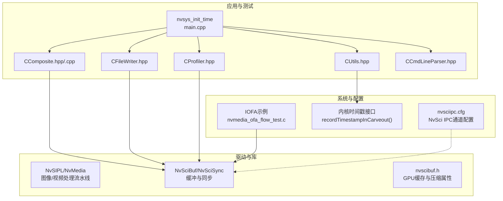
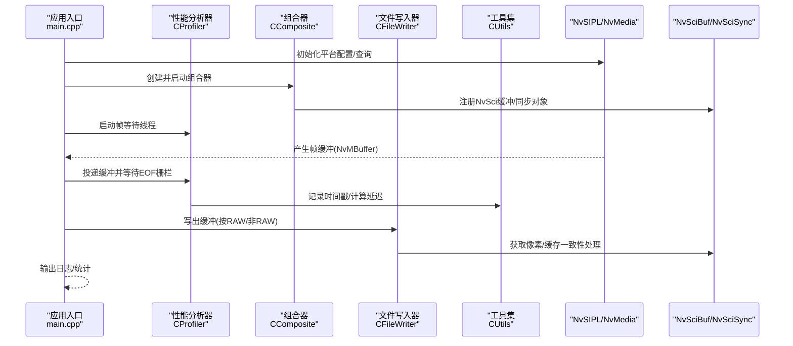
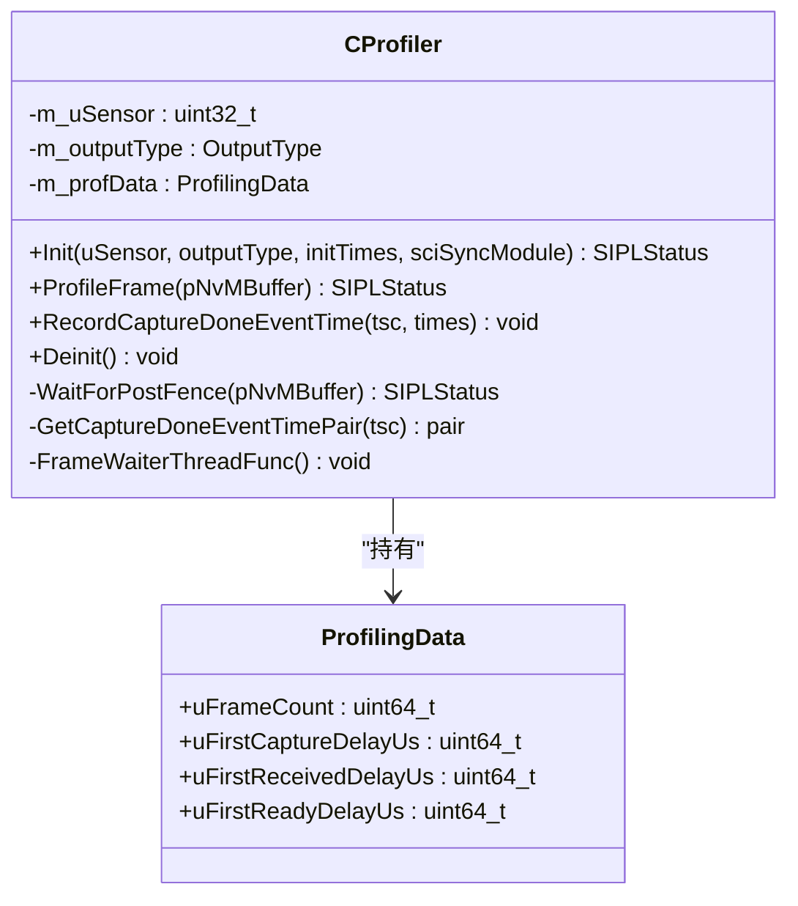
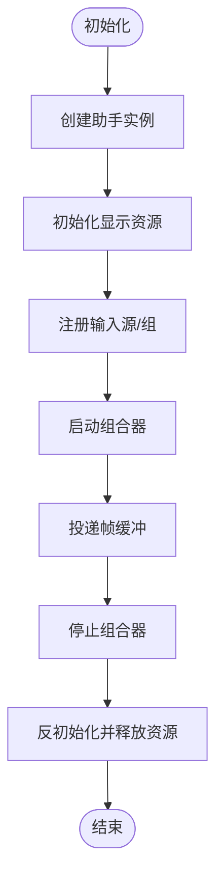
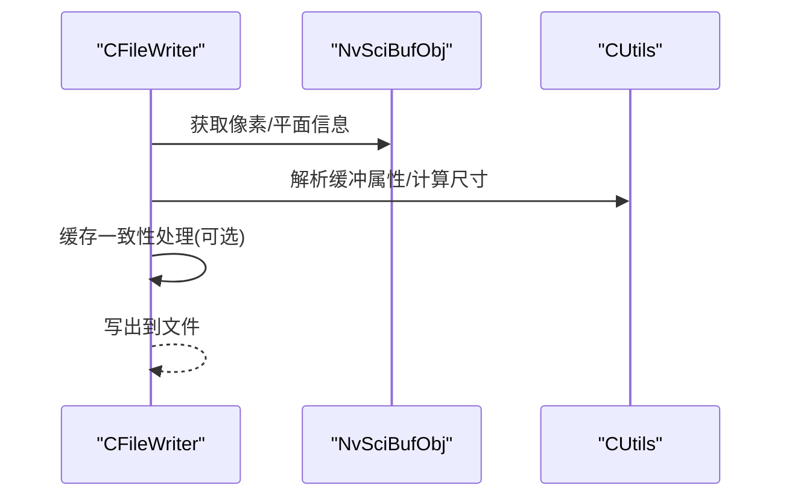
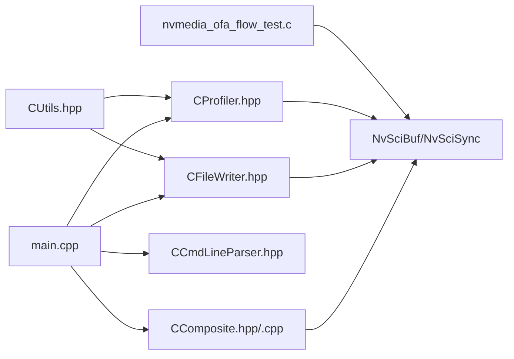

# 系统监控与分析

<cite>
**本文引用的文件**
- [main.cpp](file://driveos-6.0.5.0/drive-linux/tests/nvsys_init_time/main.cpp)
- [CProfiler.hpp](file://driveos-6.0.5.0/drive-linux/tests/nvsys_init_time/CProfiler.hpp)
- [CUtils.hpp](file://driveos-6.0.5.0/drive-linux/tests/nvsys_init_time/CUtils.hpp)
- [CComposite.hpp](file://driveos-6.0.5.0/drive-linux/tests/nvsys_init_time/CComposite.hpp)
- [CComposite.cpp](file://driveos-6.0.5.0/drive-linux/tests/nvsys_init_time/CComposite.cpp)
- [CCmdLineParser.hpp](file://driveos-6.0.5.0/drive-linux/tests/nvsys_init_time/CCmdLineParser.hpp)
- [CFileWriter.hpp](file://driveos-6.0.5.0/drive-linux/tests/nvsys_init_time/CFileWriter.hpp)
- [nvmedia_ofa_flow_test.c](file://driveos-6.0.6.0/drive-linux/samples/nvmedia_6x/iofa/flow/nvmedia_ofa_flow_test.c)
- [nvscibuf.h](file://driveos-6.0.6.0/drive-linux/include/nvscibuf.h)
- [nvsciipc.cfg](file://driveos-6.0.5.0/etc/nvsciipc.cfg)
</cite>

## 目录
1. [简介](#简介)
2. [项目结构](#项目结构)
3. [核心组件](#核心组件)
4. [架构总览](#架构总览)
5. [详细组件分析](#详细组件分析)
6. [依赖关系分析](#依赖关系分析)
7. [性能考量](#性能考量)
8. [故障排查指南](#故障排查指南)
9. [结论](#结论)
10. [附录](#附录)

## 简介
本指南面向DriveOS系统运维与开发人员，聚焦于系统监控与分析能力，围绕以下主题展开：
- 使用profiler工具进行CUDA性能分析、内存使用监控与GPU利用率分析
- 系统初始化时间分析方法（启动性能评估与优化策略）
- 实时监控指标采集与分析（CPU/GPU负载、内存使用、网络流量等）
- 日志分析技术与调试工具使用
- 性能基准测试与压力测试实施
- 监控仪表板搭建与告警机制配置

本指南以仓库中的nvsys_init_time测试套件为核心，结合NvSIPL/NvMedia流水线、NvSci同步与缓冲、以及示例IOFA流测试程序，给出可操作的实践路径。

## 项目结构
本项目在DriveOS中提供了多层级的监控与分析能力：
- 测试与示例层：nvsys_init_time用于系统初始化时间分析与帧处理流程监控；IOFA示例展示性能数据聚合与日志输出
- 核心库层：NvSIPL/NvMedia负责图像/视频处理流水线；NvSci负责跨进程/跨模块同步与缓冲管理
- 配置与工具层：NvSciIPC配置文件、内核/平台级时间戳记录接口

图表来源
- [main.cpp:681-800](file://driveos-6.0.5.0/drive-linux/tests/nvsys_init_time/main.cpp#L681-L800)
- [CProfiler.hpp:93-374](file://driveos-6.0.5.0/drive-linux/tests/nvsys_init_time/CProfiler.hpp#L93-L374)
- [CUtils.hpp:345-369](file://driveos-6.0.5.0/drive-linux/tests/nvsys_init_time/CUtils.hpp#L345-L369)
- [CComposite.hpp:115-206](file://driveos-6.0.5.0/drive-linux/tests/nvsys_init_time/CComposite.hpp#L115-L206)
- [CComposite.cpp:62-130](file://driveos-6.0.5.0/drive-linux/tests/nvsys_init_time/CComposite.cpp#L62-L130)
- [CFileWriter.hpp:33-182](file://driveos-6.0.5.0/drive-linux/tests/nvsys_init_time/CFileWriter.hpp#L33-L182)
- [CCmdLineParser.hpp:29-477](file://driveos-6.0.5.0/drive-linux/tests/nvsys_init_time/CCmdLineParser.hpp#L29-L477)
- [nvmedia_ofa_flow_test.c:991-1019](file://driveos-6.0.6.0/drive-linux/samples/nvmedia_6x/iofa/flow/nvmedia_ofa_flow_test.c#L991-L1019)
- [nvscibuf.h:661-724](file://driveos-6.0.6.0/drive-linux/include/nvscibuf.h#L661-L724)
- [nvsciipc.cfg:1-81](file://driveos-6.0.5.0/etc/nvsciipc.cfg#L1-L81)

章节来源
- [main.cpp:681-800](file://driveos-6.0.5.0/drive-linux/tests/nvsys_init_time/main.cpp#L681-L800)
- [CProfiler.hpp:93-374](file://driveos-6.0.5.0/drive-linux/tests/nvsys_init_time/CProfiler.hpp#L93-L374)
- [CUtils.hpp:345-369](file://driveos-6.0.5.0/drive-linux/tests/nvsys_init_time/CUtils.hpp#L345-L369)
- [CComposite.hpp:115-206](file://driveos-6.0.5.0/drive-linux/tests/nvsys_init_time/CComposite.hpp#L115-L206)
- [CComposite.cpp:62-130](file://driveos-6.0.5.0/drive-linux/tests/nvsys_init_time/CComposite.cpp#L62-L130)
- [CFileWriter.hpp:33-182](file://driveos-6.0.5.0/drive-linux/tests/nvsys_init_time/CFileWriter.hpp#L33-L182)
- [CCmdLineParser.hpp:29-477](file://driveos-6.0.5.0/drive-linux/tests/nvsys_init_time/CCmdLineParser.hpp#L29-L477)
- [nvmedia_ofa_flow_test.c:991-1019](file://driveos-6.0.6.0/drive-linux/samples/nvmedia_6x/iofa/flow/nvmedia_ofa_flow_test.c#L991-L1019)
- [nvscibuf.h:661-724](file://driveos-6.0.6.0/drive-linux/include/nvscibuf.h#L661-L724)
- [nvsciipc.cfg:1-81](file://driveos-6.0.5.0/etc/nvsciipc.cfg#L1-L81)

## 核心组件
- 初始化时间分析器（CProfiler）：负责记录帧捕获事件时间、等待后处理完成栅栏、计算首帧延迟与处理延迟
- 工具集（CUtils）：提供日志、缓冲区属性解析、以及内核时间戳写入接口
- 组合器（CComposite）：管理显示/合成流水线，注册NvSci缓冲与同步对象，协调帧投递
- 文件写入器（CFileWriter）：将NvSci缓冲内容写出到文件，支持RAW/非RAW格式转换与缓存一致性
- 命令行解析器（CCmdLineParser）：控制平台配置、输出开关、调试级别、NvSci开关等
- IOFA示例（nvmedia_ofa_flow_test.c）：展示性能数据聚合与日志输出流程

章节来源
- [CProfiler.hpp:93-374](file://driveos-6.0.5.0/drive-linux/tests/nvsys_init_time/CProfiler.hpp#L93-L374)
- [CUtils.hpp:184-272](file://driveos-6.0.5.0/drive-linux/tests/nvsys_init_time/CUtils.hpp#L184-L272)
- [CComposite.hpp:115-206](file://driveos-6.0.5.0/drive-linux/tests/nvsys_init_time/CComposite.hpp#L115-L206)
- [CComposite.cpp:62-130](file://driveos-6.0.5.0/drive-linux/tests/nvsys_init_time/CComposite.cpp#L62-L130)
- [CFileWriter.hpp:33-182](file://driveos-6.0.5.0/drive-linux/tests/nvsys_init_time/CFileWriter.hpp#L33-L182)
- [CCmdLineParser.hpp:29-477](file://driveos-6.0.5.0/drive-linux/tests/nvsys_init_time/CCmdLineParser.hpp#L29-L477)
- [nvmedia_ofa_flow_test.c:991-1019](file://driveos-6.0.6.0/drive-linux/samples/nvmedia_6x/iofa/flow/nvmedia_ofa_flow_test.c#L991-L1019)

## 架构总览
下图展示了从应用入口到图像/视频处理流水线、再到文件输出与日志记录的整体链路，以及NvSci同步与缓冲在其中的作用。

图表来源
- [main.cpp:681-800](file://driveos-6.0.5.0/drive-linux/tests/nvsys_init_time/main.cpp#L681-L800)
- [CProfiler.hpp:132-177](file://driveos-6.0.5.0/drive-linux/tests/nvsys_init_time/CProfiler.hpp#L132-L177)
- [CComposite.cpp:358-383](file://driveos-6.0.5.0/drive-linux/tests/nvsys_init_time/CComposite.cpp#L358-L383)
- [CFileWriter.hpp:52-166](file://driveos-6.0.5.0/drive-linux/tests/nvsys_init_time/CFileWriter.hpp#L52-L166)
- [CUtils.hpp:345-369](file://driveos-6.0.5.0/drive-linux/tests/nvsys_init_time/CUtils.hpp#L345-L369)

## 详细组件分析

### 组件A：性能分析器（CProfiler）
职责与流程
- 接收来自流水线的帧缓冲，等待EOF栅栏确保后处理完成
- 通过时间戳对齐计算首帧捕获/接收/就绪延迟
- 提供线程安全队列与条件变量，保证多线程环境下的稳定性

关键实现要点
- 帧等待与栅栏检查：通过NvSciSyncFenceWait等待后处理完成，校验任务状态
- 时间对齐：利用CaptureDone事件时间与不同时间基（PTP/Monotonic）进行对齐
- 首帧延迟计算：首次帧到达时记录捕获、接收、就绪三个阶段的时间差

图表来源
- [CProfiler.hpp:93-374](file://driveos-6.0.5.0/drive-linux/tests/nvsys_init_time/CProfiler.hpp#L93-L374)

章节来源
- [CProfiler.hpp:132-177](file://driveos-6.0.5.0/drive-linux/tests/nvsys_init_time/CProfiler.hpp#L132-L177)
- [CProfiler.hpp:190-229](file://driveos-6.0.5.0/drive-linux/tests/nvsys_init_time/CProfiler.hpp#L190-L229)
- [CProfiler.hpp:231-252](file://driveos-6.0.5.0/drive-linux/tests/nvsys_init_time/CProfiler.hpp#L231-L252)
- [CProfiler.hpp:254-347](file://driveos-6.0.5.0/drive-linux/tests/nvsys_init_time/CProfiler.hpp#L254-L347)

### 组件B：组合器（CComposite）
职责与流程
- 管理显示/合成资源，注册输入源与组，维护NvSci缓冲与同步对象
- 将帧缓冲投递至对应输入队列，支持RAW/非RAW格式转换与RGBA缓冲注册
- 提供开始/停止/反初始化流程，释放所有资源

图表来源
- [CComposite.hpp:115-206](file://driveos-6.0.5.0/drive-linux/tests/nvsys_init_time/CComposite.hpp#L115-L206)
- [CComposite.cpp:62-130](file://driveos-6.0.5.0/drive-linux/tests/nvsys_init_time/CComposite.cpp#L62-L130)
- [CComposite.cpp:358-383](file://driveos-6.0.5.0/drive-linux/tests/nvsys_init_time/CComposite.cpp#L358-L383)
- [CComposite.cpp:435-467](file://driveos-6.0.5.0/drive-linux/tests/nvsys_init_time/CComposite.cpp#L435-L467)
- [CComposite.cpp:469-502](file://driveos-6.0.5.0/drive-linux/tests/nvsys_init_time/CComposite.cpp#L469-L502)

章节来源
- [CComposite.hpp:115-206](file://driveos-6.0.5.0/drive-linux/tests/nvsys_init_time/CComposite.hpp#L115-L206)
- [CComposite.cpp:62-130](file://driveos-6.0.5.0/drive-linux/tests/nvsys_init_time/CComposite.cpp#L62-L130)
- [CComposite.cpp:358-383](file://driveos-6.0.5.0/drive-linux/tests/nvsys_init_time/CComposite.cpp#L358-L383)
- [CComposite.cpp:435-467](file://driveos-6.0.5.0/drive-linux/tests/nvsys_init_time/CComposite.cpp#L435-L467)
- [CComposite.cpp:469-502](file://driveos-6.0.5.0/drive-linux/tests/nvsys_init_time/CComposite.cpp#L469-L502)

### 组件C：文件写入器（CFileWriter）
职责与流程
- 等待EOF栅栏（非RAW场景），解析缓冲属性，按格式转换并写出
- 处理缓存一致性（CPU/GPU缓存维护），支持多平面与不同色度格式

图表来源
- [CFileWriter.hpp:52-166](file://driveos-6.0.5.0/drive-linux/tests/nvsys_init_time/CFileWriter.hpp#L52-L166)
- [CUtils.hpp:337-369](file://driveos-6.0.5.0/drive-linux/tests/nvsys_init_time/CUtils.hpp#L337-L369)

章节来源
- [CFileWriter.hpp:33-182](file://driveos-6.0.5.0/drive-linux/tests/nvsys_init_time/CFileWriter.hpp#L33-L182)
- [CUtils.hpp:337-369](file://driveos-6.0.5.0/drive-linux/tests/nvsys_init_time/CUtils.hpp#L337-L369)

### 组件D：命令行解析器（CCmdLineParser）
职责与流程
- 解析平台配置、输出开关、调试级别、NvSci开关、文件转储前缀等参数
- 支持列出可用配置、打印帮助信息、设置传感器特性模式等

章节来源
- [CCmdLineParser.hpp:29-477](file://driveos-6.0.5.0/drive-linux/tests/nvsys_init_time/CCmdLineParser.hpp#L29-L477)

### 组件E：IOFA性能数据处理（nvmedia_ofa_flow_test.c）
职责与流程
- 聚合计数器，计算平均SW/HW/同步等待时间，并输出日志
- 展示性能数据聚合与失败计数的典型做法

章节来源
- [nvmedia_ofa_flow_test.c:991-1019](file://driveos-6.0.6.0/drive-linux/samples/nvmedia_6x/iofa/flow/nvmedia_ofa_flow_test.c#L991-L1019)
- [nvmedia_ofa_flow_test.c:1879-1935](file://driveos-6.0.6.0/drive-linux/samples/nvmedia_6x/iofa/flow/nvmedia_ofa_flow_test.c#L1879-L1935)

## 依赖关系分析
- 应用入口依赖：平台查询、命令行解析、组合器、文件写入器、性能分析器
- 组合器依赖：NvSciBuf/NvSciSync模块，用于缓冲与同步对象注册
- 文件写入器依赖：NvSciBuf/NvSciSync模块，用于像素读取与缓存一致性
- 性能分析器依赖：NvSciSync栅栏等待与时间戳对齐
- 工具集提供：日志、缓冲属性解析、内核时间戳写入接口
- 示例IOFA：展示性能数据聚合与日志输出

图表来源
- [main.cpp:681-800](file://driveos-6.0.5.0/drive-linux/tests/nvsys_init_time/main.cpp#L681-L800)
- [CProfiler.hpp:93-374](file://driveos-6.0.5.0/drive-linux/tests/nvsys_init_time/CProfiler.hpp#L93-L374)
- [CComposite.cpp:62-130](file://driveos-6.0.5.0/drive-linux/tests/nvsys_init_time/CComposite.cpp#L62-L130)
- [CFileWriter.hpp:33-182](file://driveos-6.0.5.0/drive-linux/tests/nvsys_init_time/CFileWriter.hpp#L33-L182)
- [CUtils.hpp:184-272](file://driveos-6.0.5.0/drive-linux/tests/nvsys_init_time/CUtils.hpp#L184-L272)
- [nvmedia_ofa_flow_test.c:991-1019](file://driveos-6.0.6.0/drive-linux/samples/nvmedia_6x/iofa/flow/nvmedia_ofa_flow_test.c#L991-L1019)

章节来源
- [main.cpp:681-800](file://driveos-6.0.5.0/drive-linux/tests/nvsys_init_time/main.cpp#L681-L800)
- [CProfiler.hpp:93-374](file://driveos-6.0.5.0/drive-linux/tests/nvsys_init_time/CProfiler.hpp#L93-L374)
- [CComposite.cpp:62-130](file://driveos-6.0.5.0/drive-linux/tests/nvsys_init_time/CComposite.cpp#L62-L130)
- [CFileWriter.hpp:33-182](file://driveos-6.0.5.0/drive-linux/tests/nvsys_init_time/CFileWriter.hpp#L33-L182)
- [CUtils.hpp:184-272](file://driveos-6.0.5.0/drive-linux/tests/nvsys_init_time/CUtils.hpp#L184-L272)
- [nvmedia_ofa_flow_test.c:991-1019](file://driveos-6.0.6.0/drive-linux/samples/nvmedia_6x/iofa/flow/nvmedia_ofa_flow_test.c#L991-L1019)

## 性能考量
- CUDA性能分析
  - 利用NvSci栅栏等待与时间戳对齐，区分SW与HW处理阶段
  - 参考IOFA示例的平均耗时统计方法，聚合多帧数据得到稳定指标
- 内存使用监控
  - 通过NvSciBuf属性解析与缓存一致性处理，避免CPU/GPU缓存不一致导致的额外拷贝
  - 在RAW/非RAW场景下选择合适的缓冲布局与字节对齐，减少带宽占用
- GPU利用率分析
  - 结合NvSciBuf的GPU缓存与压缩属性，合理设置缓存策略以提升吞吐
  - 通过组合器与文件写入器的缓冲注册流程，观察跨模块同步开销

章节来源
- [nvmedia_ofa_flow_test.c:991-1019](file://driveos-6.0.6.0/drive-linux/samples/nvmedia_6x/iofa/flow/nvmedia_ofa_flow_test.c#L991-L1019)
- [nvscibuf.h:661-724](file://driveos-6.0.6.0/drive-linux/include/nvscibuf.h#L661-L724)
- [CFileWriter.hpp:149-163](file://driveos-6.0.5.0/drive-linux/tests/nvsys_init_time/CFileWriter.hpp#L149-L163)

## 故障排查指南
- 栅栏等待超时或失败
  - 检查后处理引擎是否正常生成EOF栅栏，确认任务状态为成功
  - 调整等待超时阈值，定位异常帧
- 缓冲属性解析错误
  - 核对NvSciBuf颜色格式、位深、平面数量与布局，确保转换逻辑正确
- 文件写入失败
  - 检查缓存一致性处理是否执行，必要时对缓冲区域进行Flush/Clean
- 日志级别与调试信息
  - 通过命令行解析器设置详细日志级别，定位问题发生位置
- NvSci IPC配置
  - 校验nvsciipc.cfg中的端点与队列参数，确保跨进程/跨模块通信正常

章节来源
- [CProfiler.hpp:190-229](file://driveos-6.0.5.0/drive-linux/tests/nvsys_init_time/CProfiler.hpp#L190-L229)
- [CFileWriter.hpp:104-163](file://driveos-6.0.5.0/drive-linux/tests/nvsys_init_time/CFileWriter.hpp#L104-L163)
- [CCmdLineParser.hpp:29-477](file://driveos-6.0.5.0/drive-linux/tests/nvsys_init_time/CCmdLineParser.hpp#L29-L477)
- [nvsciipc.cfg:1-81](file://driveos-6.0.5.0/etc/nvsciipc.cfg#L1-L81)

## 结论
通过nvsys_init_time测试套件与相关组件，DriveOS提供了从系统初始化时间分析到CUDA性能、内存与GPU利用率的全链路监控能力。结合NvSci同步与缓冲、IOFA示例的性能聚合方法，以及完善的日志与命令行工具，运维与开发团队可以建立可靠的监控与诊断体系，并据此制定优化策略与告警机制。

## 附录
- 监控仪表板建议
  - 指标：首帧延迟、帧间延迟、GPU栅栏等待时间、文件写入耗时、帧丢弃/不连续计数
  - 数据来源：CProfiler统计、CFileWriter日志、IOFA示例聚合结果
- 告警机制配置
  - 阈值：首帧延迟超过X毫秒、帧间延迟抖动超过Y%、文件写入失败率超过Z%
  - 触发：结合日志级别与命令行参数，自动记录内核时间戳并触发告警