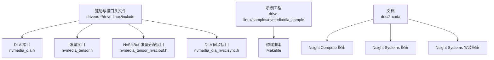
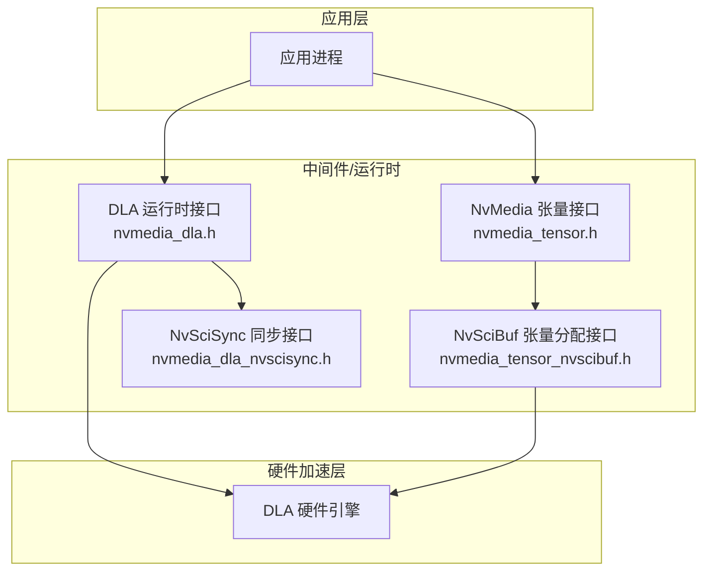
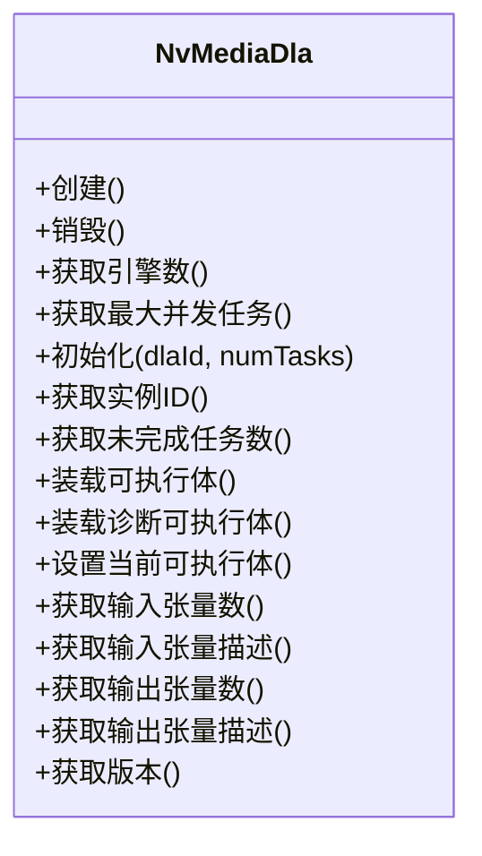
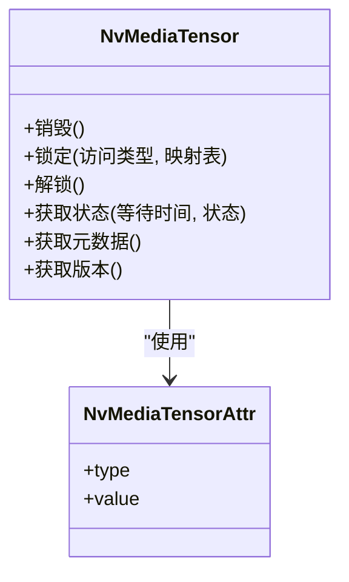
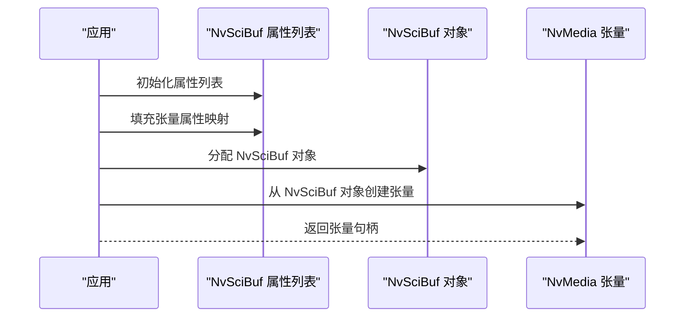
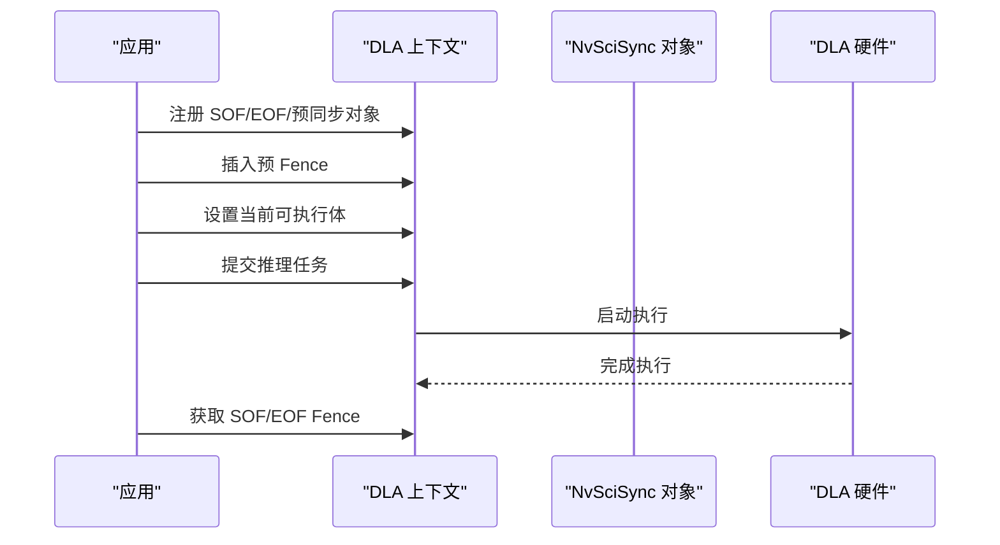
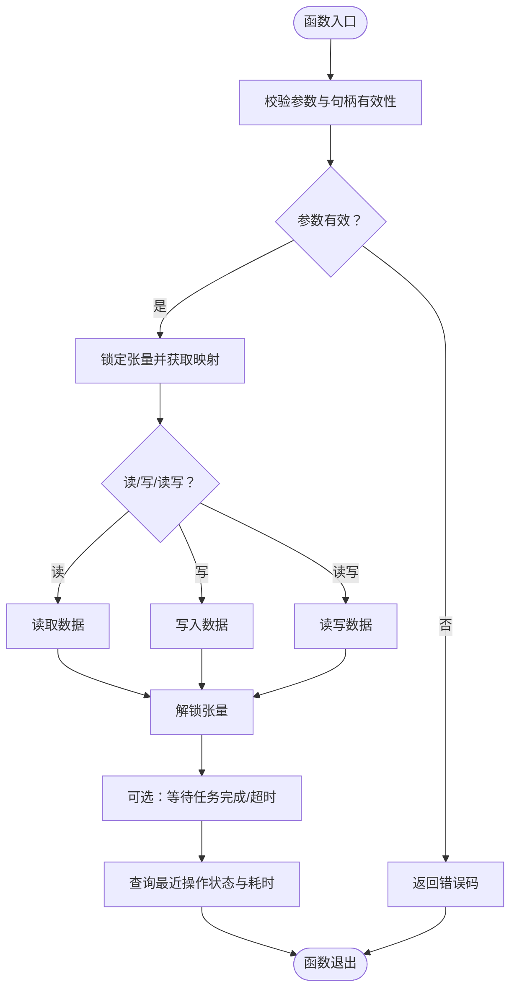
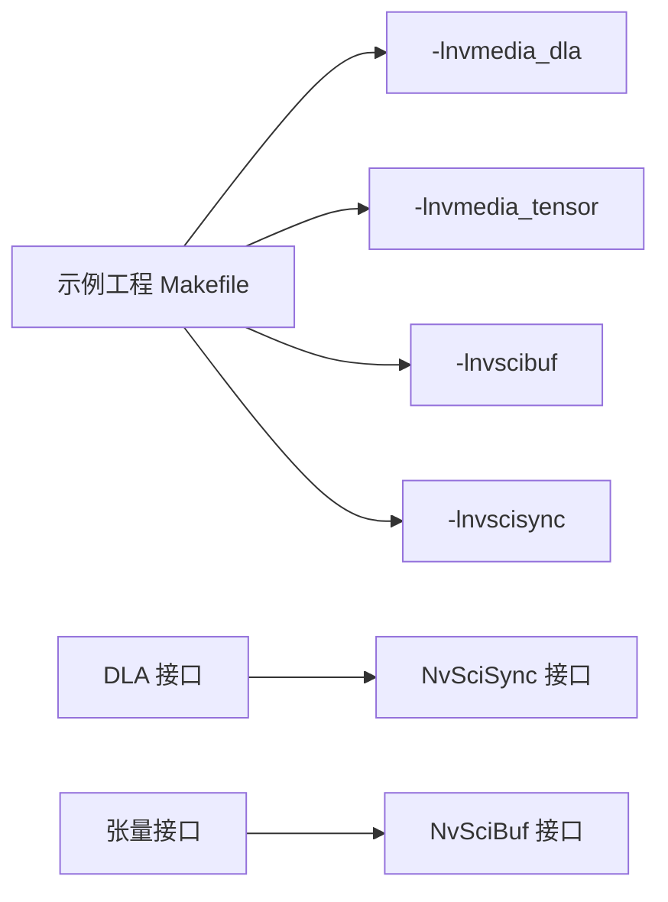

# 高级主题

<cite>
**本文引用的文件**
- [nvmedia_dla.h](file://driveos-6.0.5.0/drive-linux/include/nvmedia_dla.h)
- [nvmedia_tensor.h](file://driveos-6.0.5.0/drive-linux/include/nvmedia_tensor.h)
- [nvmedia_tensor_nvscibuf.h](file://driveos-6.0.5.0/drive-linux/include/nvmedia_tensor_nvscibuf.h)
- [nvmedia_dla_nvscisync.h](file://driveos-6.0.5.0/drive-linux/include/nvmedia_dla_nvscisync.h)
- [dla_sample/Makefile](file://driveos-6.0.5.0/drive-linux/samples/nvmedia/dla_sample/Makefile)
- [nsight-compute-ProfilingGuide.pdf](file://doc/2-cuda/nsight-compute/nsight-compute-ProfilingGuide.pdf)
- [nsight-sys-UserGuide.pdf](file://doc/2-cuda/nsight-system/nsight-sys-UserGuide.pdf)
- [nsight-sys-InstallationGuide.pdf](file://doc/2-cuda/nsight-system/nsight-sys-InstallationGuide.pdf)
</cite>

## 目录
1. [简介](#简介)
2. [项目结构](#项目结构)
3. [核心组件](#核心组件)
4. [架构总览](#架构总览)
5. [详细组件分析](#详细组件分析)
6. [依赖关系分析](#依赖关系分析)
7. [性能考量](#性能考量)
8. [故障排查指南](#故障排查指南)
9. [结论](#结论)
10. [附录](#附录)

## 简介
本文件面向高级用户与系统工程师，围绕 DriveOS 的 GPU 加速优化、CUDA 编程、深度学习推理（DLR）、DLA（深度学习加速器）使用与性能优化、内存管理与并行处理、实时性保障、安全性与可靠性设计、系统监控与性能分析（含 Nsight 工具链）等方面进行深入讲解，并提供专家级实践建议与最佳实践，帮助开发者充分发挥 DriveOS 的强大能力。

## 项目结构
本仓库包含多个版本的 DriveOS 发行版与配套文档，其中与“高级主题”直接相关的关键目录与文件如下：
- 驱动与接口头文件：位于各版本 drive-linux/include 下，涵盖 DLA、张量（Tensor）、NvSciBuf/NvSciSync 等核心接口
- 示例工程：位于 drive-linux/samples 下，如 DLA 示例工程，演示如何构建与链接 DLA/Tensor/NvSciSync 库
- 文档：位于 doc/2-cuda 下，包含 Nsight Compute/Systems 使用指南与安装指南

**图表来源**
- [nvmedia_dla.h](file://driveos-6.0.5.0/drive-linux/include/nvmedia_dla.h)
- [nvmedia_tensor.h](file://driveos-6.0.5.0/drive-linux/include/nvmedia_tensor.h)
- [nvmedia_tensor_nvscibuf.h](file://driveos-6.0.5.0/drive-linux/include/nvmedia_tensor_nvscibuf.h)
- [nvmedia_dla_nvscisync.h](file://driveos-6.0.5.0/drive-linux/include/nvmedia_dla_nvscisync.h)
- [dla_sample/Makefile](file://driveos-6.0.5.0/drive-linux/samples/nvmedia/dla_sample/Makefile)
- [nsight-compute-ProfilingGuide.pdf](file://doc/2-cuda/nsight-compute/nsight-compute-ProfilingGuide.pdf)
- [nsight-sys-UserGuide.pdf](file://doc/2-cuda/nsight-system/nsight-sys-UserGuide.pdf)
- [nsight-sys-InstallationGuide.pdf](file://doc/2-cuda/nsight-system/nsight-sys-InstallationGuide.pdf)

**章节来源**
- [nvmedia_dla.h](file://driveos-6.0.5.0/drive-linux/include/nvmedia_dla.h)
- [nvmedia_tensor.h](file://driveos-6.0.5.0/drive-linux/include/nvmedia_tensor.h)
- [nvmedia_tensor_nvscibuf.h](file://driveos-6.0.5.0/drive-linux/include/nvmedia_tensor_nvscibuf.h)
- [nvmedia_dla_nvscisync.h](file://driveos-6.0.5.0/drive-linux/include/nvmedia_dla_nvscisync.h)
- [dla_sample/Makefile](file://driveos-6.0.5.0/drive-linux/samples/nvmedia/dla_sample/Makefile)

## 核心组件
- DLA 运行时接口：提供设备句柄、上下文初始化、引擎数量查询、任务队列上限、加载可执行体、输入/输出张量描述等能力
- 张量处理接口：提供张量创建属性、CPU 映射访问、状态查询、元数据填充等
- NvSciBuf 张量分配接口：通过 NvSciBuf 属性列表分配共享缓冲区，再导入为 NvMedia 张量
- DLA 同步接口：与 NvSciSync 协作，设置 SOF/EOF Fence、预 Fence、注册同步对象等，支撑确定性与实时性

上述组件共同构成 DriveOS 上的深度学习推理管线：从张量准备、DLA 可执行体装载、任务提交到同步与结果获取。

**章节来源**
- [nvmedia_dla.h](file://driveos-6.0.5.0/drive-linux/include/nvmedia_dla.h)
- [nvmedia_tensor.h](file://driveos-6.0.5.0/drive-linux/include/nvmedia_tensor.h)
- [nvmedia_tensor_nvscibuf.h](file://driveos-6.0.5.0/drive-linux/include/nvmedia_tensor_nvscibuf.h)
- [nvmedia_dla_nvscisync.h](file://driveos-6.0.5.0/drive-linux/include/nvmedia_dla_nvscisync.h)

## 架构总览
下图展示了从应用层到硬件加速层的端到端路径：应用通过 NvMedia 张量与 DLA 接口组织推理任务，借助 NvSciBuf/NvSciSync 实现跨模块/进程的内存与同步协作，最终由 DLA 执行深度学习算子。

**图表来源**
- [nvmedia_dla.h](file://driveos-6.0.5.0/drive-linux/include/nvmedia_dla.h)
- [nvmedia_tensor.h](file://driveos-6.0.5.0/drive-linux/include/nvmedia_tensor.h)
- [nvmedia_tensor_nvscibuf.h](file://driveos-6.0.5.0/drive-linux/include/nvmedia_tensor_nvscibuf.h)
- [nvmedia_dla_nvscisync.h](file://driveos-6.0.5.0/drive-linux/include/nvmedia_dla_nvscisync.h)

## 详细组件分析

### DLA 组件分析
- 设备与上下文：创建 DLA 上下文、选择具体引擎实例、配置并发任务数
- 装载与执行：装载可执行体（支持诊断型装载）、设置当前可执行体、查询输入/输出张量描述
- 任务与状态：查询未完成任务数、默认超时、任务生命周期管理
- 版本信息：查询 DLA 库与 UMD 版本

**图表来源**
- [nvmedia_dla.h](file://driveos-6.0.5.0/drive-linux/include/nvmedia_dla.h)

**章节来源**
- [nvmedia_dla.h](file://driveos-6.0.5.0/drive-linux/include/nvmedia_dla.h)

### 张量处理组件分析
- 张量属性：数据类型、位宽、维度顺序、CPU 访问方式（缓存/非缓存/未映射）、分配类型（SOC DRAM/CVSRAM）
- 创建与映射：通过宏/结构体初始化属性，锁定/解锁以获得 CPU 映射指针
- 元数据与状态：填充元数据、查询最近操作状态（含耗时）
- 版本信息：查询张量库版本

**图表来源**
- [nvmedia_tensor.h](file://driveos-6.0.5.0/drive-linux/include/nvmedia_tensor.h)

**章节来源**
- [nvmedia_tensor.h](file://driveos-6.0.5.0/drive-linux/include/nvmedia_tensor.h)

### NvSciBuf 张量分配组件分析
- 初始化与去初始化：在使用 NvSciBuf 分配前需初始化
- 填充属性：将张量属性映射为 NvSciBuf 属性列表
- 从 NvSciBuf 创建张量：完成分配后导入为 NvMedia 张量
- 版本信息：查询该接口版本

**图表来源**
- [nvmedia_tensor_nvscibuf.h](file://driveos-6.0.5.0/drive-linux/include/nvmedia_tensor_nvscibuf.h)

**章节来源**
- [nvmedia_tensor_nvscibuf.h](file://driveos-6.0.5.0/drive-linux/include/nvmedia_tensor_nvscibuf.h)

### DLA 同步组件分析
- 同步对象注册与注销：将 NvSciSync 对象按用途（SOF/EOF/预同步）注册到 DLA
- 设置 SOF/EOF：为当前提交关联起始/结束事件
- 插入预 Fence：在提交前插入最多若干个预 Fence，确保时序约束
- 获取 Fence：在提交后获取对应 SOF/EOF Fence，用于上层同步或统计

**图表来源**
- [nvmedia_dla_nvscisync.h](file://driveos-6.0.5.0/drive-linux/include/nvmedia_dla_nvscisync.h)

**章节来源**
- [nvmedia_dla_nvscisync.h](file://driveos-6.0.5.0/drive-linux/include/nvmedia_dla_nvscisync.h)

### 复杂逻辑流程：张量锁定与状态轮询

**图表来源**
- [nvmedia_tensor.h](file://driveos-6.0.5.0/drive-linux/include/nvmedia_tensor.h)

**章节来源**
- [nvmedia_tensor.h](file://driveos-6.0.5.0/drive-linux/include/nvmedia_tensor.h)

## 依赖关系分析
- 示例工程 Makefile 明确链接了 DLA、张量、NvSciBuf、NvSciSync 等库，体现高层应用对底层接口的依赖
- DLA 与 NvSciSync 紧密耦合：DLA 通过 NvSciSync 实现确定性同步与实时性保障
- 张量与 NvSciBuf 解耦：张量接口独立于 NvSciBuf，但可通过 NvSciBuf 实现高性能共享内存分配

**图表来源**
- [dla_sample/Makefile](file://driveos-6.0.5.0/drive-linux/samples/nvmedia/dla_sample/Makefile)
- [nvmedia_dla.h](file://driveos-6.0.5.0/drive-linux/include/nvmedia_dla.h)
- [nvmedia_dla_nvscisync.h](file://driveos-6.0.5.0/drive-linux/include/nvmedia_dla_nvscisync.h)
- [nvmedia_tensor.h](file://driveos-6.0.5.0/drive-linux/include/nvmedia_tensor.h)
- [nvmedia_tensor_nvscibuf.h](file://driveos-6.0.5.0/drive-linux/include/nvmedia_tensor_nvscibuf.h)

**章节来源**
- [dla_sample/Makefile](file://driveos-6.0.5.0/drive-linux/samples/nvmedia/dla_sample/Makefile)

## 性能考量
- 并发与队列：合理设置 DLA 并发任务数，避免超过硬件最大未完成任务上限；通过预 Fence 与 SOF/EOF Fence 控制流水线节奏
- 内存与带宽：优先使用 NvSciBuf 在进程间共享高带宽缓冲；根据场景选择 CPU 访问模式（缓存/非缓存/未映射），平衡延迟与一致性
- 张量布局与对齐：遵循张量维度顺序与对齐要求，减少跨引擎拷贝与转换开销
- 同步最小化：仅在必要处插入 Fence，避免过度同步导致吞吐下降
- Profiling：结合 Nsight Compute/Systems 进行热点定位与系统级分析，持续迭代优化

[本节为通用指导，无需特定文件引用]

## 故障排查指南
- 参数校验失败：检查句柄与参数范围，参考接口文档中的参数约束与返回值语义
- 超时与阻塞：合理设置等待时间与超时阈值；对长时间操作采用异步策略并配合状态查询
- 同步对象问题：确认已正确注册 NvSciSync 对象并匹配用途；避免重复注册或在销毁前仍有使用
- 任务队列溢出：降低并发或增加队列容量；监控未完成任务数，防止积压
- 版本不匹配：核对 DLA 库、UMD 与运行时版本，确保兼容性

**章节来源**
- [nvmedia_dla.h](file://driveos-6.0.5.0/drive-linux/include/nvmedia_dla.h)
- [nvmedia_tensor.h](file://driveos-6.0.5.0/drive-linux/include/nvmedia_tensor.h)
- [nvmedia_dla_nvscisync.h](file://driveos-6.0.5.0/drive-linux/include/nvmedia_dla_nvscisync.h)

## 结论
通过 DLA、张量、NvSciBuf/NvSciSync 的协同，DriveOS 能够在车载与边缘 AI 场景中提供高性能、低延迟、可确定性的深度学习推理能力。结合 Nsight 工具链进行系统级分析与调优，配合合理的内存与并行策略，可进一步提升整体系统性能与稳定性。

[本节为总结，无需特定文件引用]

## 附录
- Nsight Compute 指南：用于 CUDA/K40s/Orin 等平台的内核级性能剖析与热点定位
- Nsight Systems 用户指南：用于系统级可视化与端到端时序分析
- Nsight Systems 安装指南：确保工具链正确安装与环境配置

**章节来源**
- [nsight-compute-ProfilingGuide.pdf](file://doc/2-cuda/nsight-compute/nsight-compute-ProfilingGuide.pdf)
- [nsight-sys-UserGuide.pdf](file://doc/2-cuda/nsight-system/nsight-sys-UserGuide.pdf)
- [nsight-sys-InstallationGuide.pdf](file://doc/2-cuda/nsight-system/nsight-sys-InstallationGuide.pdf)